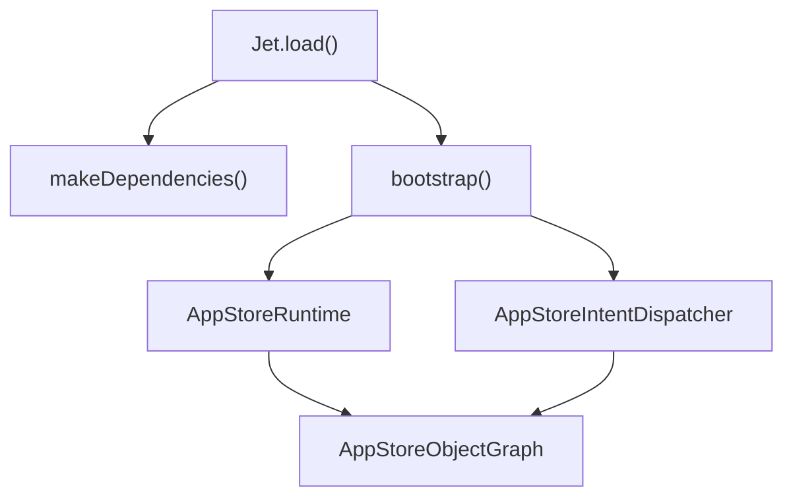

# Overview

-   [shared/metrics-8/src/impression-provider.ts](https://github.com/Chesszyh/apps.apple.com/blob/279d0c4d/shared/metrics-8/src/impression-provider.ts)
-   [shared/metrics-8/src/impression-snapshot-provider.ts](https://github.com/Chesszyh/apps.apple.com/blob/279d0c4d/shared/metrics-8/src/impression-snapshot-provider.ts)
-   [shared/metrics-8/src/impressions/index.ts](https://github.com/Chesszyh/apps.apple.com/blob/279d0c4d/shared/metrics-8/src/impressions/index.ts)
-   [shared/metrics-8/src/index.ts](https://github.com/Chesszyh/apps.apple.com/blob/279d0c4d/shared/metrics-8/src/index.ts)
-   [src/components/jet/shelf/Shelf.svelte](https://github.com/Chesszyh/apps.apple.com/blob/279d0c4d/src/components/jet/shelf/Shelf.svelte)
-   [src/jet/action-handlers/browser.ts](https://github.com/Chesszyh/apps.apple.com/blob/279d0c4d/src/jet/action-handlers/browser.ts)
-   [src/jet/action-handlers/compound-action.ts](https://github.com/Chesszyh/apps.apple.com/blob/279d0c4d/src/jet/action-handlers/compound-action.ts)
-   [src/jet/action-handlers/external-url-action.ts](https://github.com/Chesszyh/apps.apple.com/blob/279d0c4d/src/jet/action-handlers/external-url-action.ts)
-   [src/jet/bootstrap.ts](https://github.com/Chesszyh/apps.apple.com/blob/279d0c4d/src/jet/bootstrap.ts)
-   [src/jet/intents/route-url/route-url-controller.ts](https://github.com/Chesszyh/apps.apple.com/blob/279d0c4d/src/jet/intents/route-url/route-url-controller.ts)
-   [src/jet/intents/route-url/route-url-intent.ts](https://github.com/Chesszyh/apps.apple.com/blob/279d0c4d/src/jet/intents/route-url/route-url-intent.ts)
-   [src/jet/intents/static-message-pages/carrier-page-intent-controller.ts](https://github.com/Chesszyh/apps.apple.com/blob/279d0c4d/src/jet/intents/static-message-pages/carrier-page-intent-controller.ts)
-   [src/jet/intents/static-message-pages/contingent-price-page-intent-controller.ts](https://github.com/Chesszyh/apps.apple.com/blob/279d0c4d/src/jet/intents/static-message-pages/contingent-price-page-intent-controller.ts)
-   [src/jet/intents/static-message-pages/invoice-page-intent-controller.ts](https://github.com/Chesszyh/apps.apple.com/blob/279d0c4d/src/jet/intents/static-message-pages/invoice-page-intent-controller.ts)
-   [src/jet/jet.ts](https://github.com/Chesszyh/apps.apple.com/blob/279d0c4d/src/jet/jet.ts)
-   [src/jet/metrics/providers/StorefrontFieldsProvider.ts](https://github.com/Chesszyh/apps.apple.com/blob/279d0c4d/src/jet/metrics/providers/StorefrontFieldsProvider.ts)
-   [src/jet/metrics/providers/index.ts](https://github.com/Chesszyh/apps.apple.com/blob/279d0c4d/src/jet/metrics/providers/index.ts)
-   [src/jet/models/external-action.ts](https://github.com/Chesszyh/apps.apple.com/blob/279d0c4d/src/jet/models/external-action.ts)
-   [src/jet/svelte.ts](https://github.com/Chesszyh/apps.apple.com/blob/279d0c4d/src/jet/svelte.ts)

## Purpose

This document provides a high-level introduction to the App Store web application codebase located at [https://github.com/Chesszyh/apps.apple.com](https://github.com/Chesszyh/apps.apple.com). It covers the major architectural systems, core design patterns, and the request lifecycle from URL routing to rendered UI.

For detailed information about specific subsystems:

-   Jet framework details: see [Jet Application Core](#2.1)
-   Metrics implementation: see [Metrics and Analytics](#3)
-   Page and component rendering: see [Page Rendering System](#4)
-   Specific shelf types: see [Shelf Type Reference](#7)

## System Purpose

This codebase implements a server-side rendered (SSR) and client-hydrated web application for Apple's App Store. It provides browsing, search, and product detail pages for apps across multiple Apple platforms (iPhone, iPad, Mac, Apple TV, Apple Watch, Vision Pro).

The application is built on the **Jet framework**, which provides intent-based routing, dependency injection, and action dispatching. Content is structured as **shelf-based pages**, where each page consists of an array of polymorphic `Shelf` models that are dispatched to specialized rendering components.

## Technology Stack

| Layer | Technology |
| --- | --- |
| UI Framework | Svelte (component-based) |
| Business Logic | Jet framework (`@jet/environment`, `@jet/engine`) |
| Routing | Intent-based routing with `RouteProvider` pattern |
| API Models | `@jet-app/app-store/api/models` |
| Metrics | MetricsKit, FunnelKit, custom pipeline |
| Image Delivery | Responsive images with WebP support |
| Localization | `@amp/web-apps-localization` |

**Sources:** [src/jet/jet.ts1-320](https://github.com/Chesszyh/apps.apple.com/blob/279d0c4d/src/jet/jet.ts#L1-L320) [src/jet/bootstrap.ts1-126](https://github.com/Chesszyh/apps.apple.com/blob/279d0c4d/src/jet/bootstrap.ts#L1-L126)

## High-Level Architecture

**Sources:** [src/jet/jet.ts48-157](https://github.com/Chesszyh/apps.apple.com/blob/279d0c4d/src/jet/jet.ts#L48-L157) [src/jet/bootstrap.ts105-125](https://github.com/Chesszyh/apps.apple.com/blob/279d0c4d/src/jet/bootstrap.ts#L105-L125)

## Core Systems

### Jet Application Core

The `Jet` class ([src/jet/jet.ts48-320](https://github.com/Chesszyh/apps.apple.com/blob/279d0c4d/src/jet/jet.ts#L48-L320)) serves as the main entry point for all business logic. It is initialized via `Jet.load()` which:

1.  Creates dependencies via `makeDependencies()`
2.  Bootstraps the runtime via `bootstrap()`
3.  Sets up the metrics pipeline
4.  Registers the `ActionDispatcher`


The `AppStoreObjectGraph` ([src/jet/bootstrap.ts109-119](https://github.com/Chesszyh/apps.apple.com/blob/279d0c4d/src/jet/bootstrap.ts#L109-L119)) is a dependency injection container that holds references to:

-   `router` - URL routing
-   `dispatcher` - Intent dispatcher
-   `locale` - Active storefront/language
-   `net` - Network client
-   Other framework dependencies

**Sources:** [src/jet/jet.ts76-132](https://github.com/Chesszyh/apps.apple.com/blob/279d0c4d/src/jet/jet.ts#L76-L132) [src/jet/bootstrap.ts44-98](https://github.com/Chesszyh/apps.apple.com/blob/279d0c4d/src/jet/bootstrap.ts#L44-L98)

### Intent and Action System

The codebase separates **intents** (queries for data) from **actions** (side effects).

#### Intent Controllers

Intent controllers implement the `IntentController` interface and optionally the `RouteProvider` interface for URL routing. During bootstrap, controllers are registered with the `AppStoreIntentDispatcher` ([src/jet/bootstrap.ts44-98](https://github.com/Chesszyh/apps.apple.com/blob/279d0c4d/src/jet/bootstrap.ts#L44-L98)):

| Controller Type | Example | Purpose |
| --- | --- | --- |
| Page Intents | `ProductPageIntentController` | Fetch and return page models |
| Routing | `RouteUrlIntentController` | Convert URLs to intents |
| Static Pages | `CarrierPageIntentController` | Render static message pages |
| Utility | `LintMetricsEventIntentController` | Process metrics events |

**Key Pattern:** The `RouteUrlIntentController` ([src/jet/intents/route-url/route-url-controller.ts9-28](https://github.com/Chesszyh/apps.apple.com/blob/279d0c4d/src/jet/intents/route-url/route-url-controller.ts#L9-L28)) acts as a meta-controller that resolves URLs to specific page intents by consulting the router.

**Sources:** [src/jet/intents/route-url/route-url-controller.ts1-28](https://github.com/Chesszyh/apps.apple.com/blob/279d0c4d/src/jet/intents/route-url/route-url-controller.ts#L1-L28) [src/jet/bootstrap.ts44-98](https://github.com/Chesszyh/apps.apple.com/blob/279d0c4d/src/jet/bootstrap.ts#L44-L98)

#### Action Handlers

Actions represent user interactions or navigation. The `ActionDispatcher` ([src/jet/jet.ts111-116](https://github.com/Chesszyh/apps.apple.com/blob/279d0c4d/src/jet/jet.ts#L111-L116)) routes action models to registered handlers:

| Action Type | Handler | Purpose |
| --- | --- | --- |
| `FlowAction` | `flow-action.ts` | Navigate to new page intent |
| `CompoundAction` | `compound-action.ts` | Execute multiple actions sequentially |
| `ExternalUrlAction` | `external-url-action.ts` | Open external URLs |

Actions are performed via `jet.perform()` ([src/jet/jet.ts207-240](https://github.com/Chesszyh/apps.apple.com/blob/279d0c4d/src/jet/jet.ts#L207-L240)), which automatically captures metrics based on the configured `MetricsBehavior`.

**Sources:** [src/jet/action-handlers/compound-action.ts1-33](https://github.com/Chesszyh/apps.apple.com/blob/279d0c4d/src/jet/action-handlers/compound-action.ts#L1-L33) [src/jet/action-handlers/external-url-action.ts1-19](https://github.com/Chesszyh/apps.apple.com/blob/279d0c4d/src/jet/action-handlers/external-url-action.ts#L1-L19) [src/jet/svelte.ts25-45](https://github.com/Chesszyh/apps.apple.com/blob/279d0c4d/src/jet/svelte.ts#L25-L45)

### Metrics and Analytics

The metrics system implements a pipeline architecture for collecting, processing, and delivering analytics events:

The `Metrics` class ([shared/metrics-8/src/index.ts91-444](https://github.com/Chesszyh/apps.apple.com/blob/279d0c4d/shared/metrics-8/src/index.ts#L91-L444)) is initialized via `Metrics.load()` which:

1.  Sets up the `MetricsFieldsAggregator` with opt-in/opt-out providers ([shared/metrics-8/src/index.ts531-554](https://github.com/Chesszyh/apps.apple.com/blob/279d0c4d/shared/metrics-8/src/index.ts#L531-L554))
2.  Creates recorder instances (`MetricsKitRecorder`, `FunnelKitRecorder`, `LoggingEventRecorder`)
3.  Configures the `MetricsPipeline` with linting rules ([shared/metrics-8/src/index.ts176-199](https://github.com/Chesszyh/apps.apple.com/blob/279d0c4d/shared/metrics-8/src/index.ts#L176-L199))
4.  Asynchronously loads MetricsKit dependencies ([shared/metrics-8/src/index.ts211-257](https://github.com/Chesszyh/apps.apple.com/blob/279d0c4d/shared/metrics-8/src/index.ts#L211-L257))

**Key providers:**

-   `StorefrontFieldsProvider` - Adds `storeFrontCountryCode` ([src/jet/metrics/providers/StorefrontFieldsProvider.ts1-19](https://github.com/Chesszyh/apps.apple.com/blob/279d0c4d/src/jet/metrics/providers/StorefrontFieldsProvider.ts#L1-L19))
-   `ImpressionFieldProvider` - Adds impression data from `Impressions` system ([shared/metrics-8/src/impression-provider.ts1-27](https://github.com/Chesszyh/apps.apple.com/blob/279d0c4d/shared/metrics-8/src/impression-provider.ts#L1-L27))

For detailed metrics implementation, see [Metrics and Analytics](#3).

**Sources:** [shared/metrics-8/src/index.ts91-262](https://github.com/Chesszyh/apps.apple.com/blob/279d0c4d/shared/metrics-8/src/index.ts#L91-L262) [src/jet/metrics/providers/index.ts1-15](https://github.com/Chesszyh/apps.apple.com/blob/279d0c4d/src/jet/metrics/providers/index.ts#L1-L15) [src/jet/metrics/providers/StorefrontFieldsProvider.ts1-19](https://github.com/Chesszyh/apps.apple.com/blob/279d0c4d/src/jet/metrics/providers/StorefrontFieldsProvider.ts#L1-L19)

### Impressions Tracking

The `Impressions` class ([shared/metrics-8/src/impressions/index.ts19-191](https://github.com/Chesszyh/apps.apple.com/blob/279d0c4d/shared/metrics-8/src/impressions/index.ts#L19-L191)) uses `IntersectionObserver` to track when UI elements become visible:

1.  Components register nodes via the proxied `impressions.nodeList` Map
2.  The proxy automatically calls `observer.observe()` on set and `observer.unobserve()` on delete ([shared/metrics-8/src/impressions/index.ts144-189](https://github.com/Chesszyh/apps.apple.com/blob/279d0c4d/shared/metrics-8/src/impressions/index.ts#L144-L189))
3.  Impressions are captured via `consumeImpressions()` or `captureSnapshotImpression()`
4.  Data flows through `ImpressionFieldProvider` into the metrics pipeline

For complete details, see [Impressions Tracking](#3.3).

**Sources:** [shared/metrics-8/src/impressions/index.ts19-191](https://github.com/Chesszyh/apps.apple.com/blob/279d0c4d/shared/metrics-8/src/impressions/index.ts#L19-L191) [shared/metrics-8/src/impression-provider.ts1-27](https://github.com/Chesszyh/apps.apple.com/blob/279d0c4d/shared/metrics-8/src/impression-provider.ts#L1-L27)

### Page Rendering System

Pages are constructed from arrays of polymorphic `Shelf` models. The `Shelf.svelte` component ([src/components/jet/shelf/Shelf.svelte1-321](https://github.com/Chesszyh/apps.apple.com/blob/279d0c4d/src/components/jet/shelf/Shelf.svelte#L1-L321)) acts as a type dispatcher with 50+ conditional branches:

Each shelf component is responsible for:

1.  Type-narrowing the generic `Shelf` via a type guard function (e.g., `isTodayCardShelf()`)
2.  Extracting and rendering specific data from the shelf model
3.  Handling user interactions and metrics

For shelf implementation details, see [Shelf System](#4.2). For a catalog of all shelf types, see [Shelf Type Reference](#7).

**Sources:** [src/components/jet/shelf/Shelf.svelte1-321](https://github.com/Chesszyh/apps.apple.com/blob/279d0c4d/src/components/jet/shelf/Shelf.svelte#L1-L321)

### Component Library

The component library provides reusable UI primitives that shelf components compose:

| Component | Purpose | Location |
| --- | --- | --- |
| `Artwork` | Responsive images with WebP, lazy loading, aspect ratio handling | See [Artwork and Media System](#5.1) |
| `Hero` | Generic display for carousel items | See [Hero and Carousel Components](#5.4) |
| `TodayCard` | Editorial card with gradient overlays | See [Content Cards](#5.3) |
| `*LockupItem` | App/content display variants (Small, Medium, Large) | See [Lockup Components](#5.5) |
| `ShelfWrapper` | Common layout, spacing, titles for shelves | See [Shelf Wrapper and Common Layout](#4.4) |

**Sources:** [src/components/jet/shelf/Shelf.svelte1-321](https://github.com/Chesszyh/apps.apple.com/blob/279d0c4d/src/components/jet/shelf/Shelf.svelte#L1-L321)

## Request Lifecycle

The following diagram traces a typical request from URL to rendered UI:

**Lifecycle Steps:**

1.  **URL Routing**: `jet.routeUrl()` creates a `RouteUrlIntent` ([src/jet/jet.ts268-285](https://github.com/Chesszyh/apps.apple.com/blob/279d0c4d/src/jet/jet.ts#L268-L285))
2.  **Intent Resolution**: Router matches URL to intent controller ([src/jet/intents/route-url/route-url-controller.ts12-27](https://github.com/Chesszyh/apps.apple.com/blob/279d0c4d/src/jet/intents/route-url/route-url-controller.ts#L12-L27))
3.  **Data Fetching**: Controller fetches data via object graph dependencies
4.  **Page Model Creation**: Controller returns page model with `shelves` array
5.  **Metrics Enter**: `jet.didEnterPage()` records page entry ([src/jet/jet.ts158-170](https://github.com/Chesszyh/apps.apple.com/blob/279d0c4d/src/jet/jet.ts#L158-L170))
6.  **Rendering**: Page component iterates shelves, Shelf.svelte dispatches to specific components ([src/components/jet/shelf/Shelf.svelte195-320](https://github.com/Chesszyh/apps.apple.com/blob/279d0c4d/src/components/jet/shelf/Shelf.svelte#L195-L320))
7.  **Impression Tracking**: Components register with impressions system via proxied Map ([shared/metrics-8/src/impressions/index.ts141-190](https://github.com/Chesszyh/apps.apple.com/blob/279d0c4d/shared/metrics-8/src/impressions/index.ts#L141-L190))

**Sources:** [src/jet/jet.ts268-285](https://github.com/Chesszyh/apps.apple.com/blob/279d0c4d/src/jet/jet.ts#L268-L285) [src/jet/intents/route-url/route-url-controller.ts9-28](https://github.com/Chesszyh/apps.apple.com/blob/279d0c4d/src/jet/intents/route-url/route-url-controller.ts#L9-L28) [src/components/jet/shelf/Shelf.svelte195-320](https://github.com/Chesszyh/apps.apple.com/blob/279d0c4d/src/components/jet/shelf/Shelf.svelte#L195-L320)

## Key Architectural Patterns

### Type Guard Dispatching

The codebase extensively uses TypeScript type guards to narrow generic models to specific types. The `Shelf.svelte` component ([src/components/jet/shelf/Shelf.svelte205-320](https://github.com/Chesszyh/apps.apple.com/blob/279d0c4d/src/components/jet/shelf/Shelf.svelte#L205-L320)) demonstrates this pattern with 50+ `if-else` branches, each checking a type guard function:

```
{#if isAccessibilityHeaderShelf(shelf)}    <AccessibilityHeaderShelf {shelf} />{:else if isTodayCardShelf(shelf)}    <TodayCardShelf {shelf} />{:else if isProductMediaShelf(shelf)}    <ProductMediaShelf {shelf} />// ... 47+ more branches{/if}
```
Each type guard function narrows the `Shelf` type, enabling TypeScript to provide type safety within each component.

### Dependency Injection via Object Graph

The `AppStoreObjectGraph` provides dependencies to intent controllers without requiring global state. Controllers access dependencies via the object graph parameter:

```
async perform(intent, objectGraph: AppStoreObjectGraph) {    const locale = getLocale(objectGraph);    const net = getNet(objectGraph);    // Use dependencies...}
```
For object graph details, see [Jet Application Core](#2.1).

### Composite Recorder Pattern

The metrics system uses the composite pattern to deliver events to multiple destinations simultaneously. The `CompositeEventRecorder` ([shared/metrics-8/src/index.ts162-174](https://github.com/Chesszyh/apps.apple.com/blob/279d0c4d/shared/metrics-8/src/index.ts#L162-L174)) wraps individual recorders (`MetricsKitRecorder`, `FunnelKitRecorder`, `LoggingEventRecorder`), each of which can be independently enabled/disabled.

For metrics architecture, see [Event Recorders](#3.2).

**Sources:** [src/components/jet/shelf/Shelf.svelte205-320](https://github.com/Chesszyh/apps.apple.com/blob/279d0c4d/src/components/jet/shelf/Shelf.svelte#L205-L320) [src/jet/metrics/providers/StorefrontFieldsProvider.ts10-18](https://github.com/Chesszyh/apps.apple.com/blob/279d0c4d/src/jet/metrics/providers/StorefrontFieldsProvider.ts#L10-L18) [shared/metrics-8/src/index.ts162-174](https://github.com/Chesszyh/apps.apple.com/blob/279d0c4d/shared/metrics-8/src/index.ts#L162-L174)

## Static Message Pages

Static message pages render informational content without fetching from the API. Examples include carrier information, invoice pages, and contingent pricing:

| Page Type | Controller | Route Pattern |
| --- | --- | --- |
| Carrier | `CarrierPageIntentController` | `/carrier` |
| Invoice | `InvoicePageIntentController` | `/invoice` |
| Contingent Price | `ContingentPricingIntentController` | `/contingent-price/{offerId}` |

These controllers return `StaticMessagePage` models with a `titleLocKey` for localization and a `contentType` identifier ([src/jet/intents/static-message-pages/carrier-page-intent-controller.ts24-40](https://github.com/Chesszyh/apps.apple.com/blob/279d0c4d/src/jet/intents/static-message-pages/carrier-page-intent-controller.ts#L24-L40)).

**Sources:** [src/jet/intents/static-message-pages/carrier-page-intent-controller.ts1-41](https://github.com/Chesszyh/apps.apple.com/blob/279d0c4d/src/jet/intents/static-message-pages/carrier-page-intent-controller.ts#L1-L41) [src/jet/intents/static-message-pages/invoice-page-intent-controller.ts1-41](https://github.com/Chesszyh/apps.apple.com/blob/279d0c4d/src/jet/intents/static-message-pages/invoice-page-intent-controller.ts#L1-L41) [src/jet/intents/static-message-pages/contingent-price-page-intent-controller.ts1-49](https://github.com/Chesszyh/apps.apple.com/blob/279d0c4d/src/jet/intents/static-message-pages/contingent-price-page-intent-controller.ts#L1-L49)

## Context and Svelte Integration

The codebase uses Svelte's context API to make framework instances available to components:

| Context Name | Instance | Getter Function |
| --- | --- | --- |
| `'jet'` | `Jet` | `getJet()` from `src/jet/svelte.ts` |
| `'metrics'` | `Metrics` | `generateMetricsContextGetter()` |
| `'impressions'` | `Impressions` | `generateBrowserImpressionsContextGetter()` |

The context is populated during initialization:

-   `Jet.load()` sets the `'jet'` context ([src/jet/jet.ts129](https://github.com/Chesszyh/apps.apple.com/blob/279d0c4d/src/jet/jet.ts#L129-L129))
-   `Metrics.load()` sets the `'metrics'` context ([shared/metrics-8/src/index.ts260](https://github.com/Chesszyh/apps.apple.com/blob/279d0c4d/shared/metrics-8/src/index.ts#L260-L260))

**Sources:** [src/jet/svelte.ts1-46](https://github.com/Chesszyh/apps.apple.com/blob/279d0c4d/src/jet/svelte.ts#L1-L46) [src/jet/jet.ts129](https://github.com/Chesszyh/apps.apple.com/blob/279d0c4d/src/jet/jet.ts#L129-L129) [shared/metrics-8/src/index.ts260](https://github.com/Chesszyh/apps.apple.com/blob/279d0c4d/shared/metrics-8/src/index.ts#L260-L260)
