# Artwork and Media System

-   [shared/components/src/components/Artwork/Artwork.svelte](https://github.com/Chesszyh/apps.apple.com/blob/279d0c4d/shared/components/src/components/Artwork/Artwork.svelte)
-   [src/components/Shelf/Title.svelte](https://github.com/Chesszyh/apps.apple.com/blob/279d0c4d/src/components/Shelf/Title.svelte)
-   [src/components/jet/item/LargeHeroBreakoutItem.svelte](https://github.com/Chesszyh/apps.apple.com/blob/279d0c4d/src/components/jet/item/LargeHeroBreakoutItem.svelte)
-   [src/components/jet/item/SmallBreakoutItem.svelte](https://github.com/Chesszyh/apps.apple.com/blob/279d0c4d/src/components/jet/item/SmallBreakoutItem.svelte)

## Purpose and Scope

The Artwork and Media System provides responsive image rendering infrastructure for the entire application. This system handles viewport-specific image optimization, lazy loading, aspect ratio management, WebP format generation, and background color fallbacks. The `Artwork` component serves as the primary image display primitive used by nearly all content-displaying components in the codebase.

This page covers image rendering mechanics, profile-based responsive layouts, and loading optimization. For information about video media, see the Video component documentation. For information about how artwork is used within specific content cards and lockups, see [Content Cards](#5.3) and [Lockup Components](#5.5).

---

## Core Architecture

### Component Structure

The Artwork component (`Artwork.svelte`) accepts artwork data and renders a responsive `<picture>` element with multiple source sets, WebP variants, and intelligent loading strategies.

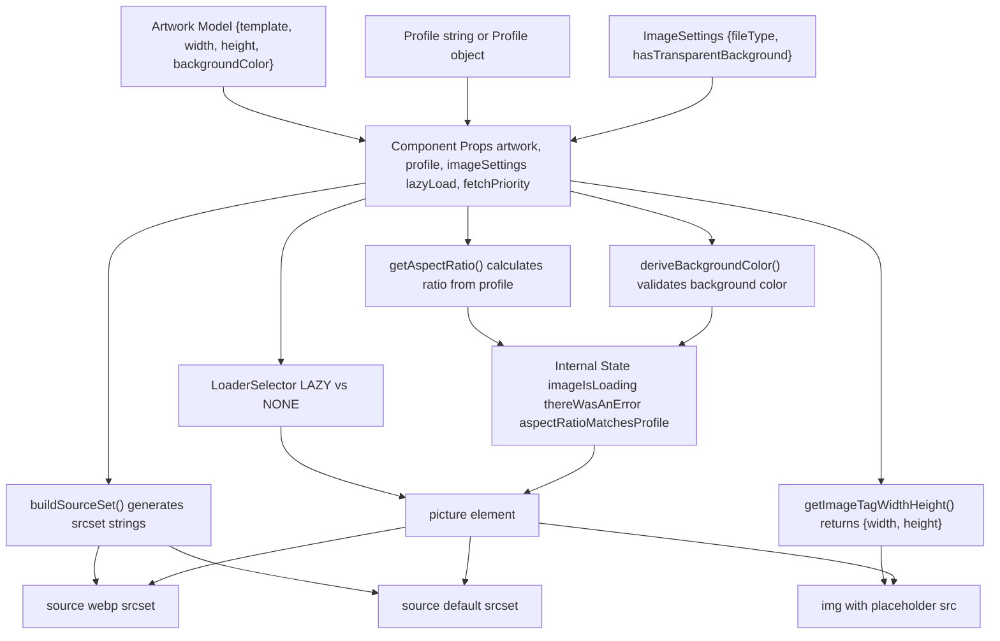
**Sources:** [shared/components/src/components/Artwork/Artwork.svelte1-293](https://github.com/Chesszyh/apps.apple.com/blob/279d0c4d/shared/components/src/components/Artwork/Artwork.svelte#L1-L293)

### Data Flow

> **[Mermaid sequence]**
> *(图表结构无法解析)*

**Sources:** [shared/components/src/components/Artwork/Artwork.svelte112-166](https://github.com/Chesszyh/apps.apple.com/blob/279d0c4d/shared/components/src/components/Artwork/Artwork.svelte#L112-L166) [shared/components/src/components/Artwork/Artwork.svelte231-251](https://github.com/Chesszyh/apps.apple.com/blob/279d0c4d/shared/components/src/components/Artwork/Artwork.svelte#L231-L251)

---

## Profile System

### Profile Resolution and Viewport Detection

Profiles define viewport-specific dimensions and aspect ratios for artwork. A profile can be a string name (referencing predefined profiles) or a `Profile` object with viewport-specific configurations.

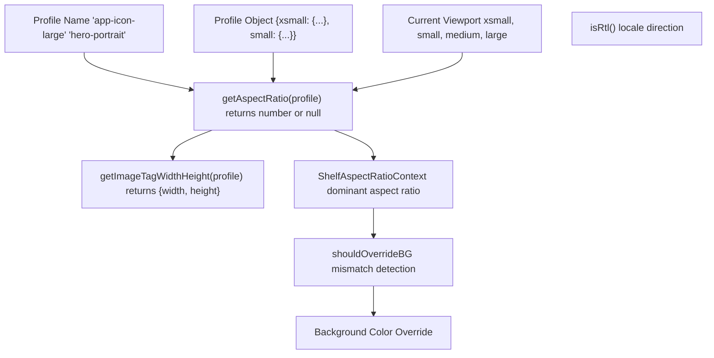
**Sources:** [shared/components/src/components/Artwork/Artwork.svelte38-40](https://github.com/Chesszyh/apps.apple.com/blob/279d0c4d/shared/components/src/components/Artwork/Artwork.svelte#L38-L40) [shared/components/src/components/Artwork/Artwork.svelte138-139](https://github.com/Chesszyh/apps.apple.com/blob/279d0c4d/shared/components/src/components/Artwork/Artwork.svelte#L138-L139)

### Shelf Aspect Ratio Context

The Artwork component integrates with the `ShelfAspectRatioContext` to detect when an image's natural aspect ratio differs from the dominant shelf aspect ratio, enabling automatic background color corrections.

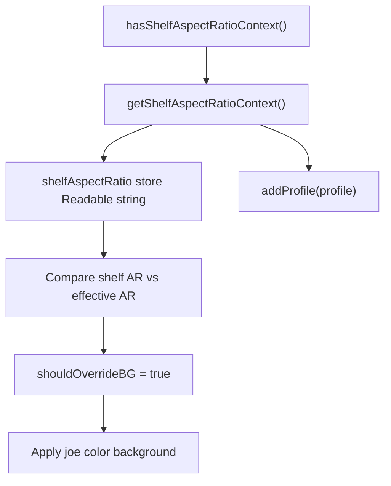
**Sources:** [shared/components/src/components/Artwork/Artwork.svelte104-110](https://github.com/Chesszyh/apps.apple.com/blob/279d0c4d/shared/components/src/components/Artwork/Artwork.svelte#L104-L110) [shared/components/src/components/Artwork/Artwork.svelte207-229](https://github.com/Chesszyh/apps.apple.com/blob/279d0c4d/shared/components/src/components/Artwork/Artwork.svelte#L207-L229)

---

## Image Generation and Source Sets

### buildSourceSet Function

The `buildSourceSet` function generates responsive image URLs with multiple sizes and formats. It replaces template placeholders with actual dimensions based on the profile and viewport.

| Parameter | Type | Purpose |
| --- | --- | --- |
| `artwork` | `Artwork` | Contains template URL, width, height, backgroundColor |
| `imageSettings` | `ImageSettings` | fileType (jpg, png, webp), hasTransparentBackground |
| `profile` | `Profile | string` | Viewport-specific dimensions |
| `chinConfig` | `ChinConfig | undefined` | TV chin configuration |

**Output:** A srcset string like `"url 1x, url 2x, url 3x"`

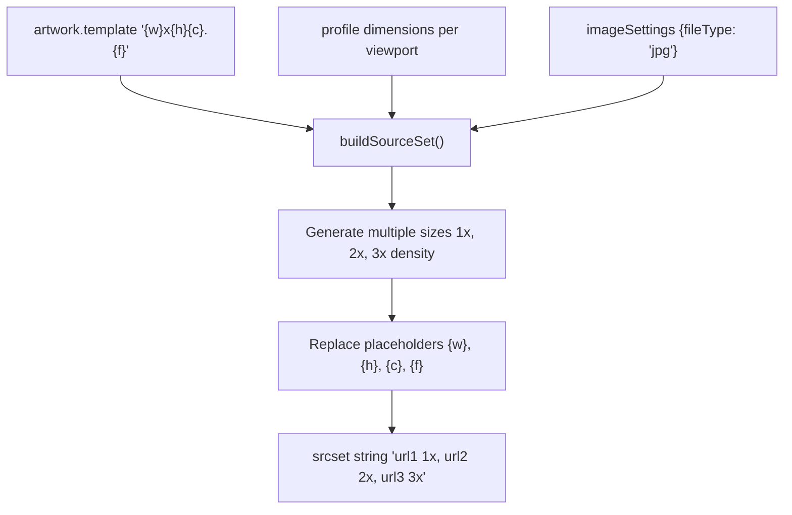
**Sources:** [shared/components/src/components/Artwork/Artwork.svelte128-137](https://github.com/Chesszyh/apps.apple.com/blob/279d0c4d/shared/components/src/components/Artwork/Artwork.svelte#L128-L137)

### WebP Support

The component automatically generates both WebP and fallback format source sets for optimal performance and compatibility.

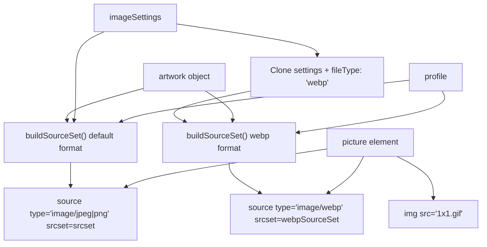
**Sources:** [shared/components/src/components/Artwork/Artwork.svelte128-137](https://github.com/Chesszyh/apps.apple.com/blob/279d0c4d/shared/components/src/components/Artwork/Artwork.svelte#L128-L137) [shared/components/src/components/Artwork/Artwork.svelte334-359](https://github.com/Chesszyh/apps.apple.com/blob/279d0c4d/shared/components/src/components/Artwork/Artwork.svelte#L334-L359)

### getImageSizes Function

The `sizes` attribute tells the browser what size the image will be at different viewports, enabling optimal image selection from the srcset.

**Sources:** [shared/components/src/components/Artwork/Artwork.svelte166](https://github.com/Chesszyh/apps.apple.com/blob/279d0c4d/shared/components/src/components/Artwork/Artwork.svelte#L166-L166)

---

## Loading Strategies

### Lazy Loading with IntersectionObserver

By default, images are lazy-loaded using the `LoaderSelector` component with `IntersectionObserver` integration. Images only render when they enter the viewport.

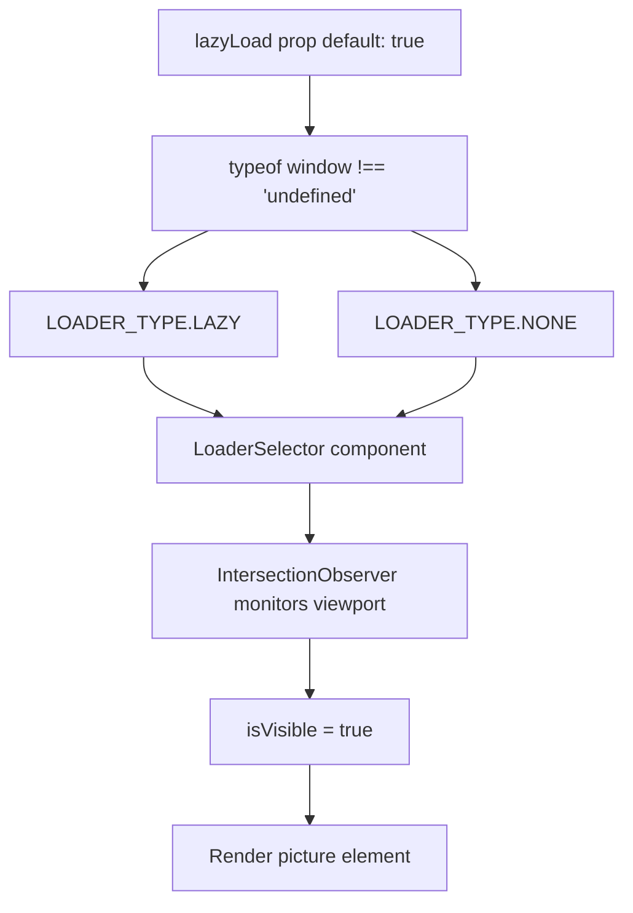
**Sources:** [shared/components/src/components/Artwork/Artwork.svelte55-56](https://github.com/Chesszyh/apps.apple.com/blob/279d0c4d/shared/components/src/components/Artwork/Artwork.svelte#L55-L56) [shared/components/src/components/Artwork/Artwork.svelte161-164](https://github.com/Chesszyh/apps.apple.com/blob/279d0c4d/shared/components/src/components/Artwork/Artwork.svelte#L161-L164) [shared/components/src/components/Artwork/Artwork.svelte332-361](https://github.com/Chesszyh/apps.apple.com/blob/279d0c4d/shared/components/src/components/Artwork/Artwork.svelte#L332-L361)

### Eager Loading for LCP Optimization

For above-the-fold images (especially Largest Contentful Paint candidates), set `lazyLoad={false}` and `fetchPriority="high"`.

| Prop | Type | Default | Purpose |
| --- | --- | --- | --- |
| `lazyLoad` | `boolean` | `true` | Controls lazy loading behavior |
| `fetchPriority` | `'high' | 'auto' | 'low'` | `'auto'` | Browser fetch priority hint |

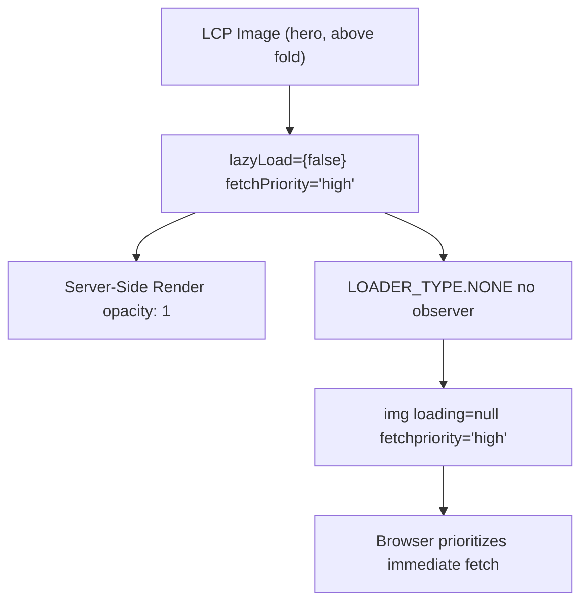
**Sources:** [shared/components/src/components/Artwork/Artwork.svelte54-60](https://github.com/Chesszyh/apps.apple.com/blob/279d0c4d/shared/components/src/components/Artwork/Artwork.svelte#L54-L60) [shared/components/src/components/Artwork/Artwork.svelte159-164](https://github.com/Chesszyh/apps.apple.com/blob/279d0c4d/shared/components/src/components/Artwork/Artwork.svelte#L159-L164) [shared/components/src/components/Artwork/Artwork.svelte355](https://github.com/Chesszyh/apps.apple.com/blob/279d0c4d/shared/components/src/components/Artwork/Artwork.svelte#L355-L355)

### SSR Opacity Handling

During server-side rendering, images are rendered with `opacity: 1` to ensure they display before JavaScript loads.

**Sources:** [shared/components/src/components/Artwork/Artwork.svelte157-159](https://github.com/Chesszyh/apps.apple.com/blob/279d0c4d/shared/components/src/components/Artwork/Artwork.svelte#L157-L159)

---

## Aspect Ratio Management

### Aspect Ratio Calculation and Chin Support

The `getAspectRatio` function calculates aspect ratios from profiles. The effective aspect ratio accounts for `chinConfig` height when present (used for TV app chin effects).

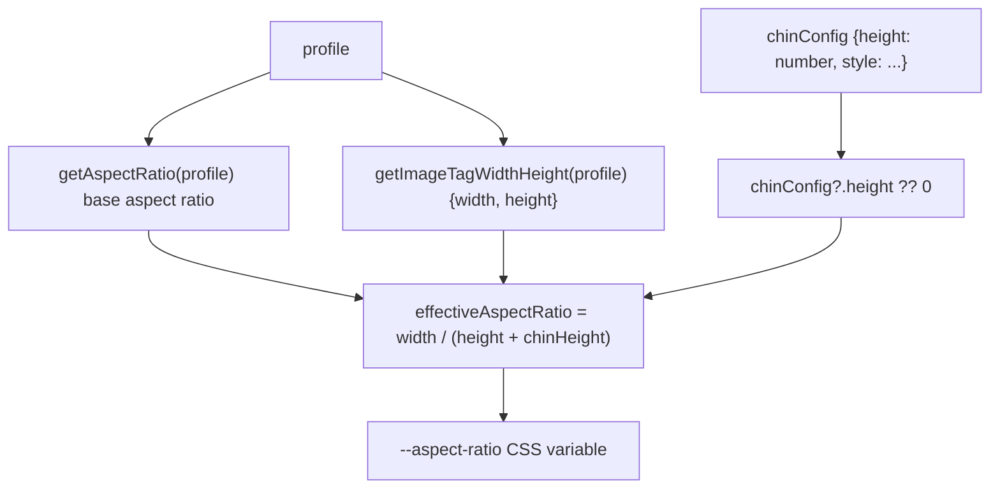
**Sources:** [shared/components/src/components/Artwork/Artwork.svelte138-155](https://github.com/Chesszyh/apps.apple.com/blob/279d0c4d/shared/components/src/components/Artwork/Artwork.svelte#L138-L155) [shared/components/src/components/Artwork/Artwork.svelte74-79](https://github.com/Chesszyh/apps.apple.com/blob/279d0c4d/shared/components/src/components/Artwork/Artwork.svelte#L74-L79)

### Aspect Ratio Mismatch Detection

The component detects when an image's natural aspect ratio doesn't match the profile's expected ratio and applies corrective styling.

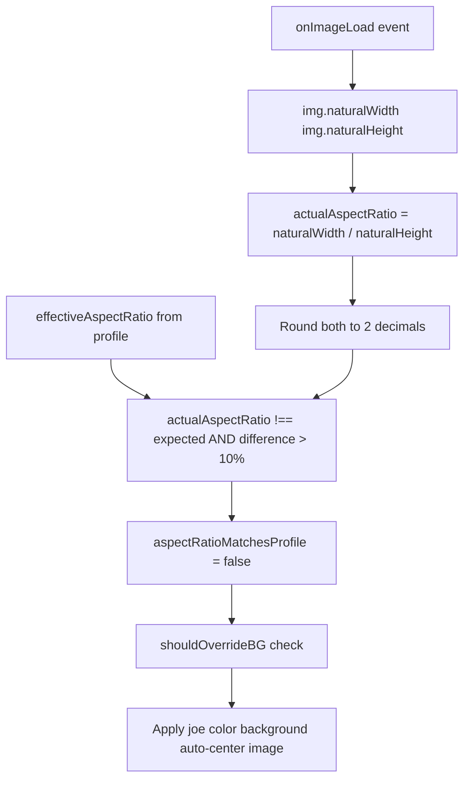
**Sources:** [shared/components/src/components/Artwork/Artwork.svelte231-251](https://github.com/Chesszyh/apps.apple.com/blob/279d0c4d/shared/components/src/components/Artwork/Artwork.svelte#L231-L251) [shared/components/src/components/Artwork/Artwork.svelte205-229](https://github.com/Chesszyh/apps.apple.com/blob/279d0c4d/shared/components/src/components/Artwork/Artwork.svelte#L205-L229)

### shouldOverrideBG Logic

Determines whether to apply joe color background when aspect ratios don't match.

**Conditions for override:**

1.  Shelf aspect ratio context exists AND shelf AR ≠ effective AR
2.  OR `aspectRatioMatchesProfile === false`

**Sources:** [shared/components/src/components/Artwork/Artwork.svelte212-229](https://github.com/Chesszyh/apps.apple.com/blob/279d0c4d/shared/components/src/components/Artwork/Artwork.svelte#L212-L229)

---

## Background Color Handling

### Background Color Derivation

The `deriveBackgroundColor` function validates and processes the artwork's background color from the API.

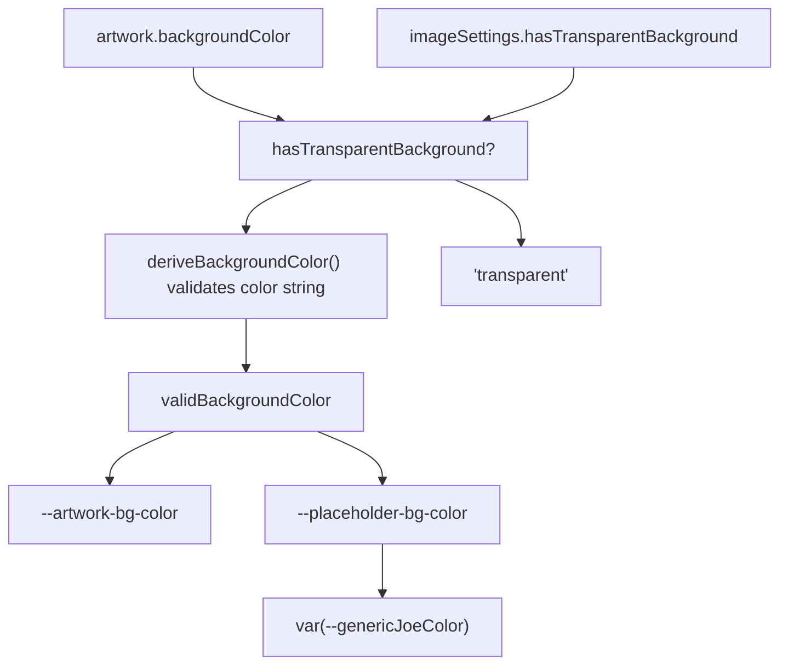
**Sources:** [shared/components/src/components/Artwork/Artwork.svelte117-126](https://github.com/Chesszyh/apps.apple.com/blob/279d0c4d/shared/components/src/components/Artwork/Artwork.svelte#L117-L126) [shared/components/src/components/Artwork/Artwork.svelte168-194](https://github.com/Chesszyh/apps.apple.com/blob/279d0c4d/shared/components/src/components/Artwork/Artwork.svelte#L168-L194)

### Joe Color Fallback System

When background color data is unavailable or aspect ratios mismatch, the component falls back to "joe color" (generic background color with light/dark mode support).

**CSS Variables:**

-   `--artwork-bg-color`: Primary background from artwork data
-   `--placeholder-bg-color`: Background during loading or errors
-   `--genericJoeColor`: System-level fallback with automatic light/dark mode

**Sources:** [shared/components/src/components/Artwork/Artwork.svelte176-193](https://github.com/Chesszyh/apps.apple.com/blob/279d0c4d/shared/components/src/components/Artwork/Artwork.svelte#L176-L193) [shared/components/src/components/Artwork/Artwork.svelte398-401](https://github.com/Chesszyh/apps.apple.com/blob/279d0c4d/shared/components/src/components/Artwork/Artwork.svelte#L398-L401)

### Dark Mode Joe Color

The component automatically adjusts joe color for dark mode when the background color is `#ebebeb` (light mode joe color).

**Sources:** [shared/components/src/components/Artwork/Artwork.svelte487-492](https://github.com/Chesszyh/apps.apple.com/blob/279d0c4d/shared/components/src/components/Artwork/Artwork.svelte#L487-L492)

---

## Advanced Features

### ChinConfig for TV Platform

The `chinConfig` prop enables TV-style shadow effects below artwork, primarily used for Vision platform displays.

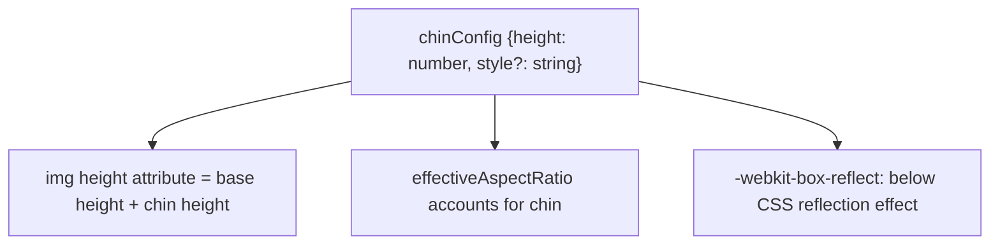
**Example ChinConfig:**

```
{  height: 40,  style: 'shadow'}
```
**Sources:** [shared/components/src/components/Artwork/Artwork.svelte74-79](https://github.com/Chesszyh/apps.apple.com/blob/279d0c4d/shared/components/src/components/Artwork/Artwork.svelte#L74-L79) [shared/components/src/components/Artwork/Artwork.svelte142-155](https://github.com/Chesszyh/apps.apple.com/blob/279d0c4d/shared/components/src/components/Artwork/Artwork.svelte#L142-L155) [shared/components/src/components/Artwork/Artwork.svelte352-354](https://github.com/Chesszyh/apps.apple.com/blob/279d0c4d/shared/components/src/components/Artwork/Artwork.svelte#L352-L354)

### Border Rendering

Borders are conditionally rendered based on background transparency and the `withoutBorder` prop.

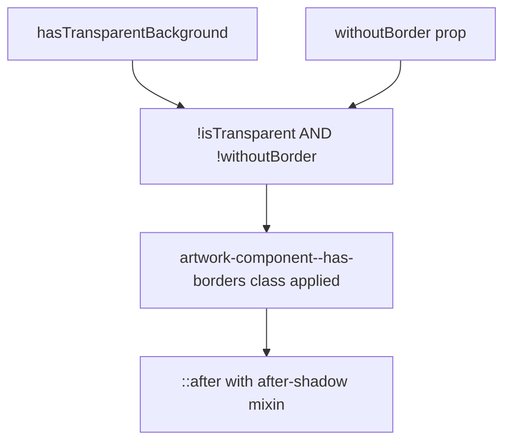
**Sources:** [shared/components/src/components/Artwork/Artwork.svelte101-102](https://github.com/Chesszyh/apps.apple.com/blob/279d0c4d/shared/components/src/components/Artwork/Artwork.svelte#L101-L102) [shared/components/src/components/Artwork/Artwork.svelte310-311](https://github.com/Chesszyh/apps.apple.com/blob/279d0c4d/shared/components/src/components/Artwork/Artwork.svelte#L310-L311) [shared/components/src/components/Artwork/Artwork.svelte404-408](https://github.com/Chesszyh/apps.apple.com/blob/279d0c4d/shared/components/src/components/Artwork/Artwork.svelte#L404-L408)

### Container Styling and Auto-Centering

The `useContainerStyle` prop applies standard container styles (border-radius, shadow). Auto-centering activates when aspect ratios don't match.

| Prop | Default | Purpose |
| --- | --- | --- |
| `useContainerStyle` | `true` | Apply standard container border-radius and shadow |
| `disableAutoCenter` | `false` | Disable automatic image centering for mismatched ratios |
| `forceFullWidth` | `true` | Force 100% width (responsive default) |

**Sources:** [shared/components/src/components/Artwork/Artwork.svelte65-88](https://github.com/Chesszyh/apps.apple.com/blob/279d0c4d/shared/components/src/components/Artwork/Artwork.svelte#L65-L88) [shared/components/src/components/Artwork/Artwork.svelte307-309](https://github.com/Chesszyh/apps.apple.com/blob/279d0c4d/shared/components/src/components/Artwork/Artwork.svelte#L307-L309) [shared/components/src/components/Artwork/Artwork.svelte410-416](https://github.com/Chesszyh/apps.apple.com/blob/279d0c4d/shared/components/src/components/Artwork/Artwork.svelte#L410-L416)

### RTL Support and Shelf Chevron Anchoring

The `noShelfChevronAnchor` prop prevents CSS anchor positioning for shelf navigation chevrons, useful when multiple images exist in a single lockup.

**Sources:** [shared/components/src/components/Artwork/Artwork.svelte68-72](https://github.com/Chesszyh/apps.apple.com/blob/279d0c4d/shared/components/src/components/Artwork/Artwork.svelte#L68-L72) [shared/components/src/components/Artwork/Artwork.svelte312](https://github.com/Chesszyh/apps.apple.com/blob/279d0c4d/shared/components/src/components/Artwork/Artwork.svelte#L312-L312)

### Top Rounded Secondary Style

The `topRoundedSecondary` prop applies rounded corners only to the top of the artwork, used for specific lockup layouts.

**Sources:** [shared/components/src/components/Artwork/Artwork.svelte47-50](https://github.com/Chesszyh/apps.apple.com/blob/279d0c4d/shared/components/src/components/Artwork/Artwork.svelte#L47-L50) [shared/components/src/components/Artwork/Artwork.svelte306](https://github.com/Chesszyh/apps.apple.com/blob/279d0c4d/shared/components/src/components/Artwork/Artwork.svelte#L306-L306) [shared/components/src/components/Artwork/Artwork.svelte420-458](https://github.com/Chesszyh/apps.apple.com/blob/279d0c4d/shared/components/src/components/Artwork/Artwork.svelte#L420-L458)

---

## Component Integration Examples

### Usage in SmallBreakoutItem

The SmallBreakoutItem uses `AppIcon` (which wraps Artwork) with a fixed profile for consistent icon sizing.

**Sources:** [src/components/jet/item/SmallBreakoutItem.svelte28-35](https://github.com/Chesszyh/apps.apple.com/blob/279d0c4d/src/components/jet/item/SmallBreakoutItem.svelte#L28-L35)

### Usage in LargeHeroBreakoutItem

The LargeHeroBreakoutItem demonstrates dynamic profile selection based on viewport and RTL artwork support.

**Sources:** [src/components/jet/item/LargeHeroBreakoutItem.svelte24-66](https://github.com/Chesszyh/apps.apple.com/blob/279d0c4d/src/components/jet/item/LargeHeroBreakoutItem.svelte#L24-L66)

---

## Error Handling and Loading States

### State Management

The component manages three primary states:

| State | Initial Value | Purpose |
| --- | --- | --- |
| `imageIsLoading` | `!!template` | True when image is downloading |
| `thereWasAnError` | `!artwork` | True when artwork data missing or load failed |
| `aspectRatioMatchesProfile` | `true` | False when natural AR differs from profile |

**Sources:** [shared/components/src/components/Artwork/Artwork.svelte112-116](https://github.com/Chesszyh/apps.apple.com/blob/279d0c4d/shared/components/src/components/Artwork/Artwork.svelte#L112-L116) [shared/components/src/components/Artwork/Artwork.svelte231-268](https://github.com/Chesszyh/apps.apple.com/blob/279d0c4d/shared/components/src/components/Artwork/Artwork.svelte#L231-L268) [shared/components/src/components/Artwork/Artwork.svelte317-331](https://github.com/Chesszyh/apps.apple.com/blob/279d0c4d/shared/components/src/components/Artwork/Artwork.svelte#L317-L331)

### Slot System

The component provides slots for custom loading and error states:

-   `loading-component`: Displayed while `imageIsLoading === true`
-   `placeholder-component`: Displayed when `thereWasAnError === true`

**Sources:** [shared/components/src/components/Artwork/Artwork.svelte317-331](https://github.com/Chesszyh/apps.apple.com/blob/279d0c4d/shared/components/src/components/Artwork/Artwork.svelte#L317-L331)

---

## Transition and Animation

### Opacity Transition

Images fade in with a CSS transition when they load, controlled by the opacity style.

**Sources:** [shared/components/src/components/Artwork/Artwork.svelte159](https://github.com/Chesszyh/apps.apple.com/blob/279d0c4d/shared/components/src/components/Artwork/Artwork.svelte#L159-L159) [shared/components/src/components/Artwork/Artwork.svelte253-263](https://github.com/Chesszyh/apps.apple.com/blob/279d0c4d/shared/components/src/components/Artwork/Artwork.svelte#L253-L263) [shared/components/src/components/Artwork/Artwork.svelte347](https://github.com/Chesszyh/apps.apple.com/blob/279d0c4d/shared/components/src/components/Artwork/Artwork.svelte#L347-L347)

---

## Preconnect Optimization

The component tracks artwork template URLs and can trigger DNS preconnects for performance optimization.

**Sources:** [shared/components/src/components/Artwork/Artwork.svelte20](https://github.com/Chesszyh/apps.apple.com/blob/279d0c4d/shared/components/src/components/Artwork/Artwork.svelte#L20-L20) [shared/components/src/components/Artwork/Artwork.svelte196-198](https://github.com/Chesszyh/apps.apple.com/blob/279d0c4d/shared/components/src/components/Artwork/Artwork.svelte#L196-L198)

---

## CSS Architecture

### CSS Custom Properties

The component exposes extensive CSS variables for customization:

| Variable | Default | Purpose |
| --- | --- | --- |
| `--artwork-override-width` | `100%` | Override image width |
| `--artwork-override-height` | `auto` | Override image height |
| `--artwork-override-max-width` | `none` | Maximum width constraint |
| `--artwork-override-min-width` | `0` | Minimum width constraint |
| `--artwork-bg-color` | \- | Artwork background color |
| `--placeholder-bg-color` | `var(--genericJoeColor)` | Loading/error background |
| `--aspect-ratio` | calculated | Aspect ratio for placeholder |
| `--shelf-aspect-ratio` | \- | Override from shelf context |

**Sources:** [shared/components/src/components/Artwork/Artwork.svelte387-402](https://github.com/Chesszyh/apps.apple.com/blob/279d0c4d/shared/components/src/components/Artwork/Artwork.svelte#L387-L402) [shared/components/src/components/Artwork/Artwork.svelte467-476](https://github.com/Chesszyh/apps.apple.com/blob/279d0c4d/shared/components/src/components/Artwork/Artwork.svelte#L467-L476)

### Responsive CSS Classes

Dynamic classes applied based on component state:

-   `artwork-component--aspect-ratio`: Base aspect ratio handling
-   `artwork-component--downloaded`: Image fully loaded and transitioned
-   `artwork-component--error`: Error state active
-   `artwork-component--fullwidth`: 100% width mode
-   `artwork-component--auto-center`: Auto-centering active
-   `artwork-component--bg-override`: Background override for AR mismatch
-   `artwork-component--has-borders`: Border rendering enabled
-   `artwork-component--orientation-{square|landscape|portrait}`: Image orientation

**Sources:** [shared/components/src/components/Artwork/Artwork.svelte295-315](https://github.com/Chesszyh/apps.apple.com/blob/279d0c4d/shared/components/src/components/Artwork/Artwork.svelte#L295-L315)

---

## TypeScript Interfaces

### Artwork Type

```
{  template: string,      // URL template with placeholders  width: number,         // Natural width  height: number,        // Natural height  backgroundColor: string // Hex color or RGB object}
```
### ImageSettings Type

```
{  fileType?: 'jpg' | 'png' | 'webp',  hasTransparentBackground?: boolean}
```
### Profile Type

Can be a string (profile name) or an object with viewport-specific configurations.

### ChinConfig Type

```
{  height: number,        // Chin height in pixels  style?: string         // Optional style variant}
```
**Sources:** [shared/components/src/components/Artwork/Artwork.svelte14](https://github.com/Chesszyh/apps.apple.com/blob/279d0c4d/shared/components/src/components/Artwork/Artwork.svelte#L14-L14)
