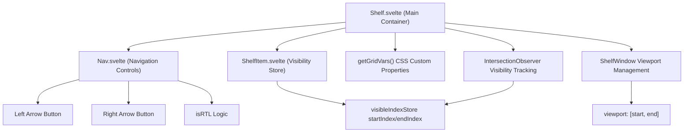
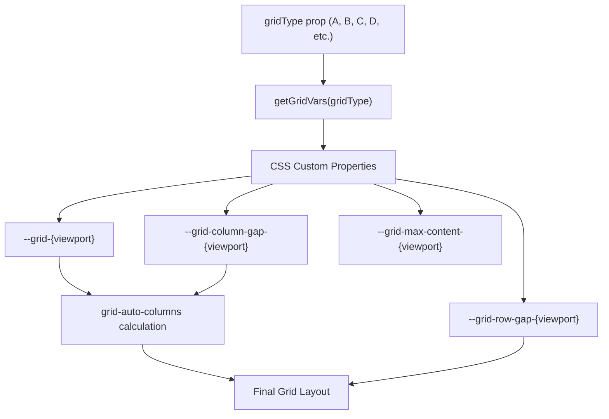
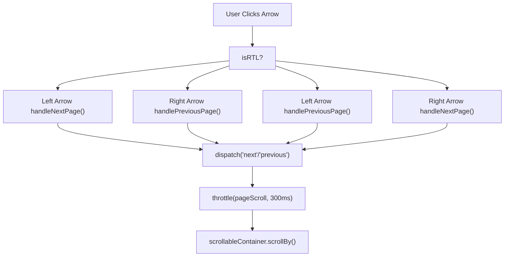
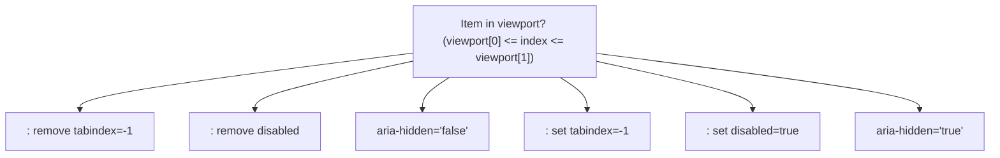
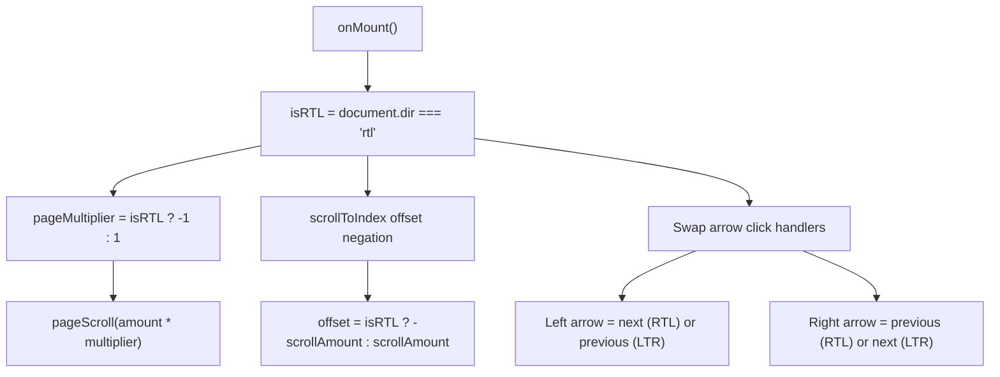
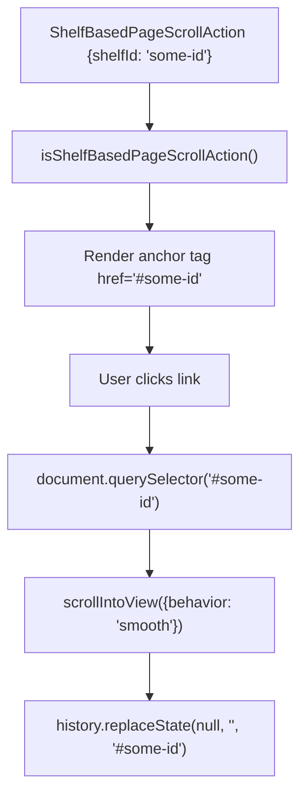

# Scrollable Shelves

-   [shared/components/src/components/Shelf/Nav.svelte](https://github.com/Chesszyh/apps.apple.com/blob/279d0c4d/shared/components/src/components/Shelf/Nav.svelte)
-   [shared/components/src/components/Shelf/Shelf.svelte](https://github.com/Chesszyh/apps.apple.com/blob/279d0c4d/shared/components/src/components/Shelf/Shelf.svelte)
-   [src/components/jet/action/ShelfBasedPageScrollAction.svelte](https://github.com/Chesszyh/apps.apple.com/blob/279d0c4d/src/components/jet/action/ShelfBasedPageScrollAction.svelte)

## Purpose and Scope

This document covers the generic `Shelf` component system that provides horizontal scrolling functionality for displaying collections of items. The Shelf component implements a grid-based layout with pagination controls, lazy rendering, and accessibility features.

For information about specific shelf types and their rendering logic, see [Shelf System](#4.2). For the wrapper that provides consistent spacing and titles, see [Shelf Wrapper and Common Layout](#4.4). For content card components that commonly appear in shelves, see [Content Cards](#5.3) and [Lockup Components](#5.5).

---

## Component Architecture

The scrollable shelf system consists of three primary components that work together to provide horizontal scrolling functionality:


**Sources:**

-   [shared/components/src/components/Shelf/Shelf.svelte1-398](https://github.com/Chesszyh/apps.apple.com/blob/279d0c4d/shared/components/src/components/Shelf/Shelf.svelte#L1-L398)
-   [shared/components/src/components/Shelf/Nav.svelte1-200](https://github.com/Chesszyh/apps.apple.com/blob/279d0c4d/shared/components/src/components/Shelf/Nav.svelte#L1-L200)

---

## Props and Configuration

The `Shelf` component accepts extensive configuration through props to control layout, scrolling behavior, and rendering:

| Prop | Type | Description |
| --- | --- | --- |
| `items` | `T[]` | Generic array of items to display in the shelf |
| `gridType` | `GridType` | Determines column count and sizing across viewports |
| `gridRows` | `number` | Number of rows in the grid (default: 1) |
| `arrowOffset` | `ArrowOffset | null` | Custom vertical positioning for navigation arrows |
| `alignItems` | `boolean` | Whether to align items to bottom (default: false) |
| `stackXSItems` | `boolean` | Stack items vertically on extra-small viewports |
| `overflowBleedBottom` | `string` | Custom CSS value for bottom overflow bleed |
| `aspectRatioOverride` | `AspectRatioOverrideConfig` | Override aspect ratios for shelf context |
| `getItemIdentifier` | `function` | Custom function to generate unique item keys |
| `pageScrollMultiplier` | `number` | Multiplier for pagination scroll distance |
| `onIntersectionUpdate` | `function` | Callback with visible item indices `[start, end]` |
| `firstItemIndex` | `number` | Initial scroll position (default: 0) |
| `translateFn` | `function` | Translation function for localized strings |

**Sources:**

-   [shared/components/src/components/Shelf/Shelf.svelte25-56](https://github.com/Chesszyh/apps.apple.com/blob/279d0c4d/shared/components/src/components/Shelf/Shelf.svelte#L25-L56)

---

## Grid System and Layout

The Shelf component uses a CSS Grid-based layout system where grid configuration is determined by the `gridType` prop. Grid variables are injected as CSS custom properties:


The grid calculation dynamically adjusts for viewport size and drawer state:

| Viewport | Base Behavior | Drawer Adjustment |
| --- | --- | --- |
| xsmall | Uses `--grid-xsmall` columns | No adjustment |
| small | Uses `--grid-small` columns | No adjustment |
| medium | Uses `--grid-medium` columns | Subtract 1 column when drawer open |
| large | Uses `--grid-large` columns | Subtract 1 column when drawer open |
| xlarge | Uses `--grid-xlarge` columns | No adjustment |

Grid Type H has special handling, subtracting 2 columns when the drawer is open in medium/large viewports.

**Sources:**

-   [shared/components/src/components/Shelf/Shelf.svelte4](https://github.com/Chesszyh/apps.apple.com/blob/279d0c4d/shared/components/src/components/Shelf/Shelf.svelte#L4-L4)
-   [shared/components/src/components/Shelf/Shelf.svelte108-127](https://github.com/Chesszyh/apps.apple.com/blob/279d0c4d/shared/components/src/components/Shelf/Shelf.svelte#L108-L127)
-   [shared/components/src/components/Shelf/Shelf.svelte409-471](https://github.com/Chesszyh/apps.apple.com/blob/279d0c4d/shared/components/src/components/Shelf/Shelf.svelte#L409-L471)

---

## Scrolling and Navigation System

### Pagination Controls

The shelf provides left and right arrow navigation for paging through content. The `Nav` component manages these controls with RTL awareness:


The pagination scroll distance is calculated based on container width:

```
scrollAmount = (containerWidth + GRID_COLUMN_GAP - SHADOW_OFFSET * 2) * pageMultiplier
```
Where:

-   `GRID_COLUMN_GAP_DEFAULT` = column spacing between items
-   `STANDARD_LOCKUP_SHADOW_OFFSET` = 15px (accounts for lockup shadows)
-   `pageMultiplier` = negated for RTL mode

**Sources:**

-   [shared/components/src/components/Shelf/Shelf.svelte234-255](https://github.com/Chesszyh/apps.apple.com/blob/279d0c4d/shared/components/src/components/Shelf/Shelf.svelte#L234-L255)
-   [shared/components/src/components/Shelf/Shelf.svelte99](https://github.com/Chesszyh/apps.apple.com/blob/279d0c4d/shared/components/src/components/Shelf/Shelf.svelte#L99-L99)
-   [shared/components/src/components/Shelf/Nav.svelte48-72](https://github.com/Chesszyh/apps.apple.com/blob/279d0c4d/shared/components/src/components/Shelf/Nav.svelte#L48-L72)

### Arrow Positioning

Navigation arrows are vertically centered using CSS anchor positioning (with fallback for unsupported browsers):

**Modern Browsers (Anchor Positioning):**

```
top: anchor(--shelf-first-artwork center, 50%);
```
The anchor `--shelf-first-artwork` is set on the first artwork component in single-row shelves.

**Fallback:**

```
transform: translateY(calc(-50% + var(--offset)));
```
Where `--offset` accounts for shelf header height or custom `arrowOffset` prop values.

**Sources:**

-   [shared/components/src/components/Shelf/Nav.svelte100-145](https://github.com/Chesszyh/apps.apple.com/blob/279d0c4d/shared/components/src/components/Shelf/Nav.svelte#L100-L145)
-   [shared/components/src/components/Shelf/Shelf.svelte34](https://github.com/Chesszyh/apps.apple.com/blob/279d0c4d/shared/components/src/components/Shelf/Shelf.svelte#L34-L34)
-   [shared/components/src/components/Shelf/Shelf.svelte473-483](https://github.com/Chesszyh/apps.apple.com/blob/279d0c4d/shared/components/src/components/Shelf/Shelf.svelte#L473-L483)

---

## Dynamic Rendering and Visibility Tracking

The Shelf implements a sophisticated lazy rendering system using IntersectionObserver to render only visible items plus a buffer:

> **[Mermaid sequence]**
> *(图表结构无法解析)*

### Visibility Store

The `visibleIndexStore` maintains the range of items to render:

```
{  startIndex: number,  // Always 0 currently  endIndex: number     // Dynamically updated as user scrolls}
```
Initial render shows:

```
initalVisibleGridItems = getMaxVisibleItems(gridType) * gridRows
```
As items intersect, the `endIndex` extends by `EXTRA_ITEMS` (2 \* gridRows) to pre-load off-screen content.

**Sources:**

-   [shared/components/src/components/Shelf/Shelf.svelte139-193](https://github.com/Chesszyh/apps.apple.com/blob/279d0c4d/shared/components/src/components/Shelf/Shelf.svelte#L139-L193)
-   [shared/components/src/components/Shelf/Shelf.svelte144-193](https://github.com/Chesszyh/apps.apple.com/blob/279d0c4d/shared/components/src/components/Shelf/Shelf.svelte#L144-L193)
-   [shared/components/src/components/Shelf/Shelf.svelte18](https://github.com/Chesszyh/apps.apple.com/blob/279d0c4d/shared/components/src/components/Shelf/Shelf.svelte#L18-L18)

### Viewport Tracking

The `ShelfWindow` utility tracks the currently visible item range and provides the viewport indices through the `onIntersectionUpdate` callback:

**Sources:**

-   [shared/components/src/components/Shelf/Shelf.svelte49-50](https://github.com/Chesszyh/apps.apple.com/blob/279d0c4d/shared/components/src/components/Shelf/Shelf.svelte#L49-L50)
-   [shared/components/src/components/Shelf/Shelf.svelte186-190](https://github.com/Chesszyh/apps.apple.com/blob/279d0c4d/shared/components/src/components/Shelf/Shelf.svelte#L186-L190)
-   [shared/components/src/components/Shelf/Shelf.svelte6](https://github.com/Chesszyh/apps.apple.com/blob/279d0c4d/shared/components/src/components/Shelf/Shelf.svelte#L6-L6)

---

## Accessibility Implementation

The Shelf component implements comprehensive accessibility features:

### Tab Order Management

Items outside the visible viewport have their interactive elements disabled to prevent tab navigation to off-screen content:


The `setShelfItemInteractivity` function queries all `<a>` and `<button>` elements within each shelf item and toggles their interactive state.

**Sources:**

-   [shared/components/src/components/Shelf/Shelf.svelte282-305](https://github.com/Chesszyh/apps.apple.com/blob/279d0c4d/shared/components/src/components/Shelf/Shelf.svelte#L282-L305)
-   [shared/components/src/components/Shelf/Shelf.svelte367-378](https://github.com/Chesszyh/apps.apple.com/blob/279d0c4d/shared/components/src/components/Shelf/Shelf.svelte#L367-L378)

### ARIA Attributes

The shelf structure includes semantic ARIA roles:

```
<ul role="list" tabindex="-1">  <li aria-hidden="true|false">    <!-- content -->  </li></ul>
```
The `tabindex="-1"` on the `<ul>` prevents Firefox from adding the scrollable container to the tab order, which interferes with screen reader announcements.

**Sources:**

-   [shared/components/src/components/Shelf/Shelf.svelte324-340](https://github.com/Chesszyh/apps.apple.com/blob/279d0c4d/shared/components/src/components/Shelf/Shelf.svelte#L324-L340)
-   [shared/components/src/components/Shelf/Shelf.svelte351-362](https://github.com/Chesszyh/apps.apple.com/blob/279d0c4d/shared/components/src/components/Shelf/Shelf.svelte#L351-L362)

### Navigation Labels

Arrow buttons receive localized `aria-label` attributes through the `translateFn` prop:

| Direction | Translation Key | Typical Value |
| --- | --- | --- |
| Next | `AMP.Shared.NextPage` | "Next Page" |
| Previous | `AMP.Shared.PreviousPage` | "Previous Page" |

**Sources:**

-   [shared/components/src/components/Shelf/Nav.svelte57-65](https://github.com/Chesszyh/apps.apple.com/blob/279d0c4d/shared/components/src/components/Shelf/Nav.svelte#L57-L65)

---

## RTL (Right-to-Left) Support

The component automatically detects document direction and adapts scrolling behavior:


### RTL Implementation Details

1.  **Scroll direction inversion**: The `pageMultiplier` is negated for RTL to reverse pagination direction
2.  **scrollToIndex**: Negates scroll offset when `isRTL` is true
3.  **Arrow mapping**: Nav component swaps which arrow triggers next/previous based on `isRTL` prop

**Sources:**

-   [shared/components/src/components/Shelf/Shelf.svelte195-199](https://github.com/Chesszyh/apps.apple.com/blob/279d0c4d/shared/components/src/components/Shelf/Shelf.svelte#L195-L199)
-   [shared/components/src/components/Shelf/Shelf.svelte230-231](https://github.com/Chesszyh/apps.apple.com/blob/279d0c4d/shared/components/src/components/Shelf/Shelf.svelte#L230-L231)
-   [shared/components/src/components/Shelf/Shelf.svelte246-254](https://github.com/Chesszyh/apps.apple.com/blob/279d0c4d/shared/components/src/components/Shelf/Shelf.svelte#L246-L254)
-   [shared/components/src/components/Shelf/Nav.svelte67-71](https://github.com/Chesszyh/apps.apple.com/blob/279d0c4d/shared/components/src/components/Shelf/Nav.svelte#L67-L71)

---

## Advanced Features

### Item Keying

The shelf supports custom item identification through the `getItemIdentifier` prop. If not provided, it falls back to checking for an `id` property on items:

```
shelfItemIdentifier(item, index) => {  if (typeof getItemIdentifier === 'function') {    return getItemIdentifier(item, index);  } else if (item has 'id' property) {    return item.id;  }  return item; // fallback to object reference}
```
This key is used in the Svelte `{#each}` loop to maintain component identity across updates.

**Sources:**

-   [shared/components/src/components/Shelf/Shelf.svelte68-93](https://github.com/Chesszyh/apps.apple.com/blob/279d0c4d/shared/components/src/components/Shelf/Shelf.svelte#L68-L93)
-   [shared/components/src/components/Shelf/Shelf.svelte367](https://github.com/Chesszyh/apps.apple.com/blob/279d0c4d/shared/components/src/components/Shelf/Shelf.svelte#L367-L367)

### Scroll Position Restoration

The `restoreScroll` action automatically resets scroll position when the first item changes (e.g., during data refresh):

```
restoreScroll(node, items) {  firstKnownItem = items[0];  return {    update(items) {      if (items[0].id !== firstKnownItem.id &&           initialScroll === 0 &&           node.scrollLeft > 0) {        node.scrollLeft = 0;      }    }  };}
```
**Sources:**

-   [shared/components/src/components/Shelf/Shelf.svelte259-276](https://github.com/Chesszyh/apps.apple.com/blob/279d0c4d/shared/components/src/components/Shelf/Shelf.svelte#L259-L276)
-   [shared/components/src/components/Shelf/Shelf.svelte361](https://github.com/Chesszyh/apps.apple.com/blob/279d0c4d/shared/components/src/components/Shelf/Shelf.svelte#L361-L361)

### Programmatic Scrolling

The component exposes two methods for external scroll control:

| Method | Parameters | Description |
| --- | --- | --- |
| `scrollToIndex(index)` | `index: number` | Scrolls to show item at given index |
| `scrollToPage(pageNumber)` | `pageNumber: number` | Scrolls by page count using multiplier |

**Example Usage:**

```
let shelfRef;shelfRef.scrollToIndex(5);  // Show 6th itemshelfRef.scrollToPage(2);   // Scroll forward 2 pages
```
**Sources:**

-   [shared/components/src/components/Shelf/Shelf.svelte59-61](https://github.com/Chesszyh/apps.apple.com/blob/279d0c4d/shared/components/src/components/Shelf/Shelf.svelte#L59-L61)
-   [shared/components/src/components/Shelf/Shelf.svelte209-232](https://github.com/Chesszyh/apps.apple.com/blob/279d0c4d/shared/components/src/components/Shelf/Shelf.svelte#L209-L232)

### Stack Mode for Extra Small Viewports

When `stackXSItems={true}`, the shelf switches from horizontal scrolling to vertical stacking on extra-small viewports:

```
@media (--range-grid-layout-xs-1-down) {  .shelf-grid__list--stack-xs-items {    display: block;    padding-inline-end: var(--bodyGutter);  }    :not(:first-child) {    margin-top: $spacerC;  }}
```
This is commonly used for music radio shelves where lockups stack vertically on mobile.

**Sources:**

-   [shared/components/src/components/Shelf/Shelf.svelte37](https://github.com/Chesszyh/apps.apple.com/blob/279d0c4d/shared/components/src/components/Shelf/Shelf.svelte#L37-L37)
-   [shared/components/src/components/Shelf/Shelf.svelte521-534](https://github.com/Chesszyh/apps.apple.com/blob/279d0c4d/shared/components/src/components/Shelf/Shelf.svelte#L521-L534)

---

## Integration with Actions

The shelf system integrates with the action system through `ShelfBasedPageScrollAction`, which enables scrolling to a specific shelf by ID:


This action type is commonly used in "See All" links or table-of-contents navigation to scroll to a specific shelf on the same page.

**Sources:**

-   [src/components/jet/action/ShelfBasedPageScrollAction.svelte1-52](https://github.com/Chesszyh/apps.apple.com/blob/279d0c4d/src/components/jet/action/ShelfBasedPageScrollAction.svelte#L1-L52)
-   [src/components/jet/action/ShelfBasedPageScrollAction.svelte6-13](https://github.com/Chesszyh/apps.apple.com/blob/279d0c4d/src/components/jet/action/ShelfBasedPageScrollAction.svelte#L6-L13)

---

## Slot Interface

The Shelf component provides two slots for customization:

| Slot Name | Purpose | Receives |
| --- | --- | --- |
| `header` | Optional shelf header/title | \- |
| `item` | Item rendering template | `item: T`, `index: number`, `numberOfItems: number` |

**Example Usage:**

```
<Shelf {items} {gridType}>  <div slot="header">    <h2>Shelf Title</h2>  </div>    <div slot="item" let:item let:index>    <MyItemComponent {item} {index} />  </div></Shelf>
```
**Sources:**

-   [shared/components/src/components/Shelf/Shelf.svelte314-318](https://github.com/Chesszyh/apps.apple.com/blob/279d0c4d/shared/components/src/components/Shelf/Shelf.svelte#L314-L318)
-   [shared/components/src/components/Shelf/Shelf.svelte384-389](https://github.com/Chesszyh/apps.apple.com/blob/279d0c4d/shared/components/src/components/Shelf/Shelf.svelte#L384-L389)

---

## Performance Considerations

### Throttling

Navigation button clicks are throttled to 300ms to prevent excessive scroll events:

```
const THROTTLE_LIMIT = 300;handleNextPage = throttle(pageScroll.bind(null, pageMultiplier), THROTTLE_LIMIT);
```
**Sources:**

-   [shared/components/src/components/Shelf/Shelf.svelte244-255](https://github.com/Chesszyh/apps.apple.com/blob/279d0c4d/shared/components/src/components/Shelf/Shelf.svelte#L244-L255)

### CSS Transitions

Arrow opacity transitions use `will-change: opacity` for GPU acceleration, preventing layout thrashing during hover states:

```
.shelf-grid-nav__arrow {  opacity: 0;  will-change: opacity;  transition: $shelf-grid-nav-transition;}
```
**Sources:**

-   [shared/components/src/components/Shelf/Shelf.svelte486-505](https://github.com/Chesszyh/apps.apple.com/blob/279d0c4d/shared/components/src/components/Shelf/Shelf.svelte#L486-L505)

### Lazy Rendering Buffer

The `EXTRA_ITEMS` constant (2 \* gridRows) provides a buffer zone for pre-rendering items just outside the viewport, preventing visual loading during normal scrolling:

**Sources:**

-   [shared/components/src/components/Shelf/Shelf.svelte160-170](https://github.com/Chesszyh/apps.apple.com/blob/279d0c4d/shared/components/src/components/Shelf/Shelf.svelte#L160-L170)
