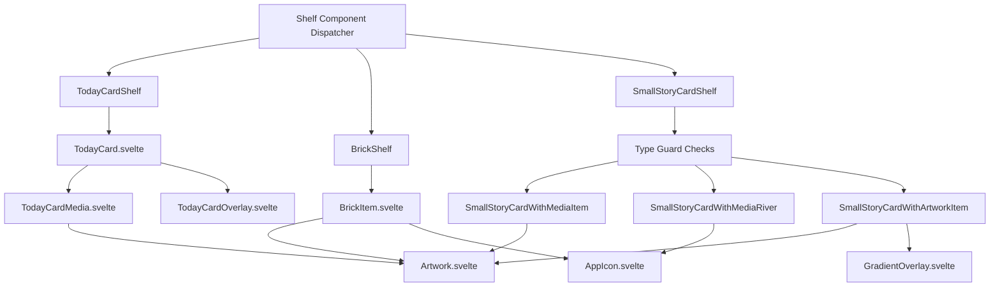
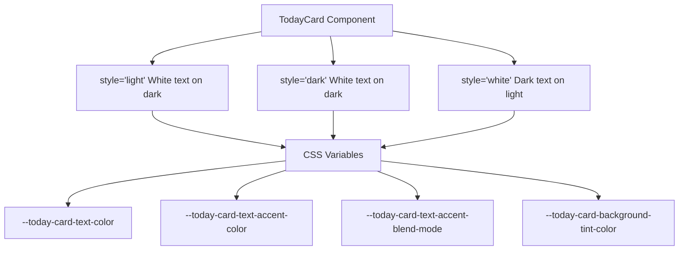
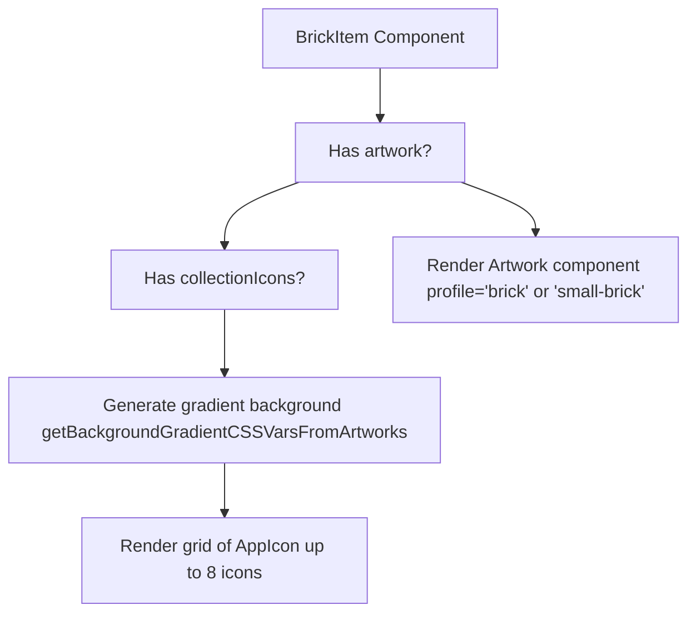
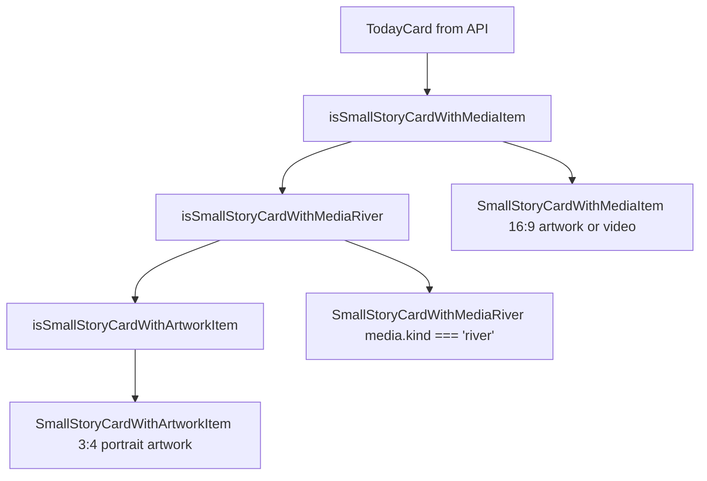
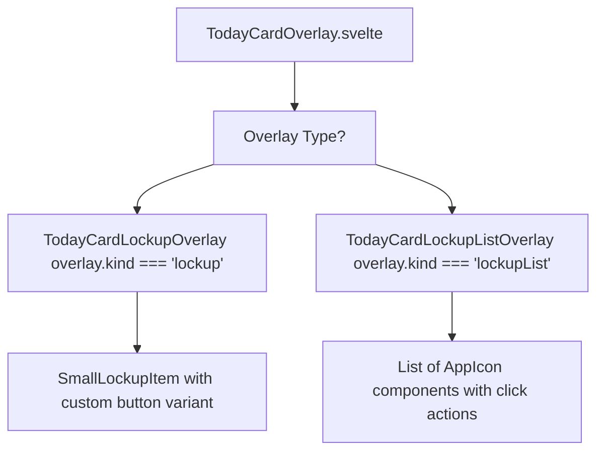

# Content Cards

-   [src/components/jet/item/BrickItem.svelte](https://github.com/Chesszyh/apps.apple.com/blob/279d0c4d/src/components/jet/item/BrickItem.svelte)
-   [src/components/jet/item/SmallStoryCardWithArtworkItem.svelte](https://github.com/Chesszyh/apps.apple.com/blob/279d0c4d/src/components/jet/item/SmallStoryCardWithArtworkItem.svelte)
-   [src/components/jet/item/SmallStoryCardWithMediaItem.svelte](https://github.com/Chesszyh/apps.apple.com/blob/279d0c4d/src/components/jet/item/SmallStoryCardWithMediaItem.svelte)
-   [src/components/jet/item/SmallStoryCardWithMediaRiver.svelte](https://github.com/Chesszyh/apps.apple.com/blob/279d0c4d/src/components/jet/item/SmallStoryCardWithMediaRiver.svelte)
-   [src/components/jet/today-card/TodayCard.svelte](https://github.com/Chesszyh/apps.apple.com/blob/279d0c4d/src/components/jet/today-card/TodayCard.svelte)
-   [src/components/jet/today-card/TodayCardOverlay.svelte](https://github.com/Chesszyh/apps.apple.com/blob/279d0c4d/src/components/jet/today-card/TodayCardOverlay.svelte)
-   [src/components/jet/today-card/overlay/TodayCardLockupListOverlay.svelte](https://github.com/Chesszyh/apps.apple.com/blob/279d0c4d/src/components/jet/today-card/overlay/TodayCardLockupListOverlay.svelte)

## Purpose and Scope

This document covers the **Content Card** component family, which provides visually rich, editorial card displays for the App Store web application. Content cards include:

-   **TodayCard**: Large editorial cards with media, overlays, and protection layers
-   **BrickItem**: Collection cards with artwork or generated gradient backgrounds
-   **SmallStoryCard variants**: Compact story cards with different media types

These components are used throughout editorial shelves to showcase curated content, app collections, and featured stories. For carousel-based hero displays, see [Hero and Carousel Components](#5.4). For app-focused displays, see [Lockup Components](#5.5).

---

## Component Type Overview

The content card system consists of three main component families, each with distinct visual characteristics and data requirements:

| Component | File | Primary Use Case | Key Features |
| --- | --- | --- | --- |
| `TodayCard` | `src/components/jet/today-card/TodayCard.svelte` | Large editorial features | Media backgrounds, protection layers, overlays |
| `BrickItem` | `src/components/jet/item/BrickItem.svelte` | App collections | Gradient backgrounds, collection icons |
| `SmallStoryCardWithMedia` | `src/components/jet/item/SmallStoryCardWithMediaItem.svelte` | Story previews with media | 16:9 artwork, compact layout |
| `SmallStoryCardWithMediaRiver` | `src/components/jet/item/SmallStoryCardWithMediaRiver.svelte` | App collection stories | Icon river with gradient |
| `SmallStoryCardWithArtwork` | `src/components/jet/item/SmallStoryCardWithArtworkItem.svelte` | Portrait story cards | 3:4 artwork with gradient overlay |

**Sources:** [src/components/jet/today-card/TodayCard.svelte1-402](https://github.com/Chesszyh/apps.apple.com/blob/279d0c4d/src/components/jet/today-card/TodayCard.svelte#L1-L402) [src/components/jet/item/BrickItem.svelte1-301](https://github.com/Chesszyh/apps.apple.com/blob/279d0c4d/src/components/jet/item/BrickItem.svelte#L1-L301) [src/components/jet/item/SmallStoryCardWithMediaItem.svelte1-105](https://github.com/Chesszyh/apps.apple.com/blob/279d0c4d/src/components/jet/item/SmallStoryCardWithMediaItem.svelte#L1-L105)

---

## Component Hierarchy and Data Flow


**Sources:** [src/components/jet/today-card/TodayCard.svelte1-17](https://github.com/Chesszyh/apps.apple.com/blob/279d0c4d/src/components/jet/today-card/TodayCard.svelte#L1-L17) [src/components/jet/item/BrickItem.svelte1-18](https://github.com/Chesszyh/apps.apple.com/blob/279d0c4d/src/components/jet/item/BrickItem.svelte#L1-L18) [src/components/jet/item/SmallStoryCardWithMediaItem.svelte15-19](https://github.com/Chesszyh/apps.apple.com/blob/279d0c4d/src/components/jet/item/SmallStoryCardWithMediaItem.svelte#L15-L19)

---

## TodayCard Component

The `TodayCard` component renders large editorial cards with rich media backgrounds, text content, and optional interactive overlays.

### Data Model and Props

The component accepts a `TodayCard` model from the API and optional configuration:

| Prop | Type | Default | Description |
| --- | --- | --- | --- |
| `card` | `TodayCard` | required | Card data including heading, title, media, overlay |
| `suppressClickAction` | `boolean` | `false` | Disables click action (used on story pages) |
| `artworkProfile` | `Profile | undefined` | `undefined` | Override default media profile |

The `TodayCard` model includes:

-   `heading`: Optional badge text (e.g., "NEW GAME")
-   `title`: Main card title
-   `inlineDescription`: Body text below title
-   `titleArtwork`: Optional artwork replacing text title
-   `media`: Background media (artwork, video, app event, or list)
-   `overlay`: Optional lockup or lockup list
-   `style`: Color scheme (`'light'`, `'dark'`, or `'white'`)
-   `editorialDisplayOptions`: Configuration for protection layers

**Sources:** [src/components/jet/today-card/TodayCard.svelte18-51](https://github.com/Chesszyh/apps.apple.com/blob/279d0c4d/src/components/jet/today-card/TodayCard.svelte#L18-L51)

### Style System and CSS Variables

The TodayCard supports three visual styles with distinct color schemes:


The CSS variable values are:

| Style | Text Color | Accent Color | Blend Mode | Background Tint |
| --- | --- | --- | --- | --- |
| `light`/`dark` | `rgb(255, 255, 255)` | `rgba(255, 255, 255, 0.56)` | `plus-lighter` | `rgba(0, 0, 0, 0.18)` |
| `white` | `var(--systemPrimary-onLight)` | `rgba(0, 0, 0, 0.56)` | `revert` | `rgba(255, 255, 255, 0.33)` |

**Sources:** [src/components/jet/today-card/TodayCard.svelte198-211](https://github.com/Chesszyh/apps.apple.com/blob/279d0c4d/src/components/jet/today-card/TodayCard.svelte#L198-L211)

### Protection Layers and Visual Effects

TodayCard implements sophisticated visual protection layers to ensure text readability over background media:

#### Blurry Protection Layer

Used when `editorialDisplayOptions.useTextProtectionColor` or `editorialDisplayOptions.useMaterialBlur` is set, excluding app events and list-style cards:

```
backdrop-filter: blur(34px) brightness(0.95) saturate(1.6) contrast(1.1)
```
The layer uses a gradient mask to create a smooth fade effect from bottom to top, with the bottom 30% fully protected and gradually fading to transparent at the top.

**Sources:** [src/components/jet/today-card/TodayCard.svelte283-303](https://github.com/Chesszyh/apps.apple.com/blob/279d0c4d/src/components/jet/today-card/TodayCard.svelte#L283-L303)

#### Gradient Protection Layer

Applied specifically for app event media (`media.kind === 'appEvent'`). Creates a bottom-to-top gradient using the accent color derived from the media background:

```
linear-gradient(
    0deg,
    var(--gradient-color) 22%,
    color-mix(in srgb, var(--gradient-color) 60%, transparent) 36%,
    transparent 50%
)
```
The gradient darkens on hover for interactive feedback:

```
.information-layer.with-gradient.with-action:has(> a:hover) {    --gradient-color: color-mix(        in srgb,        var(--today-card-accent-color) 93%,        black    );}
```
**Sources:** [src/components/jet/today-card/TodayCard.svelte247-275](https://github.com/Chesszyh/apps.apple.com/blob/279d0c4d/src/components/jet/today-card/TodayCard.svelte#L247-L275)

### Accent Color Determination

The card's accent color is computed using the `bestBackgroundColor` utility function:

```
accentColor = colorAsString(bestBackgroundColor(card.media));
```
This color is set as `--today-card-accent-color` and used for:

-   Card background color
-   Gradient protection layer base color
-   Visual consistency across card elements

**Sources:** [src/components/jet/today-card/TodayCard.svelte64](https://github.com/Chesszyh/apps.apple.com/blob/279d0c4d/src/components/jet/today-card/TodayCard.svelte#L64-L64) [src/components/jet/today-card/TodayCard.svelte16](https://github.com/Chesszyh/apps.apple.com/blob/279d0c4d/src/components/jet/today-card/TodayCard.svelte#L16-L16)

### Layout Modes

#### Standard Mode

Default layout with media as background and text overlay at bottom:

```
- TodayCardMedia (background)
- wrapper (absolute positioned)
  - information-layer
    - content-container (title, description)
    - overlay (optional lockup)
```
#### List Mode

When `media` is a `TodayCardMediaList`, the layout switches to horizontal:

```
- wrapper (relative positioned)
  - information-layer (text content)
- TodayCardMedia (rendered at bottom)
```
List mode uses different styling with a light background and no overlays.

**Sources:** [src/components/jet/today-card/TodayCard.svelte82-163](https://github.com/Chesszyh/apps.apple.com/blob/279d0c4d/src/components/jet/today-card/TodayCard.svelte#L82-L163) [src/components/jet/today-card/TodayCard.svelte372-401](https://github.com/Chesszyh/apps.apple.com/blob/279d0c4d/src/components/jet/today-card/TodayCard.svelte#L372-L401)

### Overlay System

TodayCard overlays display app lockups at the bottom of cards. The overlay rendering is delegated to `TodayCardOverlay`:

```
{#if overlay}    <div class="overlay">        <TodayCardOverlay            {overlay}            buttonVariant={useProtectionLayer ? 'transparent' : 'dark-gray'}        />    </div>{/if}
```
Overlays support two variants:

-   **Single lockup**: Renders `SmallLockupItem` with app icon and metadata
-   **Lockup list**: Renders multiple app icons in a horizontal row

When an overlay is present, cards do not wrap the entire card in a clickable link to avoid nested anchor tags.

**Sources:** [src/components/jet/today-card/TodayCard.svelte139-156](https://github.com/Chesszyh/apps.apple.com/blob/279d0c4d/src/components/jet/today-card/TodayCard.svelte#L139-L156) [src/components/jet/today-card/TodayCardOverlay.svelte24-35](https://github.com/Chesszyh/apps.apple.com/blob/279d0c4d/src/components/jet/today-card/TodayCardOverlay.svelte#L24-L35)

---

## BrickItem Component

`BrickItem` renders collection cards with either hero artwork or a generated gradient background populated with collection app icons.

### Artwork vs Collection Icons

The component supports two visual modes based on data availability:


**Sources:** [src/components/jet/item/BrickItem.svelte21-42](https://github.com/Chesszyh/apps.apple.com/blob/279d0c4d/src/components/jet/item/BrickItem.svelte#L21-L42) [src/components/jet/item/BrickItem.svelte51-103](https://github.com/Chesszyh/apps.apple.com/blob/279d0c4d/src/components/jet/item/BrickItem.svelte#L51-L103)

### Gradient Background Generation

When multiple collection icons are present, the component generates a four-quadrant radial gradient background:

```
backgroundGradientCssVars = getBackgroundGradientCSSVarsFromArtworks(    collectionIcons,    {        sortFn: (a, b) => getLuminanceForRGB(a) - getLuminanceForRGB(b),        shouldRemoveGreys: true,    },);
```
This produces CSS variables (`--top-left`, `--bottom-left`, `--top-right`, `--bottom-right`) that are used in the gradient definition:

```
background:     radial-gradient(circle at 3% -50%, var(--top-left, #000) 20%, transparent 70%),    radial-gradient(circle at -50% 120%, var(--bottom-left, #000) 40%, transparent 80%),    radial-gradient(circle at 66% -175%, var(--top-right, #000) 55%, transparent 80%),    radial-gradient(circle at 62% 100%, var(--bottom-right, #000) 50%, transparent 100%);
```
The gradient includes an animated hover effect using CSS `@property` and `@keyframes`:

```
@keyframes gradient-hover {    0% {        --top-left-stop: 20%;        background-size: 100% 100%;    }    50% {        --top-left-stop: 25%;        background-size: 130% 130%;    }    100% {        --top-left-stop: 15%;        background-size: 110% 110%;    }}
```
**Sources:** [src/components/jet/item/BrickItem.svelte29-42](https://github.com/Chesszyh/apps.apple.com/blob/279d0c4d/src/components/jet/item/BrickItem.svelte#L29-L42) [src/components/jet/item/BrickItem.svelte201-256](https://github.com/Chesszyh/apps.apple.com/blob/279d0c4d/src/components/jet/item/BrickItem.svelte#L201-L256)

### Collection Icon Grid

When rendering collection icons on the gradient background, icons are arranged in a 2-row grid with up to 8 icons:

```
.app-icons {    display: grid;    grid-template-rows: auto auto;    grid-auto-flow: column;    gap: 8px;}
```
Icons are rendered with the `brick-app-icon` profile and positioned with alternating offsets for visual interest.

**Sources:** [src/components/jet/item/BrickItem.svelte90-102](https://github.com/Chesszyh/apps.apple.com/blob/279d0c4d/src/components/jet/item/BrickItem.svelte#L90-L102) [src/components/jet/item/BrickItem.svelte258-270](https://github.com/Chesszyh/apps.apple.com/blob/279d0c4d/src/components/jet/item/BrickItem.svelte#L258-L270)

### Editorial Description Overlay

BrickItem supports an optional `shortEditorialDescription` that can be positioned either below or overlaid on the card:

| Mode | Condition | Position |
| --- | --- | --- |
| Below | `shouldOverlayDescription = false` | Below card with `margin-top: 8px` |
| Overlaid | `shouldOverlayDescription = true` | Absolute positioned at bottom with white text |

When overlaid, the artwork uses the `small-brick` profile to provide more vertical space for the description.

**Sources:** [src/components/jet/item/BrickItem.svelte19](https://github.com/Chesszyh/apps.apple.com/blob/279d0c4d/src/components/jet/item/BrickItem.svelte#L19-L19) [src/components/jet/item/BrickItem.svelte106-113](https://github.com/Chesszyh/apps.apple.com/blob/279d0c4d/src/components/jet/item/BrickItem.svelte#L106-L113)

---

## SmallStoryCard Variants

SmallStoryCard components come in three variants, distinguished by type guards at the shelf level:

### Type Guard System


**Sources:** [src/components/jet/item/SmallStoryCardWithMediaItem.svelte15-19](https://github.com/Chesszyh/apps.apple.com/blob/279d0c4d/src/components/jet/item/SmallStoryCardWithMediaItem.svelte#L15-L19) [src/components/jet/item/SmallStoryCardWithMediaRiver.svelte11-15](https://github.com/Chesszyh/apps.apple.com/blob/279d0c4d/src/components/jet/item/SmallStoryCardWithMediaRiver.svelte#L11-L15) [src/components/jet/item/SmallStoryCardWithArtworkItem.svelte12-16](https://github.com/Chesszyh/apps.apple.com/blob/279d0c4d/src/components/jet/item/SmallStoryCardWithArtworkItem.svelte#L12-L16)

### SmallStoryCardWithMediaItem

Renders story cards with landscape media (16:9 aspect ratio):

**Data Structure:**

```
export interface SmallStoryCardWithMedia extends TodayCard {    media: TodayCardMediaWithArtwork;    heroMedia: TodayCardMediaWithArtwork; // Optional, takes precedence}
```
**Rendering Logic:**

-   Prioritizes `heroMedia` artwork over `media` artwork
-   Uses `small-story-card` profile for `heroMedia`, `small-story-card-legacy` for regular media
-   Applies `useCropCodeFromArtwork={!item.heroMedia}` for legacy cropping

**Layout:**

```
- artwork-container (16:9 aspect ratio)
  - Artwork with appropriate profile
- text-container
  - h4 (heading)
  - h3 (title, 1-line clamp)
  - p (inlineDescription, 1-line clamp)
```
**Sources:** [src/components/jet/item/SmallStoryCardWithMediaItem.svelte10-72](https://github.com/Chesszyh/apps.apple.com/blob/279d0c4d/src/components/jet/item/SmallStoryCardWithMediaItem.svelte#L10-L72)

### SmallStoryCardWithMediaRiver

Displays app collection stories with app icon rivers on gradient backgrounds:

**Data Structure:**

```
export interface TodayCardWithMediaRiver extends TodayCard {    media: TodayCardMediaRiver;}
```
**Gradient Background:** Similar to BrickItem, generates a four-quadrant gradient from lockup icon background colors:

```
backgroundGradientCssVars = getBackgroundGradientCSSVarsFromArtworks(    icons,    {        sortFn: (a, b) => getLuminanceForRGB(a) - getLuminanceForRGB(b),    },);
```
**Icon River:** Uses the `AppIconRiver` component to display app icons in flowing rows within the gradient container.

**Title Logic:**

```
if (item.inlineDescription) {    eyebrow = item.title;    title = item.inlineDescription;} else {    eyebrow = item.heading;    title = item.title;}
```
**Sources:** [src/components/jet/item/SmallStoryCardWithMediaRiver.svelte7-68](https://github.com/Chesszyh/apps.apple.com/blob/279d0c4d/src/components/jet/item/SmallStoryCardWithMediaRiver.svelte#L7-L68)

### SmallStoryCardWithArtworkItem

Renders portrait story cards with gradient text overlays:

**Data Structure:**

```
export interface SmallStoryCardWithArtwork extends TodayCard {    artwork: ArtworkModel;    badge: any;}
```
**Artwork Priority:**

```
artwork = item.heroMedia?.artworks?.[0] || item.artwork;
```
**Visual Composition:**

```
- article (3:4 aspect ratio)
  - Artwork (profile='small-story-card-portrait')
  - GradientOverlay (from artwork.backgroundColor)
  - text-container (absolute positioned)
    - h4 (badge.title)
    - h3 (title)
```
The `GradientOverlay` component creates a bottom-to-top gradient ensuring text readability, with colors derived from the artwork's background color.

**Sources:** [src/components/jet/item/SmallStoryCardWithArtworkItem.svelte7-87](https://github.com/Chesszyh/apps.apple.com/blob/279d0c4d/src/components/jet/item/SmallStoryCardWithArtworkItem.svelte#L7-L87)

---

## Overlay Components

TodayCard overlays provide interactive app lockup displays at the bottom of editorial cards.

### TodayCardOverlay Component

Dispatches to specific overlay implementations based on overlay type:


**Button Variant Selection:** The `buttonVariant` prop is determined by the protection layer state:

-   `'transparent'` when protection layer is active
-   `'dark-gray'` when no protection layer

**Sources:** [src/components/jet/today-card/TodayCardOverlay.svelte1-48](https://github.com/Chesszyh/apps.apple.com/blob/279d0c4d/src/components/jet/today-card/TodayCardOverlay.svelte#L1-L48)

### TodayCardLockupListOverlay

Renders a horizontal list of app icons for multi-app overlays:

```
<div class="lockup-list">    {#each overlay.lockups as lockup}        <LinkWrapper action={lockup.clickAction}>            <AppIcon icon={lockup.icon} />        </LinkWrapper>    {/each}</div>
```
The component uses responsive gap spacing:

-   `10px` on xsmall viewports with sidebar visible
-   `12px` on xsmall viewports without sidebar
-   `16px` on small and larger viewports

**Sources:** [src/components/jet/today-card/overlay/TodayCardLockupListOverlay.svelte1-42](https://github.com/Chesszyh/apps.apple.com/blob/279d0c4d/src/components/jet/today-card/overlay/TodayCardLockupListOverlay.svelte#L1-L42)

---

## Usage Patterns

### In Shelf Components

Content cards are typically rendered within shelf components that iterate over item arrays:

```
{#each shelf.items as item}    {#if isTodayCard(item)}        <TodayCard card={item} />    {:else if isBrick(item)}        <BrickItem {item} />    {/if}{/each}
```
### Profile Selection

Cards use different Artwork profiles based on context:

| Card Type | Profile | Aspect Ratio |
| --- | --- | --- |
| TodayCard (standard) | From media or default | Varies by media type |
| BrickItem (standard) | `brick` | 16:9 |
| BrickItem (overlaid) | `small-brick` | 16:9 |
| SmallStoryCardWithMedia (hero) | `small-story-card` | 16:9 |
| SmallStoryCardWithMedia (legacy) | `small-story-card-legacy` | 16:9 |
| SmallStoryCardWithArtwork | `small-story-card-portrait` | 3:4 |

**Sources:** [src/components/jet/today-card/TodayCard.svelte83](https://github.com/Chesszyh/apps.apple.com/blob/279d0c4d/src/components/jet/today-card/TodayCard.svelte#L83-L83) [src/components/jet/item/BrickItem.svelte54](https://github.com/Chesszyh/apps.apple.com/blob/279d0c4d/src/components/jet/item/BrickItem.svelte#L54-L54) [src/components/jet/item/SmallStoryCardWithMediaItem.svelte48-54](https://github.com/Chesszyh/apps.apple.com/blob/279d0c4d/src/components/jet/item/SmallStoryCardWithMediaItem.svelte#L48-L54) [src/components/jet/item/SmallStoryCardWithArtworkItem.svelte39](https://github.com/Chesszyh/apps.apple.com/blob/279d0c4d/src/components/jet/item/SmallStoryCardWithArtworkItem.svelte#L39-L39)

### Responsive Behavior

All content cards use CSS container queries for responsive layouts:

```
@container container (max-width: 298px) {    .title {        font: var(--title-2-emphasized);    }}@container today-card (orientation: landscape) {    .title-artwork-container {        width: 33%;        min-width: 200px;    }}
```
This allows cards to adapt to their container size rather than viewport size, enabling flexible grid and shelf layouts.

**Sources:** [src/components/jet/item/BrickItem.svelte272-293](https://github.com/Chesszyh/apps.apple.com/blob/279d0c4d/src/components/jet/item/BrickItem.svelte#L272-L293) [src/components/jet/today-card/TodayCard.svelte322-336](https://github.com/Chesszyh/apps.apple.com/blob/279d0c4d/src/components/jet/today-card/TodayCard.svelte#L322-L336)
