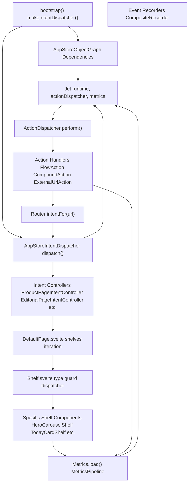
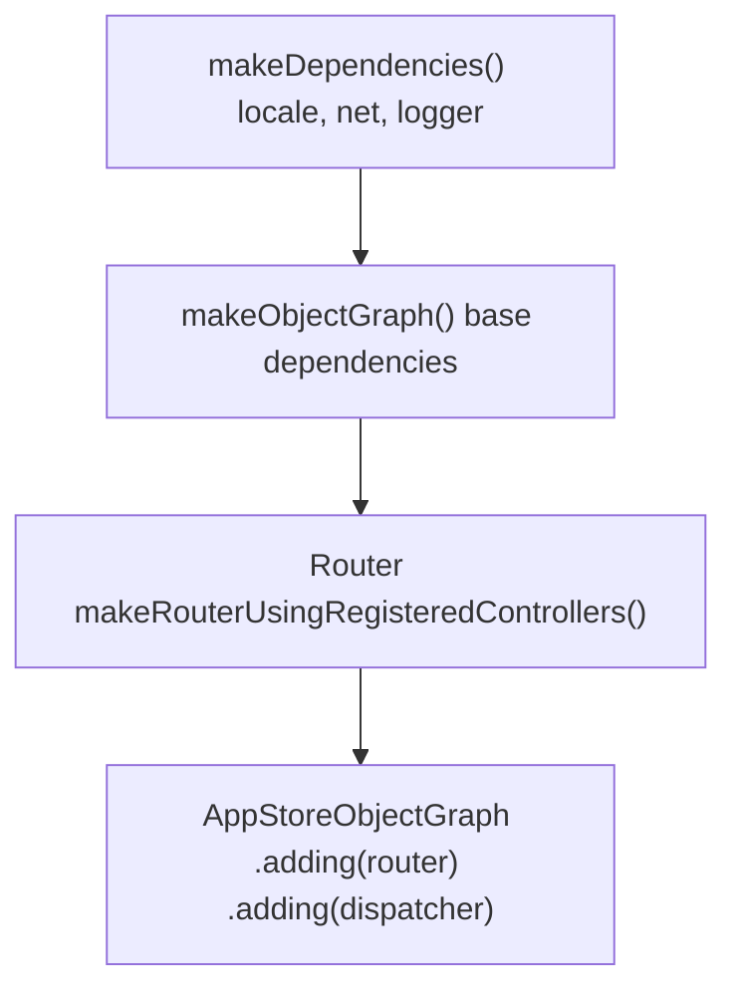
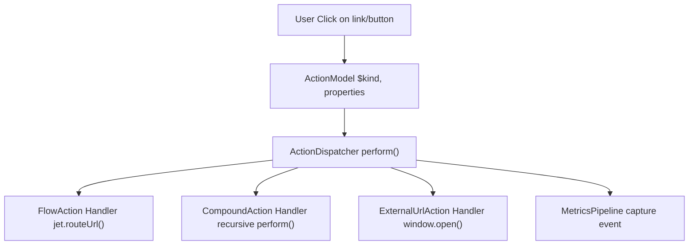
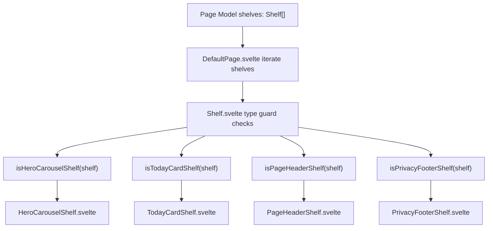
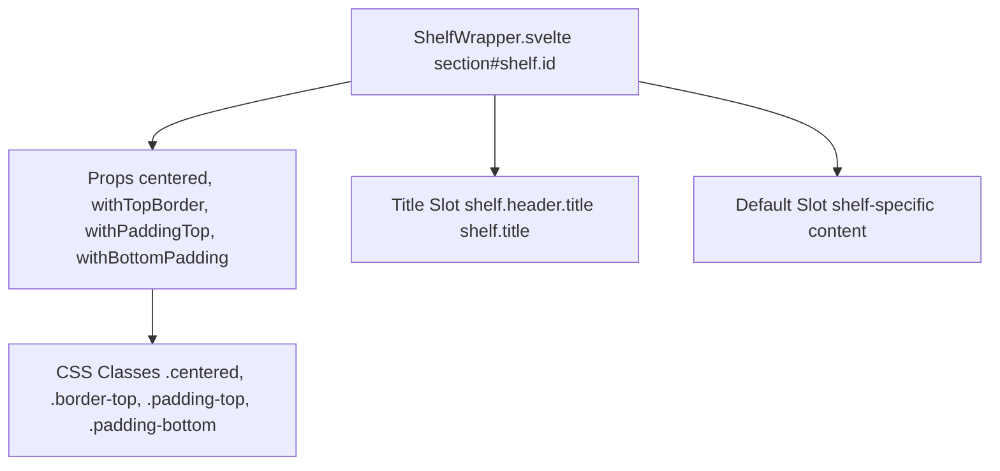
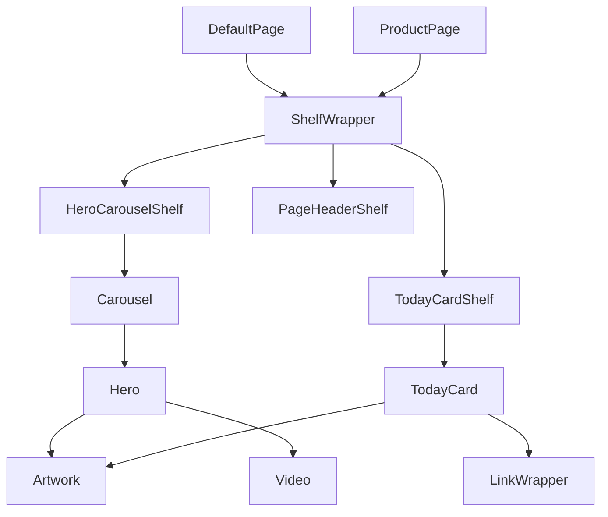

# Architecture

-   [src/components/Shelf/Wrapper.svelte](https://github.com/Chesszyh/apps.apple.com/blob/279d0c4d/src/components/Shelf/Wrapper.svelte)
-   [src/components/jet/shelf/ArcadeFooterShelf.svelte](https://github.com/Chesszyh/apps.apple.com/blob/279d0c4d/src/components/jet/shelf/ArcadeFooterShelf.svelte)
-   [src/components/jet/shelf/PageHeaderShelf.svelte](https://github.com/Chesszyh/apps.apple.com/blob/279d0c4d/src/components/jet/shelf/PageHeaderShelf.svelte)
-   [src/components/jet/shelf/PrivacyFooterShelf.svelte](https://github.com/Chesszyh/apps.apple.com/blob/279d0c4d/src/components/jet/shelf/PrivacyFooterShelf.svelte)
-   [src/components/pages/DefaultPage.svelte](https://github.com/Chesszyh/apps.apple.com/blob/279d0c4d/src/components/pages/DefaultPage.svelte)
-   [src/jet/action-handlers/browser.ts](https://github.com/Chesszyh/apps.apple.com/blob/279d0c4d/src/jet/action-handlers/browser.ts)
-   [src/jet/action-handlers/compound-action.ts](https://github.com/Chesszyh/apps.apple.com/blob/279d0c4d/src/jet/action-handlers/compound-action.ts)
-   [src/jet/action-handlers/external-url-action.ts](https://github.com/Chesszyh/apps.apple.com/blob/279d0c4d/src/jet/action-handlers/external-url-action.ts)
-   [src/jet/bootstrap.ts](https://github.com/Chesszyh/apps.apple.com/blob/279d0c4d/src/jet/bootstrap.ts)
-   [src/jet/intents/route-url/route-url-controller.ts](https://github.com/Chesszyh/apps.apple.com/blob/279d0c4d/src/jet/intents/route-url/route-url-controller.ts)
-   [src/jet/intents/route-url/route-url-intent.ts](https://github.com/Chesszyh/apps.apple.com/blob/279d0c4d/src/jet/intents/route-url/route-url-intent.ts)
-   [src/jet/intents/static-message-pages/carrier-page-intent-controller.ts](https://github.com/Chesszyh/apps.apple.com/blob/279d0c4d/src/jet/intents/static-message-pages/carrier-page-intent-controller.ts)
-   [src/jet/intents/static-message-pages/contingent-price-page-intent-controller.ts](https://github.com/Chesszyh/apps.apple.com/blob/279d0c4d/src/jet/intents/static-message-pages/contingent-price-page-intent-controller.ts)
-   [src/jet/intents/static-message-pages/invoice-page-intent-controller.ts](https://github.com/Chesszyh/apps.apple.com/blob/279d0c4d/src/jet/intents/static-message-pages/invoice-page-intent-controller.ts)
-   [src/jet/jet.ts](https://github.com/Chesszyh/apps.apple.com/blob/279d0c4d/src/jet/jet.ts)
-   [src/jet/models/external-action.ts](https://github.com/Chesszyh/apps.apple.com/blob/279d0c4d/src/jet/models/external-action.ts)
-   [src/jet/svelte.ts](https://github.com/Chesszyh/apps.apple.com/blob/279d0c4d/src/jet/svelte.ts)

This document describes the core architectural patterns and design decisions that govern the App Store web application. It covers the fundamental systems that enable routing, page rendering, component composition, and user interaction handling.

For detailed information about specific subsystems, see:

-   **Jet Application Core** [#2.1](#2.1) - Bootstrap, object graph, and dependency injection
-   **Intent and Action System** [#2.2](#2.2) - Routing and action dispatching mechanics
-   **Component Architecture** [#2.3](#2.3) - Component composition and type guard patterns

## Architectural Overview

The application is built on a **layered architecture** with clear separation of concerns:

1.  **Application Core Layer** - The Jet system manages initialization, routing, and dependency injection
2.  **Data Layer** - Intent controllers fetch and transform API data into page models
3.  **Presentation Layer** - Svelte components render shelf-based page models
4.  **Interaction Layer** - Action handlers process user interactions and navigation
5.  **Observability Layer** - Metrics pipeline tracks events independently of business logic


**Sources:** [src/jet/jet.ts1-320](https://github.com/Chesszyh/apps.apple.com/blob/279d0c4d/src/jet/jet.ts#L1-L320) [src/jet/bootstrap.ts1-126](https://github.com/Chesszyh/apps.apple.com/blob/279d0c4d/src/jet/bootstrap.ts#L1-L126) [src/components/pages/DefaultPage.svelte1-174](https://github.com/Chesszyh/apps.apple.com/blob/279d0c4d/src/components/pages/DefaultPage.svelte#L1-L174)

## Core Architectural Patterns

### Dependency Injection via Object Graph

The application uses the **AppStoreObjectGraph** to provide dependencies throughout the system. The object graph is immutable and composed using a builder pattern:


The object graph provides access to:

-   `locale` - Current storefront and language
-   `net` - Network client for API requests
-   `logger` - Logging infrastructure
-   `router` - URL routing system
-   `dispatcher` - Intent dispatcher

**Sources:** [src/jet/bootstrap.ts100-125](https://github.com/Chesszyh/apps.apple.com/blob/279d0c4d/src/jet/bootstrap.ts#L100-L125) [src/jet/jet.ts73-94](https://github.com/Chesszyh/apps.apple.com/blob/279d0c4d/src/jet/jet.ts#L73-L94)

### Intent-Based Routing

The routing system follows an **intent controller pattern** where URLs map to intent objects, which are then dispatched to controllers that return page models:

> **[Mermaid sequence]**
> *(图表结构无法解析)*

Intent controllers implement the `IntentController` interface and may also implement `RouteProvider` to register URL patterns. The `RouteUrlIntentController` acts as a meta-controller that resolves arbitrary URLs to specific intents.

**Sources:** [src/jet/intents/route-url/route-url-controller.ts1-29](https://github.com/Chesszyh/apps.apple.com/blob/279d0c4d/src/jet/intents/route-url/route-url-controller.ts#L1-L29) [src/jet/bootstrap.ts44-98](https://github.com/Chesszyh/apps.apple.com/blob/279d0c4d/src/jet/bootstrap.ts#L44-L98)

### Action Dispatcher Pattern

User interactions are modeled as **action objects** that are dispatched through the `ActionDispatcher`. Each action type has a registered handler:

| Action Type | Handler | Purpose |
| --- | --- | --- |
| `FlowAction` | `flow-action.ts` | Navigate to new intent/page |
| `CompoundAction` | `compound-action.ts` | Execute multiple actions sequentially |
| `ExternalUrlAction` | `external-url-action.ts` | Open external URLs |


The dispatcher supports **metrics behaviors** that control whether and how metrics are captured for each action.

**Sources:** [src/jet/jet.ts206-240](https://github.com/Chesszyh/apps.apple.com/blob/279d0c4d/src/jet/jet.ts#L206-L240) [src/jet/action-handlers/compound-action.ts1-34](https://github.com/Chesszyh/apps.apple.com/blob/279d0c4d/src/jet/action-handlers/compound-action.ts#L1-L34) [src/jet/action-handlers/external-url-action.ts1-20](https://github.com/Chesszyh/apps.apple.com/blob/279d0c4d/src/jet/action-handlers/external-url-action.ts#L1-L20)

## Shelf-Based Page Model

Pages are composed of **shelves**, which are typed data structures that contain items to display. The rendering system uses **type guards** to dynamically dispatch to specific shelf components:


### Shelf Type Guard Pattern

Each shelf component exports a type guard function that checks if a generic `Shelf` matches its expected structure:

```
// From PageHeaderShelf.svelteinterface PageHeaderShelf extends Shelf {    items: [PageHeader];}export function isPageHeaderShelf(shelf: Shelf): shelf is PageHeaderShelf {    const { contentType, items } = shelf;    return contentType === 'pageHeader' && Array.isArray(items);}
```
This pattern enables:

-   **Type safety** - TypeScript narrows types after guard checks
-   **Polymorphism** - Generic shelf arrays render to specific components
-   **Extensibility** - New shelf types can be added without modifying existing code
-   **Runtime validation** - Guards ensure data matches expected structure

**Sources:** [src/components/jet/shelf/PageHeaderShelf.svelte1-35](https://github.com/Chesszyh/apps.apple.com/blob/279d0c4d/src/components/jet/shelf/PageHeaderShelf.svelte#L1-L35) [src/components/jet/shelf/PrivacyFooterShelf.svelte1-41](https://github.com/Chesszyh/apps.apple.com/blob/279d0c4d/src/components/jet/shelf/PrivacyFooterShelf.svelte#L1-L41) [src/components/jet/shelf/ArcadeFooterShelf.svelte1-33](https://github.com/Chesszyh/apps.apple.com/blob/279d0c4d/src/components/jet/shelf/ArcadeFooterShelf.svelte#L1-L33)

### Shelf Wrapper Pattern

The `ShelfWrapper` component provides consistent layout and spacing for all shelves:


The wrapper handles:

-   **Centering** - Horizontal constraints via `--bodyGutter`
-   **Spacing** - Consistent top/bottom padding (13px top, 32px bottom)
-   **Borders** - Optional top borders with `var(--systemGray4)`
-   **Titles** - Automatic rendering of shelf headers with "See All" actions
-   **Accessibility** - Section landmarks with shelf IDs

**Sources:** [src/components/Shelf/Wrapper.svelte1-82](https://github.com/Chesszyh/apps.apple.com/blob/279d0c4d/src/components/Shelf/Wrapper.svelte#L1-L82)

## Component Composition Hierarchy

Components are composed in layers from pages down to primitives:


Each layer has distinct responsibilities:

-   **Page Layer** - Orchestrates shelf rendering, manages page-level state
-   **Shelf Layer** - Wraps content with consistent layout, provides shelf-specific logic
-   **Container Layer** - Manages collections of items (carousels, cards, grids)
-   **Primitive Layer** - Renders individual content elements (images, videos, links)

**Sources:** [src/components/pages/DefaultPage.svelte1-174](https://github.com/Chesszyh/apps.apple.com/blob/279d0c4d/src/components/pages/DefaultPage.svelte#L1-L174) [src/components/Shelf/Wrapper.svelte1-82](https://github.com/Chesszyh/apps.apple.com/blob/279d0c4d/src/components/Shelf/Wrapper.svelte#L1-L82) [src/components/jet/shelf/PageHeaderShelf.svelte1-35](https://github.com/Chesszyh/apps.apple.com/blob/279d0c4d/src/components/jet/shelf/PageHeaderShelf.svelte#L1-L35)

## Application Lifecycle

The Jet system manages the complete application lifecycle through a static factory method:

> **[Mermaid sequence]**
> *(图表结构无法解析)*

The initialization process:

1.  **Dependencies Creation** - `makeDependencies()` creates locale, net, logger instances
2.  **Bootstrap** - `bootstrap()` creates IntentDispatcher, Router, and ObjectGraph
3.  **Metrics Setup** - `Metrics.load()` initializes the metrics pipeline with providers
4.  **Action Dispatcher** - `ActionDispatcher` is created with metrics integration
5.  **Jet Construction** - Main `Jet` instance is created with all dependencies
6.  **Context Registration** - Jet is placed in Svelte context for global access via `getJet()`

**Sources:** [src/jet/jet.ts76-132](https://github.com/Chesszyh/apps.apple.com/blob/279d0c4d/src/jet/jet.ts#L76-L132) [src/jet/bootstrap.ts100-125](https://github.com/Chesszyh/apps.apple.com/blob/279d0c4d/src/jet/bootstrap.ts#L100-L125) [src/jet/svelte.ts1-46](https://github.com/Chesszyh/apps.apple.com/blob/279d0c4d/src/jet/svelte.ts#L1-L46)

## Static Page Controllers

The application includes several **static message page controllers** for non-API-backed pages like legal and informational content:

| Controller | Route | Content Type |
| --- | --- | --- |
| `CarrierPageIntentController` | `/carrier` | Carrier information |
| `InvoicePageIntentController` | `/invoice` | Invoice details |
| `ContingentPricingIntentController` | `/contingent-price/{offerId}` | Win-back pricing |

These controllers follow a consistent pattern:

```
// Simplified from carrier-page-intent-controller.tsexport const CarrierPageIntentController: IntentController<any> & RouteProvider = {    $intentKind: 'CarrierPageIntent',    routes,        async perform(intent, objectGraphWithoutActiveIntent: AppStoreObjectGraph) {        return await withActiveIntent(            objectGraphWithoutActiveIntent,            intent,            async (objectGraph) => {                const page = new StaticMessagePage({                    titleLocKey: 'ASE.Web.AppStore.Carrier.Title',                    contentType: 'carrier',                });                                page.canonicalURL = makeCanonicalUrl(objectGraph, intent);                injectWebNavigation(objectGraph, page, intent.platform);                return page;            },        );    },};
```
All static controllers:

-   Use `generateRoutes()` to define URL patterns
-   Return `StaticMessagePage` instances
-   Inject web navigation and canonical URLs
-   Support localization via `titleLocKey`

**Sources:** [src/jet/intents/static-message-pages/carrier-page-intent-controller.ts1-42](https://github.com/Chesszyh/apps.apple.com/blob/279d0c4d/src/jet/intents/static-message-pages/carrier-page-intent-controller.ts#L1-L42) [src/jet/intents/static-message-pages/invoice-page-intent-controller.ts1-42](https://github.com/Chesszyh/apps.apple.com/blob/279d0c4d/src/jet/intents/static-message-pages/invoice-page-intent-controller.ts#L1-L42) [src/jet/intents/static-message-pages/contingent-price-page-intent-controller.ts1-50](https://github.com/Chesszyh/apps.apple.com/blob/279d0c4d/src/jet/intents/static-message-pages/contingent-price-page-intent-controller.ts#L1-L50)

## Design Principles

The architecture is guided by several key principles:

### Separation of Concerns

-   **Routing** is separate from **data fetching** (intent controllers)
-   **Data models** are separate from **presentation** (page models vs Svelte components)
-   **Metrics** operate independently via pipeline architecture

### Composition Over Inheritance

-   Shelves compose primitive components
-   Pages compose shelves
-   Actions compose sub-actions (`CompoundAction`)

### Type Safety via Runtime Guards

-   Type guards enable compile-time and runtime type checking
-   Narrow types progressively as data flows through system
-   Fail gracefully when data doesn't match expected structure

### Immutability

-   ObjectGraph uses builder pattern, never mutates
-   Page models are read-only data structures
-   State changes trigger new instances rather than mutations

### Extensibility

-   New shelf types: implement component + type guard
-   New actions: implement handler + register with dispatcher
-   New pages: implement intent controller + register with dispatcher
-   All extension points use registration pattern, not modification

**Sources:** [src/jet/jet.ts1-320](https://github.com/Chesszyh/apps.apple.com/blob/279d0c4d/src/jet/jet.ts#L1-L320) [src/jet/bootstrap.ts1-126](https://github.com/Chesszyh/apps.apple.com/blob/279d0c4d/src/jet/bootstrap.ts#L1-L126)
