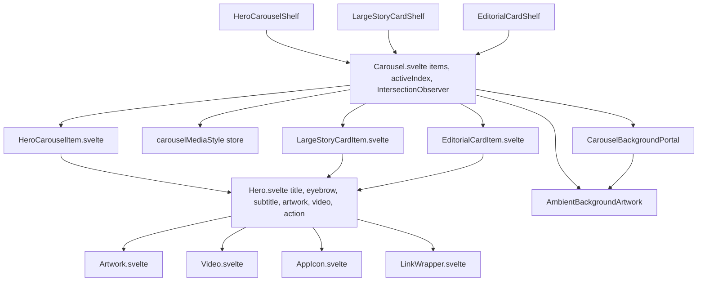
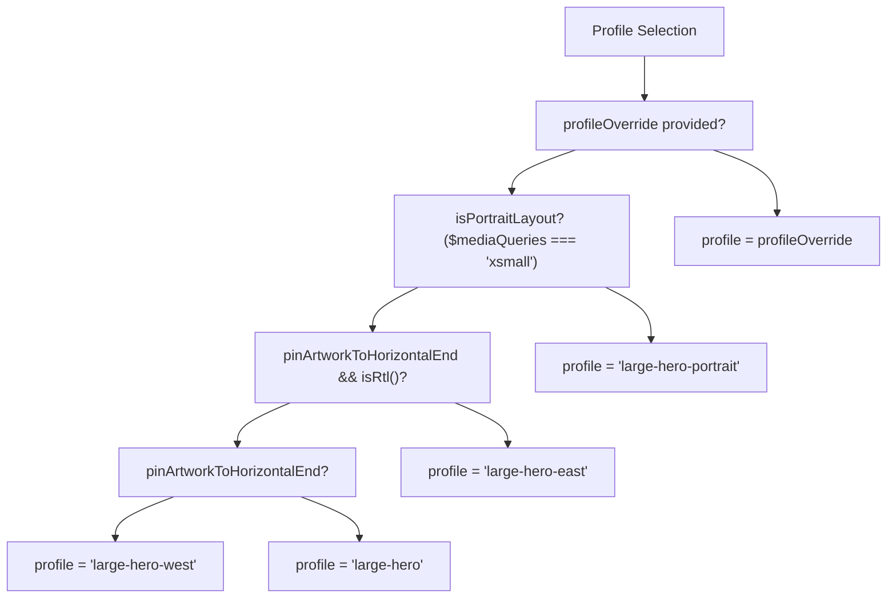
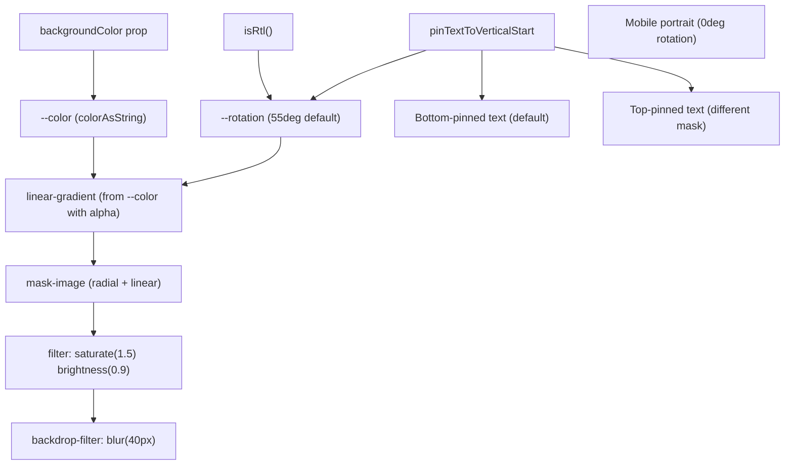
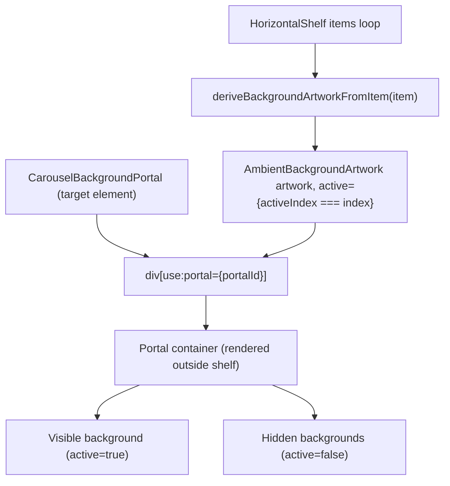

# Hero and Carousel Components

-   [src/components/hero/Carousel.svelte](https://github.com/Chesszyh/apps.apple.com/blob/279d0c4d/src/components/hero/Carousel.svelte)
-   [src/components/hero/Hero.svelte](https://github.com/Chesszyh/apps.apple.com/blob/279d0c4d/src/components/hero/Hero.svelte)
-   [src/components/jet/item/EditorialCardItem.svelte](https://github.com/Chesszyh/apps.apple.com/blob/279d0c4d/src/components/jet/item/EditorialCardItem.svelte)
-   [src/components/jet/item/HeroCarouselItem.svelte](https://github.com/Chesszyh/apps.apple.com/blob/279d0c4d/src/components/jet/item/HeroCarouselItem.svelte)
-   [src/components/jet/item/LargeStoryCardItem.svelte](https://github.com/Chesszyh/apps.apple.com/blob/279d0c4d/src/components/jet/item/LargeStoryCardItem.svelte)

## Purpose and Scope

The Hero and Carousel system provides a generic, reusable pattern for displaying large-format promotional content across the App Store web application. The `Hero` component ([src/components/hero/Hero.svelte](https://github.com/Chesszyh/apps.apple.com/blob/279d0c4d/src/components/hero/Hero.svelte)) implements a flexible layout for individual items with artwork, video, text overlays, and gradients, while `Carousel` ([src/components/hero/Carousel.svelte](https://github.com/Chesszyh/apps.apple.com/blob/279d0c4d/src/components/hero/Carousel.svelte)) orchestrates multiple Hero items with horizontal scrolling, active item detection, and ambient background effects.

This document covers the generic Hero and Carousel infrastructure. For specific shelf types that use these components, see [Editorial and Promotional Shelves](#7.1). For the underlying image system, see [Artwork and Media System](#5.1). For horizontal scrolling mechanics, see [Scrollable Shelves](#5.2).

---

## Architecture Overview

The Hero/Carousel system implements a three-layer architecture: the generic `Hero` component provides layout and styling, the `Carousel` component manages orchestration and state, and item-specific components (like `HeroCarouselItem`, `LargeStoryCardItem`, `EditorialCardItem`) bind data models to the Hero interface.


**Sources:** [src/components/hero/Hero.svelte1-537](https://github.com/Chesszyh/apps.apple.com/blob/279d0c4d/src/components/hero/Hero.svelte#L1-L537) [src/components/hero/Carousel.svelte1-133](https://github.com/Chesszyh/apps.apple.com/blob/279d0c4d/src/components/hero/Carousel.svelte#L1-L133) [src/components/jet/item/HeroCarouselItem.svelte1-61](https://github.com/Chesszyh/apps.apple.com/blob/279d0c4d/src/components/jet/item/HeroCarouselItem.svelte#L1-L61) [src/components/jet/item/LargeStoryCardItem.svelte1-39](https://github.com/Chesszyh/apps.apple.com/blob/279d0c4d/src/components/jet/item/LargeStoryCardItem.svelte#L1-L39) [src/components/jet/item/EditorialCardItem.svelte1-42](https://github.com/Chesszyh/apps.apple.com/blob/279d0c4d/src/components/jet/item/EditorialCardItem.svelte#L1-L42)

---

## Hero Component Interface

`Hero.svelte` provides a generic, data-model-agnostic interface for rendering large-format content. The component accepts optional props for all visual elements, enabling reuse across different shelf types.

### Core Props

| Prop | Type | Purpose |
| --- | --- | --- |
| `title` | `Opt<string>` | Main heading text |
| `eyebrow` | `Opt<string>` | Text above title (can be overridden by slot) |
| `subtitle` | `Opt<string>` | Text below title |
| `backgroundColor` | `Opt<Color>` | Primary accent color for gradients |
| `artwork` | `Opt<ArtworkModel>` | Static image to display |
| `video` | `Opt<VideoModel>` | Video (takes precedence over artwork) |
| `action` | `Opt<Action>` | Click action for entire item |
| `collectionIcons` | `ArtworkModel[]` | Array of app icons for collection display |
| `isMediaDark` | `boolean` | Controls text color scheme (default: true) |

**Sources:** [src/components/hero/Hero.svelte30-91](https://github.com/Chesszyh/apps.apple.com/blob/279d0c4d/src/components/hero/Hero.svelte#L30-L91)

### Layout Control Props

The Hero component supports flexible positioning of artwork and text through boolean flags:

| Prop | Behavior |
| --- | --- |
| `pinArtworkToHorizontalEnd` | Aligns artwork to right (LTR) or left (RTL) edge |
| `pinArtworkToVerticalMiddle` | Centers artwork vertically (default is top) |
| `pinTextToVerticalStart` | Positions text at top (default is bottom) |
| `profileOverride` | Overrides automatic profile selection |

**Sources:** [src/components/hero/Hero.svelte71-86](https://github.com/Chesszyh/apps.apple.com/blob/279d0c4d/src/components/hero/Hero.svelte#L71-L86)

### Profile Resolution Logic

The component automatically selects an artwork profile based on viewport and layout flags:


**Sources:** [src/components/hero/Hero.svelte99-111](https://github.com/Chesszyh/apps.apple.com/blob/279d0c4d/src/components/hero/Hero.svelte#L99-L111)

---

## Rendering Modes

The Hero component supports three distinct rendering modes based on available media:

### 1\. Artwork/Video Mode

When `artwork` or `video` props are provided, the component renders media in an absolutely positioned container with a gradient overlay:

-   Video plays when `!$prefersReducedMotion` ([src/components/hero/Hero.svelte143-150](https://github.com/Chesszyh/apps.apple.com/blob/279d0c4d/src/components/hero/Hero.svelte#L143-L150))
-   Artwork uses the selected profile with `useCropCodeFromArtwork={false}` and `withoutBorder={true}` ([src/components/hero/Hero.svelte152-158](https://github.com/Chesszyh/apps.apple.com/blob/279d0c4d/src/components/hero/Hero.svelte#L152-L158))
-   Background color from `backgroundColor` prop fills the container ([src/components/hero/Hero.svelte141-142](https://github.com/Chesszyh/apps.apple.com/blob/279d0c4d/src/components/hero/Hero.svelte#L141-L142))

### 2\. Collection Icons Mode

When `collectionIcons` array is provided (without artwork/video), displays up to 5 app icons in a grid with an animated gradient background:

-   Icons arranged in 2-row grid with `grid-template-rows: auto auto` ([src/components/hero/Hero.svelte428-442](https://github.com/Chesszyh/apps.apple.com/blob/279d0c4d/src/components/hero/Hero.svelte#L428-L442))
-   Gradient built from icon background colors using `getBackgroundGradientCSSVarsFromArtworks()` ([src/components/hero/Hero.svelte117-126](https://github.com/Chesszyh/apps.apple.com/blob/279d0c4d/src/components/hero/Hero.svelte#L117-L126))
-   Animation shifts gradient stops over 16 seconds ([src/components/hero/Hero.svelte511-535](https://github.com/Chesszyh/apps.apple.com/blob/279d0c4d/src/components/hero/Hero.svelte#L511-L535))

### 3\. Text-Only Mode

When no media is provided, displays only text content with gradient background.

**Sources:** [src/components/hero/Hero.svelte136-178](https://github.com/Chesszyh/apps.apple.com/blob/279d0c4d/src/components/hero/Hero.svelte#L136-L178)

---

## Gradient System

The Hero component implements sophisticated gradient overlays for text legibility. The gradient is positioned absolutely at `z-index: -1` and uses multiple masking techniques:


The gradient uses `rgb(from var(--color) r g b / 0.25)` syntax to derive a semi-transparent version of the background color ([src/components/hero/Hero.svelte389-393](https://github.com/Chesszyh/apps.apple.com/blob/279d0c4d/src/components/hero/Hero.svelte#L389-L393)). Different mask-image patterns are applied based on text position ([src/components/hero/Hero.svelte397-426](https://github.com/Chesszyh/apps.apple.com/blob/279d0c4d/src/components/hero/Hero.svelte#L397-L426)).

**Sources:** [src/components/hero/Hero.svelte366-426](https://github.com/Chesszyh/apps.apple.com/blob/279d0c4d/src/components/hero/Hero.svelte#L366-L426)

---

## Text Color Modes

The component adjusts text colors based on media darkness:

| Condition | Primary Color | Secondary Color | Blend Mode |
| --- | --- | --- | --- |
| `with-dark-media` | `--systemPrimary-onDark` | `--systemSecondary-onDark` | `plus-lighter` |
| `with-collection-icons` | `--systemPrimary-onDark` | `--systemSecondary-onDark` | `plus-lighter` |
| Default | `--systemPrimary-onLight` | `--systemSecondary-onLight` | `normal` |

The `plus-lighter` blend mode enhances text visibility on dark backgrounds ([src/components/hero/Hero.svelte231-237](https://github.com/Chesszyh/apps.apple.com/blob/279d0c4d/src/components/hero/Hero.svelte#L231-L237)).

**Sources:** [src/components/hero/Hero.svelte207-237](https://github.com/Chesszyh/apps.apple.com/blob/279d0c4d/src/components/hero/Hero.svelte#L207-L237)

---

## Carousel Orchestration

`Carousel.svelte` is a generic component that manages multiple Hero items, tracking the active item through intersection observation and coordinating ambient background effects.

### Component Interface

```
interface CarouselProps<Item> {    shelf: Shelf;                    // Shelf configuration    items: Item[];                   // Generic array of items to render    deriveBackgroundArtworkFromItem: (item: Item) => Opt<Artwork>;}interface CarouselSlots<Item> {    default: {        item: Item;                  // Current item to render    };}
```
The component uses Svelte generics (`<script lang="ts" generics="Item">`) to support any item type ([src/components/hero/Carousel.svelte6](https://github.com/Chesszyh/apps.apple.com/blob/279d0c4d/src/components/hero/Carousel.svelte#L6-L6)).

**Sources:** [src/components/hero/Carousel.svelte22-45](https://github.com/Chesszyh/apps.apple.com/blob/279d0c4d/src/components/hero/Carousel.svelte#L22-L45)

---

## Active Item Detection

The Carousel uses `IntersectionObserver` to detect which Hero item is currently visible, updating both `activeIndex` and the global `carouselMediaStyle` store:

> **[Mermaid sequence]**
> *(图表结构无法解析)*

The callback function extracts style information from the item using dynamic property access:

```
const { style, mediaOverlayStyle, isMediaDark } = items[index] as any;const fallbackStyle = 'dark';let derivedStyle;if (typeof isMediaDark !== 'undefined') {    derivedStyle = isMediaDark ? 'dark' : 'light';}carouselMediaStyle.set(    style || mediaOverlayStyle || derivedStyle || fallbackStyle,);
```
**Sources:** [src/components/hero/Carousel.svelte58-81](https://github.com/Chesszyh/apps.apple.com/blob/279d0c4d/src/components/hero/Carousel.svelte#L58-L81)

### Viewport-Specific Thresholds

Different intersection thresholds are used based on viewport size:

-   **xsmall viewport**: `threshold: 0.5` (50% visible) ([src/components/hero/Carousel.svelte98-106](https://github.com/Chesszyh/apps.apple.com/blob/279d0c4d/src/components/hero/Carousel.svelte#L98-L106))
-   **small-up viewport**: `threshold: 0` (any visible portion) ([src/components/hero/Carousel.svelte108-130](https://github.com/Chesszyh/apps.apple.com/blob/279d0c4d/src/components/hero/Carousel.svelte#L108-L130))

The higher threshold on mobile ensures the fully-scrolled-to item is marked active, while the lower threshold on desktop provides earlier ambient background updates.

**Sources:** [src/components/hero/Carousel.svelte98-130](https://github.com/Chesszyh/apps.apple.com/blob/279d0c4d/src/components/hero/Carousel.svelte#L98-L130)

---

## Ambient Background System

On non-mobile viewports, the Carousel renders `AmbientBackgroundArtwork` components through a portal system. Each Hero item has a corresponding background artwork that's shown when that item becomes active:


The portal system (`use:portal={portalId}`) teleports the background artwork elements to a shared container outside the scrollable shelf, preventing them from scrolling with their associated items ([src/components/hero/Carousel.svelte119](https://github.com/Chesszyh/apps.apple.com/blob/279d0c4d/src/components/hero/Carousel.svelte#L119-L119)).

Background rendering is skipped during SSR (`!import.meta.env.SSR`) to avoid hydration mismatches ([src/components/hero/Carousel.svelte114](https://github.com/Chesszyh/apps.apple.com/blob/279d0c4d/src/components/hero/Carousel.svelte#L114-L114)).

**Sources:** [src/components/hero/Carousel.svelte15-126](https://github.com/Chesszyh/apps.apple.com/blob/279d0c4d/src/components/hero/Carousel.svelte#L15-L126)

---

## Integration with Item Types

Item-specific components adapt data models to the Hero interface. This pattern decouples Hero from specific API models.

### HeroCarouselItem Adapter

Maps `HeroCarouselItem` model to Hero props:

| Model Property | Hero Prop | Transformation |
| --- | --- | --- |
| `item.overlay.titleText` | `title` | Direct mapping |
| `item.overlay.badgeText` | `eyebrow` | Direct mapping |
| `item.overlay.descriptionText` | `subtitle` | Direct mapping |
| `item.artwork || item.video?.preview` | `artwork` | Fallback chain |
| `isXSmallViewport ? item.portraitVideo : item.video` | `video` | Viewport-based selection |
| `item.overlay.clickAction` | `action` | Direct mapping |

The component also renders conditional slots:

-   `overlayType === 'singleModule'`: Renders `HeroAppLockup` ([src/components/jet/item/HeroCarouselItem.svelte41-42](https://github.com/Chesszyh/apps.apple.com/blob/279d0c4d/src/components/jet/item/HeroCarouselItem.svelte#L41-L42))
-   `callToActionText && !isPortraitLayout`: Renders CTA button ([src/components/jet/item/HeroCarouselItem.svelte43-48](https://github.com/Chesszyh/apps.apple.com/blob/279d0c4d/src/components/jet/item/HeroCarouselItem.svelte#L43-L48))

**Sources:** [src/components/jet/item/HeroCarouselItem.svelte1-61](https://github.com/Chesszyh/apps.apple.com/blob/279d0c4d/src/components/jet/item/HeroCarouselItem.svelte#L1-L61)

### LargeStoryCardItem Adapter

Maps `TodayCard` model with profile selection based on viewport and RTL:

```
$: profile = isXSmallViewport    ? 'large-hero-story-card-portrait'    : isRtl()    ? 'large-hero-story-card-rtl'    : 'large-hero-story-card';
```
Sets layout flags specific to story card design:

-   `pinArtworkToVerticalMiddle={true}`
-   `pinArtworkToHorizontalEnd={true}`
-   `pinTextToVerticalStart={isRtl()}`

**Sources:** [src/components/jet/item/LargeStoryCardItem.svelte1-39](https://github.com/Chesszyh/apps.apple.com/blob/279d0c4d/src/components/jet/item/LargeStoryCardItem.svelte#L1-L39)

### EditorialCardItem Adapter

Maps `EditorialCard` model with custom eyebrow slot for app event dates:

```
<svelte:fragment slot="eyebrow">    {#if item.appEventFormattedDates}        <AppEventDate formattedDates={item.appEventFormattedDates} />    {:else}        {item.caption}    {/if}</svelte:fragment>
```
Also renders `AppLockupDetail` in the details slot when `item.lockup` is present ([src/components/jet/item/EditorialCardItem.svelte33-40](https://github.com/Chesszyh/apps.apple.com/blob/279d0c4d/src/components/jet/item/EditorialCardItem.svelte#L33-L40)).

**Sources:** [src/components/jet/item/EditorialCardItem.svelte1-42](https://github.com/Chesszyh/apps.apple.com/blob/279d0c4d/src/components/jet/item/EditorialCardItem.svelte#L1-L42)

---

## Responsive Behavior

The Hero component adapts its layout across viewport breakpoints:

| Viewport | Aspect Ratio | Text Width | Text Position | Border Radius |
| --- | --- | --- | --- | --- |
| xsmall | 3:4 (portrait) | 100% | Center-aligned | None |
| small | 16:9 | 50% | Left-aligned | `--global-border-radius-large` |
| medium-up | 16:9 | 40% | Left-aligned | `--global-border-radius-large` |

Additional responsive constraints:

-   **Min height (small-up)**: `360px` ([src/components/hero/Hero.svelte224](https://github.com/Chesszyh/apps.apple.com/blob/279d0c4d/src/components/hero/Hero.svelte#L224-L224))
-   **Max height (small-up)**: `min(60vh, 770px)` ([src/components/hero/Hero.svelte225](https://github.com/Chesszyh/apps.apple.com/blob/279d0c4d/src/components/hero/Hero.svelte#L225-L225))
-   **Container queries**: Adjusts title font size when `height < 420px` ([src/components/hero/Hero.svelte335-339](https://github.com/Chesszyh/apps.apple.com/blob/279d0c4d/src/components/hero/Hero.svelte#L335-L339))

**Sources:** [src/components/hero/Hero.svelte207-365](https://github.com/Chesszyh/apps.apple.com/blob/279d0c4d/src/components/hero/Hero.svelte#L207-L365)

---

## Horizontal Pinning and Aspect Ratio Handling

When `pinArtworkToHorizontalEnd={true}`, the Hero component implements special logic to handle artwork aspect ratios that don't match the container:

```
.image-container.pinned-to-horizontal-end :global(.artwork-component img) {    height: 100%;    width: auto;    position: absolute;    inset-inline-end: 0;    @container hero-container (aspect-ratio >= 279/100) {        width: 100%;        height: auto;    }}
```
For story card profiles with 2.25:1 aspect ratio, switches to full-width when container exceeds that ratio ([src/components/hero/Hero.svelte280-292](https://github.com/Chesszyh/apps.apple.com/blob/279d0c4d/src/components/hero/Hero.svelte#L280-L292)).

**Sources:** [src/components/hero/Hero.svelte258-292](https://github.com/Chesszyh/apps.apple.com/blob/279d0c4d/src/components/hero/Hero.svelte#L258-L292)

---

## Usage Pattern

Typical usage in a shelf component:

```
<Carousel    {shelf}    items={shelf.items}    deriveBackgroundArtworkFromItem={(item) => item.backgroundArtwork}    let:item>    <HeroCarouselItem {item} /></Carousel>
```
The slot pattern allows each shelf to provide its own item adapter component while Carousel handles orchestration.

**Sources:** [src/components/hero/Carousel.svelte86-132](https://github.com/Chesszyh/apps.apple.com/blob/279d0c4d/src/components/hero/Carousel.svelte#L86-L132)
