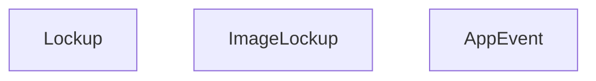
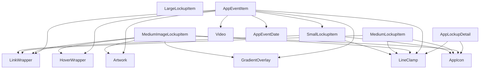
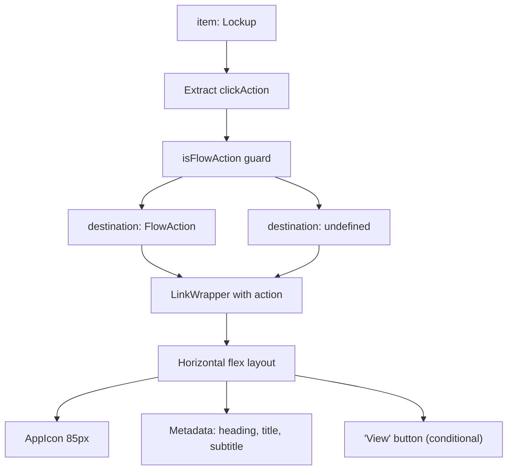
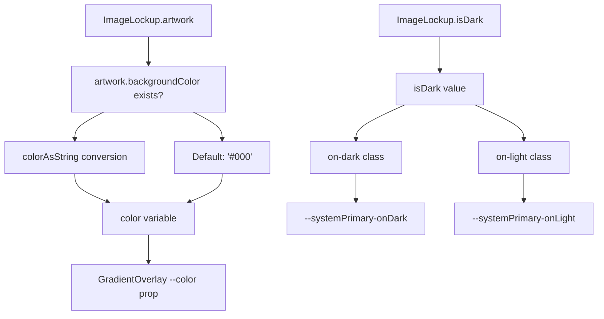
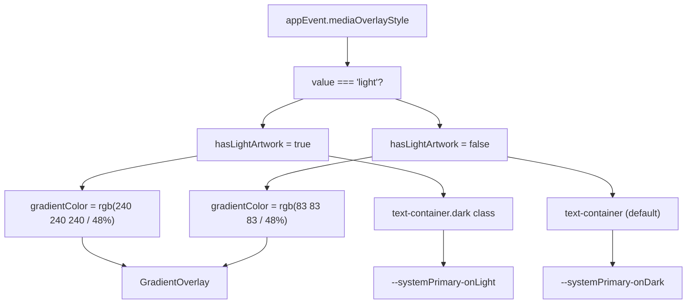
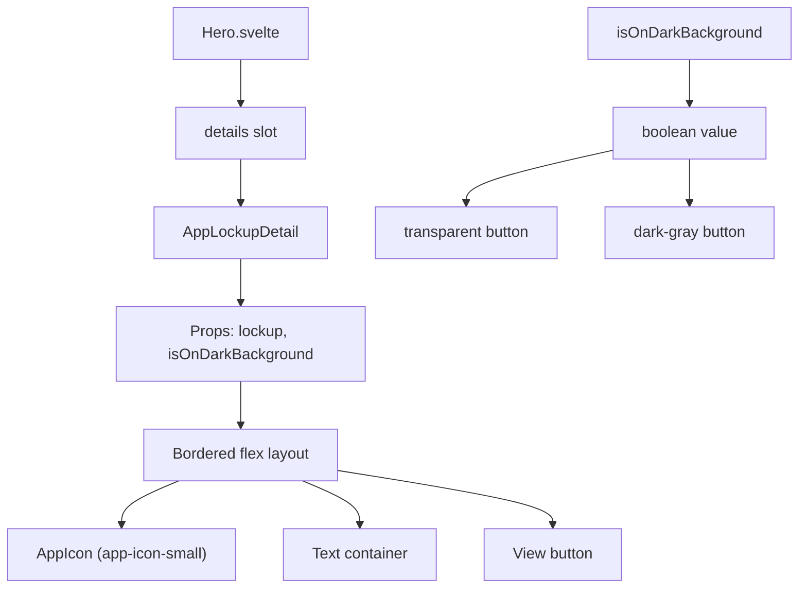
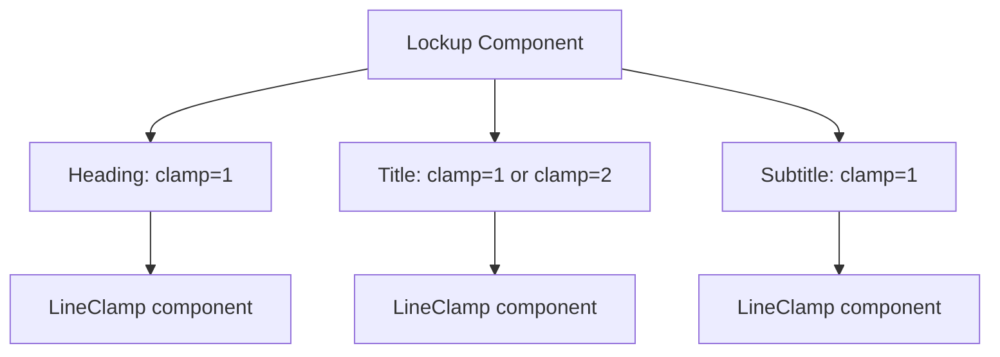
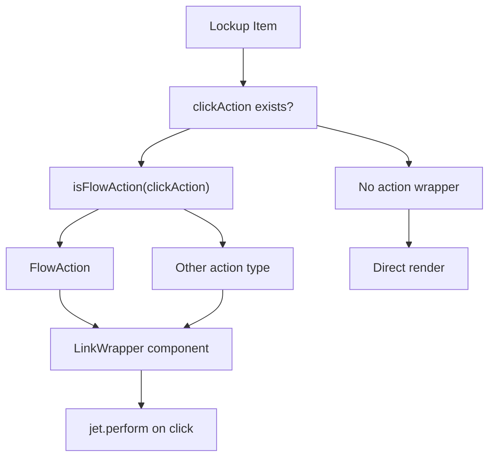
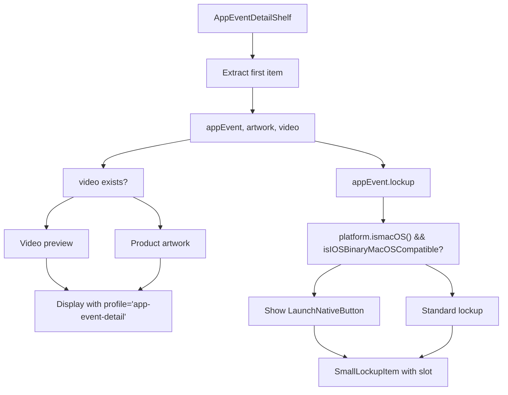
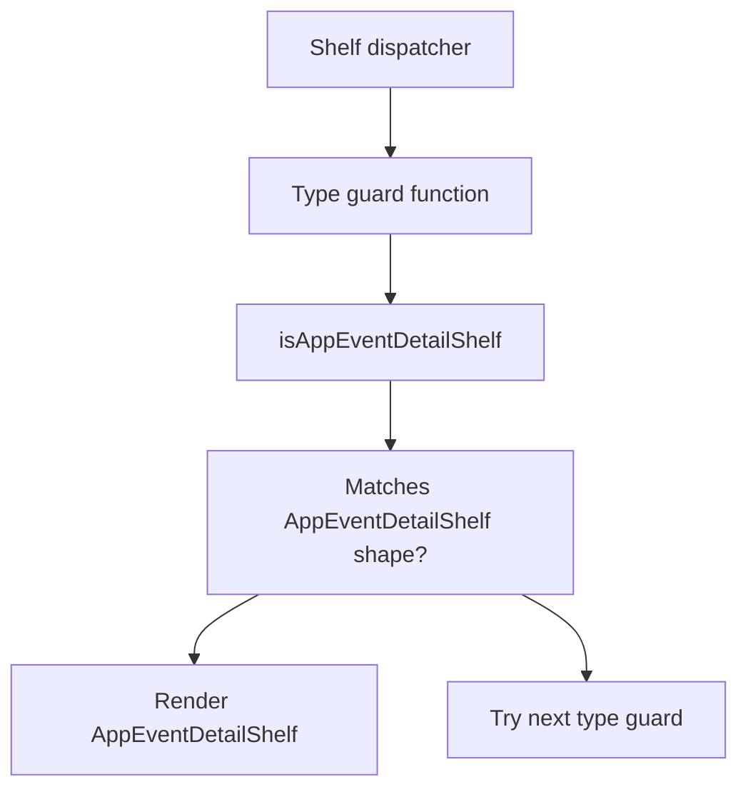

# Lockup Components

-   [src/components/hero/AppLockupDetail.svelte](https://github.com/Chesszyh/apps.apple.com/blob/279d0c4d/src/components/hero/AppLockupDetail.svelte)
-   [src/components/jet/item/AppEventItem.svelte](https://github.com/Chesszyh/apps.apple.com/blob/279d0c4d/src/components/jet/item/AppEventItem.svelte)
-   [src/components/jet/item/MediumImageLockupItem.svelte](https://github.com/Chesszyh/apps.apple.com/blob/279d0c4d/src/components/jet/item/MediumImageLockupItem.svelte)
-   [src/components/jet/item/MediumLockupItem.svelte](https://github.com/Chesszyh/apps.apple.com/blob/279d0c4d/src/components/jet/item/MediumLockupItem.svelte)
-   [src/components/jet/shelf/AppEventDetailShelf.svelte](https://github.com/Chesszyh/apps.apple.com/blob/279d0c4d/src/components/jet/shelf/AppEventDetailShelf.svelte)

## Purpose and Scope

Lockup components are a family of standardized item-level components that display app information, including icons, titles, metadata, and action buttons. They serve as the primary presentation pattern for apps and content across the App Store web application.

This page documents the complete lockup component family: `SmallLockupItem`, `MediumLockupItem`, `LargeLockupItem`, image lockup variants, app event items, and `AppLockupDetail`. For information about lockup-based shelves that orchestrate these components, see [Lockup and Grid Shelves](#7.2). For the generic Hero component that uses `AppLockupDetail`, see [Hero and Carousel Components](#5.4).

---

## Component Family Overview

The lockup component family consists of several variants optimized for different display contexts and content types:

| Component | Data Model | Primary Use Case | Key Features |
| --- | --- | --- | --- |
| `SmallLockupItem` | `Lockup` | Compact app listings, inline displays | Horizontal layout, 64px icon, single-line text |
| `MediumLockupItem` | `Lockup` | Standard app listings | Horizontal layout, 85px icon, multi-line text |
| `LargeLockupItem` | `Lockup` | Prominent app displays | Larger icon, expanded metadata |
| `MediumImageLockupItem` | `ImageLockup` | Editorial content | Artwork background with overlaid lockup |
| `AppEventItem` | `AppEvent` | In-app events | Video/artwork with event details, optional lockup |
| `AppLockupDetail` | `Lockup` | Hero carousel details | Designed for dark backgrounds, Hero slot integration |

---

## Data Model Structure


**Sources:** [src/components/jet/item/MediumLockupItem.svelte1-22](https://github.com/Chesszyh/apps.apple.com/blob/279d0c4d/src/components/jet/item/MediumLockupItem.svelte#L1-L22) [src/components/jet/item/MediumImageLockupItem.svelte1-17](https://github.com/Chesszyh/apps.apple.com/blob/279d0c4d/src/components/jet/item/MediumImageLockupItem.svelte#L1-L17) [src/components/jet/item/AppEventItem.svelte1-23](https://github.com/Chesszyh/apps.apple.com/blob/279d0c4d/src/components/jet/item/AppEventItem.svelte#L1-L23)

---

## Component Hierarchy and Primitive Usage

All lockup components compose primitive components to build their interfaces. The following diagram maps the component relationships:


**Sources:** [src/components/jet/item/MediumLockupItem.svelte8-11](https://github.com/Chesszyh/apps.apple.com/blob/279d0c4d/src/components/jet/item/MediumLockupItem.svelte#L8-L11) [src/components/jet/item/MediumImageLockupItem.svelte4-10](https://github.com/Chesszyh/apps.apple.com/blob/279d0c4d/src/components/jet/item/MediumImageLockupItem.svelte#L4-L10) [src/components/jet/item/AppEventItem.svelte4-12](https://github.com/Chesszyh/apps.apple.com/blob/279d0c4d/src/components/jet/item/AppEventItem.svelte#L4-L12) [src/components/hero/AppLockupDetail.svelte9-13](https://github.com/Chesszyh/apps.apple.com/blob/279d0c4d/src/components/hero/AppLockupDetail.svelte#L9-L13)

---

## MediumLockupItem

`MediumLockupItem` is the standard horizontal lockup component, displaying an app icon with metadata in a horizontal arrangement.

### Structure

The component renders:

1.  **App Icon Container**: 85px wide, uses `app-icon-medium` profile
2.  **Metadata Container**: Flexible width with heading, title, subtitle
3.  **Button Container**: "View" button displayed when `clickAction` is present

### Implementation Details


**File:** [src/components/jet/item/MediumLockupItem.svelte](https://github.com/Chesszyh/apps.apple.com/blob/279d0c4d/src/components/jet/item/MediumLockupItem.svelte)

**Key Code Entities:**

-   Component accepts `item: Lockup` prop [src/components/jet/item/MediumLockupItem.svelte14](https://github.com/Chesszyh/apps.apple.com/blob/279d0c4d/src/components/jet/item/MediumLockupItem.svelte#L14-L14)
-   Uses `isFlowAction` type guard [src/components/jet/item/MediumLockupItem.svelte19-21](https://github.com/Chesszyh/apps.apple.com/blob/279d0c4d/src/components/jet/item/MediumLockupItem.svelte#L19-L21)
-   Wraps content with `LinkWrapper` [src/components/jet/item/MediumLockupItem.svelte24](https://github.com/Chesszyh/apps.apple.com/blob/279d0c4d/src/components/jet/item/MediumLockupItem.svelte#L24-L24)
-   Icon uses profile `"app-icon-medium"` [src/components/jet/item/MediumLockupItem.svelte29](https://github.com/Chesszyh/apps.apple.com/blob/279d0c4d/src/components/jet/item/MediumLockupItem.svelte#L29-L29)
-   Text uses `LineClamp` with `clamp={1}` for single-line truncation [src/components/jet/item/MediumLockupItem.svelte40-42](https://github.com/Chesszyh/apps.apple.com/blob/279d0c4d/src/components/jet/item/MediumLockupItem.svelte#L40-L42)

### Styling System

| Element | CSS Class | Font Variable | Purpose |
| --- | --- | --- | --- |
| Heading | `.heading` | `--callout-emphasized` | Eyebrow text |
| Title | `h3` | `--title-3` | Primary app name |
| Subtitle | `p` | `--callout` | Secondary metadata |
| Button | `.get-button.gray` | Inherited | Action affordance |

**Sources:** [src/components/jet/item/MediumLockupItem.svelte62-96](https://github.com/Chesszyh/apps.apple.com/blob/279d0c4d/src/components/jet/item/MediumLockupItem.svelte#L62-L96)

---

## MediumImageLockupItem

`MediumImageLockupItem` presents a lockup overlaid on artwork, commonly used for editorial content and curated collections.

### Visual Composition

The component creates a layered display with three z-index levels:

1.  **Base Layer** (z-index: 0): Artwork rendered with `"brick"` profile
2.  **Overlay Layer** (z-index: 1): `GradientOverlay` using artwork's background color
3.  **Content Layer** (z-index: 2): Lockup metadata absolutely positioned at bottom

### Color Handling


**File:** [src/components/jet/item/MediumImageLockupItem.svelte](https://github.com/Chesszyh/apps.apple.com/blob/279d0c4d/src/components/jet/item/MediumImageLockupItem.svelte)

**Key Code Entities:**

-   Component accepts `item: ImageLockup` [src/components/jet/item/MediumImageLockupItem.svelte12](https://github.com/Chesszyh/apps.apple.com/blob/279d0c4d/src/components/jet/item/MediumImageLockupItem.svelte#L12-L12)
-   Background color extraction [src/components/jet/item/MediumImageLockupItem.svelte14-16](https://github.com/Chesszyh/apps.apple.com/blob/279d0c4d/src/components/jet/item/MediumImageLockupItem.svelte#L14-L16)
-   Artwork uses `profile="brick"` [src/components/jet/item/MediumImageLockupItem.svelte23](https://github.com/Chesszyh/apps.apple.com/blob/279d0c4d/src/components/jet/item/MediumImageLockupItem.svelte#L23-L23)
-   Gradient with `--height="90%"` [src/components/jet/item/MediumImageLockupItem.svelte60](https://github.com/Chesszyh/apps.apple.com/blob/279d0c4d/src/components/jet/item/MediumImageLockupItem.svelte#L60-L60)

### Responsive Behavior

The component uses container queries to adapt padding at different widths:

| Container Width | Lockup Padding | Use Case |
| --- | --- | --- |
| \> 260px | `0 20px 20px` | Standard layout |
| ≤ 260px | `0 10px 10px` | Compact layout |

**Sources:** [src/components/jet/item/MediumImageLockupItem.svelte65-118](https://github.com/Chesszyh/apps.apple.com/blob/279d0c4d/src/components/jet/item/MediumImageLockupItem.svelte#L65-L118)

---

## AppEventItem

`AppEventItem` displays in-app events with video or artwork, event metadata, and an optional app lockup.

### Rendering Modes

The component supports three rendering configurations:

| Mode | Conditions | Visual Output |
| --- | --- | --- |
| Video with Lockup | `video` exists, `lockup` exists, not `hideLockupWhenNotInstalled` | Video + event text + SmallLockupItem chin |
| Artwork with Lockup | `moduleArtwork` exists, `lockup` exists, not `hideLockupWhenNotInstalled` | Artwork + event text + SmallLockupItem chin |
| Video/Artwork Only | `hideLockupWhenNotInstalled` is true | Media + event text, no lockup |

### Media Overlay System


**File:** [src/components/jet/item/AppEventItem.svelte](https://github.com/Chesszyh/apps.apple.com/blob/279d0c4d/src/components/jet/item/AppEventItem.svelte)

**Key Code Entities:**

-   Component accepts `item: AppEvent` [src/components/jet/item/AppEventItem.svelte13](https://github.com/Chesszyh/apps.apple.com/blob/279d0c4d/src/components/jet/item/AppEventItem.svelte#L13-L13)
-   Media overlay style determination [src/components/jet/item/AppEventItem.svelte18-21](https://github.com/Chesszyh/apps.apple.com/blob/279d0c4d/src/components/jet/item/AppEventItem.svelte#L18-L21)
-   Lockup visibility logic [src/components/jet/item/AppEventItem.svelte22](https://github.com/Chesszyh/apps.apple.com/blob/279d0c4d/src/components/jet/item/AppEventItem.svelte#L22-L22)
-   Video rendering with `profile="app-promotion"` [src/components/jet/item/AppEventItem.svelte44](https://github.com/Chesszyh/apps.apple.com/blob/279d0c4d/src/components/jet/item/AppEventItem.svelte#L44-L44)
-   Nested `SmallLockupItem` [src/components/jet/item/AppEventItem.svelte82](https://github.com/Chesszyh/apps.apple.com/blob/279d0c4d/src/components/jet/item/AppEventItem.svelte#L82-L82)

### Grid Layout Structure

The component uses CSS Grid with named areas:

```
grid-template-areas:    'time-indicator'    'lockup';grid-template-rows: 1rem 1fr;
```
The `text-over-artwork` container uses an overlapping grid pattern where artwork, gradient, and text all target `grid-area: content`, allowing them to stack naturally.

**Sources:** [src/components/jet/item/AppEventItem.svelte1-176](https://github.com/Chesszyh/apps.apple.com/blob/279d0c4d/src/components/jet/item/AppEventItem.svelte#L1-L176)

---

## AppLockupDetail

`AppLockupDetail` is a specialized lockup component designed for use in the Hero component's `details` slot. It adapts to dark/light backgrounds and provides a bordered presentation.

### Hero Integration Pattern


**File:** [src/components/hero/AppLockupDetail.svelte](https://github.com/Chesszyh/apps.apple.com/blob/279d0c4d/src/components/hero/AppLockupDetail.svelte)

**Key Code Entities:**

-   Component accepts `lockup: Lockup` and `isOnDarkBackground: boolean` [src/components/hero/AppLockupDetail.svelte16-17](https://github.com/Chesszyh/apps.apple.com/blob/279d0c4d/src/components/hero/AppLockupDetail.svelte#L16-L17)
-   Icon uses `profile="app-icon-small"` (64px) [src/components/hero/AppLockupDetail.svelte23](https://github.com/Chesszyh/apps.apple.com/blob/279d0c4d/src/components/hero/AppLockupDetail.svelte#L23-L23)
-   Button variant controlled by `isOnDarkBackground` [src/components/hero/AppLockupDetail.svelte49-51](https://github.com/Chesszyh/apps.apple.com/blob/279d0c4d/src/components/hero/AppLockupDetail.svelte#L49-L51)

### CSS Custom Properties

The component uses scoped custom properties for theming:

| Property | Default Value | Purpose |
| --- | --- | --- |
| `--hero-primary-color` | `--systemPrimary-onDark` | Text color |
| `--hero-divider-color` | `--systemQuaternary-onDark` | Border color |
| `--hero-secondary-color` | `--systemSecondary-onDark` | Heading color |
| `--hero-text-blend-mode` | `plus-lighter` | Text blending |

These variables allow the Hero component to override defaults for different background contexts.

**Sources:** [src/components/hero/AppLockupDetail.svelte58-109](https://github.com/Chesszyh/apps.apple.com/blob/279d0c4d/src/components/hero/AppLockupDetail.svelte#L58-L109)

---

## Common Patterns and Primitive Usage

### LineClamp Integration

All lockup components use `LineClamp` to prevent text overflow:


**Typical Clamp Values:**

-   **Heading**: `clamp={1}` - Single line for eyebrows
-   **Title**: `clamp={1}` or `clamp={2}` - Varies by lockup size
-   **Subtitle**: `clamp={1}` - Single line for metadata

**Sources:** [src/components/jet/item/MediumLockupItem.svelte40-48](https://github.com/Chesszyh/apps.apple.com/blob/279d0c4d/src/components/jet/item/MediumLockupItem.svelte#L40-L48) [src/components/jet/item/MediumImageLockupItem.svelte40-55](https://github.com/Chesszyh/apps.apple.com/blob/279d0c4d/src/components/jet/item/MediumImageLockupItem.svelte#L40-L55) [src/components/hero/AppLockupDetail.svelte29-43](https://github.com/Chesszyh/apps.apple.com/blob/279d0c4d/src/components/hero/AppLockupDetail.svelte#L29-L43)

### Action Handling

Lockup components delegate click handling to `LinkWrapper`:


The pattern uses type guards (typically `isFlowAction`) to safely extract action objects before passing to `LinkWrapper`.

**Sources:** [src/components/jet/item/MediumLockupItem.svelte18-24](https://github.com/Chesszyh/apps.apple.com/blob/279d0c4d/src/components/jet/item/MediumLockupItem.svelte#L18-L24) [src/components/jet/item/MediumImageLockupItem.svelte19](https://github.com/Chesszyh/apps.apple.com/blob/279d0c4d/src/components/jet/item/MediumImageLockupItem.svelte#L19-L19)

### AppIcon Profile Usage

Different lockup sizes use different AppIcon profiles:

| Lockup Variant | Profile | Rendered Size | Context |
| --- | --- | --- | --- |
| `SmallLockupItem` | `"app-icon"` or `"app-icon-small"` | 64px | Compact displays |
| `MediumLockupItem` | `"app-icon-medium"` | 85px | Standard listings |
| `LargeLockupItem` | `"app-icon-large"` | 120px+ | Prominent displays |
| `AppLockupDetail` | `"app-icon-small"` | 64px | Hero details slot |
| `MediumImageLockupItem` | Default profile | 48px | Overlay context |

**Sources:** [src/components/jet/item/MediumLockupItem.svelte29](https://github.com/Chesszyh/apps.apple.com/blob/279d0c4d/src/components/jet/item/MediumLockupItem.svelte#L29-L29) [src/components/hero/AppLockupDetail.svelte23](https://github.com/Chesszyh/apps.apple.com/blob/279d0c4d/src/components/hero/AppLockupDetail.svelte#L23-L23) [src/components/jet/item/MediumImageLockupItem.svelte34](https://github.com/Chesszyh/apps.apple.com/blob/279d0c4d/src/components/jet/item/MediumImageLockupItem.svelte#L34-L34)

---

## AppEventDetailShelf Integration

The `AppEventDetailShelf` component uses `SmallLockupItem` to display app information within an event detail context.

### Shelf-Level Features


**File:** [src/components/jet/shelf/AppEventDetailShelf.svelte](https://github.com/Chesszyh/apps.apple.com/blob/279d0c4d/src/components/jet/shelf/AppEventDetailShelf.svelte)

**Key Code Entities:**

-   Type guard export `isAppEventDetailShelf` [src/components/jet/shelf/AppEventDetailShelf.svelte8](https://github.com/Chesszyh/apps.apple.com/blob/279d0c4d/src/components/jet/shelf/AppEventDetailShelf.svelte#L8-L8)
-   Item extraction [src/components/jet/shelf/AppEventDetailShelf.svelte27-30](https://github.com/Chesszyh/apps.apple.com/blob/279d0c4d/src/components/jet/shelf/AppEventDetailShelf.svelte#L27-L30)
-   macOS compatibility check [src/components/jet/shelf/AppEventDetailShelf.svelte51-56](https://github.com/Chesszyh/apps.apple.com/blob/279d0c4d/src/components/jet/shelf/AppEventDetailShelf.svelte#L51-L56)
-   `SmallLockupItem` with slot usage [src/components/jet/shelf/AppEventDetailShelf.svelte118-129](https://github.com/Chesszyh/apps.apple.com/blob/279d0c4d/src/components/jet/shelf/AppEventDetailShelf.svelte#L118-L129)
-   Launch native button integration [src/components/jet/shelf/AppEventDetailShelf.svelte124-127](https://github.com/Chesszyh/apps.apple.com/blob/279d0c4d/src/components/jet/shelf/AppEventDetailShelf.svelte#L124-L127)

### Responsive Layout

The shelf adapts its layout based on viewport:

| Viewport | Aspect Ratio | Layout | Media Position |
| --- | --- | --- | --- |
| xsmall | 9:16 (portrait) | Stacked | Behind text |
| small+ | 16:9 (landscape) | Side-by-side | Left column (31.64% width) |

**Sources:** [src/components/jet/shelf/AppEventDetailShelf.svelte136-291](https://github.com/Chesszyh/apps.apple.com/blob/279d0c4d/src/components/jet/shelf/AppEventDetailShelf.svelte#L136-L291)

---

## Type Guards and Model Detection

Lockup-related type guards enable type-safe shelf rendering:


**Exported Type Guards:**

-   `isAppEventDetailShelf` from [src/components/jet/shelf/AppEventDetailShelf.svelte8](https://github.com/Chesszyh/apps.apple.com/blob/279d0c4d/src/components/jet/shelf/AppEventDetailShelf.svelte#L8-L8)

These type guards are used by the Shelf component dispatcher (see [Shelf System](#4.2)) to determine which component to render for each shelf in a page's shelf array.

**Sources:** [src/components/jet/shelf/AppEventDetailShelf.svelte1-9](https://github.com/Chesszyh/apps.apple.com/blob/279d0c4d/src/components/jet/shelf/AppEventDetailShelf.svelte#L1-L9)
