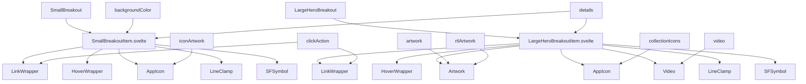
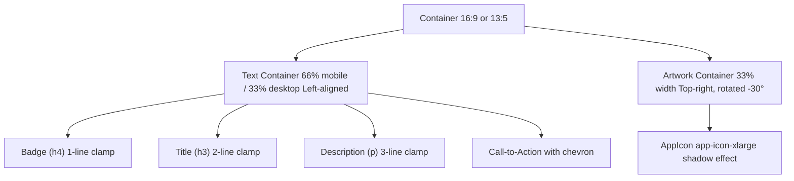
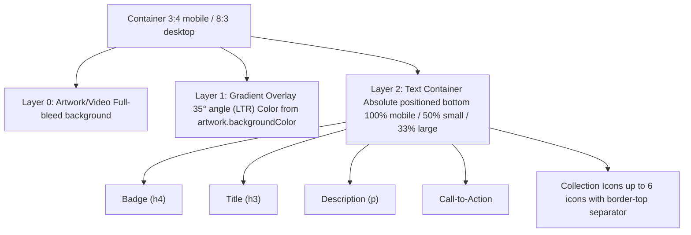
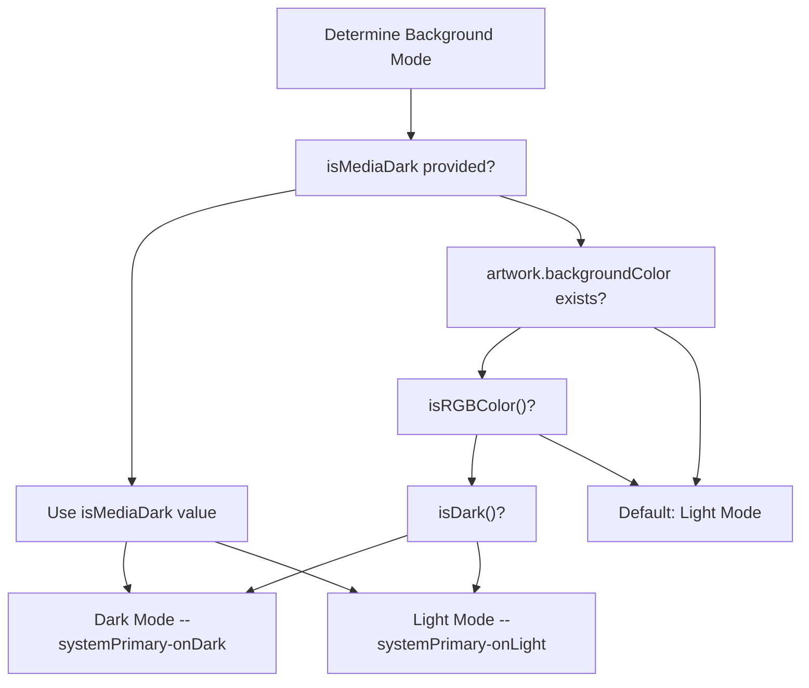

# Breakout Items

-   [shared/components/src/components/Artwork/Artwork.svelte](https://github.com/Chesszyh/apps.apple.com/blob/279d0c4d/shared/components/src/components/Artwork/Artwork.svelte)
-   [src/components/Shelf/Title.svelte](https://github.com/Chesszyh/apps.apple.com/blob/279d0c4d/src/components/Shelf/Title.svelte)
-   [src/components/jet/item/LargeHeroBreakoutItem.svelte](https://github.com/Chesszyh/apps.apple.com/blob/279d0c4d/src/components/jet/item/LargeHeroBreakoutItem.svelte)
-   [src/components/jet/item/SmallBreakoutItem.svelte](https://github.com/Chesszyh/apps.apple.com/blob/279d0c4d/src/components/jet/item/SmallBreakoutItem.svelte)

## Purpose and Scope

Breakout Items are specialized promotional components designed to showcase featured content with distinctive visual treatments. These components provide eye-catching, editorial-style layouts that "break out" from standard grid patterns with unique aspect ratios, rotated artwork, gradient overlays, and prominent call-to-action elements.

This page documents the two breakout item variants and their rendering patterns. For other promotional components like Today Cards and Editorial Cards, see [Content Cards](#5.3). For hero and carousel components, see [Hero and Carousel Components](#5.4).

**Sources:** [src/components/jet/item/SmallBreakoutItem.svelte1-188](https://github.com/Chesszyh/apps.apple.com/blob/279d0c4d/src/components/jet/item/SmallBreakoutItem.svelte#L1-L188) [src/components/jet/item/LargeHeroBreakoutItem.svelte1-269](https://github.com/Chesszyh/apps.apple.com/blob/279d0c4d/src/components/jet/item/LargeHeroBreakoutItem.svelte#L1-L269)

---

## Component Types Overview

The breakout system provides two distinct component types, each optimized for different editorial contexts:

| Component | Data Model | Primary Use Case | Aspect Ratio | Visual Signature |
| --- | --- | --- | --- | --- |
| `SmallBreakoutItem` | `SmallBreakout` | Compact promotional cards | 16:9 (mobile), 13:5 (desktop) | Rotated app icon, solid background |
| `LargeHeroBreakoutItem` | `LargeHeroBreakout` | Hero-sized promotional banners | 3:4 (mobile), 8:3 (desktop) | Gradient overlay, bottom-aligned text |

**Sources:** [src/components/jet/item/SmallBreakoutItem.svelte16](https://github.com/Chesszyh/apps.apple.com/blob/279d0c4d/src/components/jet/item/SmallBreakoutItem.svelte#L16-L16) [src/components/jet/item/LargeHeroBreakoutItem.svelte22](https://github.com/Chesszyh/apps.apple.com/blob/279d0c4d/src/components/jet/item/LargeHeroBreakoutItem.svelte#L22-L22)

---

## Component Hierarchy and Dependencies


**Sources:** [src/components/jet/item/SmallBreakoutItem.svelte10-13](https://github.com/Chesszyh/apps.apple.com/blob/279d0c4d/src/components/jet/item/SmallBreakoutItem.svelte#L10-L13) [src/components/jet/item/LargeHeroBreakoutItem.svelte9-20](https://github.com/Chesszyh/apps.apple.com/blob/279d0c4d/src/components/jet/item/LargeHeroBreakoutItem.svelte#L9-L20)

---

## SmallBreakoutItem

### Data Model

The `SmallBreakout` interface provides the following properties:

```
{    backgroundColor: Color,    iconArtwork: Artwork,    clickAction: Action,    details: {        badge?: string,        title?: string,        description?: string,        backgroundStyle: 'dark' | 'light'    }}
```
**Sources:** [src/components/jet/item/SmallBreakoutItem.svelte16-22](https://github.com/Chesszyh/apps.apple.com/blob/279d0c4d/src/components/jet/item/SmallBreakoutItem.svelte#L16-L22)

### Layout Pattern

SmallBreakoutItem implements a unique horizontal layout with three key visual elements:

1.  **Rotated App Icon**: Positioned in the top-right corner, rotated -30° (30° in RTL), creating visual dynamism
2.  **Text Container**: Left-aligned (right-aligned in RTL), occupying 66% width on mobile, 33% on desktop
3.  **Solid Background**: Full-bleed custom color derived from `backgroundColor` property


**Sources:** [src/components/jet/item/SmallBreakoutItem.svelte79-136](https://github.com/Chesszyh/apps.apple.com/blob/279d0c4d/src/components/jet/item/SmallBreakoutItem.svelte#L79-L136)

### Rotated Artwork Implementation

The icon is positioned and rotated using CSS transforms:

-   **Position**: `position: absolute` with `inset-inline-end: -10%`
-   **Transform**: `translateY(-8%) rotate(-30deg)` (LTR) or `rotate(30deg)` (RTL)
-   **Shadow**: Custom box-shadow with directional offset based on text direction
-   **Container Query**: At widths ≥1150px, vertical translation increases to `-11%`

**Sources:** [src/components/jet/item/SmallBreakoutItem.svelte92-118](https://github.com/Chesszyh/apps.apple.com/blob/279d0c4d/src/components/jet/item/SmallBreakoutItem.svelte#L92-L118)

### Text Content Rendering

Text content uses a flexbox column layout with the following hierarchy:

| Element | Font | Line Clamp | Spacing |
| --- | --- | --- | --- |
| Badge (h4) | `subhead-emphasized` / `headline` | 1 | None |
| Title (h3) | `title-1-emphasized` / `large-title-emphasized` | 2 | None |
| Description (p) | `body` / `title-3` | 3 | `margin-top: 8px` |
| Call-to-Action | `title-3-emphasized` / `title-2-emphasized` | None | `margin-top: 16px` |

The text color automatically adjusts based on `backgroundStyle`:

-   **Dark background**: `--systemPrimary-onDark`
-   **Light background**: Default system colors

**Sources:** [src/components/jet/item/SmallBreakoutItem.svelte39-69](https://github.com/Chesszyh/apps.apple.com/blob/279d0c4d/src/components/jet/item/SmallBreakoutItem.svelte#L39-L69) [src/components/jet/item/SmallBreakoutItem.svelte138-186](https://github.com/Chesszyh/apps.apple.com/blob/279d0c4d/src/components/jet/item/SmallBreakoutItem.svelte#L138-L186)

---

## LargeHeroBreakoutItem

### Data Model

The `LargeHeroBreakout` interface extends the breakout pattern with richer media support:

```
{    artwork?: Artwork,    rtlArtwork?: Artwork,    video?: VideoModel,    isMediaDark?: boolean,    collectionIcons?: Artwork[],    editorialDisplayOptions: {        suppressLockup: boolean    },    details: {        badge?: string,        title?: string,        description?: string,        callToActionButtonAction?: Action    }}
```
**Sources:** [src/components/jet/item/LargeHeroBreakoutItem.svelte22-34](https://github.com/Chesszyh/apps.apple.com/blob/279d0c4d/src/components/jet/item/LargeHeroBreakoutItem.svelte#L22-L34)

### Layout Pattern

LargeHeroBreakoutItem uses an overlay pattern with three compositional layers:


**Sources:** [src/components/jet/item/LargeHeroBreakoutItem.svelte61-113](https://github.com/Chesszyh/apps.apple.com/blob/279d0c4d/src/components/jet/item/LargeHeroBreakoutItem.svelte#L61-L113)

### Artwork and Video Selection

The component implements intelligent media source selection:

1.  **RTL Artwork Priority**: If `isRtl()` returns true and `rtlArtwork` exists, use `rtlArtwork`
2.  **Video Rendering**: Only rendered on non-xsmall viewports and when not using RTL artwork
3.  **Fallback**: Uses standard `artwork` or `video.preview` as needed

**Profile Selection**:

-   **xsmall viewport**: `large-hero-portrait-iphone`
-   **RTL artwork**: `large-hero-breakout-rtl`
-   **Default**: `large-hero-breakout`

**Sources:** [src/components/jet/item/LargeHeroBreakoutItem.svelte39-52](https://github.com/Chesszyh/apps.apple.com/blob/279d0c4d/src/components/jet/item/LargeHeroBreakoutItem.svelte#L39-L52) [src/components/jet/item/LargeHeroBreakoutItem.svelte62-66](https://github.com/Chesszyh/apps.apple.com/blob/279d0c4d/src/components/jet/item/LargeHeroBreakoutItem.svelte#L62-L66)

### Gradient Overlay System

The gradient overlay provides text legibility over the media background:

**Gradient Properties**:

-   **Color**: Extracted from `artwork.backgroundColor` via `colorAsString()` helper
-   **Rotation**:
    -   `35deg` (LTR on small-up viewports)
    -   `-35deg` (RTL on small-up viewports)
    -   `0deg` (xsmall viewports, vertical gradient)
-   **Stops**: `color 20%, transparent 50%`
-   **Filter**: `saturate(1.5) brightness(0.9)` for enhanced visual effect

The gradient direction adapts to viewport and text direction to ensure text remains readable regardless of layout.

**Sources:** [src/components/jet/item/LargeHeroBreakoutItem.svelte69](https://github.com/Chesszyh/apps.apple.com/blob/279d0c4d/src/components/jet/item/LargeHeroBreakoutItem.svelte#L69-L69) [src/components/jet/item/LargeHeroBreakoutItem.svelte241-267](https://github.com/Chesszyh/apps.apple.com/blob/279d0c4d/src/components/jet/item/LargeHeroBreakoutItem.svelte#L241-L267)

### Dark/Light Mode Detection

Text color is determined by analyzing the background:


**Sources:** [src/components/jet/item/LargeHeroBreakoutItem.svelte41-45](https://github.com/Chesszyh/apps.apple.com/blob/279d0c4d/src/components/jet/item/LargeHeroBreakoutItem.svelte#L41-L45) [src/components/jet/item/LargeHeroBreakoutItem.svelte152-174](https://github.com/Chesszyh/apps.apple.com/blob/279d0c4d/src/components/jet/item/LargeHeroBreakoutItem.svelte#L152-L174)

### Collection Icons Display

When `collectionIcons.length > 1` and `!editorialDisplayOptions.suppressLockup`, the component displays up to 6 app icons:

-   **Layout**: Horizontal flex row with `gap: 8px`
-   **Separator**: `border-top: 2px solid --systemTertiary-onDark`
-   **Spacing**: `margin-top: 16px` and `padding-top: 16px`
-   **Icons**: Rendered using `AppIcon` component with default profile

**Sources:** [src/components/jet/item/LargeHeroBreakoutItem.svelte103-111](https://github.com/Chesszyh/apps.apple.com/blob/279d0c4d/src/components/jet/item/LargeHeroBreakoutItem.svelte#L103-L111) [src/components/jet/item/LargeHeroBreakoutItem.svelte229-239](https://github.com/Chesszyh/apps.apple.com/blob/279d0c4d/src/components/jet/item/LargeHeroBreakoutItem.svelte#L229-L239)

---

## Responsive Typography

Both breakout components implement responsive type scaling:

### SmallBreakoutItem Typography

| Element | Mobile Font | Desktop Font (small-up) |
| --- | --- | --- |
| Badge | `subhead-emphasized` | `headline` |
| Title | `title-1-emphasized` | `large-title-emphasized` |
| Description | `body` | `title-3` |
| CTA Link | `title-3-emphasized` | `title-2-emphasized` |

### LargeHeroBreakoutItem Typography

| Element | Mobile Font | Desktop Font (small-up) |
| --- | --- | --- |
| Badge | `subhead-emphasized` | `callout-emphasized` |
| Title | `title-1-emphasized` | `large-title-emphasized` |
| Description | `body` | `title-3` |
| CTA Link | `body-emphasized` | `title-2-emphasized` |

All text uses `text-wrap: pretty` for balanced line breaks, with titles also using `text-wrap: balance`.

**Sources:** [src/components/jet/item/SmallBreakoutItem.svelte163-186](https://github.com/Chesszyh/apps.apple.com/blob/279d0c4d/src/components/jet/item/SmallBreakoutItem.svelte#L163-L186) [src/components/jet/item/LargeHeroBreakoutItem.svelte202-227](https://github.com/Chesszyh/apps.apple.com/blob/279d0c4d/src/components/jet/item/LargeHeroBreakoutItem.svelte#L202-L227)

---

## Common Interaction Patterns

Both breakout components share consistent interaction architecture:

### Click Action Handling

1.  **LinkWrapper Integration**: The entire component is wrapped in `<LinkWrapper action={action}>` to handle navigation
2.  **HoverWrapper Effect**: Provides standard hover state styling
3.  **Action Guard**: Only renders chevron when `isSome(action) && isFlowAction(action)`
4.  **Accessibility**: LinkWrapper provides proper label and ARIA attributes

**Sources:** [src/components/jet/item/SmallBreakoutItem.svelte25-26](https://github.com/Chesszyh/apps.apple.com/blob/279d0c4d/src/components/jet/item/SmallBreakoutItem.svelte#L25-L26) [src/components/jet/item/LargeHeroBreakoutItem.svelte59-60](https://github.com/Chesszyh/apps.apple.com/blob/279d0c4d/src/components/jet/item/LargeHeroBreakoutItem.svelte#L59-L60)

### Chevron Rendering

When a `FlowAction` is present, both components render a forward chevron (rotated 180° in RTL):

-   **Icon**: `SFSymbol` with name `chevron.forward`
-   **RTL Handling**: `transform: rotate(180deg)` applied in RTL locales
-   **Sizing**:
    -   SmallBreakout: 10px × 10px
    -   LargeHeroBreakout: 8px × 8px (mobile), 10px × 10px (desktop)

**Sources:** [src/components/jet/item/SmallBreakoutItem.svelte61-67](https://github.com/Chesszyh/apps.apple.com/blob/279d0c4d/src/components/jet/item/SmallBreakoutItem.svelte#L61-L67) [src/components/jet/item/LargeHeroBreakoutItem.svelte94-100](https://github.com/Chesszyh/apps.apple.com/blob/279d0c4d/src/components/jet/item/LargeHeroBreakoutItem.svelte#L94-L100)

---

## Aspect Ratio Strategies

### SmallBreakoutItem Aspect Ratios

The component uses CSS `aspect-ratio` with viewport-specific values:

-   **Mobile (default)**: `16/9`
-   **Small-up**: `13/5` (wider format for desktop displays)
-   **Container Query**: Uses `container-type: inline-size` for responsive adjustments

**Sources:** [src/components/jet/item/SmallBreakoutItem.svelte82-89](https://github.com/Chesszyh/apps.apple.com/blob/279d0c4d/src/components/jet/item/SmallBreakoutItem.svelte#L82-L89)

### LargeHeroBreakoutItem Aspect Ratios

The artwork container adapts based on viewport:

-   **Mobile (xsmall)**: Portrait orientation (3:4 via profile)
-   **Small-up**: Wide landscape `8/3` via CSS `aspect-ratio`

The profile system handles the actual image sizing, while the container provides the layout constraint.

**Sources:** [src/components/jet/item/LargeHeroBreakoutItem.svelte47-52](https://github.com/Chesszyh/apps.apple.com/blob/279d0c4d/src/components/jet/item/LargeHeroBreakoutItem.svelte#L47-L52) [src/components/jet/item/LargeHeroBreakoutItem.svelte121-127](https://github.com/Chesszyh/apps.apple.com/blob/279d0c4d/src/components/jet/item/LargeHeroBreakoutItem.svelte#L121-L127)

---

## Integration with Artwork System

Both components leverage the shared Artwork component system (see [Artwork and Media System](#5.1)):

### SmallBreakoutItem Artwork Integration

-   **Component**: `AppIcon` (specialized Artwork wrapper)
-   **Profile**: `app-icon-xlarge`
-   **Settings**: `fixedWidth={false}` for responsive scaling
-   **Enhancement**: Custom box-shadow applied to `.artwork-component`

**Sources:** [src/components/jet/item/SmallBreakoutItem.svelte28-35](https://github.com/Chesszyh/apps.apple.com/blob/279d0c4d/src/components/jet/item/SmallBreakoutItem.svelte#L28-L35)

### LargeHeroBreakoutItem Artwork Integration

-   **Component**: `Artwork` for images, `Video` for video content
-   **Lazy Loading**: Defaults apply (true for off-screen content)
-   **Fetch Priority**: Not explicitly set (uses default 'auto')
-   **Background Color**: Extracted for gradient overlay

The component also sanitizes HTML in title and description fields using `sanitizeHtml()` to prevent XSS.

**Sources:** [src/components/jet/item/LargeHeroBreakoutItem.svelte64-65](https://github.com/Chesszyh/apps.apple.com/blob/279d0c4d/src/components/jet/item/LargeHeroBreakoutItem.svelte#L64-L65) [src/components/jet/item/LargeHeroBreakoutItem.svelte84](https://github.com/Chesszyh/apps.apple.com/blob/279d0c4d/src/components/jet/item/LargeHeroBreakoutItem.svelte#L84-L84) [src/components/jet/item/LargeHeroBreakoutItem.svelte90](https://github.com/Chesszyh/apps.apple.com/blob/279d0c4d/src/components/jet/item/LargeHeroBreakoutItem.svelte#L90-L90)

---

## Usage in Shelf System

Breakout items are typically rendered as part of shelf-based pages. The shelf dispatcher (see [Shelf System](#4.2)) uses type guards to identify and route breakout shelf data to these components.

Common shelf types that may contain breakout items:

-   Editorial promotional shelves
-   Featured content carousels
-   Hero content sections

The components receive fully hydrated data models from the shelf system and are responsible only for presentation and user interaction handling.

**Sources:** [src/components/jet/item/SmallBreakoutItem.svelte1-188](https://github.com/Chesszyh/apps.apple.com/blob/279d0c4d/src/components/jet/item/SmallBreakoutItem.svelte#L1-L188) [src/components/jet/item/LargeHeroBreakoutItem.svelte1-269](https://github.com/Chesszyh/apps.apple.com/blob/279d0c4d/src/components/jet/item/LargeHeroBreakoutItem.svelte#L1-L269)
