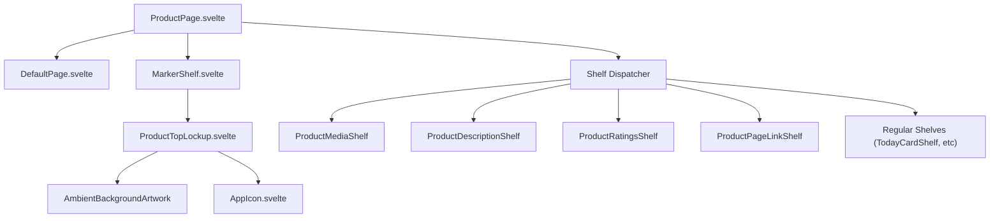
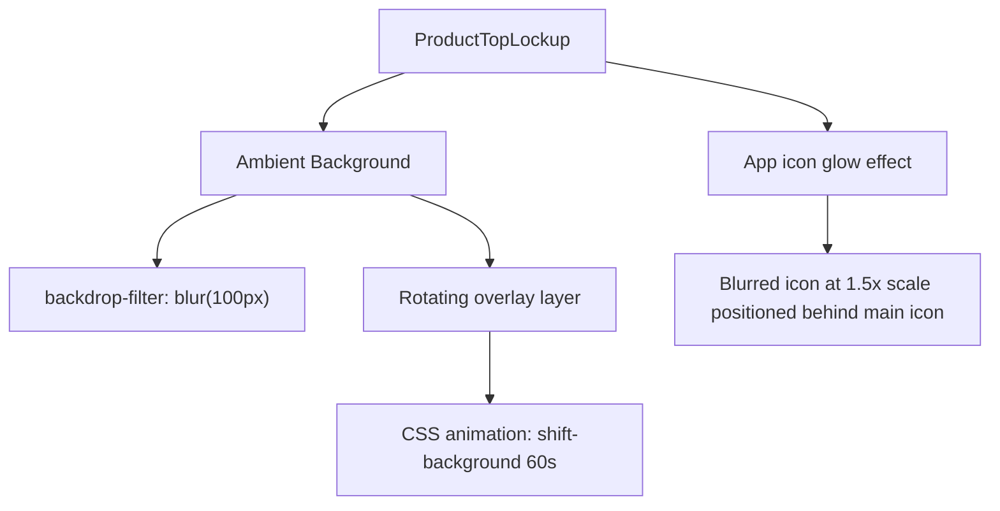
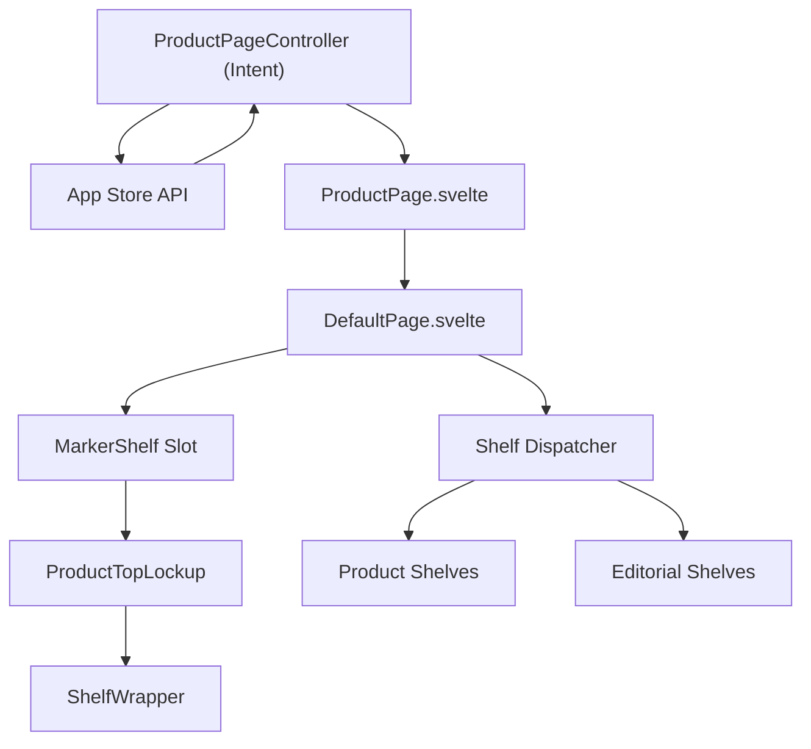

# Product Pages

-   [src/components/AmbientBackgroundArtwork.svelte](https://github.com/Chesszyh/apps.apple.com/blob/279d0c4d/src/components/AmbientBackgroundArtwork.svelte)
-   [src/components/jet/marker-shelf/ProductTopLockup.svelte](https://github.com/Chesszyh/apps.apple.com/blob/279d0c4d/src/components/jet/marker-shelf/ProductTopLockup.svelte)
-   [src/components/jet/shelf/ProductDescriptionShelf.svelte](https://github.com/Chesszyh/apps.apple.com/blob/279d0c4d/src/components/jet/shelf/ProductDescriptionShelf.svelte)
-   [src/components/jet/shelf/ProductMediaShelf.svelte](https://github.com/Chesszyh/apps.apple.com/blob/279d0c4d/src/components/jet/shelf/ProductMediaShelf.svelte)
-   [src/components/pages/ProductPage.svelte](https://github.com/Chesszyh/apps.apple.com/blob/279d0c4d/src/components/pages/ProductPage.svelte)

## Purpose and Scope

Product pages are specialized detail pages for apps, games, and other App Store products. They display product information including app icons, screenshots, descriptions, ratings, and platform-specific media. Product pages differ from editorial pages by featuring a prominent hero lockup section (the "MarkerShelf") and product-specific shelf types.

This document provides an overview of the product page architecture, data models, and key components. For detailed information about:

-   Product page layout and the MarkerShelf integration, see [Product Page Layout](#6.1)
-   Product-specific shelf implementations, see [Product-Specific Shelves](#6.2)
-   Platform-adaptive media rendering logic, see [Platform-Specific Media Rendering](#6.3)

For general page rendering concepts, see [Page Components](#4.1). For the shelf system architecture, see [Shelf System](#4.2).

---

## Product Page Architecture

Product pages use a specialized component structure that extends the standard shelf-based page model with product-specific features.

### Component Hierarchy


**Sources:**

-   [src/components/pages/ProductPage.svelte1-78](https://github.com/Chesszyh/apps.apple.com/blob/279d0c4d/src/components/pages/ProductPage.svelte#L1-L78)
-   [src/components/jet/marker-shelf/ProductTopLockup.svelte1-464](https://github.com/Chesszyh/apps.apple.com/blob/279d0c4d/src/components/jet/marker-shelf/ProductTopLockup.svelte#L1-L464)

### Data Flow

> **[Mermaid sequence]**
> *(图表结构无法解析)*

**Sources:**

-   [src/components/pages/ProductPage.svelte16-61](https://github.com/Chesszyh/apps.apple.com/blob/279d0c4d/src/components/pages/ProductPage.svelte#L16-L61)
-   [src/components/jet/marker-shelf/ProductTopLockup.svelte48-116](https://github.com/Chesszyh/apps.apple.com/blob/279d0c4d/src/components/jet/marker-shelf/ProductTopLockup.svelte#L48-L116)

---

## Data Model

Product pages are rendered from a `ShelfBasedProductPage` model, which extends the base page model with product-specific properties.

### Key Data Structures

| Property | Type | Purpose |
| --- | --- | --- |
| `lockup` | `ProductLockup` | App icon, title, subtitle, pricing, offer info |
| `badges` | `Badge[]` | Editor's Choice, age rating, etc. |
| `banner` | `BannerItem` | Editorial banner (e.g., "App of the Day") |
| `developerAction` | `Action` | Link to developer page |
| `titleOfferDisplayProperties` | `OfferDisplayProperties` | Pricing and offer metadata |
| `canonicalURL` | `string` | Deep linking and share URL |
| `appPlatforms` | `AppPlatform[]` | Supported platforms (mac, phone, pad, etc.) |
| `shelves` | `Shelf[]` | Product content shelves |

**Sources:**

-   [src/components/jet/marker-shelf/ProductTopLockup.svelte11-21](https://github.com/Chesszyh/apps.apple.com/blob/279d0c4d/src/components/jet/marker-shelf/ProductTopLockup.svelte#L11-L21)

### MarkerShelfPageRequirements

The `ProductTopLockup` component requires a subset of the full page model:

```
type MarkerShelfPageRequirements = Pick<    ShelfBasedProductPage,    | 'badges'    | 'banner'    | 'developerAction'    | 'lockup'    | 'shelfMapping'    | 'titleOfferDisplayProperties'    | 'canonicalURL'    | 'appPlatforms'>;
```
**Sources:**

-   [src/components/jet/marker-shelf/ProductTopLockup.svelte11-21](https://github.com/Chesszyh/apps.apple.com/blob/279d0c4d/src/components/jet/marker-shelf/ProductTopLockup.svelte#L11-L21)

---

## Key Components

### ProductPage Component

`ProductPage.svelte` is the top-level component for product detail pages. It extends `DefaultPage` by:

1.  **Rendering the MarkerShelf**: Uses the `marker-shelf` slot to inject `ProductTopLockup`
2.  **Processing shelves**: Calls `getProductPageShelvesWithExpandedMedia()` to expand platform-specific media
3.  **EULA deep linking**: Detects `?lic` query parameter and opens License Agreement modal
4.  **Arcade footer**: Conditionally renders `ProductPageArcadeFooter` for Arcade apps

**Sources:**

-   [src/components/pages/ProductPage.svelte1-78](https://github.com/Chesszyh/apps.apple.com/blob/279d0c4d/src/components/pages/ProductPage.svelte#L1-L78)

### MarkerShelf / ProductTopLockup

The `MarkerShelf` renders the hero section at the top of product pages. It includes:

-   **App icon** with glow effect and border (when needed)
-   **Title, subtitle, and tagline** with platform exclusivity text
-   **Pricing and attributes** (free, price, in-app purchases, coming soon date)
-   **Arcade logo** for Apple Arcade games
-   **Launch native button** (macOS only, when app is available)
-   **Share button** with native share API support
-   **Ambient background** using blurred, animated app icon
-   **Banner** (editorial banners like "App of the Day")

#### Visual Features


**Platform Exclusivity Detection:**

The component detects platform exclusivity (e.g., "Designed for iPad") by checking if only one platform is supported:

```
// Simplified logic from ProductTopLockupexclusivePlatform = platforms.find(platform =>    isPlatformExclusivelySupported(platform, appPlatforms));
```
**Sources:**

-   [src/components/jet/marker-shelf/ProductTopLockup.svelte1-464](https://github.com/Chesszyh/apps.apple.com/blob/279d0c4d/src/components/jet/marker-shelf/ProductTopLockup.svelte#L1-L464)
-   [src/components/jet/marker-shelf/ProductTopLockup.svelte97-104](https://github.com/Chesszyh/apps.apple.com/blob/279d0c4d/src/components/jet/marker-shelf/ProductTopLockup.svelte#L97-L104)
-   [src/components/jet/marker-shelf/ProductTopLockup.svelte226-259](https://github.com/Chesszyh/apps.apple.com/blob/279d0c4d/src/components/jet/marker-shelf/ProductTopLockup.svelte#L226-L259)

### Ambient Background System

Product page hero sections use `AmbientBackgroundArtwork.svelte` to create an animated, blurred background effect:

1.  **Loads app icon artwork** at reduced resolution (400px, WebP)
2.  **Applies blur and saturation filters** (`blur(20px) saturate(1.3)`)
3.  **Animates background position** with 60-second loop
4.  **Responds to viewport intersection** (pauses when out of view)
5.  **Pauses during resize** to reduce CPU thrashing

The component uses a layered background approach:

-   Bottom layer: Joe color fallback
-   Middle layer: Semi-transparent veil (`rgba(240, 240, 240, 0.65)`)
-   Top layer: Gradient mask (transparent → page background)

**Sources:**

-   [src/components/AmbientBackgroundArtwork.svelte1-203](https://github.com/Chesszyh/apps.apple.com/blob/279d0c4d/src/components/AmbientBackgroundArtwork.svelte#L1-L203)
-   [src/components/AmbientBackgroundArtwork.svelte76-114](https://github.com/Chesszyh/apps.apple.com/blob/279d0c4d/src/components/AmbientBackgroundArtwork.svelte#L76-L114)
-   [src/components/AmbientBackgroundArtwork.svelte176-201](https://github.com/Chesszyh/apps.apple.com/blob/279d0c4d/src/components/AmbientBackgroundArtwork.svelte#L176-L201)

---

## Special Features

### EULA Deep Linking

Product pages support deep linking directly to the License Agreement modal via the `?lic` query parameter. When detected:

1.  Parse `canonicalURL` for `lic` parameter
2.  Find `ProductPageLinkShelf` containing EULA item
3.  Locate item with `FlowAction` pointing to `EulaPageIntent`
4.  Execute `jet.perform(clickAction)` to open modal

**Implementation:**

```
if (page.canonicalURL) {    const canonicalUrl = new URL(page.canonicalURL);    const hasLic = canonicalUrl.searchParams.has('lic');        if (hasLic && shelves) {        const eulaItem = shelves            .find(isProductPageLinkShelf)            ?.items.find(                ({ clickAction }) =>                    isFlowAction(clickAction) &&                    clickAction.destination &&                    isEulaPageIntent(clickAction.destination),            );                if (eulaItem) {            jet.perform(eulaItem.clickAction);        }    }}
```
**Sources:**

-   [src/components/pages/ProductPage.svelte37-60](https://github.com/Chesszyh/apps.apple.com/blob/279d0c4d/src/components/pages/ProductPage.svelte#L37-L60)

### Apple Arcade Support

Product pages detect Apple Arcade apps and render specialized content:

1.  **Detection**: Check `offerDisplayProperties.offerType === 'arcadeApp'`
2.  **Hero section**: Display Apple Arcade logo instead of editorial tagline
3.  **Pricing**: Hide price/IAP attributes (not relevant for Arcade)
4.  **Footer**: Render `ProductPageArcadeFooter` with Arcade branding

**Sources:**

-   [src/components/jet/marker-shelf/ProductTopLockup.svelte59-60](https://github.com/Chesszyh/apps.apple.com/blob/279d0c4d/src/components/jet/marker-shelf/ProductTopLockup.svelte#L59-L60)
-   [src/components/jet/marker-shelf/ProductTopLockup.svelte84-92](https://github.com/Chesszyh/apps.apple.com/blob/279d0c4d/src/components/jet/marker-shelf/ProductTopLockup.svelte#L84-L92)
-   [src/components/pages/ProductPage.svelte65-77](https://github.com/Chesszyh/apps.apple.com/blob/279d0c4d/src/components/pages/ProductPage.svelte#L65-L77)

### Platform-Specific Features

#### macOS Launch Button

On macOS, product pages display a "Launch" button when:

-   User is on macOS (`platform.ismacOS()`)
-   App is either:
    -   An iOS app compatible with macOS (`lockup.isIOSBinaryMacOSCompatible`)
    -   A native Mac app (`isPlatformSupported('mac', appPlatforms)`)

**Sources:**

-   [src/components/jet/marker-shelf/ProductTopLockup.svelte106-109](https://github.com/Chesszyh/apps.apple.com/blob/279d0c4d/src/components/jet/marker-shelf/ProductTopLockup.svelte#L106-L109)

#### Share Button

Uses native Web Share API when available (`navigator.share`). On mount, checks `isShareSupported()` to determine visibility.

**Sources:**

-   [src/components/jet/marker-shelf/ProductTopLockup.svelte111-115](https://github.com/Chesszyh/apps.apple.com/blob/279d0c4d/src/components/jet/marker-shelf/ProductTopLockup.svelte#L111-L115)

---

## Product-Specific Shelves

Product pages use specialized shelf types that are not available on editorial pages:

### ProductMediaShelf

Renders screenshots and videos with platform-specific layouts. Supports:

-   Platform detection (Vision, Mac, iPad, iPhone, TV, Watch, Messages)
-   Orientation detection (portrait vs landscape)
-   Multi-platform expandable view
-   Platform icons and labels

**Platform Rendering Map:**

| Platform | Grid Type | Component |
| --- | --- | --- |
| `vision` | `ScreenshotVision` | `ProductMediaVisionItem` |
| `phone` | `ScreenshotPhone` (portrait) or `ScreenshotLarge` | `ProductMediaPhoneItem` |
| `pad` | `ScreenshotPad` (portrait) or `ScreenshotLarge` | `ProductMediaPadItem` |
| `mac` | `ScreenshotLarge` | `ProductMediaMacItem` |
| `tv` | `ScreenshotLarge` | `ProductMediaTVItem` |
| `watch` | `ScreenshotPhone` | `ProductMediaWatchItem` |
| `messages` | Same as `phone` | `ProductMediaPhoneItem` |

**Sources:**

-   [src/components/jet/shelf/ProductMediaShelf.svelte1-270](https://github.com/Chesszyh/apps.apple.com/blob/279d0c4d/src/components/jet/shelf/ProductMediaShelf.svelte#L1-L270)
-   [src/components/jet/shelf/ProductMediaShelf.svelte100-136](https://github.com/Chesszyh/apps.apple.com/blob/279d0c4d/src/components/jet/shelf/ProductMediaShelf.svelte#L100-L136)

### ProductDescriptionShelf

Displays the app description with:

-   5-line truncation with "More" button
-   HTML sanitization for formatting
-   Auto-expansion when content is short
-   66% width on medium+ viewports

**Sources:**

-   [src/components/jet/shelf/ProductDescriptionShelf.svelte1-96](https://github.com/Chesszyh/apps.apple.com/blob/279d0c4d/src/components/jet/shelf/ProductDescriptionShelf.svelte#L1-L96)

### Additional Product Shelves

Other product-specific shelves include:

-   `ProductRatingsShelf` - User ratings and reviews summary
-   `ProductPageLinkShelf` - Privacy policy, EULA, support links
-   `ProductInformationShelf` - Metadata (seller, size, languages, etc.)

**Sources:**

-   [src/components/pages/ProductPage.svelte14](https://github.com/Chesszyh/apps.apple.com/blob/279d0c4d/src/components/pages/ProductPage.svelte#L14-L14)

---

## Shelf Processing

### Expanded Media Handling

The `getProductPageShelvesWithExpandedMedia()` utility processes shelves to expand platform-specific media:

1.  Locates first `ProductMediaShelf`
2.  If shelf has multiple platforms (`allPlatforms.length > 1`):
    -   Creates additional `ProductMediaShelf` instances for each platform
    -   Assigns them to `expandedMedia` array
3.  Returns modified shelves array

This enables the expandable platform selector UI in `ProductMediaShelf`.

**Sources:**

-   [src/components/pages/ProductPage.svelte22](https://github.com/Chesszyh/apps.apple.com/blob/279d0c4d/src/components/pages/ProductPage.svelte#L22-L22)

---

## Integration with Page System

Product pages integrate with the broader page rendering system:


**Sources:**

-   [src/components/pages/ProductPage.svelte1-78](https://github.com/Chesszyh/apps.apple.com/blob/279d0c4d/src/components/pages/ProductPage.svelte#L1-L78)

---

## Accessibility

Product pages set up an accessibility layout context for neighbor shelf detection, enabling proper keyboard navigation and screen reader support:

```
setAccessibilityLayoutContext({ shelves });
```
This context is used by shelf components to determine their position relative to other shelves (first, last, adjacent types).

**Sources:**

-   [src/components/pages/ProductPage.svelte33-34](https://github.com/Chesszyh/apps.apple.com/blob/279d0c4d/src/components/pages/ProductPage.svelte#L33-L34)
