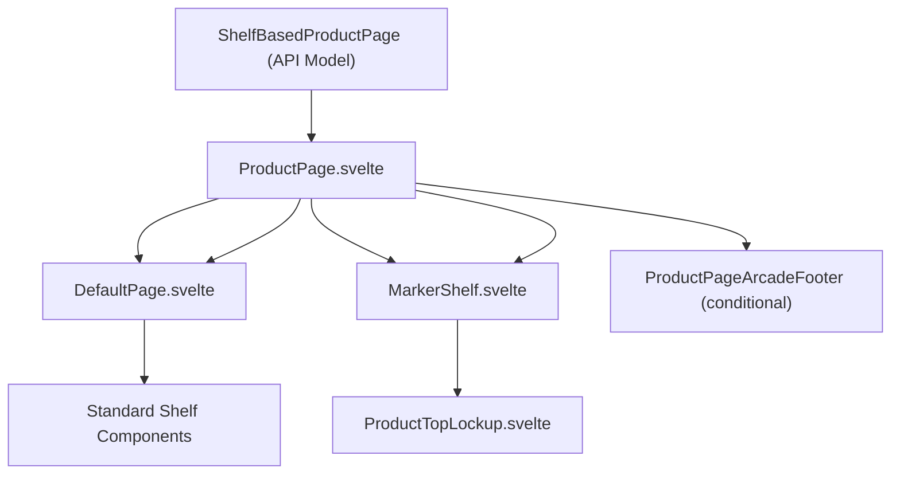
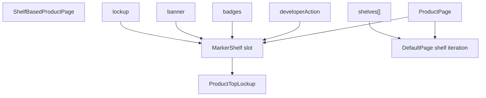
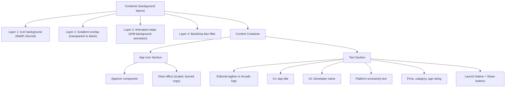
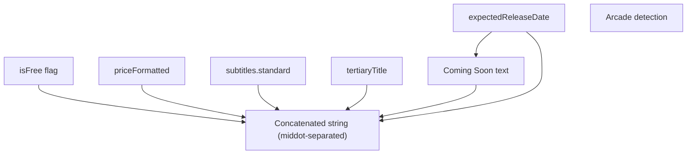
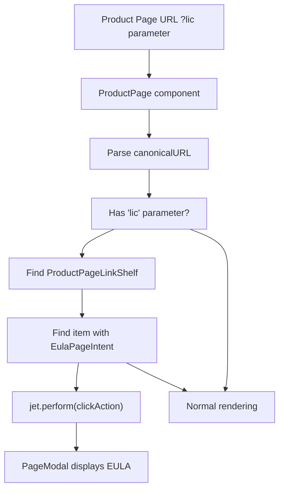
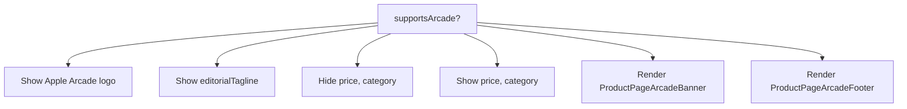

# Product Page Layout

-   [src/components/AmbientBackgroundArtwork.svelte](https://github.com/Chesszyh/apps.apple.com/blob/279d0c4d/src/components/AmbientBackgroundArtwork.svelte)
-   [src/components/jet/marker-shelf/ProductTopLockup.svelte](https://github.com/Chesszyh/apps.apple.com/blob/279d0c4d/src/components/jet/marker-shelf/ProductTopLockup.svelte)
-   [src/components/jet/shelf/ProductDescriptionShelf.svelte](https://github.com/Chesszyh/apps.apple.com/blob/279d0c4d/src/components/jet/shelf/ProductDescriptionShelf.svelte)
-   [src/components/jet/shelf/ProductMediaShelf.svelte](https://github.com/Chesszyh/apps.apple.com/blob/279d0c4d/src/components/jet/shelf/ProductMediaShelf.svelte)
-   [src/components/pages/ProductPage.svelte](https://github.com/Chesszyh/apps.apple.com/blob/279d0c4d/src/components/pages/ProductPage.svelte)

## Purpose and Scope

This document describes the structure and rendering architecture of product detail pages in the App Store web application. Product pages display comprehensive information about a specific app or game, including its icon, title, description, screenshots, ratings, and other metadata.

The page covers:

-   **ProductPage component** structure and its integration with DefaultPage
-   **MarkerShelf pattern** for rendering the product hero section
-   **ProductTopLockup** component that displays app icon, title, and metadata
-   **EULA deep linking** functionality for license agreement modals
-   **Arcade-specific** rendering variations

For detailed information about product-specific shelf types (media, description, ratings), see [Product-Specific Shelves](#6.2). For platform-specific media rendering strategies, see [Platform-Specific Media Rendering](#6.3).

---

## Product Page Architecture

Product pages extend the standard shelf-based page model with special handling for the hero section and product-specific content. The `ProductPage` component delegates most rendering to `DefaultPage` while inserting product-specific elements.


**Product Page Component Hierarchy**

Sources: [src/components/pages/ProductPage.svelte1-78](https://github.com/Chesszyh/apps.apple.com/blob/279d0c4d/src/components/pages/ProductPage.svelte#L1-L78)

---

## MarkerShelf Pattern

The **MarkerShelf** is a special virtual shelf that doesn't exist in the API's shelves array. Instead, it's constructed from top-level product page properties (`lockup`, `banner`, `badges`, etc.) and rendered in a dedicated slot within `DefaultPage`.

### Why MarkerShelf Exists

Product pages require a prominent hero section that displays differently from standard shelves. Rather than forcing this into the shelves array, the MarkerShelf pattern:

1.  **Separates hero content** from the standard shelf iteration logic
2.  **Provides type safety** by defining `MarkerShelfPageRequirements`
3.  **Enables specialized rendering** without modifying the shelf dispatcher
4.  **Maintains API backwards compatibility** as the lockup properties remain top-level


**MarkerShelf Data Extraction Pattern**

Sources: [src/components/jet/marker-shelf/ProductTopLockup.svelte1-22](https://github.com/Chesszyh/apps.apple.com/blob/279d0c4d/src/components/jet/marker-shelf/ProductTopLockup.svelte#L1-L22) [src/components/pages/ProductPage.svelte69-73](https://github.com/Chesszyh/apps.apple.com/blob/279d0c4d/src/components/pages/ProductPage.svelte#L69-L73)

### MarkerShelfPageRequirements Type

The `MarkerShelfPageRequirements` type defines exactly which properties from `ShelfBasedProductPage` are needed to render the MarkerShelf:

| Property | Type | Purpose |
| --- | --- | --- |
| `badges` | Badge\[\] | Award badges displayed near the title |
| `banner` | BannerItem | Optional promotional banner |
| `developerAction` | Action | Developer-related action (e.g., website link) |
| `lockup` | Lockup | Core app metadata (icon, title, subtitle) |
| `shelfMapping` | Object | Maps shelf types to rendering configuration |
| `titleOfferDisplayProperties` | Object | Offer-specific display properties |
| `canonicalURL` | string | Product page URL (used for sharing) |
| `appPlatforms` | AppPlatform\[\] | Supported platforms (iPhone, iPad, Mac, etc.) |

Sources: [src/components/jet/marker-shelf/ProductTopLockup.svelte11-21](https://github.com/Chesszyh/apps.apple.com/blob/279d0c4d/src/components/jet/marker-shelf/ProductTopLockup.svelte#L11-L21)

---

## ProductTopLockup Hero Section

`ProductTopLockup` is the visually prominent component at the top of every product page. It features a blurred, animated background derived from the app icon, overlaid with the icon itself and key metadata.

### Visual Structure


**ProductTopLockup Visual Hierarchy**

Sources: [src/components/jet/marker-shelf/ProductTopLockup.svelte118-207](https://github.com/Chesszyh/apps.apple.com/blob/279d0c4d/src/components/jet/marker-shelf/ProductTopLockup.svelte#L118-L207)

### Background Animation System

The hero section features a sophisticated multi-layer animation:

1.  **Static background**: App icon rendered as WebP at 400×400px
2.  **Gradient overlay**: Linear gradient from transparent to 80% black
3.  **Rotating pattern**: Animated background using `shift-background` keyframes
4.  **Backdrop blur**: Applied via `backdrop-filter: blur(100px) saturate(1.5)`

The `shift-background` animation runs for 60 seconds, continuously rotating and zooming a desaturated version of the background image:

```
Animation timeline:
0s   → opacity: 0, rotation: 0deg, scale: 100%
10s  → opacity: 0.5
20s  → rotation: 45deg, scale: 160%
45s  → rotation: 160deg, scale: 250%
70s  → rotation: 250deg, scale: 200%
100s → opacity: 0, rotation: 360deg, scale: 100%
```
Sources: [src/components/jet/marker-shelf/ProductTopLockup.svelte226-294](https://github.com/Chesszyh/apps.apple.com/blob/279d0c4d/src/components/jet/marker-shelf/ProductTopLockup.svelte#L226-L294) [src/components/jet/marker-shelf/ProductTopLockup.svelte424-462](https://github.com/Chesszyh/apps.apple.com/blob/279d0c4d/src/components/jet/marker-shelf/ProductTopLockup.svelte#L424-L462)

### Dynamic Attributes Display

The component computes display attributes by concatenating various properties with middot separators:


**Attributes Assembly Logic**

Arcade apps exclude pricing and category information, showing only platform exclusivity text if applicable.

Sources: [src/components/jet/marker-shelf/ProductTopLockup.svelte79-105](https://github.com/Chesszyh/apps.apple.com/blob/279d0c4d/src/components/jet/marker-shelf/ProductTopLockup.svelte#L79-L105)

### Platform Exclusivity Detection

The component detects if an app is exclusive to a single platform:

```
exclusivePlatform = ['vision', 'mac', 'phone', 'pad', 'tv', 'watch']    .find(platform => isPlatformExclusivelySupported(platform, appPlatforms))
```
If exclusive, it displays localized text like "Only on iPhone" or "Only on Apple Vision Pro".

Sources: [src/components/jet/marker-shelf/ProductTopLockup.svelte97-104](https://github.com/Chesszyh/apps.apple.com/blob/279d0c4d/src/components/jet/marker-shelf/ProductTopLockup.svelte#L97-L104)

---

## Page Assembly Process

Product pages are assembled through a multi-stage process that prepares shelf data, handles expanded media, and injects the MarkerShelf.

> **[Mermaid sequence]**
> *(图表结构无法解析)*

**Product Page Assembly Sequence**

Sources: [src/components/pages/ProductPage.svelte1-78](https://github.com/Chesszyh/apps.apple.com/blob/279d0c4d/src/components/pages/ProductPage.svelte#L1-L78)

### Expanded Media Handling

The `getProductPageShelvesWithExpandedMedia` utility modifies the shelves array to support platform-switcher UI for multi-platform apps:

1.  **Locate all ProductMediaShelf instances** in the shelves array
2.  **Extract the first one** as the primary media shelf
3.  **Attach remaining media shelves** as `expandedMedia` property
4.  **Return modified array** with only the first media shelf visible

This enables the expandable platform selector rendered by `ProductMediaShelf`.

Sources: [src/components/pages/ProductPage.svelte22](https://github.com/Chesszyh/apps.apple.com/blob/279d0c4d/src/components/pages/ProductPage.svelte#L22-L22)

---

## EULA Deep Linking

Product pages support deep linking directly to the License Agreement modal via the `?lic` query parameter. This allows external links to open the product page with the EULA already displayed.

### Implementation Flow


**EULA Deep Link Processing Flow**

### Code Implementation

The deep linking logic executes during the reactive statement that sets up accessibility context:

```
1. Extract canonicalURL from page
2. Parse as URL object
3. Check for 'lic' query parameter
4. If present:
   a. Find ProductPageLinkShelf in shelves array
   b. Locate item with clickAction containing EulaPageIntent
   c. Call jet.perform(eulaItem.clickAction)
   d. This triggers handleModalPresentation in Jet core
```
The modal opens automatically as a side effect of performing the action, before the page finishes initial rendering.

Sources: [src/components/pages/ProductPage.svelte37-60](https://github.com/Chesszyh/apps.apple.com/blob/279d0c4d/src/components/pages/ProductPage.svelte#L37-L60)

### Why This Pattern Exists

Unlike other modals, the EULA deep link is implemented directly in `ProductPage` rather than as a generic URL parameter handler because:

1.  **Product pages are the only context** where EULA links are relevant
2.  **Simplicity**: The logic is < 20 lines and doesn't warrant abstraction
3.  **Single use case**: No other modals support deep linking (per comment in code)

---

## Arcade Product Pages

Apple Arcade apps receive special treatment throughout the product page:

### Detection

```
supportsArcade = page.lockup.offerDisplayProperties?.offerType === 'arcadeApp'
```
### Arcade-Specific Elements

| Component | Location | Purpose |
| --- | --- | --- |
| Apple Arcade Logo | ProductTopLockup | Replaces editorial tagline |
| ProductPageArcadeBanner | After ProductTopLockup | Explains Arcade service |
| ProductPageArcadeFooter | Bottom of page | Additional Arcade branding |

### Conditional Rendering Logic


**Arcade Conditional Rendering**

Sources: [src/components/pages/ProductPage.svelte65-77](https://github.com/Chesszyh/apps.apple.com/blob/279d0c4d/src/components/pages/ProductPage.svelte#L65-L77) [src/components/jet/marker-shelf/ProductTopLockup.svelte59-60](https://github.com/Chesszyh/apps.apple.com/blob/279d0c4d/src/components/jet/marker-shelf/ProductTopLockup.svelte#L59-L60) [src/components/jet/marker-shelf/ProductTopLockup.svelte151-162](https://github.com/Chesszyh/apps.apple.com/blob/279d0c4d/src/components/jet/marker-shelf/ProductTopLockup.svelte#L151-L162)

---

## Launch Native Button Integration

On macOS, product pages display a **Launch Native Button** when:

1.  The platform is macOS (detected via `platform.ismacOS()`)
2.  The app is either:
    -   iOS app running on macOS (via `lockup.isIOSBinaryMacOSCompatible`)
    -   Native Mac app (via `isPlatformSupported('mac', appPlatforms)`)

The button triggers the native App Store app to open the product page.

Sources: [src/components/jet/marker-shelf/ProductTopLockup.svelte106-109](https://github.com/Chesszyh/apps.apple.com/blob/279d0c4d/src/components/jet/marker-shelf/ProductTopLockup.svelte#L106-L109) [src/components/jet/marker-shelf/ProductTopLockup.svelte186-190](https://github.com/Chesszyh/apps.apple.com/blob/279d0c4d/src/components/jet/marker-shelf/ProductTopLockup.svelte#L186-L190)

---

## Accessibility Context Setup

Product pages establish an accessibility layout context that allows child shelves to detect their neighbors. This enables ARIA attributes like `aria-label` to reference adjacent content.

```
setAccessibilityLayoutContext({ shelves })
```
This context is consumed by shelves like `AccessibilityHeaderShelf` to determine if they should display extended descriptions based on surrounding content.

Sources: [src/components/pages/ProductPage.svelte33-35](https://github.com/Chesszyh/apps.apple.com/blob/279d0c4d/src/components/pages/ProductPage.svelte#L33-L35)

---

## Key Files Reference

| File | Purpose |
| --- | --- |
| [ProductPage.svelte](https://github.com/Chesszyh/apps.apple.com/blob/279d0c4d/ProductPage.svelte) | Main product page orchestrator |
| [ProductTopLockup.svelte](https://github.com/Chesszyh/apps.apple.com/blob/279d0c4d/ProductTopLockup.svelte) | Hero section component (MarkerShelf) |
| [DefaultPage.svelte](https://github.com/Chesszyh/apps.apple.com/blob/279d0c4d/DefaultPage.svelte) | Base page layout with slot support |
| [MarkerShelf.svelte](https://github.com/Chesszyh/apps.apple.com/blob/279d0c4d/MarkerShelf.svelte) | Wrapper that renders ProductTopLockup |
| [ProductMediaShelf.svelte](https://github.com/Chesszyh/apps.apple.com/blob/279d0c4d/ProductMediaShelf.svelte) | Platform-specific media rendering |
| [ProductDescriptionShelf.svelte](https://github.com/Chesszyh/apps.apple.com/blob/279d0c4d/ProductDescriptionShelf.svelte) | App description with expand/collapse |

Sources: [src/components/pages/ProductPage.svelte1-78](https://github.com/Chesszyh/apps.apple.com/blob/279d0c4d/src/components/pages/ProductPage.svelte#L1-L78) [src/components/jet/marker-shelf/ProductTopLockup.svelte1-464](https://github.com/Chesszyh/apps.apple.com/blob/279d0c4d/src/components/jet/marker-shelf/ProductTopLockup.svelte#L1-L464) [src/components/jet/shelf/ProductMediaShelf.svelte1-270](https://github.com/Chesszyh/apps.apple.com/blob/279d0c4d/src/components/jet/shelf/ProductMediaShelf.svelte#L1-L270) [src/components/jet/shelf/ProductDescriptionShelf.svelte1-96](https://github.com/Chesszyh/apps.apple.com/blob/279d0c4d/src/components/jet/shelf/ProductDescriptionShelf.svelte#L1-L96)
