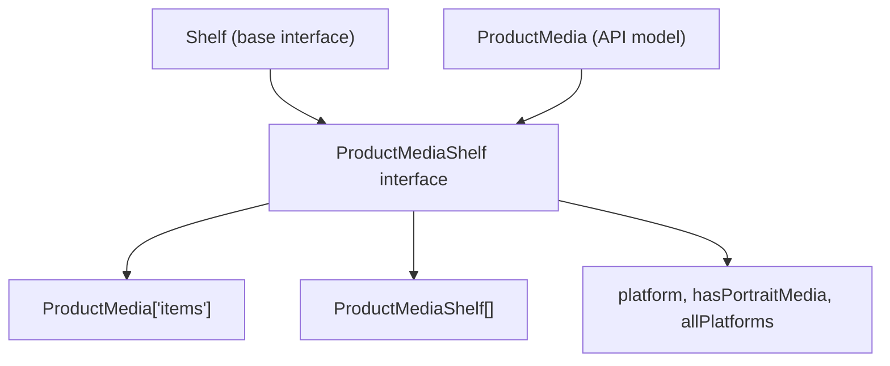
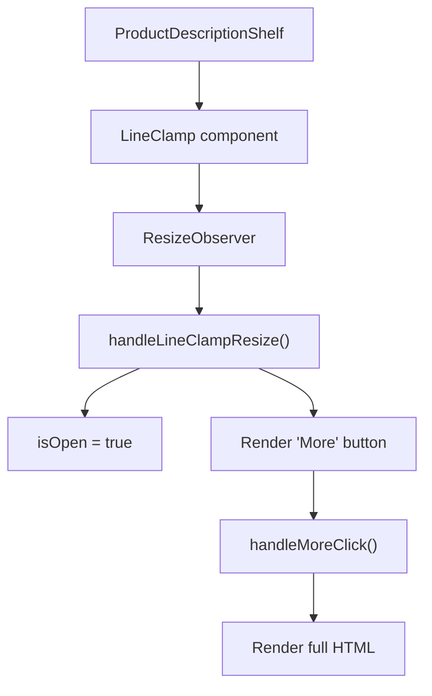
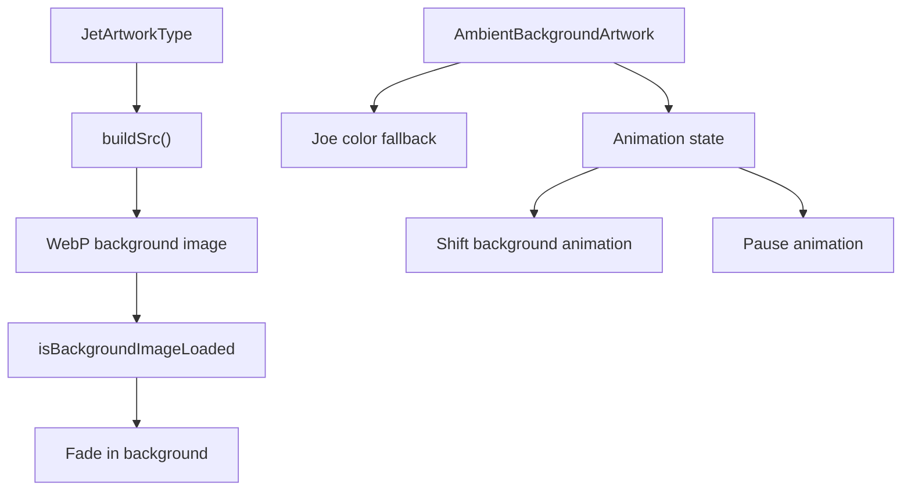
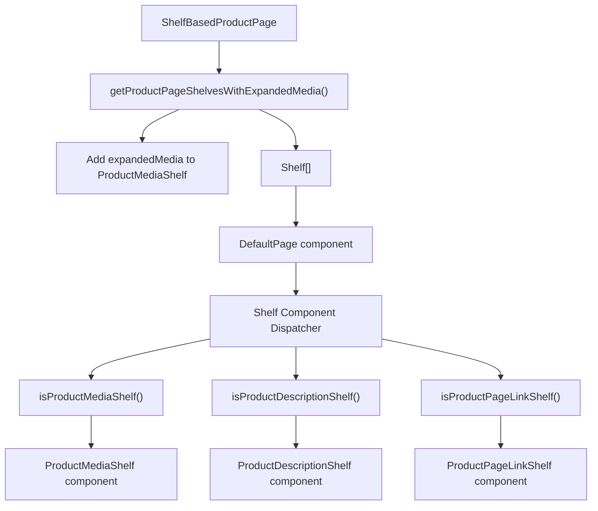

# Product-Specific Shelves

-   [src/components/AmbientBackgroundArtwork.svelte](https://github.com/Chesszyh/apps.apple.com/blob/279d0c4d/src/components/AmbientBackgroundArtwork.svelte)
-   [src/components/jet/marker-shelf/ProductTopLockup.svelte](https://github.com/Chesszyh/apps.apple.com/blob/279d0c4d/src/components/jet/marker-shelf/ProductTopLockup.svelte)
-   [src/components/jet/shelf/ProductDescriptionShelf.svelte](https://github.com/Chesszyh/apps.apple.com/blob/279d0c4d/src/components/jet/shelf/ProductDescriptionShelf.svelte)
-   [src/components/jet/shelf/ProductMediaShelf.svelte](https://github.com/Chesszyh/apps.apple.com/blob/279d0c4d/src/components/jet/shelf/ProductMediaShelf.svelte)
-   [src/components/pages/ProductPage.svelte](https://github.com/Chesszyh/apps.apple.com/blob/279d0c4d/src/components/pages/ProductPage.svelte)

## Purpose and Scope

This document details the specialized shelf components designed exclusively for product detail pages in the App Store web application. These shelves extend the generic shelf system to handle product-specific content such as platform-specific screenshots, product descriptions, ratings, and other product metadata.

For information about the overall ProductPage structure and MarkerShelf (hero section), see [Product Page Layout](#6.1). For detailed platform-specific media rendering strategies, see [Platform-Specific Media Rendering](#6.3). For the general shelf system architecture, see [Shelf System](#4.2).

---

## Overview of Product-Specific Shelves

Product pages utilize a combination of generic shelves and specialized product shelves. The primary product-specific shelf types include:

| Shelf Type | Type Guard Function | Primary Purpose |
| --- | --- | --- |
| `ProductMediaShelf` | `isProductMediaShelf()` | Platform-specific screenshots and videos |
| `ProductDescriptionShelf` | `isProductDescriptionShelf()` | Product description with expand/collapse |
| `ProductPageLinkShelf` | `isProductPageLinkShelf()` | Legal links, EULA, privacy policy |
| `MarkerShelf` | N/A (rendered via slot) | Hero section (see [Product Page Layout](#6.1)) |

**Sources:** [src/components/jet/shelf/ProductMediaShelf.svelte1-270](https://github.com/Chesszyh/apps.apple.com/blob/279d0c4d/src/components/jet/shelf/ProductMediaShelf.svelte#L1-L270) [src/components/jet/shelf/ProductDescriptionShelf.svelte1-96](https://github.com/Chesszyh/apps.apple.com/blob/279d0c4d/src/components/jet/shelf/ProductDescriptionShelf.svelte#L1-L96) [src/components/pages/ProductPage.svelte1-78](https://github.com/Chesszyh/apps.apple.com/blob/279d0c4d/src/components/pages/ProductPage.svelte#L1-L78)

---

## ProductMediaShelf Architecture

### Type Definition and Guard

The `ProductMediaShelf` extends the base `Shelf` interface with product media-specific properties:

The type guard checks for the `productMediaItem` content type:

[src/components/jet/shelf/ProductMediaShelf.svelte15-20](https://github.com/Chesszyh/apps.apple.com/blob/279d0c4d/src/components/jet/shelf/ProductMediaShelf.svelte#L15-L20)

**Sources:** [src/components/jet/shelf/ProductMediaShelf.svelte1-21](https://github.com/Chesszyh/apps.apple.com/blob/279d0c4d/src/components/jet/shelf/ProductMediaShelf.svelte#L1-L21)

---

### Platform Detection and Rendering Flow

> **[Mermaid sequence]**
> *(图表结构无法解析)*

The platform is extracted from `shelf.contentsMetadata.platform.appPlatform` [src/components/jet/shelf/ProductMediaShelf.svelte70-75](https://github.com/Chesszyh/apps.apple.com/blob/279d0c4d/src/components/jet/shelf/ProductMediaShelf.svelte#L70-L75) Each platform uses a specific rendering component and grid layout:

-   **Vision**: `ProductMediaVisionItem` with `ScreenshotVision` grid
-   **Phone/Messages**: `ProductMediaPhoneItem` with portrait or large grid
-   **iPad**: `ProductMediaPadItem` with portrait or large grid
-   **Mac**: `ProductMediaMacItem` with large grid
-   **TV**: `ProductMediaTVItem` with large grid
-   **Watch**: `ProductMediaWatchItem` with phone-sized grid

**Sources:** [src/components/jet/shelf/ProductMediaShelf.svelte70-136](https://github.com/Chesszyh/apps.apple.com/blob/279d0c4d/src/components/jet/shelf/ProductMediaShelf.svelte#L70-L136)

---

### Platform Icon Mapping

The shelf displays platform indicators using SF Symbols mapped to each platform:

[src/components/jet/shelf/ProductMediaShelf.svelte22-40](https://github.com/Chesszyh/apps.apple.com/blob/279d0c4d/src/components/jet/shelf/ProductMediaShelf.svelte#L22-L40)

```mermaid
flowchart TD
    phone["'phone'"]
    pad["'pad'"]
    tv["'tv'"]
    watch["'watch'"]
    mac["'mac'"]
    messages["'messages'"]
    vision["'vision'"]
    ip["iphone.gen2"]
    ipad["ipad.gen2"]
    tvicon["tv"]
    aw["applewatch"]
    mb["macbook.gen2"]
    msg["message"]
    vp["visionpro"]
    pk["AppStore.AppPlatform.Phone"]
    padk["AppStore.AppPlatform.Pad"]
    tvk["AppStore.AppPlatform.TV"]
    wk["AppStore.AppPlatform.Watch"]
    mk["AppStore.AppPlatform.Mac"]
    msgk["AppStore.AppPlatform.Messages"]
    vk["AppStore.AppPlatform.Vision"]

    phone --> ip
    pad --> ipad
    tv --> tvicon
    watch --> aw
    mac --> mb
    messages --> msg
    vision --> vp
    phone --> pk
    pad --> padk
    tv --> tvk
    watch --> wk
    mac --> mk
    messages --> msgk
    vision --> vk
```

**Sources:** [src/components/jet/shelf/ProductMediaShelf.svelte22-40](https://github.com/Chesszyh/apps.apple.com/blob/279d0c4d/src/components/jet/shelf/ProductMediaShelf.svelte#L22-L40)

---

### Expanded Media System

When a product supports multiple platforms, `ProductMediaShelf` can include an `expandedMedia` property containing additional `ProductMediaShelf` instances for each platform:

The expansion is controlled by the `shouldDisplayExpandedMedia` state variable [src/components/jet/shelf/ProductMediaShelf.svelte68](https://github.com/Chesszyh/apps.apple.com/blob/279d0c4d/src/components/jet/shelf/ProductMediaShelf.svelte#L68-L68) which transitions from `false` to `true` when the user clicks the expand button [src/components/jet/shelf/ProductMediaShelf.svelte88-96](https://github.com/Chesszyh/apps.apple.com/blob/279d0c4d/src/components/jet/shelf/ProductMediaShelf.svelte#L88-L96)

When expanded, the component recursively renders itself for each platform:

[src/components/jet/shelf/ProductMediaShelf.svelte178-186](https://github.com/Chesszyh/apps.apple.com/blob/279d0c4d/src/components/jet/shelf/ProductMediaShelf.svelte#L178-L186)

The metrics event `platformSelect` is recorded when expanding [src/components/jet/shelf/ProductMediaShelf.svelte90-95](https://github.com/Chesszyh/apps.apple.com/blob/279d0c4d/src/components/jet/shelf/ProductMediaShelf.svelte#L90-L95)

**Sources:** [src/components/jet/shelf/ProductMediaShelf.svelte68-189](https://github.com/Chesszyh/apps.apple.com/blob/279d0c4d/src/components/jet/shelf/ProductMediaShelf.svelte#L68-L189)

---

### Grid Type Selection Logic

The `gridType` prop passed to `ShelfItemLayout` determines the CSS grid configuration:

| Platform | Portrait Media | Grid Type |
| --- | --- | --- |
| Vision | N/A | `ScreenshotVision` |
| Phone/Messages | Yes | `ScreenshotPhone` |
| Phone/Messages | No | `ScreenshotLarge` |
| iPad | Yes | `ScreenshotPad` |
| iPad | No | `ScreenshotLarge` |
| Mac | N/A | `ScreenshotLarge` |
| TV | N/A | `ScreenshotLarge` |
| Watch | N/A | `ScreenshotPhone` |

The `hasPortraitMedia` flag [src/components/jet/shelf/ProductMediaShelf.svelte67](https://github.com/Chesszyh/apps.apple.com/blob/279d0c4d/src/components/jet/shelf/ProductMediaShelf.svelte#L67-L67) is extracted from `shelf.contentsMetadata` and drives the conditional grid selection for phone and iPad platforms.

**Sources:** [src/components/jet/shelf/ProductMediaShelf.svelte100-136](https://github.com/Chesszyh/apps.apple.com/blob/279d0c4d/src/components/jet/shelf/ProductMediaShelf.svelte#L100-L136)

---

## ProductDescriptionShelf

### Type Definition and Interface

The type guard validates both the content type and items array:

[src/components/jet/shelf/ProductDescriptionShelf.svelte11-17](https://github.com/Chesszyh/apps.apple.com/blob/279d0c4d/src/components/jet/shelf/ProductDescriptionShelf.svelte#L11-L17)

**Sources:** [src/components/jet/shelf/ProductDescriptionShelf.svelte1-18](https://github.com/Chesszyh/apps.apple.com/blob/279d0c4d/src/components/jet/shelf/ProductDescriptionShelf.svelte#L1-L18)

---

### Expand/Collapse Behavior

The component implements a line-clamped description with expand functionality:

> **[Mermaid stateDiagram]**
> *(图表结构无法解析)*

The state transitions are controlled by:

1.  **Initial state**: `isOpen = false` [src/components/jet/shelf/ProductDescriptionShelf.svelte31](https://github.com/Chesszyh/apps.apple.com/blob/279d0c4d/src/components/jet/shelf/ProductDescriptionShelf.svelte#L31-L31)
2.  **Auto-expand**: If `LineClamp` detects no truncation [src/components/jet/shelf/ProductDescriptionShelf.svelte33-37](https://github.com/Chesszyh/apps.apple.com/blob/279d0c4d/src/components/jet/shelf/ProductDescriptionShelf.svelte#L33-L37)
3.  **Manual expand**: User clicks the "More" button [src/components/jet/shelf/ProductDescriptionShelf.svelte30](https://github.com/Chesszyh/apps.apple.com/blob/279d0c4d/src/components/jet/shelf/ProductDescriptionShelf.svelte#L30-L30)

**Sources:** [src/components/jet/shelf/ProductDescriptionShelf.svelte29-57](https://github.com/Chesszyh/apps.apple.com/blob/279d0c4d/src/components/jet/shelf/ProductDescriptionShelf.svelte#L29-L57)

---

### HTML Sanitization

Product descriptions are rendered as HTML and must be sanitized to prevent XSS attacks:

[src/components/jet/shelf/ProductDescriptionShelf.svelte44](https://github.com/Chesszyh/apps.apple.com/blob/279d0c4d/src/components/jet/shelf/ProductDescriptionShelf.svelte#L44-L44)

The `sanitizeHtml()` utility [imported from @amp/web-app-components](https://github.com/Chesszyh/apps.apple.com/blob/279d0c4d/imported from @amp/web-app-components) strips dangerous HTML elements and attributes while preserving formatting elements like `<b>`, `<i>`, and ` `.

**Sources:** [src/components/jet/shelf/ProductDescriptionShelf.svelte21-48](https://github.com/Chesszyh/apps.apple.com/blob/279d0c4d/src/components/jet/shelf/ProductDescriptionShelf.svelte#L21-L48)

---

### Line Clamping Implementation

The `LineClamp` component [src/components/jet/shelf/ProductDescriptionShelf.svelte46](https://github.com/Chesszyh/apps.apple.com/blob/279d0c4d/src/components/jet/shelf/ProductDescriptionShelf.svelte#L46-L46) is configured with:

-   `clamp={5}`: Maximum 5 lines before truncation
-   `observe`: Enable ResizeObserver to detect layout changes
-   `on:resize`: Handler to auto-expand if content fits

**Sources:** [src/components/jet/shelf/ProductDescriptionShelf.svelte33-54](https://github.com/Chesszyh/apps.apple.com/blob/279d0c4d/src/components/jet/shelf/ProductDescriptionShelf.svelte#L33-L54)

---

### Styling and Layout

The description uses a gradient overlay technique to mask the "More" button over the clamped text:

[src/components/jet/shelf/ProductDescriptionShelf.svelte76-94](https://github.com/Chesszyh/apps.apple.com/blob/279d0c4d/src/components/jet/shelf/ProductDescriptionShelf.svelte#L76-L94)

The button is positioned absolutely at the bottom-right (RTL: bottom-left) with a gradient background that transitions from the page background to transparent, creating a seamless fade effect over the last line of clamped text.

On medium+ screens, the description is constrained to 66% width for better readability [src/components/jet/shelf/ProductDescriptionShelf.svelte71-73](https://github.com/Chesszyh/apps.apple.com/blob/279d0c4d/src/components/jet/shelf/ProductDescriptionShelf.svelte#L71-L73)

**Sources:** [src/components/jet/shelf/ProductDescriptionShelf.svelte60-95](https://github.com/Chesszyh/apps.apple.com/blob/279d0c4d/src/components/jet/shelf/ProductDescriptionShelf.svelte#L60-L95)

---

## Other Product-Specific Shelves

### ProductPageLinkShelf

Renders legal and informational links on product pages, including:

-   License Agreement (EULA)
-   Privacy Policy
-   Report a Problem

This shelf is used for EULA deep linking functionality [src/components/pages/ProductPage.svelte42-59](https://github.com/Chesszyh/apps.apple.com/blob/279d0c4d/src/components/pages/ProductPage.svelte#L42-L59) where the presence of a `?lic` query parameter automatically opens the EULA modal on page load.

**Sources:** [src/components/pages/ProductPage.svelte14-59](https://github.com/Chesszyh/apps.apple.com/blob/279d0c4d/src/components/pages/ProductPage.svelte#L14-L59)

---

### Ambient Background Effects

Product pages can display ambient background artwork derived from the app icon:

The component [src/components/AmbientBackgroundArtwork.svelte1-203](https://github.com/Chesszyh/apps.apple.com/blob/279d0c4d/src/components/AmbientBackgroundArtwork.svelte#L1-L203) provides:

-   **Lazy loading**: Background image loads asynchronously [src/components/AmbientBackgroundArtwork.svelte25-29](https://github.com/Chesszyh/apps.apple.com/blob/279d0c4d/src/components/AmbientBackgroundArtwork.svelte#L25-L29)
-   **Performance optimization**: Animation pauses when out of view or during resize [src/components/AmbientBackgroundArtwork.svelte170-174](https://github.com/Chesszyh/apps.apple.com/blob/279d0c4d/src/components/AmbientBackgroundArtwork.svelte#L170-L174)
-   **Blur and saturation effects**: Creates ambient atmosphere [src/components/AmbientBackgroundArtwork.svelte106](https://github.com/Chesszyh/apps.apple.com/blob/279d0c4d/src/components/AmbientBackgroundArtwork.svelte#L106-L106)
-   **Animated overlay**: Slowly shifting desaturated background pattern [src/components/AmbientBackgroundArtwork.svelte143-161](https://github.com/Chesszyh/apps.apple.com/blob/279d0c4d/src/components/AmbientBackgroundArtwork.svelte#L143-L161)

**Sources:** [src/components/AmbientBackgroundArtwork.svelte1-203](https://github.com/Chesszyh/apps.apple.com/blob/279d0c4d/src/components/AmbientBackgroundArtwork.svelte#L1-L203)

---

## Integration with ProductPage

Product-specific shelves are integrated into the product page through the shelf array processing:

The `getProductPageShelvesWithExpandedMedia()` utility [src/components/pages/ProductPage.svelte22](https://github.com/Chesszyh/apps.apple.com/blob/279d0c4d/src/components/pages/ProductPage.svelte#L22-L22) pre-processes the shelf array to populate the `expandedMedia` property of `ProductMediaShelf` instances based on the product's multi-platform support.

**Sources:** [src/components/pages/ProductPage.svelte1-78](https://github.com/Chesszyh/apps.apple.com/blob/279d0c4d/src/components/pages/ProductPage.svelte#L1-L78)
