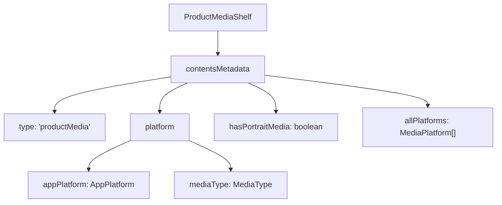
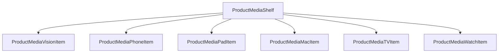
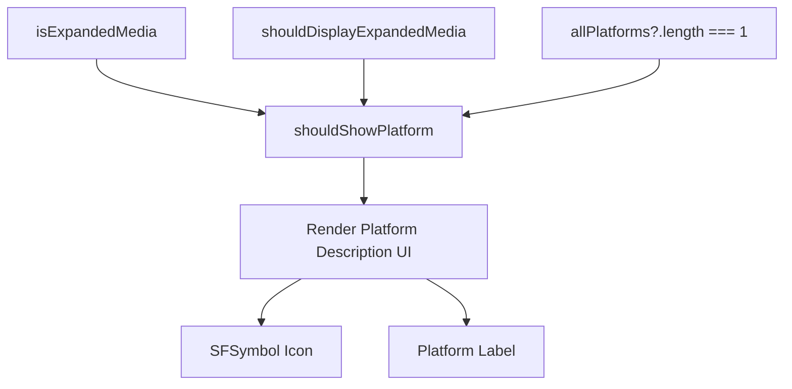
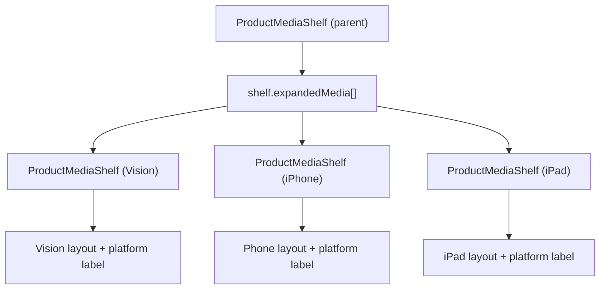
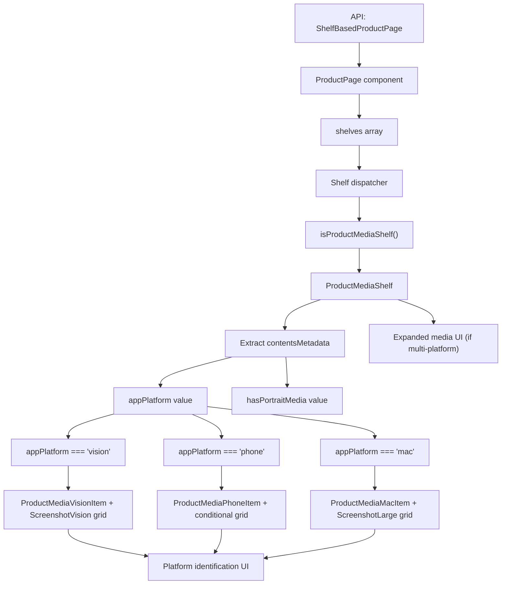

# Platform-Specific Media Rendering

-   [src/components/AmbientBackgroundArtwork.svelte](https://github.com/Chesszyh/apps.apple.com/blob/279d0c4d/src/components/AmbientBackgroundArtwork.svelte)
-   [src/components/jet/marker-shelf/ProductTopLockup.svelte](https://github.com/Chesszyh/apps.apple.com/blob/279d0c4d/src/components/jet/marker-shelf/ProductTopLockup.svelte)
-   [src/components/jet/shelf/ProductDescriptionShelf.svelte](https://github.com/Chesszyh/apps.apple.com/blob/279d0c4d/src/components/jet/shelf/ProductDescriptionShelf.svelte)
-   [src/components/jet/shelf/ProductMediaShelf.svelte](https://github.com/Chesszyh/apps.apple.com/blob/279d0c4d/src/components/jet/shelf/ProductMediaShelf.svelte)
-   [src/components/pages/ProductPage.svelte](https://github.com/Chesszyh/apps.apple.com/blob/279d0c4d/src/components/pages/ProductPage.svelte)

## Purpose and Scope

This document explains how `ProductMediaShelf` adapts product screenshots and preview videos for different Apple platforms (Vision, Mac, iPad, iPhone, Apple TV, Apple Watch). Each platform has unique aspect ratios, layout requirements, and presentation patterns that are handled through a platform-detection and component-dispatch system.

For information about the broader product page structure, see [Product Page Layout](#6.1). For other product-specific shelves like ratings and descriptions, see [Product-Specific Shelves](#6.2).

---

## Platform Detection and Content Metadata

The `ProductMediaShelf` receives platform information through the `contentsMetadata` field, which contains essential rendering parameters.

**Sources:** [src/components/jet/shelf/ProductMediaShelf.svelte70-75](https://github.com/Chesszyh/apps.apple.com/blob/279d0c4d/src/components/jet/shelf/ProductMediaShelf.svelte#L70-L75)

### Content Metadata Structure


| Field | Type | Description |
| --- | --- | --- |
| `contentsMetadata.platform.appPlatform` | `AppPlatform` | The primary platform (vision, phone, pad, mac, tv, watch, messages) |
| `contentsMetadata.platform.mediaType` | `MediaType` | Type of media (screenshot, video, etc.) |
| `contentsMetadata.hasPortraitMedia` | `boolean` | Whether the media items use portrait orientation |
| `contentsMetadata.allPlatforms` | `MediaPlatform[]` | All supported platforms for multi-platform apps |

The shelf extracts these values on initialization:

```
if (shelf.contentsMetadata.type === 'productMedia') {    ({ hasPortraitMedia, allPlatforms } = shelf.contentsMetadata);    ({ appPlatform, mediaType } = shelf.contentsMetadata.platform);}
```
**Sources:** [src/components/jet/shelf/ProductMediaShelf.svelte70-75](https://github.com/Chesszyh/apps.apple.com/blob/279d0c4d/src/components/jet/shelf/ProductMediaShelf.svelte#L70-L75)

---

## Platform-to-Component Dispatch System

The shelf uses a conditional rendering strategy to dispatch to platform-specific item components, with each platform receiving appropriate layout configuration.


**Sources:** [src/components/jet/shelf/ProductMediaShelf.svelte100-136](https://github.com/Chesszyh/apps.apple.com/blob/279d0c4d/src/components/jet/shelf/ProductMediaShelf.svelte#L100-L136)

### Platform Component Mapping

Each platform uses a specific component and grid type based on its display characteristics:

| Platform | Component | Grid Type | Conditional Grid |
| --- | --- | --- | --- |
| `vision` | `ProductMediaVisionItem` | `ScreenshotVision` | \- |
| `phone` / `messages` | `ProductMediaPhoneItem` | `ScreenshotPhone` or `ScreenshotLarge` | Based on `hasPortraitMedia` |
| `pad` | `ProductMediaPadItem` | `ScreenshotPad` or `ScreenshotLarge` | Based on `hasPortraitMedia` |
| `mac` | `ProductMediaMacItem` | `ScreenshotLarge` | \- |
| `tv` | `ProductMediaTVItem` | `ScreenshotLarge` | \- |
| `watch` | `ProductMediaWatchItem` | `ScreenshotPhone` | \- |

The grid type determines column layout, spacing, and responsive breakpoints through `ShelfItemLayout`.

**Sources:** [src/components/jet/shelf/ProductMediaShelf.svelte100-136](https://github.com/Chesszyh/apps.apple.com/blob/279d0c4d/src/components/jet/shelf/ProductMediaShelf.svelte#L100-L136)

### Portrait vs Landscape Layout Logic

Phone and iPad platforms adapt their grid type based on media orientation:

```
{#if appPlatform === 'phone' || appPlatform === 'messages'}    <ShelfItemLayout        {shelf}        gridType={hasPortraitMedia ? 'ScreenshotPhone' : 'ScreenshotLarge'}        let:item    >        <ProductMediaPhoneItem {item} {hasPortraitMedia} {mediaType} />    </ShelfItemLayout>{:else if appPlatform === 'pad'}    <ShelfItemLayout        {shelf}        gridType={hasPortraitMedia ? 'ScreenshotPad' : 'ScreenshotLarge'}        let:item    >        <ProductMediaPadItem {item} {hasPortraitMedia} {mediaType} />    </ShelfItemLayout>{/if}
```
-   **Portrait media**: Uses `ScreenshotPhone` or `ScreenshotPad` for taller aspect ratios
-   **Landscape media**: Uses `ScreenshotLarge` for wider, more cinematic layouts

**Sources:** [src/components/jet/shelf/ProductMediaShelf.svelte104-119](https://github.com/Chesszyh/apps.apple.com/blob/279d0c4d/src/components/jet/shelf/ProductMediaShelf.svelte#L104-L119)

---

## Platform Identification UI

When media is displayed, users see platform identification through icons and labels positioned below the media grid.


**Sources:** [src/components/jet/shelf/ProductMediaShelf.svelte83-147](https://github.com/Chesszyh/apps.apple.com/blob/279d0c4d/src/components/jet/shelf/ProductMediaShelf.svelte#L83-L147)

### Platform Icon and Label Mappings

The shelf uses predefined mappings to convert platform identifiers into UI elements:

```
const platformToIconNameMap: Record<AppPlatform, string> = {    phone: 'iphone.gen2',    pad: 'ipad.gen2',    tv: 'tv',    watch: 'applewatch',    mac: 'macbook.gen2',    messages: 'message',    vision: 'visionpro',};const platformToDescriptionMap: Record<AppPlatform, string> = {    phone: 'AppStore.AppPlatform.Phone',    pad: 'AppStore.AppPlatform.Pad',    tv: 'AppStore.AppPlatform.TV',    watch: 'AppStore.AppPlatform.Watch',    mac: 'AppStore.AppPlatform.Mac',    messages: 'AppStore.AppPlatform.Messages',    vision: 'AppStore.AppPlatform.Vision',};
```
The icon names reference SF Symbols, rendered through the `SFSymbol` component. The description keys are i18n identifiers for localized platform names.

**Sources:** [src/components/jet/shelf/ProductMediaShelf.svelte22-40](https://github.com/Chesszyh/apps.apple.com/blob/279d0c4d/src/components/jet/shelf/ProductMediaShelf.svelte#L22-L40)

---

## Expanded Media for Multi-Platform Apps

When an app supports multiple platforms, the shelf provides an expandable interface to display media for each platform separately.

> **[Mermaid sequence]**
> *(图表结构无法解析)*

**Sources:** [src/components/jet/shelf/ProductMediaShelf.svelte88-189](https://github.com/Chesszyh/apps.apple.com/blob/279d0c4d/src/components/jet/shelf/ProductMediaShelf.svelte#L88-L189)

### Expanded Media State Flow

The expansion is controlled by three key conditions:

1.  **`shelf.expandedMedia`**: Array of `ProductMediaShelf` objects, one per platform
2.  **`allPlatforms.length > 1`**: Only shows for multi-platform apps
3.  **`shouldDisplayExpandedMedia`**: Local state toggled by user interaction

```
{#if shelf.expandedMedia && allPlatforms && allPlatforms.length > 1}    <div class="expanded-media">        {#if !shouldDisplayExpandedMedia}            <button class="expanded-media-header" on:click={displayExpandedMedia}>                <!-- Platform icons and names -->            </button>        {/if}        {#if shouldDisplayExpandedMedia}            <div class="expanded-media-content" transition:slide>                {#each shelf.expandedMedia as expandedMediaShelf}                    <svelte:self                        shelf={expandedMediaShelf}                        isExpandedMedia={true}                    />                {/each}            </div>        {/if}    </div>{/if}
```
**Sources:** [src/components/jet/shelf/ProductMediaShelf.svelte150-189](https://github.com/Chesszyh/apps.apple.com/blob/279d0c4d/src/components/jet/shelf/ProductMediaShelf.svelte#L150-L189)

### Platform Selector UI

Before expansion, users see a condensed view with all platform icons and names:

```
<div class="all-platforms">    <div class="all-platforms-icons">        {#each allPlatforms as platform}            <div class="icon" aria-hidden="true">                <SFSymbol name={platformToIconNameMap[platform.appPlatform]} />            </div>        {/each}    </div>    <div class="all-platforms-names">        {allPlatformsDescription}    </div></div>
```
The `allPlatformsDescription` is a localized, separator-joined string:

```
$: allPlatformsDescription = allPlatforms    ?.map(({ appPlatform }) =>        $i18n.t(platformToDescriptionMap[appPlatform]),    )    ?.join($i18n.t('AppStore.AppPlatform.Component.Separator'));
```
**Sources:** [src/components/jet/shelf/ProductMediaShelf.svelte77-81](https://github.com/Chesszyh/apps.apple.com/blob/279d0c4d/src/components/jet/shelf/ProductMediaShelf.svelte#L77-L81) [src/components/jet/shelf/ProductMediaShelf.svelte159-171](https://github.com/Chesszyh/apps.apple.com/blob/279d0c4d/src/components/jet/shelf/ProductMediaShelf.svelte#L159-L171)

### Metrics Tracking

When users expand the platform selector, a custom metrics event is recorded:

```
const displayExpandedMedia = () => {    shouldDisplayExpandedMedia = true;    jet.recordCustomMetricsEvent({        eventType: 'click',        actionDetails: { type: 'platformSelect' },        targetType: 'button',        targetId: 'productMediaShelf',    });};
```
This allows analytics tracking of user engagement with multi-platform content.

**Sources:** [src/components/jet/shelf/ProductMediaShelf.svelte88-96](https://github.com/Chesszyh/apps.apple.com/blob/279d0c4d/src/components/jet/shelf/ProductMediaShelf.svelte#L88-L96)

---

## Recursive Rendering Pattern

The `ProductMediaShelf` uses Svelte's `<svelte:self>` to recursively render nested shelves for each platform:


Each child shelf receives `isExpandedMedia={true}`, which:

-   Prevents further expansion (no nested expand buttons)
-   Shows platform identification labels
-   Omits the bottom divider on the last child

**Sources:** [src/components/jet/shelf/ProductMediaShelf.svelte179-185](https://github.com/Chesszyh/apps.apple.com/blob/279d0c4d/src/components/jet/shelf/ProductMediaShelf.svelte#L179-L185)

### Expanded Media Styling Cascade

The parent shelf controls layout and transitions, while child shelves inherit proper spacing:

```
.expanded-media-content :global(.shelf:last-of-type) {    padding-bottom: 0;}
```
The slide transition provides smooth reveal animation when expanding:

```
<div class="expanded-media-content" transition:slide>
```
**Sources:** [src/components/jet/shelf/ProductMediaShelf.svelte179](https://github.com/Chesszyh/apps.apple.com/blob/279d0c4d/src/components/jet/shelf/ProductMediaShelf.svelte#L179-L179) [src/components/jet/shelf/ProductMediaShelf.svelte253-255](https://github.com/Chesszyh/apps.apple.com/blob/279d0c4d/src/components/jet/shelf/ProductMediaShelf.svelte#L253-L255)

---

## Type Guard and Integration

The shelf registers with the main shelf dispatcher through a type guard:

```
export function isProductMediaShelf(shelf: Shelf): shelf is ProductMediaShelf {    const { contentType, items } = shelf;    return contentType === 'productMediaItem' && Array.isArray(items);}
```
This guard is used in the shelf dispatcher to route `productMediaItem` content to the `ProductMediaShelf` component.

**Sources:** [src/components/jet/shelf/ProductMediaShelf.svelte15-20](https://github.com/Chesszyh/apps.apple.com/blob/279d0c4d/src/components/jet/shelf/ProductMediaShelf.svelte#L15-L20)

### ProductMediaShelf Interface

The shelf extends the base `Shelf` interface with product media fields:

```
interface ProductMediaShelf extends Shelf, ProductMedia {    items: ProductMedia['items'];    expandedMedia?: ProductMediaShelf[];}
```
-   **`items`**: Array of media items (screenshots/videos) to display
-   **`expandedMedia`**: Optional array of additional shelves for multi-platform rendering

**Sources:** [src/components/jet/shelf/ProductMediaShelf.svelte10-13](https://github.com/Chesszyh/apps.apple.com/blob/279d0c4d/src/components/jet/shelf/ProductMediaShelf.svelte#L10-L13)

---

## Complete Rendering Flow


**Sources:** [src/components/jet/shelf/ProductMediaShelf.svelte1-270](https://github.com/Chesszyh/apps.apple.com/blob/279d0c4d/src/components/jet/shelf/ProductMediaShelf.svelte#L1-L270) [src/components/pages/ProductPage.svelte1-78](https://github.com/Chesszyh/apps.apple.com/blob/279d0c4d/src/components/pages/ProductPage.svelte#L1-L78)
