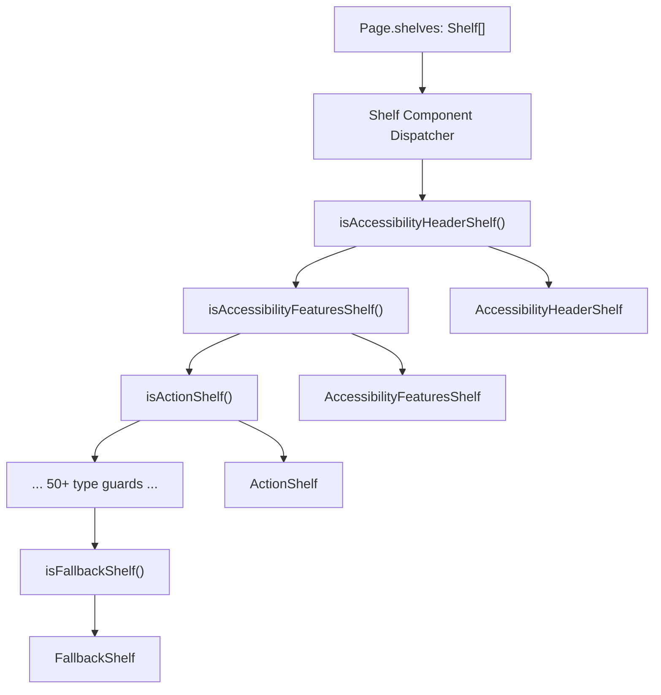
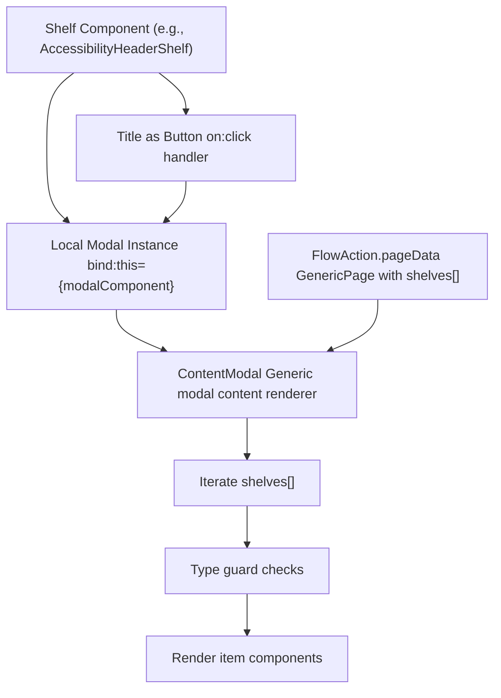
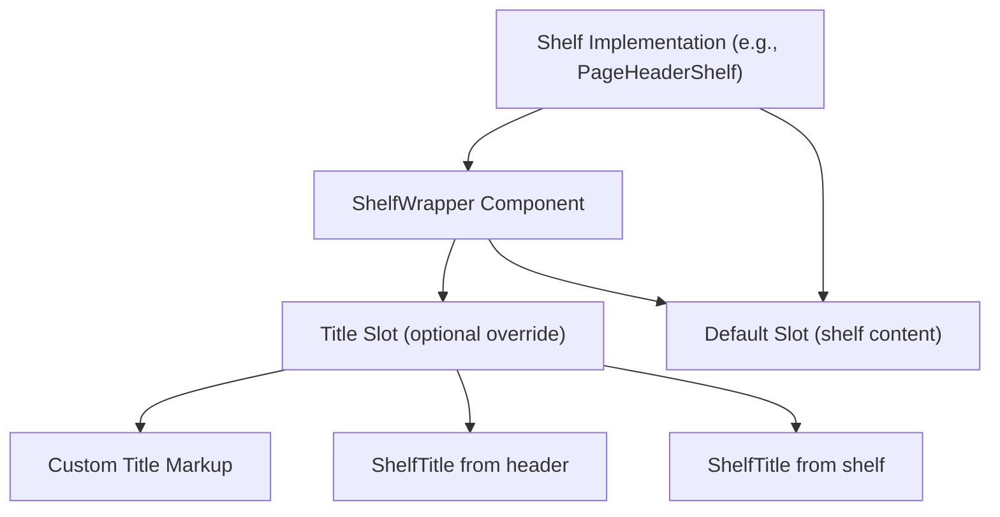

# Shelf Type Reference

-   [src/components/PageModal.svelte](https://github.com/Chesszyh/apps.apple.com/blob/279d0c4d/src/components/PageModal.svelte)
-   [src/components/Shelf/Wrapper.svelte](https://github.com/Chesszyh/apps.apple.com/blob/279d0c4d/src/components/Shelf/Wrapper.svelte)
-   [src/components/jet/shelf/AccessibilityHeaderShelf.svelte](https://github.com/Chesszyh/apps.apple.com/blob/279d0c4d/src/components/jet/shelf/AccessibilityHeaderShelf.svelte)
-   [src/components/jet/shelf/ArcadeFooterShelf.svelte](https://github.com/Chesszyh/apps.apple.com/blob/279d0c4d/src/components/jet/shelf/ArcadeFooterShelf.svelte)
-   [src/components/jet/shelf/PageHeaderShelf.svelte](https://github.com/Chesszyh/apps.apple.com/blob/279d0c4d/src/components/jet/shelf/PageHeaderShelf.svelte)
-   [src/components/jet/shelf/PrivacyFooterShelf.svelte](https://github.com/Chesszyh/apps.apple.com/blob/279d0c4d/src/components/jet/shelf/PrivacyFooterShelf.svelte)
-   [src/components/jet/shelf/PrivacyHeaderShelf.svelte](https://github.com/Chesszyh/apps.apple.com/blob/279d0c4d/src/components/jet/shelf/PrivacyHeaderShelf.svelte)
-   [src/components/jet/shelf/Shelf.svelte](https://github.com/Chesszyh/apps.apple.com/blob/279d0c4d/src/components/jet/shelf/Shelf.svelte)
-   [src/components/jet/shelf/TitledParagraphShelf.svelte](https://github.com/Chesszyh/apps.apple.com/blob/279d0c4d/src/components/jet/shelf/TitledParagraphShelf.svelte)
-   [src/components/pages/DefaultPage.svelte](https://github.com/Chesszyh/apps.apple.com/blob/279d0c4d/src/components/pages/DefaultPage.svelte)
-   [src/jet/utils/handle-modal-presentation.ts](https://github.com/Chesszyh/apps.apple.com/blob/279d0c4d/src/jet/utils/handle-modal-presentation.ts)
-   [src/stores/modalPage.ts](https://github.com/Chesszyh/apps.apple.com/blob/279d0c4d/src/stores/modalPage.ts)

This page provides a comprehensive catalog of all shelf types supported by the App Store web application. A **shelf** is the fundamental unit of page composition - pages are arrays of shelves that are dynamically rendered based on their `contentType` discriminator field.

For implementation details on how shelves are orchestrated and rendered on pages, see [Shelf System](#4.2). For information about adding new shelf types, see [Adding a New Shelf Type](#8.1). For details on shelf wrapper layout patterns, see [Shelf Wrapper and Common Layout](#4.4).

## Shelf Type System Overview

The shelf type system uses TypeScript type guards to narrow the generic `Shelf` interface to specific shelf implementations. Each shelf type has three key components:

1.  **TypeScript Interface** - Extends `Shelf` with type-specific fields (typically `contentType` and `items`)
2.  **Type Guard Function** - Runtime check that narrows the type (named `is[ShelfType]`)
3.  **Svelte Component** - Renders the shelf UI

The central dispatcher in [src/components/jet/shelf/Shelf.svelte1-321](https://github.com/Chesszyh/apps.apple.com/blob/279d0c4d/src/components/jet/shelf/Shelf.svelte#L1-L321) imports all shelf components and uses a cascading if-else chain to match shelves to their renderers.

### Type Guard Pattern

**Sources:** [src/components/jet/shelf/Shelf.svelte1-321](https://github.com/Chesszyh/apps.apple.com/blob/279d0c4d/src/components/jet/shelf/Shelf.svelte#L1-L321) [src/components/jet/shelf/AccessibilityHeaderShelf.svelte33-43](https://github.com/Chesszyh/apps.apple.com/blob/279d0c4d/src/components/jet/shelf/AccessibilityHeaderShelf.svelte#L33-L43) [src/components/jet/shelf/PageHeaderShelf.svelte8-11](https://github.com/Chesszyh/apps.apple.com/blob/279d0c4d/src/components/jet/shelf/PageHeaderShelf.svelte#L8-L11)

### Dispatcher Flow


**Sources:** [src/components/jet/shelf/Shelf.svelte205-320](https://github.com/Chesszyh/apps.apple.com/blob/279d0c4d/src/components/jet/shelf/Shelf.svelte#L205-L320)

### Common Shelf Interface Fields

All shelf types extend the base `Shelf` interface from the API models and typically include:

| Field | Type | Purpose |
| --- | --- | --- |
| `contentType` | `string` | Discriminator field for type narrowing |
| `items` | `Array<T>` | Array of content items to render |
| `title` | `string?` | Optional shelf title |
| `subtitle` | `string?` | Optional shelf subtitle |
| `seeAllAction` | `Action?` | Optional action for "See All" navigation |
| `header` | `ShelfHeader?` | Alternative header with title and actions |
| `id` | `string?` | DOM element ID for anchor links |
| `isHidden` | `boolean?` | Whether to skip rendering this shelf |
| `rowsPerColumn` | `number?` | Grid layout configuration |
| `presentationHints` | `string[]?` | Rendering hints (e.g., layout preferences) |

**Sources:** [src/components/Shelf/Wrapper.svelte1-82](https://github.com/Chesszyh/apps.apple.com/blob/279d0c4d/src/components/Shelf/Wrapper.svelte#L1-L82) [src/components/jet/shelf/ArcadeFooterShelf.svelte24](https://github.com/Chesszyh/apps.apple.com/blob/279d0c4d/src/components/jet/shelf/ArcadeFooterShelf.svelte#L24-L24)

## Complete Shelf Type Catalog

### Type Guard Registration Order

The order of type guard checks in the dispatcher determines precedence. The following table lists all shelf types in the order they are checked:

| # | Shelf Type | Content Type | Primary Use Case |
| --- | --- | --- | --- |
| 1 | `AccessibilityHeaderShelf` | `accessibilityParagraph` | Accessibility section header with modal |
| 2 | `AccessibilityFeaturesShelf` | `accessibilityFeatures` | List of accessibility features |
| 3 | `AccessibilityDeveloperLinkShelf` | `accessibilityDeveloperLink` | Link to developer accessibility info |
| 4 | `ActionShelf` | `action` | Shelf containing action buttons |
| 5 | `AnnotationShelf` | `annotation` | Editorial annotations and notes |
| 6 | `AppEventDetailShelf` | `appEventDetail` | In-app event detail display |
| 7 | `AppPromotionShelf` | `appPromotion` | Featured app promotions |
| 8 | `AppShowcaseShelf` | `appShowcase` | Showcase app collections |
| 9 | `AppTrailerLockupShelf` | `appTrailerLockup` | App trailers with lockup |
| 10 | `ArcadeFooterShelf` | `arcadeFooter` | Apple Arcade footer links |
| 11 | `BannerShelf` | `banner` | Banner messages (currently no-op) |
| 12 | `BrickShelf` | `brick` | Grid of app/content bricks |
| 13 | `CategoryBrickShelf` | `categoryBrick` | Category browsing bricks |
| 14 | `EditorialCardShelf` | `editorialCard` | Editorial story cards |
| 15 | `EditorialLinkShelf` | `editorialLink` | Editorial navigation links |
| 16 | `FramedArtworkShelf` | `framedArtwork` | Artwork in decorative frame |
| 17 | `FramedVideoShelf` | `framedVideo` | Video in decorative frame |
| 18 | `HeroCarouselShelf` | `heroCarousel` | Hero carousel with large media |
| 19 | `HorizontalRuleShelf` | `horizontalRule` | Visual separator line |
| 20 | `InAppPurchaseLockupShelf` | `inAppPurchaseLockup` | In-app purchase items |
| 21 | `LargeHeroBreakoutShelf` | `largeHeroBreakout` | Large breakout hero items |
| 22 | `LargeBrickShelf` | `largeBrick` | Large-sized brick grid |
| 23 | `LargeImageLockupShelf` | `largeImageLockup` | Large image lockup items |
| 24 | `LargeLockupShelf` | `largeLockup` | Large app/content lockups |
| 25 | `LargeStoryCardShelf` | `largeStoryCard` | Large editorial story cards |
| 26 | `LinkableTextShelf` | `linkableText` | Text with embedded links |
| 27 | `ProductDescriptionShelf` | `productDescription` | Product description text |
| 28 | `MediumImageLockupShelf` | `mediumImageLockup` | Medium image lockup items |
| 29 | `MediumLockupShelf` | `mediumLockup` | Medium app/content lockups |
| 30 | `MediumStoryCardShelf` | `mediumStoryCard` | Medium editorial story cards |
| 31 | `PosterLockupShelf` | `posterLockup` | Poster-style lockup display |
| 32 | `ProductBadgeShelf` | `productBadge` | Product awards/badges |
| 33 | `PageHeaderShelf` | `pageHeader` | Page-level header |
| 34 | `ParagraphShelf` | `paragraph` | Paragraph text content |
| 35 | `PrivacyHeaderShelf` | `privacyHeader` | Privacy section header with modal |
| 36 | `PrivacyFooterShelf` | `privacyFooter` | Privacy disclaimer footer |
| 37 | `PrivacyTypeShelf` | `privacyType` | Privacy data type listings |
| 38 | `ProductMediaShelf` | `productMedia` | Product screenshots/videos |
| 39 | `ProductRatingsShelf` | `productRatings` | Product ratings summary |
| 40 | `ProductReviewShelf` | `productReview` | Individual product review |
| 41 | `RibbonBarShelf` | `ribbonBar` | Ribbon navigation bar |
| 42 | `SearchLinkShelf` | `searchLink` | Search result links |
| 43 | `SearchResultShelf` | `searchResult` | Search result items |
| 44 | `SmallBreakoutShelf` | `smallBreakout` | Small breakout items |
| 45 | `SmallBrickShelf` | `smallBrick` | Small-sized brick grid |
| 46 | `SmallStoryCardShelf` | `smallStoryCard` | Small editorial story cards |
| 47 | `SmallLockupShelf` | `smallLockup` | Small app/content lockups |
| 48 | `ProductCapabilityShelf` | `productCapability` | Product capability listings |
| 49 | `ProductPageLinkShelf` | `productPageLink` | Links to product pages |
| 50 | `QuoteShelf` | `quote` | Pull quotes and testimonials |
| 51 | `ReviewsContainerShelf` | `reviewsContainer` | Container for reviews |
| 52 | `ReviewsShelf` | `reviews` | Reviews collection |
| 53 | `TodayCardShelf` | `todayCard` | Today tab editorial cards |
| 54 | `TitledParagraphShelf` | `titledParagraph` | Titled paragraph with modal |
| 55 | `UberShelf` | `uber` | Meta-shelf for special positioning |
| 56 | `MarkerShelf` | N/A | Special shelf requiring page context |
| 57 | `FallbackShelf` | N/A | Default fallback renderer |

**Sources:** [src/components/jet/shelf/Shelf.svelte5-174](https://github.com/Chesszyh/apps.apple.com/blob/279d0c4d/src/components/jet/shelf/Shelf.svelte#L5-L174) [src/components/jet/shelf/Shelf.svelte205-320](https://github.com/Chesszyh/apps.apple.com/blob/279d0c4d/src/components/jet/shelf/Shelf.svelte#L205-L320)

## Shelf Categories

### Editorial and Promotional Shelves

These shelves display curated editorial content, promotions, and featured items. For detailed documentation, see [Editorial and Promotional Shelves](#7.1).

| Shelf Type | Visual Style | Typical Usage |
| --- | --- | --- |
| `TodayCardShelf` | Large card with artwork | Today tab featured content |
| `EditorialCardShelf` | Story cards with overlays | Editorial collections |
| `HeroCarouselShelf` | Full-width carousel | Page hero sections |
| `AppPromotionShelf` | Promotional lockups | Featured app promotions |
| `AppShowcaseShelf` | Collection showcase | Curated app collections |
| `LargeStoryCardShelf` | Large story format | Premium editorial |
| `MediumStoryCardShelf` | Medium story format | Standard editorial |
| `SmallStoryCardShelf` | Compact story format | Dense editorial layouts |
| `FramedArtworkShelf` | Bordered artwork | Decorative images |
| `FramedVideoShelf` | Bordered video | Decorative videos |
| `QuoteShelf` | Pull quote styling | Testimonials |

**Sources:** [src/components/jet/shelf/TodayCardShelf.svelte](https://github.com/Chesszyh/apps.apple.com/blob/279d0c4d/src/components/jet/shelf/TodayCardShelf.svelte) [src/components/jet/shelf/EditorialCardShelf.svelte](https://github.com/Chesszyh/apps.apple.com/blob/279d0c4d/src/components/jet/shelf/EditorialCardShelf.svelte) [src/components/jet/shelf/HeroCarouselShelf.svelte](https://github.com/Chesszyh/apps.apple.com/blob/279d0c4d/src/components/jet/shelf/HeroCarouselShelf.svelte)

### Lockup and Grid Shelves

These shelves display apps and content in horizontal scrolling layouts or grids. For detailed documentation, see [Lockup and Grid Shelves](#7.2).

| Shelf Type | Item Size | Scroll Behavior |
| --- | --- | --- |
| `SmallLockupShelf` | Small | Horizontal scroll |
| `MediumLockupShelf` | Medium | Horizontal scroll |
| `LargeLockupShelf` | Large | Horizontal scroll |
| `SmallBrickShelf` | Small | Grid layout |
| `BrickShelf` | Medium | Grid layout |
| `LargeBrickShelf` | Large | Grid layout |
| `CategoryBrickShelf` | Category cards | Grid layout |
| `SmallImageLockupShelf` | Image-focused small | Horizontal scroll |
| `MediumImageLockupShelf` | Image-focused medium | Horizontal scroll |
| `LargeImageLockupShelf` | Image-focused large | Horizontal scroll |
| `PosterLockupShelf` | Poster format | Horizontal scroll |
| `InAppPurchaseLockupShelf` | IAP items | Horizontal scroll |
| `AppTrailerLockupShelf` | Trailer-focused | Horizontal scroll |

**Sources:** [src/components/jet/shelf/SmallLockupShelf.svelte](https://github.com/Chesszyh/apps.apple.com/blob/279d0c4d/src/components/jet/shelf/SmallLockupShelf.svelte) [src/components/jet/shelf/BrickShelf.svelte](https://github.com/Chesszyh/apps.apple.com/blob/279d0c4d/src/components/jet/shelf/BrickShelf.svelte) [src/components/jet/shelf/CategoryBrickShelf.svelte](https://github.com/Chesszyh/apps.apple.com/blob/279d0c4d/src/components/jet/shelf/CategoryBrickShelf.svelte)

### Product-Specific Shelves

These shelves appear on product detail pages and display product-specific information. See [Product-Specific Shelves](#6.2) for details.

| Shelf Type | Purpose |
| --- | --- |
| `ProductMediaShelf` | Screenshots and videos with platform-specific layouts |
| `ProductDescriptionShelf` | App description text with expandable content |
| `ProductRatingsShelf` | Aggregate ratings summary |
| `ProductReviewShelf` | Individual user review |
| `ReviewsContainerShelf` | Container for review collections |
| `ReviewsShelf` | Collection of reviews |
| `ProductBadgeShelf` | Awards and badges |
| `ProductCapabilityShelf` | Product capabilities list |
| `ProductPageLinkShelf` | Links to related product pages |

**Sources:** [src/components/jet/shelf/ProductMediaShelf.svelte](https://github.com/Chesszyh/apps.apple.com/blob/279d0c4d/src/components/jet/shelf/ProductMediaShelf.svelte) [src/components/jet/shelf/ProductDescriptionShelf.svelte](https://github.com/Chesszyh/apps.apple.com/blob/279d0c4d/src/components/jet/shelf/ProductDescriptionShelf.svelte) [src/components/jet/shelf/ProductRatingsShelf.svelte](https://github.com/Chesszyh/apps.apple.com/blob/279d0c4d/src/components/jet/shelf/ProductRatingsShelf.svelte)

### Informational and Compliance Shelves

These shelves display legal, privacy, accessibility, and informational content. For detailed documentation, see [Informational and Compliance Shelves](#7.3).

```mermaid
flowchart TD
    F1["ArcadeFooterShelf contentType: arcadeFooter"]
    F2["PrivacyFooterShelf contentType: privacyFooter"]
    T1["PageHeaderShelf contentType: pageHeader"]
    T3["TitledParagraphShelf contentType: titledParagraph"]
    Modal3["Local Modal VersionHistoryPage"]
    T2["ParagraphShelf contentType: paragraph"]
    T4["LinkableTextShelf contentType: linkableText"]
    T5["AnnotationShelf contentType: annotation"]
    P1["PrivacyHeaderShelf contentType: privacyHeader with seeAllAction"]
    Modal2["Local Modal PrivacyDetailPage"]
    P2["PrivacyTypeShelf contentType: privacyType"]
    P3["PrivacyFooterShelf contentType: privacyFooter"]
    A1["AccessibilityHeaderShelf contentType: accessibilityParagraph with seeAllAction"]
    Modal1["Local Modal AccessibilityDetailPage"]
    A2["AccessibilityFeaturesShelf contentType: accessibilityFeatures"]
    A3["AccessibilityDeveloperLinkShelf contentType: accessibilityDeveloperLink"]

    T3 --> Modal3
    P1 --> Modal2
    A1 --> Modal1
```


**Sources:** [src/components/jet/shelf/AccessibilityHeaderShelf.svelte1-183](https://github.com/Chesszyh/apps.apple.com/blob/279d0c4d/src/components/jet/shelf/AccessibilityHeaderShelf.svelte#L1-L183) [src/components/jet/shelf/PrivacyHeaderShelf.svelte1-146](https://github.com/Chesszyh/apps.apple.com/blob/279d0c4d/src/components/jet/shelf/PrivacyHeaderShelf.svelte#L1-L146) [src/components/jet/shelf/TitledParagraphShelf.svelte1-119](https://github.com/Chesszyh/apps.apple.com/blob/279d0c4d/src/components/jet/shelf/TitledParagraphShelf.svelte#L1-L119) [src/components/jet/shelf/ArcadeFooterShelf.svelte1-33](https://github.com/Chesszyh/apps.apple.com/blob/279d0c4d/src/components/jet/shelf/ArcadeFooterShelf.svelte#L1-L33)

### Special Shelves

| Shelf Type | Purpose |
| --- | --- |
| `MarkerShelf` | Special shelf that requires page-level context; uses slot delegation pattern |
| `UberShelf` | Meta-shelf for positioning control (e.g., `style: 'above'` for above-title placement) |
| `HorizontalRuleShelf` | Visual separator (horizontal line) |
| `ActionShelf` | Shelf containing action buttons |
| `SearchLinkShelf` | Search navigation links |
| `SearchResultShelf` | Search result items |
| `RibbonBarShelf` | Navigation ribbon bar |
| `BannerShelf` | Banner messages (currently disabled in UI) |
| `FallbackShelf` | Default renderer for unknown shelf types |

**Sources:** [src/components/jet/shelf/MarkerShelf.svelte](https://github.com/Chesszyh/apps.apple.com/blob/279d0c4d/src/components/jet/shelf/MarkerShelf.svelte) [src/components/jet/shelf/UberShelf.svelte](https://github.com/Chesszyh/apps.apple.com/blob/279d0c4d/src/components/jet/shelf/UberShelf.svelte) [src/components/pages/DefaultPage.svelte45-56](https://github.com/Chesszyh/apps.apple.com/blob/279d0c4d/src/components/pages/DefaultPage.svelte#L45-L56)

## Modal-Enabled Shelves

Several shelf types implement local modal functionality for displaying additional content without navigation. These use the pattern of embedding a Modal component directly in the shelf.

### Modal Pattern


**Sources:** [src/components/jet/shelf/AccessibilityHeaderShelf.svelte74-149](https://github.com/Chesszyh/apps.apple.com/blob/279d0c4d/src/components/jet/shelf/AccessibilityHeaderShelf.svelte#L74-L149) [src/components/jet/shelf/PrivacyHeaderShelf.svelte55-121](https://github.com/Chesszyh/apps.apple.com/blob/279d0c4d/src/components/jet/shelf/PrivacyHeaderShelf.svelte#L55-L121) [src/components/jet/shelf/TitledParagraphShelf.svelte51-109](https://github.com/Chesszyh/apps.apple.com/blob/279d0c4d/src/components/jet/shelf/TitledParagraphShelf.svelte#L51-L109)

### Shelves with Local Modals

| Shelf Type | Modal Trigger | Modal Content | Page Type |
| --- | --- | --- | --- |
| `AccessibilityHeaderShelf` | Title button | Accessibility features and paragraphs | `accessibilityDetails` |
| `PrivacyHeaderShelf` | Title button | Privacy types and headers | `privacyDetail` |
| `TitledParagraphShelf` | Title button | Version history items | `versionHistory` |

The modal pattern used by these shelves differs from the global modal system (see [Modal Presentation](#4.3)). These shelves:

1.  Maintain their own `Modal` component instance
2.  Check if `seeAllAction` is a `FlowAction` with expected `page` type
3.  Extract `pageData: GenericPage` from the action
4.  Render modal content by iterating `pageData.shelves` and using type guards

**Example Implementation Pattern:**

```
// Type guard for the specific FlowActionfunction isAccessibilityDetailFlowAction(    action: Action,): action is AccessibilityDetailPageFlowAction {    return isFlowAction(action) && action.page === 'accessibilityDetails';}// Extract destination if validconst destination =    seeAllAction && isAccessibilityDetailFlowAction(seeAllAction)        ? seeAllAction        : undefined;const pageData = destination?.pageData;
```
**Sources:** [src/components/jet/shelf/AccessibilityHeaderShelf.svelte53-90](https://github.com/Chesszyh/apps.apple.com/blob/279d0c4d/src/components/jet/shelf/AccessibilityHeaderShelf.svelte#L53-L90) [src/components/jet/shelf/PrivacyHeaderShelf.svelte36-71](https://github.com/Chesszyh/apps.apple.com/blob/279d0c4d/src/components/jet/shelf/PrivacyHeaderShelf.svelte#L36-L71)

## Data Model Pattern

All shelf components follow a consistent data model pattern:

**Common Pattern Example:**

```
// 1. Interface definition (context="module")interface PageHeaderShelf extends Shelf {    items: [PageHeader];  // Single-item array}// 2. Type guard exportexport function isPageHeaderShelf(shelf: Shelf): shelf is PageHeaderShelf {    const { contentType, items } = shelf;    return contentType === 'pageHeader' && Array.isArray(items);}// 3. Component propsexport let shelf: PageHeaderShelf;// 4. Extract items$: [item] = shelf.items;
```
**Sources:** [src/components/jet/shelf/PageHeaderShelf.svelte1-35](https://github.com/Chesszyh/apps.apple.com/blob/279d0c4d/src/components/jet/shelf/PageHeaderShelf.svelte#L1-L35) [src/components/jet/shelf/ArcadeFooterShelf.svelte1-33](https://github.com/Chesszyh/apps.apple.com/blob/279d0c4d/src/components/jet/shelf/ArcadeFooterShelf.svelte#L1-L33) [src/components/jet/shelf/PrivacyFooterShelf.svelte1-41](https://github.com/Chesszyh/apps.apple.com/blob/279d0c4d/src/components/jet/shelf/PrivacyFooterShelf.svelte#L1-L41)

## Shelf Wrapper Integration

Most shelves wrap their content in `ShelfWrapper` to provide consistent layout, spacing, and title rendering. The wrapper handles:

-   Title and subtitle display from `shelf.title`, `shelf.subtitle`, or `shelf.header`
-   See All action rendering
-   Centering and spacing
-   Border and margin configuration


**Common Usage Pattern:**

```
<ShelfWrapper {shelf} withBottomPadding={false}>    <!-- Optional custom title -->    <div slot="title" class="custom-title">        <ShelfTitle title={item.title} subtitle={item.subtitle} />    </div>        <!-- Shelf content -->    <div class="shelf-content">        {#each shelf.items as item}            <ItemComponent {item} />        {/each}    </div></ShelfWrapper>
```
**Sources:** [src/components/Shelf/Wrapper.svelte1-82](https://github.com/Chesszyh/apps.apple.com/blob/279d0c4d/src/components/Shelf/Wrapper.svelte#L1-L82) [src/components/jet/shelf/PageHeaderShelf.svelte23-27](https://github.com/Chesszyh/apps.apple.com/blob/279d0c4d/src/components/jet/shelf/PageHeaderShelf.svelte#L23-L27) [src/components/jet/shelf/ArcadeFooterShelf.svelte28-32](https://github.com/Chesszyh/apps.apple.com/blob/279d0c4d/src/components/jet/shelf/ArcadeFooterShelf.svelte#L28-L32)

## Page-Level Shelf Rendering

Shelves are rendered at the page level by iterating through the `shelves` array and delegating to the `Shelf` dispatcher component:

> **[Mermaid sequence]**
> *(图表结构无法解析)*

**Sources:** [src/components/pages/DefaultPage.svelte94-124](https://github.com/Chesszyh/apps.apple.com/blob/279d0c4d/src/components/pages/DefaultPage.svelte#L94-L124) [src/components/jet/shelf/Shelf.svelte195-320](https://github.com/Chesszyh/apps.apple.com/blob/279d0c4d/src/components/jet/shelf/Shelf.svelte#L195-L320)

## Global vs. Local Modal Rendering

The application supports two modal rendering patterns:

### Global Modal (PageModal)

Used for generic flow actions that can be triggered from anywhere in the application. Managed by `modalPageStore`.

**Flow:**

1.  Action performed → `handleModalPresentation()` utility
2.  Sets `modalPageStore` with page data
3.  `PageModal` component (global) reacts to store change
4.  Renders `GenericPage.shelves[]` through `Shelf` dispatcher

**Sources:** [src/components/PageModal.svelte1-83](https://github.com/Chesszyh/apps.apple.com/blob/279d0c4d/src/components/PageModal.svelte#L1-L83) [src/jet/utils/handle-modal-presentation.ts1-30](https://github.com/Chesszyh/apps.apple.com/blob/279d0c4d/src/jet/utils/handle-modal-presentation.ts#L1-L30) [src/stores/modalPage.ts1-36](https://github.com/Chesszyh/apps.apple.com/blob/279d0c4d/src/stores/modalPage.ts#L1-L36)

### Local Modals (Direct Shelf Ownership)

Used by specific shelves for dedicated modal content (accessibility, privacy, version history).

**Flow:**

1.  Shelf component owns `Modal` instance
2.  Title button triggers `showModal()`
3.  Modal renders content from `FlowAction.pageData.shelves[]`
4.  Uses shelf-specific type guards to render items

**Sources:** [src/components/jet/shelf/AccessibilityHeaderShelf.svelte74-149](https://github.com/Chesszyh/apps.apple.com/blob/279d0c4d/src/components/jet/shelf/AccessibilityHeaderShelf.svelte#L74-L149) [src/components/jet/shelf/PrivacyHeaderShelf.svelte55-121](https://github.com/Chesszyh/apps.apple.com/blob/279d0c4d/src/components/jet/shelf/PrivacyHeaderShelf.svelte#L55-L121)

## Implementation Notes

### Shelf Ordering in Dispatcher

The order of type guard checks in [src/components/jet/shelf/Shelf.svelte205-320](https://github.com/Chesszyh/apps.apple.com/blob/279d0c4d/src/components/jet/shelf/Shelf.svelte#L205-L320) matters for shelves with overlapping characteristics. More specific checks should precede more general ones.

### BannerShelf No-Op

`BannerShelf` is imported and has a type guard but is intentionally not rendered (see line 226 comment). This preserves the infrastructure while disabling the feature.

### MarkerShelf Delegation

`MarkerShelf` uses a special slot delegation pattern because it requires page-level data not available at the shelf level. The parent page component must provide the marker-shelf slot implementation.

**Sources:** [src/components/jet/shelf/Shelf.svelte176-190](https://github.com/Chesszyh/apps.apple.com/blob/279d0c4d/src/components/jet/shelf/Shelf.svelte#L176-L190) [src/components/pages/DefaultPage.svelte27-37](https://github.com/Chesszyh/apps.apple.com/blob/279d0c4d/src/components/pages/DefaultPage.svelte#L27-L37)

### Hidden Shelves

Pages can include shelves with `isHidden: true` which are skipped during rendering [src/components/pages/DefaultPage.svelte114](https://github.com/Chesszyh/apps.apple.com/blob/279d0c4d/src/components/pages/DefaultPage.svelte#L114-L114)

### Item Arrays

Most shelves have `items: T[]`, but some enforce single-item arrays with TypeScript tuple types like `items: [PageHeader]` to ensure exactly one item.

**Sources:** [src/components/jet/shelf/PageHeaderShelf.svelte4-6](https://github.com/Chesszyh/apps.apple.com/blob/279d0c4d/src/components/jet/shelf/PageHeaderShelf.svelte#L4-L6) [src/components/jet/shelf/PrivacyHeaderShelf.svelte16-18](https://github.com/Chesszyh/apps.apple.com/blob/279d0c4d/src/components/jet/shelf/PrivacyHeaderShelf.svelte#L16-L18)
