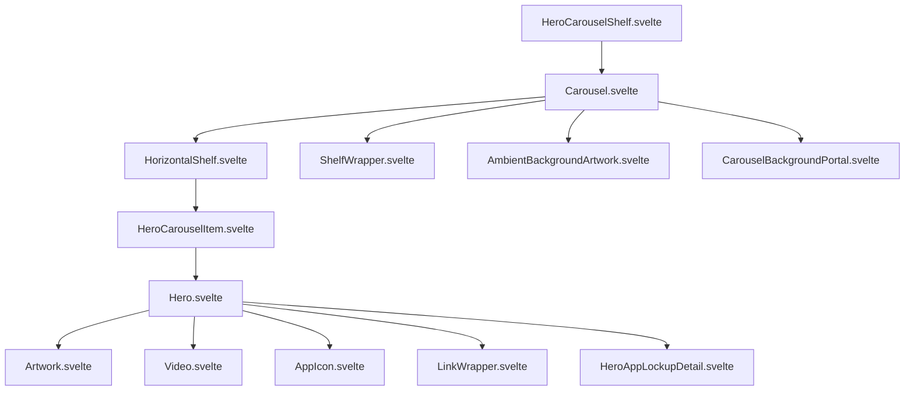
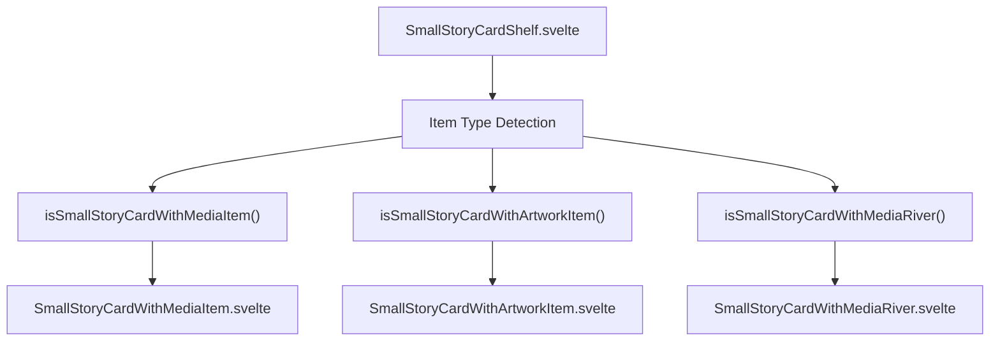

# Editorial and Promotional Shelves

-   [src/components/hero/Carousel.svelte](https://github.com/Chesszyh/apps.apple.com/blob/279d0c4d/src/components/hero/Carousel.svelte)
-   [src/components/hero/Hero.svelte](https://github.com/Chesszyh/apps.apple.com/blob/279d0c4d/src/components/hero/Hero.svelte)
-   [src/components/jet/item/BrickItem.svelte](https://github.com/Chesszyh/apps.apple.com/blob/279d0c4d/src/components/jet/item/BrickItem.svelte)
-   [src/components/jet/item/EditorialCardItem.svelte](https://github.com/Chesszyh/apps.apple.com/blob/279d0c4d/src/components/jet/item/EditorialCardItem.svelte)
-   [src/components/jet/item/HeroCarouselItem.svelte](https://github.com/Chesszyh/apps.apple.com/blob/279d0c4d/src/components/jet/item/HeroCarouselItem.svelte)
-   [src/components/jet/item/LargeStoryCardItem.svelte](https://github.com/Chesszyh/apps.apple.com/blob/279d0c4d/src/components/jet/item/LargeStoryCardItem.svelte)
-   [src/components/jet/item/SmallStoryCardWithArtworkItem.svelte](https://github.com/Chesszyh/apps.apple.com/blob/279d0c4d/src/components/jet/item/SmallStoryCardWithArtworkItem.svelte)
-   [src/components/jet/item/SmallStoryCardWithMediaItem.svelte](https://github.com/Chesszyh/apps.apple.com/blob/279d0c4d/src/components/jet/item/SmallStoryCardWithMediaItem.svelte)
-   [src/components/jet/item/SmallStoryCardWithMediaRiver.svelte](https://github.com/Chesszyh/apps.apple.com/blob/279d0c4d/src/components/jet/item/SmallStoryCardWithMediaRiver.svelte)
-   [src/components/jet/shelf/Shelf.svelte](https://github.com/Chesszyh/apps.apple.com/blob/279d0c4d/src/components/jet/shelf/Shelf.svelte)
-   [src/components/jet/today-card/TodayCard.svelte](https://github.com/Chesszyh/apps.apple.com/blob/279d0c4d/src/components/jet/today-card/TodayCard.svelte)
-   [src/components/jet/today-card/TodayCardOverlay.svelte](https://github.com/Chesszyh/apps.apple.com/blob/279d0c4d/src/components/jet/today-card/TodayCardOverlay.svelte)
-   [src/components/jet/today-card/overlay/TodayCardLockupListOverlay.svelte](https://github.com/Chesszyh/apps.apple.com/blob/279d0c4d/src/components/jet/today-card/overlay/TodayCardLockupListOverlay.svelte)

## Purpose and Scope

This document catalogs the editorial and promotional shelf types used throughout the App Store web application. These shelves are designed for curated, visually-rich content presentations including hero carousels, story cards, today cards, and brick items. Editorial shelves prioritize visual storytelling and promotional content over utilitarian displays.

For lockup-based and grid shelf types, see [Lockup and Grid Shelves](#7.2). For informational and compliance shelves, see [Informational and Compliance Shelves](#7.3). For the general shelf rendering architecture, see [Shelf System](#4.2).

---

## Overview

Editorial and promotional shelves are characterized by:

-   **Rich Media**: Prominent use of large images, videos, and artwork
-   **Storytelling Focus**: Designed to convey narratives and highlight curated content
-   **Visual Hierarchy**: Strong typography and layout emphasis over dense information displays
-   **Promotional Intent**: Used for featuring apps, events, collections, and editorial content

The shelf dispatcher at [src/components/jet/shelf/Shelf.svelte1-321](https://github.com/Chesszyh/apps.apple.com/blob/279d0c4d/src/components/jet/shelf/Shelf.svelte#L1-L321) routes generic `Shelf` models to specialized components using type guard functions. Editorial shelves are rendered by components that compose the `Hero`, `TodayCard`, `BrickItem`, and related presentation components.

Sources: [src/components/jet/shelf/Shelf.svelte1-321](https://github.com/Chesszyh/apps.apple.com/blob/279d0c4d/src/components/jet/shelf/Shelf.svelte#L1-L321)

---

## Shelf Type Dispatcher Architecture

```mermaid
flowchart TD
    GenericShelf["Shelf (Generic Model)"]
    Dispatcher["Shelf.svelte Dispatcher"]
    TodayGuard["isTodayCardShelf()"]
    EditorialGuard["isEditorialCardShelf()"]
    HeroGuard["isHeroCarouselShelf()"]
    BrickGuard["isBrickShelf()"]
    StoryGuard["isSmallStoryCardShelf()"]
    LargeStoryGuard["isLargeStoryCardShelf()"]
    AppPromotionGuard["isAppPromotionShelf()"]
    AppShowcaseGuard["isAppShowcaseShelf()"]
    BreakoutGuard["isSmallBreakoutShelf()"]
    FramedArtGuard["isFramedArtworkShelf()"]
    TodayShelf["TodayCardShelf.svelte"]
    EditorialShelf["EditorialCardShelf.svelte"]
    HeroShelf["HeroCarouselShelf.svelte"]
    BrickShelf["BrickShelf.svelte"]
    StoryShelf["SmallStoryCardShelf.svelte"]
    LargeStoryShelf["LargeStoryCardShelf.svelte"]
    AppPromotionShelf["AppPromotionShelf.svelte"]
    AppShowcaseShelf["AppShowcaseShelf.svelte"]
    BreakoutShelf["SmallBreakoutShelf.svelte"]
    FramedArtShelf["FramedArtworkShelf.svelte"]

    GenericShelf --> Dispatcher
    Dispatcher --> TodayGuard
    Dispatcher --> EditorialGuard
    Dispatcher --> HeroGuard
    Dispatcher --> BrickGuard
    Dispatcher --> StoryGuard
    Dispatcher --> LargeStoryGuard
    Dispatcher --> AppPromotionGuard
    Dispatcher --> AppShowcaseGuard
    Dispatcher --> BreakoutGuard
    Dispatcher --> FramedArtGuard
    TodayGuard --> TodayShelf
    EditorialGuard --> EditorialShelf
    HeroGuard --> HeroShelf
    BrickGuard --> BrickShelf
    StoryGuard --> StoryShelf
    LargeStoryGuard --> LargeStoryShelf
    AppPromotionGuard --> AppPromotionShelf
    AppShowcaseGuard --> AppShowcaseShelf
    BreakoutGuard --> BreakoutShelf
    FramedArtGuard --> FramedArtShelf
```


Sources: [src/components/jet/shelf/Shelf.svelte1-321](https://github.com/Chesszyh/apps.apple.com/blob/279d0c4d/src/components/jet/shelf/Shelf.svelte#L1-L321)

---

## Editorial Shelf Type Catalog

| Shelf Type | Type Guard Function | Component | Primary Use Case |
| --- | --- | --- | --- |
| `TodayCardShelf` | `isTodayCardShelf` | `TodayCardShelf.svelte` | Featured app stories and collections on Today tab |
| `EditorialCardShelf` | `isEditorialCardShelf` | `EditorialCardShelf.svelte` | Large editorial features with app lockups |
| `HeroCarouselShelf` | `isHeroCarouselShelf` | `HeroCarouselShelf.svelte` | Multi-item carousel with ambient backgrounds |
| `LargeStoryCardShelf` | `isLargeStoryCardShelf` | `LargeStoryCardShelf.svelte` | Full-width story cards with media |
| `MediumStoryCardShelf` | `isMediumStoryCardShelf` | `MediumStoryCardShelf.svelte` | Medium-sized story cards |
| `SmallStoryCardShelf` | `isSmallStoryCardShelf` | `SmallStoryCardShelf.svelte` | Compact story cards in grids |
| `BrickShelf` | `isBrickShelf` | `BrickShelf.svelte` | 16:9 promotional cards with overlaid text |
| `SmallBrickShelf` | `isSmallBrickShelf` | `SmallBrickShelf.svelte` | Smaller brick items for compact layouts |
| `LargeBrickShelf` | `isLargeBrickShelf` | `LargeBrickShelf.svelte` | Larger brick items for prominent placement |
| `CategoryBrickShelf` | `isCategoryBrickShelf` | `CategoryBrickShelf.svelte` | Category navigation with brick styling |
| `AppPromotionShelf` | `isAppPromotionShelf` | `AppPromotionShelf.svelte` | App promotional content |
| `AppShowcaseShelf` | `isAppShowcaseShelf` | `AppShowcaseShelf.svelte` | Showcase collections of apps |
| `AppTrailerLockupShelf` | `isAppTrailerLockupShelf` | `AppTrailerLockupShelf.svelte` | App trailers with lockup details |
| `SmallBreakoutShelf` | `isSmallBreakoutShelf` | `SmallBreakoutShelf.svelte` | Small promotional breakout items |
| `LargeHeroBreakoutShelf` | `isLargeHeroBreakoutShelf` | `LargeHeroBreakoutShelf.svelte` | Large hero-style breakout items |
| `FramedArtworkShelf` | `isFramedArtworkShelf` | `FramedArtworkShelf.svelte` | Artwork with decorative framing |
| `FramedVideoShelf` | `isFramedVideoShelf` | `FramedVideoShelf.svelte` | Video content with decorative framing |

Sources: [src/components/jet/shelf/Shelf.svelte1-321](https://github.com/Chesszyh/apps.apple.com/blob/279d0c4d/src/components/jet/shelf/Shelf.svelte#L1-L321)

---

## Hero Carousel Shelves

### HeroCarouselShelf

**Purpose**: Displays a horizontally scrollable carousel of large hero items, each featuring full-bleed imagery or video with overlaid text and optional app lockup details. Supports ambient background effects on larger viewports.

**Type Guard**: `isHeroCarouselShelf(shelf)` at [src/components/jet/shelf/Shelf.svelte54-56](https://github.com/Chesszyh/apps.apple.com/blob/279d0c4d/src/components/jet/shelf/Shelf.svelte#L54-L56)

**Rendering Component**: `HeroCarouselShelf.svelte`

**Key Characteristics**:

-   Uses `Carousel.svelte` component for orchestration
-   Each carousel item rendered via `HeroCarouselItem.svelte`
-   Renders `Hero.svelte` component for each item
-   Supports ambient background artwork portal on non-mobile viewports
-   Implements intersection observer for active item detection
-   Aspect ratio adapts: 3:4 on mobile, 16:9 on larger screens

**Component Hierarchy**:


**Data Model Fields** (from `HeroCarouselItem` interface):

-   `artwork`: Main visual artwork for the hero
-   `video`: Optional video content (with `portraitVideo` variant)
-   `backgroundColor`: Accent color for gradient overlay
-   `isMediaDark`: Determines text color scheme
-   `collectionIcons`: Array of app icons for collection displays
-   `overlay`: Object containing:
    -   `titleText`: Main headline
    -   `badgeText`: Eyebrow text
    -   `descriptionText`: Subtitle
    -   `callToActionText`: Button text
    -   `lockup`: App lockup details
    -   `clickAction`: Navigation action

Sources: [src/components/hero/Carousel.svelte1-133](https://github.com/Chesszyh/apps.apple.com/blob/279d0c4d/src/components/hero/Carousel.svelte#L1-L133) [src/components/jet/item/HeroCarouselItem.svelte1-61](https://github.com/Chesszyh/apps.apple.com/blob/279d0c4d/src/components/jet/item/HeroCarouselItem.svelte#L1-L61) [src/components/hero/Hero.svelte1-537](https://github.com/Chesszyh/apps.apple.com/blob/279d0c4d/src/components/hero/Hero.svelte#L1-L537)

---

## Hero Component Architecture

The `Hero` component at [src/components/hero/Hero.svelte1-537](https://github.com/Chesszyh/apps.apple.com/blob/279d0c4d/src/components/hero/Hero.svelte#L1-L537) provides the foundational display logic for hero-style items across multiple shelf types. It decouples presentation from specific data models.

### Hero Component Inputs

| Prop | Type | Purpose |
| --- | --- | --- |
| `title` | `string` | Main headline text |
| `eyebrow` | `string` | Text above title (or use eyebrow slot) |
| `subtitle` | `string` | Text below title |
| `backgroundColor` | `Color` | Accent color for gradients |
| `artwork` | `Artwork` | Static image |
| `video` | `Video` | Video content (takes precedence over artwork) |
| `action` | `Action` | Click action |
| `pinArtworkToHorizontalEnd` | `boolean` | Align artwork to end edge |
| `pinArtworkToVerticalMiddle` | `boolean` | Center artwork vertically |
| `pinTextToVerticalStart` | `boolean` | Pin text to top |
| `profileOverride` | `NamedProfile` | Force specific artwork profile |
| `isMediaDark` | `boolean` | Controls text color scheme |
| `collectionIcons` | `Artwork[]` | App icons for collection displays |

### Hero Visual Features

**Gradient Overlay**: [src/components/hero/Hero.svelte366-414](https://github.com/Chesszyh/apps.apple.com/blob/279d0c4d/src/components/hero/Hero.svelte#L366-L414)

-   Dynamic gradient mask based on artwork placement
-   Uses `--color` CSS variable from `backgroundColor`
-   Different gradient masks for text-at-bottom vs text-at-top layouts
-   RTL-aware gradient direction

**Collection Icons Display**: [src/components/hero/Hero.svelte161-178](https://github.com/Chesszyh/apps.apple.com/blob/279d0c4d/src/components/hero/Hero.svelte#L161-L178)

-   Grid layout for up to 5 app icons
-   Animated gradient background using icon colors
-   Background gradient uses luminance sorting via `getBackgroundGradientCSSVarsFromArtworks`

**Responsive Profiles**: [src/components/hero/Hero.svelte99-111](https://github.com/Chesszyh/apps.apple.com/blob/279d0c4d/src/components/hero/Hero.svelte#L99-L111)

-   `large-hero-portrait`: Mobile portrait layout
-   `large-hero`: Default landscape
-   `large-hero-east` / `large-hero-west`: Directional layouts for pinned artwork
-   Profile automatically determined from props and viewport

Sources: [src/components/hero/Hero.svelte1-537](https://github.com/Chesszyh/apps.apple.com/blob/279d0c4d/src/components/hero/Hero.svelte#L1-L537)

---

## Today Card Shelves

### TodayCardShelf

**Purpose**: Displays curated "Today" cards that showcase app stories, collections, and editorial features. These cards support rich media (images, videos, app event items, and app icon rivers), overlays with app lockups, and multiple style variants.

**Type Guard**: `isTodayCardShelf(shelf)` at [src/components/jet/shelf/Shelf.svelte166-168](https://github.com/Chesszyh/apps.apple.com/blob/279d0c4d/src/components/jet/shelf/Shelf.svelte#L166-L168)

**Rendering Component**: `TodayCardShelf.svelte`

**Core Component**: `TodayCard.svelte` at [src/components/jet/today-card/TodayCard.svelte1-402](https://github.com/Chesszyh/apps.apple.com/blob/279d0c4d/src/components/jet/today-card/TodayCard.svelte#L1-L402)

### TodayCard Data Model

### TodayCard Variants

**Style Variants** (controlled by `style` field):

| Style | Text Color | Background Behavior | Use Case |
| --- | --- | --- | --- |
| `light` | White | Dark tint overlay | Light media with dark overlay |
| `dark` | White | Dark tint overlay | Dark media |
| `white` | Dark | Light tint overlay | Editorial cards on light backgrounds |

Sources: [src/components/jet/today-card/TodayCard.svelte198-211](https://github.com/Chesszyh/apps.apple.com/blob/279d0c4d/src/components/jet/today-card/TodayCard.svelte#L198-L211)

**Media Types**:

1.  **Artwork Media**: Static imagery at [src/components/jet/today-card/TodayCard.svelte82-84](https://github.com/Chesszyh/apps.apple.com/blob/279d0c4d/src/components/jet/today-card/TodayCard.svelte#L82-L84)
2.  **App Event Media**: Event-specific content with gradient protection
3.  **List Media**: Multiple app lockups in list format
4.  **River Media**: Flowing app icon display with gradient background

**Protection Layers** at [src/components/jet/today-card/TodayCard.svelte56-65](https://github.com/Chesszyh/apps.apple.com/blob/279d0c4d/src/components/jet/today-card/TodayCard.svelte#L56-L65):

-   `useProtectionLayer`: Enables blur/tint for text legibility
-   `useBlurryProtectionLayer`: Backdrop blur with mask gradient for standard cards
-   `useGradientProtectionLayer`: Bottom-to-top gradient for app event cards

### TodayCard Overlay System

Overlays render at the bottom of cards and support two types:

**Lockup Overlay** (`TodayCardLockupOverlay`):

-   Renders single `SmallLockupItem` component
-   Used for featuring a single app
-   Type guard: `isLockupOverlay(overlay)` at [src/components/jet/today-card/TodayCardOverlay.svelte7-11](https://github.com/Chesszyh/apps.apple.com/blob/279d0c4d/src/components/jet/today-card/TodayCardOverlay.svelte#L7-L11)

**Lockup List Overlay** (`TodayCardLockupListOverlay`):

-   Renders horizontal list of app icons
-   Used for app collections
-   Component: [src/components/jet/today-card/overlay/TodayCardLockupListOverlay.svelte1-43](https://github.com/Chesszyh/apps.apple.com/blob/279d0c4d/src/components/jet/today-card/overlay/TodayCardLockupListOverlay.svelte#L1-L43)
-   Type guard: `isLockupListOverlay(overlay)` at [src/components/jet/today-card/overlay/TodayCardLockupListOverlay.svelte7-11](https://github.com/Chesszyh/apps.apple.com/blob/279d0c4d/src/components/jet/today-card/overlay/TodayCardLockupListOverlay.svelte#L7-L11)

Sources: [src/components/jet/today-card/TodayCard.svelte1-402](https://github.com/Chesszyh/apps.apple.com/blob/279d0c4d/src/components/jet/today-card/TodayCard.svelte#L1-L402) [src/components/jet/today-card/TodayCardOverlay.svelte1-49](https://github.com/Chesszyh/apps.apple.com/blob/279d0c4d/src/components/jet/today-card/TodayCardOverlay.svelte#L1-L49) [src/components/jet/today-card/overlay/TodayCardLockupListOverlay.svelte1-43](https://github.com/Chesszyh/apps.apple.com/blob/279d0c4d/src/components/jet/today-card/overlay/TodayCardLockupListOverlay.svelte#L1-L43)

---

## Story Card Shelves

Story cards are compact, editorial-focused items designed for grid and horizontal shelf layouts. They come in three size variants.

### SmallStoryCardShelf

**Purpose**: Displays small story cards in grid or horizontal shelf layouts. Supports three item variants: media items, artwork items, and media river items.

**Type Guard**: `isSmallStoryCardShelf(shelf)` at [src/components/jet/shelf/Shelf.svelte136-138](https://github.com/Chesszyh/apps.apple.com/blob/279d0c4d/src/components/jet/shelf/Shelf.svelte#L136-L138)

**Item Rendering Flow**:


#### SmallStoryCardWithMediaItem

**Component**: [src/components/jet/item/SmallStoryCardWithMediaItem.svelte1-105](https://github.com/Chesszyh/apps.apple.com/blob/279d0c4d/src/components/jet/item/SmallStoryCardWithMediaItem.svelte#L1-L105)

**Visual Characteristics**:

-   16:9 aspect ratio artwork container
-   Metadata below artwork (eyebrow, title, description)
-   Supports both `heroMedia` and fallback `media.artworks[0]`
-   Profiles: `small-story-card` (preferred) or `small-story-card-legacy`

**Type Guard**: `isSmallStoryCardWithMediaItem(item)` checks for presence of `item.media` at [src/components/jet/item/SmallStoryCardWithMediaItem.svelte15-19](https://github.com/Chesszyh/apps.apple.com/blob/279d0c4d/src/components/jet/item/SmallStoryCardWithMediaItem.svelte#L15-L19)

Sources: [src/components/jet/item/SmallStoryCardWithMediaItem.svelte1-105](https://github.com/Chesszyh/apps.apple.com/blob/279d0c4d/src/components/jet/item/SmallStoryCardWithMediaItem.svelte#L1-L105)

#### SmallStoryCardWithArtworkItem

**Component**: [src/components/jet/item/SmallStoryCardWithArtworkItem.svelte1-88](https://github.com/Chesszyh/apps.apple.com/blob/279d0c4d/src/components/jet/item/SmallStoryCardWithArtworkItem.svelte#L1-L88)

**Visual Characteristics**:

-   3:4 portrait aspect ratio
-   Gradient overlay for text legibility
-   Text overlaid at bottom of artwork
-   Profile: `small-story-card-portrait`

**Type Guard**: `isSmallStoryCardWithArtworkItem(item)` checks for `artwork` without `media` at [src/components/jet/item/SmallStoryCardWithArtworkItem.svelte12-16](https://github.com/Chesszyh/apps.apple.com/blob/279d0c4d/src/components/jet/item/SmallStoryCardWithArtworkItem.svelte#L12-L16)

**Gradient Implementation**: Uses `GradientOverlay` component with color derived from `artwork.backgroundColor` at [src/components/jet/item/SmallStoryCardWithArtworkItem.svelte31-33](https://github.com/Chesszyh/apps.apple.com/blob/279d0c4d/src/components/jet/item/SmallStoryCardWithArtworkItem.svelte#L31-L33)

Sources: [src/components/jet/item/SmallStoryCardWithArtworkItem.svelte1-88](https://github.com/Chesszyh/apps.apple.com/blob/279d0c4d/src/components/jet/item/SmallStoryCardWithArtworkItem.svelte#L1-L88)

#### SmallStoryCardWithMediaRiver

**Component**: [src/components/jet/item/SmallStoryCardWithMediaRiver.svelte1-119](https://github.com/Chesszyh/apps.apple.com/blob/279d0c4d/src/components/jet/item/SmallStoryCardWithMediaRiver.svelte#L1-L119)

**Visual Characteristics**:

-   16:9 aspect ratio container
-   Displays flowing `AppIconRiver` component
-   Multi-color gradient background derived from icon colors
-   Metadata below river

**Type Guard**: `isSmallStoryCardWithMediaRiver(item)` checks for `media.kind === 'river'` at [src/components/jet/item/SmallStoryCardWithMediaRiver.svelte11-15](https://github.com/Chesszyh/apps.apple.com/blob/279d0c4d/src/components/jet/item/SmallStoryCardWithMediaRiver.svelte#L11-L15)

**Gradient Generation**: Uses `getBackgroundGradientCSSVarsFromArtworks` with luminance-based sorting at [src/components/jet/item/SmallStoryCardWithMediaRiver.svelte31-37](https://github.com/Chesszyh/apps.apple.com/blob/279d0c4d/src/components/jet/item/SmallStoryCardWithMediaRiver.svelte#L31-L37)

**Background Gradient CSS**: Four-quadrant radial gradients at [src/components/jet/item/SmallStoryCardWithMediaRiver.svelte71-99](https://github.com/Chesszyh/apps.apple.com/blob/279d0c4d/src/components/jet/item/SmallStoryCardWithMediaRiver.svelte#L71-L99)

Sources: [src/components/jet/item/SmallStoryCardWithMediaRiver.svelte1-119](https://github.com/Chesszyh/apps.apple.com/blob/279d0c4d/src/components/jet/item/SmallStoryCardWithMediaRiver.svelte#L1-L119)

### MediumStoryCardShelf

**Purpose**: Medium-sized story cards for balanced grid layouts.

**Type Guard**: `isMediumStoryCardShelf(shelf)` at [src/components/jet/shelf/Shelf.svelte91-93](https://github.com/Chesszyh/apps.apple.com/blob/279d0c4d/src/components/jet/shelf/Shelf.svelte#L91-L93)

**Rendering Component**: `MediumStoryCardShelf.svelte`

### LargeStoryCardShelf

**Purpose**: Large, full-width story cards that use the `Hero` component for presentation.

**Type Guard**: `isLargeStoryCardShelf(shelf)` at [src/components/jet/shelf/Shelf.svelte75-77](https://github.com/Chesszyh/apps.apple.com/blob/279d0c4d/src/components/jet/shelf/Shelf.svelte#L75-L77)

**Rendering Component**: `LargeStoryCardShelf.svelte`

**Item Component**: `LargeStoryCardItem.svelte` at [src/components/jet/item/LargeStoryCardItem.svelte1-39](https://github.com/Chesszyh/apps.apple.com/blob/279d0c4d/src/components/jet/item/LargeStoryCardItem.svelte#L1-L39)

**Key Features**:

-   Uses `Hero` component for rendering
-   Supports video on non-mobile viewports
-   Artwork pinned to horizontal end and vertical middle
-   RTL-aware text positioning
-   Profiles: `large-hero-story-card` (LTR), `large-hero-story-card-rtl` (RTL), `large-hero-story-card-portrait` (mobile)

Sources: [src/components/jet/item/LargeStoryCardItem.svelte1-39](https://github.com/Chesszyh/apps.apple.com/blob/279d0c4d/src/components/jet/item/LargeStoryCardItem.svelte#L1-L39)

---

## Editorial Card Shelves

### EditorialCardShelf

**Purpose**: Large editorial features that combine hero imagery with app lockup details. Used for in-depth app stories and editorial features.

**Type Guard**: `isEditorialCardShelf(shelf)` at [src/components/jet/shelf/Shelf.svelte42-44](https://github.com/Chesszyh/apps.apple.com/blob/279d0c4d/src/components/jet/shelf/Shelf.svelte#L42-L44)

**Rendering Component**: `EditorialCardShelf.svelte`

**Item Component**: `EditorialCardItem.svelte` at [src/components/jet/item/EditorialCardItem.svelte1-42](https://github.com/Chesszyh/apps.apple.com/blob/279d0c4d/src/components/jet/item/EditorialCardItem.svelte#L1-L42)

### EditorialCardItem Architecture

**Key Characteristics**:

-   Uses `Hero` component with artwork pinned to horizontal end
-   Eyebrow slot: Either `AppEventDate` (for events) or caption text
-   Details slot: `AppLockupDetail` component when lockup is present
-   Respects `mediaOverlayStyle` for text color scheme (`dark` or `light`)
-   Portrait layout uses `large-hero-portrait-iphone` profile

Sources: [src/components/jet/item/EditorialCardItem.svelte1-42](https://github.com/Chesszyh/apps.apple.com/blob/279d0c4d/src/components/jet/item/EditorialCardItem.svelte#L1-L42)

---

## Brick Shelves

Brick items are 16:9 promotional cards with overlaid text and gradient backgrounds. They support both static artwork and collection icon displays.

### BrickShelf Variants

| Shelf Type | Type Guard | Size Variant |
| --- | --- | --- |
| `SmallBrickShelf` | `isSmallBrickShelf` | Compact brick items |
| `BrickShelf` | `isBrickShelf` | Standard brick items |
| `LargeBrickShelf` | `isLargeBrickShelf` | Large brick items |
| `CategoryBrickShelf` | `isCategoryBrickShelf` | Category navigation bricks |

### BrickItem Component

**Component**: [src/components/jet/item/BrickItem.svelte1-301](https://github.com/Chesszyh/apps.apple.com/blob/279d0c4d/src/components/jet/item/BrickItem.svelte#L1-L301)

**Visual Structure**:

1.  **Background Layer**: Artwork or animated gradient from collection icons
2.  **Gradient Overlay**: Semi-transparent gradient for text legibility (if title present)
3.  **Text Container**: Caption, title, subtitle positioned at bottom
4.  **Collection Icons Grid** (if no artwork): Grid of up to 8 app icons
5.  **Editorial Description** (optional): Can be overlaid or below the brick

### BrickItem Data Model Fields

-   `artworks`: Array of artwork (primary at index 0, RTL variant at index 1)
-   `rtlArtwork`: Explicit RTL artwork variant
-   `collectionIcons`: Array of app icons (used if no artwork)
-   `caption`: Eyebrow text
-   `title`: Main headline
-   `subtitle`: Supporting text
-   `shortEditorialDescription`: Additional description text
-   `clickAction`: Navigation action
-   `accessibilityLabel`: Screen reader label

### Collection Icon Background

When displaying collection icons without artwork, `BrickItem` generates an animated multi-color gradient:

**Color Extraction**: [src/components/jet/item/BrickItem.svelte31-42](https://github.com/Chesszyh/apps.apple.com/blob/279d0c4d/src/components/jet/item/BrickItem.svelte#L31-L42)

-   Uses `getBackgroundGradientCSSVarsFromArtworks` utility
-   Sorts colors from darkest to lightest via `getLuminanceForRGB`
-   Removes grey tones via `shouldRemoveGreys: true`

**Gradient Animation**: [src/components/jet/item/BrickItem.svelte201-256](https://github.com/Chesszyh/apps.apple.com/blob/279d0c4d/src/components/jet/item/BrickItem.svelte#L201-L256)

-   Four-quadrant radial gradients using CSS custom properties
-   Animates gradient stop positions and background size
-   8-second infinite alternate animation
-   Paused by default, activated on hover

**Gradient CSS Variables**:

-   `--top-left`: Top-left quadrant color
-   `--bottom-left`: Bottom-left quadrant color
-   `--top-right`: Top-right quadrant color
-   `--bottom-right`: Bottom-right quadrant color
-   Stop position variables: `--top-left-stop`, `--bottom-left-stop`, etc.

Sources: [src/components/jet/item/BrickItem.svelte1-301](https://github.com/Chesszyh/apps.apple.com/blob/279d0c4d/src/components/jet/item/BrickItem.svelte#L1-L301)

---

## Breakout Shelves

Breakout shelves display promotional items that "break out" of standard grid layouts with unique visual styling.

### SmallBreakoutShelf

**Purpose**: Small breakout promotional items.

**Type Guard**: `isSmallBreakoutShelf(shelf)` at [src/components/jet/shelf/Shelf.svelte127-129](https://github.com/Chesszyh/apps.apple.com/blob/279d0c4d/src/components/jet/shelf/Shelf.svelte#L127-L129)

**Rendering Component**: `SmallBreakoutShelf.svelte`

### LargeHeroBreakoutShelf

**Purpose**: Large hero-style breakout items with prominent visual treatment.

**Type Guard**: `isLargeHeroBreakoutShelf(shelf)` at [src/components/jet/shelf/Shelf.svelte63-65](https://github.com/Chesszyh/apps.apple.com/blob/279d0c4d/src/components/jet/shelf/Shelf.svelte#L63-L65)

**Rendering Component**: `LargeHeroBreakoutShelf.svelte`

Sources: [src/components/jet/shelf/Shelf.svelte63-65](https://github.com/Chesszyh/apps.apple.com/blob/279d0c4d/src/components/jet/shelf/Shelf.svelte#L63-L65) [src/components/jet/shelf/Shelf.svelte127-129](https://github.com/Chesszyh/apps.apple.com/blob/279d0c4d/src/components/jet/shelf/Shelf.svelte#L127-L129)

---

## Other Promotional Shelves

### AppPromotionShelf

**Purpose**: Dedicated shelf for app promotional content and marketing campaigns.

**Type Guard**: `isAppPromotionShelf(shelf)` at [src/components/jet/shelf/Shelf.svelte23-25](https://github.com/Chesszyh/apps.apple.com/blob/279d0c4d/src/components/jet/shelf/Shelf.svelte#L23-L25)

**Rendering Component**: `AppPromotionShelf.svelte`

### AppShowcaseShelf

**Purpose**: Showcase collections of featured apps.

**Type Guard**: `isAppShowcaseShelf(shelf)` at [src/components/jet/shelf/Shelf.svelte26-28](https://github.com/Chesszyh/apps.apple.com/blob/279d0c4d/src/components/jet/shelf/Shelf.svelte#L26-L28)

**Rendering Component**: `AppShowcaseShelf.svelte`

### AppTrailerLockupShelf

**Purpose**: Display app trailers with accompanying lockup information.

**Type Guard**: `isAppTrailerLockupShelf(shelf)` at [src/components/jet/shelf/Shelf.svelte29-31](https://github.com/Chesszyh/apps.apple.com/blob/279d0c4d/src/components/jet/shelf/Shelf.svelte#L29-L31)

**Rendering Component**: `AppTrailerLockupShelf.svelte`

### FramedArtworkShelf

**Purpose**: Display artwork with decorative framing effects.

**Type Guard**: `isFramedArtworkShelf(shelf)` at [src/components/jet/shelf/Shelf.svelte48-50](https://github.com/Chesszyh/apps.apple.com/blob/279d0c4d/src/components/jet/shelf/Shelf.svelte#L48-L50)

**Rendering Component**: `FramedArtworkShelf.svelte`

### FramedVideoShelf

**Purpose**: Display video content with decorative framing effects.

**Type Guard**: `isFramedVideoShelf(shelf)` at [src/components/jet/shelf/Shelf.svelte51-53](https://github.com/Chesszyh/apps.apple.com/blob/279d0c4d/src/components/jet/shelf/Shelf.svelte#L51-L53)

**Rendering Component**: `FramedVideoShelf.svelte`

Sources: [src/components/jet/shelf/Shelf.svelte1-321](https://github.com/Chesszyh/apps.apple.com/blob/279d0c4d/src/components/jet/shelf/Shelf.svelte#L1-L321)

---

## Shared Utilities and Patterns

### Gradient Overlay Utilities

Multiple editorial components use gradient overlays for text legibility. The color is typically derived from artwork background colors.

**Color Conversion**: `colorAsString(color)` utility converts `Color` models to CSS strings

**Multi-Icon Gradients**: `getBackgroundGradientCSSVarsFromArtworks()` utility:

-   Accepts array of artworks and configuration options
-   Extracts background colors from artwork
-   Optionally sorts by luminance
-   Optionally removes grey tones
-   Returns CSS custom property string for gradient rendering

### Responsive Artwork Profiles

Editorial shelves use viewport-aware artwork profiles:

**Hero Profiles**:

-   `large-hero`: Default landscape
-   `large-hero-portrait`: Mobile portrait
-   `large-hero-east` / `large-hero-west`: Directional layouts
-   `large-hero-story-card`: Story card landscape
-   `large-hero-story-card-rtl`: RTL story card
-   `large-hero-story-card-portrait`: Story card mobile

**Story Card Profiles**:

-   `small-story-card`: 16:9 landscape
-   `small-story-card-legacy`: Legacy 16:9 variant
-   `small-story-card-portrait`: 3:4 portrait

**Brick Profiles**:

-   `brick`: Standard 16:9
-   `small-brick`: Compact variant

For comprehensive artwork profile documentation, see [Artwork and Media System](#5.1).

---

## Type Guard Pattern

All editorial shelf types follow a consistent type guard pattern for type narrowing:

```
// Example from Shelf.svelteimport TodayCardShelf, {    isTodayCardShelf,} from '~/components/jet/shelf/TodayCardShelf.svelte';// In template{#if isTodayCardShelf(shelf)}    <TodayCardShelf {shelf} />{/if}
```
Type guards are exported alongside their components and perform runtime checks to narrow the generic `Shelf` type to specific shelf interfaces.

For more on the type guard pattern and shelf dispatching architecture, see [Shelf System](#4.2).

Sources: [src/components/jet/shelf/Shelf.svelte1-321](https://github.com/Chesszyh/apps.apple.com/blob/279d0c4d/src/components/jet/shelf/Shelf.svelte#L1-L321)
