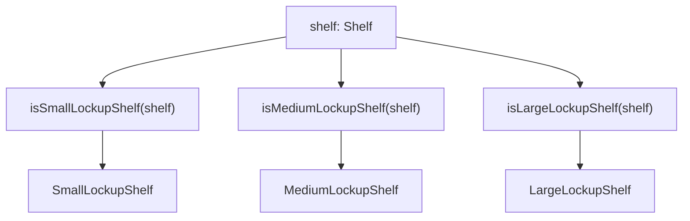
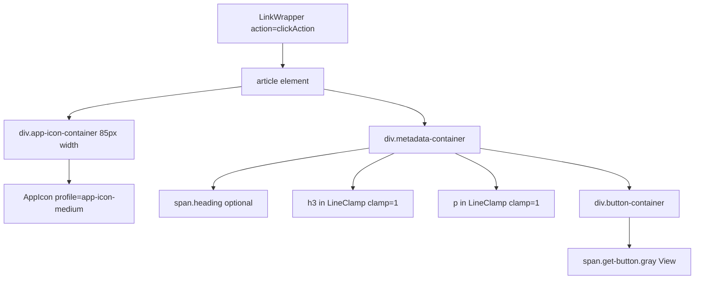
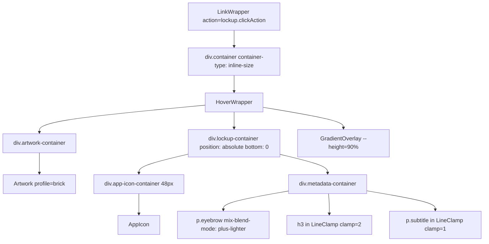
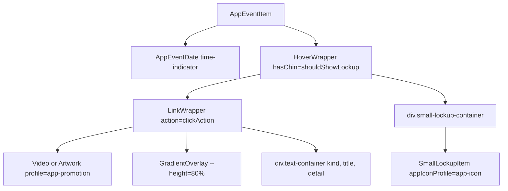
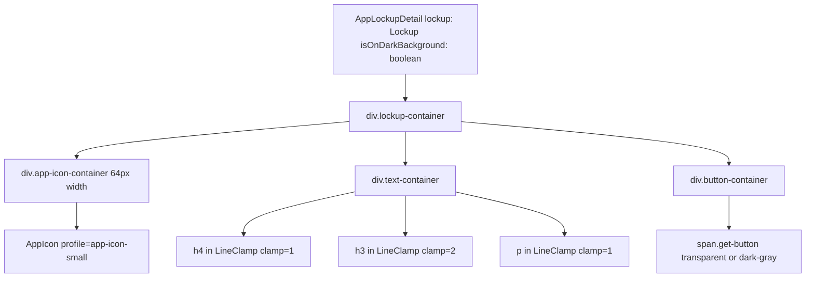

# Lockup and Grid Shelves

-   [src/components/hero/AppLockupDetail.svelte](https://github.com/Chesszyh/apps.apple.com/blob/279d0c4d/src/components/hero/AppLockupDetail.svelte)
-   [src/components/jet/item/AppEventItem.svelte](https://github.com/Chesszyh/apps.apple.com/blob/279d0c4d/src/components/jet/item/AppEventItem.svelte)
-   [src/components/jet/item/MediumImageLockupItem.svelte](https://github.com/Chesszyh/apps.apple.com/blob/279d0c4d/src/components/jet/item/MediumImageLockupItem.svelte)
-   [src/components/jet/item/MediumLockupItem.svelte](https://github.com/Chesszyh/apps.apple.com/blob/279d0c4d/src/components/jet/item/MediumLockupItem.svelte)
-   [src/components/jet/shelf/AppEventDetailShelf.svelte](https://github.com/Chesszyh/apps.apple.com/blob/279d0c4d/src/components/jet/shelf/AppEventDetailShelf.svelte)
-   [src/components/jet/shelf/Shelf.svelte](https://github.com/Chesszyh/apps.apple.com/blob/279d0c4d/src/components/jet/shelf/Shelf.svelte)

This document covers the lockup and grid shelf families, which are the primary shelf types for displaying app and content listings throughout the App Store. These shelves render horizontal scrollable collections of apps, games, and other content in various sizes and layout configurations.

**Scope**: This page documents lockup shelves (Small, Medium, Large variants), brick shelves (grid layouts), image lockup shelves (artwork-backed lockups), and specialized lockup types. For editorial and promotional content, see [Editorial and Promotional Shelves](#7.1). For horizontal scrolling mechanics, see [Scrollable Shelves](#5.2).

---

## Overview

Lockup and grid shelves form the backbone of content presentation in the App Store. They follow a consistent pattern:

1.  **Shelf Component** - Wraps items in `ShelfWrapper` and uses the generic `Shelf` scrolling component
2.  **Type Guard** - Narrows the generic `Shelf` type to a specific shelf interface
3.  **Item Component** - Renders individual items within the shelf
4.  **Data Model** - Defines the structure of shelf and item data

```mermaid
flowchart TD
    GenericShelf["Shelf.svelte Generic Dispatcher"]
    SmallLS["SmallLockupShelf"]
    MediumLS["MediumLockupShelf"]
    LargeLS["LargeLockupShelf"]
    SmallLI["SmallLockupItem"]
    MediumLI["MediumLockupItem"]
    LargeLI["LargeLockupItem"]
    BrickS["BrickShelf"]
    SmallBS["SmallBrickShelf"]
    LargeBS["LargeBrickShelf"]
    CategoryBS["CategoryBrickShelf"]
    BrickItem["BrickItem"]
    MediumILS["MediumImageLockupShelf"]
    LargeILS["LargeImageLockupShelf"]
    MediumILI["MediumImageLockupItem"]
    LargeILI["LargeImageLockupItem"]
    PosterLS["PosterLockupShelf"]
    InAppLS["InAppPurchaseLockupShelf"]
    TrailerLS["AppTrailerLockupShelf"]

    GenericShelf --> SmallLS
    GenericShelf --> MediumLS
    GenericShelf --> LargeLS
    GenericShelf --> BrickS
    GenericShelf --> SmallBS
    GenericShelf --> LargeBS
    GenericShelf --> CategoryBS
    GenericShelf --> MediumILS
    GenericShelf --> LargeILS
    GenericShelf --> PosterLS
    GenericShelf --> InAppLS
    GenericShelf --> TrailerLS
    SmallLS --> SmallLI
    MediumLS --> MediumLI
    LargeLS --> LargeLI
    BrickS --> BrickItem
    SmallBS --> BrickItem
    LargeBS --> BrickItem
    CategoryBS --> BrickItem
    MediumILS --> MediumILI
    LargeILS --> LargeILI
```


**Sources**: [src/components/jet/shelf/Shelf.svelte1-321](https://github.com/Chesszyh/apps.apple.com/blob/279d0c4d/src/components/jet/shelf/Shelf.svelte#L1-L321)

---

## Lockup Shelves

Lockup shelves display app information in a standardized format with an app icon, title, subtitle, and optional action button. They come in three size variants that differ in icon size and metadata density.

### Component Registration

The shelf dispatcher uses type guards to route generic `Shelf` objects to their specific implementations:


**Sources**: [src/components/jet/shelf/Shelf.svelte133-135](https://github.com/Chesszyh/apps.apple.com/blob/279d0c4d/src/components/jet/shelf/Shelf.svelte#L133-L135) [src/components/jet/shelf/Shelf.svelte88-90](https://github.com/Chesszyh/apps.apple.com/blob/279d0c4d/src/components/jet/shelf/Shelf.svelte#L88-L90) [src/components/jet/shelf/Shelf.svelte72-74](https://github.com/Chesszyh/apps.apple.com/blob/279d0c4d/src/components/jet/shelf/Shelf.svelte#L72-L74) [src/components/jet/shelf/Shelf.svelte298-299](https://github.com/Chesszyh/apps.apple.com/blob/279d0c4d/src/components/jet/shelf/Shelf.svelte#L298-L299) [src/components/jet/shelf/Shelf.svelte262-263](https://github.com/Chesszyh/apps.apple.com/blob/279d0c4d/src/components/jet/shelf/Shelf.svelte#L262-L263) [src/components/jet/shelf/Shelf.svelte252-253](https://github.com/Chesszyh/apps.apple.com/blob/279d0c4d/src/components/jet/shelf/Shelf.svelte#L252-L253)

### SmallLockupShelf

Renders a horizontal scrollable list of small lockup items. This is the most compact lockup format, typically used for dense app listings.

**Key Characteristics**:

-   Smallest icon size (64px via `app-icon` profile)
-   Single-line title and subtitle
-   Compact "GET" or "View" button
-   Often used in search results and "More Apps By" sections

**Data Model**: Contains an array of `Lockup` items with:

-   `icon` - App icon artwork
-   `heading` - Optional eyebrow text
-   `title` - App name
-   `subtitle` - Developer or category
-   `clickAction` - Navigation action (typically `FlowAction`)

**Sources**: [src/components/jet/shelf/Shelf.svelte133-135](https://github.com/Chesszyh/apps.apple.com/blob/279d0c4d/src/components/jet/shelf/Shelf.svelte#L133-L135) [src/components/jet/shelf/Shelf.svelte298-299](https://github.com/Chesszyh/apps.apple.com/blob/279d0c4d/src/components/jet/shelf/Shelf.svelte#L298-L299)

### MediumLockupShelf

Mid-sized lockup format that balances information density with visual prominence.

**Item Component Structure** (`MediumLockupItem.svelte`):


**Layout**:

-   Icon size: 85px
-   Title: Single-line clamped with `LineClamp` component
-   Subtitle: Single-line clamped, secondary color
-   Button: Gray "View" button, only shown if `clickAction` is a `FlowAction`

**Sources**: [src/components/jet/item/MediumLockupItem.svelte1-97](https://github.com/Chesszyh/apps.apple.com/blob/279d0c4d/src/components/jet/item/MediumLockupItem.svelte#L1-L97) [src/components/jet/shelf/Shelf.svelte88-90](https://github.com/Chesszyh/apps.apple.com/blob/279d0c4d/src/components/jet/shelf/Shelf.svelte#L88-L90) [src/components/jet/shelf/Shelf.svelte262-263](https://github.com/Chesszyh/apps.apple.com/blob/279d0c4d/src/components/jet/shelf/Shelf.svelte#L262-L263)

### LargeLockupShelf

Largest lockup format, providing maximum visual prominence and metadata space.

**Key Characteristics**:

-   Largest icon size
-   Multi-line title support (2 lines)
-   Additional metadata fields
-   Prominent action button
-   Often used for featured apps and top charts

**Sources**: [src/components/jet/shelf/Shelf.svelte72-74](https://github.com/Chesszyh/apps.apple.com/blob/279d0c4d/src/components/jet/shelf/Shelf.svelte#L72-L74) [src/components/jet/shelf/Shelf.svelte252-253](https://github.com/Chesszyh/apps.apple.com/blob/279d0c4d/src/components/jet/shelf/Shelf.svelte#L252-L253)

### Common Lockup Patterns

All lockup variants follow these patterns:

| Feature | Implementation |
| --- | --- |
| **Icon Rendering** | `AppIcon` component with size-specific profile |
| **Text Clamping** | `LineClamp` component for overflow handling |
| **Navigation** | `LinkWrapper` wrapping entire item |
| **Action Extraction** | Check if `clickAction` is `FlowAction` type |
| **Responsive Font** | CSS custom properties (`--title-3`, `--callout`) |
| **Accessibility** | Semantic HTML (`<article>`, `<h3>`, `<p>`) |

**Example Action Handling** (from `MediumLockupItem.svelte`):

```
const { clickAction } = item;const destination: Opt<FlowAction> = isFlowAction(clickAction)    ? clickAction    : undefined;
```
This pattern ensures the button only renders for navigable items.

**Sources**: [src/components/jet/item/MediumLockupItem.svelte18-21](https://github.com/Chesszyh/apps.apple.com/blob/279d0c4d/src/components/jet/item/MediumLockupItem.svelte#L18-L21) [src/components/jet/item/MediumLockupItem.svelte51-57](https://github.com/Chesszyh/apps.apple.com/blob/279d0c4d/src/components/jet/item/MediumLockupItem.svelte#L51-L57)

---

## Brick Shelves

Brick shelves display content in a grid-like layout with artwork tiles. They're optimized for visual browsing of games, collections, and editorial content.

### BrickShelf

Standard brick layout with square or rectangular tiles.

**Type Guard Registration**:

```
{:else if isBrickShelf(shelf)}
    <BrickShelf {shelf} />
```
**Common Usage**:

-   Game collections
-   Today tab editorial content
-   Category browsing
-   Themed collections

**Sources**: [src/components/jet/shelf/Shelf.svelte36-38](https://github.com/Chesszyh/apps.apple.com/blob/279d0c4d/src/components/jet/shelf/Shelf.svelte#L36-L38) [src/components/jet/shelf/Shelf.svelte228-229](https://github.com/Chesszyh/apps.apple.com/blob/279d0c4d/src/components/jet/shelf/Shelf.svelte#L228-L229)

### SmallBrickShelf

Compact brick layout for denser content presentation.

**Type Guard Registration**:

```
{:else if isSmallBrickShelf(shelf)}
    <SmallBrickShelf {shelf} />
```
**Characteristics**:

-   Smaller tile size
-   Higher content density
-   Often used for sub-collections or secondary content

**Sources**: [src/components/jet/shelf/Shelf.svelte130-132](https://github.com/Chesszyh/apps.apple.com/blob/279d0c4d/src/components/jet/shelf/Shelf.svelte#L130-L132) [src/components/jet/shelf/Shelf.svelte294-295](https://github.com/Chesszyh/apps.apple.com/blob/279d0c4d/src/components/jet/shelf/Shelf.svelte#L294-L295)

### LargeBrickShelf

Large-format brick layout for prominent content display.

**Type Guard Registration**:

```
{:else if isLargeBrickShelf(shelf)}
    <LargeBrickShelf {shelf} />
```
**Characteristics**:

-   Larger tile dimensions
-   Increased visual prominence
-   Featured collections and hero content

**Sources**: [src/components/jet/shelf/Shelf.svelte66-68](https://github.com/Chesszyh/apps.apple.com/blob/279d0c4d/src/components/jet/shelf/Shelf.svelte#L66-L68) [src/components/jet/shelf/Shelf.svelte248-249](https://github.com/Chesszyh/apps.apple.com/blob/279d0c4d/src/components/jet/shelf/Shelf.svelte#L248-L249)

### CategoryBrickShelf

Specialized brick shelf for category browsing.

**Type Guard Registration**:

```
{:else if isCategoryBrickShelf(shelf)}
    <CategoryBrickShelf {shelf} />
```
**Usage**: Top-level category navigation on browse pages.

**Sources**: [src/components/jet/shelf/Shelf.svelte39-41](https://github.com/Chesszyh/apps.apple.com/blob/279d0c4d/src/components/jet/shelf/Shelf.svelte#L39-L41) [src/components/jet/shelf/Shelf.svelte230-231](https://github.com/Chesszyh/apps.apple.com/blob/279d0c4d/src/components/jet/shelf/Shelf.svelte#L230-L231)

### Brick Item Component

All brick shelves render `BrickItem` components. For detailed documentation of brick items, see [Content Cards](#5.3).

---

## Image Lockup Shelves

Image lockup shelves combine artwork backgrounds with lockup metadata, creating visually rich app presentations with gradient overlays.

### MediumImageLockupShelf

Mid-sized image lockup format.

**Type Guard Registration**:

```
{:else if isMediumImageLockupShelf(shelf)}
    <MediumImageLockupShelf {shelf} />
```
**Sources**: [src/components/jet/shelf/Shelf.svelte85-87](https://github.com/Chesszyh/apps.apple.com/blob/279d0c4d/src/components/jet/shelf/Shelf.svelte#L85-L87) [src/components/jet/shelf/Shelf.svelte260-261](https://github.com/Chesszyh/apps.apple.com/blob/279d0c4d/src/components/jet/shelf/Shelf.svelte#L260-L261)

### MediumImageLockupItem Component

The item component demonstrates the image lockup pattern:


**Key Features**:

| Feature | Implementation |
| --- | --- |
| **Background Artwork** | Full-bleed `Artwork` component with `brick` profile |
| **Gradient Overlay** | `GradientOverlay` at 90% height for text legibility |
| **Color Adaptation** | `isDark` property controls text color (onDark vs onLight) |
| **Container Queries** | Adjusts padding based on container width (260px breakpoint) |
| **Absolute Positioning** | Lockup overlaid at bottom of artwork |
| **Hover Effects** | `HoverWrapper` provides interactive feedback |

**Color Extraction and Application**:

```
const color: string = item.artwork.backgroundColor    ? colorAsString(item.artwork.backgroundColor)    : '#000';
```
The background color from the artwork is extracted and passed to the `GradientOverlay` component.

**Responsive Padding** (Container Queries):

```
@container container (max-width: 260px) {    .lockup-container {        padding: 0 10px 10px;    }}
```
**Sources**: [src/components/jet/item/MediumImageLockupItem.svelte1-119](https://github.com/Chesszyh/apps.apple.com/blob/279d0c4d/src/components/jet/item/MediumImageLockupItem.svelte#L1-L119)

### LargeImageLockupShelf

Large-format image lockup for prominent placements.

**Type Guard Registration**:

```
{:else if isLargeImageLockupShelf(shelf)}
    <LargeImageLockupShelf {shelf} />
```
**Characteristics**:

-   Larger dimensions
-   More prominent artwork display
-   Enhanced visual hierarchy

**Sources**: [src/components/jet/shelf/Shelf.svelte69-71](https://github.com/Chesszyh/apps.apple.com/blob/279d0c4d/src/components/jet/shelf/Shelf.svelte#L69-L71) [src/components/jet/shelf/Shelf.svelte250-251](https://github.com/Chesszyh/apps.apple.com/blob/279d0c4d/src/components/jet/shelf/Shelf.svelte#L250-L251)

---

## Specialized Lockup Shelves

### PosterLockupShelf

Specialized lockup shelf for poster-style content display.

**Type Guard Registration**:

```
{:else if isPosterLockupShelf(shelf)}
    <PosterLockupShelf {shelf} />
```
**Usage**: Movie/TV content, vertical artwork presentations.

**Sources**: [src/components/jet/shelf/Shelf.svelte103-105](https://github.com/Chesszyh/apps.apple.com/blob/279d0c4d/src/components/jet/shelf/Shelf.svelte#L103-L105) [src/components/jet/shelf/Shelf.svelte266-267](https://github.com/Chesszyh/apps.apple.com/blob/279d0c4d/src/components/jet/shelf/Shelf.svelte#L266-L267)

### InAppPurchaseLockupShelf

Displays in-app purchase items within product pages.

**Type Guard Registration**:

```
{:else if isInAppPurchaseLockupShelf(shelf)}
    <InAppPurchaseLockupShelf {shelf} />
```
**Context**: Product detail pages showing available IAPs.

**Sources**: [src/components/jet/shelf/Shelf.svelte60-62](https://github.com/Chesszyh/apps.apple.com/blob/279d0c4d/src/components/jet/shelf/Shelf.svelte#L60-L62) [src/components/jet/shelf/Shelf.svelte244-245](https://github.com/Chesszyh/apps.apple.com/blob/279d0c4d/src/components/jet/shelf/Shelf.svelte#L244-L245)

### AppTrailerLockupShelf

Displays app trailer videos with lockup information.

**Type Guard Registration**:

```
{:else if isAppTrailerLockupShelf(shelf)}
    <AppTrailerLockupShelf {shelf} />
```
**Features**:

-   Video preview integration
-   App metadata overlay
-   Product page context

**Sources**: [src/components/jet/shelf/Shelf.svelte29-31](https://github.com/Chesszyh/apps.apple.com/blob/279d0c4d/src/components/jet/shelf/Shelf.svelte#L29-L31) [src/components/jet/shelf/Shelf.svelte221-222](https://github.com/Chesszyh/apps.apple.com/blob/279d0c4d/src/components/jet/shelf/Shelf.svelte#L221-L222)

---

## Lockup in Context: AppEventItem

The `AppEventItem` component demonstrates how lockup components are reused in specialized contexts:


**Lockup Conditional Rendering**:

```
$: shouldShowLockup = !!item.lockup && !item.hideLockupWhenNotInstalled;
```
The lockup is displayed in a "chin" section below the main event artwork, with a white background in light mode and `systemQuinary-onDark` in dark mode.

**Sources**: [src/components/jet/item/AppEventItem.svelte1-177](https://github.com/Chesszyh/apps.apple.com/blob/279d0c4d/src/components/jet/item/AppEventItem.svelte#L1-L177) [src/components/jet/item/AppEventItem.svelte22](https://github.com/Chesszyh/apps.apple.com/blob/279d0c4d/src/components/jet/item/AppEventItem.svelte#L22-L22) [src/components/jet/item/AppEventItem.svelte80-84](https://github.com/Chesszyh/apps.apple.com/blob/279d0c4d/src/components/jet/item/AppEventItem.svelte#L80-L84) [src/components/jet/item/AppEventItem.svelte153-163](https://github.com/Chesszyh/apps.apple.com/blob/279d0c4d/src/components/jet/item/AppEventItem.svelte#L153-L163)

---

## Lockup in Hero Context: AppLockupDetail

The `AppLockupDetail` component shows how lockups are rendered in hero carousels:

**Component Structure**:


**Color Adaptation**:

-   Uses CSS custom properties: `--hero-primary-color`, `--hero-secondary-color`, `--hero-divider-color`
-   Defaults to dark mode colors (`onDark` variants)
-   `isOnDarkBackground` prop controls button style (transparent vs dark-gray)

**Text Styling**:

-   Heading uses `mix-blend-mode: var(--hero-text-blend-mode, plus-lighter)`
-   Subtitle also uses the blend mode for better visibility on varied backgrounds

**Responsive Behavior**:

```
@media (--range-xsmall-down) {    .lockup-container {        text-align: left;        padding: 20px 0 10px;        max-width: unset;    }}
```
**Sources**: [src/components/hero/AppLockupDetail.svelte1-110](https://github.com/Chesszyh/apps.apple.com/blob/279d0c4d/src/components/hero/AppLockupDetail.svelte#L1-L110)

---

## Integration with Horizontal Scrolling

All lockup and brick shelves integrate with the generic `Shelf` component for horizontal scrolling. The typical pattern:

1.  **Shelf Component** wraps items in the generic scrolling component
2.  **Items Array** is passed to the scroller
3.  **Navigation** is handled automatically
4.  **Impression Tracking** occurs via IntersectionObserver

For detailed scrolling mechanics, see [Scrollable Shelves](#5.2).

**Typical Shelf Implementation Pattern**:

```
<ShelfWrapper {shelf}>    <Shelf items={shelf.items}>        <svelte:fragment slot="item" let:item>            <MediumLockupItem {item} />        </svelte:fragment>    </Shelf></ShelfWrapper>
```
---

## Data Model Summary

### Lockup Interface

All lockup items share a common `Lockup` interface:

| Field | Type | Purpose |
| --- | --- | --- |
| `icon` | `Artwork` | App icon image |
| `heading` | `string` (optional) | Eyebrow text (e.g., category, developer) |
| `title` | `string` | Primary text (app name) |
| `subtitle` | `string` (optional) | Secondary text (developer, description) |
| `clickAction` | `Action` | Navigation action (usually `FlowAction`) |

### ImageLockup Interface

Extends the lockup pattern with artwork:

| Field | Type | Purpose |
| --- | --- | --- |
| `artwork` | `Artwork` | Background image |
| `lockup` | `Lockup` | Overlaid app information |
| `isDark` | `boolean` | Controls text color (onDark vs onLight) |

**Sources**: [src/components/jet/item/MediumLockupItem.svelte14](https://github.com/Chesszyh/apps.apple.com/blob/279d0c4d/src/components/jet/item/MediumLockupItem.svelte#L14-L14) [src/components/jet/item/MediumImageLockupItem.svelte12](https://github.com/Chesszyh/apps.apple.com/blob/279d0c4d/src/components/jet/item/MediumImageLockupItem.svelte#L12-L12)

---

## Type Guard Pattern

All shelf types follow the type guard pattern for type narrowing:

1.  **Export Type Guard Function**: Each shelf component exports an `is*Shelf()` function
2.  **Import in Dispatcher**: `Shelf.svelte` imports both component and type guard
3.  **Conditional Rendering**: Type guard used in `{#if}` chain to narrow type
4.  **Component Rendering**: Narrowed shelf passed to specific component

**Example from Dispatcher**:

```
import MediumLockupShelf, {    isMediumLockupShelf,} from '~/components/jet/shelf/MediumLockupShelf.svelte';...{:else if isMediumLockupShelf(shelf)}    <MediumLockupShelf {shelf} />
```
This pattern enables type-safe rendering with TypeScript inference.

**Sources**: [src/components/jet/shelf/Shelf.svelte88-90](https://github.com/Chesszyh/apps.apple.com/blob/279d0c4d/src/components/jet/shelf/Shelf.svelte#L88-L90) [src/components/jet/shelf/Shelf.svelte262-263](https://github.com/Chesszyh/apps.apple.com/blob/279d0c4d/src/components/jet/shelf/Shelf.svelte#L262-L263)
