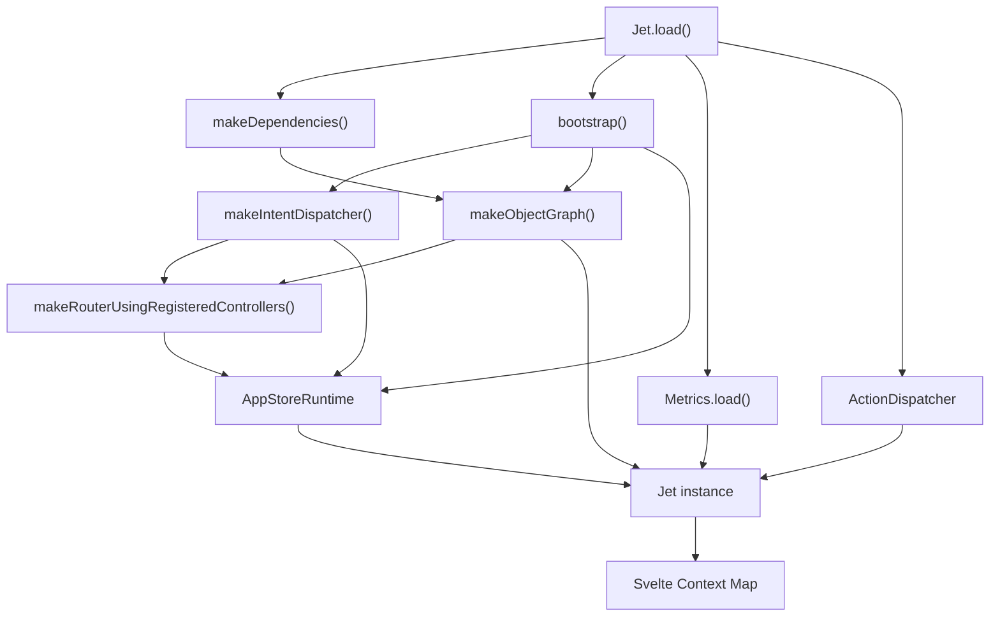
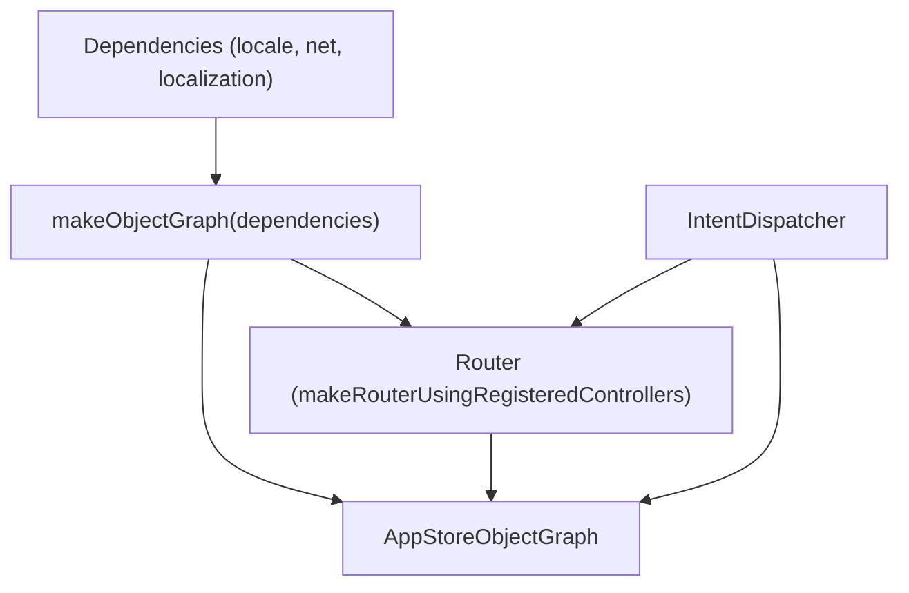

# Jet Application Core

-   [src/jet/action-handlers/browser.ts](https://github.com/Chesszyh/apps.apple.com/blob/279d0c4d/src/jet/action-handlers/browser.ts)
-   [src/jet/action-handlers/compound-action.ts](https://github.com/Chesszyh/apps.apple.com/blob/279d0c4d/src/jet/action-handlers/compound-action.ts)
-   [src/jet/action-handlers/external-url-action.ts](https://github.com/Chesszyh/apps.apple.com/blob/279d0c4d/src/jet/action-handlers/external-url-action.ts)
-   [src/jet/bootstrap.ts](https://github.com/Chesszyh/apps.apple.com/blob/279d0c4d/src/jet/bootstrap.ts)
-   [src/jet/intents/route-url/route-url-controller.ts](https://github.com/Chesszyh/apps.apple.com/blob/279d0c4d/src/jet/intents/route-url/route-url-controller.ts)
-   [src/jet/intents/route-url/route-url-intent.ts](https://github.com/Chesszyh/apps.apple.com/blob/279d0c4d/src/jet/intents/route-url/route-url-intent.ts)
-   [src/jet/intents/static-message-pages/carrier-page-intent-controller.ts](https://github.com/Chesszyh/apps.apple.com/blob/279d0c4d/src/jet/intents/static-message-pages/carrier-page-intent-controller.ts)
-   [src/jet/intents/static-message-pages/contingent-price-page-intent-controller.ts](https://github.com/Chesszyh/apps.apple.com/blob/279d0c4d/src/jet/intents/static-message-pages/contingent-price-page-intent-controller.ts)
-   [src/jet/intents/static-message-pages/invoice-page-intent-controller.ts](https://github.com/Chesszyh/apps.apple.com/blob/279d0c4d/src/jet/intents/static-message-pages/invoice-page-intent-controller.ts)
-   [src/jet/jet.ts](https://github.com/Chesszyh/apps.apple.com/blob/279d0c4d/src/jet/jet.ts)
-   [src/jet/models/external-action.ts](https://github.com/Chesszyh/apps.apple.com/blob/279d0c4d/src/jet/models/external-action.ts)
-   [src/jet/svelte.ts](https://github.com/Chesszyh/apps.apple.com/blob/279d0c4d/src/jet/svelte.ts)

## Purpose and Scope

The Jet Application Core is the foundation of the App Store web application, providing bootstrapping, dependency injection, intent dispatching, action handling, and metrics integration. This page documents the initialization lifecycle, the object graph pattern for dependency management, and the dispatching mechanisms that power navigation and user interactions.

For information about specific intent types and URL routing patterns, see [Intent and Action System](#2.2). For component-level architecture patterns, see [Component Architecture](#2.3).

---

## System Overview

The Jet system serves as the central runtime coordinator, managing the application lifecycle from initialization through user interactions. The `Jet` class exposes the primary API surface, while the bootstrap process establishes the runtime environment and dependency graph.


**Sources:** [src/jet/jet.ts76-132](https://github.com/Chesszyh/apps.apple.com/blob/279d0c4d/src/jet/jet.ts#L76-L132) [src/jet/bootstrap.ts105-125](https://github.com/Chesszyh/apps.apple.com/blob/279d0c4d/src/jet/bootstrap.ts#L105-L125)

---

## Jet Class: Core API

The `Jet` class provides the primary interface for interacting with the application runtime. It encapsulates the intent dispatcher, action dispatcher, metrics pipeline, and locale manager.

### Key Components

| Component | Type | Purpose |
| --- | --- | --- |
| `runtime` | `AppStoreRuntime` | Dispatches intents through registered controllers |
| `objectGraph` | `AppStoreObjectGraph` | Dependency injection container |
| `actionDispatcher` | `ActionDispatcher` | Handles action execution and metrics |
| `metrics` | `Metrics` | Metrics collection and processing pipeline |
| `locale` | `Locale` | Current storefront and language configuration |
| `prefetchedIntents` | `PrefetchedIntents` | Cached intent results from SSR |
| `localization` | `WebLocalization` | I18N string provider |

### Static Factory: Jet.load()

The `Jet.load()` static method initializes the entire system, creating all dependencies and wiring them together.

> **[Mermaid sequence]**
> *(图表结构无法解析)*

**Initialization Parameters:**

-   `loggerFactory`: Creates logger instances for subsystems
-   `context`: Svelte context `Map<string, unknown>` for component access
-   `fetch`: Global fetch function (enables SSR mock injection)
-   `prefetchedIntents`: Optional pre-resolved intent cache for hydration
-   `featuresCallbacks`: Optional feature flag callbacks

**Sources:** [src/jet/jet.ts76-132](https://github.com/Chesszyh/apps.apple.com/blob/279d0c4d/src/jet/jet.ts#L76-L132)

---

## Bootstrap Process

The bootstrap function establishes the runtime environment by creating the intent dispatcher, registering all controllers, building the router, and assembling the object graph.

### Intent Controller Registration

Controllers are registered with the `AppStoreIntentDispatcher` in a specific order to handle URL pattern matching precedence:

```mermaid
flowchart TD
    IntentDispatcher["AppStoreIntentDispatcher"]
    RouteUrl["RouteUrlIntentController"]
    LintMetrics["LintMetricsEventIntentController"]
    LandingPages["landingPageNavigationControllers.*"]
    StaticPages["staticMessagePageControllers.*"]
    Arcade["ArcadeGroupingPageIntentController"]
    Bundle["BundlePageIntentController"]
    Editorial["EditorialPageIntentController"]
    Search["SearchResultsPageIntentController"]
    Developer["DeveloperPageIntentController"]
    Charts["ChartsPageIntentController"]
    AppEvent["AppEventPageIntentController"]
    SeeAll["SeeAllPageIntentController"]
    Product["ProductPageIntentController"]
    RootRedirect["RootRedirectController"]
    Note1["First Registered"]
    Note2["Last Registered Matches /{sf}"]

    IntentDispatcher --> RouteUrl
    IntentDispatcher --> LintMetrics
    IntentDispatcher --> LandingPages
    IntentDispatcher --> StaticPages
    IntentDispatcher --> Arcade
    IntentDispatcher --> Bundle
    IntentDispatcher --> Editorial
    IntentDispatcher --> Search
    IntentDispatcher --> Developer
    IntentDispatcher --> Charts
    IntentDispatcher --> AppEvent
    IntentDispatcher --> SeeAll
    IntentDispatcher --> Product
    IntentDispatcher --> RootRedirect
    RouteUrl --> Note1
    RootRedirect --> Note2
```


**Registration Order Importance:**

1.  **RouteUrlIntentController** and **LintMetricsEventIntentController** register first as meta-controllers
2.  **Landing page controllers** register before RootRedirectController to match specific platforms
3.  **Product page hierarchy** registers in order: `AppEventPageIntentController` → `SeeAllPageIntentController` → `ProductPageIntentController` due to overlapping URL patterns
4.  **RootRedirectController** registers last with catch-all pattern `/{sf}`

**Sources:** [src/jet/bootstrap.ts44-98](https://github.com/Chesszyh/apps.apple.com/blob/279d0c4d/src/jet/bootstrap.ts#L44-L98)

### Object Graph Assembly

The object graph is constructed in layers:


The final object graph contains:

-   Base dependencies (locale, network client, localization)
-   Router (built from registered intent controllers)
-   Intent dispatcher

**Sources:** [src/jet/bootstrap.ts105-125](https://github.com/Chesszyh/apps.apple.com/blob/279d0c4d/src/jet/bootstrap.ts#L105-L125)

---

## Intent Dispatching

The `dispatch()` method routes intents to their registered controllers, with support for prefetched intent optimization.

### Dispatch Flow

> **[Mermaid sequence]**
> *(图表结构无法解析)*

**Prefetched Intents Optimization:**

During server-side rendering, dispatched intents and their results are serialized. On client hydration, these are loaded into `prefetchedIntents` to avoid redundant dispatches. This eliminates duplicate API calls and speeds up initial page load.

**Sources:** [src/jet/jet.ts182-198](https://github.com/Chesszyh/apps.apple.com/blob/279d0c4d/src/jet/jet.ts#L182-L198) [src/jet/jet.ts55-65](https://github.com/Chesszyh/apps.apple.com/blob/279d0c4d/src/jet/jet.ts#L55-L65)

### Example: RouteUrlIntent

The `RouteUrlIntent` is a meta-intent that resolves URLs to page intents:

**Sources:** [src/jet/intents/route-url/route-url-controller.ts9-28](https://github.com/Chesszyh/apps.apple.com/blob/279d0c4d/src/jet/intents/route-url/route-url-controller.ts#L9-L28) [src/jet/intents/route-url/route-url-intent.ts13-27](https://github.com/Chesszyh/apps.apple.com/blob/279d0c4d/src/jet/intents/route-url/route-url-intent.ts#L13-L27)

---

## Action Dispatching

The `perform()` method executes actions using registered handlers, integrating with the metrics pipeline.

### Action Dispatch Mechanism

**Action Registration:**

Actions are registered using `onAction()` which guards against double-registration:

**Sources:** [src/jet/jet.ts207-240](https://github.com/Chesszyh/apps.apple.com/blob/279d0c4d/src/jet/jet.ts#L207-L240) [src/jet/jet.ts248-260](https://github.com/Chesszyh/apps.apple.com/blob/279d0c4d/src/jet/jet.ts#L248-L260)

### Registered Action Handlers

| Action Kind | Handler | Purpose |
| --- | --- | --- |
| `FlowAction` | `flow-action.ts` | Navigation to new pages |
| `ExternalUrlAction` | `external-url-action.ts` | Opening external URLs |
| `compoundAction` | `compound-action.ts` | Executing multiple actions sequentially |

**CompoundAction Execution:**

CompoundActions execute sub-actions in sequence, stopping on first error:

**Sources:** [src/jet/action-handlers/browser.ts1-16](https://github.com/Chesszyh/apps.apple.com/blob/279d0c4d/src/jet/action-handlers/browser.ts#L1-L16) [src/jet/action-handlers/compound-action.ts10-33](https://github.com/Chesszyh/apps.apple.com/blob/279d0c4d/src/jet/action-handlers/compound-action.ts#L10-L33) [src/jet/action-handlers/external-url-action.ts10-19](https://github.com/Chesszyh/apps.apple.com/blob/279d0c4d/src/jet/action-handlers/external-url-action.ts#L10-L19)

---

## Dependency Injection via Object Graph

The `AppStoreObjectGraph` provides type-safe dependency access through the builder pattern. Dependencies are added using `.adding(key, value)` and retrieved using `.get(key)`.

### Object Graph Structure

**Intent Controller Access Pattern:**

Controllers receive the object graph and extract dependencies using typed accessors. Example from static message page controllers:

```
// From CarrierPageIntentControllerasync perform(intent, objectGraphWithoutActiveIntent: AppStoreObjectGraph) {    return await withActiveIntent(        objectGraphWithoutActiveIntent,        intent,        async (objectGraph) => {            // objectGraph now has active intent injected            // Can access: objectGraph.locale, objectGraph.net, etc.            const page = new StaticMessagePage({...});            page.canonicalURL = makeCanonicalUrl(objectGraph, intent);            injectWebNavigation(objectGraph, page, intent.platform);            return page;        },    );}
```
**Sources:** [src/jet/bootstrap.ts111-119](https://github.com/Chesszyh/apps.apple.com/blob/279d0c4d/src/jet/bootstrap.ts#L111-L119) [src/jet/intents/static-message-pages/carrier-page-intent-controller.ts24-40](https://github.com/Chesszyh/apps.apple.com/blob/279d0c4d/src/jet/intents/static-message-pages/carrier-page-intent-controller.ts#L24-L40)

---

## Locale Management

The `setLocale()` method propagates locale information throughout the application, updating the shared `Locale` dependency that all Jet components reference.

### Locale Propagation

The `Locale` object is mutable and shared across all dependencies. When `setLocale()` is called:

1.  Updates `locale.i18n` with the I18N localizer instance
2.  Calls `locale.setActiveLocale()` with storefront and language
3.  All dependencies referencing `objectGraph.locale` see updated values

**Sources:** [src/jet/jet.ts298-305](https://github.com/Chesszyh/apps.apple.com/blob/279d0c4d/src/jet/jet.ts#L298-L305)

---

## Svelte Context Integration

The Jet instance is stored in Svelte's context system, allowing components to access it without prop drilling.

### Context Access Pattern

**Helper Functions:**

| Function | Purpose | Returns |
| --- | --- | --- |
| `getJet()` | Retrieves Jet from Svelte context | `Jet` |
| `getJetPerform()` | Returns bound `jet.perform()` function | `(action) => Promise<ActionOutcome>` |

**Usage Example:**

```
// In any Svelte componentimport { getJet } from '~/jet/svelte';const jet = getJet();await jet.dispatch(someIntent);await jet.perform(someAction);
```
**Sources:** [src/jet/svelte.ts8-45](https://github.com/Chesszyh/apps.apple.com/blob/279d0c4d/src/jet/svelte.ts#L8-L45) [src/jet/jet.ts129](https://github.com/Chesszyh/apps.apple.com/blob/279d0c4d/src/jet/jet.ts#L129-L129)

---

## Metrics Integration

The Jet system tightly integrates with the metrics pipeline through:

1.  **Metrics.load()** initialization with custom `processEvent` callback
2.  **ActionDispatcher** construction with `MetricsPipeline`
3.  **didEnterPage()** lifecycle method for page transitions
4.  **MetricsBehavior** configuration during action dispatch

### Metrics Event Processing

The `processEvent` callback creates a circular dependency where metrics processing dispatches a Jet intent (`LintMetricsEventIntent`) to normalize and validate events before recording.

**Sources:** [src/jet/jet.ts97-110](https://github.com/Chesszyh/apps.apple.com/blob/279d0c4d/src/jet/jet.ts#L97-L110)

---

## API Reference

### Jet Class Methods

| Method | Signature | Description |
| --- | --- | --- |
| `Jet.load()` | `(config) => Jet` | Static factory, initializes entire system |
| `dispatch()` | `<I extends Intent>(intent: I) => Promise<IntentReturnType<I>>` | Dispatches intent to controller |
| `perform()` | `(action: ActionModel, metricsBehavior?) => Promise<ActionOutcome>` | Executes action through dispatcher |
| `onAction()` | `(kind: string, implementation: ActionImplementation) => void` | Registers action handler |
| `routeUrl()` | `(url: string) => Promise<RouterResponse | null>` | Routes URL to intent and action |
| `setLocale()` | `(localizer, storefront, language) => void` | Updates locale configuration |
| `didEnterPage()` | `(page: Page) => Promise<void>` | Notifies metrics of page transition |
| `recordCustomMetricsEvent()` | `(fields?) => void` | Emits custom metrics event |
| `enableFunnelKit()` | `() => void` | Enables FunnelKit recorder |
| `disableFunnelKit()` | `() => void` | Disables FunnelKit recorder |

**Sources:** [src/jet/jet.ts48-320](https://github.com/Chesszyh/apps.apple.com/blob/279d0c4d/src/jet/jet.ts#L48-L320)

---

## Summary

The Jet Application Core provides:

-   **Centralized initialization** via `Jet.load()` that wires together runtime, metrics, actions, and dependencies
-   **Intent dispatching** through a registered controller pattern with URL routing support
-   **Action dispatching** with metrics integration and extensible handler registration
-   **Dependency injection** via the immutable object graph builder pattern
-   **Locale management** through shared mutable Locale dependency
-   **SSR optimization** using prefetched intent caching
-   **Svelte integration** through context API for component access

The system follows a clear separation of concerns: the bootstrap process creates infrastructure, the Jet class provides the public API, and the object graph manages dependencies throughout the application lifecycle.
