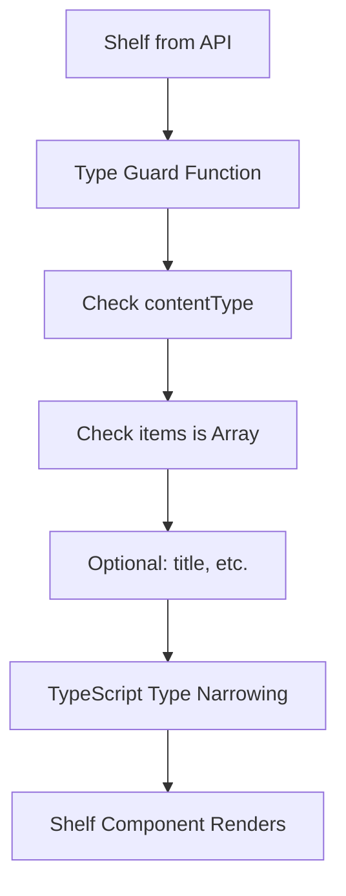
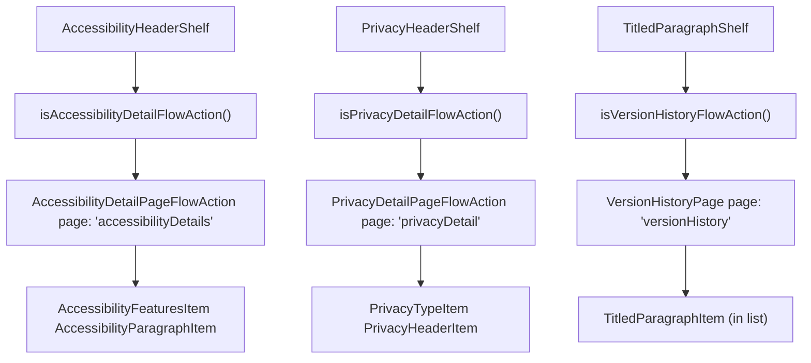

# Informational and Compliance Shelves

-   [src/components/PageModal.svelte](https://github.com/Chesszyh/apps.apple.com/blob/279d0c4d/src/components/PageModal.svelte)
-   [src/components/Shelf/Wrapper.svelte](https://github.com/Chesszyh/apps.apple.com/blob/279d0c4d/src/components/Shelf/Wrapper.svelte)
-   [src/components/jet/shelf/AccessibilityHeaderShelf.svelte](https://github.com/Chesszyh/apps.apple.com/blob/279d0c4d/src/components/jet/shelf/AccessibilityHeaderShelf.svelte)
-   [src/components/jet/shelf/ArcadeFooterShelf.svelte](https://github.com/Chesszyh/apps.apple.com/blob/279d0c4d/src/components/jet/shelf/ArcadeFooterShelf.svelte)
-   [src/components/jet/shelf/PageHeaderShelf.svelte](https://github.com/Chesszyh/apps.apple.com/blob/279d0c4d/src/components/jet/shelf/PageHeaderShelf.svelte)
-   [src/components/jet/shelf/PrivacyFooterShelf.svelte](https://github.com/Chesszyh/apps.apple.com/blob/279d0c4d/src/components/jet/shelf/PrivacyFooterShelf.svelte)
-   [src/components/jet/shelf/PrivacyHeaderShelf.svelte](https://github.com/Chesszyh/apps.apple.com/blob/279d0c4d/src/components/jet/shelf/PrivacyHeaderShelf.svelte)
-   [src/components/jet/shelf/TitledParagraphShelf.svelte](https://github.com/Chesszyh/apps.apple.com/blob/279d0c4d/src/components/jet/shelf/TitledParagraphShelf.svelte)
-   [src/components/pages/DefaultPage.svelte](https://github.com/Chesszyh/apps.apple.com/blob/279d0c4d/src/components/pages/DefaultPage.svelte)
-   [src/jet/utils/handle-modal-presentation.ts](https://github.com/Chesszyh/apps.apple.com/blob/279d0c4d/src/jet/utils/handle-modal-presentation.ts)
-   [src/stores/modalPage.ts](https://github.com/Chesszyh/apps.apple.com/blob/279d0c4d/src/stores/modalPage.ts)

## Purpose and Scope

This document catalogs shelf types used for displaying informational, legal, compliance, and structural content on App Store pages. These shelves typically present regulatory disclosures, accessibility features, privacy policies, version history, and page metadata rather than promotional or product content.

For promotional and editorial content shelves, see [Editorial and Promotional Shelves](#7.1). For product listing shelves, see [Lockup and Grid Shelves](#7.2). For the underlying modal presentation system used by many of these shelves, see [Modal Presentation](#4.3).

---

## Overview of Shelf Types

Informational and compliance shelves serve distinct purposes in the App Store web application:

| Shelf Type | Content Type | Primary Purpose | Modal Support |
| --- | --- | --- | --- |
| `AccessibilityHeaderShelf` | `accessibilityParagraph` | Display app accessibility features | Yes (detail page) |
| `PrivacyHeaderShelf` | `privacyHeader` | Display app privacy information | Yes (detail page) |
| `PrivacyFooterShelf` | `privacyFooter` | Display privacy footer links | No |
| `TitledParagraphShelf` | `titledParagraph` | Display titled text content (e.g., version history) | Yes (version history) |
| `PageHeaderShelf` | `pageHeader` | Display page-level title and subtitle | No |
| `ArcadeFooterShelf` | `arcadeFooter` | Display Arcade subscription footer | No |

**Sources:** [src/components/jet/shelf/AccessibilityHeaderShelf.svelte1-183](https://github.com/Chesszyh/apps.apple.com/blob/279d0c4d/src/components/jet/shelf/AccessibilityHeaderShelf.svelte#L1-L183) [src/components/jet/shelf/PrivacyHeaderShelf.svelte1-146](https://github.com/Chesszyh/apps.apple.com/blob/279d0c4d/src/components/jet/shelf/PrivacyHeaderShelf.svelte#L1-L146) [src/components/jet/shelf/TitledParagraphShelf.svelte1-119](https://github.com/Chesszyh/apps.apple.com/blob/279d0c4d/src/components/jet/shelf/TitledParagraphShelf.svelte#L1-L119) [src/components/jet/shelf/PageHeaderShelf.svelte1-35](https://github.com/Chesszyh/apps.apple.com/blob/279d0c4d/src/components/jet/shelf/PageHeaderShelf.svelte#L1-L35) [src/components/jet/shelf/PrivacyFooterShelf.svelte1-41](https://github.com/Chesszyh/apps.apple.com/blob/279d0c4d/src/components/jet/shelf/PrivacyFooterShelf.svelte#L1-L41) [src/components/jet/shelf/ArcadeFooterShelf.svelte1-33](https://github.com/Chesszyh/apps.apple.com/blob/279d0c4d/src/components/jet/shelf/ArcadeFooterShelf.svelte#L1-L33)

---

## Shelf Type Catalog

### AccessibilityHeaderShelf

#### Type Guard and Interface

The `AccessibilityHeaderShelf` displays an app's accessibility features with a "See All" action that opens a modal containing detailed information.

```
interface AccessibilityHeaderShelf extends Shelf {    items: [AccessibilityParagraph];}function isAccessibilityHeaderShelf(shelf: Shelf): shelf is AccessibilityHeaderShelf
```
**Type Guard Logic:**

-   `contentType === 'accessibilityParagraph'`
-   `title` is present
-   `items` is an array

#### Modal Presentation

When `seeAllAction` is present and is an `AccessibilityDetailPageFlowAction`, clicking the shelf title opens a modal containing:

```
interface AccessibilityDetailPage extends GenericPage {    shelves: (AccessibilityFeaturesShelf | AccessibilityParagraphShelf)[];}
```
The modal iterates through shelves and renders:

-   `AccessibilityParagraphItem` for paragraph shelves
-   `AccessibilityFeaturesItem` for feature list shelves (with `isDetailView={true}`)

#### Layout Characteristics

-   Uses `ShelfWrapper` with configurable `withBottomPadding` (determined by `getAccessibilityLayoutConfiguration`)
-   Header container width is 66% on medium+ viewports
-   Modal content sections separated by 1px borders with 20px spacing

**Sources:** [src/components/jet/shelf/AccessibilityHeaderShelf.svelte1-183](https://github.com/Chesszyh/apps.apple.com/blob/279d0c4d/src/components/jet/shelf/AccessibilityHeaderShelf.svelte#L1-L183)

---

### PrivacyHeaderShelf

#### Type Guard and Interface

The `PrivacyHeaderShelf` displays an app's privacy information with a modal for detailed privacy practices.

```
interface PrivacyHeaderShelf extends Shelf {    items: [PrivacyHeader];}function isPrivacyHeaderShelf(shelf: Shelf): shelf is PrivacyHeaderShelf
```
**Type Guard Logic:**

-   `contentType === 'privacyHeader'`
-   `items` is an array

#### Modal Presentation

Similar to `AccessibilityHeaderShelf`, this shelf supports a `PrivacyDetailPageFlowAction`:

```
interface PrivacyDetailPage extends GenericPage {    shelves: (PrivacyTypeShelf | PrivacyHeaderShelf)[];}
```
The modal renders:

-   `PrivacyHeaderItem` for header shelves
-   `PrivacyTypeItem` for type shelves (with `isDetailView={true}`)
-   Uses `APP_PRIVACY_MODAL_ID` for metrics targeting

#### Layout Characteristics

-   `withBottomPadding={false}` on `ShelfWrapper`
-   Header container width is 66% on medium+ viewports
-   Title container has `display: flex` with `justify-content: space-between`

**Sources:** [src/components/jet/shelf/PrivacyHeaderShelf.svelte1-146](https://github.com/Chesszyh/apps.apple.com/blob/279d0c4d/src/components/jet/shelf/PrivacyHeaderShelf.svelte#L1-L146)

---

### TitledParagraphShelf

#### Type Guard and Interface

The `TitledParagraphShelf` displays titled paragraphs, most commonly used for version history or "What's New" sections.

```
interface TitledParagraphShelf extends Shelf {    items: [TitledParagraph];}function isTitledParagraphShelf(shelf: Shelf): shelf is TitledParagraphShelf
```
**Type Guard Logic:**

-   `contentType === 'titledParagraph'`
-   `items` is an array

#### Version History Modal

When `seeAllAction` is a `VersionHistoryFlowAction`, the modal displays a complete version history:

```
interface VersionHistoryPage extends FlowAction {    page: 'versionHistory';    pageData: GenericPage;}
```
The modal:

-   Uses `VERSION_HISTORY_MODAL_ID` for metrics
-   Calls `perform(destination)` when opening
-   Renders items in an unordered list (`<ul>`)
-   Filters items using `isTitledParagraphItem` type guard

#### Item Rendering

Each `TitledParagraphItem` is rendered both in the shelf (collapsed view) and in the modal (full list).

**Sources:** [src/components/jet/shelf/TitledParagraphShelf.svelte1-119](https://github.com/Chesszyh/apps.apple.com/blob/279d0c4d/src/components/jet/shelf/TitledParagraphShelf.svelte#L1-L119)

---

### PageHeaderShelf

#### Type Guard and Interface

The `PageHeaderShelf` provides page-level structural metadata (title and subtitle) as a shelf component.

```
interface PageHeaderShelf extends Shelf {    items: [PageHeader];}function isPageHeaderShelf(shelf: Shelf): shelf is PageHeaderShelf
```
**Type Guard Logic:**

-   `contentType === 'pageHeader'`
-   `items` is an array

#### Rendering Behavior

-   Renders a `ShelfTitle` with `item.title` and `item.subtitle`
-   Uses `withBottomPadding={false}` on wrapper
-   Applies custom CSS variable `--shelf-title-font: var(--title-1-emphasized)` for emphasized styling
-   Uses `display: contents` to avoid introducing layout nodes

This shelf is typically used in pages where the title should be rendered as part of the shelf system rather than as a standalone `<h1>` element.

**Sources:** [src/components/jet/shelf/PageHeaderShelf.svelte1-35](https://github.com/Chesszyh/apps.apple.com/blob/279d0c4d/src/components/jet/shelf/PageHeaderShelf.svelte#L1-L35)

---

### PrivacyFooterShelf

#### Type Guard and Interface

The `PrivacyFooterShelf` displays footer-level privacy information with linkable text.

```
interface PrivacyFooterShelf extends Shelf {    items: [PrivacyFooter];}function isPrivacyFooterShelf(shelf: Shelf): shelf is PrivacyFooterShelf
```
**Type Guard Logic:**

-   `contentType === 'privacyFooter'`
-   `items` is an array

#### Rendering Behavior

-   Extracts `bodyText` from first item
-   Renders using `LinkableTextItem` component (supports inline links)
-   Uses `centered` prop on `ShelfWrapper`
-   Applies `var(--body-tall)` font and `var(--keyColor)` for links

**Sources:** [src/components/jet/shelf/PrivacyFooterShelf.svelte1-41](https://github.com/Chesszyh/apps.apple.com/blob/279d0c4d/src/components/jet/shelf/PrivacyFooterShelf.svelte#L1-L41)

---

### ArcadeFooterShelf

#### Type Guard and Interface

The `ArcadeFooterShelf` displays footer information specific to Apple Arcade subscriptions.

```
interface ArcadeFooterShelf extends Shelf {    items: [ArcadeFooter];}function isArcadeFooterShelf(shelf: Shelf): shelf is ArcadeFooterShelf
```
**Type Guard Logic:**

-   `contentType === 'arcadeFooter'`
-   `items` is an array

#### Rendering Behavior

-   Uses `HorizontalShelf` with `gridType="Spotlight"`
-   Supports `rowsPerColumn` configuration from shelf data
-   Renders each item using `ArcadeFooterItem` component
-   `withBottomPadding={false}` on wrapper

**Sources:** [src/components/jet/shelf/ArcadeFooterShelf.svelte1-33](https://github.com/Chesszyh/apps.apple.com/blob/279d0c4d/src/components/jet/shelf/ArcadeFooterShelf.svelte#L1-L33)

---

## Modal Presentation Architecture

### Direct Shelf Modal Pattern

Several informational shelves implement their own modal instances for displaying detailed content. This pattern is used by `AccessibilityHeaderShelf`, `PrivacyHeaderShelf`, and `TitledParagraphShelf`.

**Modal Presentation Flow**

> **[Mermaid sequence]**
> *(图表结构无法解析)*

**Sources:** [src/components/jet/shelf/AccessibilityHeaderShelf.svelte74-91](https://github.com/Chesszyh/apps.apple.com/blob/279d0c4d/src/components/jet/shelf/AccessibilityHeaderShelf.svelte#L74-L91) [src/components/jet/shelf/PrivacyHeaderShelf.svelte55-71](https://github.com/Chesszyh/apps.apple.com/blob/279d0c4d/src/components/jet/shelf/PrivacyHeaderShelf.svelte#L55-L71) [src/components/jet/shelf/TitledParagraphShelf.svelte51-69](https://github.com/Chesszyh/apps.apple.com/blob/279d0c4d/src/components/jet/shelf/TitledParagraphShelf.svelte#L51-L69)

### Modal Component Lifecycle

The shelves manage modal state locally:

1.  **State Variables:**

    -   `modalComponent: Modal | undefined` - Reference to modal instance
    -   `modalTriggerElement: HTMLElement | null` - Element that triggered modal (for focus restoration)
2.  **Event Handlers:**

    -   `handleOpenModalClick` - Stores trigger element and calls `showModal()`
    -   `handleModalClose` - Calls modal's `close()` method
3.  **Page Data Extraction:**

    -   Checks if `seeAllAction` matches expected FlowAction type
    -   Extracts `pageData` from action for modal content

**Sources:** [src/components/jet/shelf/AccessibilityHeaderShelf.svelte74-91](https://github.com/Chesszyh/apps.apple.com/blob/279d0c4d/src/components/jet/shelf/AccessibilityHeaderShelf.svelte#L74-L91)

---

## Type Guard System

### Type Guard Implementation Pattern

All informational shelves follow a consistent type guard pattern:


**Common Type Guard Structure:**

1.  Extract `contentType` and `items` from shelf
2.  Verify `contentType` matches expected string literal
3.  Verify `items` is an array (sometimes with specific length)
4.  Optional: verify presence of `title` or other required fields
5.  Return boolean with TypeScript type predicate

**Sources:** [src/components/jet/shelf/AccessibilityHeaderShelf.svelte33-43](https://github.com/Chesszyh/apps.apple.com/blob/279d0c4d/src/components/jet/shelf/AccessibilityHeaderShelf.svelte#L33-L43) [src/components/jet/shelf/PrivacyHeaderShelf.svelte29-34](https://github.com/Chesszyh/apps.apple.com/blob/279d0c4d/src/components/jet/shelf/PrivacyHeaderShelf.svelte#L29-L34) [src/components/jet/shelf/TitledParagraphShelf.svelte20-26](https://github.com/Chesszyh/apps.apple.com/blob/279d0c4d/src/components/jet/shelf/TitledParagraphShelf.svelte#L20-L26) [src/components/jet/shelf/PageHeaderShelf.svelte8-11](https://github.com/Chesszyh/apps.apple.com/blob/279d0c4d/src/components/jet/shelf/PageHeaderShelf.svelte#L8-L11)

---

## Integration with Global Modal System

### Global PageModal vs Direct Modals

While informational shelves typically use **direct modal instances**, the application also supports a **global modal system** via `PageModal.svelte` and `modalPageStore`.

**Comparison:**

| Aspect | Direct Shelf Modals | Global PageModal |
| --- | --- | --- |
| **Store Usage** | No global store | `modalPageStore` |
| **Lifecycle** | Component-local | Application-global |
| **Trigger Method** | `handleOpenModalClick` | `handleModalPresentation()` |
| **Use Cases** | Known modal content (accessibility, privacy, version history) | Dynamic content (EULA deep links) |
| **File Location** | Within shelf component | `src/components/PageModal.svelte` |

### Global Modal Implementation

The global modal system uses a Svelte store to manage modal state:

```
interface ModalPageStore extends Readable<Page | undefined> {    setPage: (page: Page) => void;    clearPage: () => void;}
```
The `handleModalPresentation` utility function populates this store:

```
export const handleModalPresentation = (    page: { promise: Promise<Page> },    log: Logger<unknown[]>,    pageDetail?: string,)
```
**Sources:** [src/stores/modalPage.ts1-36](https://github.com/Chesszyh/apps.apple.com/blob/279d0c4d/src/stores/modalPage.ts#L1-L36) [src/jet/utils/handle-modal-presentation.ts1-30](https://github.com/Chesszyh/apps.apple.com/blob/279d0c4d/src/jet/utils/handle-modal-presentation.ts#L1-L30) [src/components/PageModal.svelte1-83](https://github.com/Chesszyh/apps.apple.com/blob/279d0c4d/src/components/PageModal.svelte#L1-L83)

---

## Code Entity Mapping

### Shelf Type to Code Symbol Reference

```mermaid
flowchart TD
    CT_AP["contentType: 'accessibilityParagraph'"]
    CT_PH["contentType: 'privacyHeader'"]
    CT_PF["contentType: 'privacyFooter'"]
    CT_TP["contentType: 'titledParagraph'"]
    CT_PGH["contentType: 'pageHeader'"]
    CT_AF["contentType: 'arcadeFooter'"]
    TG_AHS["isAccessibilityHeaderShelf()"]
    TG_PHS["isPrivacyHeaderShelf()"]
    TG_PFS["isPrivacyFooterShelf()"]
    TG_TPS["isTitledParagraphShelf()"]
    TG_PGHS["isPageHeaderShelf()"]
    TG_AFS["isArcadeFooterShelf()"]
    C_AHS["AccessibilityHeaderShelf.svelte"]
    C_PHS["PrivacyHeaderShelf.svelte"]
    C_PFS["PrivacyFooterShelf.svelte"]
    C_TPS["TitledParagraphShelf.svelte"]
    C_PGHS["PageHeaderShelf.svelte"]
    C_AFS["ArcadeFooterShelf.svelte"]

    CT --> AP_TG_AHS
    TG --> AHS_C_AHS
    CT --> PH_TG_PHS
    TG --> PHS_C_PHS
    CT --> PF_TG_PFS
    TG --> PFS_C_PFS
    CT --> TP_TG_TPS
    TG --> TPS_C_TPS
    CT --> PGH_TG_PGHS
    TG --> PGHS_C_PGHS
    CT --> AF_TG_AFS
    TG --> AFS_C_AFS
```


**Sources:** [src/components/jet/shelf/AccessibilityHeaderShelf.svelte33-43](https://github.com/Chesszyh/apps.apple.com/blob/279d0c4d/src/components/jet/shelf/AccessibilityHeaderShelf.svelte#L33-L43) [src/components/jet/shelf/PrivacyHeaderShelf.svelte29-34](https://github.com/Chesszyh/apps.apple.com/blob/279d0c4d/src/components/jet/shelf/PrivacyHeaderShelf.svelte#L29-L34) [src/components/jet/shelf/PrivacyFooterShelf.svelte8-14](https://github.com/Chesszyh/apps.apple.com/blob/279d0c4d/src/components/jet/shelf/PrivacyFooterShelf.svelte#L8-L14) [src/components/jet/shelf/TitledParagraphShelf.svelte20-26](https://github.com/Chesszyh/apps.apple.com/blob/279d0c4d/src/components/jet/shelf/TitledParagraphShelf.svelte#L20-L26) [src/components/jet/shelf/PageHeaderShelf.svelte8-11](https://github.com/Chesszyh/apps.apple.com/blob/279d0c4d/src/components/jet/shelf/PageHeaderShelf.svelte#L8-L11) [src/components/jet/shelf/ArcadeFooterShelf.svelte8-14](https://github.com/Chesszyh/apps.apple.com/blob/279d0c4d/src/components/jet/shelf/ArcadeFooterShelf.svelte#L8-L14)

### Modal-Enabled Shelves: FlowAction Mapping


**Sources:** [src/components/jet/shelf/AccessibilityHeaderShelf.svelte53-57](https://github.com/Chesszyh/apps.apple.com/blob/279d0c4d/src/components/jet/shelf/AccessibilityHeaderShelf.svelte#L53-L57) [src/components/jet/shelf/PrivacyHeaderShelf.svelte36-40](https://github.com/Chesszyh/apps.apple.com/blob/279d0c4d/src/components/jet/shelf/PrivacyHeaderShelf.svelte#L36-L40) [src/components/jet/shelf/TitledParagraphShelf.svelte28-32](https://github.com/Chesszyh/apps.apple.com/blob/279d0c4d/src/components/jet/shelf/TitledParagraphShelf.svelte#L28-L32)

---

## Common Layout Patterns

### ShelfWrapper Integration

All informational shelves use `ShelfWrapper` for consistent spacing and title rendering:

| Shelf | `centered` | `withBottomPadding` | Custom Styling |
| --- | --- | --- | --- |
| AccessibilityHeaderShelf | No | Configurable | 66% width on medium+ |
| PrivacyHeaderShelf | No | `false` | 66% width on medium+ |
| PrivacyFooterShelf | Yes | Default (`true`) | Link color override |
| TitledParagraphShelf | No | Default (`true`) | None |
| PageHeaderShelf | No | `false` | `--shelf-title-font` override |
| ArcadeFooterShelf | No | `false` | HorizontalShelf layout |

### Title Container Pattern

Shelves with modal support use a consistent title container pattern:

```
<div slot="title" class="title-container">    {#if shelf.title}        <button on:click={handleOpenModalClick}>            <ShelfTitle title={shelf.title} seeAllAction={destination} />        </button>    {/if}</div>
```
**CSS:**

```
.title-container {    display: flex;    justify-content: space-between;    padding-top: 16px;    padding-inline-end: var(--bodyGutter);}
```
This pattern ensures:

-   Title and "See All" action are horizontally spaced
-   Clickable area includes entire title region
-   Consistent padding with page gutters

**Sources:** [src/components/jet/shelf/AccessibilityHeaderShelf.svelte93-107](https://github.com/Chesszyh/apps.apple.com/blob/279d0c4d/src/components/jet/shelf/AccessibilityHeaderShelf.svelte#L93-L107) [src/components/jet/shelf/PrivacyHeaderShelf.svelte74-81](https://github.com/Chesszyh/apps.apple.com/blob/279d0c4d/src/components/jet/shelf/PrivacyHeaderShelf.svelte#L74-L81) [src/components/jet/shelf/TitledParagraphShelf.svelte72-79](https://github.com/Chesszyh/apps.apple.com/blob/279d0c4d/src/components/jet/shelf/TitledParagraphShelf.svelte#L72-L79)

---

## Metrics Integration

### Modal Targeting

Several shelves specify unique modal IDs for metrics tracking:

-   **APP\_PRIVACY\_MODAL\_ID**: Used by `PrivacyHeaderShelf` modal ([src/components/jet/shelf/PrivacyHeaderShelf.svelte89](https://github.com/Chesszyh/apps.apple.com/blob/279d0c4d/src/components/jet/shelf/PrivacyHeaderShelf.svelte#L89-L89))
-   **VERSION\_HISTORY\_MODAL\_ID**: Used by `TitledParagraphShelf` modal ([src/components/jet/shelf/TitledParagraphShelf.svelte86](https://github.com/Chesszyh/apps.apple.com/blob/279d0c4d/src/components/jet/shelf/TitledParagraphShelf.svelte#L86-L86))
-   **LICENSE\_AGREEMENT\_MODAL\_ID**: Used by global `PageModal` for EULA content ([src/components/PageModal.svelte18-21](https://github.com/Chesszyh/apps.apple.com/blob/279d0c4d/src/components/PageModal.svelte#L18-L21))

These IDs enable tracking of modal open/close events and user interactions within modals. See [Metrics Pipeline](#3.1) for details on how these IDs are used in event recording.

**Sources:** [src/components/jet/shelf/PrivacyHeaderShelf.svelte51](https://github.com/Chesszyh/apps.apple.com/blob/279d0c4d/src/components/jet/shelf/PrivacyHeaderShelf.svelte#L51-L51) [src/components/jet/shelf/TitledParagraphShelf.svelte46](https://github.com/Chesszyh/apps.apple.com/blob/279d0c4d/src/components/jet/shelf/TitledParagraphShelf.svelte#L46-L46) [src/components/PageModal.svelte9](https://github.com/Chesszyh/apps.apple.com/blob/279d0c4d/src/components/PageModal.svelte#L9-L9)

---

## Summary

Informational and compliance shelves provide structured presentation of regulatory, legal, and metadata content. Key characteristics:

1.  **Type Safety**: Each shelf has a dedicated TypeScript interface and type guard
2.  **Modal Support**: Accessibility, Privacy, and TitledParagraph shelves support detailed modal views
3.  **Consistent Layout**: All use `ShelfWrapper` with configurable padding and centering
4.  **Metrics Integration**: Modal-enabled shelves specify unique IDs for analytics tracking
5.  **Separation of Concerns**: Direct modals for known content, global modal for dynamic content

For implementation details on adding new shelf types, see [Adding a New Shelf Type](#8.1). For modal system architecture, see [Modal Presentation](#4.3).
