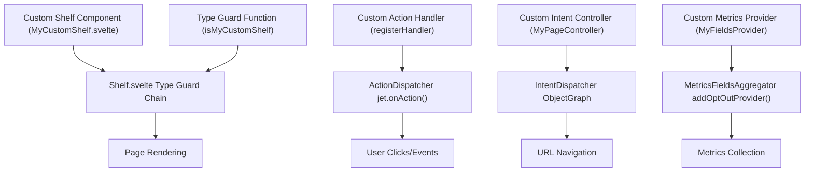
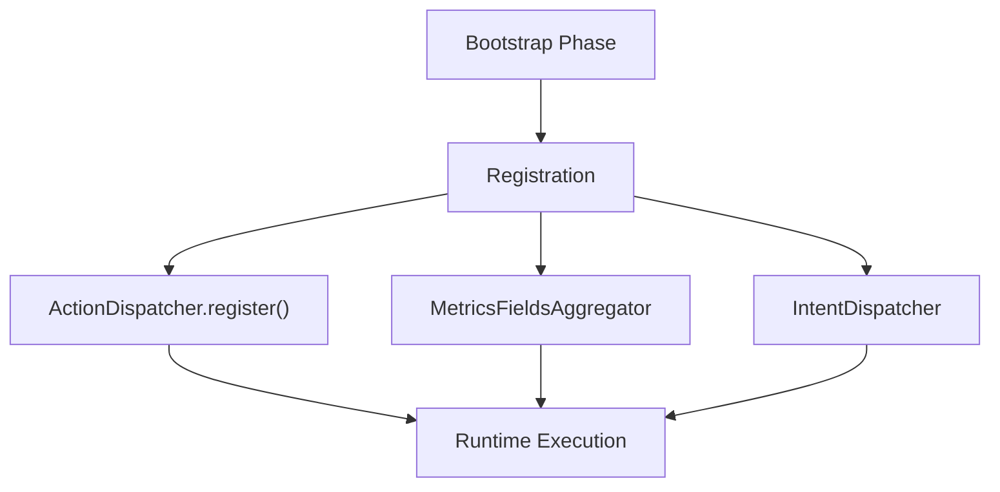
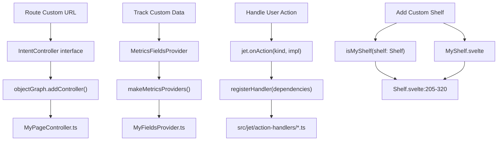
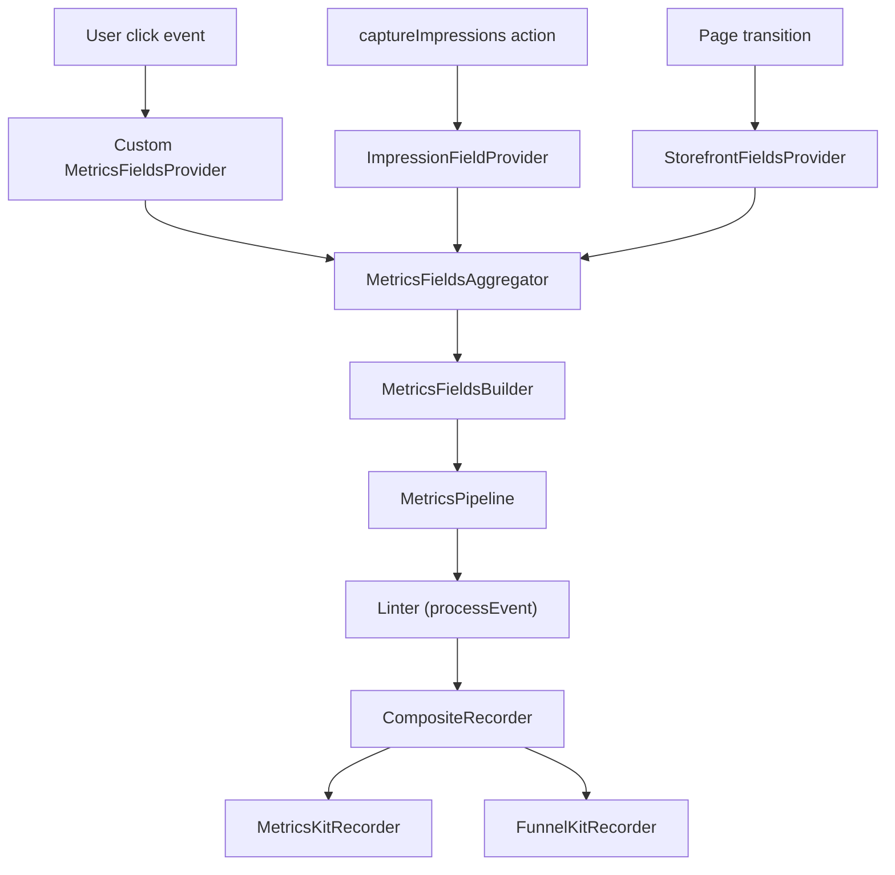
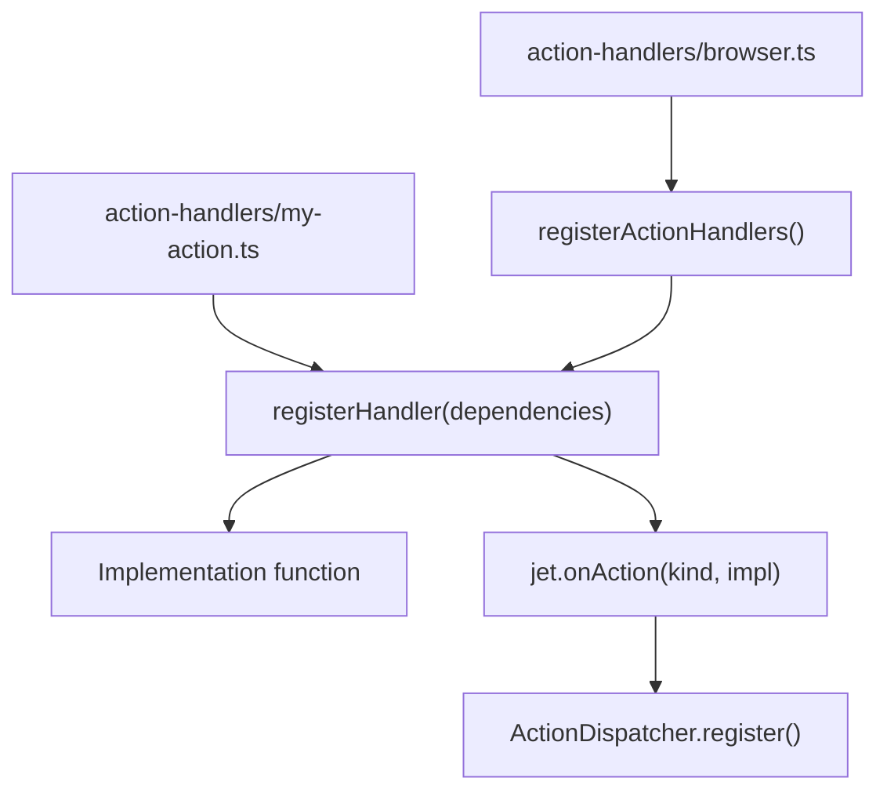

# Developer Guides

-   [shared/metrics-8/src/impression-provider.ts](https://github.com/Chesszyh/apps.apple.com/blob/279d0c4d/shared/metrics-8/src/impression-provider.ts)
-   [shared/metrics-8/src/impression-snapshot-provider.ts](https://github.com/Chesszyh/apps.apple.com/blob/279d0c4d/shared/metrics-8/src/impression-snapshot-provider.ts)
-   [shared/metrics-8/src/impressions/index.ts](https://github.com/Chesszyh/apps.apple.com/blob/279d0c4d/shared/metrics-8/src/impressions/index.ts)
-   [shared/metrics-8/src/index.ts](https://github.com/Chesszyh/apps.apple.com/blob/279d0c4d/shared/metrics-8/src/index.ts)
-   [src/components/jet/shelf/Shelf.svelte](https://github.com/Chesszyh/apps.apple.com/blob/279d0c4d/src/components/jet/shelf/Shelf.svelte)
-   [src/jet/action-handlers/browser.ts](https://github.com/Chesszyh/apps.apple.com/blob/279d0c4d/src/jet/action-handlers/browser.ts)
-   [src/jet/action-handlers/compound-action.ts](https://github.com/Chesszyh/apps.apple.com/blob/279d0c4d/src/jet/action-handlers/compound-action.ts)
-   [src/jet/action-handlers/external-url-action.ts](https://github.com/Chesszyh/apps.apple.com/blob/279d0c4d/src/jet/action-handlers/external-url-action.ts)
-   [src/jet/jet.ts](https://github.com/Chesszyh/apps.apple.com/blob/279d0c4d/src/jet/jet.ts)
-   [src/jet/metrics/providers/StorefrontFieldsProvider.ts](https://github.com/Chesszyh/apps.apple.com/blob/279d0c4d/src/jet/metrics/providers/StorefrontFieldsProvider.ts)
-   [src/jet/metrics/providers/index.ts](https://github.com/Chesszyh/apps.apple.com/blob/279d0c4d/src/jet/metrics/providers/index.ts)
-   [src/jet/models/external-action.ts](https://github.com/Chesszyh/apps.apple.com/blob/279d0c4d/src/jet/models/external-action.ts)
-   [src/jet/svelte.ts](https://github.com/Chesszyh/apps.apple.com/blob/279d0c4d/src/jet/svelte.ts)

## Purpose and Scope

This section provides practical guides for developers extending and customizing the App Store web application. These guides cover the primary extension points in the codebase, including adding new shelf types, working with metrics, creating custom actions, implementing intent controllers, and optimizing responsive images.

For comprehensive architectural background, see [Architecture](#2). For detailed component documentation, see [Component Library](#5) and [Shelf Type Reference](#7).

## Extension Points Overview

The application provides four primary extension points where developers can add custom functionality:

| Extension Point | Purpose | Primary Interface | Example Use Case |
| --- | --- | --- | --- |
| **Shelf Components** | Display custom content types | Type guard + Svelte component | Custom promotional layout |
| **Action Handlers** | Handle user interactions | `ActionImplementation<A>` | Third-party integration |
| **Intent Controllers** | Route URLs to pages | `IntentController` | Custom page type |
| **Metrics Providers** | Add analytics fields | `MetricsFieldsProvider` | Custom tracking data |

**Sources:** [src/components/jet/shelf/Shelf.svelte1-321](https://github.com/Chesszyh/apps.apple.com/blob/279d0c4d/src/components/jet/shelf/Shelf.svelte#L1-L321) [src/jet/jet.ts248-260](https://github.com/Chesszyh/apps.apple.com/blob/279d0c4d/src/jet/jet.ts#L248-L260) [src/jet/metrics/providers/index.ts1-16](https://github.com/Chesszyh/apps.apple.com/blob/279d0c4d/src/jet/metrics/providers/index.ts#L1-L16)

## System Integration Architecture

The following diagram shows how developer code integrates with the framework at each extension point:


**Sources:** [src/components/jet/shelf/Shelf.svelte205-320](https://github.com/Chesszyh/apps.apple.com/blob/279d0c4d/src/components/jet/shelf/Shelf.svelte#L205-L320) [src/jet/jet.ts248-260](https://github.com/Chesszyh/apps.apple.com/blob/279d0c4d/src/jet/jet.ts#L248-L260) [src/jet/metrics/providers/index.ts6-15](https://github.com/Chesszyh/apps.apple.com/blob/279d0c4d/src/jet/metrics/providers/index.ts#L6-L15)

## Common Development Patterns

### Type Guard Pattern

The codebase extensively uses TypeScript type guards for polymorphic rendering. This pattern narrows generic types to specific implementations:

```
// Standard type guard structureexport function isMyCustomShelf(shelf: Shelf): shelf is MyCustomShelf {    return shelf.kind === 'myCustomShelf';}
```
Type guards enable the shelf dispatcher to route generic `Shelf` models to specific components without runtime type casting.

**Sources:** [src/components/jet/shelf/Shelf.svelte5-174](https://github.com/Chesszyh/apps.apple.com/blob/279d0c4d/src/components/jet/shelf/Shelf.svelte#L5-L174)

### Registration Pattern

Custom functionality registers with framework dispatchers during initialization:


This pattern ensures type-safe registration with compile-time checking.

**Sources:** [src/jet/jet.ts248-260](https://github.com/Chesszyh/apps.apple.com/blob/279d0c4d/src/jet/jet.ts#L248-L260) [src/jet/action-handlers/browser.ts12-16](https://github.com/Chesszyh/apps.apple.com/blob/279d0c4d/src/jet/action-handlers/browser.ts#L12-L16) [src/jet/metrics/providers/index.ts6-15](https://github.com/Chesszyh/apps.apple.com/blob/279d0c4d/src/jet/metrics/providers/index.ts#L6-L15)

### Provider Pattern

Metrics providers use a builder pattern to add contextual fields:

```
class CustomFieldsProvider implements MetricsFieldsProvider {    addMetricsFields(        builder: MetricsFieldsBuilder,        _context: MetricsFieldsContext,    ) {        builder.addValue(customValue, 'fieldName');    }}
```
The aggregator collects fields from all registered providers before event processing.

**Sources:** [src/jet/metrics/providers/StorefrontFieldsProvider.ts1-20](https://github.com/Chesszyh/apps.apple.com/blob/279d0c4d/src/jet/metrics/providers/StorefrontFieldsProvider.ts#L1-L20) [shared/metrics-8/src/impression-provider.ts9-27](https://github.com/Chesszyh/apps.apple.com/blob/279d0c4d/shared/metrics-8/src/impression-provider.ts#L9-L27)

## Framework Integration Flow

The following sequence shows how custom code executes within the framework lifecycle:

> **[Mermaid sequence]**
> *(图表结构无法解析)*

**Sources:** [src/jet/jet.ts76-132](https://github.com/Chesszyh/apps.apple.com/blob/279d0c4d/src/jet/jet.ts#L76-L132) [src/jet/action-handlers/browser.ts12-16](https://github.com/Chesszyh/apps.apple.com/blob/279d0c4d/src/jet/action-handlers/browser.ts#L12-L16)

## Key Development Files

Developers commonly work with these files when extending the system:

| File Path | Purpose | When to Modify |
| --- | --- | --- |
| `src/components/jet/shelf/Shelf.svelte` | Shelf type dispatcher | Adding new shelf type |
| `src/jet/action-handlers/browser.ts` | Action handler registry | Registering action handlers |
| `src/jet/metrics/providers/index.ts` | Metrics provider registry | Adding metrics providers |
| `src/jet/bootstrap.ts` | Application initialization | Modifying core setup |
| `src/jet/jet.ts` | Core Jet interface | Never (use extension points) |

**Sources:** [src/components/jet/shelf/Shelf.svelte1-321](https://github.com/Chesszyh/apps.apple.com/blob/279d0c4d/src/components/jet/shelf/Shelf.svelte#L1-L321) [src/jet/action-handlers/browser.ts1-17](https://github.com/Chesszyh/apps.apple.com/blob/279d0c4d/src/jet/action-handlers/browser.ts#L1-L17) [src/jet/metrics/providers/index.ts1-16](https://github.com/Chesszyh/apps.apple.com/blob/279d0c4d/src/jet/metrics/providers/index.ts#L1-L16)

## Code Entity Map

This diagram maps high-level concepts to specific code entities developers interact with:


**Sources:** [src/components/jet/shelf/Shelf.svelte1-321](https://github.com/Chesszyh/apps.apple.com/blob/279d0c4d/src/components/jet/shelf/Shelf.svelte#L1-L321) [src/jet/jet.ts248-260](https://github.com/Chesszyh/apps.apple.com/blob/279d0c4d/src/jet/jet.ts#L248-L260) [src/jet/metrics/providers/index.ts1-16](https://github.com/Chesszyh/apps.apple.com/blob/279d0c4d/src/jet/metrics/providers/index.ts#L1-L16) [src/jet/action-handlers/browser.ts1-17](https://github.com/Chesszyh/apps.apple.com/blob/279d0c4d/src/jet/action-handlers/browser.ts#L1-L17)

## Metrics Integration Points

The metrics system provides several integration points for custom analytics:


**Sources:** [shared/metrics-8/src/index.ts531-555](https://github.com/Chesszyh/apps.apple.com/blob/279d0c4d/shared/metrics-8/src/index.ts#L531-L555) [shared/metrics-8/src/impression-provider.ts9-27](https://github.com/Chesszyh/apps.apple.com/blob/279d0c4d/shared/metrics-8/src/impression-provider.ts#L9-L27) [src/jet/metrics/providers/StorefrontFieldsProvider.ts1-20](https://github.com/Chesszyh/apps.apple.com/blob/279d0c4d/src/jet/metrics/providers/StorefrontFieldsProvider.ts#L1-L20)

## Action Handler Registration

Action handlers follow a consistent registration pattern:


All action handlers are registered through `src/jet/action-handlers/browser.ts` to ensure proper initialization order.

**Sources:** [src/jet/action-handlers/browser.ts1-17](https://github.com/Chesszyh/apps.apple.com/blob/279d0c4d/src/jet/action-handlers/browser.ts#L1-L17) [src/jet/action-handlers/flow-action.ts1-46](https://github.com/Chesszyh/apps.apple.com/blob/279d0c4d/src/jet/action-handlers/flow-action.ts#L1-L46) [src/jet/action-handlers/compound-action.ts1-34](https://github.com/Chesszyh/apps.apple.com/blob/279d0c4d/src/jet/action-handlers/compound-action.ts#L1-L34) [src/jet/action-handlers/external-url-action.ts1-20](https://github.com/Chesszyh/apps.apple.com/blob/279d0c4d/src/jet/action-handlers/external-url-action.ts#L1-L20)

## Dependencies and Context

The Jet system uses dependency injection through the object graph:

| Dependency | Purpose | Access Pattern |
| --- | --- | --- |
| `Jet` | Core framework instance | `getJet()` from Svelte context |
| `Metrics` | Analytics pipeline | `getMetrics()` from context |
| `Impressions` | Impression tracking | `getImpressions()` from context |
| `LoggerFactory` | Logging infrastructure | Injected in dependencies |
| `ObjectGraph` | Dependency container | `jet.objectGraph` |

Developer code receives dependencies through constructor injection or context functions.

**Sources:** [src/jet/svelte.ts8-23](https://github.com/Chesszyh/apps.apple.com/blob/279d0c4d/src/jet/svelte.ts#L8-L23) [src/jet/jet.ts48-156](https://github.com/Chesszyh/apps.apple.com/blob/279d0c4d/src/jet/jet.ts#L48-L156) [shared/metrics-8/src/index.ts558-576](https://github.com/Chesszyh/apps.apple.com/blob/279d0c4d/shared/metrics-8/src/index.ts#L558-L576) [shared/metrics-8/src/impressions/index.ts209-234](https://github.com/Chesszyh/apps.apple.com/blob/279d0c4d/shared/metrics-8/src/impressions/index.ts#L209-L234)

## Quick Start Checklist

When extending the system, follow these steps:

1.  **Identify Extension Point**: Determine which system to extend (shelf, action, intent, metrics)
2.  **Review Existing Examples**: Find similar implementations in the codebase
3.  **Implement Type Guards**: Create TypeScript type guards for type safety
4.  **Register With Dispatcher**: Add registration code in appropriate registry file
5.  **Test Integration**: Verify runtime dispatch and type narrowing work correctly
6.  **Add Metrics**: Implement metrics tracking for new functionality

For detailed step-by-step instructions, see the child pages:

-   [Adding a New Shelf Type](#8.1)
-   [Working with Metrics](#8.2)
-   [Creating Custom Actions](#8.3)
-   [Creating Intent Controllers](#8.4)
-   [Responsive Image Best Practices](#8.5)

**Sources:** [src/components/jet/shelf/Shelf.svelte1-321](https://github.com/Chesszyh/apps.apple.com/blob/279d0c4d/src/components/jet/shelf/Shelf.svelte#L1-L321) [src/jet/action-handlers/browser.ts1-17](https://github.com/Chesszyh/apps.apple.com/blob/279d0c4d/src/jet/action-handlers/browser.ts#L1-L17) [src/jet/metrics/providers/index.ts1-16](https://github.com/Chesszyh/apps.apple.com/blob/279d0c4d/src/jet/metrics/providers/index.ts#L1-L16)
