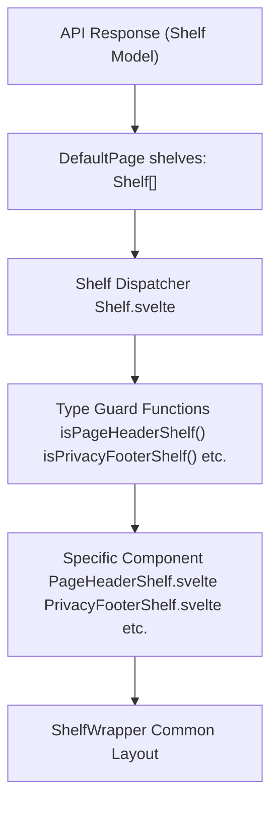
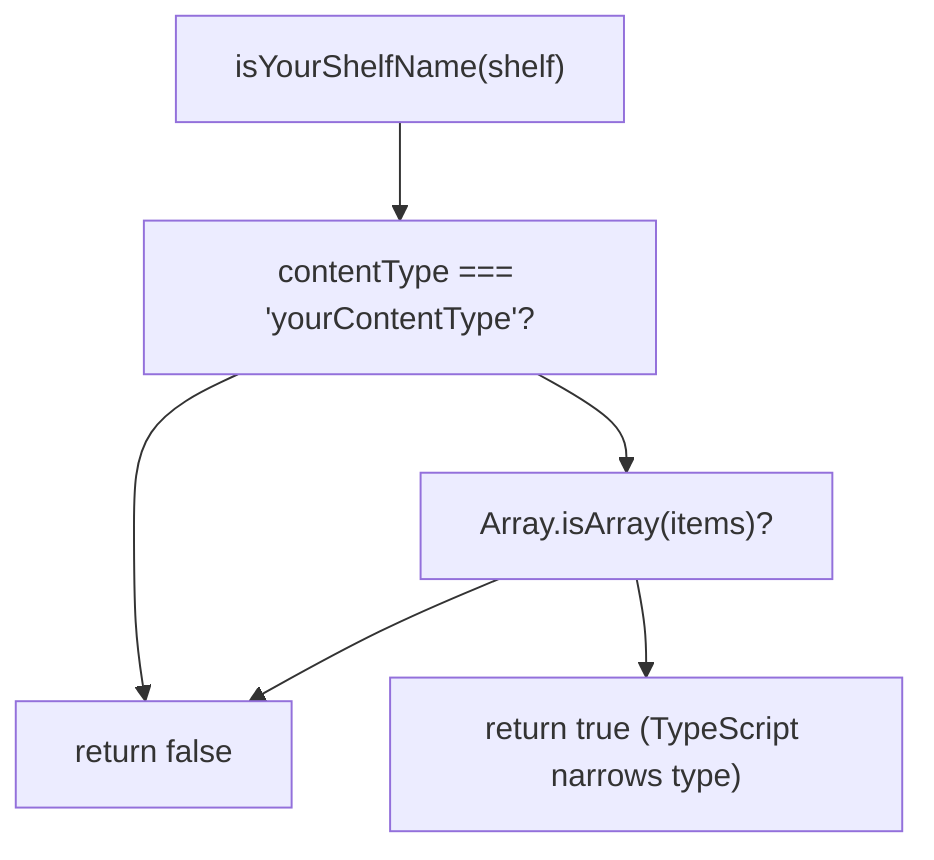
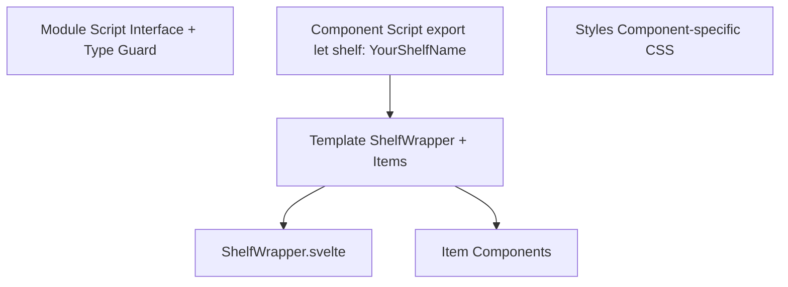
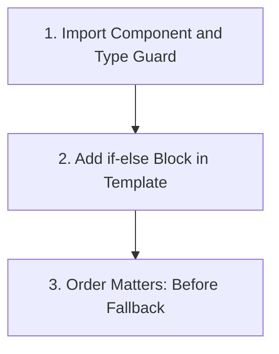

# Adding a New Shelf Type

-   [src/components/Shelf/Wrapper.svelte](https://github.com/Chesszyh/apps.apple.com/blob/279d0c4d/src/components/Shelf/Wrapper.svelte)
-   [src/components/jet/shelf/ArcadeFooterShelf.svelte](https://github.com/Chesszyh/apps.apple.com/blob/279d0c4d/src/components/jet/shelf/ArcadeFooterShelf.svelte)
-   [src/components/jet/shelf/PageHeaderShelf.svelte](https://github.com/Chesszyh/apps.apple.com/blob/279d0c4d/src/components/jet/shelf/PageHeaderShelf.svelte)
-   [src/components/jet/shelf/PrivacyFooterShelf.svelte](https://github.com/Chesszyh/apps.apple.com/blob/279d0c4d/src/components/jet/shelf/PrivacyFooterShelf.svelte)
-   [src/components/jet/shelf/Shelf.svelte](https://github.com/Chesszyh/apps.apple.com/blob/279d0c4d/src/components/jet/shelf/Shelf.svelte)
-   [src/components/pages/DefaultPage.svelte](https://github.com/Chesszyh/apps.apple.com/blob/279d0c4d/src/components/pages/DefaultPage.svelte)

## Purpose and Scope

This guide provides step-by-step instructions for adding a new shelf type to the App Store web application. It covers the complete process from defining the TypeScript interface through registering the shelf with the dispatcher system.

For conceptual information about the shelf system architecture and type guard patterns, see [Shelf System](#4.2). For documentation of existing shelf types, see [Shelf Type Reference](#7). For information about common layout patterns provided by `ShelfWrapper`, see [Shelf Wrapper and Common Layout](#4.4).

---

## Shelf System Overview

The shelf system uses a dispatcher pattern where the `Shelf` component ([src/components/jet/shelf/Shelf.svelte195-320](https://github.com/Chesszyh/apps.apple.com/blob/279d0c4d/src/components/jet/shelf/Shelf.svelte#L195-L320)) acts as a central router. It receives a generic `Shelf` model from the API and uses type guard functions to narrow the type and delegate rendering to specific components.


**Diagram: Shelf Rendering Flow**

Sources: [src/components/jet/shelf/Shelf.svelte1-321](https://github.com/Chesszyh/apps.apple.com/blob/279d0c4d/src/components/jet/shelf/Shelf.svelte#L1-L321) [src/components/pages/DefaultPage.svelte113-124](https://github.com/Chesszyh/apps.apple.com/blob/279d0c4d/src/components/pages/DefaultPage.svelte#L113-L124)

---

## Step 1: Define the Shelf Interface

Each shelf type requires a TypeScript interface that extends the base `Shelf` model and specifies the expected `items` structure.

### Interface Pattern

Create your interface in the `context="module"` script block of your component file:

```
interface YourShelfName extends Shelf {    items: [YourItemType];}
```
### Example: PageHeaderShelf

The `PageHeaderShelf` interface defines a shelf containing exactly one `PageHeader` item:

[src/components/jet/shelf/PageHeaderShelf.svelte1-11](https://github.com/Chesszyh/apps.apple.com/blob/279d0c4d/src/components/jet/shelf/PageHeaderShelf.svelte#L1-L11)

### Example: PrivacyFooterShelf

The `PrivacyFooterShelf` interface defines a shelf containing exactly one `PrivacyFooter` item:

[src/components/jet/shelf/PrivacyFooterShelf.svelte1-14](https://github.com/Chesszyh/apps.apple.com/blob/279d0c4d/src/components/jet/shelf/PrivacyFooterShelf.svelte#L1-L14)

### Key Considerations

| Aspect | Guideline |
| --- | --- |
| **Module Context** | Define interface in `<script lang="ts" context="module">` for type-level exports |
| **Base Extension** | Always extend `Shelf` from `@jet-app/app-store/api/models` |
| **Items Type** | Use tuple types like `[ItemType]` for single items or `ItemType[]` for arrays |
| **Naming Convention** | Follow pattern: `{Descriptor}{Purpose}Shelf` |

Sources: [src/components/jet/shelf/PageHeaderShelf.svelte1-11](https://github.com/Chesszyh/apps.apple.com/blob/279d0c4d/src/components/jet/shelf/PageHeaderShelf.svelte#L1-L11) [src/components/jet/shelf/PrivacyFooterShelf.svelte1-14](https://github.com/Chesszyh/apps.apple.com/blob/279d0c4d/src/components/jet/shelf/PrivacyFooterShelf.svelte#L1-L14)

---

## Step 2: Create the Type Guard Function

Type guard functions enable TypeScript to narrow the generic `Shelf` type to your specific shelf interface. They must be exported from the module context.

### Type Guard Pattern

```
export function isYourShelfName(shelf: Shelf): shelf is YourShelfName {    const { contentType, items } = shelf;    return contentType === 'yourContentType' && Array.isArray(items);}
```
### Type Guard Decision Tree


**Diagram: Type Guard Evaluation Flow**

### Example Implementations

**Simple Type Guard (PageHeaderShelf):**

[src/components/jet/shelf/PageHeaderShelf.svelte8-11](https://github.com/Chesszyh/apps.apple.com/blob/279d0c4d/src/components/jet/shelf/PageHeaderShelf.svelte#L8-L11)

**Type Guard with Additional Validation (PrivacyFooterShelf):**

[src/components/jet/shelf/PrivacyFooterShelf.svelte8-14](https://github.com/Chesszyh/apps.apple.com/blob/279d0c4d/src/components/jet/shelf/PrivacyFooterShelf.svelte#L8-L14)

### Type Guard Requirements

| Requirement | Purpose |
| --- | --- |
| **Export function** | Make available for import in `Shelf.svelte` dispatcher |
| **Return type annotation** | Use `shelf is YourShelfName` for type narrowing |
| **contentType check** | Match the API's `contentType` string exactly |
| **items validation** | Verify `items` array exists |
| **Additional checks** | Add item length or property checks as needed |

Sources: [src/components/jet/shelf/PageHeaderShelf.svelte8-11](https://github.com/Chesszyh/apps.apple.com/blob/279d0c4d/src/components/jet/shelf/PageHeaderShelf.svelte#L8-L11) [src/components/jet/shelf/PrivacyFooterShelf.svelte8-14](https://github.com/Chesszyh/apps.apple.com/blob/279d0c4d/src/components/jet/shelf/PrivacyFooterShelf.svelte#L8-L14)

---

## Step 3: Implement the Shelf Component

Create a Svelte component that receives the typed shelf prop and renders its content.

### Component Structure


**Diagram: Shelf Component Architecture**

### Minimal Component Template

Your component should follow this structure:

1.  **Module Script**: Interface and type guard (see Steps 1-2)
2.  **Component Script**: Accept typed shelf prop and extract data
3.  **Template**: Render using `ShelfWrapper` and item components
4.  **Styles**: Component-specific styling

### Example: PageHeaderShelf

[src/components/jet/shelf/PageHeaderShelf.svelte14-35](https://github.com/Chesszyh/apps.apple.com/blob/279d0c4d/src/components/jet/shelf/PageHeaderShelf.svelte#L14-L35)

Key aspects:

-   Typed shelf prop: `export let shelf: PageHeaderShelf`
-   Data extraction: `$: [item] = shelf.items` (reactive statement)
-   `ShelfWrapper` usage with custom title slot
-   Custom styling via scoped CSS

### Example: PrivacyFooterShelf

[src/components/jet/shelf/PrivacyFooterShelf.svelte17-41](https://github.com/Chesszyh/apps.apple.com/blob/279d0c4d/src/components/jet/shelf/PrivacyFooterShelf.svelte#L17-L41)

Key aspects:

-   Direct item access: `$: bodyText = shelf.items[0].bodyText`
-   `ShelfWrapper` with `centered` prop
-   Delegation to `LinkableTextItem` for rendering
-   Global style targeting for links

### Example: ArcadeFooterShelf

[src/components/jet/shelf/ArcadeFooterShelf.svelte17-33](https://github.com/Chesszyh/apps.apple.com/blob/279d0c4d/src/components/jet/shelf/ArcadeFooterShelf.svelte#L17-L33)

Key aspects:

-   Optional configuration: `$: gridRows = shelf.rowsPerColumn ?? undefined`
-   Composition with `HorizontalShelf` for scrolling behavior
-   Let bindings for item iteration: `let:item`

### ShelfWrapper Integration

Most shelves use `ShelfWrapper` to provide consistent layout. Common props:

| Prop | Type | Default | Purpose |
| --- | --- | --- | --- |
| `shelf` | `Shelf | undefined` | `undefined` | Provides shelf data for title/id |
| `centered` | `boolean` | `false` | Constrains width and centers content |
| `withTopBorder` | `boolean` | `false` | Adds top border line |
| `withTopMargin` | `boolean` | `false` | Adds top margin spacing |
| `withPaddingTop` | `boolean` | `true` | Adds top padding |
| `withBottomPadding` | `boolean` | `true` | Adds bottom padding |

Sources: [src/components/jet/shelf/PageHeaderShelf.svelte14-35](https://github.com/Chesszyh/apps.apple.com/blob/279d0c4d/src/components/jet/shelf/PageHeaderShelf.svelte#L14-L35) [src/components/jet/shelf/PrivacyFooterShelf.svelte17-41](https://github.com/Chesszyh/apps.apple.com/blob/279d0c4d/src/components/jet/shelf/PrivacyFooterShelf.svelte#L17-L41) [src/components/jet/shelf/ArcadeFooterShelf.svelte17-33](https://github.com/Chesszyh/apps.apple.com/blob/279d0c4d/src/components/jet/shelf/ArcadeFooterShelf.svelte#L17-L33) [src/components/Shelf/Wrapper.svelte1-82](https://github.com/Chesszyh/apps.apple.com/blob/279d0c4d/src/components/Shelf/Wrapper.svelte#L1-L82)

---

## Step 4: Register with the Shelf Dispatcher

The final step is registering your shelf type with the central dispatcher in `Shelf.svelte`.

### Registration Process


**Diagram: Dispatcher Registration Steps**

### 1\. Import the Component and Type Guard

Add imports at the top of `Shelf.svelte`:

```
import YourShelf, {    isYourShelf,} from '~/components/jet/shelf/YourShelf.svelte';
```
Example from existing code:

[src/components/jet/shelf/Shelf.svelte97-99](https://github.com/Chesszyh/apps.apple.com/blob/279d0c4d/src/components/jet/shelf/Shelf.svelte#L97-L99)

### 2\. Add Conditional Block to Template

Insert a new `{:else if}` block in the template's if-else chain:

```
{:else if isYourShelf(shelf)}    <YourShelf {shelf} />
```
Example from existing code:

[src/components/jet/shelf/Shelf.svelte270-271](https://github.com/Chesszyh/apps.apple.com/blob/279d0c4d/src/components/jet/shelf/Shelf.svelte#L270-L271)

### 3\. Placement Order

The order of conditional checks matters:

| Position | Purpose |
| --- | --- |
| **Top** | Most specific/common shelves for performance |
| **Middle** | Standard shelf types |
| **Before `isMarkerShelf`** | All regular shelves |
| **Before `isFallbackShelf`** | Catch-all must be last |

Current dispatcher structure:

[src/components/jet/shelf/Shelf.svelte205-320](https://github.com/Chesszyh/apps.apple.com/blob/279d0c4d/src/components/jet/shelf/Shelf.svelte#L205-L320)

### Complete Registration Example

Here's how `PageHeaderShelf` is registered:

**Import:** [src/components/jet/shelf/Shelf.svelte97-99](https://github.com/Chesszyh/apps.apple.com/blob/279d0c4d/src/components/jet/shelf/Shelf.svelte#L97-L99)

**Conditional:** [src/components/jet/shelf/Shelf.svelte270-271](https://github.com/Chesszyh/apps.apple.com/blob/279d0c4d/src/components/jet/shelf/Shelf.svelte#L270-L271)

Sources: [src/components/jet/shelf/Shelf.svelte1-321](https://github.com/Chesszyh/apps.apple.com/blob/279d0c4d/src/components/jet/shelf/Shelf.svelte#L1-L321)

---

## Best Practices

### Interface Design

| Practice | Rationale |
| --- | --- |
| Use tuple types `[ItemType]` for single items | Ensures exactly one item, prevents accidental array operations |
| Include optional properties only when needed | Keeps interface minimal and predictable |
| Extend `Shelf` from API models | Maintains compatibility with API responses |
| Export from module context | Enables type-level imports in other files |

### Type Guard Implementation

| Practice | Rationale |
| --- | --- |
| Check `contentType` first | Fast fail for non-matching shelves |
| Verify `items` is an array | Prevents runtime errors on iteration |
| Add length checks for fixed-size arrays | Catches malformed API responses early |
| Use `const` destructuring | Improves readability and performance |

### Component Organization

| Practice | Rationale |
| --- | --- |
| Use reactive statements (`$:`) for derived data | Ensures data stays synchronized with props |
| Destructure `shelf.items` early | Makes template code cleaner |
| Delegate to item components | Maintains separation of concerns |
| Use `ShelfWrapper` unless special layout needed | Ensures consistent spacing and title rendering |

### File Naming

Follow the existing convention:

```
{Descriptor}{Purpose}Shelf.svelte
```
Examples:

-   `PageHeaderShelf.svelte`
-   `PrivacyFooterShelf.svelte`
-   `ArcadeFooterShelf.svelte`
-   `ProductRatingsShelf.svelte`

Sources: [src/components/jet/shelf/PageHeaderShelf.svelte1-35](https://github.com/Chesszyh/apps.apple.com/blob/279d0c4d/src/components/jet/shelf/PageHeaderShelf.svelte#L1-L35) [src/components/jet/shelf/PrivacyFooterShelf.svelte1-41](https://github.com/Chesszyh/apps.apple.com/blob/279d0c4d/src/components/jet/shelf/PrivacyFooterShelf.svelte#L1-L41) [src/components/Shelf/Wrapper.svelte1-82](https://github.com/Chesszyh/apps.apple.com/blob/279d0c4d/src/components/Shelf/Wrapper.svelte#L1-L82)

---

## Complete Implementation Checklist

Use this checklist to ensure all steps are complete:

### Definition Phase

-   [ ]  Create new shelf component file with naming convention `{Descriptor}Shelf.svelte`
-   [ ]  Add module script block with TypeScript interface extending `Shelf`
-   [ ]  Define `items` type accurately (tuple for single items, array for multiple)
-   [ ]  Create and export type guard function with signature `(shelf: Shelf): shelf is YourShelf`

### Implementation Phase

-   [ ]  Add component script with typed shelf prop
-   [ ]  Extract item data using reactive statements
-   [ ]  Choose appropriate wrapper (usually `ShelfWrapper`)
-   [ ]  Configure wrapper props (`centered`, `withBottomPadding`, etc.)
-   [ ]  Implement item rendering (direct or via item components)
-   [ ]  Add component-specific styles if needed

### Registration Phase

-   [ ]  Import component and type guard in `Shelf.svelte`
-   [ ]  Add `{:else if isYourShelf(shelf)}` block in correct position
-   [ ]  Verify placement is before `isMarkerShelf` and `isFallbackShelf`
-   [ ]  Test with sample API data

### Validation Phase

-   [ ]  Verify type guard correctly identifies your shelf
-   [ ]  Confirm TypeScript provides correct type narrowing
-   [ ]  Test rendering with various viewport sizes
-   [ ]  Validate accessibility (keyboard navigation, screen readers)
-   [ ]  Check metrics integration if shelf tracks impressions

Sources: [src/components/jet/shelf/Shelf.svelte1-321](https://github.com/Chesszyh/apps.apple.com/blob/279d0c4d/src/components/jet/shelf/Shelf.svelte#L1-L321) [src/components/pages/DefaultPage.svelte113-124](https://github.com/Chesszyh/apps.apple.com/blob/279d0c4d/src/components/pages/DefaultPage.svelte#L113-L124)

---

## Example: Creating a Simple Shelf

Here's a complete walkthrough for creating a hypothetical `QuoteShelf`:

### 1\. Define Interface and Type Guard

```
<script lang="ts" context="module">    import type { Quote, Shelf } from '@jet-app/app-store/api/models';    interface QuoteShelf extends Shelf {        items: [Quote];    }    export function isQuoteShelf(shelf: Shelf): shelf is QuoteShelf {        const { contentType, items } = shelf;        return contentType === 'quote' && Array.isArray(items);    }</script>
```
### 2\. Implement Component

```
<script lang="ts">    import ShelfWrapper from '~/components/Shelf/Wrapper.svelte';    export let shelf: QuoteShelf;    $: [quote] = shelf.items;</script><ShelfWrapper {shelf} centered>    <blockquote>        <p>{quote.text}</p>        {#if quote.attribution}            <footer>— {quote.attribution}</footer>        {/if}    </blockquote></ShelfWrapper><style>    blockquote {        margin: 0;        padding: 20px;        font: var(--body-tall);        font-style: italic;    }    footer {        margin-top: 10px;        font-style: normal;        color: var(--systemSecondary);    }</style>
```
### 3\. Register in Shelf.svelte

Add import:

```
import QuoteShelf, {    isQuoteShelf,} from '~/components/jet/shelf/QuoteShelf.svelte';
```
Add conditional:

```
{:else if isQuoteShelf(shelf)}    <QuoteShelf {shelf} />
```
Sources: [src/components/jet/shelf/PageHeaderShelf.svelte1-35](https://github.com/Chesszyh/apps.apple.com/blob/279d0c4d/src/components/jet/shelf/PageHeaderShelf.svelte#L1-L35) [src/components/Shelf/Wrapper.svelte1-82](https://github.com/Chesszyh/apps.apple.com/blob/279d0c4d/src/components/Shelf/Wrapper.svelte#L1-L82) [src/components/jet/shelf/Shelf.svelte1-321](https://github.com/Chesszyh/apps.apple.com/blob/279d0c4d/src/components/jet/shelf/Shelf.svelte#L1-L321)

---

## Related Patterns

### Complex Shelves with Multiple Item Types

Some shelves iterate over multiple items or have complex layout requirements. Reference implementations:

-   **HorizontalShelf Pattern**: [ArcadeFooterShelf](https://github.com/Chesszyh/apps.apple.com/blob/279d0c4d/ArcadeFooterShelf) uses `HorizontalShelf` for scrollable grids
-   **Carousel Pattern**: See [Hero and Carousel Components](#5.4)
-   **Grid Pattern**: See [Lockup and Grid Shelves](#7.2)

### Shelves with Custom Actions

For shelves that need to handle user interactions beyond standard navigation:

-   **Modal Integration**: See [Modal Presentation](#4.3)
-   **Custom Actions**: See [Creating Custom Actions](#8.3)

### Metrics Integration

To track impressions and interactions:

-   **Impressions Tracking**: See [Impressions Tracking](#3.3)
-   **Custom Metrics**: See [Working with Metrics](#8.2)

Sources: [src/components/jet/shelf/ArcadeFooterShelf.svelte17-33](https://github.com/Chesszyh/apps.apple.com/blob/279d0c4d/src/components/jet/shelf/ArcadeFooterShelf.svelte#L17-L33)
