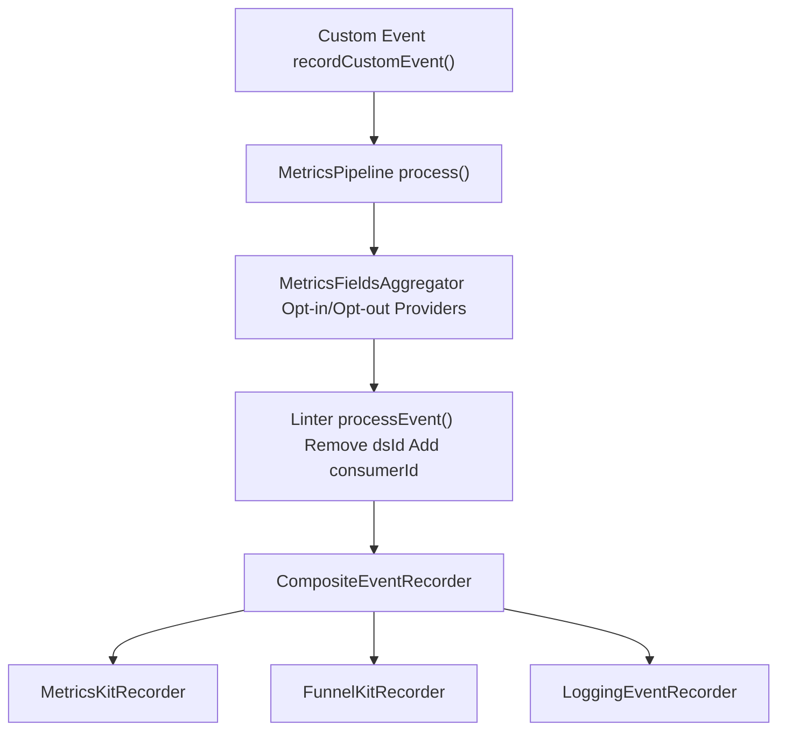
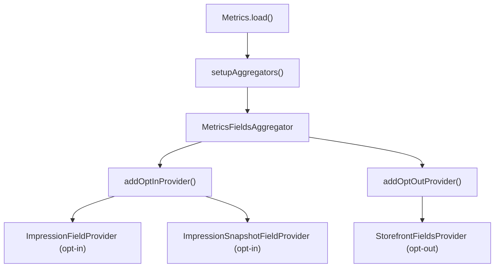
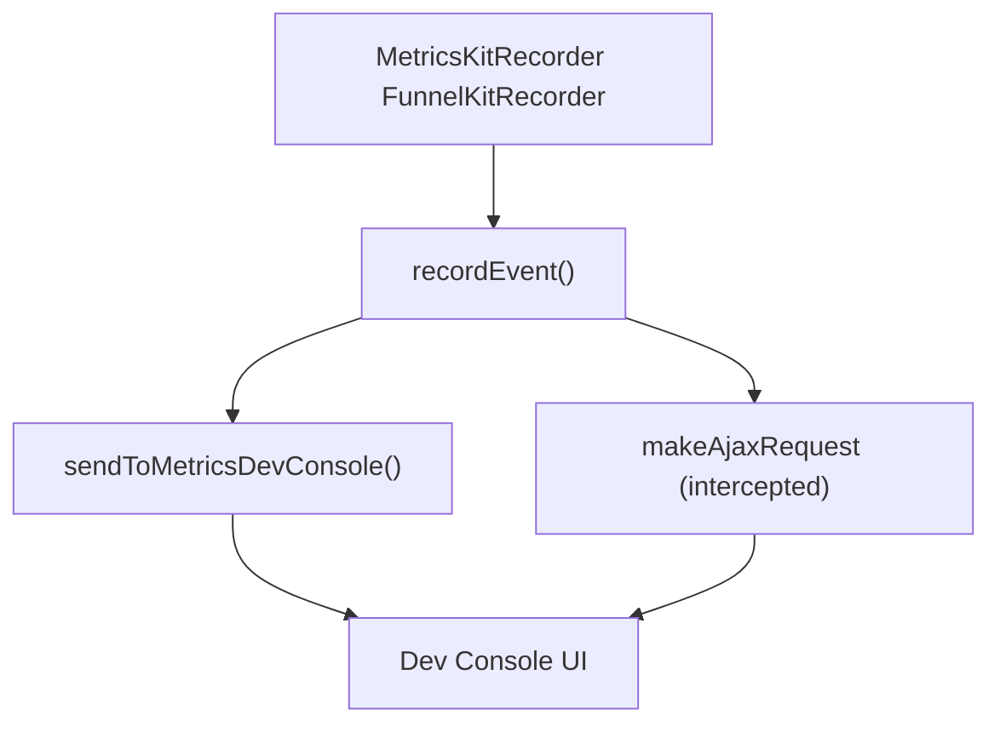

# Working with Metrics

-   [shared/metrics-8/src/impression-provider.ts](https://github.com/Chesszyh/apps.apple.com/blob/279d0c4d/shared/metrics-8/src/impression-provider.ts)
-   [shared/metrics-8/src/impression-snapshot-provider.ts](https://github.com/Chesszyh/apps.apple.com/blob/279d0c4d/shared/metrics-8/src/impression-snapshot-provider.ts)
-   [shared/metrics-8/src/impressions/index.ts](https://github.com/Chesszyh/apps.apple.com/blob/279d0c4d/shared/metrics-8/src/impressions/index.ts)
-   [shared/metrics-8/src/index.ts](https://github.com/Chesszyh/apps.apple.com/blob/279d0c4d/shared/metrics-8/src/index.ts)
-   [shared/metrics-8/src/recorder/composite.ts](https://github.com/Chesszyh/apps.apple.com/blob/279d0c4d/shared/metrics-8/src/recorder/composite.ts)
-   [shared/metrics-8/src/recorder/funnelkit.ts](https://github.com/Chesszyh/apps.apple.com/blob/279d0c4d/shared/metrics-8/src/recorder/funnelkit.ts)
-   [shared/metrics-8/src/recorder/logging.ts](https://github.com/Chesszyh/apps.apple.com/blob/279d0c4d/shared/metrics-8/src/recorder/logging.ts)
-   [shared/metrics-8/src/recorder/metricskit.ts](https://github.com/Chesszyh/apps.apple.com/blob/279d0c4d/shared/metrics-8/src/recorder/metricskit.ts)
-   [shared/metrics-8/src/recorder/void.ts](https://github.com/Chesszyh/apps.apple.com/blob/279d0c4d/shared/metrics-8/src/recorder/void.ts)
-   [src/jet/metrics/providers/StorefrontFieldsProvider.ts](https://github.com/Chesszyh/apps.apple.com/blob/279d0c4d/src/jet/metrics/providers/StorefrontFieldsProvider.ts)
-   [src/jet/metrics/providers/index.ts](https://github.com/Chesszyh/apps.apple.com/blob/279d0c4d/src/jet/metrics/providers/index.ts)

This guide provides practical instructions for developers working with the metrics system in the App Store web application. It covers how to emit custom metrics events, create custom metrics providers to add contextual fields, and debug metrics during development.

For architectural details about the metrics pipeline, see [Metrics Pipeline](#3.1). For information about impression tracking specifically, see [Impressions Tracking](#3.3). For details on event recorders and delivery mechanisms, see [Event Recorders](#3.2).

## Metrics Pipeline Overview

Before working with metrics, it's helpful to understand the processing flow. Events flow through a pipeline that aggregates fields, lints/normalizes data, and delivers to multiple recorders.


**Key Classes and Their Roles:**

| Class | Location | Purpose |
| --- | --- | --- |
| `Metrics` | [shared/metrics-8/src/index.ts91-444](https://github.com/Chesszyh/apps.apple.com/blob/279d0c4d/shared/metrics-8/src/index.ts#L91-L444) | Main class coordinating the metrics system |
| `MetricsPipeline` | Referenced in [shared/metrics-8/src/index.ts16](https://github.com/Chesszyh/apps.apple.com/blob/279d0c4d/shared/metrics-8/src/index.ts#L16-L16) | Orchestrates field aggregation and event processing |
| `MetricsFieldsAggregator` | Referenced in [shared/metrics-8/src/index.ts13](https://github.com/Chesszyh/apps.apple.com/blob/279d0c4d/shared/metrics-8/src/index.ts#L13-L13) | Combines fields from multiple providers |
| `CompositeEventRecorder` | [shared/metrics-8/src/recorder/composite.ts5-20](https://github.com/Chesszyh/apps.apple.com/blob/279d0c4d/shared/metrics-8/src/recorder/composite.ts#L5-L20) | Distributes events to multiple recorders |
| `MetricsKitRecorder` | [shared/metrics-8/src/recorder/metricskit.ts29-239](https://github.com/Chesszyh/apps.apple.com/blob/279d0c4d/shared/metrics-8/src/recorder/metricskit.ts#L29-L239) | Sends events to MetricsKit service |
| `FunnelKitRecorder` | [shared/metrics-8/src/recorder/funnelkit.ts28-237](https://github.com/Chesszyh/apps.apple.com/blob/279d0c4d/shared/metrics-8/src/recorder/funnelkit.ts#L28-L237) | Sends PII-filtered events to FunnelKit |
| `LoggingEventRecorder` | [shared/metrics-8/src/recorder/logging.ts6-21](https://github.com/Chesszyh/apps.apple.com/blob/279d0c4d/shared/metrics-8/src/recorder/logging.ts#L6-L21) | Logs events to console for debugging |

Sources: [shared/metrics-8/src/index.ts1-579](https://github.com/Chesszyh/apps.apple.com/blob/279d0c4d/shared/metrics-8/src/index.ts#L1-L579) [shared/metrics-8/src/recorder/composite.ts1-21](https://github.com/Chesszyh/apps.apple.com/blob/279d0c4d/shared/metrics-8/src/recorder/composite.ts#L1-L21)

## Emitting Custom Metrics Events

### Accessing the Metrics Instance

The `Metrics` instance is stored in Svelte context and can be accessed using the `generateMetricsContextGetter` helper:

```
import { generateMetricsContextGetter } from '@amp/web-apps-metrics-8';import { getContext } from 'svelte';const getMetrics = generateMetricsContextGetter(getContext);const metrics = getMetrics();
```
The `generateMetricsContextGetter` function returns a getter that retrieves the `Metrics` instance from context with error handling [shared/metrics-8/src/index.ts563-575](https://github.com/Chesszyh/apps.apple.com/blob/279d0c4d/shared/metrics-8/src/index.ts#L563-L575)

Sources: [shared/metrics-8/src/index.ts563-575](https://github.com/Chesszyh/apps.apple.com/blob/279d0c4d/shared/metrics-8/src/index.ts#L563-L575)

### Recording Events

To emit a custom metrics event, use the `recordCustomEvent` method:

```
await metrics.recordCustomEvent({    eventType: 'click',    actionType: 'navigate',    targetId: 'featured-app-123',    targetType: 'app',    // ... additional fields});
```
The `recordCustomEvent` method automatically merges current page metrics fields with the provided fields [shared/metrics-8/src/index.ts382-387](https://github.com/Chesszyh/apps.apple.com/blob/279d0c4d/shared/metrics-8/src/index.ts#L382-L387):

> **[Mermaid sequence]**
> *(图表结构无法解析)*

Sources: [shared/metrics-8/src/index.ts382-387](https://github.com/Chesszyh/apps.apple.com/blob/279d0c4d/shared/metrics-8/src/index.ts#L382-L387)

### Common Event Types

The system supports several standard event types defined in `METRICS_EVENT_TYPES`:

| Event Type | Purpose | Required Fields |
| --- | --- | --- |
| `enter` | App/page entry | `type` (launch, link, taskSwitch), `openUrl` |
| `exit` | App/page exit | `type` (close, taskSwitch) |
| `click` | User interaction | `actionType`, `targetId`, `targetType` |
| `navigate` | Page navigation | `targetUrl`, `targetId` |
| `impressions` | Visible content tracking | `impressions` array |

The MetricsKit recorder validates event types and rejects invalid ones [shared/metrics-8/src/recorder/metricskit.ts66-77](https://github.com/Chesszyh/apps.apple.com/blob/279d0c4d/shared/metrics-8/src/recorder/metricskit.ts#L66-L77)

Sources: [shared/metrics-8/src/recorder/metricskit.ts55-194](https://github.com/Chesszyh/apps.apple.com/blob/279d0c4d/shared/metrics-8/src/recorder/metricskit.ts#L55-L194)

### Page Transition Events

The `Metrics` class provides lifecycle methods for page transitions:

```
// Before page changesmetrics.willPageTransition();// After entering a new pageawait metrics.didEnterPage(page);
```
The `willPageTransition` method captures impression snapshots before the page unloads [shared/metrics-8/src/index.ts284-286](https://github.com/Chesszyh/apps.apple.com/blob/279d0c4d/shared/metrics-8/src/index.ts#L284-L286) The `didEnterPage` method records exit events for the previous page and enter events for the new page [shared/metrics-8/src/index.ts288-311](https://github.com/Chesszyh/apps.apple.com/blob/279d0c4d/shared/metrics-8/src/index.ts#L288-L311)

Sources: [shared/metrics-8/src/index.ts284-311](https://github.com/Chesszyh/apps.apple.com/blob/279d0c4d/shared/metrics-8/src/index.ts#L284-L311)

## Creating Custom Metrics Providers

Metrics providers add contextual fields to all events. There are two types: opt-in providers (included only when explicitly requested) and opt-out providers (included by default).

### MetricsFieldsProvider Interface

Custom providers implement the `MetricsFieldsProvider` interface:

```
interface MetricsFieldsProvider {    addMetricsFields(        builder: MetricsFieldsBuilder,        context: MetricsFieldsContext    ): void;}
```
The provider receives a `builder` to add fields and a `context` object for runtime state.

Sources: Referenced in [shared/metrics-8/src/index.ts3-19](https://github.com/Chesszyh/apps.apple.com/blob/279d0c4d/shared/metrics-8/src/index.ts#L3-L19)

### Example: StorefrontFieldsProvider

Here's a real provider from the codebase that adds the storefront country code:

```
export class StorefrontFieldsProvider implements MetricsFieldsProvider {    constructor(private readonly objectGraph: AppStoreObjectGraph) {}    addMetricsFields(        builder: MetricsFieldsBuilder,        _context: MetricsFieldsContext,    ) {        const { storefront } = getLocale(this.objectGraph);        builder.addValue(storefront, 'storeFrontCountryCode');    }}
```
This provider extracts the storefront from the locale system and adds it to all events [src/jet/metrics/providers/StorefrontFieldsProvider.ts9-19](https://github.com/Chesszyh/apps.apple.com/blob/279d0c4d/src/jet/metrics/providers/StorefrontFieldsProvider.ts#L9-L19)

Sources: [src/jet/metrics/providers/StorefrontFieldsProvider.ts1-20](https://github.com/Chesszyh/apps.apple.com/blob/279d0c4d/src/jet/metrics/providers/StorefrontFieldsProvider.ts#L1-L20)

### Registering Providers

Providers are registered during `Metrics.load()` initialization:


The `setupAggregators` function adds providers to the aggregator [shared/metrics-8/src/index.ts531-555](https://github.com/Chesszyh/apps.apple.com/blob/279d0c4d/shared/metrics-8/src/index.ts#L531-L555):

```
function setupAggregators(    metricsFieldsProviders: MetricsProvider[],    context: Map<string, unknown>,): MetricsFieldsAggregator {    const aggregator = MetricsFieldsAggregator.makeDefaultAggregator();    // Opt-in providers (included only when requested)    aggregator.addOptInProvider(        new ImpressionFieldProvider(context),        'impressions',    );    aggregator.addOptInProvider(        new ImpressionSnapshotFieldProvider(context),        'impressionsSnapshot',    );    // Opt-out providers (included by default)    metricsFieldsProviders.forEach((metricsFields) => {        aggregator.addOptOutProvider(            metricsFields.provider,            metricsFields.request,        );    });    return aggregator;}
```
Sources: [shared/metrics-8/src/index.ts531-555](https://github.com/Chesszyh/apps.apple.com/blob/279d0c4d/shared/metrics-8/src/index.ts#L531-L555) [src/jet/metrics/providers/index.ts1-16](https://github.com/Chesszyh/apps.apple.com/blob/279d0c4d/src/jet/metrics/providers/index.ts#L1-L16)

### Provider Registration Pattern

To add a custom provider to your application:

1.  **Create the provider class** implementing `MetricsFieldsProvider`
2.  **Export it from a providers module** like [src/jet/metrics/providers/index.ts6-15](https://github.com/Chesszyh/apps.apple.com/blob/279d0c4d/src/jet/metrics/providers/index.ts#L6-L15)
3.  **Pass it to `Metrics.load()`** in the `listofMetricProviders` parameter

```
const providers = makeMetricsProviders(objectGraph);const metrics = Metrics.load(    loggerFactory,    context,    processEvent,    config,    providers, // Your custom providers here    settings,);
```
Sources: [src/jet/metrics/providers/index.ts1-16](https://github.com/Chesszyh/apps.apple.com/blob/279d0c4d/src/jet/metrics/providers/index.ts#L1-L16) [shared/metrics-8/src/index.ts108-263](https://github.com/Chesszyh/apps.apple.com/blob/279d0c4d/shared/metrics-8/src/index.ts#L108-L263)

### Opt-In vs Opt-Out Providers

**Opt-Out Providers:**

-   Fields are added to all events by default
-   Can be excluded by adding the provider's name to `excludingFields` in `MetricsData`
-   Use for fields that should be present unless explicitly removed
-   Example: `StorefrontFieldsProvider` adds storefront to all events

**Opt-In Providers:**

-   Fields are added only when explicitly requested
-   Must be included by adding the provider's name to `includingFields` in `MetricsData`
-   Use for expensive computations or fields only needed for specific event types
-   Example: `ImpressionFieldProvider` adds impression data only when requested

Sources: [shared/metrics-8/src/index.ts531-555](https://github.com/Chesszyh/apps.apple.com/blob/279d0c4d/shared/metrics-8/src/index.ts#L531-L555)

## Debugging Metrics

### Logging Events to Console

The `LoggingEventRecorder` is automatically enabled and logs all metrics events to the console [shared/metrics-8/src/recorder/logging.ts6-21](https://github.com/Chesszyh/apps.apple.com/blob/279d0c4d/shared/metrics-8/src/recorder/logging.ts#L6-L21):

```
export class LoggingEventRecorder implements MetricsEventRecorder {    private readonly log: Logger;    constructor(loggerFactory: LoggerFactory) {        this.log = loggerFactory.loggerFor('LoggingEventRecorder');    }    record(event: LintedMetricsEvent, topic: Opt<string>): void {        this.log.info('logged metrics event:', event, topic);    }}
```
Events appear in the browser console with the prefix "LoggingEventRecorder".

Sources: [shared/metrics-8/src/recorder/logging.ts1-22](https://github.com/Chesszyh/apps.apple.com/blob/279d0c4d/shared/metrics-8/src/recorder/logging.ts#L1-L22)

### Metrics Dev Console

For internal builds (`APP_SCOPE === 'internal'`), the system includes a development console that captures network requests to MetricsKit and FunnelKit services [shared/metrics-8/src/index.ts458-473](https://github.com/Chesszyh/apps.apple.com/blob/279d0c4d/shared/metrics-8/src/index.ts#L458-L473)

The dev console intercepts network calls and logs them separately for inspection:


The `sendToMetricsDevConsole` function is called after each successful event recording [shared/metrics-8/src/recorder/metricskit.ts168-171](https://github.com/Chesszyh/apps.apple.com/blob/279d0c4d/shared/metrics-8/src/recorder/metricskit.ts#L168-L171)

Sources: [shared/metrics-8/src/index.ts458-473](https://github.com/Chesszyh/apps.apple.com/blob/279d0c4d/shared/metrics-8/src/index.ts#L458-L473) [shared/metrics-8/src/recorder/metricskit.ts110-113](https://github.com/Chesszyh/apps.apple.com/blob/279d0c4d/shared/metrics-8/src/recorder/metricskit.ts#L110-L113)

### Inspecting Deferred Events

Both `MetricsKitRecorder` and `FunnelKitRecorder` queue events before their underlying services are initialized. You can inspect these queues:

```
class MetricsKitRecorder {    private readonly deferredEvents: DeferredEvent[];        record(event: LintedMetricsEvent, topic: Opt<string>): void {        if (this.eventRecorder) {            // Process immediately        } else {            // Queue for later            this.deferredEvents.push({ event, topic });        }    }}
```
Deferred events are automatically processed once `setupEventRecorder` is called [shared/metrics-8/src/recorder/metricskit.ts203-213](https://github.com/Chesszyh/apps.apple.com/blob/279d0c4d/shared/metrics-8/src/recorder/metricskit.ts#L203-L213)

Sources: [shared/metrics-8/src/recorder/metricskit.ts38-213](https://github.com/Chesszyh/apps.apple.com/blob/279d0c4d/shared/metrics-8/src/recorder/metricskit.ts#L38-L213) [shared/metrics-8/src/recorder/funnelkit.ts36-218](https://github.com/Chesszyh/apps.apple.com/blob/279d0c4d/shared/metrics-8/src/recorder/funnelkit.ts#L36-L218)

### Enabling/Disabling Recorders

You can dynamically enable or disable individual recorders:

```
// Disable MetricsKit eventsmetrics.disableMetrics();// Re-enable MetricsKit eventsmetrics.enableMetrics();// Enable FunnelKit (if configured)metrics.enableFunnelKit();// Disable FunnelKitmetrics.disableFunnelKit();
```
The `MetricsKitRecorder` checks its enabled state before recording [shared/metrics-8/src/recorder/metricskit.ts57-63](https://github.com/Chesszyh/apps.apple.com/blob/279d0c4d/shared/metrics-8/src/recorder/metricskit.ts#L57-L63):

```
record(event: LintedMetricsEvent, topic: Opt<string>): void {    if (this.isDisabled()) {        this.log.info(            `topic ${this.config.topic} is disabled following event not captured:`,            event,        );        return;    }    // ... process event}
```
Sources: [shared/metrics-8/src/index.ts426-443](https://github.com/Chesszyh/apps.apple.com/blob/279d0c4d/shared/metrics-8/src/index.ts#L426-L443) [shared/metrics-8/src/recorder/metricskit.ts215-238](https://github.com/Chesszyh/apps.apple.com/blob/279d0c4d/shared/metrics-8/src/recorder/metricskit.ts#L215-L238)

### Verifying Event Fields

The linter in the pipeline performs validation and normalization:

1.  **Removes `dsId` field** - Added by other systems but not needed for web [shared/metrics-8/src/index.ts182-186](https://github.com/Chesszyh/apps.apple.com/blob/279d0c4d/shared/metrics-8/src/index.ts#L182-L186)
2.  **Adds `consumerId`** - Dynamically fetched at event time for authenticated users [shared/metrics-8/src/index.ts188-193](https://github.com/Chesszyh/apps.apple.com/blob/279d0c4d/shared/metrics-8/src/index.ts#L188-L193)
3.  **Validates `eventType`** - MetricsKit recorder rejects invalid event types [shared/metrics-8/src/recorder/metricskit.ts68-77](https://github.com/Chesszyh/apps.apple.com/blob/279d0c4d/shared/metrics-8/src/recorder/metricskit.ts#L68-L77)

To debug field processing, examine the logged events which include the fully processed fields after aggregation and linting.

Sources: [shared/metrics-8/src/index.ts178-199](https://github.com/Chesszyh/apps.apple.com/blob/279d0c4d/shared/metrics-8/src/index.ts#L178-L199) [shared/metrics-8/src/recorder/metricskit.ts55-84](https://github.com/Chesszyh/apps.apple.com/blob/279d0c4d/shared/metrics-8/src/recorder/metricskit.ts#L55-L84)

## Common Patterns

### Recording Click Events with Navigation

When a click should navigate to a new page, capture the impression snapshot before navigation:

```
metrics.willPageTransition();await metrics.recordCustomEvent({    eventType: 'click',    actionType: 'navigate',    targetUrl: '/apps/app/123',    targetId: '123',    targetType: 'app',});
```
The `willPageTransition` call ensures impression data is captured at the correct moment [shared/metrics-8/src/index.ts284-286](https://github.com/Chesszyh/apps.apple.com/blob/279d0c4d/shared/metrics-8/src/index.ts#L284-L286)

Sources: [shared/metrics-8/src/index.ts284-286](https://github.com/Chesszyh/apps.apple.com/blob/279d0c4d/shared/metrics-8/src/index.ts#L284-L286) [shared/metrics-8/src/recorder/metricskit.ts86-91](https://github.com/Chesszyh/apps.apple.com/blob/279d0c4d/shared/metrics-8/src/recorder/metricskit.ts#L86-L91)

### Flushing Events on Page Exit

Exit events automatically trigger a flush of unreported events to ensure data isn't lost [shared/metrics-8/src/recorder/metricskit.ts184-189](https://github.com/Chesszyh/apps.apple.com/blob/279d0c4d/shared/metrics-8/src/recorder/metricskit.ts#L184-L189):

```
// on exit events we should flush all metricsif (eventHandler === 'exit') {    this.eventRecorder?.flushUnreportedEvents?.(true);    sendToMetricsDevConsole(        { metricsDevType: eventType.FLUSH, status: 'SUCCESS' },        topic,    );}
```
This is handled automatically; you don't need to explicitly call flush for exit events.

Sources: [shared/metrics-8/src/recorder/metricskit.ts184-190](https://github.com/Chesszyh/apps.apple.com/blob/279d0c4d/shared/metrics-8/src/recorder/metricskit.ts#L184-L190) [shared/metrics-8/src/recorder/funnelkit.ts181-190](https://github.com/Chesszyh/apps.apple.com/blob/279d0c4d/shared/metrics-8/src/recorder/funnelkit.ts#L181-L190)

### Server-Side Rendering

On the server, metrics are disabled by creating a `VoidEventRecorder` that discards all events [shared/metrics-8/src/index.ts125-139](https://github.com/Chesszyh/apps.apple.com/blob/279d0c4d/shared/metrics-8/src/index.ts#L125-L139):

```
if (typeof window === 'undefined' || suppressMetricsKit) {    const recorder = new VoidEventRecorder();    const metricsPipeline = new MetricsPipeline({        aggregator: new MetricsFieldsAggregator(),        linter: {            async processEvent(fields: MetricsFields): Promise<LintedMetricsEvent> {                return { fields };            },        },        recorder,    });    return new Metrics(log, metricsPipeline, config);}
```
The `VoidEventRecorder` counts events but doesn't send them anywhere [shared/metrics-8/src/recorder/void.ts5-17](https://github.com/Chesszyh/apps.apple.com/blob/279d0c4d/shared/metrics-8/src/recorder/void.ts#L5-L17)

Sources: [shared/metrics-8/src/index.ts124-140](https://github.com/Chesszyh/apps.apple.com/blob/279d0c4d/shared/metrics-8/src/index.ts#L124-L140) [shared/metrics-8/src/recorder/void.ts1-18](https://github.com/Chesszyh/apps.apple.com/blob/279d0c4d/shared/metrics-8/src/recorder/void.ts#L1-L18)

### Working with Page Metrics

Current page metrics are automatically included in all custom events via `currentPageMetrics`:

```
async recordCustomEvent(fields?: Opt<MetricsFields>) {    await this.processEvent({        ...this.currentPageMetrics?.pageMetrics?.pageFields,        ...fields,    });}
```
The `currentPageMetrics` is updated by `didEnterPage` and includes fields like `pageId`, `pageType`, and `pageContext` from the current page [shared/metrics-8/src/index.ts296-301](https://github.com/Chesszyh/apps.apple.com/blob/279d0c4d/shared/metrics-8/src/index.ts#L296-L301)

Sources: [shared/metrics-8/src/index.ts382-387](https://github.com/Chesszyh/apps.apple.com/blob/279d0c4d/shared/metrics-8/src/index.ts#L382-L387) [shared/metrics-8/src/index.ts296-301](https://github.com/Chesszyh/apps.apple.com/blob/279d0c4d/shared/metrics-8/src/index.ts#L296-L301)
