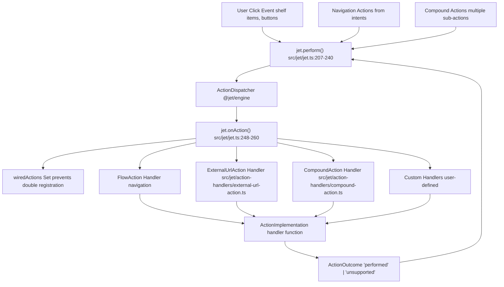
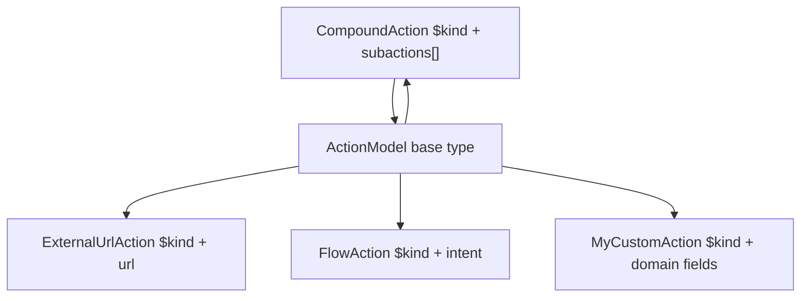
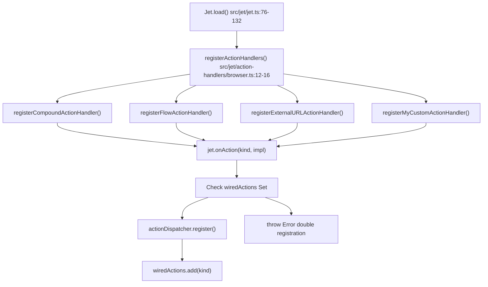
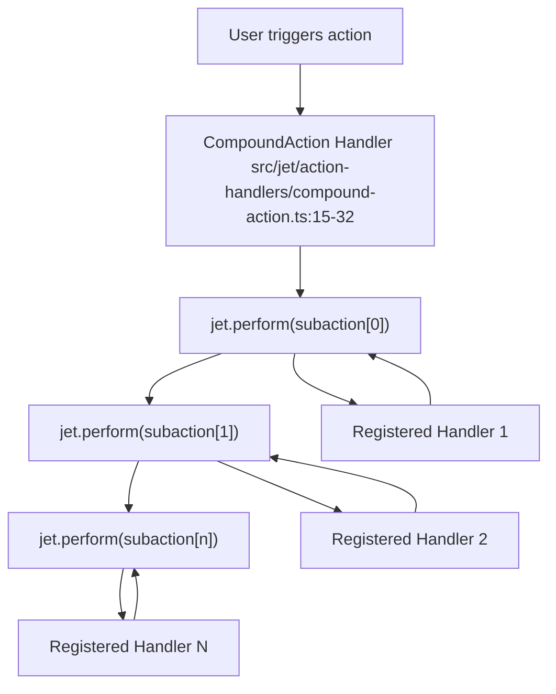
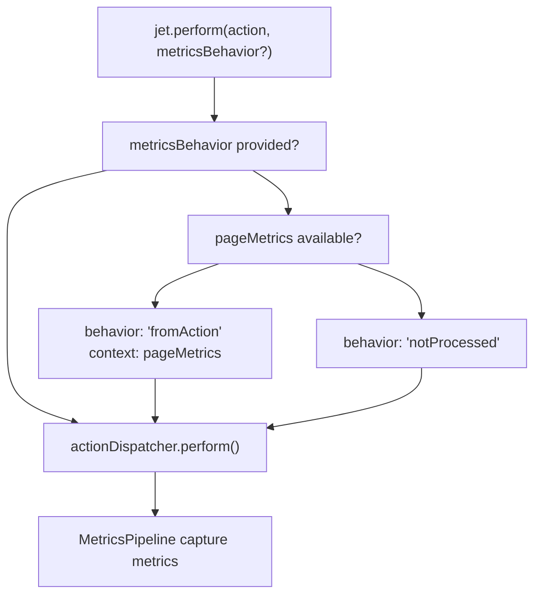

# Creating Custom Actions

-   [src/jet/action-handlers/browser.ts](https://github.com/Chesszyh/apps.apple.com/blob/279d0c4d/src/jet/action-handlers/browser.ts)
-   [src/jet/action-handlers/compound-action.ts](https://github.com/Chesszyh/apps.apple.com/blob/279d0c4d/src/jet/action-handlers/compound-action.ts)
-   [src/jet/action-handlers/external-url-action.ts](https://github.com/Chesszyh/apps.apple.com/blob/279d0c4d/src/jet/action-handlers/external-url-action.ts)
-   [src/jet/bootstrap.ts](https://github.com/Chesszyh/apps.apple.com/blob/279d0c4d/src/jet/bootstrap.ts)
-   [src/jet/intents/route-url/route-url-controller.ts](https://github.com/Chesszyh/apps.apple.com/blob/279d0c4d/src/jet/intents/route-url/route-url-controller.ts)
-   [src/jet/intents/route-url/route-url-intent.ts](https://github.com/Chesszyh/apps.apple.com/blob/279d0c4d/src/jet/intents/route-url/route-url-intent.ts)
-   [src/jet/intents/static-message-pages/carrier-page-intent-controller.ts](https://github.com/Chesszyh/apps.apple.com/blob/279d0c4d/src/jet/intents/static-message-pages/carrier-page-intent-controller.ts)
-   [src/jet/intents/static-message-pages/contingent-price-page-intent-controller.ts](https://github.com/Chesszyh/apps.apple.com/blob/279d0c4d/src/jet/intents/static-message-pages/contingent-price-page-intent-controller.ts)
-   [src/jet/intents/static-message-pages/invoice-page-intent-controller.ts](https://github.com/Chesszyh/apps.apple.com/blob/279d0c4d/src/jet/intents/static-message-pages/invoice-page-intent-controller.ts)
-   [src/jet/jet.ts](https://github.com/Chesszyh/apps.apple.com/blob/279d0c4d/src/jet/jet.ts)
-   [src/jet/models/external-action.ts](https://github.com/Chesszyh/apps.apple.com/blob/279d0c4d/src/jet/models/external-action.ts)
-   [src/jet/svelte.ts](https://github.com/Chesszyh/apps.apple.com/blob/279d0c4d/src/jet/svelte.ts)

## Purpose and Scope

This guide explains how to define and implement custom action handlers in the App Store web application. Actions represent user interactions and system events that trigger application behavior, such as navigation, opening external URLs, or executing multiple operations in sequence.

For information about navigating between pages using intents, see [Intent and Action System](#2.2). For details on creating new page types, see [Creating Intent Controllers](#8.4). For metrics-related actions, see [Working with Metrics](#8.2).

---

## Action System Architecture

Actions in the App Store web application follow a centralized dispatch pattern. The `ActionDispatcher` routes action models to registered handler implementations based on the action's `$kind` field.


**Sources:** [src/jet/jet.ts1-320](https://github.com/Chesszyh/apps.apple.com/blob/279d0c4d/src/jet/jet.ts#L1-L320) [src/jet/action-handlers/browser.ts1-17](https://github.com/Chesszyh/apps.apple.com/blob/279d0c4d/src/jet/action-handlers/browser.ts#L1-L17)

### Key Components

| Component | Location | Purpose |
| --- | --- | --- |
| `Jet.perform()` | [src/jet/jet.ts207-240](https://github.com/Chesszyh/apps.apple.com/blob/279d0c4d/src/jet/jet.ts#L207-L240) | Entry point for executing actions |
| `Jet.onAction()` | [src/jet/jet.ts248-260](https://github.com/Chesszyh/apps.apple.com/blob/279d0c4d/src/jet/jet.ts#L248-L260) | Registers action handlers with the dispatcher |
| `ActionDispatcher` | [src/jet/jet.ts111-116](https://github.com/Chesszyh/apps.apple.com/blob/279d0c4d/src/jet/jet.ts#L111-L116) | Routes actions to registered handlers |
| `wiredActions` | [src/jet/jet.ts71-259](https://github.com/Chesszyh/apps.apple.com/blob/279d0c4d/src/jet/jet.ts#L71-L259) | Tracks registered action types to prevent duplicates |
| `ActionImplementation<A>` | [src/jet/jet.ts19-250](https://github.com/Chesszyh/apps.apple.com/blob/279d0c4d/src/jet/jet.ts#L19-L250) | Type signature for handler functions |
| `ActionOutcome` | [src/jet/jet.ts21-229](https://github.com/Chesszyh/apps.apple.com/blob/279d0c4d/src/jet/jet.ts#L21-L229) | Return type: `'performed'` or `'unsupported'` |

**Sources:** [src/jet/jet.ts1-320](https://github.com/Chesszyh/apps.apple.com/blob/279d0c4d/src/jet/jet.ts#L1-L320)

---

## Defining Action Models

Action models are plain objects that describe the action to be performed. All actions must include a `$kind` field that identifies the action type.

### Basic Action Model Structure

```
export interface MyCustomAction extends ActionModel {    $kind: 'MyCustomAction';        // Action-specific properties    targetId: string;    options?: {        animated: boolean;        delay?: number;    };}
```
### Action Model Patterns


**Sources:** [src/jet/models/external-action.ts1-8](https://github.com/Chesszyh/apps.apple.com/blob/279d0c4d/src/jet/models/external-action.ts#L1-L8) [src/jet/action-handlers/compound-action.ts3-15](https://github.com/Chesszyh/apps.apple.com/blob/279d0c4d/src/jet/action-handlers/compound-action.ts#L3-L15)

### Type Guard Pattern

Define a type guard function to safely identify your action type:

```
export function isMyCustomAction(    action: ActionModel): action is MyCustomAction {    return action.$kind === 'MyCustomAction';}
```
**Sources:** [src/jet/models/external-action.ts3-7](https://github.com/Chesszyh/apps.apple.com/blob/279d0c4d/src/jet/models/external-action.ts#L3-L7)

---

## Implementing Action Handlers

Action handlers are asynchronous functions that execute the action's behavior and return an `ActionOutcome`.

### Handler Implementation Pattern

> **[Mermaid sequence]**
> *(图表结构无法解析)*

**Sources:** [src/jet/jet.ts207-240](https://github.com/Chesszyh/apps.apple.com/blob/279d0c4d/src/jet/jet.ts#L207-L240) [src/jet/action-handlers/external-url-action.ts15-18](https://github.com/Chesszyh/apps.apple.com/blob/279d0c4d/src/jet/action-handlers/external-url-action.ts#L15-L18)

### Handler Function Structure

Create a handler registration function that follows the established pattern:

```
// src/jet/action-handlers/my-custom-action.tsimport type { Jet } from '~/jet';import type { LoggerFactory } from '@amp/web-apps-logger';import type { MyCustomAction } from '~/jet/models';export type Dependencies = {    jet: Jet;    logger: LoggerFactory;};export function registerHandler(dependencies: Dependencies) {    const { jet, logger } = dependencies;    const log = logger.loggerFor('jet/action-handlers/my-custom-action');    jet.onAction('MyCustomAction', async (action: MyCustomAction) => {        log.info('received MyCustomAction:', action);        try {            // Perform the action's work            await executeCustomLogic(action);                        return 'performed';        } catch (error) {            log.error('MyCustomAction failed:', error);            // Decide whether to throw or return 'unsupported'            throw error;        }    });}async function executeCustomLogic(action: MyCustomAction): Promise<void> {    // Implementation details}
```
**Sources:** [src/jet/action-handlers/external-url-action.ts1-20](https://github.com/Chesszyh/apps.apple.com/blob/279d0c4d/src/jet/action-handlers/external-url-action.ts#L1-L20) [src/jet/action-handlers/compound-action.ts1-34](https://github.com/Chesszyh/apps.apple.com/blob/279d0c4d/src/jet/action-handlers/compound-action.ts#L1-L34)

---

## Registering Action Handlers

Handlers must be registered during application bootstrap before any actions are performed.

### Registration Flow


**Sources:** [src/jet/action-handlers/browser.ts1-17](https://github.com/Chesszyh/apps.apple.com/blob/279d0c4d/src/jet/action-handlers/browser.ts#L1-L17) [src/jet/jet.ts248-260](https://github.com/Chesszyh/apps.apple.com/blob/279d0c4d/src/jet/jet.ts#L248-L260)

### Step 1: Add Handler to Browser Registration

Modify [src/jet/action-handlers/browser.ts](https://github.com/Chesszyh/apps.apple.com/blob/279d0c4d/src/jet/action-handlers/browser.ts) to import and register your handler:

```
// src/jet/action-handlers/browser.tsimport type { Dependencies } from './types';import { registerHandler as registerFlowActionHandler } from '~/jet/action-handlers/flow-action';import { registerHandler as registerExternalURLActionHandler } from '~/jet/action-handlers/external-url-action';import { registerHandler as registerCompoundActionHandler } from '~/jet/action-handlers/compound-action';import { registerHandler as registerMyCustomActionHandler } from '~/jet/action-handlers/my-custom-action';export type { Dependencies };export function registerActionHandlers(dependencies: Dependencies) {    registerCompoundActionHandler(dependencies);    registerFlowActionHandler(dependencies);    registerExternalURLActionHandler(dependencies);    registerMyCustomActionHandler(dependencies);  // Add your handler}
```
**Sources:** [src/jet/action-handlers/browser.ts1-17](https://github.com/Chesszyh/apps.apple.com/blob/279d0c4d/src/jet/action-handlers/browser.ts#L1-L17)

### Step 2: Verify Single Registration

The system automatically prevents double registration. If you attempt to register the same action `$kind` twice, an error is thrown:

```
// src/jet/jet.ts:248-260onAction<A extends ActionModel>(    kind: string,    implementation: ActionImplementation<A>,): void {    if (this.wiredActions.has(kind)) {        throw new Error(            `onAction called twice with the same action type: ${kind}`,        );    }    this.actionDispatcher.register(kind, implementation);    this.wiredActions.add(kind);}
```
**Sources:** [src/jet/jet.ts248-260](https://github.com/Chesszyh/apps.apple.com/blob/279d0c4d/src/jet/jet.ts#L248-L260)

---

## Recursive and Compound Actions

Some actions may need to trigger other actions. Use the compound action pattern to execute multiple actions in sequence.

### CompoundAction Example


**Sources:** [src/jet/action-handlers/compound-action.ts1-34](https://github.com/Chesszyh/apps.apple.com/blob/279d0c4d/src/jet/action-handlers/compound-action.ts#L1-L34)

### Implementing Recursive Action Logic

When your custom action needs to trigger other actions, use `jet.perform()` within your handler:

```
export function registerHandler(dependencies: Dependencies) {    const { jet, logger } = dependencies;    const log = logger.loggerFor('jet/action-handlers/my-compound-action');    jet.onAction('MyCompoundAction', async (action: MyCompoundAction) => {        log.info('executing compound action:', action);        // Execute pre-action logic        await setupRequiredState(action);        // Perform sub-actions sequentially        for (const subaction of action.steps) {            const outcome = await jet.perform(subaction);                        if (outcome === 'unsupported') {                log.error('sub-action not supported:', subaction);                // Decide how to handle unsupported sub-actions            }        }        // Execute post-action cleanup        await cleanupState(action);        return 'performed';    });}
```
**Sources:** [src/jet/action-handlers/compound-action.ts15-32](https://github.com/Chesszyh/apps.apple.com/blob/279d0c4d/src/jet/action-handlers/compound-action.ts#L15-L32)

---

## Accessing System Dependencies

Action handlers receive dependencies through the registration function. Common dependencies include:

| Dependency | Purpose | Access Pattern |
| --- | --- | --- |
| `jet` | Dispatch intents and actions | `jet.dispatch(intent)`, `jet.perform(action)` |
| `logger` | Structured logging | `logger.loggerFor('component-name')` |
| `jet.objectGraph` | Access injected services | `jet.objectGraph.get(ObjectGraphType.service)` |
| `jet.localization` | Localized strings | `jet.localization.getString(key)` |
| `jet.pageMetrics` | Current page metrics | `jet.pageMetrics?.pageFields` |

**Sources:** [src/jet/jet.ts48-174](https://github.com/Chesszyh/apps.apple.com/blob/279d0c4d/src/jet/jet.ts#L48-L174) [src/jet/action-handlers/external-url-action.ts5-8](https://github.com/Chesszyh/apps.apple.com/blob/279d0c4d/src/jet/action-handlers/external-url-action.ts#L5-L8)

### Accessing the ObjectGraph

```
export function registerHandler(dependencies: Dependencies) {    const { jet, logger } = dependencies;        jet.onAction('MyActionNeedingServices', async (action: MyAction) => {        // Access services from the object graph        const api = jet.objectGraph.apiClient;        const locale = jet.objectGraph.activeLocale;                // Use services in action implementation        const data = await api.fetch(action.endpoint);                return 'performed';    });}
```
**Sources:** [src/jet/jet.ts73-146](https://github.com/Chesszyh/apps.apple.com/blob/279d0c4d/src/jet/jet.ts#L73-L146)

---

## Metrics Integration

Actions automatically integrate with the metrics pipeline. The `metricsBehavior` parameter controls how metrics are captured.

### Metrics Behavior Flow


**Sources:** [src/jet/jet.ts207-240](https://github.com/Chesszyh/apps.apple.com/blob/279d0c4d/src/jet/jet.ts#L207-L240)

### Default Metrics Behavior

By default, actions use the current page metrics as context:

```
// src/jet/jet.ts:211-224if (!metricsBehavior) {    if (this.pageMetrics) {        metricsBehavior = {            behavior: 'fromAction',            context: this.pageMetrics || {},        };    } else {        this.log.warn(            'No pageMetrics found for jet.perform action:',            action,        );        metricsBehavior = { behavior: 'notProcessed' };    }}
```
**Sources:** [src/jet/jet.ts211-224](https://github.com/Chesszyh/apps.apple.com/blob/279d0c4d/src/jet/jet.ts#L211-L224)

---

## Testing Custom Actions

### Unit Testing Pattern

Create tests that verify your action handler's behavior in isolation:

```
import { describe, it, expect, vi } from 'vitest';import { registerHandler } from '~/jet/action-handlers/my-custom-action';import type { MyCustomAction } from '~/jet/models';describe('MyCustomAction Handler', () => {    it('should register with correct action kind', () => {        const mockJet = {            onAction: vi.fn(),        };        const mockLogger = {            loggerFor: vi.fn(() => ({                info: vi.fn(),                error: vi.fn(),            })),        };        registerHandler({ jet: mockJet, logger: mockLogger });        expect(mockJet.onAction).toHaveBeenCalledWith(            'MyCustomAction',            expect.any(Function)        );    });    it('should execute action successfully', async () => {        const handler = vi.fn().mockResolvedValue('performed');        const mockJet = {            onAction: (kind: string, impl: Function) => {                if (kind === 'MyCustomAction') handler.mockImplementation(impl);            },        };        registerHandler({ jet: mockJet, logger: mockLogger });        const action: MyCustomAction = {            $kind: 'MyCustomAction',            targetId: 'test-123',        };        const result = await handler(action);        expect(result).toBe('performed');    });});
```
### Integration Testing

Test the complete flow from `jet.perform()` through your handler:

```
it('should perform action through Jet instance', async () => {    const jet = Jet.load({ /* dependencies */ });        // Register your handler    registerMyCustomActionHandler({ jet, logger });        const action: MyCustomAction = {        $kind: 'MyCustomAction',        targetId: 'integration-test',    };        const outcome = await jet.perform(action);        expect(outcome).toBe('performed');});
```
---

## Error Handling Best Practices

### Pattern 1: Graceful Degradation

Log errors but return `'performed'` to indicate partial success:

```
jet.onAction('MyAction', async (action: MyAction) => {    try {        await criticalOperation(action);    } catch (error) {        log.error('Critical operation failed:', error);        // Fall back to default behavior        await fallbackOperation(action);    }        return 'performed';});
```
**Sources:** [src/jet/action-handlers/external-url-action.ts15-18](https://github.com/Chesszyh/apps.apple.com/blob/279d0c4d/src/jet/action-handlers/external-url-action.ts#L15-L18)

### Pattern 2: Error Propagation

Throw errors for failures that should halt execution:

```
jet.onAction('MyAction', async (action: MyAction) => {    try {        await requiredOperation(action);        return 'performed';    } catch (error) {        log.error('Required operation failed:', error);        throw new Error(`MyAction failed: ${error}`);    }});
```
**Sources:** [src/jet/action-handlers/compound-action.ts22-28](https://github.com/Chesszyh/apps.apple.com/blob/279d0c4d/src/jet/action-handlers/compound-action.ts#L22-L28)

### Pattern 3: Unsupported Actions

Return `'unsupported'` when the action cannot be handled:

```
jet.onAction('ConditionalAction', async (action: ConditionalAction) => {    if (!canHandleAction(action)) {        log.warn('Action cannot be handled in current state:', action);        return 'unsupported';    }        await handleAction(action);    return 'performed';});
```
**Sources:** [src/jet/jet.ts231-237](https://github.com/Chesszyh/apps.apple.com/blob/279d0c4d/src/jet/jet.ts#L231-L237)

---

## Complete Example: Custom Dialog Action

This example demonstrates a complete custom action implementation that shows a confirmation dialog.

### Step 1: Define the Action Model

```
// src/jet/models/dialog-action.tsimport type { ActionModel } from '~/jet/models';export interface DialogAction extends ActionModel {    $kind: 'DialogAction';        title: string;    message: string;    confirmText?: string;    cancelText?: string;    onConfirm?: ActionModel;    onCancel?: ActionModel;}export function isDialogAction(action: ActionModel): action is DialogAction {    return action.$kind === 'DialogAction';}
```
### Step 2: Implement the Handler

```
// src/jet/action-handlers/dialog-action.tsimport type { Jet } from '~/jet';import type { LoggerFactory } from '@amp/web-apps-logger';import type { DialogAction } from '~/jet/models/dialog-action';export type Dependencies = {    jet: Jet;    logger: LoggerFactory;};export function registerHandler(dependencies: Dependencies) {    const { jet, logger } = dependencies;    const log = logger.loggerFor('jet/action-handlers/dialog-action');    jet.onAction('DialogAction', async (action: DialogAction) => {        log.info('showing dialog:', action);        const confirmed = await showNativeDialog(            action.title,            action.message,            action.confirmText || 'OK',            action.cancelText || 'Cancel'        );        if (confirmed && action.onConfirm) {            await jet.perform(action.onConfirm);        } else if (!confirmed && action.onCancel) {            await jet.perform(action.onCancel);        }        return 'performed';    });}async function showNativeDialog(    title: string,    message: string,    confirmText: string,    cancelText: string): Promise<boolean> {    // Implementation would use browser dialog API    return window.confirm(`${title}\n\n${message}`);}
```
### Step 3: Register the Handler

```
// src/jet/action-handlers/browser.tsimport { registerHandler as registerDialogActionHandler } from '~/jet/action-handlers/dialog-action';export function registerActionHandlers(dependencies: Dependencies) {    registerCompoundActionHandler(dependencies);    registerFlowActionHandler(dependencies);    registerExternalURLActionHandler(dependencies);    registerDialogActionHandler(dependencies);}
```
### Step 4: Use the Action

```
// In a component or pageconst action: DialogAction = {    $kind: 'DialogAction',    title: 'Confirm Purchase',    message: 'Do you want to purchase this app?',    confirmText: 'Purchase',    cancelText: 'Not Now',    onConfirm: {        $kind: 'FlowAction',        intent: { /* navigation to purchase flow */ }    }};await jet.perform(action);
```
**Sources:** [src/jet/action-handlers/external-url-action.ts1-20](https://github.com/Chesszyh/apps.apple.com/blob/279d0c4d/src/jet/action-handlers/external-url-action.ts#L1-L20) [src/jet/action-handlers/compound-action.ts1-34](https://github.com/Chesszyh/apps.apple.com/blob/279d0c4d/src/jet/action-handlers/compound-action.ts#L1-L34) [src/jet/action-handlers/browser.ts1-17](https://github.com/Chesszyh/apps.apple.com/blob/279d0c4d/src/jet/action-handlers/browser.ts#L1-L17)

---

## Summary Checklist

When creating a custom action, ensure you:

-   [ ]  Define an `ActionModel` interface with a unique `$kind` value
-   [ ]  Create a type guard function (`isMyAction()`)
-   [ ]  Implement a `registerHandler()` function following the dependency pattern
-   [ ]  Use `jet.onAction(kind, implementation)` to register the handler
-   [ ]  Return `'performed'` on success or `'unsupported'` on failure
-   [ ]  Add the handler registration to [src/jet/action-handlers/browser.ts](https://github.com/Chesszyh/apps.apple.com/blob/279d0c4d/src/jet/action-handlers/browser.ts)
-   [ ]  Include structured logging using `logger.loggerFor()`
-   [ ]  Handle errors appropriately (throw, degrade gracefully, or return unsupported)
-   [ ]  Write unit tests for the action handler
-   [ ]  Document the action's purpose and expected behavior

**Sources:** [src/jet/jet.ts1-320](https://github.com/Chesszyh/apps.apple.com/blob/279d0c4d/src/jet/jet.ts#L1-L320) [src/jet/action-handlers/browser.ts1-17](https://github.com/Chesszyh/apps.apple.com/blob/279d0c4d/src/jet/action-handlers/browser.ts#L1-L17) [src/jet/action-handlers/external-url-action.ts1-20](https://github.com/Chesszyh/apps.apple.com/blob/279d0c4d/src/jet/action-handlers/external-url-action.ts#L1-L20)
