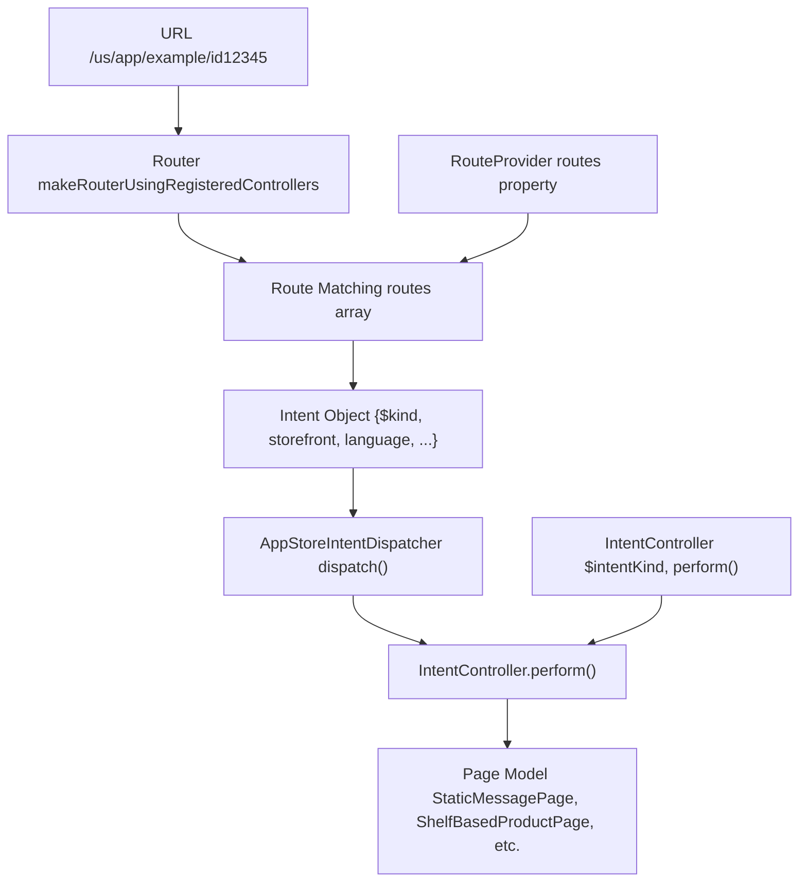
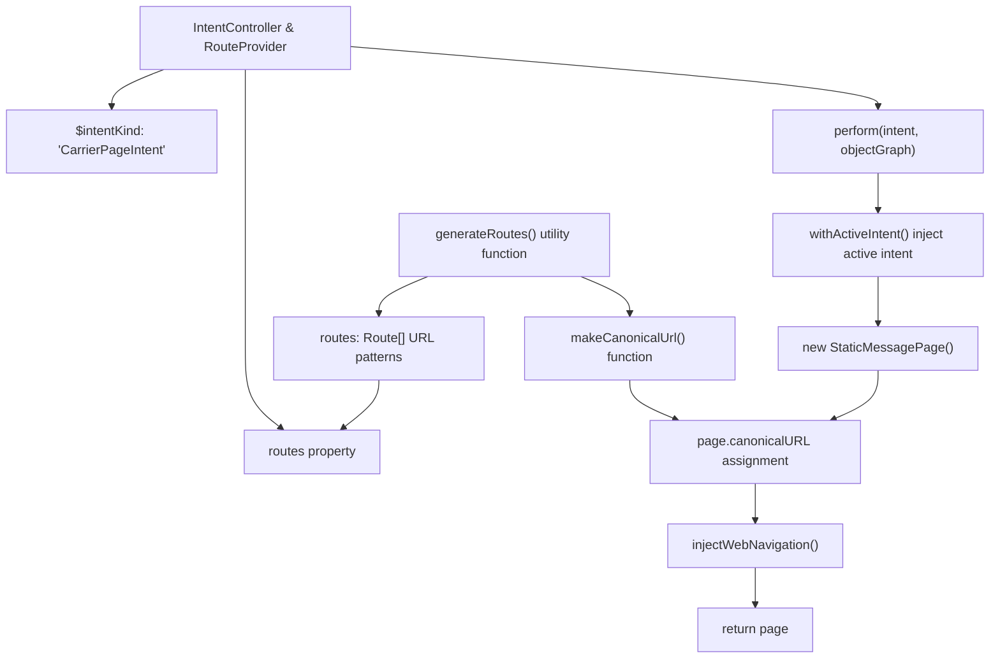
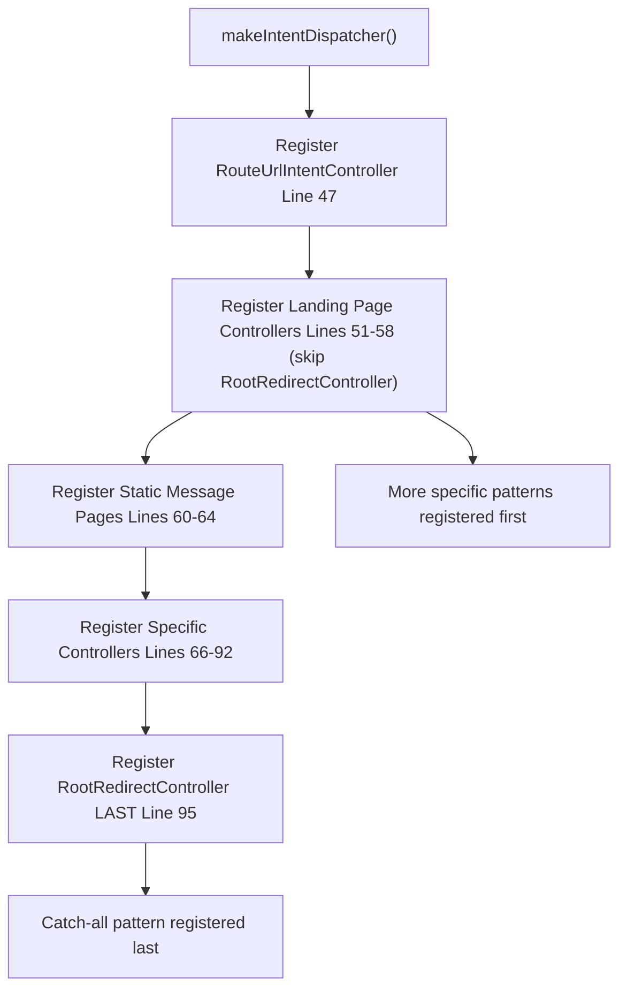

# Creating Intent Controllers

-   [src/jet/bootstrap.ts](https://github.com/Chesszyh/apps.apple.com/blob/279d0c4d/src/jet/bootstrap.ts)
-   [src/jet/intents/route-url/route-url-controller.ts](https://github.com/Chesszyh/apps.apple.com/blob/279d0c4d/src/jet/intents/route-url/route-url-controller.ts)
-   [src/jet/intents/route-url/route-url-intent.ts](https://github.com/Chesszyh/apps.apple.com/blob/279d0c4d/src/jet/intents/route-url/route-url-intent.ts)
-   [src/jet/intents/static-message-pages/carrier-page-intent-controller.ts](https://github.com/Chesszyh/apps.apple.com/blob/279d0c4d/src/jet/intents/static-message-pages/carrier-page-intent-controller.ts)
-   [src/jet/intents/static-message-pages/contingent-price-page-intent-controller.ts](https://github.com/Chesszyh/apps.apple.com/blob/279d0c4d/src/jet/intents/static-message-pages/contingent-price-page-intent-controller.ts)
-   [src/jet/intents/static-message-pages/invoice-page-intent-controller.ts](https://github.com/Chesszyh/apps.apple.com/blob/279d0c4d/src/jet/intents/static-message-pages/invoice-page-intent-controller.ts)

## Purpose and Scope

This guide explains how to implement new `IntentController` and `RouteProvider` instances to handle custom page types in the App Store web application. An intent controller is responsible for translating an intent (a request to display a specific type of page) into a page model that can be rendered by the UI layer.

For information about the broader intent and action system architecture, see [Intent and Action System](#2.2). For details on how intents are dispatched at runtime, see [Jet Application Core](#2.1). This guide focuses specifically on the practical steps of creating and registering new controllers.

## Overview of Intent Controllers and Route Providers

An `IntentController` handles the execution of a specific intent type. When an intent is dispatched, the controller's `perform()` method is called to produce a page model. A `RouteProvider` defines URL patterns that map to intents, enabling the router to convert incoming URLs into the appropriate intent objects.


**Sources:** [src/jet/bootstrap.ts1-126](https://github.com/Chesszyh/apps.apple.com/blob/279d0c4d/src/jet/bootstrap.ts#L1-L126) [src/jet/intents/route-url/route-url-controller.ts1-29](https://github.com/Chesszyh/apps.apple.com/blob/279d0c4d/src/jet/intents/route-url/route-url-controller.ts#L1-L29)

## Core Interfaces

An intent controller typically implements two interfaces:

| Interface | Purpose | Required Members |
| --- | --- | --- |
| `IntentController<TIntent>` | Defines intent handling logic | `$intentKind: string`
`perform(intent, objectGraph): Promise<TModel>` |
| `RouteProvider` | Defines URL routing rules | `routes: Route[]` |

The intent object extends the base `Intent<TModel>` interface and must include a `$kind` property that matches the controller's `$intentKind`.

**Sources:** [src/jet/intents/static-message-pages/carrier-page-intent-controller.ts18-22](https://github.com/Chesszyh/apps.apple.com/blob/279d0c4d/src/jet/intents/static-message-pages/carrier-page-intent-controller.ts#L18-L22)

## Anatomy of an Intent Controller

Here is the structure of a typical intent controller, using `CarrierPageIntentController` as an example:


**Sources:** [src/jet/intents/static-message-pages/carrier-page-intent-controller.ts1-42](https://github.com/Chesszyh/apps.apple.com/blob/279d0c4d/src/jet/intents/static-message-pages/carrier-page-intent-controller.ts#L1-L42)

## Step-by-Step: Creating a Simple Intent Controller

### Step 1: Define Route Generation

Use the `generateRoutes` utility to create route definitions and a canonical URL generator:

```
const { routes, makeCanonicalUrl } = generateRoutes(    (opts) => ({        ...opts,        $kind: 'MyCustomPageIntent',    }),    '/my-custom-path',);
```
The first argument is a function that creates the intent object from route options. The second argument is the URL pattern. This pattern supports path parameters like `/path/{paramName}`.

**Sources:** [src/jet/intents/static-message-pages/carrier-page-intent-controller.ts10-16](https://github.com/Chesszyh/apps.apple.com/blob/279d0c4d/src/jet/intents/static-message-pages/carrier-page-intent-controller.ts#L10-L16) [src/jet/intents/static-message-pages/contingent-price-page-intent-controller.ts10-24](https://github.com/Chesszyh/apps.apple.com/blob/279d0c4d/src/jet/intents/static-message-pages/contingent-price-page-intent-controller.ts#L10-L24)

### Step 2: Implement the Controller Object

Create an object that implements both `IntentController` and `RouteProvider`:

```
export const MyCustomPageIntentController: IntentController<any> & RouteProvider = {    $intentKind: 'MyCustomPageIntent',        routes,        async perform(intent, objectGraphWithoutActiveIntent: AppStoreObjectGraph) {        // Implementation here    },};
```
The `$intentKind` must match the `$kind` property in the intent object generated by your routes.

**Sources:** [src/jet/intents/static-message-pages/invoice-page-intent-controller.ts18-22](https://github.com/Chesszyh/apps.apple.com/blob/279d0c4d/src/jet/intents/static-message-pages/invoice-page-intent-controller.ts#L18-L22)

### Step 3: Implement the perform() Method

The `perform()` method receives the intent and an object graph, and returns a page model:

```
async perform(intent, objectGraphWithoutActiveIntent: AppStoreObjectGraph) {    return await withActiveIntent(        objectGraphWithoutActiveIntent,        intent,        async (objectGraph) => {            const page = new StaticMessagePage({                titleLocKey: 'MyApp.CustomPage.Title',                contentType: 'custom',            });                        page.canonicalURL = makeCanonicalUrl(objectGraph, intent);                        injectWebNavigation(objectGraph, page, intent.platform);            return page;        },    );}
```
**Sources:** [src/jet/intents/static-message-pages/carrier-page-intent-controller.ts24-40](https://github.com/Chesszyh/apps.apple.com/blob/279d0c4d/src/jet/intents/static-message-pages/carrier-page-intent-controller.ts#L24-L40)

### Step 4: Register the Controller

Register your controller in the `makeIntentDispatcher()` function in [src/jet/bootstrap.ts44-98](https://github.com/Chesszyh/apps.apple.com/blob/279d0c4d/src/jet/bootstrap.ts#L44-L98):

```
function makeIntentDispatcher(): AppStoreIntentDispatcher {    const intentDispatcher = new AppStoreIntentDispatcher();        // ... existing registrations ...        intentDispatcher.register(MyCustomPageIntentController);        // ... rest of registrations ...        return intentDispatcher;}
```
**Sources:** [src/jet/bootstrap.ts44-98](https://github.com/Chesszyh/apps.apple.com/blob/279d0c4d/src/jet/bootstrap.ts#L44-L98)

## Complete Intent Controller Lifecycle

> **[Mermaid sequence]**
> *(图表结构无法解析)*

**Sources:** [src/jet/bootstrap.ts109-124](https://github.com/Chesszyh/apps.apple.com/blob/279d0c4d/src/jet/bootstrap.ts#L109-L124) [src/jet/intents/route-url/route-url-controller.ts12-27](https://github.com/Chesszyh/apps.apple.com/blob/279d0c4d/src/jet/intents/route-url/route-url-controller.ts#L12-L27)

## Route Generation Patterns

### Basic Route

For a simple path without parameters:

```
const { routes, makeCanonicalUrl } = generateRoutes(    (opts) => ({ ...opts, $kind: 'InvoicePageIntent' }),    '/invoice',);
```
**Sources:** [src/jet/intents/static-message-pages/invoice-page-intent-controller.ts10-16](https://github.com/Chesszyh/apps.apple.com/blob/279d0c4d/src/jet/intents/static-message-pages/invoice-page-intent-controller.ts#L10-L16)

### Parametrized Route

For paths with dynamic segments:

```
const { routes, makeCanonicalUrl } = generateRoutes(    (opts) => ({ ...opts, $kind: 'ContingentPriceIntent' }),    '/contingent-price/{offerId}',    [],    {        extraRules: [            {                regex: [/(?:\/[a-z]{2})?\/contingent-price/],            },        ],    },);
```
The third argument is for query parameter definitions, and the fourth argument allows custom regex rules for additional matching flexibility.

**Sources:** [src/jet/intents/static-message-pages/contingent-price-page-intent-controller.ts10-24](https://github.com/Chesszyh/apps.apple.com/blob/279d0c4d/src/jet/intents/static-message-pages/contingent-price-page-intent-controller.ts#L10-L24)

## Common Patterns in perform() Implementation

### Using withActiveIntent

The `withActiveIntent` helper injects the current intent into the object graph, making it available to downstream dependencies:

```
async perform(intent, objectGraphWithoutActiveIntent: AppStoreObjectGraph) {    return await withActiveIntent(        objectGraphWithoutActiveIntent,        intent,        async (objectGraph) => {            // Now objectGraph includes the active intent            // accessible via objectGraph.activeIntent        },    );}
```
This pattern is used in virtually all intent controllers to ensure the active intent is available throughout the page construction process.

**Sources:** [src/jet/intents/static-message-pages/carrier-page-intent-controller.ts25-28](https://github.com/Chesszyh/apps.apple.com/blob/279d0c4d/src/jet/intents/static-message-pages/carrier-page-intent-controller.ts#L25-L28)

### Setting Canonical URL

Use the `makeCanonicalUrl` function generated alongside your routes:

```
page.canonicalURL = makeCanonicalUrl(objectGraph, intent);
```
This ensures the page has the correct canonical URL for SEO purposes, accounting for storefront and language parameters.

**Sources:** [src/jet/intents/static-message-pages/carrier-page-intent-controller.ts34](https://github.com/Chesszyh/apps.apple.com/blob/279d0c4d/src/jet/intents/static-message-pages/carrier-page-intent-controller.ts#L34-L34)

### Injecting Web Navigation

For pages that should display navigation elements, use `injectWebNavigation`:

```
injectWebNavigation(objectGraph, page, intent.platform);
```
This adds platform-appropriate navigation tabs and other UI chrome to the page model.

**Sources:** [src/jet/intents/static-message-pages/carrier-page-intent-controller.ts36](https://github.com/Chesszyh/apps.apple.com/blob/279d0c4d/src/jet/intents/static-message-pages/carrier-page-intent-controller.ts#L36-L36)

## Registration Order Matters

The order in which controllers are registered affects URL matching behavior. Controllers registered earlier have priority when multiple patterns could match the same URL.

### Critical Ordering Rules

| Registration Position | Controllers | Reason |
| --- | --- | --- |
| First | `RouteUrlIntentController` | Meta-controller that resolves URLs to other intents |
| Middle (specific before general) | Landing page controllers, specific product page routes | More specific patterns must match before general patterns |
| Last | `RootRedirectController` | Catch-all pattern `/{sf}` should only match if no other pattern does |

**Example from bootstrap.ts:**


**Sources:** [src/jet/bootstrap.ts44-98](https://github.com/Chesszyh/apps.apple.com/blob/279d0c4d/src/jet/bootstrap.ts#L44-L98)

### Example: Product Page Routes

The product page family demonstrates proper ordering:

```
// More specific routes come firstintentDispatcher.register(AppEventPageIntentController);      // /app/{id}/app-event/{eventId}intentDispatcher.register(SeeAllPageIntentController);         // /app/{id}/see-allintentDispatcher.register(ProductPageIntentController);        // /app/{id} (most general)
```
If `ProductPageIntentController` were registered first, its pattern would match URLs intended for the more specific routes.

**Sources:** [src/jet/bootstrap.ts86-90](https://github.com/Chesszyh/apps.apple.com/blob/279d0c4d/src/jet/bootstrap.ts#L86-L90)

## The RouteUrlIntent Special Case

`RouteUrlIntentController` is a meta-controller that converts URLs to intents. It does not define routes itself; instead, it uses the router to resolve URLs:

```
async perform(intent: RouteUrlIntent, objectGraph: AppStoreObjectGraph) {    const targetIntent = objectGraph.router.intentFor(intent.url);        if (isSome(targetIntent) && isRoutableIntent(targetIntent)) {        return {            intent: targetIntent,            action: makeFlowAction(targetIntent),            storefront: targetIntent.storefront,            language: targetIntent.language,        };    }        return null;}
```
This controller is used primarily for deep linking and navigation flows where you have a URL string and need to resolve it to the appropriate page intent.

**Sources:** [src/jet/intents/route-url/route-url-controller.ts9-28](https://github.com/Chesszyh/apps.apple.com/blob/279d0c4d/src/jet/intents/route-url/route-url-controller.ts#L9-L28) [src/jet/intents/route-url/route-url-intent.ts1-49](https://github.com/Chesszyh/apps.apple.com/blob/279d0c4d/src/jet/intents/route-url/route-url-intent.ts#L1-L49)

## Full Example: Static Message Page Controller

Here is a complete, minimal intent controller implementation:

**File Structure:** [src/jet/intents/static-message-pages/carrier-page-intent-controller.ts1-42](https://github.com/Chesszyh/apps.apple.com/blob/279d0c4d/src/jet/intents/static-message-pages/carrier-page-intent-controller.ts#L1-L42)

```
Line 1-6:    Imports
Line 10-16:  Route generation using generateRoutes utility
Line 18-22:  Controller object declaration with interfaces
Line 24-40:  perform() method implementation
    - withActiveIntent wrapper
    - Page model construction
    - Canonical URL assignment
    - Web navigation injection
```
**Key Implementation Details:**

| Line Range | Purpose |
| --- | --- |
| 10-16 | `generateRoutes('/carrier')` creates routes and `makeCanonicalUrl` |
| 18-22 | Controller exports both `IntentController` and `RouteProvider` interfaces |
| 20 | `$intentKind` matches the `$kind` from route generation |
| 22 | `routes` property from `generateRoutes` |
| 25-27 | `withActiveIntent` injects intent into object graph |
| 29-32 | Construct `StaticMessagePage` with localization key and content type |
| 34 | Set canonical URL using generated helper |
| 36 | Inject web navigation for platform-specific UI |

**Sources:** [src/jet/intents/static-message-pages/carrier-page-intent-controller.ts1-42](https://github.com/Chesszyh/apps.apple.com/blob/279d0c4d/src/jet/intents/static-message-pages/carrier-page-intent-controller.ts#L1-L42)

## Summary Checklist

When creating a new intent controller:

-   [ ]  Use `generateRoutes()` to define URL patterns and intent factory
-   [ ]  Implement `IntentController<TIntent>` with `$intentKind` and `perform()`
-   [ ]  Implement `RouteProvider` with `routes` property
-   [ ]  Wrap `perform()` implementation with `withActiveIntent()`
-   [ ]  Construct appropriate page model in `perform()`
-   [ ]  Set `page.canonicalURL` using `makeCanonicalUrl()`
-   [ ]  Call `injectWebNavigation()` if page needs navigation chrome
-   [ ]  Register controller in [src/jet/bootstrap.ts44-98](https://github.com/Chesszyh/apps.apple.com/blob/279d0c4d/src/jet/bootstrap.ts#L44-L98) `makeIntentDispatcher()`
-   [ ]  Consider registration order relative to other controllers
-   [ ]  Test URL matching with various storefront/language combinations

**Sources:** [src/jet/intents/static-message-pages/carrier-page-intent-controller.ts1-42](https://github.com/Chesszyh/apps.apple.com/blob/279d0c4d/src/jet/intents/static-message-pages/carrier-page-intent-controller.ts#L1-L42) [src/jet/intents/static-message-pages/invoice-page-intent-controller.ts1-42](https://github.com/Chesszyh/apps.apple.com/blob/279d0c4d/src/jet/intents/static-message-pages/invoice-page-intent-controller.ts#L1-L42) [src/jet/intents/static-message-pages/contingent-price-page-intent-controller.ts1-50](https://github.com/Chesszyh/apps.apple.com/blob/279d0c4d/src/jet/intents/static-message-pages/contingent-price-page-intent-controller.ts#L1-L50) [src/jet/bootstrap.ts44-98](https://github.com/Chesszyh/apps.apple.com/blob/279d0c4d/src/jet/bootstrap.ts#L44-L98)
