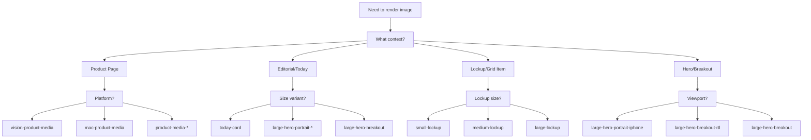
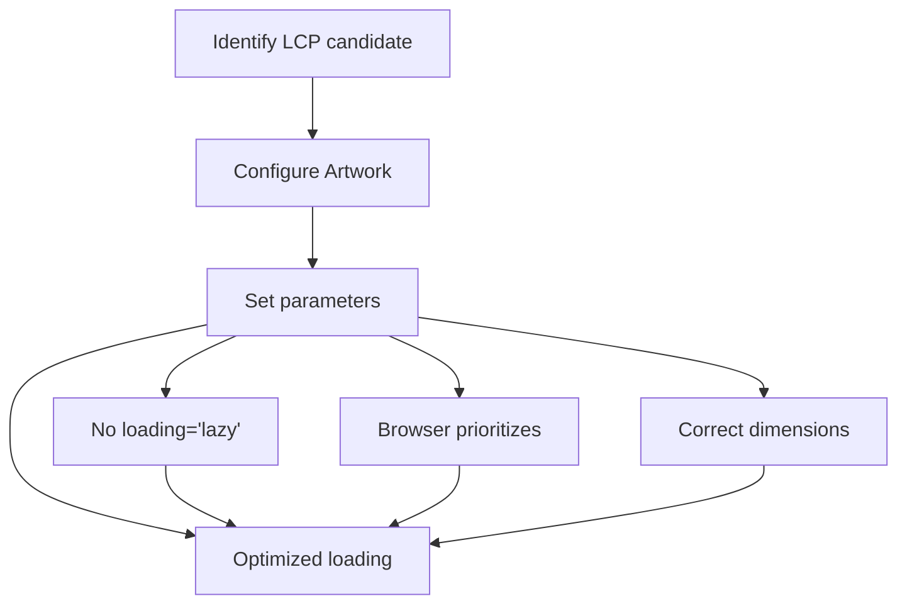
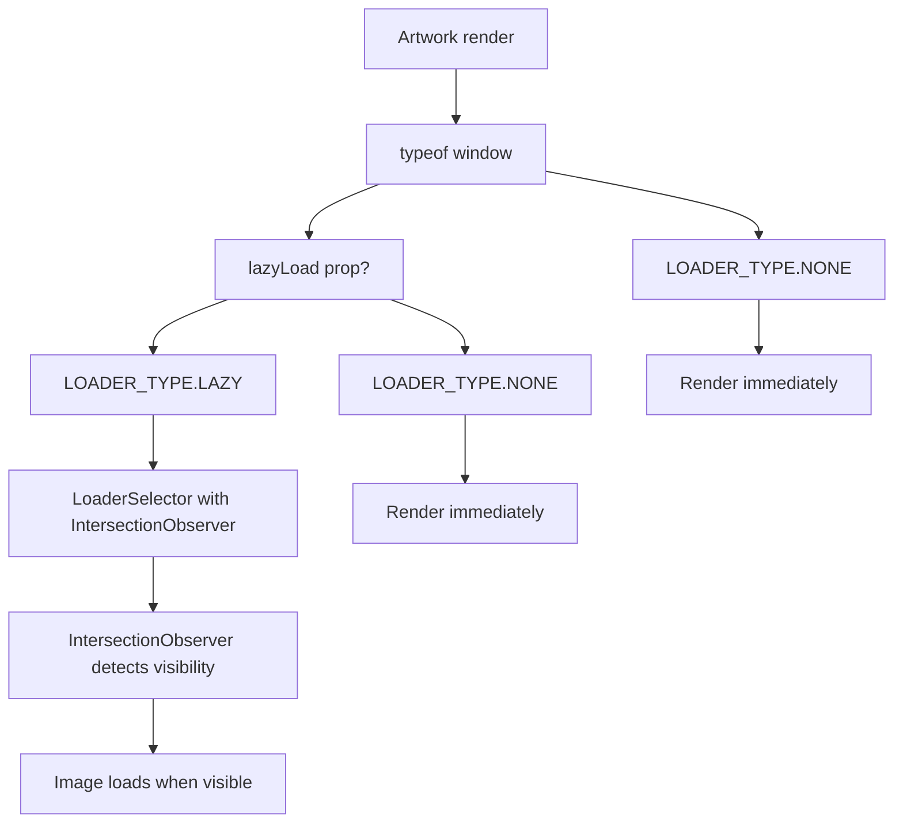
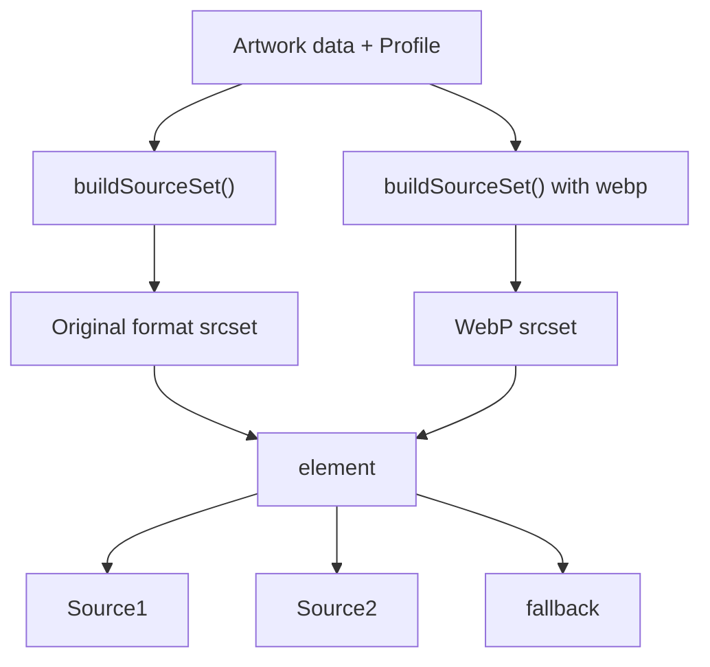
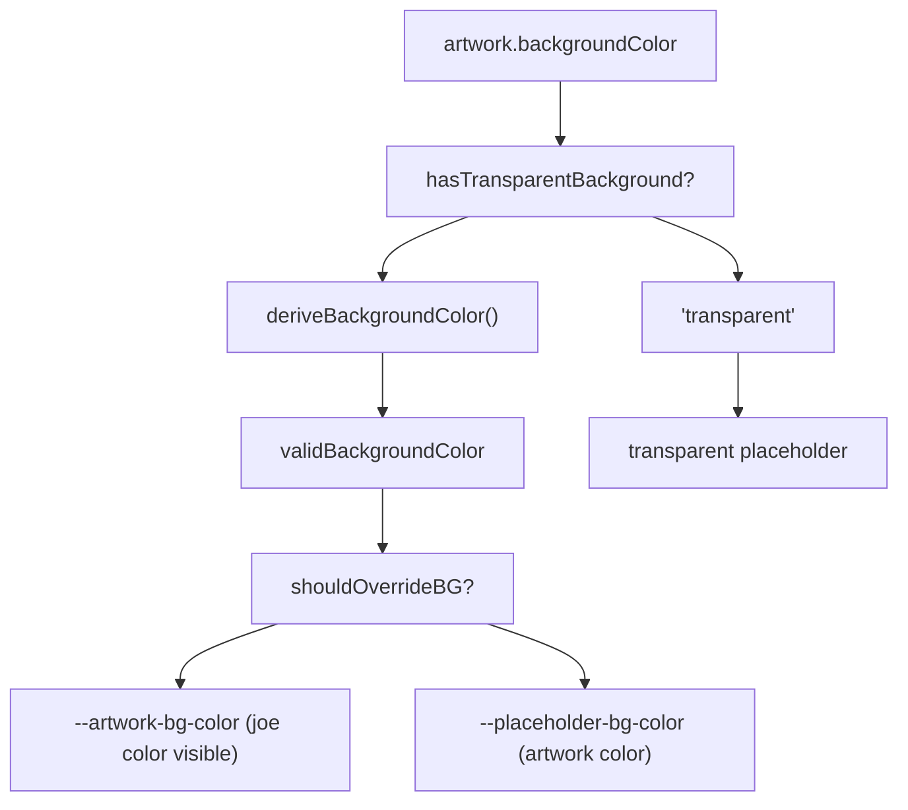

# Responsive Image Best Practices

-   [shared/components/src/components/Artwork/Artwork.svelte](https://github.com/Chesszyh/apps.apple.com/blob/279d0c4d/shared/components/src/components/Artwork/Artwork.svelte)
-   [src/components/Shelf/Title.svelte](https://github.com/Chesszyh/apps.apple.com/blob/279d0c4d/src/components/Shelf/Title.svelte)
-   [src/components/jet/item/LargeHeroBreakoutItem.svelte](https://github.com/Chesszyh/apps.apple.com/blob/279d0c4d/src/components/jet/item/LargeHeroBreakoutItem.svelte)
-   [src/components/jet/item/SmallBreakoutItem.svelte](https://github.com/Chesszyh/apps.apple.com/blob/279d0c4d/src/components/jet/item/SmallBreakoutItem.svelte)

## Purpose and Scope

This guide provides practical recommendations for implementing responsive images using the `Artwork` component. It covers profile selection, lazy loading strategies, LCP optimization, aspect ratio handling, and common patterns for different use cases.

For comprehensive technical documentation of the Artwork component's architecture and implementation details, see [Artwork and Media System](#5.1). For information about creating custom shelf types that use Artwork, see [Adding a New Shelf Type](#8.1).

---

## Profile-Based Image Rendering

The `Artwork` component uses **profiles** to determine the optimal image dimensions and aspect ratios for different viewports and contexts. A profile defines viewport-specific rendering parameters that the component uses to build responsive `srcset` attributes.

### Profile Selection Decision Tree


**Sources:** [shared/components/src/components/Artwork/Artwork.svelte36-40](https://github.com/Chesszyh/apps.apple.com/blob/279d0c4d/shared/components/src/components/Artwork/Artwork.svelte#L36-L40) [src/components/jet/item/LargeHeroBreakoutItem.svelte47-52](https://github.com/Chesszyh/apps.apple.com/blob/279d0c4d/src/components/jet/item/LargeHeroBreakoutItem.svelte#L47-L52)

### Named Profile System

Profiles are defined as string constants that map to viewport-specific configurations. The profile determines:

| Aspect | Controlled By |
| --- | --- |
| Aspect ratio | Profile definition |
| Image dimensions | Viewport breakpoints |
| Srcset sizes | Profile + artwork width |
| WebP generation | Always enabled |

Common profile patterns:

```
app-icon-*           → Square icons (1:1)
small-lockup         → List item artwork
medium-lockup        → Grid item artwork
large-lockup         → Featured item artwork
today-card           → Editorial card backgrounds
large-hero-*         → Full-width hero images
product-media-*      → Platform-specific product screenshots
```
**Sources:** [shared/components/src/components/Artwork/Artwork.svelte36-40](https://github.com/Chesszyh/apps.apple.com/blob/279d0c4d/shared/components/src/components/Artwork/Artwork.svelte#L36-L40) [src/components/jet/item/SmallBreakoutItem.svelte32-33](https://github.com/Chesszyh/apps.apple.com/blob/279d0c4d/src/components/jet/item/SmallBreakoutItem.svelte#L32-L33)

---

## LCP Optimization Strategy

The Largest Contentful Paint (LCP) is a critical Core Web Vital metric. Images that are LCP candidates must be configured for eager loading with high fetch priority.

### LCP Configuration Pattern


### LCP Candidate Identification

Images likely to be LCP candidates:

| Component Type | Viewport | LCP Candidate |
| --- | --- | --- |
| Hero carousel first item | All | ✓ Yes |
| Product media first screenshot | Small+ | ✓ Yes |
| TodayCard first in shelf | XSmall | ✓ Yes |
| Above-fold lockup images | XSmall | ✓ Maybe |
| Below-fold content | All | ✗ No |

### Implementation Example

For LCP images, configure the `Artwork` component as follows:

```
<Artwork     {artwork}     {profile}    lazyLoad={false}    fetchPriority="high"/>
```
For non-LCP images, use default lazy loading:

```
<Artwork     {artwork}     {profile}    lazyLoad={true}    fetchPriority="auto"/>
```
**Sources:** [shared/components/src/components/Artwork/Artwork.svelte52-60](https://github.com/Chesszyh/apps.apple.com/blob/279d0c4d/shared/components/src/components/Artwork/Artwork.svelte#L52-L60) [shared/components/src/components/Artwork/Artwork.svelte161-164](https://github.com/Chesszyh/apps.apple.com/blob/279d0c4d/shared/components/src/components/Artwork/Artwork.svelte#L161-L164)

---

## Aspect Ratio Handling

The Artwork component implements sophisticated aspect ratio management to handle mismatches between artwork data, profiles, and shelf contexts.

### Aspect Ratio Resolution Flow

> **[Mermaid sequence]**
> *(图表结构无法解析)*

### Shelf Aspect Ratio Context

When multiple images in a shelf have different natural aspect ratios, the component uses shelf context to determine the dominant ratio:

```
// Component checks for shelf contextif (hasShelfAspectRatioContext()) {    const { addProfile, shelfAspectRatio } = getShelfAspectRatioContext();    addProfile(profile);    localShelfAspectRatioStore = shelfAspectRatio;}
```
The `shouldOverrideBG` reactive statement determines when to apply joe color backgrounds:

| Condition | Background Treatment |
| --- | --- |
| Image matches shelf aspect ratio | Transparent or artwork background |
| Image differs from shelf ratio (>10%) | Joe color background for padding |
| No shelf context + profile mismatch | Joe color background for padding |
| Transparent background setting | Always transparent |

**Sources:** [shared/components/src/components/Artwork/Artwork.svelte104-110](https://github.com/Chesszyh/apps.apple.com/blob/279d0c4d/shared/components/src/components/Artwork/Artwork.svelte#L104-L110) [shared/components/src/components/Artwork/Artwork.svelte207-229](https://github.com/Chesszyh/apps.apple.com/blob/279d0c4d/shared/components/src/components/Artwork/Artwork.svelte#L207-L229) [shared/components/src/components/Artwork/Artwork.svelte231-251](https://github.com/Chesszyh/apps.apple.com/blob/279d0c4d/shared/components/src/components/Artwork/Artwork.svelte#L231-L251)

---

## Lazy Loading Implementation

The component implements a dual-mode loading strategy based on viewport visibility and LCP requirements.

### Loading Strategy Matrix

| Property | Value | Behavior | Use Case |
| --- | --- | --- | --- |
| `lazyLoad` | `true` (default) | IntersectionObserver-based | Below fold images |
| `lazyLoad` | `false` | Eager load | LCP candidates, above fold |
| Server-side | N/A | Always eager | SSR/hydration |

### Loader Selection Logic


### Opacity Transition Handling

The component manages visual loading states through opacity transitions:

```
// Opacity calculationopacity = `${imageIsLoading && typeof window !== 'undefined' ? 0 : 1}`;
```
-   **SSR**: Opacity set to 1 so images render before JS loads
-   **Client-side loading**: Opacity 0 during load, transitions to 1 on completion
-   **Transition end**: `hasTransitionInEnded` flag removes background after fade-in

**Sources:** [shared/components/src/components/Artwork/Artwork.svelte159-164](https://github.com/Chesszyh/apps.apple.com/blob/279d0c4d/shared/components/src/components/Artwork/Artwork.svelte#L159-L164) [shared/components/src/components/Artwork/Artwork.svelte332-361](https://github.com/Chesszyh/apps.apple.com/blob/279d0c4d/shared/components/src/components/Artwork/Artwork.svelte#L332-L361) [shared/components/src/components/Artwork/Artwork.svelte253-263](https://github.com/Chesszyh/apps.apple.com/blob/279d0c4d/shared/components/src/components/Artwork/Artwork.svelte#L253-L263)

---

## Srcset and WebP Generation

The component automatically generates optimized source sets with WebP variants for modern browsers.

### Source Set Generation Pipeline


### Picture Element Structure

The component renders a `<picture>` element with multiple sources:

```
<picture>    <!-- WebP for modern browsers -->    <source sizes="..." srcset="..." type="image/webp" />        <!-- Original format fallback -->    <source sizes="..." srcset="..." type="image/jpeg" />        <!-- Final fallback -->    </picture>
```
The `sizes` attribute is calculated from the profile and artwork width using `getImageSizes()`.

### File Type Configuration

The `imageSettings` prop controls format behavior:

| Setting | Default | Purpose |
| --- | --- | --- |
| `fileType` | `'jpg'` | Original format |
| `hasTransparentBackground` | `false` | Disable joe color for transparent PNGs |

WebP is always generated as an additional optimized source, regardless of the original format.

**Sources:** [shared/components/src/components/Artwork/Artwork.svelte128-138](https://github.com/Chesszyh/apps.apple.com/blob/279d0c4d/shared/components/src/components/Artwork/Artwork.svelte#L128-L138) [shared/components/src/components/Artwork/Artwork.svelte166](https://github.com/Chesszyh/apps.apple.com/blob/279d0c4d/shared/components/src/components/Artwork/Artwork.svelte#L166-L166) [shared/components/src/components/Artwork/Artwork.svelte334-358](https://github.com/Chesszyh/apps.apple.com/blob/279d0c4d/shared/components/src/components/Artwork/Artwork.svelte#L334-L358)

---

## Background Color and Joe Color Fallbacks

The component implements a sophisticated background color system that handles transparency, aspect ratio mismatches, and loading states.

### Background Color Resolution


### Joe Color Application Scenarios

The generic joe color (`--genericJoeColor`) is used as a fallback in several scenarios:

| Scenario | Background Treatment |
| --- | --- |
| Image loading | Joe color placeholder |
| Image load error | Joe color placeholder |
| Aspect ratio mismatch | Joe color padding areas |
| Missing backgroundColor data | Joe color fallback |
| Dark mode | Auto-switches to dark joe color |

### CSS Variable Cascade

```
background-color: var(    --override-placeholder-bg-color,    var(--placeholder-bg-color, var(--genericJoeColor)));
```
This cascade allows:

1.  Component consumers to override via `--override-placeholder-bg-color`
2.  Internal logic to set `--placeholder-bg-color` based on state
3.  Global joe color as final fallback

**Sources:** [shared/components/src/components/Artwork/Artwork.svelte118-127](https://github.com/Chesszyh/apps.apple.com/blob/279d0c4d/shared/components/src/components/Artwork/Artwork.svelte#L118-L127) [shared/components/src/components/Artwork/Artwork.svelte168-194](https://github.com/Chesszyh/apps.apple.com/blob/279d0c4d/shared/components/src/components/Artwork/Artwork.svelte#L168-L194) [shared/components/src/components/Artwork/Artwork.svelte398-401](https://github.com/Chesszyh/apps.apple.com/blob/279d0c4d/shared/components/src/components/Artwork/Artwork.svelte#L398-L401)

---

## Platform-Specific Enhancements

### Chin Configuration (TV Platform)

The `chinConfig` prop enables TV-style reflection effects below the artwork:

```
export let chinConfig: ChinConfig | undefined = undefined;
```
When configured, the chin affects:

-   **Effective aspect ratio**: Base height + chin height
-   **Image tag height**: Adjusted to include chin space
-   **CSS reflection**: Applied via `-webkit-box-reflect`

### Chin Aspect Ratio Calculation

```
const effectiveAspectRatio = (() => {    const chinHeightValue = chinConfig?.height ?? 0;    if (chinHeightValue === 0 || aspectRatio === null) {        return aspectRatio;    }        const baseHeight = imageTagSizeObj.height;    const baseWidth = imageTagSizeObj.width;    const newHeight = baseHeight + chinHeightValue;    return baseWidth / newHeight;})();
```
### Border Rendering Control

The `withoutBorder` prop disables the default border/shadow treatment:

```
<Artwork     {artwork}     {profile}    withoutBorder={true}  />
```
This is useful for:

-   Images with transparent backgrounds that shouldn't have borders
-   Custom wrapper components providing their own border treatment
-   Artwork that extends to container edges

**Sources:** [shared/components/src/components/Artwork/Artwork.svelte74-79](https://github.com/Chesszyh/apps.apple.com/blob/279d0c4d/shared/components/src/components/Artwork/Artwork.svelte#L74-L79) [shared/components/src/components/Artwork/Artwork.svelte142-155](https://github.com/Chesszyh/apps.apple.com/blob/279d0c4d/shared/components/src/components/Artwork/Artwork.svelte#L142-L155) [shared/components/src/components/Artwork/Artwork.svelte101-102](https://github.com/Chesszyh/apps.apple.com/blob/279d0c4d/shared/components/src/components/Artwork/Artwork.svelte#L101-L102)

---

## Common Implementation Patterns

### Pattern 1: Editorial Hero with Video Fallback

Large hero breakout items conditionally render video or artwork based on viewport and locale:

```
{#if video && $mediaQueries !== 'xsmall' && !canUseRTLArtwork}    <Video {video} {profile} autoplay loop useControls={false} />{:else if artwork}    <Artwork {artwork} {profile} />{/if}
```
Profile selection logic:

```
profile = $mediaQueries === 'xsmall'    ? 'large-hero-portrait-iphone'    : canUseRTLArtwork    ? 'large-hero-breakout-rtl'    : 'large-hero-breakout';
```
**Sources:** [src/components/jet/item/LargeHeroBreakoutItem.svelte47-52](https://github.com/Chesszyh/apps.apple.com/blob/279d0c4d/src/components/jet/item/LargeHeroBreakoutItem.svelte#L47-L52) [src/components/jet/item/LargeHeroBreakoutItem.svelte62-66](https://github.com/Chesszyh/apps.apple.com/blob/279d0c4d/src/components/jet/item/LargeHeroBreakoutItem.svelte#L62-L66)

### Pattern 2: Fixed-Size App Icons

Small breakout items use app icons with fixed dimensions:

```
<AppIcon    icon={iconArtwork}    profile="app-icon-xlarge"    fixedWidth={false}/>
```
The `fixedWidth={false}` allows the icon to scale responsively within its container while maintaining aspect ratio.

**Sources:** [src/components/jet/item/SmallBreakoutItem.svelte29-35](https://github.com/Chesszyh/apps.apple.com/blob/279d0c4d/src/components/jet/item/SmallBreakoutItem.svelte#L29-L35)

### Pattern 3: RTL-Aware Artwork Selection

Components can provide alternate artwork for RTL locales:

```
const canUseRTLArtwork = isRtl() && rtlArtwork;artwork = (canUseRTLArtwork ? rtlArtwork : item.artwork) || video?.preview;
```
This allows editorial teams to provide mirrored or redesigned artwork for right-to-left reading contexts.

**Sources:** [src/components/jet/item/LargeHeroBreakoutItem.svelte35](https://github.com/Chesszyh/apps.apple.com/blob/279d0c4d/src/components/jet/item/LargeHeroBreakoutItem.svelte#L35-L35) [src/components/jet/item/LargeHeroBreakoutItem.svelte39-40](https://github.com/Chesszyh/apps.apple.com/blob/279d0c4d/src/components/jet/item/LargeHeroBreakoutItem.svelte#L39-L40)

---

## Troubleshooting Common Issues

### Image Not Loading

**Symptoms**: Image placeholder visible indefinitely, no error state

**Diagnostic Steps**:

1.  Check artwork data structure:

    -   `artwork.template` must contain valid URL template
    -   `artwork.width` and `artwork.height` must be present
2.  Verify profile exists in artwork profile definitions

3.  Check browser console for network errors

4.  Inspect srcset generation:

    ```
    console.log(buildSourceSet(artwork, imageSettings, profile));
    ```


### Aspect Ratio Mismatch Padding

**Symptoms**: Unexpected joe color padding around images

**Root Causes**:

| Cause | Solution |
| --- | --- |
| Profile aspect ratio doesn't match artwork | Use correct profile for artwork type |
| Shelf has mixed aspect ratios | Expected behavior - ensures consistent grid |
| Artwork data has incorrect dimensions | Update artwork service data |

### LCP Performance Issues

**Symptoms**: Poor LCP scores, slow image loading

**Optimization Checklist**:

-   [ ]  Verify `lazyLoad={false}` on LCP image
-   [ ]  Confirm `fetchPriority="high"` is set
-   [ ]  Check profile generates appropriate sizes for viewport
-   [ ]  Ensure preconnect hints are emitted for artwork domain
-   [ ]  Validate WebP sources are being used in modern browsers

### Dark Mode Background Issues

**Symptoms**: Light backgrounds in dark mode

**Solution**: Ensure joe color CSS variables support dark mode:

```
&[style*='#ebebeb'] {    @media (prefers-color-scheme: dark) {        background-color: swatch(genericJoeColor, dark);    }}
```
**Sources:** [shared/components/src/components/Artwork/Artwork.svelte487-493](https://github.com/Chesszyh/apps.apple.com/blob/279d0c4d/shared/components/src/components/Artwork/Artwork.svelte#L487-L493)

---

## Performance Monitoring

### Key Metrics to Track

| Metric | Target | Measurement Point |
| --- | --- | --- |
| LCP | < 2.5s | First hero image render |
| Image decode time | < 100ms | onImageLoad event |
| Lazy load trigger distance | ~1000px | IntersectionObserver threshold |
| WebP adoption rate | \> 90% | Modern browser usage |

### Preconnect Optimization

The component automatically tracks artwork domains for preconnect optimization:

```
const preconnectTracker = getPreconnectTracker();$: {    preconnectTracker?.trackUrl(template);}
```
This enables the bootstrap system to emit `<link rel="preconnect">` tags for artwork CDN domains, reducing DNS and connection establishment time.

**Sources:** [shared/components/src/components/Artwork/Artwork.svelte16](https://github.com/Chesszyh/apps.apple.com/blob/279d0c4d/shared/components/src/components/Artwork/Artwork.svelte#L16-L16) [shared/components/src/components/Artwork/Artwork.svelte20](https://github.com/Chesszyh/apps.apple.com/blob/279d0c4d/shared/components/src/components/Artwork/Artwork.svelte#L20-L20) [shared/components/src/components/Artwork/Artwork.svelte196-198](https://github.com/Chesszyh/apps.apple.com/blob/279d0c4d/shared/components/src/components/Artwork/Artwork.svelte#L196-L198)

---

## Accessibility Considerations

### Decorative vs Informative Images

The `isDecorative` prop determines ARIA role:

```

```
Default behavior:

-   If `alt` prop is provided → `isDecorative = false`
-   If `alt` is empty → `isDecorative = true`

Override when needed:

```
<!-- Informative image with no alt text available --><Artwork {artwork} {profile} alt="" isDecorative={false} /><!-- Decorative image that happens to have alt text --><Artwork {artwork} {profile} alt="Background pattern" isDecorative={true} />
```
### Alt Text Best Practices

| Image Type | Alt Text Strategy |
| --- | --- |
| Product screenshot | Describe functionality shown |
| Editorial artwork | Describe editorial concept |
| Decorative background | Empty alt, role="presentation" |
| App icon in lockup | Empty alt (redundant with adjacent text) |

**Sources:** [shared/components/src/components/Artwork/Artwork.svelte29-30](https://github.com/Chesszyh/apps.apple.com/blob/279d0c4d/shared/components/src/components/Artwork/Artwork.svelte#L29-L30) [shared/components/src/components/Artwork/Artwork.svelte91-97](https://github.com/Chesszyh/apps.apple.com/blob/279d0c4d/shared/components/src/components/Artwork/Artwork.svelte#L91-L97) [shared/components/src/components/Artwork/Artwork.svelte344](https://github.com/Chesszyh/apps.apple.com/blob/279d0c4d/shared/components/src/components/Artwork/Artwork.svelte#L344-L344) [shared/components/src/components/Artwork/Artwork.svelte349](https://github.com/Chesszyh/apps.apple.com/blob/279d0c4d/shared/components/src/components/Artwork/Artwork.svelte#L349-L349)
