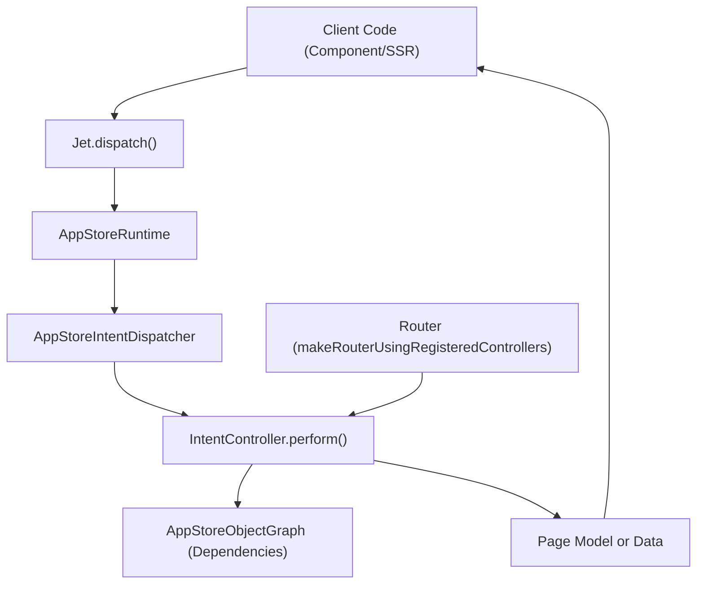
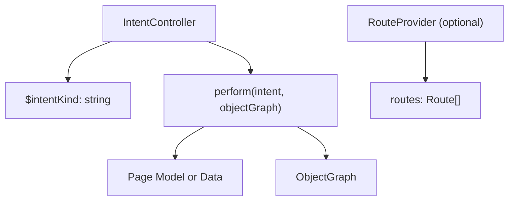
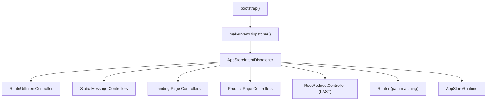

# Intent and Action System

-   [src/jet/action-handlers/browser.ts](https://github.com/Chesszyh/apps.apple.com/blob/279d0c4d/src/jet/action-handlers/browser.ts)
-   [src/jet/action-handlers/compound-action.ts](https://github.com/Chesszyh/apps.apple.com/blob/279d0c4d/src/jet/action-handlers/compound-action.ts)
-   [src/jet/action-handlers/external-url-action.ts](https://github.com/Chesszyh/apps.apple.com/blob/279d0c4d/src/jet/action-handlers/external-url-action.ts)
-   [src/jet/bootstrap.ts](https://github.com/Chesszyh/apps.apple.com/blob/279d0c4d/src/jet/bootstrap.ts)
-   [src/jet/intents/route-url/route-url-controller.ts](https://github.com/Chesszyh/apps.apple.com/blob/279d0c4d/src/jet/intents/route-url/route-url-controller.ts)
-   [src/jet/intents/route-url/route-url-intent.ts](https://github.com/Chesszyh/apps.apple.com/blob/279d0c4d/src/jet/intents/route-url/route-url-intent.ts)
-   [src/jet/intents/static-message-pages/carrier-page-intent-controller.ts](https://github.com/Chesszyh/apps.apple.com/blob/279d0c4d/src/jet/intents/static-message-pages/carrier-page-intent-controller.ts)
-   [src/jet/intents/static-message-pages/contingent-price-page-intent-controller.ts](https://github.com/Chesszyh/apps.apple.com/blob/279d0c4d/src/jet/intents/static-message-pages/contingent-price-page-intent-controller.ts)
-   [src/jet/intents/static-message-pages/invoice-page-intent-controller.ts](https://github.com/Chesszyh/apps.apple.com/blob/279d0c4d/src/jet/intents/static-message-pages/invoice-page-intent-controller.ts)
-   [src/jet/jet.ts](https://github.com/Chesszyh/apps.apple.com/blob/279d0c4d/src/jet/jet.ts)
-   [src/jet/models/external-action.ts](https://github.com/Chesszyh/apps.apple.com/blob/279d0c4d/src/jet/models/external-action.ts)
-   [src/jet/svelte.ts](https://github.com/Chesszyh/apps.apple.com/blob/279d0c4d/src/jet/svelte.ts)

## Purpose and Scope

The Intent and Action System provides the core dispatching mechanisms that power application navigation and user interactions. **Intents** represent requests for application logic (such as loading a page), while **Actions** represent user interactions (such as clicking a link). This system bridges URL routing to page rendering and user events to application behavior.

For information about the Jet application initialization and dependency injection, see [Jet Application Core](#2.1). For details on how pages are composed from shelves, see [Component Architecture](#2.3).

---

## Intent System Architecture

### What are Intents?

Intents are typed requests that encapsulate the parameters needed to perform application logic. Each intent has a `$kind` field that identifies its type and determines which controller handles it.

**Key Intent Properties:**

-   `$kind`: String identifier for intent type (e.g., `"ProductPageIntent"`, `"RouteUrlIntent"`)
-   Intent-specific parameters (e.g., `url`, `adamId`, `storefront`, `language`)
-   Return type defined generically: `Intent<ReturnType>`

**Common Intent Types:**

| Intent Kind | Purpose | Controller |
| --- | --- | --- |
| `RouteUrlIntent` | Convert URL to page intent | `RouteUrlIntentController` |
| `ProductPageIntent` | Load product detail page | `ProductPageIntentController` |
| `SearchResultsPageIntent` | Load search results | `SearchResultsPageIntentController` |
| `EditorialPageIntent` | Load editorial/today page | `EditorialPageIntentController` |
| Static message intents | Load static pages (carrier, invoice, etc.) | Various static page controllers |

Sources: [src/jet/intents/route-url/route-url-intent.ts29-36](https://github.com/Chesszyh/apps.apple.com/blob/279d0c4d/src/jet/intents/route-url/route-url-intent.ts#L29-L36) [src/jet/bootstrap.ts1-125](https://github.com/Chesszyh/apps.apple.com/blob/279d0c4d/src/jet/bootstrap.ts#L1-L125)

### Intent Dispatching Flow


**Intent Dispatch Flow:**

1.  Application code calls `jet.dispatch(intent)`
2.  `Jet` class delegates to `AppStoreRuntime.dispatch()` [src/jet/jet.ts182-198](https://github.com/Chesszyh/apps.apple.com/blob/279d0c4d/src/jet/jet.ts#L182-L198)
3.  Runtime uses `IntentDispatcher` to find registered controller
4.  Controller's `perform()` method executes with intent and object graph
5.  Controller returns typed result (typically a page model)

Sources: [src/jet/jet.ts182-198](https://github.com/Chesszyh/apps.apple.com/blob/279d0c4d/src/jet/jet.ts#L182-L198) [src/jet/bootstrap.ts105-125](https://github.com/Chesszyh/apps.apple.com/blob/279d0c4d/src/jet/bootstrap.ts#L105-L125)

### Intent Controllers

Intent controllers implement the `IntentController<I>` interface and optionally `RouteProvider` for URL-routable intents.

**IntentController Structure:**


**Example: Static Message Page Controller**

[src/jet/intents/static-message-pages/carrier-page-intent-controller.ts18-41](https://github.com/Chesszyh/apps.apple.com/blob/279d0c4d/src/jet/intents/static-message-pages/carrier-page-intent-controller.ts#L18-L41) demonstrates a simple controller:

```
export const CarrierPageIntentController: IntentController<any> & RouteProvider = {    $intentKind: 'CarrierPageIntent',    routes,  // Generated from '/carrier' pattern        async perform(intent, objectGraphWithoutActiveIntent: AppStoreObjectGraph) {        return await withActiveIntent(            objectGraphWithoutActiveIntent,            intent,            async (objectGraph) => {                const page = new StaticMessagePage({                    titleLocKey: 'ASE.Web.AppStore.Carrier.Title',                    contentType: 'carrier',                });                page.canonicalURL = makeCanonicalUrl(objectGraph, intent);                injectWebNavigation(objectGraph, page, intent.platform);                return page;            },        );    },};
```
**Controller Characteristics:**

-   Implements `perform()` method that returns page model
-   Uses `withActiveIntent()` to inject intent into object graph
-   Accesses dependencies through object graph (locale, API clients, etc.)
-   Generates canonical URLs and injects navigation
-   Can be stateless objects or class instances

Sources: [src/jet/intents/static-message-pages/carrier-page-intent-controller.ts18-41](https://github.com/Chesszyh/apps.apple.com/blob/279d0c4d/src/jet/intents/static-message-pages/carrier-page-intent-controller.ts#L18-L41) [src/jet/intents/static-message-pages/invoice-page-intent-controller.ts18-41](https://github.com/Chesszyh/apps.apple.com/blob/279d0c4d/src/jet/intents/static-message-pages/invoice-page-intent-controller.ts#L18-L41)

### Controller Registration

Controllers are registered with the `IntentDispatcher` during bootstrap. Registration order matters for URL routing—more specific patterns must be registered before generic catch-all patterns.


**Registration in bootstrap.ts:**

[src/jet/bootstrap.ts44-97](https://github.com/Chesszyh/apps.apple.com/blob/279d0c4d/src/jet/bootstrap.ts#L44-L97) shows the registration sequence:

1.  `RouteUrlIntentController` (meta-controller for URL routing)
2.  Static message page controllers
3.  Platform landing page controllers (except `RootRedirectController`)
4.  Specific page controllers (Arcade, Bundle, Editorial, Search, etc.)
5.  Product-related controllers (with specific order for URL pattern matching)
6.  `RootRedirectController` (registered LAST as catch-all for `/{sf}`)

**Critical Registration Order:**

-   `ChartsHubPageIntentController` before `ChartsPageIntentController` (overlapping URLs)
-   `AppEventPageIntentController` and `SeeAllPageIntentController` before `ProductPageIntentController`
-   `RootRedirectController` absolute last to avoid matching more specific patterns

Sources: [src/jet/bootstrap.ts44-97](https://github.com/Chesszyh/apps.apple.com/blob/279d0c4d/src/jet/bootstrap.ts#L44-L97)

---

## RouteUrlIntent: URL to Intent Resolution

The `RouteUrlIntent` is a special meta-intent that converts incoming URLs into specific page intents.

### RouteUrlIntent Interface

[src/jet/intents/route-url/route-url-intent.ts13-27](https://github.com/Chesszyh/apps.apple.com/blob/279d0c4d/src/jet/intents/route-url/route-url-intent.ts#L13-L27) defines the response structure:

| Field | Type | Purpose |
| --- | --- | --- |
| `intent` | `Intent<unknown>` | The resolved page intent to dispatch |
| `action` | `FlowAction` | Navigation action for client-side routing |
| `storefront` | `NormalizedStorefront` | Locale storefront from URL |
| `language` | `NormalizedLanguage` | Locale language from URL |

### RouteUrlController Implementation

[src/jet/intents/route-url/route-url-controller.ts9-28](https://github.com/Chesszyh/apps.apple.com/blob/279d0c4d/src/jet/intents/route-url/route-url-controller.ts#L9-L28) implements URL resolution:

```
export const RouteUrlIntentController: IntentController<RouteUrlIntent> = {    $intentKind: 'RouteUrlIntent',        async perform(intent: RouteUrlIntent, objectGraph: AppStoreObjectGraph) {        const targetIntent = objectGraph.router.intentFor(intent.url);                if (isSome(targetIntent) && isRoutableIntent(targetIntent)) {            return {                intent: targetIntent,                action: makeFlowAction(targetIntent),                storefront: targetIntent.storefront,                language: targetIntent.language,            };        }                return null;    },};
```
**Key Behaviors:**

-   Uses `objectGraph.router` to match URL patterns against registered controllers
-   Returns `null` for unroutable URLs
-   Creates `FlowAction` for client-side navigation
-   Extracts locale information from resolved intent

### URL Routing Usage

[src/jet/jet.ts263-285](https://github.com/Chesszyh/apps.apple.com/blob/279d0c4d/src/jet/jet.ts#L263-L285) provides the `routeUrl()` convenience method:

```
async routeUrl(url: string): Promise<RouterResponse | null> {    const routerResponse = await this.dispatch<RouteUrlIntent>(        makeRouteUrlIntent({ url }),    );        if (routerResponse && routerResponse.action) {        return routerResponse;    }        this.log.warn('url did not resolve to a flow action...', url, routerResponse);    return null;}
```
Sources: [src/jet/intents/route-url/route-url-controller.ts9-28](https://github.com/Chesszyh/apps.apple.com/blob/279d0c4d/src/jet/intents/route-url/route-url-controller.ts#L9-L28) [src/jet/intents/route-url/route-url-intent.ts13-48](https://github.com/Chesszyh/apps.apple.com/blob/279d0c4d/src/jet/intents/route-url/route-url-intent.ts#L13-L48) [src/jet/jet.ts263-285](https://github.com/Chesszyh/apps.apple.com/blob/279d0c4d/src/jet/jet.ts#L263-L285)

---

## Action System Architecture

### What are Actions?

Actions represent user interactions and side effects. Unlike intents (which return data), actions are performed for their side effects (navigation, opening modals, etc.) and return an `ActionOutcome`.

**ActionModel Structure:**

-   `$kind`: String identifier for action type
-   Action-specific parameters
-   Returns `ActionOutcome`: `'performed'` or `'unsupported'`

**Common Action Types:**

| Action Kind | Purpose | Handler Location |
| --- | --- | --- |
| `FlowAction` | Navigate to new page/intent | [src/jet/action-handlers/flow-action.ts](https://github.com/Chesszyh/apps.apple.com/blob/279d0c4d/src/jet/action-handlers/flow-action.ts) |
| `compoundAction` | Perform multiple sub-actions | [src/jet/action-handlers/compound-action.ts](https://github.com/Chesszyh/apps.apple.com/blob/279d0c4d/src/jet/action-handlers/compound-action.ts) |
| `ExternalUrlAction` | Open external URL | [src/jet/action-handlers/external-url-action.ts](https://github.com/Chesszyh/apps.apple.com/blob/279d0c4d/src/jet/action-handlers/external-url-action.ts) |

Sources: [src/jet/action-handlers/browser.ts1-16](https://github.com/Chesszyh/apps.apple.com/blob/279d0c4d/src/jet/action-handlers/browser.ts#L1-L16)

### Action Dispatching Flow

**Action Dispatch Process:**

1.  User interaction triggers component code
2.  Component calls `jet.perform(action)` [src/jet/jet.ts207-240](https://github.com/Chesszyh/apps.apple.com/blob/279d0c4d/src/jet/jet.ts#L207-L240)
3.  `Jet` adds metrics behavior context
4.  `ActionDispatcher` routes to registered handler
5.  Handler executes and returns `'performed'` or `'unsupported'`
6.  Metrics events are automatically processed

Sources: [src/jet/jet.ts207-240](https://github.com/Chesszyh/apps.apple.com/blob/279d0c4d/src/jet/jet.ts#L207-L240) [src/jet/svelte.ts32-45](https://github.com/Chesszyh/apps.apple.com/blob/279d0c4d/src/jet/svelte.ts#L32-L45)

### ActionDispatcher Implementation

[src/jet/jet.ts207-240](https://github.com/Chesszyh/apps.apple.com/blob/279d0c4d/src/jet/jet.ts#L207-L240) shows the `perform()` method:

```
async perform(    action: ActionModel,    metricsBehavior?: MetricsBehavior,): Promise<ActionOutcome> {    if (!metricsBehavior) {        if (this.pageMetrics) {            metricsBehavior = {                behavior: 'fromAction',                context: this.pageMetrics || {},            };        } else {            this.log.warn('No pageMetrics found for jet.perform action:', action);            metricsBehavior = { behavior: 'notProcessed' };        }    }        const outcome = await this.actionDispatcher.perform(        action,        metricsBehavior,    );        if (outcome === 'unsupported') {        this.log.error('unable to perform action:', action, metricsBehavior);    }        return outcome;}
```
**Key Features:**

-   Automatically injects `pageMetrics` context for analytics
-   Logs warnings for unsupported actions
-   Delegates to internal `ActionDispatcher` instance
-   Returns standardized outcome type

Sources: [src/jet/jet.ts207-240](https://github.com/Chesszyh/apps.apple.com/blob/279d0c4d/src/jet/jet.ts#L207-L240)

### Action Handler Registration

Action handlers are registered using `jet.onAction()` during application initialization.

**Handler Registration Pattern:**

[src/jet/jet.ts242-260](https://github.com/Chesszyh/apps.apple.com/blob/279d0c4d/src/jet/jet.ts#L242-L260) implements `onAction()`:

```
onAction<A extends ActionModel>(    kind: string,    implementation: ActionImplementation<A>,): void {    if (this.wiredActions.has(kind)) {        throw new Error(            `onAction called twice with the same action type: ${kind}`,        );    }        this.actionDispatcher.register(kind, implementation);    this.wiredActions.add(kind);}
```
**Registration Protection:**

-   Maintains `wiredActions` set to prevent duplicate registration
-   Throws error if action type already registered
-   Ensures single handler per action type

[src/jet/action-handlers/browser.ts12-16](https://github.com/Chesszyh/apps.apple.com/blob/279d0c4d/src/jet/action-handlers/browser.ts#L12-L16) orchestrates handler registration:

```
export function registerActionHandlers(dependencies: Dependencies) {    registerCompoundActionHandler(dependencies);    registerFlowActionHandler(dependencies);    registerExternalURLActionHandler(dependencies);}
```
Sources: [src/jet/jet.ts242-260](https://github.com/Chesszyh/apps.apple.com/blob/279d0c4d/src/jet/jet.ts#L242-L260) [src/jet/action-handlers/browser.ts12-16](https://github.com/Chesszyh/apps.apple.com/blob/279d0c4d/src/jet/action-handlers/browser.ts#L12-L16)

---

## Action Types and Handlers

### FlowAction Handler

`FlowAction` is the primary action type for navigation. It contains an intent that should be dispatched to load a new page.

**Handler Implementation Pattern:**

```
jet.onAction('FlowAction', async (action: FlowAction) => {    // Extract intent from action    const { intent } = action;        // Dispatch intent to get page data    const page = await jet.dispatch(intent);        // Update browser state (URL, history)    navigate(page);        return 'performed';});
```
**FlowAction Characteristics:**

-   Bridges actions to intents
-   Triggers client-side navigation
-   Updates browser history and URL
-   Most common action type in the application

Sources: [src/jet/action-handlers/flow-action.ts](https://github.com/Chesszyh/apps.apple.com/blob/279d0c4d/src/jet/action-handlers/flow-action.ts) (referenced in [src/jet/action-handlers/browser.ts6](https://github.com/Chesszyh/apps.apple.com/blob/279d0c4d/src/jet/action-handlers/browser.ts#L6-L6))

### CompoundAction Handler

`CompoundAction` enables composition by performing multiple sub-actions sequentially.

[src/jet/action-handlers/compound-action.ts15-32](https://github.com/Chesszyh/apps.apple.com/blob/279d0c4d/src/jet/action-handlers/compound-action.ts#L15-L32) shows the implementation:

```
jet.onAction('compoundAction', async (action: CompoundAction) => {    log.info('received CompoundAction:', action);        const { subactions = [] } = action;        // Perform actions in sequence    for (const action of subactions) {        await jet.perform(action).catch((e) => {            // Throwing error stops for...of execution            throw new Error(                `an error occurred while handling CompoundAction: ${e}`,            );        });    }        return 'performed';});
```
**CompoundAction Behavior:**

-   Iterates through `subactions` array
-   Performs each action sequentially (not parallel)
-   Stops execution on first error
-   Recursive: sub-actions can be CompoundActions

**Usage Example:** A "See All" button might use a CompoundAction to:

1.  Track analytics event
2.  Open modal with content

Sources: [src/jet/action-handlers/compound-action.ts15-32](https://github.com/Chesszyh/apps.apple.com/blob/279d0c4d/src/jet/action-handlers/compound-action.ts#L15-L32)

### ExternalUrlAction Handler

`ExternalUrlAction` represents navigation to external URLs outside the application.

[src/jet/action-handlers/external-url-action.ts15-18](https://github.com/Chesszyh/apps.apple.com/blob/279d0c4d/src/jet/action-handlers/external-url-action.ts#L15-L18) shows the handler:

```
jet.onAction('ExternalUrlAction', async (action: ExternalUrlAction) => {    log.info('received external URL action:', action);    return 'performed';});
```
**Handler Responsibility:**

-   Browser implementation opens URL in new tab/window
-   Server implementation logs for SSR
-   Contains `url` field with target destination

[src/jet/models/external-action.ts3-7](https://github.com/Chesszyh/apps.apple.com/blob/279d0c4d/src/jet/models/external-action.ts#L3-L7) provides type guard:

```
export function isExternalUrlAction(    action: Action,): action is ExternalUrlAction {    return action.$kind === 'ExternalUrlAction';}
```
Sources: [src/jet/action-handlers/external-url-action.ts15-18](https://github.com/Chesszyh/apps.apple.com/blob/279d0c4d/src/jet/action-handlers/external-url-action.ts#L15-L18) [src/jet/models/external-action.ts3-7](https://github.com/Chesszyh/apps.apple.com/blob/279d0c4d/src/jet/models/external-action.ts#L3-L7)

---

## Svelte Integration

### Accessing Jet in Components

[src/jet/svelte.ts15-23](https://github.com/Chesszyh/apps.apple.com/blob/279d0c4d/src/jet/svelte.ts#L15-L23) provides context access:

```
export function getJet(): Jet {    const jet = getContext<Opt<Jet>>(CONTEXT_NAME);        if (!jet) {        throw new Error('getJet called before Jet.load');    }        return jet;}
```
**Usage in Components:**

```
<script>    import { getJet } from '~/jet/svelte';    const jet = getJet();        async function handleClick() {        await jet.perform(someAction);    }</script>
```
### Performing Actions from Components

[src/jet/svelte.ts32-45](https://github.com/Chesszyh/apps.apple.com/blob/279d0c4d/src/jet/svelte.ts#L32-L45) provides a helper for action performance:

```
export function getJetPerform(): (    action: ActionModel,) => Promise<ActionOutcome | ActionUndefined> {    const jet = getJet();        return (action: ActionModel) => {        if (!action) {            return Promise.resolve('noActionProvided');        }        return jet.perform(action);    };}
```
**Benefits:**

-   Safely handles missing actions
-   Automatically includes metrics context
-   Returns promise for async handling
-   Single location for action performance

Sources: [src/jet/svelte.ts1-46](https://github.com/Chesszyh/apps.apple.com/blob/279d0c4d/src/jet/svelte.ts#L1-L46)

---

## Complete Flow: URL to Rendered Page

**Step-by-Step Flow:**

1.  **URL Routing Phase:**

    -   User navigates or clicks link
    -   `jet.routeUrl(url)` called [src/jet/jet.ts268-285](https://github.com/Chesszyh/apps.apple.com/blob/279d0c4d/src/jet/jet.ts#L268-L285)
    -   `RouteUrlIntent` dispatched
    -   `RouteUrlController` resolves URL to page intent [src/jet/intents/route-url/route-url-controller.ts12-27](https://github.com/Chesszyh/apps.apple.com/blob/279d0c4d/src/jet/intents/route-url/route-url-controller.ts#L12-L27)
    -   Returns `RouterResponse` with intent and action
2.  **Intent Dispatch Phase:**

    -   Client extracts `FlowAction` from response
    -   `jet.perform(flowAction)` called
    -   FlowAction handler extracts page intent
    -   Page intent dispatched (e.g., `ProductPageIntent`)
    -   Controller fetches data and returns page model
3.  **Rendering Phase:**

    -   Page component receives page model
    -   Iterates through shelves array
    -   Renders shelf components
    -   User can interact with page

Sources: [src/jet/jet.ts268-285](https://github.com/Chesszyh/apps.apple.com/blob/279d0c4d/src/jet/jet.ts#L268-L285) [src/jet/intents/route-url/route-url-controller.ts9-28](https://github.com/Chesszyh/apps.apple.com/blob/279d0c4d/src/jet/intents/route-url/route-url-controller.ts#L9-L28)

---

## Key Design Patterns

### Intent Controller Pattern

**Characteristics:**

-   Implements `IntentController<I>` interface
-   Stateless or singleton instances
-   `perform()` method takes intent and object graph
-   Returns typed data (typically page models)
-   Optional `RouteProvider` for URL-routable intents

**Benefits:**

-   Type-safe intent handling
-   Dependency injection through object graph
-   Testable in isolation
-   Clear separation of concerns

### Action Handler Pattern

**Characteristics:**

-   Registered via `jet.onAction(kind, implementation)`
-   Receives action model and metrics behavior
-   Performs side effects
-   Returns `'performed'` or `'unsupported'`

**Benefits:**

-   Centralized action handling
-   Automatic metrics integration
-   Error handling and logging
-   Single registration prevents conflicts

### Meta-Controller Pattern (RouteUrlController)

**Characteristics:**

-   Controller that dispatches to other controllers
-   Uses router to resolve URLs to intents
-   Returns action and intent for client routing
-   Enables server-side rendering with URL-based routing

**Benefits:**

-   Decouples URL structure from page logic
-   Enables dynamic routing without hardcoded paths
-   Supports locale-specific URL patterns
-   SSR and client use same routing logic

Sources: [src/jet/intents/route-url/route-url-controller.ts9-28](https://github.com/Chesszyh/apps.apple.com/blob/279d0c4d/src/jet/intents/route-url/route-url-controller.ts#L9-L28) [src/jet/bootstrap.ts44-97](https://github.com/Chesszyh/apps.apple.com/blob/279d0c4d/src/jet/bootstrap.ts#L44-L97)

---

## Summary

The Intent and Action System provides two complementary dispatch mechanisms:

**Intent System:**

-   Request-driven data fetching
-   Controllers return page models or data
-   Used for navigation and SSR
-   Dispatched via `jet.dispatch(intent)`

**Action System:**

-   Interaction-driven side effects
-   Handlers perform navigation, modals, external links
-   Automatic metrics integration
-   Dispatched via `jet.perform(action)`

**Key Integration Points:**

-   `RouteUrlIntent` bridges URLs to intents
-   `FlowAction` bridges actions to intents
-   `CompoundAction` enables action composition
-   Metrics automatically tracked for all actions

The system enables a clean separation between data fetching (intents) and user interactions (actions), while maintaining type safety and testability throughout.

Sources: [src/jet/jet.ts1-320](https://github.com/Chesszyh/apps.apple.com/blob/279d0c4d/src/jet/jet.ts#L1-L320) [src/jet/bootstrap.ts1-125](https://github.com/Chesszyh/apps.apple.com/blob/279d0c4d/src/jet/bootstrap.ts#L1-L125)
