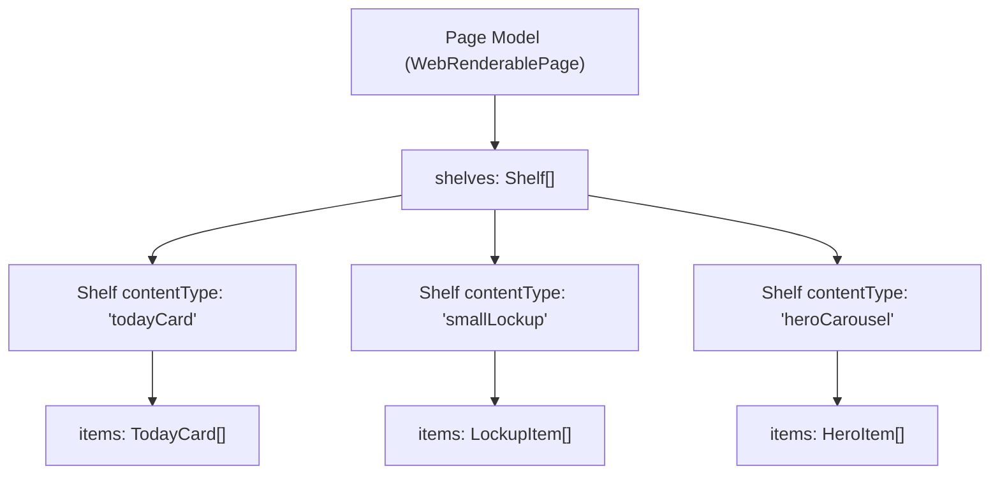
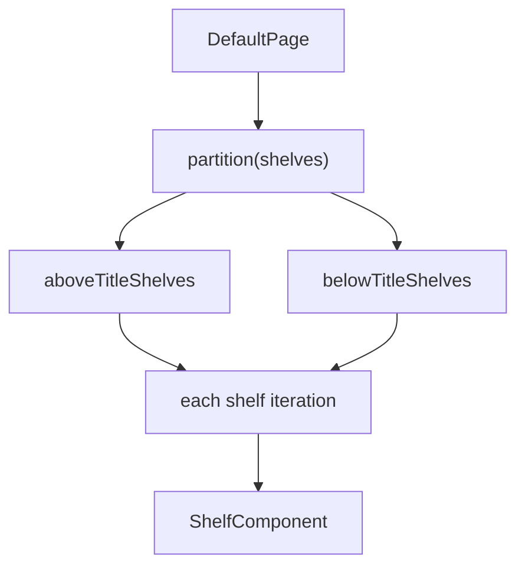
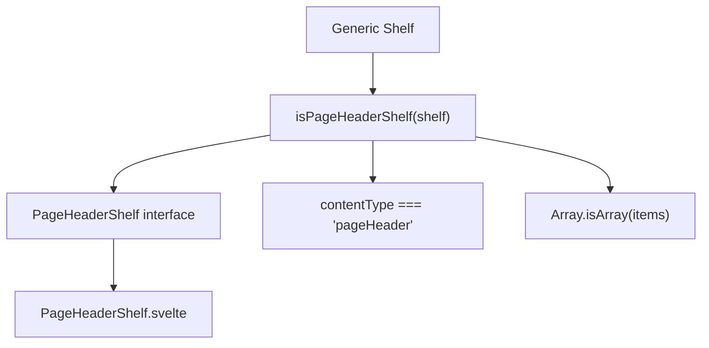
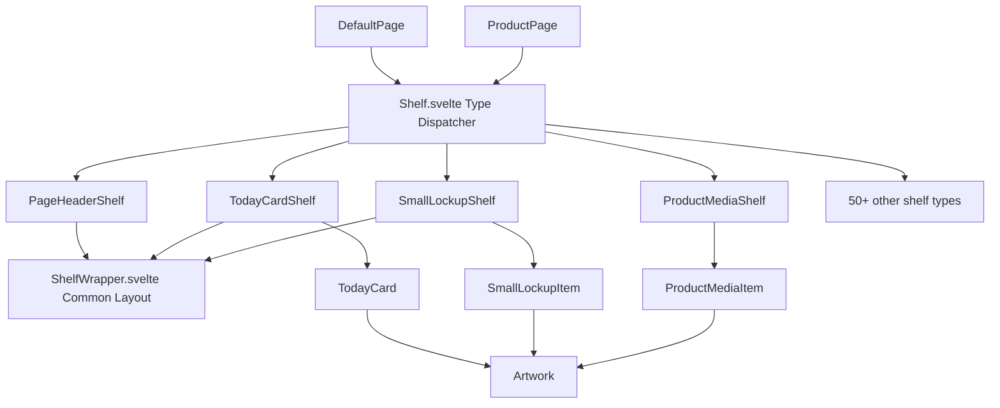
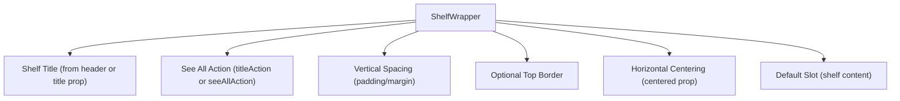
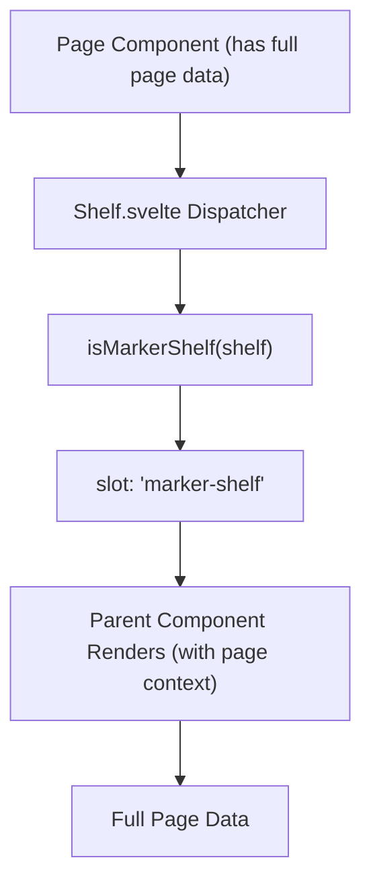
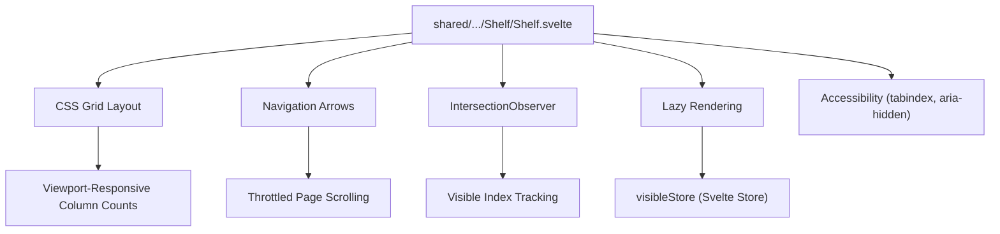
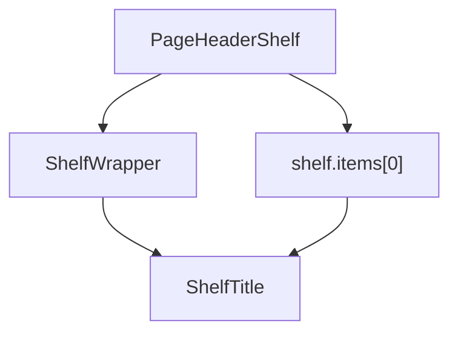

# Component Architecture

-   [shared/components/src/components/Shelf/Nav.svelte](https://github.com/Chesszyh/apps.apple.com/blob/279d0c4d/shared/components/src/components/Shelf/Nav.svelte)
-   [shared/components/src/components/Shelf/Shelf.svelte](https://github.com/Chesszyh/apps.apple.com/blob/279d0c4d/shared/components/src/components/Shelf/Shelf.svelte)
-   [src/components/Shelf/Wrapper.svelte](https://github.com/Chesszyh/apps.apple.com/blob/279d0c4d/src/components/Shelf/Wrapper.svelte)
-   [src/components/jet/action/ShelfBasedPageScrollAction.svelte](https://github.com/Chesszyh/apps.apple.com/blob/279d0c4d/src/components/jet/action/ShelfBasedPageScrollAction.svelte)
-   [src/components/jet/shelf/ArcadeFooterShelf.svelte](https://github.com/Chesszyh/apps.apple.com/blob/279d0c4d/src/components/jet/shelf/ArcadeFooterShelf.svelte)
-   [src/components/jet/shelf/PageHeaderShelf.svelte](https://github.com/Chesszyh/apps.apple.com/blob/279d0c4d/src/components/jet/shelf/PageHeaderShelf.svelte)
-   [src/components/jet/shelf/PrivacyFooterShelf.svelte](https://github.com/Chesszyh/apps.apple.com/blob/279d0c4d/src/components/jet/shelf/PrivacyFooterShelf.svelte)
-   [src/components/jet/shelf/Shelf.svelte](https://github.com/Chesszyh/apps.apple.com/blob/279d0c4d/src/components/jet/shelf/Shelf.svelte)
-   [src/components/pages/DefaultPage.svelte](https://github.com/Chesszyh/apps.apple.com/blob/279d0c4d/src/components/pages/DefaultPage.svelte)

## Purpose and Scope

This document provides an architectural overview of the component composition patterns that define how the App Store web application constructs its user interface. It covers the shelf-based page model, the type guard pattern for polymorphic rendering, and the component hierarchy that enables flexible, data-driven UI composition.

For details about how pages are initialized and dispatched through the intent system, see [Jet Application Core](#2.1) and [Intent and Action System](#2.2). For implementation details of specific shelf types and components, see [Shelf System](#4.2) and [Component Library](#5).

---

## Shelf-Based Page Model

The application follows a **shelf-based composition model** where pages are data structures containing arrays of `Shelf` objects. Each shelf represents a horizontal section of content that can display various types of content (apps, editorial cards, lockups, etc.).


**Sources:** [src/components/pages/DefaultPage.svelte1-15](https://github.com/Chesszyh/apps.apple.com/blob/279d0c4d/src/components/pages/DefaultPage.svelte#L1-L15)

### Page Component Responsibilities

Page components like `DefaultPage` are responsible for:

| Responsibility | Implementation |
| --- | --- |
| **Shelf Iteration** | Iterate through `page.shelves` array |
| **Title Rendering** | Display page title with positioning logic |
| **Shelf Partitioning** | Separate shelves above/below title based on presentation hints |
| **Slot Delegation** | Delegate marker shelf rendering to parent components |

The `DefaultPage` component demonstrates this pattern:


**Sources:** [src/components/pages/DefaultPage.svelte44-125](https://github.com/Chesszyh/apps.apple.com/blob/279d0c4d/src/components/pages/DefaultPage.svelte#L44-L125)

---

## Type Guard Pattern for Polymorphic Rendering

The application uses **TypeScript type guards** to implement polymorphic component rendering. A type guard is a function that narrows a generic type to a specific subtype, enabling type-safe dispatch to specialized components.

### Type Guard Structure

Each shelf type defines:

1.  **TypeScript Interface** - Extends base `Shelf` type with specific properties
2.  **Type Guard Function** - Runtime predicate that checks `contentType` and structure
3.  **Specialized Component** - Renders the specific shelf type


**Example Type Guard Implementation:**

The pattern is consistently applied across all shelf types:

```
// Interface definitioninterface PageHeaderShelf extends Shelf {    items: [PageHeader];}// Type guard predicateexport function isPageHeaderShelf(shelf: Shelf): shelf is PageHeaderShelf {    const { contentType, items } = shelf;    return contentType === 'pageHeader' && Array.isArray(items);}
```
**Sources:** [src/components/jet/shelf/PageHeaderShelf.svelte1-11](https://github.com/Chesszyh/apps.apple.com/blob/279d0c4d/src/components/jet/shelf/PageHeaderShelf.svelte#L1-L11) [src/components/jet/shelf/PrivacyFooterShelf.svelte1-14](https://github.com/Chesszyh/apps.apple.com/blob/279d0c4d/src/components/jet/shelf/PrivacyFooterShelf.svelte#L1-L14) [src/components/jet/shelf/ArcadeFooterShelf.svelte1-14](https://github.com/Chesszyh/apps.apple.com/blob/279d0c4d/src/components/jet/shelf/ArcadeFooterShelf.svelte#L1-L14)

---

## Component Hierarchy and Composition

The application implements a **four-layer component hierarchy** that composes from generic to specific:


**Sources:** [src/components/jet/shelf/Shelf.svelte1-320](https://github.com/Chesszyh/apps.apple.com/blob/279d0c4d/src/components/jet/shelf/Shelf.svelte#L1-L320) [src/components/Shelf/Wrapper.svelte1-82](https://github.com/Chesszyh/apps.apple.com/blob/279d0c4d/src/components/Shelf/Wrapper.svelte#L1-L82)

### Layer Responsibilities

| Layer | Responsibility | Example Components |
| --- | --- | --- |
| **Pages** | Orchestrate shelf arrays, handle title rendering, manage presentation options | `DefaultPage`, `ProductPage` |
| **Shelf Dispatcher** | Route generic shelves to specialized components via type guards | `Shelf.svelte` |
| **Specialized Shelves** | Render specific content types with custom layouts and item iteration | `TodayCardShelf`, `SmallLockupShelf`, `HeroCarouselShelf` |
| **Content Items** | Display individual content pieces with visual assets | `TodayCard`, `SmallLockupItem`, `Artwork` |

---

## The Shelf Dispatcher

The `Shelf.svelte` component acts as a **central type dispatcher** that routes generic `Shelf` models to 50+ specialized implementations through an extensive if-else chain of type guards.

### Dispatcher Architecture

```mermaid
flowchart TD
    Input["Generic Shelf"]
    Dispatcher["Shelf.svelte Dispatcher"]
    AS["AccessibilityHeaderShelf"]
    AF["AccessibilityFeaturesShelf"]
    AC["ActionShelf"]
    AP["AppPromotionShelf"]
    BS["BrickShelf"]
    HC["HeroCarouselShelf"]
    SL["SmallLockupShelf"]
    ML["MediumLockupShelf"]
    LL["LargeLockupShelf"]
    PM["ProductMediaShelf"]
    TC["TodayCardShelf"]
    Others["40+ more shelf types"]
    Slot["slot: 'marker-shelf'"]
    Fallback["FallbackShelf"]

    Input --> Dispatcher
    Dispatcher --> AS
    Dispatcher --> AF
    Dispatcher --> AC
    Dispatcher --> AP
    Dispatcher --> BS
    Dispatcher --> HC
    Dispatcher --> SL
    Dispatcher --> ML
    Dispatcher --> LL
    Dispatcher --> PM
    Dispatcher --> TC
    Dispatcher --> Others
    Dispatcher --> Slot
    Dispatcher --> Fallback
```


**Implementation Pattern:**

The dispatcher imports all type guards and components, then uses Svelte's `{#if}` / `{:else if}` chain for type-based routing:

```
{#if isAccessibilityHeaderShelf(shelf)}    <AccessibilityHeaderShelf {shelf} />{:else if isAccessibilityFeaturesShelf(shelf)}    <AccessibilityFeaturesShelf {shelf} />{:else if isActionShelf(shelf)}    <ActionShelf {shelf} /><!-- ... 50+ more type checks ... -->{:else if isMarkerShelf(shelf)}    <slot name="marker-shelf" {shelf} />{:else if isFallbackShelf(shelf)}    <FallbackShelf {shelf} />{/if}
```
**Sources:** [src/components/jet/shelf/Shelf.svelte1-320](https://github.com/Chesszyh/apps.apple.com/blob/279d0c4d/src/components/jet/shelf/Shelf.svelte#L1-L320)

### Type Guard Ordering

The dispatcher evaluates type guards in a **specific order**, with more specific types checked before more generic ones. The final guards handle special cases:

| Position | Purpose | Example |
| --- | --- | --- |
| **Early** | Specific content types | `isPageHeaderShelf`, `isProductMediaShelf` |
| **Middle** | Common shelf types | Lockups, cards, bricks |
| **Late** | Generic/fallback types | `isUberShelf`, `isMarkerShelf` |
| **Last** | Catch-all | `isFallbackShelf` |

---

## ShelfWrapper and Common Layout Patterns

`ShelfWrapper` provides **common layout and styling** that most shelf components need, implementing the DRY (Don't Repeat Yourself) principle for shelf presentation.

### ShelfWrapper Features


**Sources:** [src/components/Shelf/Wrapper.svelte1-82](https://github.com/Chesszyh/apps.apple.com/blob/279d0c4d/src/components/Shelf/Wrapper.svelte#L1-L82)

### Configurable Layout Options

| Property | Type | Purpose | Default |
| --- | --- | --- | --- |
| `centered` | `boolean` | Constrains shelf to page width with horizontal centering | `false` |
| `withTopBorder` | `boolean` | Adds 1px gray border above shelf | `false` |
| `withTopMargin` | `boolean` | Adds vertical margin above shelf | `false` |
| `withPaddingTop` | `boolean` | Adds padding above shelf content | `true` |
| `withBottomPadding` | `boolean` | Adds padding below shelf content | `true` |

### Usage Pattern

Most shelf components wrap their content with `ShelfWrapper` to inherit common layout:

```
<ShelfWrapper {shelf} centered withBottomPadding={false}>    <!-- Shelf-specific content --></ShelfWrapper>
```
**Sources:** [src/components/jet/shelf/PageHeaderShelf.svelte23-27](https://github.com/Chesszyh/apps.apple.com/blob/279d0c4d/src/components/jet/shelf/PageHeaderShelf.svelte#L23-L27) [src/components/jet/shelf/PrivacyFooterShelf.svelte26-30](https://github.com/Chesszyh/apps.apple.com/blob/279d0c4d/src/components/jet/shelf/PrivacyFooterShelf.svelte#L26-L30) [src/components/jet/shelf/ArcadeFooterShelf.svelte28-32](https://github.com/Chesszyh/apps.apple.com/blob/279d0c4d/src/components/jet/shelf/ArcadeFooterShelf.svelte#L28-L32)

---

## Slot-Based Component Extension

The application uses **Svelte slots** as an extension mechanism for components that need context from parent components.

### Marker Shelf Pattern

The `Shelf.svelte` dispatcher defines a `marker-shelf` slot for shelves that require page-level data not available at the shelf dispatcher level:


**Implementation:**

The dispatcher yields control back to the parent when encountering a marker shelf:

```
<!-- In Shelf.svelte -->{:else if isMarkerShelf(shelf)}    <slot name="marker-shelf" {shelf} />{/if}
```
The page component handles the slot:

```
<!-- In DefaultPage.svelte --><ShelfComponent {shelf}>    <slot name="marker-shelf" slot="marker-shelf" let:shelf {shelf} /></ShelfComponent>
```
This pattern allows pages to inject rendering logic for shelves that need access to page-level context (like `ProductPage`'s `MarkerShelf` which requires product platform information).

**Sources:** [src/components/jet/shelf/Shelf.svelte176-190](https://github.com/Chesszyh/apps.apple.com/blob/279d0c4d/src/components/jet/shelf/Shelf.svelte#L176-L190) [src/components/pages/DefaultPage.svelte94-97](https://github.com/Chesszyh/apps.apple.com/blob/279d0c4d/src/components/pages/DefaultPage.svelte#L94-L97)

---

## Horizontal Scrolling Shelf Component

For shelves that display scrollable horizontal content, a separate generic `Shelf` component (distinct from the dispatcher) provides scrolling infrastructure:


### Key Features

| Feature | Implementation |
| --- | --- |
| **Grid-Based Layout** | Uses CSS Grid with configurable `gridType` determining column counts per viewport |
| **Intersection Observer** | Tracks visible items, loads off-screen items progressively |
| **Navigation Arrows** | Left/right buttons for paging through content (hidden on xsmall viewport) |
| **Item Interactivity** | Manages `tabindex` and `disabled` attributes based on visibility |
| **RTL Support** | Automatically adjusts scroll direction for right-to-left locales |

**Sources:** [shared/components/src/components/Shelf/Shelf.svelte1-536](https://github.com/Chesszyh/apps.apple.com/blob/279d0c4d/shared/components/src/components/Shelf/Shelf.svelte#L1-L536) [shared/components/src/components/Shelf/Nav.svelte1-200](https://github.com/Chesszyh/apps.apple.com/blob/279d0c4d/shared/components/src/components/Shelf/Nav.svelte#L1-L200)

### Generic Type Parameter

The horizontal shelf uses Svelte's generic type parameter to provide type-safe item rendering:

```
<script lang="ts">    type T = $$Generic;    export let items: T[];</script>{#each items as item}    <slot name="item" item={cast(item)} />{/each}
```
This allows shelf implementations to pass any item type while maintaining type safety in the slot.

**Sources:** [shared/components/src/components/Shelf/Shelf.svelte23-66](https://github.com/Chesszyh/apps.apple.com/blob/279d0c4d/shared/components/src/components/Shelf/Shelf.svelte#L23-L66)

---

## Component Reusability Through Composition

The architecture emphasizes **composition over inheritance**, with components combining smaller, focused components to build complex UIs.

### Composition Example: PageHeaderShelf


The `PageHeaderShelf` composes `ShelfWrapper` and `ShelfTitle` without duplicating layout or styling logic:

**Sources:** [src/components/jet/shelf/PageHeaderShelf.svelte1-35](https://github.com/Chesszyh/apps.apple.com/blob/279d0c4d/src/components/jet/shelf/PageHeaderShelf.svelte#L1-L35)

### Benefits of Composition Architecture

| Benefit | Description |
| --- | --- |
| **Consistency** | Common components ensure uniform appearance across shelf types |
| **Maintainability** | Changes to layout patterns propagate automatically |
| **Flexibility** | Shelf implementations can opt-in/out of common features via props |
| **Type Safety** | TypeScript ensures correct prop passing throughout composition chain |
| **Testing** | Smaller components are easier to test in isolation |

---

## Summary

The component architecture implements a **data-driven, type-safe rendering system** through:

1.  **Shelf-Based Page Model** - Pages as arrays of generic shelf objects
2.  **Type Guard Pattern** - Runtime type narrowing for polymorphic dispatch
3.  **Central Dispatcher** - Single routing point for 50+ shelf types
4.  **Layered Hierarchy** - Clear separation between pages, shelves, and items
5.  **Common Layout Components** - Reusable wrappers for consistent presentation
6.  **Slot Extension Mechanism** - Parent components can inject context-specific rendering

This architecture enables the application to handle diverse content types through a unified, maintainable component system that balances type safety with rendering flexibility.
