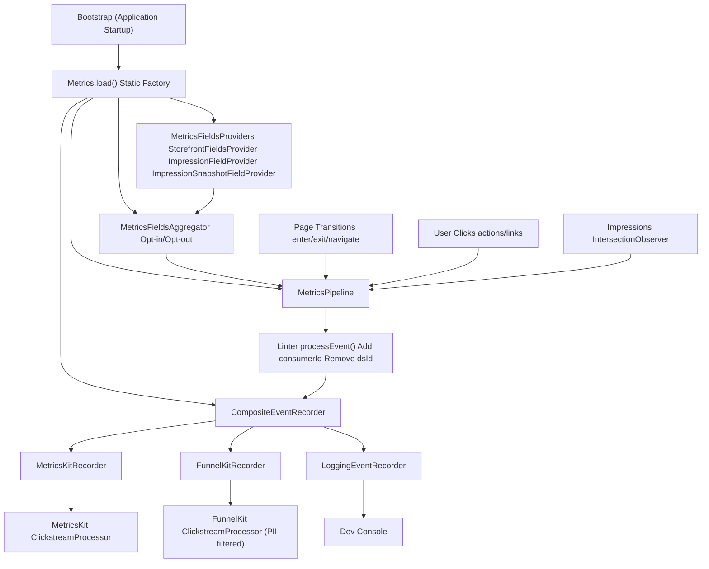
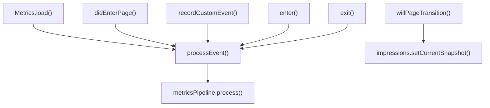
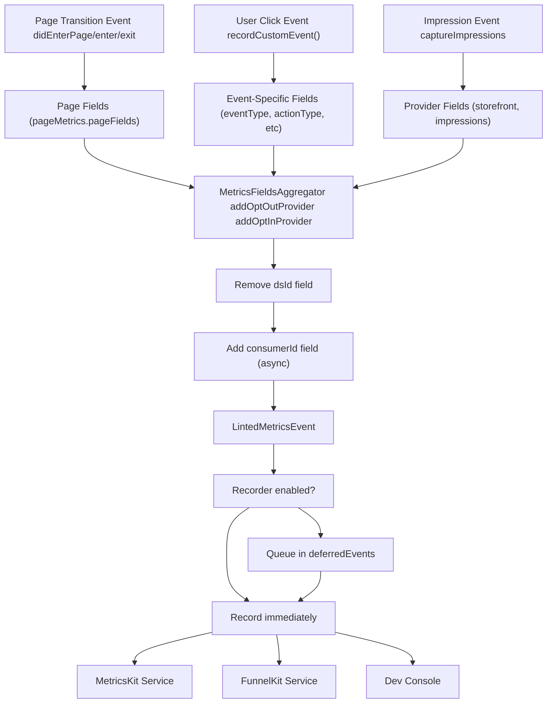
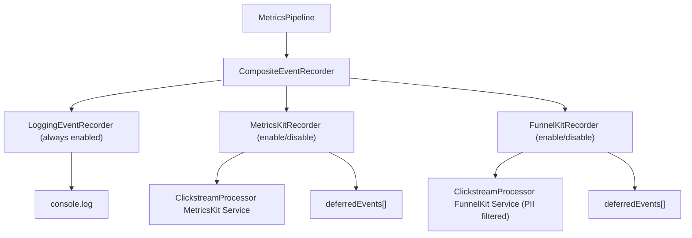
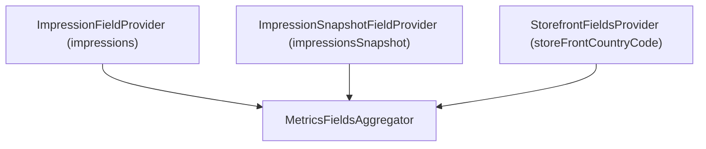
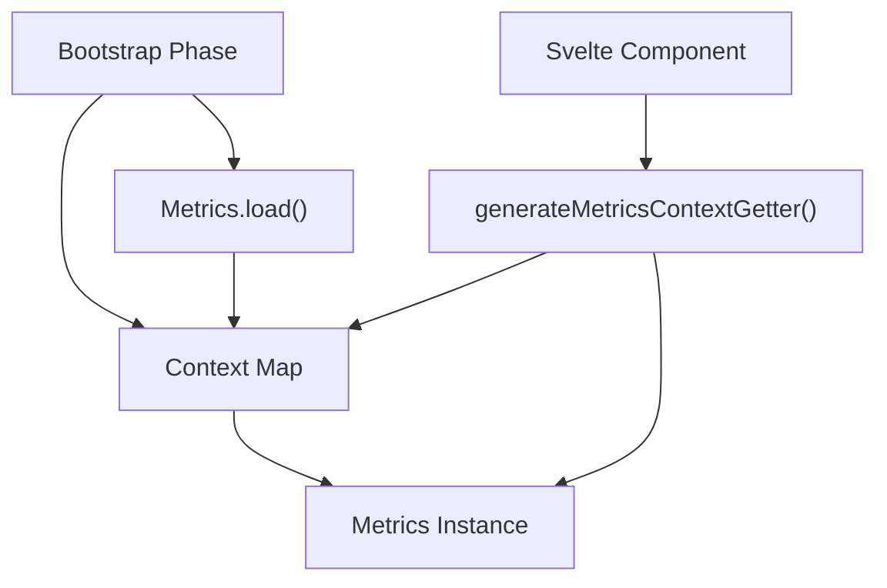

# Metrics and Analytics

-   [shared/metrics-8/src/impression-provider.ts](https://github.com/Chesszyh/apps.apple.com/blob/279d0c4d/shared/metrics-8/src/impression-provider.ts)
-   [shared/metrics-8/src/impression-snapshot-provider.ts](https://github.com/Chesszyh/apps.apple.com/blob/279d0c4d/shared/metrics-8/src/impression-snapshot-provider.ts)
-   [shared/metrics-8/src/impressions/index.ts](https://github.com/Chesszyh/apps.apple.com/blob/279d0c4d/shared/metrics-8/src/impressions/index.ts)
-   [shared/metrics-8/src/index.ts](https://github.com/Chesszyh/apps.apple.com/blob/279d0c4d/shared/metrics-8/src/index.ts)
-   [shared/metrics-8/src/recorder/composite.ts](https://github.com/Chesszyh/apps.apple.com/blob/279d0c4d/shared/metrics-8/src/recorder/composite.ts)
-   [shared/metrics-8/src/recorder/funnelkit.ts](https://github.com/Chesszyh/apps.apple.com/blob/279d0c4d/shared/metrics-8/src/recorder/funnelkit.ts)
-   [shared/metrics-8/src/recorder/logging.ts](https://github.com/Chesszyh/apps.apple.com/blob/279d0c4d/shared/metrics-8/src/recorder/logging.ts)
-   [shared/metrics-8/src/recorder/metricskit.ts](https://github.com/Chesszyh/apps.apple.com/blob/279d0c4d/shared/metrics-8/src/recorder/metricskit.ts)
-   [shared/metrics-8/src/recorder/void.ts](https://github.com/Chesszyh/apps.apple.com/blob/279d0c4d/shared/metrics-8/src/recorder/void.ts)
-   [src/jet/metrics/providers/StorefrontFieldsProvider.ts](https://github.com/Chesszyh/apps.apple.com/blob/279d0c4d/src/jet/metrics/providers/StorefrontFieldsProvider.ts)
-   [src/jet/metrics/providers/index.ts](https://github.com/Chesszyh/apps.apple.com/blob/279d0c4d/src/jet/metrics/providers/index.ts)

## Purpose and Scope

This document provides a comprehensive overview of the metrics and analytics system, which collects, processes, and delivers user interaction data throughout the application. The system implements a sophisticated pipeline architecture that captures page transitions, user clicks, and element impressions, then routes them to multiple analytics services including MetricsKit and FunnelKit.

For detailed information on specific subsystems:

-   Pipeline architecture and event processing: see [Metrics Pipeline](#3.1)
-   Event recorder implementations and delivery: see [Event Recorders](#3.2)
-   Impression tracking with IntersectionObserver: see [Impressions Tracking](#3.3)
-   Field aggregation and custom providers: see [Metrics Providers](#3.4)

---

## System Architecture

The metrics system is initialized during application bootstrap via the static `Metrics.load()` factory method, which constructs a complete pipeline from providers through to event delivery destinations.

**Sources:**

-   [shared/metrics-8/src/index.ts108-263](https://github.com/Chesszyh/apps.apple.com/blob/279d0c4d/shared/metrics-8/src/index.ts#L108-L263)
-   [shared/metrics-8/src/recorder/composite.ts1-21](https://github.com/Chesszyh/apps.apple.com/blob/279d0c4d/shared/metrics-8/src/recorder/composite.ts#L1-L21)

---

## Core Components

### Metrics Class

The `Metrics` class serves as the central orchestrator for all analytics operations. It is instantiated via the static `Metrics.load()` method and stored in the application context map.

| Property | Type | Purpose |
| --- | --- | --- |
| `metricsPipeline` | `MetricsPipeline` | Processes events through aggregation, linting, and recording |
| `currentPageMetrics` | `PageMetricsPresenter` | Tracks current page context and fields |
| `impressions` | `Impressions` | Manages IntersectionObserver-based impression tracking |
| `metricsKitRecorder` | `MetricsKitRecorder` | Records to MetricsKit service |
| `funnelKitRecorder` | `FunnelKitRecorder` | Records to FunnelKit service (optional) |

**Key Methods:**

**Sources:**

-   [shared/metrics-8/src/index.ts91-444](https://github.com/Chesszyh/apps.apple.com/blob/279d0c4d/shared/metrics-8/src/index.ts#L91-L444)

---

## Initialization Flow

The `Metrics.load()` method follows a multi-stage initialization process that handles both synchronous setup and asynchronous dependency loading.

> **[Mermaid sequence]**
> *(图表结构无法解析)*

**Deferred Event Queue:** Before asynchronous dependencies load, the `MetricsKitRecorder` and `FunnelKitRecorder` queue events in `deferredEvents` arrays. Once `setupEventRecorder()` is called, queued events are replayed.

**Sources:**

-   [shared/metrics-8/src/index.ts108-263](https://github.com/Chesszyh/apps.apple.com/blob/279d0c4d/shared/metrics-8/src/index.ts#L108-L263)
-   [shared/metrics-8/src/recorder/metricskit.ts29-213](https://github.com/Chesszyh/apps.apple.com/blob/279d0c4d/shared/metrics-8/src/recorder/metricskit.ts#L29-L213)
-   [shared/metrics-8/src/recorder/funnelkit.ts28-218](https://github.com/Chesszyh/apps.apple.com/blob/279d0c4d/shared/metrics-8/src/recorder/funnelkit.ts#L28-L218)

---

## Configuration Structure

The `Metrics.load()` method accepts a `Config` object with the following structure:

| Field | Type | Description |
| --- | --- | --- |
| `baseFields.appName` | `string` | Application identifier |
| `baseFields.delegateApp` | `string` | Delegate application name |
| `baseFields.appVersion` | `string` | Application version |
| `baseFields.resourceRevNum` | `string` | Resource revision number |
| `baseFields.storageObject` | `'sessionStorage' | 'localStorage'` | Storage object for MetricsKit |
| `clickstream` | `MetricKitConfig` | MetricsKit configuration with topic and constraint profiles |
| `funnel` | `FunnelKitConfig` (optional) | FunnelKit configuration (undefined to disable) |
| `initialURL` | `string | null` | Initial URL captured at launch |

**MetricSettings:**

| Field | Type | Description |
| --- | --- | --- |
| `shouldEnableImpressions` | `() => boolean` | Whether to enable impression tracking |
| `shouldEnableFunnelKit` | `() => boolean` | Whether to enable FunnelKit recorder |
| `getConsumerId` | `() => Promise<string>` | Async function to retrieve consumer ID |
| `suppressMetricsKit` | `boolean` | Disables MetricsKit (server-side rendering) |
| `impressions` | `ImpressionSettings` | Impression-specific configuration |

**Sources:**

-   [shared/metrics-8/src/index.ts55-86](https://github.com/Chesszyh/apps.apple.com/blob/279d0c4d/shared/metrics-8/src/index.ts#L55-L86)

---

## Event Lifecycle

Events flow through the system in a well-defined sequence, from capture through processing to delivery.

**Sources:**

-   [shared/metrics-8/src/index.ts371-387](https://github.com/Chesszyh/apps.apple.com/blob/279d0c4d/shared/metrics-8/src/index.ts#L371-L387)
-   [shared/metrics-8/src/index.ts176-199](https://github.com/Chesszyh/apps.apple.com/blob/279d0c4d/shared/metrics-8/src/index.ts#L176-L199)

---

## Event Types

The system processes several distinct event types, each with specific handling logic:

### Enter Events

Triggered when the application launches or returns from background. The `enter()` method determines the event subtype based on context.

| Type | Trigger | Special Fields |
| --- | --- | --- |
| `launch` | First page load, no referrer | `pwaDisplayMode` if from PWA |
| `link` | First page load, with referrer | `extRefUrl`, `refUrl` |
| `taskSwitch` | Visibility state changes to visible | \- |

**Sources:**

-   [shared/metrics-8/src/index.ts313-340](https://github.com/Chesszyh/apps.apple.com/blob/279d0c4d/shared/metrics-8/src/index.ts#L313-L340)
-   [shared/metrics-8/src/index.ts356-369](https://github.com/Chesszyh/apps.apple.com/blob/279d0c4d/shared/metrics-8/src/index.ts#L356-L369)

### Exit Events

Triggered when the application suspends or user navigates away.

| Type | Trigger | Special Behavior |
| --- | --- | --- |
| `taskSwitch` | Visibility state changes to hidden | Flushes unreported events |
| `navigate` | Page transition | Captures accumulated impressions |

**Sources:**

-   [shared/metrics-8/src/index.ts342-347](https://github.com/Chesszyh/apps.apple.com/blob/279d0c4d/shared/metrics-8/src/index.ts#L342-L347)
-   [shared/metrics-8/src/recorder/metricskit.ts86-122](https://github.com/Chesszyh/apps.apple.com/blob/279d0c4d/shared/metrics-8/src/recorder/metricskit.ts#L86-L122)

### Click Events

User interaction events that include snapshot impressions (current visible items).

**Sources:**

-   [shared/metrics-8/src/recorder/metricskit.ts126-137](https://github.com/Chesszyh/apps.apple.com/blob/279d0c4d/shared/metrics-8/src/recorder/metricskit.ts#L126-L137)

### Page Events

Generated automatically via `PageMetricsPresenter` when pages load/unload.

**Sources:**

-   [shared/metrics-8/src/index.ts289-311](https://github.com/Chesszyh/apps.apple.com/blob/279d0c4d/shared/metrics-8/src/index.ts#L289-L311)

### Impression Events

Accumulated impression data delivered on exit or navigate events. See [Impressions Tracking](#3.3) for details.

**Sources:**

-   [shared/metrics-8/src/recorder/metricskit.ts86-122](https://github.com/Chesszyh/apps.apple.com/blob/279d0c4d/shared/metrics-8/src/recorder/metricskit.ts#L86-L122)

---

## Recorder Architecture

The system uses a composite pattern to send events to multiple destinations simultaneously.

### Server-Side Rendering

On the server (when `typeof window === 'undefined'` or `suppressMetricsKit === true`), the system instantiates a `VoidEventRecorder` that counts events but doesn't send them anywhere.

**Sources:**

-   [shared/metrics-8/src/index.ts125-139](https://github.com/Chesszyh/apps.apple.com/blob/279d0c4d/shared/metrics-8/src/index.ts#L125-L139)
-   [shared/metrics-8/src/recorder/void.ts1-18](https://github.com/Chesszyh/apps.apple.com/blob/279d0c4d/shared/metrics-8/src/recorder/void.ts#L1-L18)
-   [shared/metrics-8/src/recorder/composite.ts1-21](https://github.com/Chesszyh/apps.apple.com/blob/279d0c4d/shared/metrics-8/src/recorder/composite.ts#L1-L21)

---

## MetricsKit vs FunnelKit

The system supports two distinct analytics services with different characteristics:

| Aspect | MetricsKit | FunnelKit |
| --- | --- | --- |
| **Topic** | `config.clickstream.topic` | `config.funnel.topic` |
| **PII Fields** | Allowed | Filtered out via `anonymous: true` |
| **Consumer ID** | Included | Removed from `IGNORED_FIELDS` |
| **Initialization** | Always initialized | Conditionally via `shouldEnableFunnelKit()` |
| **Enable/Disable** | `enableMetrics()` / `disableMetrics()` | `enableFunnelKit()` / `disableFunnelKit()` |
| **Transaction Events** | Standard signature | Special handling with different args |

**FunnelKit PII Filtering:**

The FunnelKit recorder removes fields listed in `IGNORED_FIELDS` and sets `anonymous: true` on the event recorder to prevent cookies and other PII from being captured.

**Sources:**

-   [shared/metrics-8/src/recorder/funnelkit.ts16-26](https://github.com/Chesszyh/apps.apple.com/blob/279d0c4d/shared/metrics-8/src/recorder/funnelkit.ts#L16-L26)
-   [shared/metrics-8/src/recorder/funnelkit.ts160-162](https://github.com/Chesszyh/apps.apple.com/blob/279d0c4d/shared/metrics-8/src/recorder/funnelkit.ts#L160-L162)
-   [shared/metrics-8/src/index.ts392-443](https://github.com/Chesszyh/apps.apple.com/blob/279d0c4d/shared/metrics-8/src/index.ts#L392-L443)

---

## Metrics Provider Pattern

Providers add contextual fields to events. The system distinguishes between opt-in and opt-out providers:

| Provider Type | Behavior | Use Case |
| --- | --- | --- |
| **Opt-Out** | Fields always included unless explicitly excluded | Default context (storefront, etc.) |
| **Opt-In** | Fields only included if explicitly requested | Expensive or conditional data (impressions) |

### Built-In Providers

### ImpressionFieldProvider

Consumes accumulated impressions (destructive read) for use in exit/navigate events when `captureType === 'jet'`.

**Sources:**

-   [shared/metrics-8/src/impression-provider.ts1-28](https://github.com/Chesszyh/apps.apple.com/blob/279d0c4d/shared/metrics-8/src/impression-provider.ts#L1-L28)

### ImpressionSnapshotFieldProvider

Captures a snapshot of current impressions (non-destructive read) for use in click events.

**Sources:**

-   [shared/metrics-8/src/impression-snapshot-provider.ts1-28](https://github.com/Chesszyh/apps.apple.com/blob/279d0c4d/shared/metrics-8/src/impression-snapshot-provider.ts#L1-L28)

### StorefrontFieldsProvider

Adds the current storefront country code to all events.

**Sources:**

-   [src/jet/metrics/providers/StorefrontFieldsProvider.ts1-20](https://github.com/Chesszyh/apps.apple.com/blob/279d0c4d/src/jet/metrics/providers/StorefrontFieldsProvider.ts#L1-L20)
-   [src/jet/metrics/providers/index.ts1-16](https://github.com/Chesszyh/apps.apple.com/blob/279d0c4d/src/jet/metrics/providers/index.ts#L1-L16)

---

## Page Transition Handling

The system tracks page changes through a coordinated sequence:

> **[Mermaid sequence]**
> *(图表结构无法解析)*

**Sources:**

-   [shared/metrics-8/src/index.ts284-311](https://github.com/Chesszyh/apps.apple.com/blob/279d0c4d/shared/metrics-8/src/index.ts#L284-L311)

---

## Development Console

In internal builds (`APP_SCOPE === 'internal'`), the system intercepts network requests to log metrics events to the browser console via `sendToMetricsDevConsole()`.

This enables developers to inspect:

-   Event payloads sent to MetricsKit/FunnelKit
-   Flush operations
-   Topic routing
-   Field transformations

**Sources:**

-   [shared/metrics-8/src/index.ts458-473](https://github.com/Chesszyh/apps.apple.com/blob/279d0c4d/shared/metrics-8/src/index.ts#L458-L473)
-   [shared/metrics-8/src/recorder/metricskit.ts110-113](https://github.com/Chesszyh/apps.apple.com/blob/279d0c4d/shared/metrics-8/src/recorder/metricskit.ts#L110-L113)
-   [shared/metrics-8/src/recorder/metricskit.ts168-171](https://github.com/Chesszyh/apps.apple.com/blob/279d0c4d/shared/metrics-8/src/recorder/metricskit.ts#L168-L171)

---

## Context Access

The `Metrics` instance is stored in the application context map under the key `'metrics'`. Components can retrieve it using the `generateMetricsContextGetter()` utility.

**Sources:**

-   [shared/metrics-8/src/index.ts259-261](https://github.com/Chesszyh/apps.apple.com/blob/279d0c4d/shared/metrics-8/src/index.ts#L259-L261)
-   [shared/metrics-8/src/index.ts563-575](https://github.com/Chesszyh/apps.apple.com/blob/279d0c4d/shared/metrics-8/src/index.ts#L563-L575)

---

## Summary

The Metrics and Analytics system provides:

1.  **Unified Pipeline**: Single flow from capture through processing to delivery
2.  **Multiple Destinations**: Simultaneous recording to MetricsKit, FunnelKit, and dev console
3.  **Extensible Providers**: Plug-in architecture for adding contextual fields
4.  **Async Initialization**: Non-blocking dependency loading with event queuing
5.  **PII Protection**: Automatic filtering for privacy-sensitive destinations
6.  **Impression Tracking**: IntersectionObserver-based visibility detection
7.  **Lifecycle Awareness**: Automatic tracking of page transitions and app state changes

For implementation details on each subsystem, see the child pages [3.1](#3.1), [3.2](#3.2), [3.3](#3.3), and [3.4](#3.4).

**Sources:**

-   [shared/metrics-8/src/index.ts1-579](https://github.com/Chesszyh/apps.apple.com/blob/279d0c4d/shared/metrics-8/src/index.ts#L1-L579)
