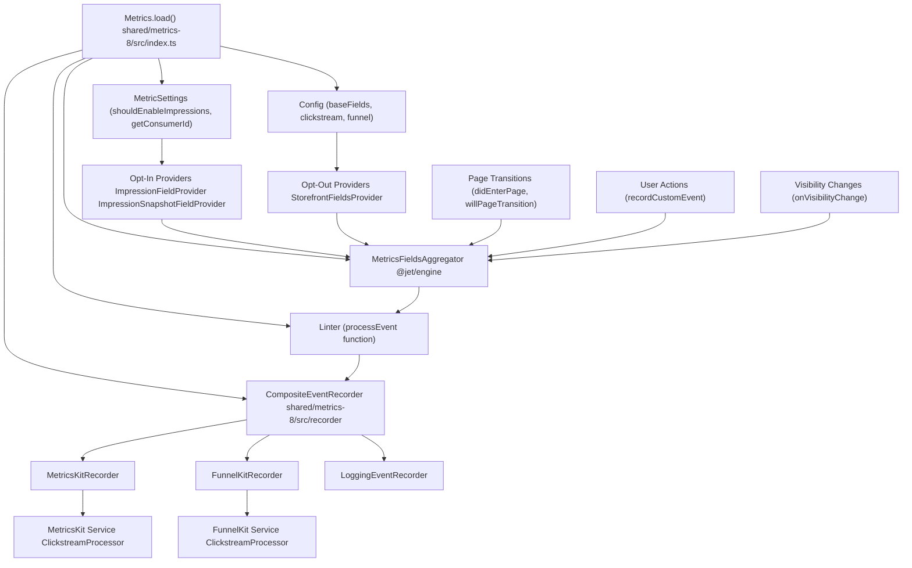
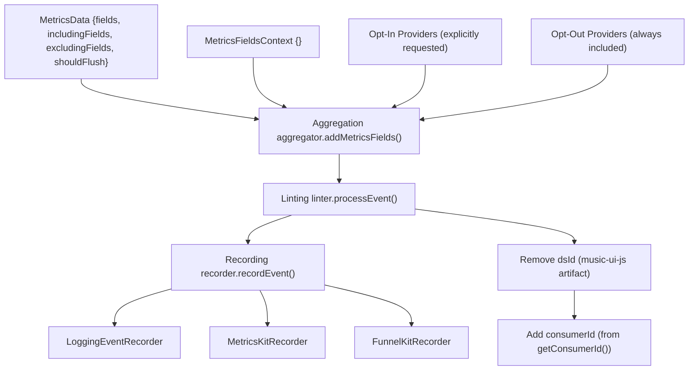
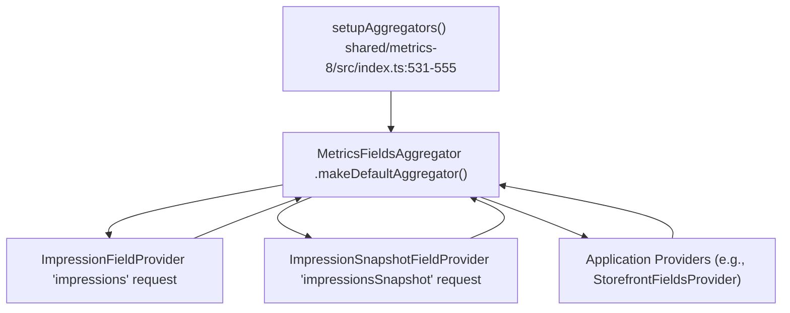
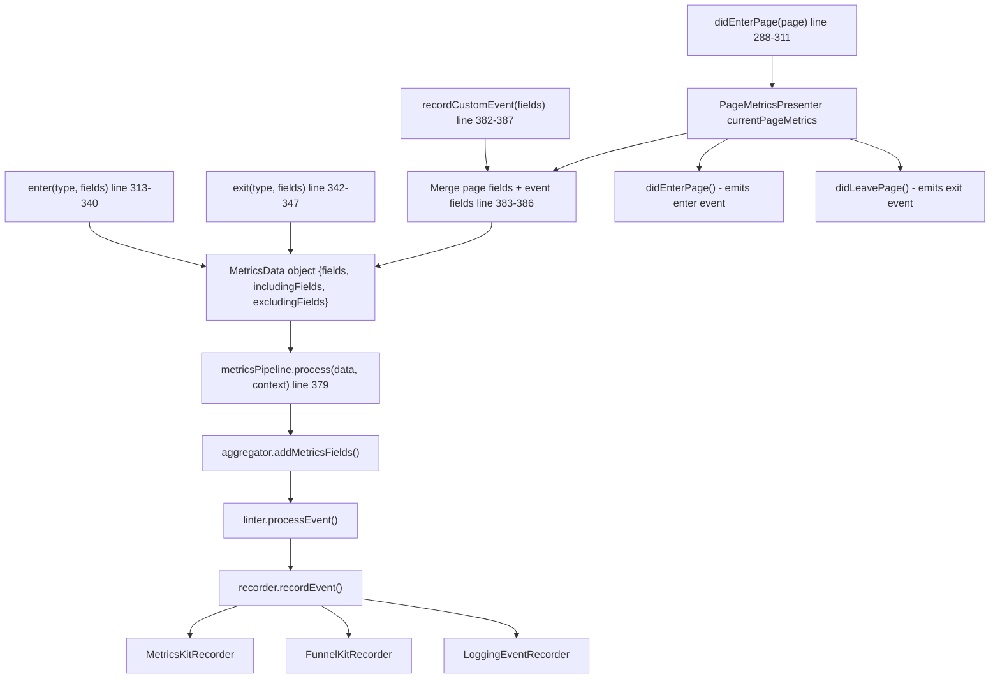

# Metrics Pipeline

-   [shared/metrics-8/src/impression-provider.ts](https://github.com/Chesszyh/apps.apple.com/blob/279d0c4d/shared/metrics-8/src/impression-provider.ts)
-   [shared/metrics-8/src/impression-snapshot-provider.ts](https://github.com/Chesszyh/apps.apple.com/blob/279d0c4d/shared/metrics-8/src/impression-snapshot-provider.ts)
-   [shared/metrics-8/src/impressions/index.ts](https://github.com/Chesszyh/apps.apple.com/blob/279d0c4d/shared/metrics-8/src/impressions/index.ts)
-   [shared/metrics-8/src/index.ts](https://github.com/Chesszyh/apps.apple.com/blob/279d0c4d/shared/metrics-8/src/index.ts)
-   [src/jet/metrics/providers/StorefrontFieldsProvider.ts](https://github.com/Chesszyh/apps.apple.com/blob/279d0c4d/src/jet/metrics/providers/StorefrontFieldsProvider.ts)
-   [src/jet/metrics/providers/index.ts](https://github.com/Chesszyh/apps.apple.com/blob/279d0c4d/src/jet/metrics/providers/index.ts)

## Purpose and Scope

This document details the metrics pipeline architecture, which processes analytics events from collection through delivery. It covers the `Metrics.load` initialization process, the `MetricsPipeline` architecture, field aggregation via `MetricsFieldsAggregator`, event linting, and the overall event processing flow.

For specific recorder implementations (MetricsKit, FunnelKit, Logging), see [Event Recorders](#3.2). For impressions tracking details, see [Impressions Tracking](#3.3). For creating custom metrics providers, see [Metrics Providers](#3.4).

---

## System Overview

The metrics pipeline implements a three-stage processing architecture: **Aggregation → Linting → Recording**. Events flow from data sources through field providers that enrich them with contextual data, then through a linter that normalizes the data, and finally to one or more recorders that deliver events to external analytics services.

### Pipeline Architecture Diagram


**Sources:** [shared/metrics-8/src/index.ts91-444](https://github.com/Chesszyh/apps.apple.com/blob/279d0c4d/shared/metrics-8/src/index.ts#L91-L444)

---

## Metrics.load Initialization

The `Metrics.load` static method is the entry point for initializing the metrics system. It performs environment detection, configures the pipeline, and asynchronously loads MetricsKit dependencies.

### Initialization Parameters

| Parameter | Type | Description |
| --- | --- | --- |
| `loggerFactory` | `LoggerFactory` | Creates logger instances for metrics components |
| `context` | `Map<string, unknown>` | Svelte context map for dependency injection |
| `processEvent` | `(fields) => Promise<LintedMetricsEvent>` | Linting function provided by the application |
| `config` | `Config` | MetricsKit and FunnelKit configuration |
| `listofMetricProviders` | `MetricsProvider[]` | Application-specific field providers |
| `settings` | `MetricSettings` | Runtime settings and feature flags |

**Sources:** [shared/metrics-8/src/index.ts108-115](https://github.com/Chesszyh/apps.apple.com/blob/279d0c4d/shared/metrics-8/src/index.ts#L108-L115)

### Server vs Client Initialization

The pipeline detects the execution environment and initializes accordingly:

**Server-Side Rendering:**

-   Creates a `VoidEventRecorder` that discards all events
-   Uses a no-op linter that returns fields unchanged
-   Returns a minimal `Metrics` instance without MetricsKit dependencies

**Client-Side:**

-   Sets up the full pipeline with aggregator, linter, and composite recorder
-   Asynchronously loads MetricsKit dependencies via dynamic imports
-   Initializes impressions tracking if enabled
-   Configures MetricsKit and optionally FunnelKit recorders

**Sources:** [shared/metrics-8/src/index.ts124-140](https://github.com/Chesszyh/apps.apple.com/blob/279d0c4d/shared/metrics-8/src/index.ts#L124-L140) [shared/metrics-8/src/index.ts142-262](https://github.com/Chesszyh/apps.apple.com/blob/279d0c4d/shared/metrics-8/src/index.ts#L142-L262)

### Initialization Sequence

> **[Mermaid sequence]**
> *(图表结构无法解析)*

**Sources:** [shared/metrics-8/src/index.ts108-263](https://github.com/Chesszyh/apps.apple.com/blob/279d0c4d/shared/metrics-8/src/index.ts#L108-L263) [shared/metrics-8/src/index.ts531-555](https://github.com/Chesszyh/apps.apple.com/blob/279d0c4d/shared/metrics-8/src/index.ts#L531-L555)

---

## MetricsPipeline Architecture

The `MetricsPipeline` class (from `@jet/engine`) orchestrates the three-stage event processing workflow. The `Metrics` class instantiates the pipeline with three key components:

### Pipeline Components

| Component | Type | Responsibility |
| --- | --- | --- |
| **Aggregator** | `MetricsFieldsAggregator` | Collects fields from all registered providers |
| **Linter** | `{ processEvent }` | Normalizes and enriches event data |
| **Recorder** | `CompositeEventRecorder` | Dispatches events to multiple destinations |


**Sources:** [shared/metrics-8/src/index.ts176-199](https://github.com/Chesszyh/apps.apple.com/blob/279d0c4d/shared/metrics-8/src/index.ts#L176-L199)

### Pipeline Instantiation

The pipeline is created during `Metrics.load`:

```
const metricsPipeline = new MetricsPipeline({    aggregator,    linter: {        processEvent: async (fields: MetricsFields) => {            const lintedEvent = await processEvent(fields);                        // Remove dsId added by music-ui-js            if (lintedEvent.fields?.dsId) {                delete lintedEvent.fields.dsId;            }                        // Add consumerId dynamically            const consumerId = await getConsumerId();            if (consumerId) {                lintedEvent.fields.consumerId = consumerId;            }                        return lintedEvent;        },    },    recorder,});
```
**Sources:** [shared/metrics-8/src/index.ts176-199](https://github.com/Chesszyh/apps.apple.com/blob/279d0c4d/shared/metrics-8/src/index.ts#L176-L199)

---

## Field Aggregation System

The `MetricsFieldsAggregator` collects fields from multiple providers and merges them into a single event payload. The system distinguishes between **opt-in** providers (only included when explicitly requested) and **opt-out** providers (always included unless explicitly excluded).

### setupAggregators Function

The `setupAggregators` function configures the aggregator with default and application-specific providers:


**Sources:** [shared/metrics-8/src/index.ts531-555](https://github.com/Chesszyh/apps.apple.com/blob/279d0c4d/shared/metrics-8/src/index.ts#L531-L555)

### Provider Registration

**Opt-In Providers** (added via `addOptInProvider`):

-   `ImpressionFieldProvider` - Consumes impressions for inclusion in events
-   `ImpressionSnapshotFieldProvider` - Captures impression snapshots

**Opt-Out Providers** (added via `addOptOutProvider`):

-   Application-specific providers from `listofMetricProviders` parameter
-   Example: `StorefrontFieldsProvider` adds `storeFrontCountryCode`

**Sources:** [shared/metrics-8/src/index.ts537-552](https://github.com/Chesszyh/apps.apple.com/blob/279d0c4d/shared/metrics-8/src/index.ts#L537-L552) [shared/metrics-8/src/impression-provider.ts9-27](https://github.com/Chesszyh/apps.apple.com/blob/279d0c4d/shared/metrics-8/src/impression-provider.ts#L9-L27) [shared/metrics-8/src/impression-snapshot-provider.ts9-27](https://github.com/Chesszyh/apps.apple.com/blob/279d0c4d/shared/metrics-8/src/impression-snapshot-provider.ts#L9-L27) [src/jet/metrics/providers/StorefrontFieldsProvider.ts9-19](https://github.com/Chesszyh/apps.apple.com/blob/279d0c4d/src/jet/metrics/providers/StorefrontFieldsProvider.ts#L9-L19)

### Provider Interface

All providers implement the `MetricsFieldsProvider` interface:

```
interface MetricsFieldsProvider {    addMetricsFields(        builder: MetricsFieldsBuilder,        metricsContext: MetricsFieldsContext    ): void;}
```
Providers use the `builder` to add fields to the event:

```
// Example from StorefrontFieldsProvideraddMetricsFields(builder: MetricsFieldsBuilder, _context: MetricsFieldsContext) {    const { storefront } = getLocale(this.objectGraph);    builder.addValue(storefront, 'storeFrontCountryCode');}
```
**Sources:** [src/jet/metrics/providers/StorefrontFieldsProvider.ts9-19](https://github.com/Chesszyh/apps.apple.com/blob/279d0c4d/src/jet/metrics/providers/StorefrontFieldsProvider.ts#L9-L19)

---

## Event Linting

The linter stage normalizes event data by removing unwanted fields and enriching events with dynamic runtime data. The linting logic is provided by the application via the `processEvent` function parameter.

### Linting Operations

The linter performs two key operations:

**1\. Remove `dsId` Field**

The `dsId` field is added by `music-ui-js` code but is erroneous for web applications. The linter removes it:

```
if (lintedEvent.fields?.dsId) {    delete lintedEvent.fields.dsId;}
```
**2\. Add `consumerId` Field**

The `consumerId` is fetched dynamically at event processing time (not at initialization) to support post-sign-in scenarios:

```
const consumerId = await getConsumerId();if (consumerId) {    lintedEvent.fields.consumerId = consumerId;}
```
**Sources:** [shared/metrics-8/src/index.ts179-196](https://github.com/Chesszyh/apps.apple.com/blob/279d0c4d/shared/metrics-8/src/index.ts#L179-L196)

### Linting Flow

> **[Mermaid sequence]**
> *(图表结构无法解析)*

**Sources:** [shared/metrics-8/src/index.ts179-196](https://github.com/Chesszyh/apps.apple.com/blob/279d0c4d/shared/metrics-8/src/index.ts#L179-L196)

---

## Event Processing Flow

Events flow through the metrics system via the `processEvent` and `recordCustomEvent` methods. These methods construct `MetricsData` objects and pass them to the pipeline.

### processEvent Method

The `processEvent` method is the low-level entry point for event processing:

```
async processEvent(metricsFields: MetricsFields) {    const metricsData: MetricsData = {        excludingFields: [],        includingFields: [],        shouldFlush: false,        fields: metricsFields,    };    const context: MetricsFieldsContext = {};    await this.metricsPipeline.process(metricsData, context);}
```
**Sources:** [shared/metrics-8/src/index.ts371-380](https://github.com/Chesszyh/apps.apple.com/blob/279d0c4d/shared/metrics-8/src/index.ts#L371-L380)

### recordCustomEvent Method

The `recordCustomEvent` method merges page-level fields with event-specific fields:

```
async recordCustomEvent(fields?: Opt<MetricsFields>) {    await this.processEvent({        ...this.currentPageMetrics?.pageMetrics?.pageFields,        ...fields,    });}
```
This ensures that every event includes page context (e.g., `pageId`, `pageType`) from the current `PageMetricsPresenter`.

**Sources:** [shared/metrics-8/src/index.ts382-387](https://github.com/Chesszyh/apps.apple.com/blob/279d0c4d/shared/metrics-8/src/index.ts#L382-L387)

### Complete Event Flow Diagram


**Sources:** [shared/metrics-8/src/index.ts288-387](https://github.com/Chesszyh/apps.apple.com/blob/279d0c4d/shared/metrics-8/src/index.ts#L288-L387)

### Page Transition Handling

The `Metrics` class manages page transitions and associated metrics events:

**`willPageTransition()`** - Called before navigation:

-   Captures impression snapshot for the current page

**`didEnterPage(page)`** - Called after navigation:

-   Exits the previous page metrics (emits exit event)
-   Creates a new `PageMetricsPresenter` for the current page
-   Emits enter event for the new page
-   Records first enter event with `launch` or `link` type

**Sources:** [shared/metrics-8/src/index.ts284-311](https://github.com/Chesszyh/apps.apple.com/blob/279d0c4d/shared/metrics-8/src/index.ts#L284-L311)

---

## MetricsKit and FunnelKit Setup

The metrics system configures two separate clickstream processors: one for MetricsKit (main analytics) and optionally one for FunnelKit (conversion tracking with PII filtering).

### setupMtkit Function

Creates the main MetricsKit clickstream processor:

**Sources:** [shared/metrics-8/src/index.ts488-500](https://github.com/Chesszyh/apps.apple.com/blob/279d0c4d/shared/metrics-8/src/index.ts#L488-L500)

### setupFunnelKit Function

Creates a separate clickstream processor for FunnelKit with PII filtering:

```
private setupFunnelKit(): void {    const { topic } = this.config.funnel;    const { clickstream, webDelegate } = setupStarkit(        this.ClickstreamProcessor,        this.WebDelegates,        this.config.funnel,        this.config.baseFields,    );        // Disable PII fields and cookies for the funnel topic    webDelegate.eventRecorder.setProperties?.(topic, {        anonymous: true,    });        this.funnelKitRecorder?.setupEventRecorder(clickstream);}
```
**Key Difference:** FunnelKit sets `anonymous: true` to disable PII collection and cookie tracking.

**Sources:** [shared/metrics-8/src/index.ts392-416](https://github.com/Chesszyh/apps.apple.com/blob/279d0c4d/shared/metrics-8/src/index.ts#L392-L416)

### Environment Delegates Configuration

Both clickstream processors are configured with application metadata via `setupMtkitDelegates`:

| Delegate | Value | Purpose |
| --- | --- | --- |
| `app` | `appName` | Application identifier |
| `appVersion` | `appVersion` | Application version string |
| `delegateApp` | `delegateApp` | Delegate application name |
| `resourceRevNum` | `resourceRevNum` | Resource revision number |
| `localStorageObject` | `sessionStorage` (optional) | Storage mechanism override |

**Sources:** [shared/metrics-8/src/index.ts502-529](https://github.com/Chesszyh/apps.apple.com/blob/279d0c4d/shared/metrics-8/src/index.ts#L502-L529)

### Async Dependency Loading

MetricsKit dependencies are loaded asynchronously to avoid blocking initial page render:

```
const metricsDependencies = [    import('@amp-metrics/mt-metricskit-processor-clickstream'),    import('@amp-metrics/mt-metricskit-delegates-web'),    impressions ? import('@amp-metrics/mt-impressions-observer') : undefined,] as const;const [{ ClickstreamProcessor }, { WebDelegates }, impressionsDependency] =     await Promise.all(metricsDependencies);
```
After loading, the recorders are initialized with their respective clickstream instances.

**Sources:** [shared/metrics-8/src/index.ts211-257](https://github.com/Chesszyh/apps.apple.com/blob/279d0c4d/shared/metrics-8/src/index.ts#L211-L257)

---

## Class Responsibilities Summary

| Class | File | Responsibility |
| --- | --- | --- |
| `Metrics` | [shared/metrics-8/src/index.ts91-444](https://github.com/Chesszyh/apps.apple.com/blob/279d0c4d/shared/metrics-8/src/index.ts#L91-L444) | Orchestrates initialization, manages page transitions, handles enter/exit events |
| `MetricsPipeline` | `@jet/engine` | Coordinates aggregation → linting → recording flow |
| `MetricsFieldsAggregator` | `@jet/engine` | Collects fields from opt-in and opt-out providers |
| `CompositeEventRecorder` | [shared/metrics-8/src/recorder](https://github.com/Chesszyh/apps.apple.com/blob/279d0c4d/shared/metrics-8/src/recorder) | Dispatches events to multiple recorders simultaneously |
| `MetricsKitRecorder` | [shared/metrics-8/src/recorder](https://github.com/Chesszyh/apps.apple.com/blob/279d0c4d/shared/metrics-8/src/recorder) | Records events to MetricsKit ClickstreamProcessor |
| `FunnelKitRecorder` | [shared/metrics-8/src/recorder](https://github.com/Chesszyh/apps.apple.com/blob/279d0c4d/shared/metrics-8/src/recorder) | Records events to FunnelKit ClickstreamProcessor (PII-filtered) |
| `LoggingEventRecorder` | [shared/metrics-8/src/recorder](https://github.com/Chesszyh/apps.apple.com/blob/279d0c4d/shared/metrics-8/src/recorder) | Logs events to developer console |
| `ImpressionFieldProvider` | [shared/metrics-8/src/impression-provider.ts9-27](https://github.com/Chesszyh/apps.apple.com/blob/279d0c4d/shared/metrics-8/src/impression-provider.ts#L9-L27) | Adds consumed impressions to events |
| `ImpressionSnapshotFieldProvider` | [shared/metrics-8/src/impression-snapshot-provider.ts9-27](https://github.com/Chesszyh/apps.apple.com/blob/279d0c4d/shared/metrics-8/src/impression-snapshot-provider.ts#L9-L27) | Adds impression snapshots to events |
| `PageMetricsPresenter` | `@jet/engine` | Manages page-level metrics and emits page enter/exit events |

**Sources:** [shared/metrics-8/src/index.ts1-579](https://github.com/Chesszyh/apps.apple.com/blob/279d0c4d/shared/metrics-8/src/index.ts#L1-L579)
