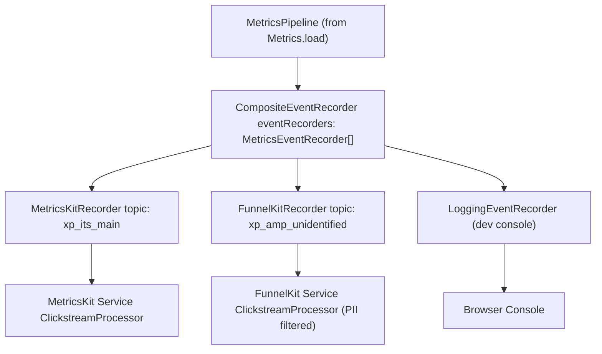
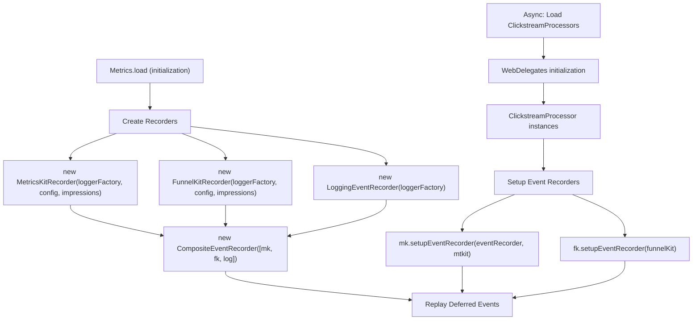

# Event Recorders

-   [shared/metrics-8/src/recorder/composite.ts](https://github.com/Chesszyh/apps.apple.com/blob/279d0c4d/shared/metrics-8/src/recorder/composite.ts)
-   [shared/metrics-8/src/recorder/funnelkit.ts](https://github.com/Chesszyh/apps.apple.com/blob/279d0c4d/shared/metrics-8/src/recorder/funnelkit.ts)
-   [shared/metrics-8/src/recorder/logging.ts](https://github.com/Chesszyh/apps.apple.com/blob/279d0c4d/shared/metrics-8/src/recorder/logging.ts)
-   [shared/metrics-8/src/recorder/metricskit.ts](https://github.com/Chesszyh/apps.apple.com/blob/279d0c4d/shared/metrics-8/src/recorder/metricskit.ts)
-   [shared/metrics-8/src/recorder/void.ts](https://github.com/Chesszyh/apps.apple.com/blob/279d0c4d/shared/metrics-8/src/recorder/void.ts)

## Purpose and Scope

Event Recorders are the final stage of the metrics pipeline, responsible for delivering processed metrics events to external analytics services. This document covers the `MetricsEventRecorder` interface, the composite pattern architecture, and the specific implementations that send events to MetricsKit, FunnelKit, and development consoles.

For information about how events are collected and processed before reaching recorders, see [Metrics Pipeline](#3.1). For details on impression tracking that integrates with recorders, see [Impressions Tracking](#3.3).

---

## MetricsEventRecorder Interface

All event recorders implement the `MetricsEventRecorder` interface from `@jet/engine`, which defines two core operations:

```
interface MetricsEventRecorder {    record(event: LintedMetricsEvent, topic: Opt<string>): void;    flush(): Promise<number>;}
```
| Method | Parameters | Returns | Purpose |
| --- | --- | --- | --- |
| `record()` | `event: LintedMetricsEvent`
`topic: Opt<string>` | `void` | Accepts a linted event and optional topic, then delivers it to the analytics service |
| `flush()` | None | `Promise<number>` | Forces delivery of any queued events and returns the count of flushed events |

**Sources:** [shared/metrics-8/src/recorder/composite.ts1-20](https://github.com/Chesszyh/apps.apple.com/blob/279d0c4d/shared/metrics-8/src/recorder/composite.ts#L1-L20) [shared/metrics-8/src/recorder/metricskit.ts1-4](https://github.com/Chesszyh/apps.apple.com/blob/279d0c4d/shared/metrics-8/src/recorder/metricskit.ts#L1-L4)

---

## Recorder Architecture

### Composite Pattern Implementation

The system uses a **CompositeEventRecorder** to broadcast events to multiple recorders simultaneously. This allows metrics to be sent to MetricsKit, FunnelKit, and logging outputs in parallel.


**Diagram: Composite Recorder Pattern**

The `CompositeEventRecorder` iterates through its array of recorders and calls `record()` on each one:

[shared/metrics-8/src/recorder/composite.ts8-11](https://github.com/Chesszyh/apps.apple.com/blob/279d0c4d/shared/metrics-8/src/recorder/composite.ts#L8-L11)

**Sources:** [shared/metrics-8/src/recorder/composite.ts1-20](https://github.com/Chesszyh/apps.apple.com/blob/279d0c4d/shared/metrics-8/src/recorder/composite.ts#L1-L20)

---

## MetricsKitRecorder

The `MetricsKitRecorder` delivers events to Apple's MetricsKit service using the ClickstreamProcessor.

### Configuration

[shared/metrics-8/src/recorder/metricskit.ts24-27](https://github.com/Chesszyh/apps.apple.com/blob/279d0c4d/shared/metrics-8/src/recorder/metricskit.ts#L24-L27)

| Field | Type | Purpose |
| --- | --- | --- |
| `topic` | `string` | Clickstream topic (e.g., `"xp_its_main"`) |
| `constraintProfiles` | `string[]` | Profiles that constrain event recording |

### Key Features

#### Event Type Validation

The recorder validates that events contain a valid `eventType` field matching one of the supported types defined in `METRICS_EVENT_TYPES`:

[shared/metrics-8/src/recorder/metricskit.ts65-77](https://github.com/Chesszyh/apps.apple.com/blob/279d0c4d/shared/metrics-8/src/recorder/metricskit.ts#L65-L77)

#### Impressions Integration

The recorder integrates with the impressions system in two ways:

**Accumulated Impressions (on exit/navigate):** When users leave a page (`exit` event) or navigate (`click` with `actionType: 'navigate'`), the recorder consumes accumulated impressions and sends them as a separate impressions event:

[shared/metrics-8/src/recorder/metricskit.ts86-122](https://github.com/Chesszyh/apps.apple.com/blob/279d0c4d/shared/metrics-8/src/recorder/metricskit.ts#L86-L122)

**Snapshot Impressions (on click):** For click events, the recorder captures a snapshot of current impressions to include in the click event data:

[shared/metrics-8/src/recorder/metricskit.ts126-137](https://github.com/Chesszyh/apps.apple.com/blob/279d0c4d/shared/metrics-8/src/recorder/metricskit.ts#L126-L137)

#### Enable/Disable Controls

The recorder can be enabled or disabled at runtime:

[shared/metrics-8/src/recorder/metricskit.ts219-238](https://github.com/Chesszyh/apps.apple.com/blob/279d0c4d/shared/metrics-8/src/recorder/metricskit.ts#L219-L238)

When disabled, events are logged but not sent to MetricsKit.

**Sources:** [shared/metrics-8/src/recorder/metricskit.ts1-240](https://github.com/Chesszyh/apps.apple.com/blob/279d0c4d/shared/metrics-8/src/recorder/metricskit.ts#L1-L240)

---

## FunnelKitRecorder

The `FunnelKitRecorder` sends events to Apple's FunnelKit service for funnel analysis. Unlike MetricsKit, FunnelKit has strict PII filtering requirements.

### PII Filtering

FunnelKit explicitly removes fields considered personally identifiable information:

[shared/metrics-8/src/recorder/funnelkit.ts22-26](https://github.com/Chesszyh/apps.apple.com/blob/279d0c4d/shared/metrics-8/src/recorder/funnelkit.ts#L22-L26)

The `consumerId` field (added by the linting process) is removed before sending to FunnelKit:

[shared/metrics-8/src/recorder/funnelkit.ts160-162](https://github.com/Chesszyh/apps.apple.com/blob/279d0c4d/shared/metrics-8/src/recorder/funnelkit.ts#L160-L162)

### Topic Handling

FunnelKit has special topic handling logic for Apple TV:

[shared/metrics-8/src/recorder/funnelkit.ts57-63](https://github.com/Chesszyh/apps.apple.com/blob/279d0c4d/shared/metrics-8/src/recorder/funnelkit.ts#L57-L63)

This ensures TV metrics always use the unidentified topic.

### Transaction Events

FunnelKit handles transaction events differently than other event types, using a different method signature:

[shared/metrics-8/src/recorder/funnelkit.ts138-143](https://github.com/Chesszyh/apps.apple.com/blob/279d0c4d/shared/metrics-8/src/recorder/funnelkit.ts#L138-L143)

### Enable/Disable

FunnelKit has a separate enable/disable mechanism from MetricsKit:

[shared/metrics-8/src/recorder/funnelkit.ts220-236](https://github.com/Chesszyh/apps.apple.com/blob/279d0c4d/shared/metrics-8/src/recorder/funnelkit.ts#L220-L236)

When disabled, events are logged but not sent.

**Sources:** [shared/metrics-8/src/recorder/funnelkit.ts1-238](https://github.com/Chesszyh/apps.apple.com/blob/279d0c4d/shared/metrics-8/src/recorder/funnelkit.ts#L1-L238)

---

## Supporting Recorders

### LoggingEventRecorder

The `LoggingEventRecorder` outputs all events to the browser console, useful for development and debugging:

[shared/metrics-8/src/recorder/logging.ts6-21](https://github.com/Chesszyh/apps.apple.com/blob/279d0c4d/shared/metrics-8/src/recorder/logging.ts#L6-L21)

### VoidEventRecorder

The `VoidEventRecorder` silently consumes events without sending them anywhere, tracking only a count:

[shared/metrics-8/src/recorder/void.ts5-17](https://github.com/Chesszyh/apps.apple.com/blob/279d0c4d/shared/metrics-8/src/recorder/void.ts#L5-L17)

This is useful for testing scenarios where you want to verify event recording without actual delivery.

**Sources:** [shared/metrics-8/src/recorder/logging.ts1-22](https://github.com/Chesszyh/apps.apple.com/blob/279d0c4d/shared/metrics-8/src/recorder/logging.ts#L1-L22) [shared/metrics-8/src/recorder/void.ts1-18](https://github.com/Chesszyh/apps.apple.com/blob/279d0c4d/shared/metrics-8/src/recorder/void.ts#L1-L18)

---

## Deferred Event Handling

Both `MetricsKitRecorder` and `FunnelKitRecorder` implement deferred event handling to queue events that arrive before the ClickstreamProcessor is initialized.

> **[Mermaid sequence]**
> *(图表结构无法解析)*

**Diagram: Deferred Event Pattern**

### Implementation

The deferred events queue is declared as a private field:

[shared/metrics-8/src/recorder/metricskit.ts41](https://github.com/Chesszyh/apps.apple.com/blob/279d0c4d/shared/metrics-8/src/recorder/metricskit.ts#L41-L41)

Events are queued when the `eventRecorder` is not yet available:

[shared/metrics-8/src/recorder/metricskit.ts191-193](https://github.com/Chesszyh/apps.apple.com/blob/279d0c4d/shared/metrics-8/src/recorder/metricskit.ts#L191-L193)

Once `setupEventRecorder()` is called, all queued events are replayed:

[shared/metrics-8/src/recorder/metricskit.ts203-213](https://github.com/Chesszyh/apps.apple.com/blob/279d0c4d/shared/metrics-8/src/recorder/metricskit.ts#L203-L213)

The same pattern is implemented in `FunnelKitRecorder`:

[shared/metrics-8/src/recorder/funnelkit.ts39](https://github.com/Chesszyh/apps.apple.com/blob/279d0c4d/shared/metrics-8/src/recorder/funnelkit.ts#L39-L39) [shared/metrics-8/src/recorder/funnelkit.ts196-198](https://github.com/Chesszyh/apps.apple.com/blob/279d0c4d/shared/metrics-8/src/recorder/funnelkit.ts#L196-L198) [shared/metrics-8/src/recorder/funnelkit.ts212-218](https://github.com/Chesszyh/apps.apple.com/blob/279d0c4d/shared/metrics-8/src/recorder/funnelkit.ts#L212-L218)

**Sources:** [shared/metrics-8/src/recorder/metricskit.ts38-213](https://github.com/Chesszyh/apps.apple.com/blob/279d0c4d/shared/metrics-8/src/recorder/metricskit.ts#L38-L213) [shared/metrics-8/src/recorder/funnelkit.ts36-218](https://github.com/Chesszyh/apps.apple.com/blob/279d0c4d/shared/metrics-8/src/recorder/funnelkit.ts#L36-L218)

---

## Event Flushing

### Automatic Flushing on Exit

Both recorders automatically flush unreported events when an `exit` event is processed:

**MetricsKit:** [shared/metrics-8/src/recorder/metricskit.ts183-190](https://github.com/Chesszyh/apps.apple.com/blob/279d0c4d/shared/metrics-8/src/recorder/metricskit.ts#L183-L190)

**FunnelKit:** [shared/metrics-8/src/recorder/funnelkit.ts180-190](https://github.com/Chesszyh/apps.apple.com/blob/279d0c4d/shared/metrics-8/src/recorder/funnelkit.ts#L180-L190)

### Manual Flushing

The `flush()` method forces delivery of queued events and returns the count of events that were flushed:

**MetricsKit:** [shared/metrics-8/src/recorder/metricskit.ts196-201](https://github.com/Chesszyh/apps.apple.com/blob/279d0c4d/shared/metrics-8/src/recorder/metricskit.ts#L196-L201)

**FunnelKit:** [shared/metrics-8/src/recorder/funnelkit.ts201-210](https://github.com/Chesszyh/apps.apple.com/blob/279d0c4d/shared/metrics-8/src/recorder/funnelkit.ts#L201-L210)

The `CompositeEventRecorder` flushes all child recorders in parallel and returns the maximum count:

[shared/metrics-8/src/recorder/composite.ts14-19](https://github.com/Chesszyh/apps.apple.com/blob/279d0c4d/shared/metrics-8/src/recorder/composite.ts#L14-L19)

**Sources:** [shared/metrics-8/src/recorder/metricskit.ts183-201](https://github.com/Chesszyh/apps.apple.com/blob/279d0c4d/shared/metrics-8/src/recorder/metricskit.ts#L183-L201) [shared/metrics-8/src/recorder/funnelkit.ts180-210](https://github.com/Chesszyh/apps.apple.com/blob/279d0c4d/shared/metrics-8/src/recorder/funnelkit.ts#L180-L210) [shared/metrics-8/src/recorder/composite.ts14-19](https://github.com/Chesszyh/apps.apple.com/blob/279d0c4d/shared/metrics-8/src/recorder/composite.ts#L14-L19)

---

## Recorder Setup Flow


**Diagram: Recorder Initialization and Setup**

**Sources:** [shared/metrics-8/src/recorder/metricskit.ts43-53](https://github.com/Chesszyh/apps.apple.com/blob/279d0c4d/shared/metrics-8/src/recorder/metricskit.ts#L43-L53) [shared/metrics-8/src/recorder/funnelkit.ts41-51](https://github.com/Chesszyh/apps.apple.com/blob/279d0c4d/shared/metrics-8/src/recorder/funnelkit.ts#L41-L51) [shared/metrics-8/src/recorder/composite.ts5-6](https://github.com/Chesszyh/apps.apple.com/blob/279d0c4d/shared/metrics-8/src/recorder/composite.ts#L5-L6)

---

## Event Type Support Matrix

| Event Type | MetricsKit | FunnelKit | Special Handling |
| --- | --- | --- | --- |
| `click` | ✓ | ✓ | Snapshot impressions attached |
| `exit` | ✓ | ✓ | Consumes impressions, triggers flush |
| `enter` | ✓ | ✓ | Standard page event |
| `navigate` | ✓ | ✓ | Consumes impressions if configured |
| `impressions` | ✓ | ✓ | Requires impressions system enabled |
| `transaction` | ✓ | ✓ | FunnelKit uses different signature |

**Sources:** [shared/metrics-8/src/recorder/metricskit.ts66-83](https://github.com/Chesszyh/apps.apple.com/blob/279d0c4d/shared/metrics-8/src/recorder/metricskit.ts#L66-L83) [shared/metrics-8/src/recorder/funnelkit.ts71-80](https://github.com/Chesszyh/apps.apple.com/blob/279d0c4d/shared/metrics-8/src/recorder/funnelkit.ts#L71-L80) [shared/metrics-8/src/recorder/funnelkit.ts138-143](https://github.com/Chesszyh/apps.apple.com/blob/279d0c4d/shared/metrics-8/src/recorder/funnelkit.ts#L138-L143)

---

## Runtime Configuration

### MetricsKit Configuration

```
interface MetricKitConfig {    constraintProfiles: string[];    topic: string;}
```
### FunnelKit Configuration

```
interface FunnelKitConfig {    constraintProfiles: string[];    topic: string;}
```
### Dynamic Control

Both recorders support runtime enable/disable:

```
// MetricsKitrecorder.enable();   // Enables event recordingrecorder.disable();  // Suppresses event recording// FunnelKitrecorder.enableFunnelKit();   // Enables FunnelKit recordingrecorder.disableFunnelKit();  // Suppresses FunnelKit recording
```
**Sources:** [shared/metrics-8/src/recorder/metricskit.ts24-27](https://github.com/Chesszyh/apps.apple.com/blob/279d0c4d/shared/metrics-8/src/recorder/metricskit.ts#L24-L27) [shared/metrics-8/src/recorder/metricskit.ts215-238](https://github.com/Chesszyh/apps.apple.com/blob/279d0c4d/shared/metrics-8/src/recorder/metricskit.ts#L215-L238) [shared/metrics-8/src/recorder/funnelkit.ts16-19](https://github.com/Chesszyh/apps.apple.com/blob/279d0c4d/shared/metrics-8/src/recorder/funnelkit.ts#L16-L19) [shared/metrics-8/src/recorder/funnelkit.ts220-236](https://github.com/Chesszyh/apps.apple.com/blob/279d0c4d/shared/metrics-8/src/recorder/funnelkit.ts#L220-L236)
