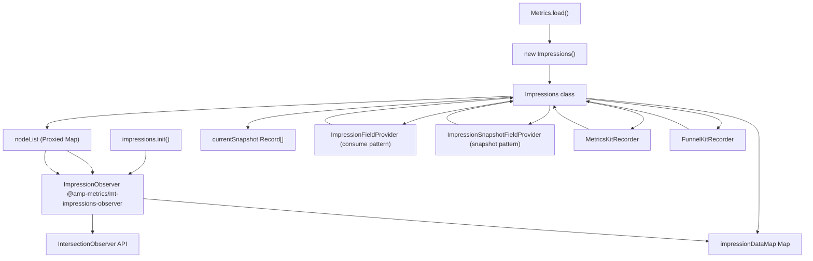
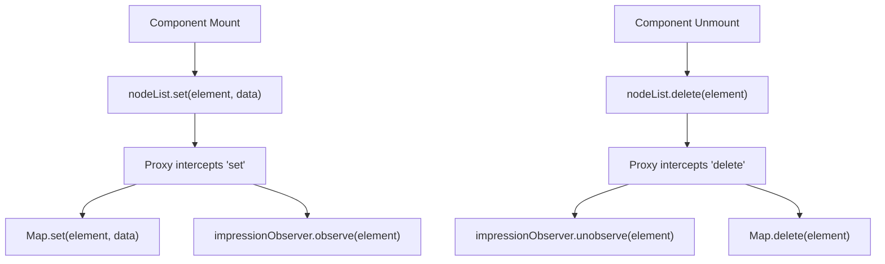
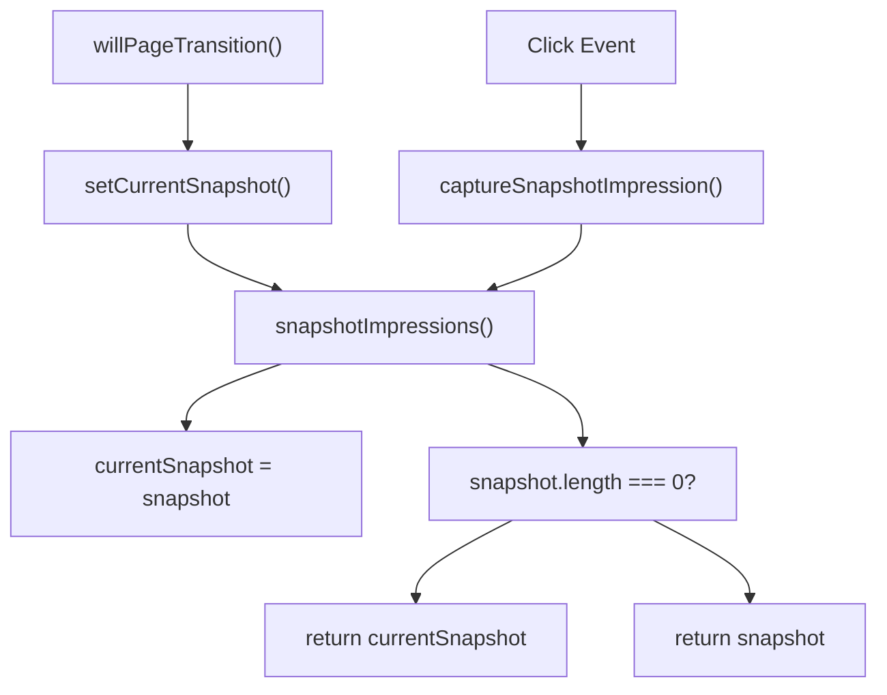

# Impressions Tracking

-   [shared/metrics-8/src/impression-provider.ts](https://github.com/Chesszyh/apps.apple.com/blob/279d0c4d/shared/metrics-8/src/impression-provider.ts)
-   [shared/metrics-8/src/impression-snapshot-provider.ts](https://github.com/Chesszyh/apps.apple.com/blob/279d0c4d/shared/metrics-8/src/impression-snapshot-provider.ts)
-   [shared/metrics-8/src/impressions/index.ts](https://github.com/Chesszyh/apps.apple.com/blob/279d0c4d/shared/metrics-8/src/impressions/index.ts)
-   [shared/metrics-8/src/index.ts](https://github.com/Chesszyh/apps.apple.com/blob/279d0c4d/shared/metrics-8/src/index.ts)
-   [shared/metrics-8/src/recorder/composite.ts](https://github.com/Chesszyh/apps.apple.com/blob/279d0c4d/shared/metrics-8/src/recorder/composite.ts)
-   [shared/metrics-8/src/recorder/funnelkit.ts](https://github.com/Chesszyh/apps.apple.com/blob/279d0c4d/shared/metrics-8/src/recorder/funnelkit.ts)
-   [shared/metrics-8/src/recorder/logging.ts](https://github.com/Chesszyh/apps.apple.com/blob/279d0c4d/shared/metrics-8/src/recorder/logging.ts)
-   [shared/metrics-8/src/recorder/metricskit.ts](https://github.com/Chesszyh/apps.apple.com/blob/279d0c4d/shared/metrics-8/src/recorder/metricskit.ts)
-   [shared/metrics-8/src/recorder/void.ts](https://github.com/Chesszyh/apps.apple.com/blob/279d0c4d/shared/metrics-8/src/recorder/void.ts)
-   [src/jet/metrics/providers/StorefrontFieldsProvider.ts](https://github.com/Chesszyh/apps.apple.com/blob/279d0c4d/src/jet/metrics/providers/StorefrontFieldsProvider.ts)
-   [src/jet/metrics/providers/index.ts](https://github.com/Chesszyh/apps.apple.com/blob/279d0c4d/src/jet/metrics/providers/index.ts)

## Purpose and Scope

This document explains the impressions tracking subsystem, which monitors when UI elements become visible to users and reports this data through the metrics pipeline. The system uses IntersectionObserver to detect element visibility, maintains a registry of trackable nodes, and integrates with both MetricsKit and FunnelKit recorders.

For the broader metrics architecture including pipeline processing and field aggregation, see [Metrics Pipeline](#3.1). For details on how impression data is delivered to external services, see [Event Recorders](#3.2). For creating custom metrics providers, see [Metrics Providers](#3.4).

## Architecture Overview

The impressions system consists of an adapter class that wraps the MetricsKit impression observer library, a proxied Map that automatically observes/unobserves DOM nodes, and two field providers that inject impression data into the metrics pipeline at different stages of event processing.


**Sources:**

-   [shared/metrics-8/src/index.ts146-154](https://github.com/Chesszyh/apps.apple.com/blob/279d0c4d/shared/metrics-8/src/index.ts#L146-L154)
-   [shared/metrics-8/src/index.ts236-242](https://github.com/Chesszyh/apps.apple.com/blob/279d0c4d/shared/metrics-8/src/index.ts#L236-L242)
-   [shared/metrics-8/src/impressions/index.ts19-191](https://github.com/Chesszyh/apps.apple.com/blob/279d0c4d/shared/metrics-8/src/impressions/index.ts#L19-L191)
-   [shared/metrics-8/src/impression-provider.ts1-27](https://github.com/Chesszyh/apps.apple.com/blob/279d0c4d/shared/metrics-8/src/impression-provider.ts#L1-L27)
-   [shared/metrics-8/src/impression-snapshot-provider.ts1-27](https://github.com/Chesszyh/apps.apple.com/blob/279d0c4d/shared/metrics-8/src/impression-snapshot-provider.ts#L1-L27)

## Impressions Class

The `Impressions` class serves as an adapter between the application and the MetricsKit impression observer library. It is initialized in two phases: synchronous construction during `Metrics.load()` and asynchronous initialization after the `@amp-metrics/mt-impressions-observer` module loads.

### Initialization

| Phase | Method | Dependencies | Purpose |
| --- | --- | --- | --- |
| **Construction** | `new Impressions()` | LoggerFactory, Context Map, ImpressionSettings | Creates instance, stores in context |
| **Async Init** | `impressions.init()` | newInstanceWithMetricsConfig, ClickstreamProcessor | Sets up ImpressionObserver with delegates |

The constructor stores the Impressions instance in the application context map under the key `'impressions'`, making it available to components via context retrieval.

> **[Mermaid sequence]**
> *(图表结构无法解析)*

**Sources:**

-   [shared/metrics-8/src/index.ts146-154](https://github.com/Chesszyh/apps.apple.com/blob/279d0c4d/shared/metrics-8/src/index.ts#L146-L154)
-   [shared/metrics-8/src/impressions/index.ts27-86](https://github.com/Chesszyh/apps.apple.com/blob/279d0c4d/shared/metrics-8/src/impressions/index.ts#L27-L86)
-   [shared/metrics-8/src/index.ts211-242](https://github.com/Chesszyh/apps.apple.com/blob/279d0c4d/shared/metrics-8/src/index.ts#L211-L242)

### Impression Data Map

The `impressionDataMap` is a `Map<HTMLElement, any>` that stores the metrics data associated with each tracked DOM node. When a node is added to this map, it queues for observation. Once the ImpressionObserver is initialized, it observes all queued nodes.

The `extractImpressionInfo` delegate retrieves data from this map and enriches it with location information by traversing the DOM tree upward, collecting location data from parent nodes that are also tracked.

**Sources:**

-   [shared/metrics-8/src/impressions/index.ts23](https://github.com/Chesszyh/apps.apple.com/blob/279d0c4d/shared/metrics-8/src/impressions/index.ts#L23-L23)
-   [shared/metrics-8/src/impressions/index.ts54-76](https://github.com/Chesszyh/apps.apple.com/blob/279d0c4d/shared/metrics-8/src/impressions/index.ts#L54-L76)

## Proxied NodeList Pattern

The impressions system exposes a `nodeList` getter that returns a Proxy around the `impressionDataMap`. This Proxy intercepts `set()` and `delete()` operations to automatically observe and unobserve nodes with the ImpressionObserver.

### Proxy Behavior

| Operation | Original Behavior | Proxied Behavior |
| --- | --- | --- |
| `nodeList.set(node, data)` | Add to Map | Add to Map + `observe(node)` |
| `nodeList.delete(node)` | Remove from Map | `unobserve(node)` + Remove from Map |
| `nodeList.get(node)` | Retrieve value | Retrieve value (unchanged) |

This pattern ensures that impression tracking automatically starts when components register their DOM nodes and stops when components unmount, without requiring explicit observation lifecycle management.


**Sources:**

-   [shared/metrics-8/src/impressions/index.ts141-190](https://github.com/Chesszyh/apps.apple.com/blob/279d0c4d/shared/metrics-8/src/impressions/index.ts#L141-L190)

### Implementation Details

The Proxy is implemented using JavaScript's `Proxy` API with `get` and `set` traps:

-   The `get` trap intercepts property access and returns modified functions for `'set'` and `'delete'` operations
-   When `'set'` is accessed, the returned function calls `observe()` if initialized, then delegates to the original Map `set()` method
-   When `'delete'` is accessed, the returned function calls `unobserve()` if initialized, then delegates to the original Map `delete()` method
-   All other operations are forwarded to the original Map unchanged

**Sources:**

-   [shared/metrics-8/src/impressions/index.ts144-189](https://github.com/Chesszyh/apps.apple.com/blob/279d0c4d/shared/metrics-8/src/impressions/index.ts#L144-L189)

## Capture Patterns

The impressions system provides two distinct patterns for capturing impression data: **consume** and **snapshot**. These patterns serve different use cases in the metrics pipeline.

### Consume Pattern

The consume pattern retrieves all accumulated impressions and clears the internal state. This is the primary method for reporting impressions as a standalone event or when the user navigates away from a page.

**Method:** `consumeImpressions(): Record<string, unknown>[] | undefined`

**Behavior:**

-   Calls `impressionObserver.consumeImpressions()`
-   Returns accumulated impression data
-   Clears the observer's internal accumulation
-   Returns `undefined` if not yet initialized

**Use Cases:**

-   Recording impressions on page exit events
-   Recording impressions on navigation click events
-   Generating standalone "impressions" event types

**Sources:**

-   [shared/metrics-8/src/impressions/index.ts102-109](https://github.com/Chesszyh/apps.apple.com/blob/279d0c4d/shared/metrics-8/src/impressions/index.ts#L102-L109)

### Snapshot Pattern

The snapshot pattern captures the current state of impressions without clearing the accumulation. This allows impression data to be attached to click events while preserving the data for later consumption on page exit.

**Method:** `captureSnapshotImpression(): Record<string, unknown>[] | undefined`

**Behavior:**

-   Calls `impressionObserver.snapshotImpressions()`
-   Returns current impression state
-   Does **not** clear internal accumulation
-   Falls back to `currentSnapshot` if snapshot is empty (page already transitioned)

**Use Cases:**

-   Attaching impression context to click events
-   Including impression state in navigate actions
-   Providing impression data without consuming the accumulation

**Sources:**

-   [shared/metrics-8/src/impressions/index.ts111-121](https://github.com/Chesszyh/apps.apple.com/blob/279d0c4d/shared/metrics-8/src/impressions/index.ts#L111-L121)

### Current Snapshot Cache

The `currentSnapshot` property caches the most recent snapshot taken during page transitions. This cache is populated by `setCurrentSnapshot()`, which is called by `Metrics.willPageTransition()` before the page changes.


**Sources:**

-   [shared/metrics-8/src/impressions/index.ts131-139](https://github.com/Chesszyh/apps.apple.com/blob/279d0c4d/shared/metrics-8/src/impressions/index.ts#L131-L139)
-   [shared/metrics-8/src/index.ts284-286](https://github.com/Chesszyh/apps.apple.com/blob/279d0c4d/shared/metrics-8/src/index.ts#L284-L286)
-   [shared/metrics-8/src/impressions/index.ts111-121](https://github.com/Chesszyh/apps.apple.com/blob/279d0c4d/shared/metrics-8/src/impressions/index.ts#L111-L121)

## Integration with Event Recorders

Both `MetricsKitRecorder` and `FunnelKitRecorder` integrate with the impressions system to capture and report impression data at appropriate times during the event lifecycle.

### MetricsKit Integration

The MetricsKitRecorder receives the Impressions instance during construction and invokes impression capture based on event types.

#### Consume on Exit/Navigate

When recording `exit` events or `click` events with `actionType: 'navigate'`, the recorder consumes accumulated impressions and records them as a separate "impressions" event:

**Event Flow:**

1.  Detect exit event or navigation click
2.  Call `impressions.consumeImpressions()`
3.  Create impressions event via `eventHandlers['impressions'].metricsData()`
4.  Record event with topic
5.  Send to MetricsKit service

**Sources:**

-   [shared/metrics-8/src/recorder/metricskit.ts86-122](https://github.com/Chesszyh/apps.apple.com/blob/279d0c4d/shared/metrics-8/src/recorder/metricskit.ts#L86-L122)

#### Snapshot on Click/Impressions

When recording `click` or `impressions` events, the recorder captures a snapshot and attaches it to the event data without consuming the accumulation:

**Event Flow:**

1.  Detect click or impressions event
2.  Call `impressions.captureSnapshotImpression()`
3.  Merge snapshot into event fields: `{ ...eventFields, ...impressionsData }`
4.  Record event with enriched data

**Sources:**

-   [shared/metrics-8/src/recorder/metricskit.ts126-137](https://github.com/Chesszyh/apps.apple.com/blob/279d0c4d/shared/metrics-8/src/recorder/metricskit.ts#L126-L137)
-   [shared/metrics-8/src/recorder/metricskit.ts142-155](https://github.com/Chesszyh/apps.apple.com/blob/279d0c4d/shared/metrics-8/src/recorder/metricskit.ts#L142-L155)

### FunnelKit Integration

FunnelKitRecorder follows the same pattern as MetricsKitRecorder, consuming impressions on exit/navigate and snapshotting on click/impressions events. The primary difference is in topic handling and PII filtering.

**Sources:**

-   [shared/metrics-8/src/recorder/funnelkit.ts83-118](https://github.com/Chesszyh/apps.apple.com/blob/279d0c4d/shared/metrics-8/src/recorder/funnelkit.ts#L83-L118)
-   [shared/metrics-8/src/recorder/funnelkit.ts122-135](https://github.com/Chesszyh/apps.apple.com/blob/279d0c4d/shared/metrics-8/src/recorder/funnelkit.ts#L122-L135)

### Event Type Matrix

| Event Type | Consume Impressions? | Snapshot Impressions? | Notes |
| --- | --- | --- | --- |
| `exit` | Yes | No | Records accumulated impressions as separate event |
| `click` with `actionType: 'navigate'` | Yes | Yes | Consumes for separate event, snapshots for click event |
| `click` (other) | No | Yes | Attaches snapshot to click event |
| `impressions` | No | Yes | Attaches snapshot to impressions event |
| Other events | No | No | No impression handling |

**Sources:**

-   [shared/metrics-8/src/recorder/metricskit.ts86-155](https://github.com/Chesszyh/apps.apple.com/blob/279d0c4d/shared/metrics-8/src/recorder/metricskit.ts#L86-L155)

## Field Providers

Two field providers inject impression data into the metrics pipeline at different stages, implementing the consume and snapshot patterns respectively.

### ImpressionFieldProvider

**Purpose:** Adds consumed impressions to metrics events when `captureType: 'jet'` is enabled.

**Pattern:** Consume

**Invocation:** Called during metrics field aggregation for events that opt into the 'impressions' provider.

**Implementation:**

```
if (impressionInstance?.settings?.captureType === 'jet') {
    let impressions = impressionInstance.consumeImpressions();
    builder.addValue(impressions, 'impressions');
}
```
**Sources:**

-   [shared/metrics-8/src/impression-provider.ts9-27](https://github.com/Chesszyh/apps.apple.com/blob/279d0c4d/shared/metrics-8/src/impression-provider.ts#L9-L27)

### ImpressionSnapshotFieldProvider

**Purpose:** Adds impression snapshots to metrics events when `captureType: 'jet'` is enabled.

**Pattern:** Snapshot

**Invocation:** Called during metrics field aggregation for events that opt into the 'impressionsSnapshot' provider.

**Implementation:**

```
if (impressionInstance?.settings?.captureType === 'jet') {
    let impressions = impressionInstance.captureSnapshotImpression();
    builder.addValue(impressions, 'impressions');
}
```
**Sources:**

-   [shared/metrics-8/src/impression-snapshot-provider.ts9-27](https://github.com/Chesszyh/apps.apple.com/blob/279d0c4d/shared/metrics-8/src/impression-snapshot-provider.ts#L9-L27)

### Provider Registration

Both providers are registered as opt-in providers during aggregator setup:

```
aggregator.addOptInProvider(
    new ImpressionFieldProvider(context),
    'impressions',
);

aggregator.addOptInProvider(
    new ImpressionSnapshotFieldProvider(context),
    'impressionsSnapshot',
);
```
**Sources:**

-   [shared/metrics-8/src/index.ts537-545](https://github.com/Chesszyh/apps.apple.com/blob/279d0c4d/shared/metrics-8/src/index.ts#L537-L545)

## Configuration and Settings

The impressions system is configured via `ImpressionSettings` passed to `Metrics.load()`.

### ImpressionSettings Interface

| Property | Type | Purpose |
| --- | --- | --- |
| `captureType` | `'jet'` | Controls whether Jet manages impression capture via providers |
| `metricsKitEvents` | `Array<'click' | 'exit' | 'impressions'>` | Specifies which events trigger impression capture |

**Sources:**

-   [shared/metrics-8/src/impressions/types.ts](https://github.com/Chesszyh/apps.apple.com/blob/279d0c4d/shared/metrics-8/src/impressions/types.ts) (referenced)
-   [shared/metrics-8/src/index.ts60](https://github.com/Chesszyh/apps.apple.com/blob/279d0c4d/shared/metrics-8/src/index.ts#L60-L60)

### Enable/Disable Logic

The `Impressions.isEnabled()` method determines whether impression capture should occur for a specific event type:

**Logic:**

-   If `captureType === 'jet'`: Check if event type is in `metricsKitEvents` array
-   Otherwise: Return `true` (enabled for all events)

**Usage in Recorders:**

```
if (this.impressions?.isEnabled('exit') && eventHandler === 'exit') {
    const accumulatedImpressions = this.impressions.consumeImpressions();
    // ... record impressions event
}
```
**Sources:**

-   [shared/metrics-8/src/impressions/index.ts92-100](https://github.com/Chesszyh/apps.apple.com/blob/279d0c4d/shared/metrics-8/src/impressions/index.ts#L92-L100)
-   [shared/metrics-8/src/recorder/metricskit.ts87-88](https://github.com/Chesszyh/apps.apple.com/blob/279d0c4d/shared/metrics-8/src/recorder/metricskit.ts#L87-L88)

### Initialization Gate

The impressions system is only initialized if `shouldEnableImpressions()` returns `true`:

```
if (settings.shouldEnableImpressions?.() ?? false) {
    impressions = new Impressions(
        loggerFactory,
        context,
        settings?.impressions,
    );
}
```
If not enabled, `impressions` remains `undefined` and all impression-related logic is skipped.

**Sources:**

-   [shared/metrics-8/src/index.ts148-154](https://github.com/Chesszyh/apps.apple.com/blob/279d0c4d/shared/metrics-8/src/index.ts#L148-L154)

## Data Flow Diagram

This diagram illustrates the complete flow from DOM node registration through impression capture to event recording.

> **[Mermaid sequence]**
> *(图表结构无法解析)*

**Sources:**

-   [shared/metrics-8/src/impressions/index.ts141-190](https://github.com/Chesszyh/apps.apple.com/blob/279d0c4d/shared/metrics-8/src/impressions/index.ts#L141-L190)
-   [shared/metrics-8/src/recorder/metricskit.ts86-122](https://github.com/Chesszyh/apps.apple.com/blob/279d0c4d/shared/metrics-8/src/recorder/metricskit.ts#L86-L122)
-   [shared/metrics-8/src/impressions/index.ts102-109](https://github.com/Chesszyh/apps.apple.com/blob/279d0c4d/shared/metrics-8/src/impressions/index.ts#L102-L109)

## Server-Side Behavior

On the server side, impressions are disabled. The `generateServerImpressionsContextGetter()` function returns a no-op implementation with an empty WeakMap and stub methods.

**Server Implementation:**

```
class ServerNoopImpressions implements ImpressionsInstance {
    readonly nodeList: WeakMap<any, any>;
    constructor() {
        this.nodeList = new WeakMap();
    }
    setCurrentSnapshot(): void {}
}
```
This ensures that components can safely call impression-related methods during server-side rendering without errors, while producing no actual impression tracking.

**Sources:**

-   [shared/metrics-8/src/impressions/index.ts196-202](https://github.com/Chesszyh/apps.apple.com/blob/279d0c4d/shared/metrics-8/src/impressions/index.ts#L196-L202)
-   [shared/metrics-8/src/impressions/index.ts240-252](https://github.com/Chesszyh/apps.apple.com/blob/279d0c4d/shared/metrics-8/src/impressions/index.ts#L240-L252)
