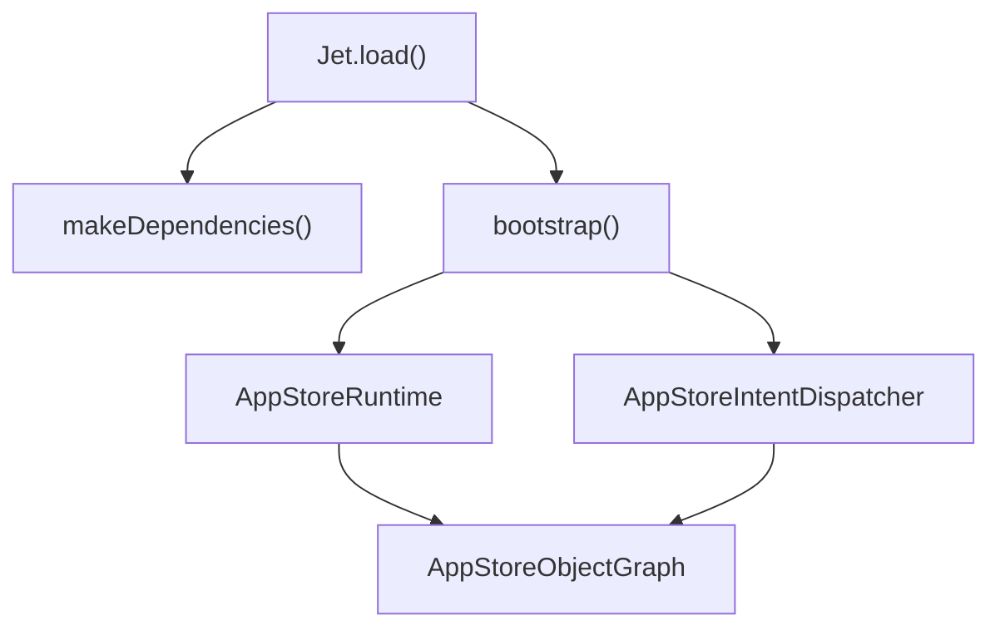
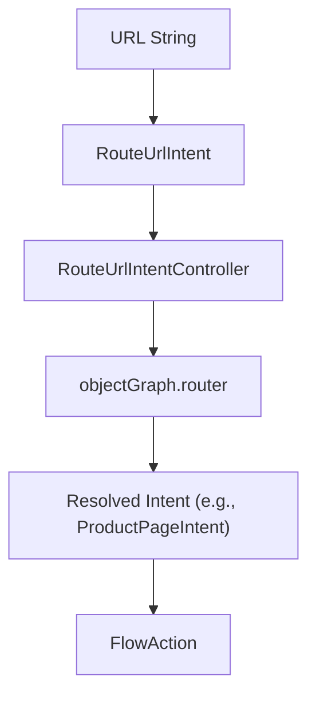
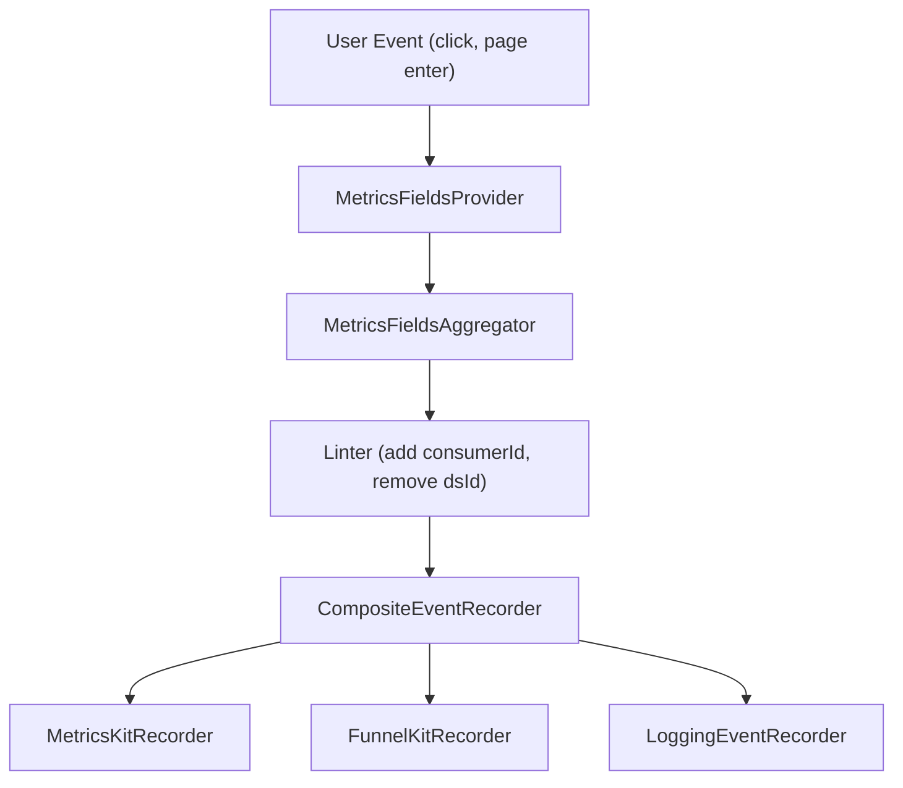
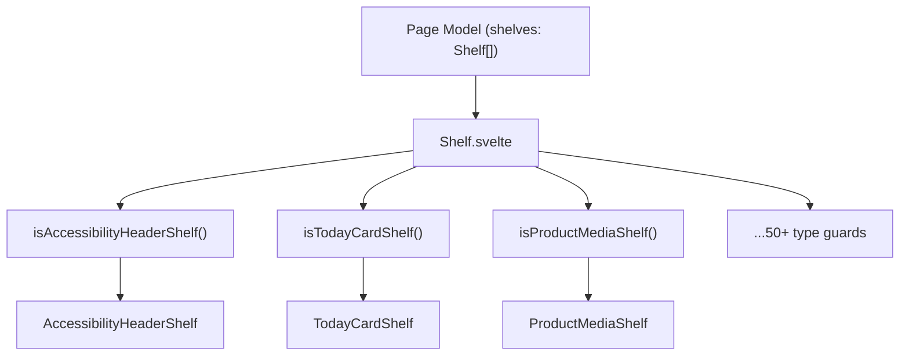

# 总览 (Overview)

-   [shared/metrics-8/src/impression-provider.ts](https://github.com/Chesszyh/apps.apple.com/blob/279d0c4d/shared/metrics-8/src/impression-provider.ts)
-   [shared/metrics-8/src/impression-snapshot-provider.ts](https://github.com/Chesszyh/apps.apple.com/blob/279d0c4d/shared/metrics-8/src/impression-snapshot-provider.ts)
-   [shared/metrics-8/src/impressions/index.ts](https://github.com/Chesszyh/apps.apple.com/blob/279d0c4d/shared/metrics-8/src/impressions/index.ts)
-   [shared/metrics-8/src/index.ts](https://github.com/Chesszyh/apps.apple.com/blob/279d0c4d/shared/metrics-8/src/index.ts)
-   [src/components/jet/shelf/Shelf.svelte](https://github.com/Chesszyh/apps.apple.com/blob/279d0c4d/src/components/jet/shelf/Shelf.svelte)
-   [src/jet/action-handlers/browser.ts](https://github.com/Chesszyh/apps.apple.com/blob/279d0c4d/src/jet/action-handlers/browser.ts)
-   [src/jet/action-handlers/compound-action.ts](https://github.com/Chesszyh/apps.apple.com/blob/279d0c4d/src/jet/action-handlers/compound-action.ts)
-   [src/jet/action-handlers/external-url-action.ts](https://github.com/Chesszyh/apps.apple.com/blob/279d0c4d/src/jet/action-handlers/external-url-action.ts)
-   [src/jet/bootstrap.ts](https://github.com/Chesszyh/apps.apple.com/blob/279d0c4d/src/jet/bootstrap.ts)
-   [src/jet/intents/route-url/route-url-controller.ts](https://github.com/Chesszyh/apps.apple.com/blob/279d0c4d/src/jet/intents/route-url/route-url-controller.ts)
-   [src/jet/intents/route-url/route-url-intent.ts](https://github.com/Chesszyh/apps.apple.com/blob/279d0c4d/src/jet/intents/route-url/route-url-intent.ts)
-   [src/jet/intents/static-message-pages/carrier-page-intent-controller.ts](https://github.com/Chesszyh/apps.apple.com/blob/279d0c4d/src/jet/intents/static-message-pages/carrier-page-intent-controller.ts)
-   [src/jet/intents/static-message-pages/contingent-price-page-intent-controller.ts](https://github.com/Chesszyh/apps.apple.com/blob/279d0c4d/src/jet/intents/static-message-pages/contingent-price-page-intent-controller.ts)
-   [src/jet/intents/static-message-pages/invoice-page-intent-controller.ts](https://github.com/Chesszyh/apps.apple.com/blob/279d0c4d/src/jet/intents/static-message-pages/invoice-page-intent-controller.ts)
-   [src/jet/jet.ts](https://github.com/Chesszyh/apps.apple.com/blob/279d0c4d/src/jet/jet.ts)
-   [src/jet/metrics/providers/StorefrontFieldsProvider.ts](https://github.com/Chesszyh/apps.apple.com/blob/279d0c4d/src/jet/metrics/providers/StorefrontFieldsProvider.ts)
-   [src/jet/metrics/providers/index.ts](https://github.com/Chesszyh/apps.apple.com/blob/279d0c4d/src/jet/metrics/providers/index.ts)
-   [src/jet/models/external-action.ts](https://github.com/Chesszyh/apps.apple.com/blob/279d0c4d/src/jet/models/external-action.ts)
-   [src/jet/svelte.ts](https://github.com/Chesszyh/apps.apple.com/blob/279d0c4d/src/jet/svelte.ts)

## 目的 (Purpose)

本文档对位于 [https://github.com/Chesszyh/apps.apple.com](https://github.com/Chesszyh/apps.apple.com) 的 App Store Web 应用程序代码库进行了高层级的介绍。它涵盖了主要的架构系统、核心设计模式，以及从 URL 路由到渲染 UI 的请求生命周期。

有关特定子系统的详细信息：

-   Jet 框架详情：请参阅 [Jet Application Core](#2.1)
-   指标（Metrics）实现：请参阅 [Metrics and Analytics](#3)
-   页面和组件渲染：请参阅 [Page Rendering System](#4)
-   特定货架（Shelf）类型：请参阅 [Shelf Type Reference](#7)

## 系统用途 (System Purpose)

该代码库实现了一个针对 Apple App Store 的服务器端渲染 (SSR) 和客户端激活 (client-hydrated) 的 Web 应用程序。它为多个 Apple 平台（iPhone、iPad、Mac、Apple TV、Apple Watch、Vision Pro）上的应用程序提供浏览、搜索和产品详情页面。

该应用程序构建在 **Jet 框架**之上，该框架提供了基于意图（intent）的路由、依赖注入和操作分发（action dispatching）。内容结构化为**基于货架（shelf-based）的页面**，其中每个页面由多态 `Shelf` 模型数组组成，这些模型被分发到专门的渲染组件。

## 技术栈 (Technology Stack)

| 层 (Layer) | 技术 (Technology) |
| --- | --- |
| UI 框架 | Svelte (基于组件) |
| 业务逻辑 | Jet 框架 (`@jet/environment`, `@jet/engine`) |
| 路由 | 采用 `RouteProvider` 模式的基于意图的路由 |
| API 模型 | `@jet-app/app-store/api/models` |
| 指标 (Metrics) | MetricsKit, FunnelKit, 自定义流水线 |
| 图像交付 | 支持 WebP 的响应式图像 |
| 本地化 | `@amp/web-apps-localization` |

**来源：** [src/jet/jet.ts1-320](https://github.com/Chesszyh/apps.apple.com/blob/279d0c4d/src/jet/jet.ts#L1-L320) [src/jet/bootstrap.ts1-126](https://github.com/Chesszyh/apps.apple.com/blob/279d0c4d/src/jet/bootstrap.ts#L1-L126)

## 高层架构 (High-Level Architecture)

**来源：** [src/jet/jet.ts48-157](https://github.com/Chesszyh/apps.apple.com/blob/279d0c4d/src/jet/jet.ts#L48-L157) [src/jet/bootstrap.ts105-125](https://github.com/Chesszyh/apps.apple.com/blob/279d0c4d/src/jet/bootstrap.ts#L105-L125)

## 核心系统 (Core Systems)

### Jet 应用程序核心 (Jet Application Core)

`Jet` 类 ([src/jet/jet.ts48-320](https://github.com/Chesszyh/apps.apple.com/blob/279d0c4d/src/jet/jet.ts#L48-L320)) 是所有业务逻辑的主要入口点。它通过 `Jet.load()` 初始化，该方法会：

1.  通过 `makeDependencies()` 创建依赖项
2.  通过 `bootstrap()` 引导运行时 (runtime)
3.  设置指标流水线 (metrics pipeline)
4.  注册 `ActionDispatcher`


`AppStoreObjectGraph` ([src/jet/bootstrap.ts109-119](https://github.com/Chesszyh/apps.apple.com/blob/279d0c4d/src/jet/bootstrap.ts#L109-L119)) 是一个依赖注入容器，持有对以下内容的引用：

-   `router` - URL 路由
-   `dispatcher` - 意图分发器
-   `locale` - 活动的店面/语言
-   `net` - 网络客户端
-   其他框架依赖项

**来源：** [src/jet/jet.ts76-132](https://github.com/Chesszyh/apps.apple.com/blob/279d0c4d/src/jet/jet.ts#L76-L132) [src/jet/bootstrap.ts44-98](https://github.com/Chesszyh/apps.apple.com/blob/279d0c4d/src/jet/bootstrap.ts#L44-L98)

### 意图与操作系统 (Intent and Action System)

代码库将**意图（intents）**（数据查询）与**操作（actions）**（副作用）分开。

#### 意图控制器 (Intent Controllers)

意图控制器实现 `IntentController` 接口，并可选地实现用于 URL 路由的 `RouteProvider` 接口。在引导过程中，控制器会在 `AppStoreIntentDispatcher` 中注册 ([src/jet/bootstrap.ts44-98](https://github.com/Chesszyh/apps.apple.com/blob/279d0c4d/src/jet/bootstrap.ts#L44-L98))：

| 控制器类型 | 示例 | 用途 |
| --- | --- | --- |
| 页面意图 | `ProductPageIntentController` | 获取并返回页面模型 |
| 路由 | `RouteUrlIntentController` | 将 URL 转换为意图 |
| 静态页面 | `CarrierPageIntentController` | 渲染静态消息页面 |
| 工具 | `LintMetricsEventIntentController` | 处理指标事件 |

**关键模式：** `RouteUrlIntentController` ([src/jet/intents/route-url/route-url-controller.ts9-28](https://github.com/Chesszyh/apps.apple.com/blob/279d0c4d/src/jet/intents/route-url/route-url-controller.ts#L9-L28)) 作为一个元控制器，通过咨询路由将 URL 解析为特定的页面意图。


**来源：** [src/jet/intents/route-url/route-url-controller.ts1-28](https://github.com/Chesszyh/apps.apple.com/blob/279d0c4d/src/jet/intents/route-url/route-url-controller.ts#L1-L28) [src/jet/bootstrap.ts44-98](https://github.com/Chesszyh/apps.apple.com/blob/279d0c4d/src/jet/bootstrap.ts#L44-L98)

#### 操作处理器 (Action Handlers)

操作代表用户交互或导航。`ActionDispatcher` ([src/jet/jet.ts111-116](https://github.com/Chesszyh/apps.apple.com/blob/279d0c4d/src/jet/jet.ts#L111-L116)) 将操作模型路由到注册的处理器：

| 操作类型 | 处理器 | 用途 |
| --- | --- | --- |
| `FlowAction` | `flow-action.ts` | 导航到新的页面意图 |
| `CompoundAction` | `compound-action.ts` | 按顺序执行多个操作 |
| `ExternalUrlAction` | `external-url-action.ts` | 打开外部 URL |

操作通过 `jet.perform()` ([src/jet/jet.ts207-240](https://github.com/Chesszyh/apps.apple.com/blob/279d0c4d/src/jet/jet.ts#L207-L240)) 执行，该方法根据配置的 `MetricsBehavior` 自动捕获指标。

**来源：** [src/jet/action-handlers/compound-action.ts1-33](https://github.com/Chesszyh/apps.apple.com/blob/279d0c4d/src/jet/action-handlers/compound-action.ts#L1-L33) [src/jet/action-handlers/external-url-action.ts1-19](https://github.com/Chesszyh/apps.apple.com/blob/279d0c4d/src/jet/action-handlers/external-url-action.ts#L1-L19) [src/jet/svelte.ts25-45](https://github.com/Chesszyh/apps.apple.com/blob/279d0c4d/src/jet/svelte.ts#L25-L45)

### 指标与分析 (Metrics and Analytics)

指标系统实现了一个流水线架构，用于收集、处理和交付分析事件：


`Metrics` 类 ([shared/metrics-8/src/index.ts91-444](https://github.com/Chesszyh/apps.apple.com/blob/279d0c4d/shared/metrics-8/src/index.ts#L91-L444)) 通过 `Metrics.load()` 初始化，该方法会：

1.  通过选择性加入/退出 (opt-in/opt-out) 提供程序设置 `MetricsFieldsAggregator` ([shared/metrics-8/src/index.ts531-554](https://github.com/Chesszyh/apps.apple.com/blob/279d0c4d/shared/metrics-8/src/index.ts#L531-L554))
2.  创建记录器 (recorder) 实例 (`MetricsKitRecorder`, `FunnelKitRecorder`, `LoggingEventRecorder`)
3.  使用 linting 规则配置 `MetricsPipeline` ([shared/metrics-8/src/index.ts176-199](https://github.com/Chesszyh/apps.apple.com/blob/279d0c4d/shared/metrics-8/src/index.ts#L176-L199))
4.  异步加载 MetricsKit 依赖项 ([shared/metrics-8/src/index.ts211-257](https://github.com/Chesszyh/apps.apple.com/blob/279d0c4d/shared/metrics-8/src/index.ts#L211-L257))

**关键提供程序：**

-   `StorefrontFieldsProvider` - 添加 `storeFrontCountryCode` ([src/jet/metrics/providers/StorefrontFieldsProvider.ts1-19](https://github.com/Chesszyh/apps.apple.com/blob/279d0c4d/src/jet/metrics/providers/StorefrontFieldsProvider.ts#L1-L19))
-   `ImpressionFieldProvider` - 从 `Impressions` 系统添加曝光 (impression) 数据 ([shared/metrics-8/src/impression-provider.ts1-27](https://github.com/Chesszyh/apps.apple.com/blob/279d0c4d/shared/metrics-8/src/impression-provider.ts#L1-L27))

有关指标实现的详细信息，请参阅 [Metrics and Analytics](#3)。

**来源：** [shared/metrics-8/src/index.ts91-262](https://github.com/Chesszyh/apps.apple.com/blob/279d0c4d/shared/metrics-8/src/index.ts#L91-L262) [src/jet/metrics/providers/index.ts1-15](https://github.com/Chesszyh/apps.apple.com/blob/279d0c4d/src/jet/metrics/providers/index.ts#L1-L15) [src/jet/metrics/providers/StorefrontFieldsProvider.ts1-19](https://github.com/Chesszyh/apps.apple.com/blob/279d0c4d/src/jet/metrics/providers/StorefrontFieldsProvider.ts#L1-L19)

### 曝光追踪 (Impressions Tracking)

`Impressions` 类 ([shared/metrics-8/src/impressions/index.ts19-191](https://github.com/Chesszyh/apps.apple.com/blob/279d0c4d/shared/metrics-8/src/impressions/index.ts#L19-L191)) 使用 `IntersectionObserver` 来追踪 UI 元素何时变为可见：

1.  组件通过代理的 `impressions.nodeList` Map 注册节点
2.  代理在 set 时自动调用 `observer.observe()`，在 delete 时自动调用 `observer.unobserve()` ([shared/metrics-8/src/impressions/index.ts144-189](https://github.com/Chesszyh/apps.apple.com/blob/279d0c4d/shared/metrics-8/src/impressions/index.ts#L144-L189))
3.  通过 `consumeImpressions()` 或 `captureSnapshotImpression()` 捕获曝光
4.  数据通过 `ImpressionFieldProvider` 流向指标流水线

完整详情请参阅 [Impressions Tracking](#3.3)。

**来源：** [shared/metrics-8/src/impressions/index.ts19-191](https://github.com/Chesszyh/apps.apple.com/blob/279d0c4d/shared/metrics-8/src/impressions/index.ts#L19-L191) [shared/metrics-8/src/impression-provider.ts1-27](https://github.com/Chesszyh/apps.apple.com/blob/279d0c4d/shared/metrics-8/src/impression-provider.ts#L1-L27)

### 页面渲染系统 (Page Rendering System)

页面由多态 `Shelf` 模型数组构建。`Shelf.svelte` 组件 ([src/components/jet/shelf/Shelf.svelte1-321](https://github.com/Chesszyh/apps.apple.com/blob/279d0c4d/src/components/jet/shelf/Shelf.svelte#L1-L321)) 作为一个类型分发器，具有 50 多个条件分支：


每个货架组件负责：

1.  通过类型守卫 (type guard) 函数（例如 `isTodayCardShelf()`）对泛型 `Shelf` 进行类型收窄 (type-narrowing)
2.  从货架模型中提取并渲染特定数据
3.  处理用户交互和指标

有关货架实现的详细信息，请参阅 [Shelf System](#4.2)。有关所有货架类型的目录，请参阅 [Shelf Type Reference](#7)。

**来源：** [src/components/jet/shelf/Shelf.svelte1-321](https://github.com/Chesszyh/apps.apple.com/blob/279d0c4d/src/components/jet/shelf/Shelf.svelte#L1-L321)

### 组件库 (Component Library)

组件库提供了可重用的 UI 原语，货架组件由这些原语组合而成：

| 组件 | 用途 | 位置 |
| --- | --- | --- |
| `Artwork` | 具有 WebP、懒加载、长宽比处理功能的响应式图像 | 参见 [Artwork and Media System](#5.1) |
| `Hero` | 轮播项的通用显示 | 参见 [Hero and Carousel Components](#5.4) |
| `TodayCard` | 具有渐变叠加层的编辑卡片 | 参见 [Content Cards](#5.3) |
| `*LockupItem` | 应用程序/内容显示变体（小、中、大） | 参见 [Lockup Components](#5.5) |
| `ShelfWrapper` | 货架的通用布局、间距、标题 | 参见 [Shelf Wrapper and Common Layout](#4.4) |

**来源：** [src/components/jet/shelf/Shelf.svelte1-321](https://github.com/Chesszyh/apps.apple.com/blob/279d0c4d/src/components/jet/shelf/Shelf.svelte#L1-L321)

## 请求生命周期 (Request Lifecycle)

下图追踪了一个从 URL 到渲染 UI 的典型请求：

> **[Mermaid sequence]**
> *(图表结构无法解析)*

**生命周期步骤：**

1.  **URL 路由**：`jet.routeUrl()` 创建一个 `RouteUrlIntent` ([src/jet/jet.ts268-285](https://github.com/Chesszyh/apps.apple.com/blob/279d0c4d/src/jet/jet.ts#L268-L285))
2.  **意图解析**：路由通过咨询意图控制器匹配 URL ([src/jet/intents/route-url/route-url-controller.ts12-27](https://github.com/Chesszyh/apps.apple.com/blob/279d0c4d/src/jet/intents/route-url/route-url-controller.ts#L12-L27))
3.  **数据获取**：控制器通过对象图 (object graph) 依赖项获取数据
4.  **页面模型创建**：控制器返回带有 `shelves` 数组的页面模型
5.  **指标进入**：`jet.didEnterPage()` 记录页面进入 ([src/jet/jet.ts158-170](https://github.com/Chesszyh/apps.apple.com/blob/279d0c4d/src/jet/jet.ts#L158-L170))
6.  **渲染**：页面组件遍历货架，Shelf.svelte 分发到特定组件 ([src/components/jet/shelf/Shelf.svelte195-320](https://github.com/Chesszyh/apps.apple.com/blob/279d0c4d/src/components/jet/shelf/Shelf.svelte#L195-L320))
7.  **曝光追踪**：组件通过代理的 Map 向曝光系统注册 ([shared/metrics-8/src/impressions/index.ts141-190](https://github.com/Chesszyh/apps.apple.com/blob/279d0c4d/shared/metrics-8/src/impressions/index.ts#L141-L190))

**来源：** [src/jet/jet.ts268-285](https://github.com/Chesszyh/apps.apple.com/blob/279d0c4d/src/jet/jet.ts#L268-L285) [src/jet/intents/route-url/route-url-controller.ts9-28](https://github.com/Chesszyh/apps.apple.com/blob/279d0c4d/src/jet/intents/route-url/route-url-controller.ts#L9-L28) [src/components/jet/shelf/Shelf.svelte195-320](https://github.com/Chesszyh/apps.apple.com/blob/279d0c4d/src/components/jet/shelf/Shelf.svelte#L195-L320)

## 关键架构模式 (Key Architectural Patterns)

### 类型守卫分发 (Type Guard Dispatching)

代码库广泛使用 TypeScript 类型守卫将泛型模型收窄为特定类型。`Shelf.svelte` 组件 ([src/components/jet/shelf/Shelf.svelte205-320](https://github.com/Chesszyh/apps.apple.com/blob/279d0c4d/src/components/jet/shelf/Shelf.svelte#L205-L320)) 通过 50 多个 `if-else` 分支演示了这种模式，每个分支都检查一个类型守卫函数：

```
{#if isAccessibilityHeaderShelf(shelf)}    <AccessibilityHeaderShelf {shelf} />{:else if isTodayCardShelf(shelf)}    <TodayCardShelf {shelf} />{:else if isProductMediaShelf(shelf)}    <ProductMediaShelf {shelf} />// ... 还有 47 个以上的分支{/if}
```
每个类型守卫函数都会收窄 `Shelf` 类型，使 TypeScript 能够在每个组件中提供类型安全性。

### 通过对象图进行依赖注入 (Dependency Injection via Object Graph)

`AppStoreObjectGraph` 为意图控制器提供依赖项，而无需全局状态。控制器通过对象图参数访问依赖项：

```
async perform(intent, objectGraph: AppStoreObjectGraph) {    const locale = getLocale(objectGraph);    const net = getNet(objectGraph);    // 使用依赖项...}
```
有关对象图的详细信息，请参阅 [Jet Application Core](#2.1)。

### 组合记录器模式 (Composite Recorder Pattern)

指标系统使用组合模式将事件同时交付到多个目的地。`CompositeEventRecorder` ([shared/metrics-8/src/index.ts162-174](https://github.com/Chesszyh/apps.apple.com/blob/279d0c4d/shared/metrics-8/src/index.ts#L162-L174)) 包装了单个记录器（`MetricsKitRecorder`、`FunnelKitRecorder`、`LoggingEventRecorder`），其中每个记录器都可以独立启用/禁用。

有关指标架构，请参阅 [Event Recorders](#3.2)。

**来源：** [src/components/jet/shelf/Shelf.svelte205-320](https://github.com/Chesszyh/apps.apple.com/blob/279d0c4d/src/components/jet/shelf/Shelf.svelte#L205-L320) [src/jet/metrics/providers/StorefrontFieldsProvider.ts10-18](https://github.com/Chesszyh/apps.apple.com/blob/279d0c4d/src/jet/metrics/providers/StorefrontFieldsProvider.ts#L10-L18) [shared/metrics-8/src/index.ts162-174](https://github.com/Chesszyh/apps.apple.com/blob/279d0c4d/shared/metrics-8/src/index.ts#L162-L174)

## 静态消息页面 (Static Message Pages)

静态消息页面渲染信息性内容，而无需从 API 获取。示例包括运营商信息、发票页面和应急定价：

| 页面类型 | 控制器 | 路由模式 |
| --- | --- | --- |
| 运营商 | `CarrierPageIntentController` | `/carrier` |
| 发票 | `InvoicePageIntentController` | `/invoice` |
| 应急价格 | `ContingentPricingIntentController` | `/contingent-price/{offerId}` |

这些控制器返回具有用于本地化的 `titleLocKey` 和用于标识的 `contentType` 的 `StaticMessagePage` 模型 ([src/jet/intents/static-message-pages/carrier-page-intent-controller.ts24-40](https://github.com/Chesszyh/apps.apple.com/blob/279d0c4d/src/jet/intents/static-message-pages/carrier-page-intent-controller.ts#L24-L40))。

**来源：** [src/jet/intents/static-message-pages/carrier-page-intent-controller.ts1-41](https://github.com/Chesszyh/apps.apple.com/blob/279d0c4d/src/jet/intents/static-message-pages/carrier-page-intent-controller.ts#L1-L41) [src/jet/intents/static-message-pages/invoice-page-intent-controller.ts1-41](https://github.com/Chesszyh/apps.apple.com/blob/279d0c4d/src/jet/intents/static-message-pages/invoice-page-intent-controller.ts#L1-L41) [src/jet/intents/static-message-pages/contingent-price-page-intent-controller.ts1-49](https://github.com/Chesszyh/apps.apple.com/blob/279d0c4d/src/jet/intents/static-message-pages/contingent-price-page-intent-controller.ts#L1-L49)

## 上下文与 Svelte 集成 (Context and Svelte Integration)

代码库使用 Svelte 的上下文 (context) API 使框架实例可供组件使用：

| 上下文名称 | 实例 | 获取函数 (Getter Function) |
| --- | --- | --- |
| `'jet'` | `Jet` | 来自 `src/jet/svelte.ts` 的 `getJet()` |
| `'metrics'` | `Metrics` | `generateMetricsContextGetter()` |
| `'impressions'` | `Impressions` | `generateBrowserImpressionsContextGetter()` |

上下文在初始化期间填充：

-   `Jet.load()` 设置 `'jet'` 上下文 ([src/jet/jet.ts129](https://github.com/Chesszyh/apps.apple.com/blob/279d0c4d/src/jet/jet.ts#L129-L129))
-   `Metrics.load()` 设置 `'metrics'` 上下文 ([shared/metrics-8/src/index.ts260](https://github.com/Chesszyh/apps.apple.com/blob/279d0c4d/shared/metrics-8/src/index.ts#L260-L260))

**来源：** [src/jet/svelte.ts1-46](https://github.com/Chesszyh/apps.apple.com/blob/279d0c4d/src/jet/svelte.ts#L1-L46) [src/jet/jet.ts129](https://github.com/Chesszyh/apps.apple.com/blob/279d0c4d/src/jet/jet.ts#L129-L129) [shared/metrics-8/src/index.ts260](https://github.com/Chesszyh/apps.apple.com/blob/279d0c4d/shared/metrics-8/src/index.ts#L260-L260)
