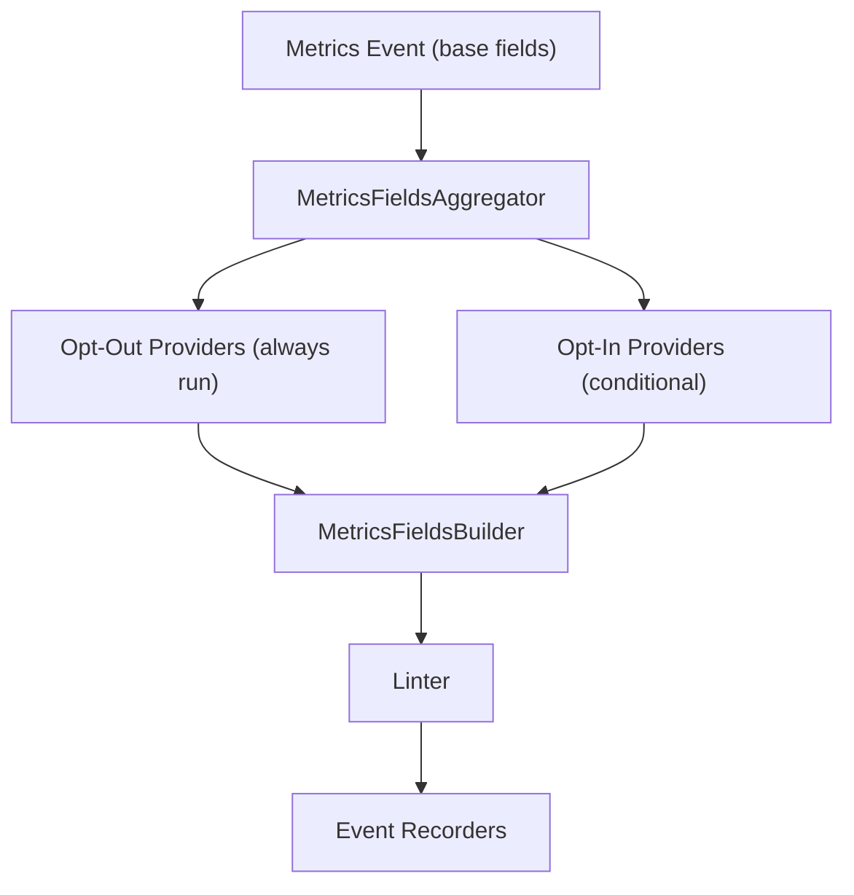
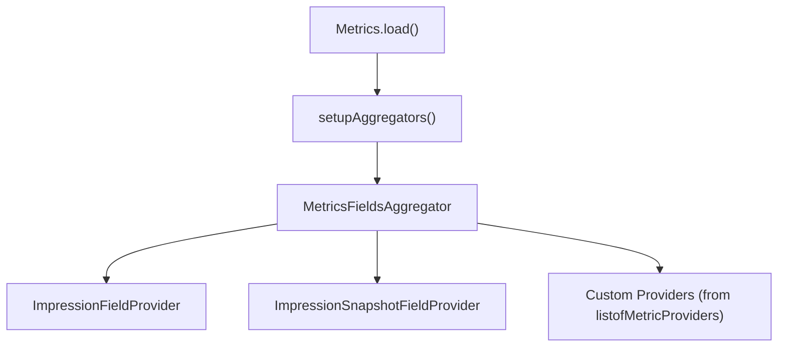
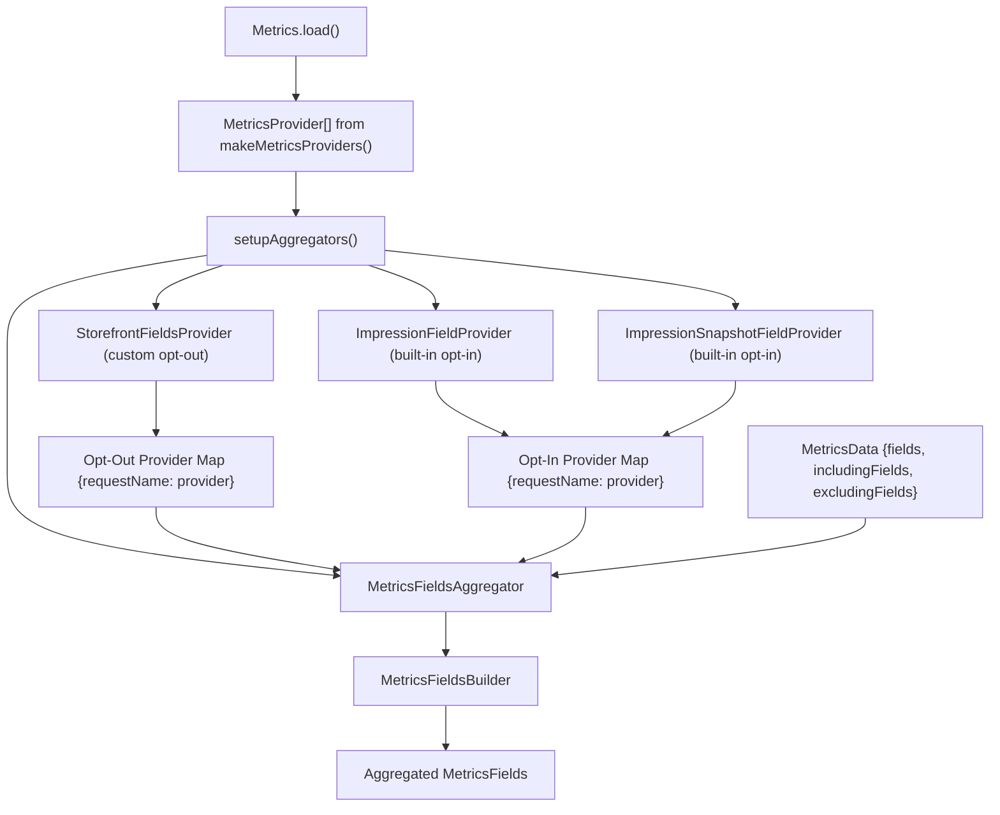

# 指标提供程序 (Metrics Providers)

-   [shared/metrics-8/src/impression-provider.ts](https://github.com/Chesszyh/apps.apple.com/blob/279d0c4d/shared/metrics-8/src/impression-provider.ts)
-   [shared/metrics-8/src/impression-snapshot-provider.ts](https://github.com/Chesszyh/apps.apple.com/blob/279d0c4d/shared/metrics-8/src/impression-snapshot-provider.ts)
-   [shared/metrics-8/src/impressions/index.ts](https://github.com/Chesszyh/apps.apple.com/blob/279d0c4d/shared/metrics-8/src/impressions/index.ts)
-   [shared/metrics-8/src/index.ts](https://github.com/Chesszyh/apps.apple.com/blob/279d0c4d/shared/metrics-8/src/index.ts)
-   [src/jet/metrics/providers/StorefrontFieldsProvider.ts](https://github.com/Chesszyh/apps.apple.com/blob/279d0c4d/src/jet/metrics/providers/StorefrontFieldsProvider.ts)
-   [src/jet/metrics/providers/index.ts](https://github.com/Chesszyh/apps.apple.com/blob/279d0c4d/src/jet/metrics/providers/index.ts)

## 目的与范围 (Purpose and Scope)

本文档介绍了用于向指标事件注入上下文字段的**指标提供程序 (Metrics Providers)** 模式。提供程序实现了一个标准化接口，以便在事件流经指标流水线时向其添加数据。有关整体指标流水线架构的信息，请参阅 [Metrics Pipeline](#3.1)。有关处理后如何记录事件的详情，请参阅 [Event Recorders](#3.2)。

**来源：** [shared/metrics-8/src/index.ts1-579](https://github.com/Chesszyh/apps.apple.com/blob/279d0c4d/shared/metrics-8/src/index.ts#L1-L579)

---

## 提供程序模式概览 (Provider Pattern Overview)

指标提供程序遵循简单的构建器模式，每个提供程序向指标事件贡献特定的字段。来自 `@jet/engine` 的 `MetricsFieldsProvider` 接口定义了一个方法：

```
interface MetricsFieldsProvider {    addMetricsFields(        builder: MetricsFieldsBuilder,        context: MetricsFieldsContext    ): void;}
```
提供程序由 `MetricsFieldsAggregator` 进行聚合，该聚合器编排并按顺序调用每个提供程序，以构建事件的完整字段集。这种设计实现了上下文数据的模块化、可组合式添加，而无需将提供程序相互耦合。

### 提供程序在流水线中的流动 (Provider Flow Through Pipeline)


**来源：** [shared/metrics-8/src/index.ts531-555](https://github.com/Chesszyh/apps.apple.com/blob/279d0c4d/shared/metrics-8/src/index.ts#L531-L555)

---

## 提供程序类型：选择性加入 vs 选择性退出 (Provider Types: Opt-In vs Opt-Out)

聚合器支持两类具有不同执行语义的提供程序：

### 选择性退出提供程序 (Opt-Out Providers)

除非明确排除，否则选择性退出提供程序**始终会**为每个指标事件执行。这些提供程序通过 `addOptOutProvider()` 注册，是大多数上下文字段的默认选择。

```
aggregator.addOptOutProvider(    new StorefrontFieldsProvider(objectGraph),    'storeFrontCountryCode');
```
第二个参数是一个**请求名称 (request name)**，用于标识该提供程序贡献的字段。事件可以通过将请求名称添加到 `excludingFields` 来排除特定的提供程序。

### 选择性加入提供程序 (Opt-In Providers)

选择性加入提供程序**仅在明确请求时才执行**。这些提供程序通过 `addOptInProvider()` 注册，用于开销较大或有条件的数据。

```
aggregator.addOptInProvider(    new ImpressionFieldProvider(context),    'impressions');aggregator.addOptInProvider(    new ImpressionSnapshotFieldProvider(context),    'impressionsSnapshot');
```
事件必须将请求名称添加到 `includingFields` 才能触发这些提供程序。

| 提供程序类型 | 执行模型 | 用途 | 注册方法 |
| --- | --- | --- | --- |
| **选择性退出** | 除非被排除，否则始终运行 | 轻量级上下文字段（店面、区域设置等） | `addOptOutProvider(provider, requestName)` |
| **选择性加入** | 仅在请求时运行 | 开销较大的操作（曝光、快照） | `addOptInProvider(provider, requestName)` |

**来源：** [shared/metrics-8/src/index.ts531-555](https://github.com/Chesszyh/apps.apple.com/blob/279d0c4d/shared/metrics-8/src/index.ts#L531-L555) [@jet/engine MetricsFieldsAggregator](https://github.com/Chesszyh/apps.apple.com/blob/279d0c4d/@jet/engine MetricsFieldsAggregator)

---

## 内置提供程序 (Built-In Providers)

指标系统包含了几个用于常见数据类型的内置提供程序：

### ImpressionFieldProvider

向指标事件添加消耗的曝光 (impression) 数据。该提供程序检索已被观察到的曝光并消耗它们（清除缓冲区）。

```
class ImpressionFieldProvider implements MetricsFieldsProvider {    addMetricsFields(builder: MetricsFieldsBuilder, _context: MetricsFieldsContext) {        const impressionInstance = this.appContext.get(IMPRESSION_CONTEXT_NAME);                if (impressionInstance?.settings?.captureType === 'jet') {            let impressions = impressionInstance.consumeImpressions();            builder.addValue(impressions, 'impressions');        }    }}
```
-   **类型：** 选择性加入
-   **请求名称：** `'impressions'`
-   **行为：** 从缓冲区消耗（移除）曝光
-   **使用时机：** 退出事件、点击事件（已配置时）

**来源：** [shared/metrics-8/src/impression-provider.ts1-28](https://github.com/Chesszyh/apps.apple.com/blob/279d0c4d/shared/metrics-8/src/impression-provider.ts#L1-L28)

### ImpressionSnapshotFieldProvider

向指标事件添加快照曝光数据，而不消耗。该提供程序捕获当前曝光的即时快照。

```
class ImpressionSnapshotFieldProvider implements MetricsFieldsProvider {    addMetricsFields(builder: MetricsFieldsBuilder, _context: MetricsFieldsContext) {        const impressionInstance = this.appContext.get(IMPRESSION_CONTEXT_NAME);                if (impressionInstance?.settings?.captureType === 'jet') {            let impressions = impressionInstance.captureSnapshotImpression();            builder.addValue(impressions, 'impressions');        }    }}
```
-   **类型：** 选择性加入
-   **请求名称：** `'impressionsSnapshot'`
-   **行为：** 捕获快照而不消耗
-   **使用时机：** 页面转换事件、导航事件

**来源：** [shared/metrics-8/src/impression-snapshot-provider.ts1-28](https://github.com/Chesszyh/apps.apple.com/blob/279d0c4d/shared/metrics-8/src/impression-snapshot-provider.ts#L1-L28)

### Metrics.load() 中的提供程序注册 (Provider Registration in Metrics.load())


**来源：** [shared/metrics-8/src/index.ts531-555](https://github.com/Chesszyh/apps.apple.com/blob/279d0c4d/shared/metrics-8/src/index.ts#L531-L555)

---

## 创建自定义提供程序 (Creating Custom Providers)

### 第 1 步：实现 MetricsFieldsProvider 接口 (Step 1: Implement MetricsFieldsProvider Interface)

创建一个类，实现来自 `@jet/engine` 的 `MetricsFieldsProvider` 接口：

```
// 来自代码库的示例export class StorefrontFieldsProvider implements MetricsFieldsProvider {    constructor(private readonly objectGraph: AppStoreObjectGraph) {}    addMetricsFields(        builder: MetricsFieldsBuilder,        _context: MetricsFieldsContext,    ) {        const { storefront } = getLocale(this.objectGraph);        builder.addValue(storefront, 'storeFrontCountryCode');    }}
```
**关键点：**

-   通过构造函数接受依赖项（对象图、上下文等）
-   使用 `builder.addValue(value, fieldName)` 添加字段
-   `MetricsFieldsContext` 参数可用于运行时上下文

**来源：** [src/jet/metrics/providers/StorefrontFieldsProvider.ts1-20](https://github.com/Chesszyh/apps.apple.com/blob/279d0c4d/src/jet/metrics/providers/StorefrontFieldsProvider.ts#L1-L20)

### 第 2 步：创建提供程序工厂 (Step 2: Create Provider Factory)

将提供程序包装在一个返回 `MetricsProvider[]` 的工厂函数中：

```
export function makeMetricsProviders(    objectGraph: AppStoreObjectGraph,): MetricsProvider[] {    return [        {            provider: new StorefrontFieldsProvider(objectGraph),            request: 'storeFrontCountryCode',        },    ];}
```
`MetricsProvider` 类型将提供程序与其请求名称包装在一起：

```
export type MetricsProvider = {    provider: MetricsFieldsProvider;    request: string;  // 用于标识/排除该提供程序};
```
**来源：** [src/jet/metrics/providers/index.ts1-16](https://github.com/Chesszyh/apps.apple.com/blob/279d0c4d/src/jet/metrics/providers/index.ts#L1-L16) [shared/metrics-8/src/index.ts50-53](https://github.com/Chesszyh/apps.apple.com/blob/279d0c4d/shared/metrics-8/src/index.ts#L50-L53)

### 第 3 步：在指标初始化期间注册 (Step 3: Register During Metrics Initialization)

将提供程序传递给 `Metrics.load()`：

```
const metricsProviders = makeMetricsProviders(objectGraph);const metrics = Metrics.load(    loggerFactory,    context,    processEvent,    config,    metricsProviders,  // <-- 在此处注册提供程序    settings);
```
`setupAggregators()` 函数将所有自定义提供程序注册为选择性退出提供程序：

```
function setupAggregators(    metricsFieldsProviders: MetricsProvider[],    context: Map<string, unknown>,): MetricsFieldsAggregator {    const aggregator = MetricsFieldsAggregator.makeDefaultAggregator();        // 内置的选择性加入提供程序    aggregator.addOptInProvider(        new ImpressionFieldProvider(context),        'impressions',    );    aggregator.addOptInProvider(        new ImpressionSnapshotFieldProvider(context),        'impressionsSnapshot',    );        // 自定义的选择性退出提供程序    metricsFieldsProviders.forEach((metricsFields) => {        aggregator.addOptOutProvider(            metricsFields.provider,            metricsFields.request,        );    });        return aggregator;}
```
**来源：** [shared/metrics-8/src/index.ts531-555](https://github.com/Chesszyh/apps.apple.com/blob/279d0c4d/shared/metrics-8/src/index.ts#L531-L555)

---

## 提供程序执行模型 (Provider Execution Model)

### 使用提供程序进行事件处理 (Event Processing with Providers)

> **[Mermaid sequence]**
> *(图表结构无法解析)*

**来源：** [shared/metrics-8/src/index.ts176-199](https://github.com/Chesszyh/apps.apple.com/blob/279d0c4d/shared/metrics-8/src/index.ts#L176-L199) [@jet/engine MetricsPipeline](https://github.com/Chesszyh/apps.apple.com/blob/279d0c4d/@jet/engine MetricsPipeline)

---

## 常见提供程序模式 (Common Provider Patterns)

### 基于上下文的提供程序 (Context-Based Providers)

访问共享应用程序上下文（如 `Impressions` 实例）的提供程序：

```
export class ImpressionFieldProvider implements MetricsFieldsProvider {    constructor(private readonly appContext: Map<string, unknown>) {}        addMetricsFields(builder: MetricsFieldsBuilder, _context: MetricsFieldsContext) {        const impressionInstance = this.appContext.get(IMPRESSION_CONTEXT_NAME);        // 使用实例获取数据    }}
```
**来源：** [shared/metrics-8/src/impression-provider.ts9-27](https://github.com/Chesszyh/apps.apple.com/blob/279d0c4d/shared/metrics-8/src/impression-provider.ts#L9-L27)

### 对象图提供程序 (Object Graph Providers)

通过对象图访问应用程序服务的提供程序：

```
export class StorefrontFieldsProvider implements MetricsFieldsProvider {    constructor(private readonly objectGraph: AppStoreObjectGraph) {}        addMetricsFields(builder: MetricsFieldsBuilder, _context: MetricsFieldsContext) {        const { storefront } = getLocale(this.objectGraph);        builder.addValue(storefront, 'storeFrontCountryCode');    }}
```
**来源：** [src/jet/metrics/providers/StorefrontFieldsProvider.ts9-19](https://github.com/Chesszyh/apps.apple.com/blob/279d0c4d/src/jet/metrics/providers/StorefrontFieldsProvider.ts#L9-L19)

### 有条件字段提供程序 (Conditional Field Providers)

仅在特定条件下添加字段的提供程序：

```
addMetricsFields(builder: MetricsFieldsBuilder, _context: MetricsFieldsContext) {    const instance = this.appContext.get(IMPRESSION_CONTEXT_NAME);        if (instance?.settings?.captureType === 'jet') {        let impressions = instance.consumeImpressions();        builder.addValue(impressions, 'impressions');    }}
```
**来源：** [shared/metrics-8/src/impression-provider.ts14-26](https://github.com/Chesszyh/apps.apple.com/blob/279d0c4d/shared/metrics-8/src/impression-provider.ts#L14-L26)

---

## 提供程序架构图 (Provider Architecture Diagram)


**来源：** [shared/metrics-8/src/index.ts108-263](https://github.com/Chesszyh/apps.apple.com/blob/279d0c4d/shared/metrics-8/src/index.ts#L108-L263) [shared/metrics-8/src/index.ts531-555](https://github.com/Chesszyh/apps.apple.com/blob/279d0c4d/shared/metrics-8/src/index.ts#L531-L555)

---

## 总结 (Summary)

| 方面 | 详情 |
| --- | --- |
| **目的** | 使用模块化提供程序向指标事件注入上下文字段 |
| **接口** | 来自 `@jet/engine` 的 `MetricsFieldsProvider` |
| **关键方法** | `addMetricsFields(builder: MetricsFieldsBuilder, context: MetricsFieldsContext)` |
| **提供程序类型** | 选择性加入（有条件运行）和选择性退出（始终运行） |
| **注册** | 在 `setupAggregators()` 中通过 `MetricsFieldsAggregator` 进行 |
| **内置提供程序** | `ImpressionFieldProvider`, `ImpressionSnapshotFieldProvider` |
| **自定义提供程序示例** | `StorefrontFieldsProvider` |

**来源：** 本文档中引用的所有文件。
