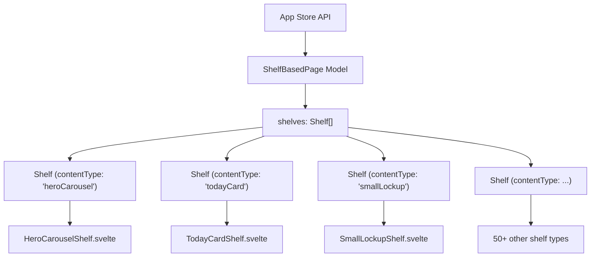
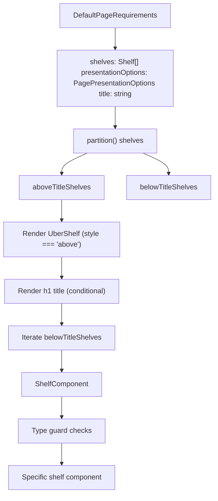
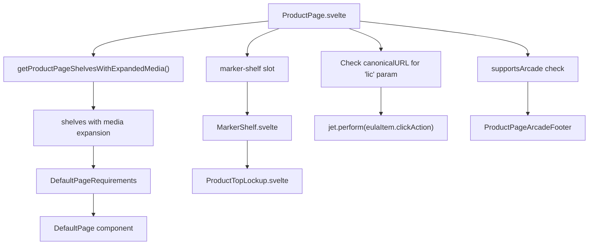
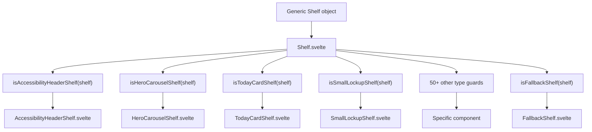
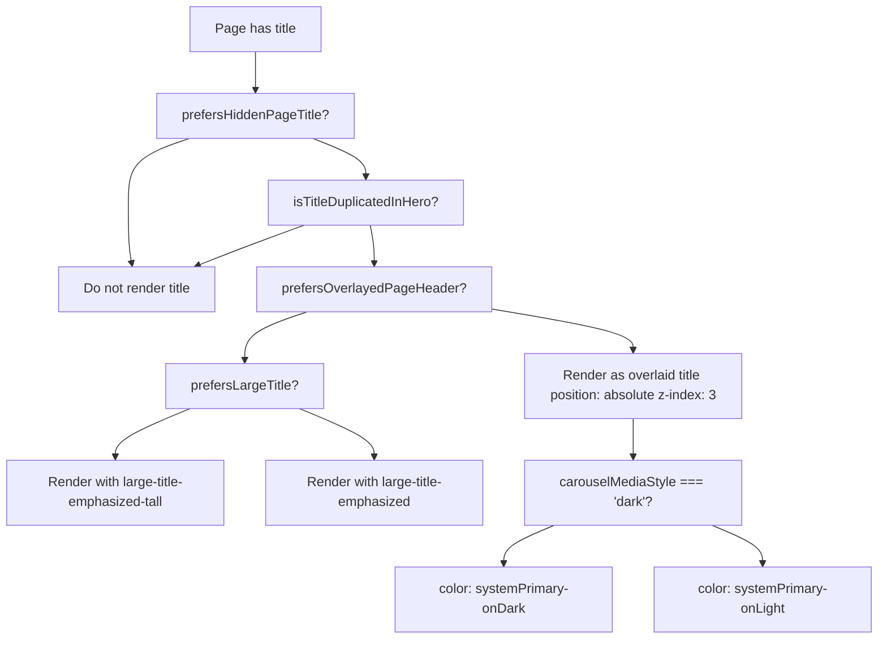
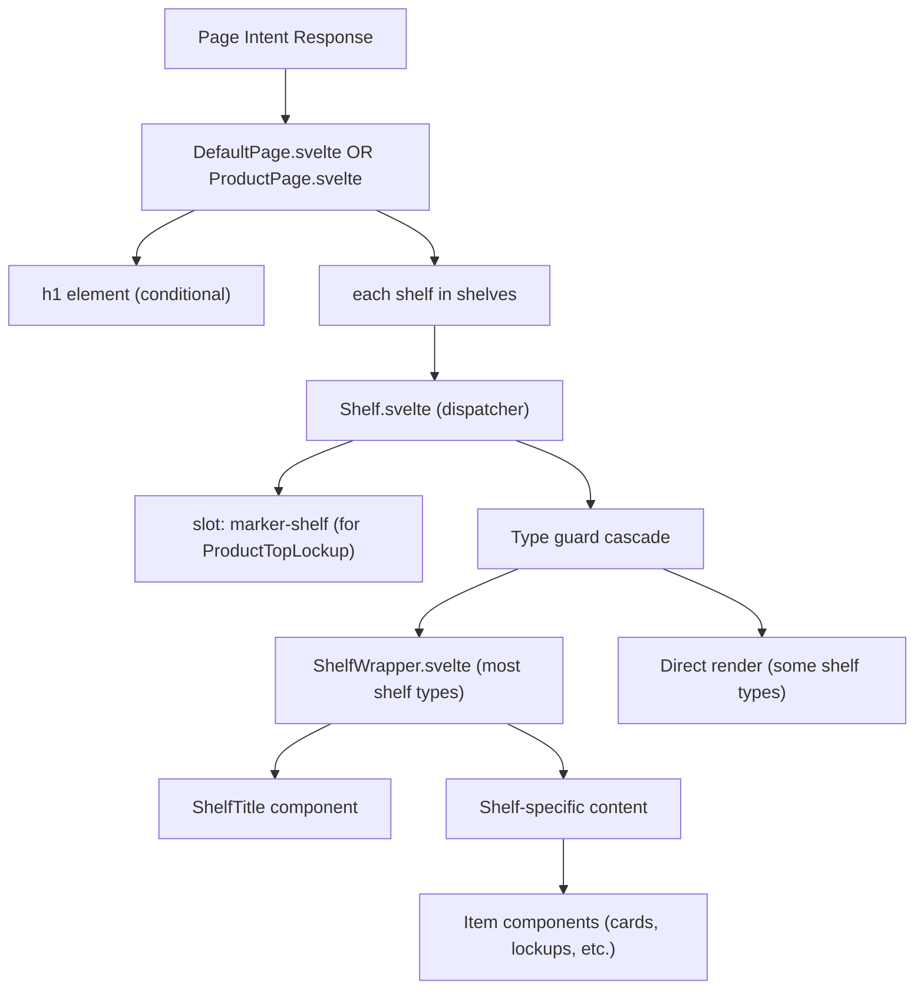
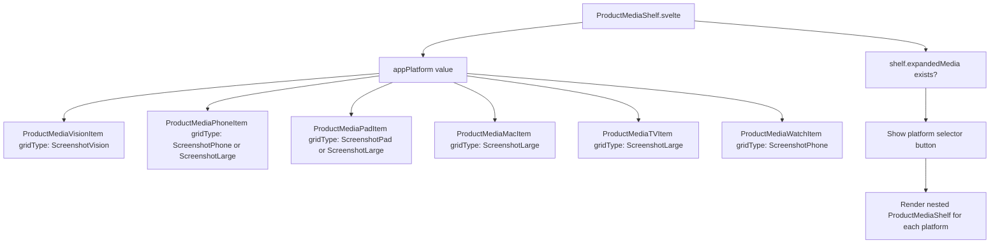

# 页面渲染系统 (Page Rendering System)

-   [src/components/AmbientBackgroundArtwork.svelte](https://github.com/Chesszyh/apps.apple.com/blob/279d0c4d/src/components/AmbientBackgroundArtwork.svelte)
-   [src/components/Shelf/Wrapper.svelte](https://github.com/Chesszyh/apps.apple.com/blob/279d0c4d/src/components/Shelf/Wrapper.svelte)
-   [src/components/jet/marker-shelf/ProductTopLockup.svelte](https://github.com/Chesszyh/apps.apple.com/blob/279d0c4d/src/components/jet/marker-shelf/ProductTopLockup.svelte)
-   [src/components/jet/shelf/ArcadeFooterShelf.svelte](https://github.com/Chesszyh/apps.apple.com/blob/279d0c4d/src/components/jet/shelf/ArcadeFooterShelf.svelte)
-   [src/components/jet/shelf/PageHeaderShelf.svelte](https://github.com/Chesszyh/apps.apple.com/blob/279d0c4d/src/components/jet/shelf/PageHeaderShelf.svelte)
-   [src/components/jet/shelf/PrivacyFooterShelf.svelte](https://github.com/Chesszyh/apps.apple.com/blob/279d0c4d/src/components/jet/shelf/PrivacyFooterShelf.svelte)
-   [src/components/jet/shelf/ProductDescriptionShelf.svelte](https://github.com/Chesszyh/apps.apple.com/blob/279d0c4d/src/components/jet/shelf/ProductDescriptionShelf.svelte)
-   [src/components/jet/shelf/ProductMediaShelf.svelte](https://github.com/Chesszyh/apps.apple.com/blob/279d0c4d/src/components/jet/shelf/ProductMediaShelf.svelte)
-   [src/components/jet/shelf/Shelf.svelte](https://github.com/Chesszyh/apps.apple.com/blob/279d0c4d/src/components/jet/shelf/Shelf.svelte)
-   [src/components/pages/DefaultPage.svelte](https://github.com/Chesszyh/apps.apple.com/blob/279d0c4d/src/components/pages/DefaultPage.svelte)
-   [src/components/pages/ProductPage.svelte](https://github.com/Chesszyh/apps.apple.com/blob/279d0c4d/src/components/pages/ProductPage.svelte)

## 目的与范围 (Purpose and Scope)

页面渲染系统将从 App Store API 接收的基于货架的数据模型转换为渲染后的 DOM 组件。该系统负责编排顶层页面布局、货架遍历、基于类型的分发以及呈现自定义。

本文档重点介绍整体渲染架构和数据流。有关特定页面类型的详细信息，请参阅 [Page Components](#4.1)。有关货架分发器和类型守卫模式，请参阅 [Shelf System](#4.2)。有关模态框渲染，请参阅 [Modal Presentation](#4.3)。

## 基于货架的页面模型 (Shelf-Based Page Model)

App Store Web 应用程序中的页面从根本上说是**货架的集合**。每个页面从 API 接收一个 `Shelf` 对象数组，渲染系统会遍历该数组并使用特定类型的组件进行渲染。


**来源：** [src/components/pages/DefaultPage.svelte1-174](https://github.com/Chesszyh/apps.apple.com/blob/279d0c4d/src/components/pages/DefaultPage.svelte#L1-L174)

## 页面组件架构 (Page Component Architecture)

系统提供了两个主要的页面组件来编排货架渲染：

### DefaultPage 组件 (DefaultPage Component)

`DefaultPage` 是通用页面渲染器，处理大多数页面类型，包括编辑页面、搜索结果和类别页面。


**关键职责：**

-   **货架分区**：使用 `partition()` 将货架分为标题上方和标题下方两组 [src/components/pages/DefaultPage.svelte45-57](https://github.com/Chesszyh/apps.apple.com/blob/279d0c4d/src/components/pages/DefaultPage.svelte#L45-L57)
-   **标题渲染**：根据 `presentationOptions` 有条件地渲染页面标题 [src/components/pages/DefaultPage.svelte100-109](https://github.com/Chesszyh/apps.apple.com/blob/279d0c4d/src/components/pages/DefaultPage.svelte#L100-L109)
-   **标记货架委托 (Marker shelf delegation)**：为父组件提供插槽以处理 `MarkerShelf` 类型 [src/components/pages/DefaultPage.svelte30-37](https://github.com/Chesszyh/apps.apple.com/blob/279d0c4d/src/components/pages/DefaultPage.svelte#L30-L37)
-   **呈现自定义**：应用 `prefersHiddenPageTitle`、`prefersLargeTitle` 和 `prefersOverlayedPageHeader` 选项 [src/components/pages/DefaultPage.svelte59-68](https://github.com/Chesszyh/apps.apple.com/blob/279d0c4d/src/components/pages/DefaultPage.svelte#L59-L68)

**来源：** [src/components/pages/DefaultPage.svelte1-174](https://github.com/Chesszyh/apps.apple.com/blob/279d0c4d/src/components/pages/DefaultPage.svelte#L1-L174)

### ProductPage 组件 (ProductPage Component)

`ProductPage` 扩展了 `DefaultPage`，具有产品特定的渲染逻辑，包括英雄锁定 (hero lockup) 部分和 EULA 深层链接。


**关键特性：**

-   **媒体扩展**：通过 `getProductPageShelvesWithExpandedMedia()` 处理货架以支持平台特定媒体 [src/components/pages/ProductPage.svelte22](https://github.com/Chesszyh/apps.apple.com/blob/279d0c4d/src/components/pages/ProductPage.svelte#L22-L22)
-   **标记货架渲染**：为英雄部分渲染 `ProductTopLockup` [src/components/pages/ProductPage.svelte70-72](https://github.com/Chesszyh/apps.apple.com/blob/279d0c4d/src/components/pages/ProductPage.svelte#L70-L72)
-   **EULA 深层链接**：当存在 `?lic` 参数时，自动打开许可协议 (License Agreement) 模态框 [src/components/pages/ProductPage.svelte42-60](https://github.com/Chesszyh/apps.apple.com/blob/279d0c4d/src/components/pages/ProductPage.svelte#L42-L60)
-   **无障碍上下文**：为无障碍特性设置货架邻居检测 [src/components/pages/ProductPage.svelte33-34](https://github.com/Chesszyh/apps.apple.com/blob/279d0c4d/src/components/pages/ProductPage.svelte#L33-L34)

**来源：** [src/components/pages/ProductPage.svelte1-78](https://github.com/Chesszyh/apps.apple.com/blob/279d0c4d/src/components/pages/ProductPage.svelte#L1-L78)

## 货架类型分发 (Shelf Type Dispatching)

`Shelf.svelte` 组件实现了一个类型分发器模式，使用 TypeScript 类型守卫函数将通用的 `Shelf` 模型路由到 50 多个专门的组件。

### 类型守卫模式 (Type Guard Pattern)


### 类型守卫实现 (Type Guard Implementation)

每种货架类型都有一个对应的类型守卫函数，用于缩小泛型 `Shelf` 类型：

```
// 类型守卫函数签名模式export function is[ShelfType]Shelf(shelf: Shelf): shelf is [ShelfType]Shelf {    const { contentType, items } = shelf;    return contentType === '[contentTypeValue]' && Array.isArray(items);}
```
**示例类型守卫：**

-   `isPageHeaderShelf(shelf)` - 检查 `contentType === 'pageHeader'` [src/components/jet/shelf/PageHeaderShelf.svelte8-11](https://github.com/Chesszyh/apps.apple.com/blob/279d0c4d/src/components/jet/shelf/PageHeaderShelf.svelte#L8-L11)
-   `isProductMediaShelf(shelf)` - 检查 `contentType === 'productMediaItem'` [src/components/jet/shelf/ProductMediaShelf.svelte15-20](https://github.com/Chesszyh/apps.apple.com/blob/279d0c4d/src/components/jet/shelf/ProductMediaShelf.svelte#L15-L20)
-   `isProductDescriptionShelf(shelf)` - 检查 `contentType === 'productDescription'` [src/components/jet/shelf/ProductDescriptionShelf.svelte11-17](https://github.com/Chesszyh/apps.apple.com/blob/279d0c4d/src/components/jet/shelf/ProductDescriptionShelf.svelte#L11-L17)

### 分发器控制流 (Dispatcher Control Flow)

`Shelf.svelte` 组件使用级联的 `if-else` 链按顺序检查每个类型守卫：

[src/components/jet/shelf/Shelf.svelte205-320](https://github.com/Chesszyh/apps.apple.com/blob/279d0c4d/src/components/jet/shelf/Shelf.svelte#L205-L320)

**特殊情况：**

-   **MarkerShelf**：通过插槽 `<slot name="marker-shelf" {shelf} />` 将渲染权交给父组件 [src/components/jet/shelf/Shelf.svelte316-317](https://github.com/Chesszyh/apps.apple.com/blob/279d0c4d/src/components/jet/shelf/Shelf.svelte#L316-L317)
-   **BannerShelf**：当前为无操作 (no-op) [src/components/jet/shelf/Shelf.svelte225-227](https://github.com/Chesszyh/apps.apple.com/blob/279d0c4d/src/components/jet/shelf/Shelf.svelte#L225-L227)
-   **FallbackShelf**：捕获无法识别的货架类型 [src/components/jet/shelf/Shelf.svelte318-319](https://github.com/Chesszyh/apps.apple.com/blob/279d0c4d/src/components/jet/shelf/Shelf.svelte#L318-L319)

**来源：** [src/components/jet/shelf/Shelf.svelte1-321](https://github.com/Chesszyh/apps.apple.com/blob/279d0c4d/src/components/jet/shelf/Shelf.svelte#L1-L321)

## 货架布局与呈现 (Shelf Layout and Presentation)

### ShelfWrapper 组件 (ShelfWrapper Component)

`ShelfWrapper` 为所有货架类型提供一致的布局、间距和可选元素：

| 属性 | 类型 | 默认值 | 用途 |
| --- | --- | --- | --- |
| `centered` | `boolean` | `false` | 将货架约束在带有水平外边距的页面宽度内 |
| `withTopBorder` | `boolean` | `false` | 添加顶部边框分隔符 |
| `withTopMargin` | `boolean` | `false` | 添加顶部外边距间距 |
| `withPaddingTop` | `boolean` | `true` | 添加顶部内边距 |
| `withBottomPadding` | `boolean` | `true` | 添加底部内边距 |

**标题渲染逻辑：**

1.  检查是否存在自定义 `title` 插槽
2.  若存在 `shelf.header.title` 则回退至此
3.  若存在 `shelf.title` 则回退至此
4.  渲染带有可选 "查看全部" 操作的 `ShelfTitle` 组件

[src/components/Shelf/Wrapper.svelte1-82](https://github.com/Chesszyh/apps.apple.com/blob/279d0c4d/src/components/Shelf/Wrapper.svelte#L1-L82)

**来源：** [src/components/Shelf/Wrapper.svelte1-82](https://github.com/Chesszyh/apps.apple.com/blob/279d0c4d/src/components/Shelf/Wrapper.svelte#L1-L82)

## 标题渲染逻辑 (Title Rendering Logic)

页面标题遵循一套复杂的渲染策略，具体取决于呈现选项和内容重复情况：

### 标题渲染决策树 (Title Rendering Decision Tree)


**标题重复检测：**

系统会检查页面标题是否在第一个英雄轮播项中重复，以避免冗余：

[src/components/pages/DefaultPage.svelte69-85](https://github.com/Chesszyh/apps.apple.com/blob/279d0c4d/src/components/pages/DefaultPage.svelte#L69-L85)

**叠加标题定位：**

当启用 `prefersOverlayedPageHeader` 且视口为 `xsmall` 时，标题会叠加在第一个货架上，颜色根据背景亮度动态调整 [src/components/pages/DefaultPage.svelte163-172](https://github.com/Chesszyh/apps.apple.com/blob/279d0c4d/src/components/pages/DefaultPage.svelte#L163-L172)

**来源：** [src/components/pages/DefaultPage.svelte59-109](https://github.com/Chesszyh/apps.apple.com/blob/279d0c4d/src/components/pages/DefaultPage.svelte#L59-L109) [src/components/pages/DefaultPage.svelte148-173](https://github.com/Chesszyh/apps.apple.com/blob/279d0c4d/src/components/pages/DefaultPage.svelte#L148-L173)

## 数据流架构 (Data Flow Architecture)

### 端到端渲染流水线 (End-to-End Rendering Pipeline)

> **[Mermaid sequence]**
> *(图表结构无法解析)*

### 组件层级结构 (Component Hierarchy)


**来源：** [src/components/pages/DefaultPage.svelte1-174](https://github.com/Chesszyh/apps.apple.com/blob/279d0c4d/src/components/pages/DefaultPage.svelte#L1-L174) [src/components/jet/shelf/Shelf.svelte1-321](https://github.com/Chesszyh/apps.apple.com/blob/279d0c4d/src/components/jet/shelf/Shelf.svelte#L1-L321)

## 特殊货架类型 (Special Shelf Types)

### MarkerShelf

`MarkerShelf` 类型非常独特，因为它需要访问整个页面模型，而不仅仅是它自己的货架数据。这通过插槽委托来处理：

1.  `Shelf.svelte` 检测到 `isMarkerShelf(shelf)` [src/components/jet/shelf/Shelf.svelte316-317](https://github.com/Chesszyh/apps.apple.com/blob/279d0c4d/src/components/jet/shelf/Shelf.svelte#L316-L317)
2.  渲染插槽：`<slot name="marker-shelf" {shelf} />`
3.  父组件 (ProductPage) 提供插槽内容 [src/components/pages/ProductPage.svelte70-72](https://github.com/Chesszyh/apps.apple.com/blob/279d0c4d/src/components/pages/ProductPage.svelte#L70-L72)
4.  `MarkerShelf.svelte` 接收完整的页面数据 [src/components/jet/marker-shelf/ProductTopLockup.svelte48](https://github.com/Chesszyh/apps.apple.com/blob/279d0c4d/src/components/jet/marker-shelf/ProductTopLockup.svelte#L48-L48)

**ProductTopLockup 渲染：**

标记货架通过以下内容渲染产品英雄部分：

-   带有发光效果的 App 图标
-   标题、副标题、编辑标语 (editorial tagline)
-   平台独占性文本
-   定价/优惠信息
-   分享和“启动原生应用 (Launch Native)”按钮
-   Arcade 徽标（如果适用）
-   带有模糊效果的动画背景

[src/components/jet/marker-shelf/ProductTopLockup.svelte1-464](https://github.com/Chesszyh/apps.apple.com/blob/279d0c4d/src/components/jet/marker-shelf/ProductTopLockup.svelte#L1-L464)

**来源：** [src/components/jet/marker-shelf/ProductTopLockup.svelte1-464](https://github.com/Chesszyh/apps.apple.com/blob/279d0c4d/src/components/jet/marker-shelf/ProductTopLockup.svelte#L1-L464) [src/components/pages/ProductPage.svelte70-72](https://github.com/Chesszyh/apps.apple.com/blob/279d0c4d/src/components/pages/ProductPage.svelte#L70-L72)

### 平台特定媒体渲染 (Platform-Specific Media Rendering)

`ProductMediaShelf` 根据 `appPlatform` 和 `mediaType` 属性调整其渲染：


**平台图标映射：**

| 平台 | SF Symbol |
| --- | --- |
| `phone` | `iphone.gen2` |
| `pad` | `ipad.gen2` |
| `tv` | `tv` |
| `watch` | `applewatch` |
| `mac` | `macbook.gen2` |
| `messages` | `message` |
| `vision` | `visionpro` |

[src/components/jet/shelf/ProductMediaShelf.svelte22-40](https://github.com/Chesszyh/apps.apple.com/blob/279d0c4d/src/components/jet/shelf/ProductMediaShelf.svelte#L22-L40)

**来源：** [src/components/jet/shelf/ProductMediaShelf.svelte1-270](https://github.com/Chesszyh/apps.apple.com/blob/279d0c4d/src/components/jet/shelf/ProductMediaShelf.svelte#L1-L270)

## 呈现选项 (Presentation Options)

页面组件支持多个呈现自定义标志：

| 选项 | 效果 | 组件 |
| --- | --- | --- |
| `prefersHiddenPageTitle` | 完全隐藏 `h1` 标题 | DefaultPage |
| `prefersLargeTitle` | 使用 `large-title-emphasized-tall` 字体 | DefaultPage |
| `prefersOverlayedPageHeader` | 将标题绝对定位在第一个货架上方（仅限 xsmall 视口） | DefaultPage |

**呈现选项用法：**

[src/components/pages/DefaultPage.svelte42](https://github.com/Chesszyh/apps.apple.com/blob/279d0c4d/src/components/pages/DefaultPage.svelte#L42-L42) [src/components/pages/DefaultPage.svelte59-68](https://github.com/Chesszyh/apps.apple.com/blob/279d0c4d/src/components/pages/DefaultPage.svelte#L59-L68)

**基于背景的动态样式：**

当标题叠加时，其颜色会使用 `carouselMediaStyle` store 适应轮播媒体背景（暗色或亮色） [src/components/pages/DefaultPage.svelte66-67](https://github.com/Chesszyh/apps.apple.com/blob/279d0c4d/src/components/pages/DefaultPage.svelte#L66-L67)

**来源：** [src/components/pages/DefaultPage.svelte42-109](https://github.com/Chesszyh/apps.apple.com/blob/279d0c4d/src/components/pages/DefaultPage.svelte#L42-L109)

## 环境背景效果 (Ambient Background Effects)

英雄货架可以使用 `AmbientBackgroundArtwork` 渲染动画环境背景：

**关键特性：**

-   将艺术资产加载为带有模糊和饱和度滤镜的背景图像 [src/components/AmbientBackgroundArtwork.svelte106](https://github.com/Chesszyh/apps.apple.com/blob/279d0c4d/src/components/AmbientBackgroundArtwork.svelte#L106-L106)
-   在 60 秒的周期内为背景位置和缩放执行动画 [src/components/AmbientBackgroundArtwork.svelte176-201](https://github.com/Chesszyh/apps.apple.com/blob/279d0c4d/src/components/AmbientBackgroundArtwork.svelte#L176-L201)
-   当超出视口或在调整大小时暂停动画 [src/components/AmbientBackgroundArtwork.svelte170-174](https://github.com/Chesszyh/apps.apple.com/blob/279d0c4d/src/components/AmbientBackgroundArtwork.svelte#L170-L174)
-   使用渐变遮罩将边缘淡入页面背景 [src/components/AmbientBackgroundArtwork.svelte87-97](https://github.com/Chesszyh/apps.apple.com/blob/279d0c4d/src/components/AmbientBackgroundArtwork.svelte#L87-L97)
-   支持暗黑模式，具有不同的面纱透明度 (veil opacity) [src/components/AmbientBackgroundArtwork.svelte111-113](https://github.com/Chesszyh/apps.apple.com/blob/279d0c4d/src/components/AmbientBackgroundArtwork.svelte#L111-L113)

**来源：** [src/components/AmbientBackgroundArtwork.svelte1-203](https://github.com/Chesszyh/apps.apple.com/blob/279d0c4d/src/components/AmbientBackgroundArtwork.svelte#L1-L203)

## 总结 (Summary)

页面渲染系统实现了一个灵活、类型安全的架构来渲染基于货架的页面：

1.  **页面组件** (`DefaultPage`、`ProductPage`) 编排货架遍历和呈现。
2.  **类型分发器** (`Shelf.svelte`) 使用类型守卫路由到 50 多个专门组件。
3.  **布局包装器** (`ShelfWrapper`) 提供一致的间距和可选元素。
4.  **特殊处理**用于标记货架、平台特定媒体和呈现自定义。
5.  **标题渲染逻辑**，避免重复并支持叠加定位。

有关特定货架类型的实现详情，请参阅 [Shelf Type Reference](#7)。
