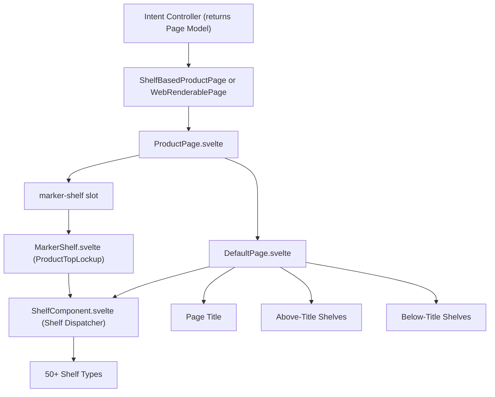
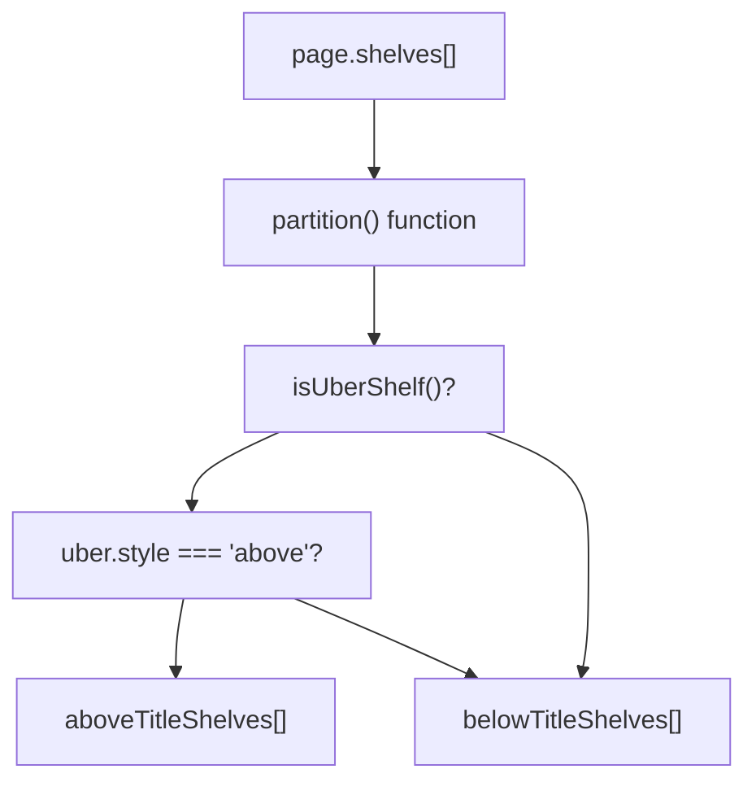
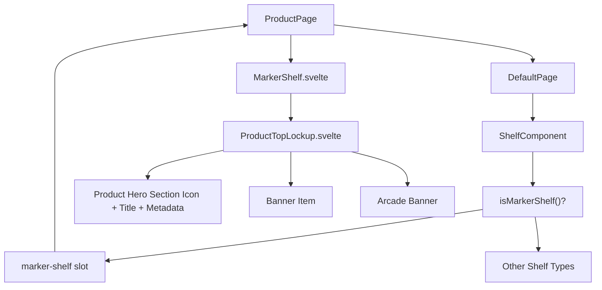
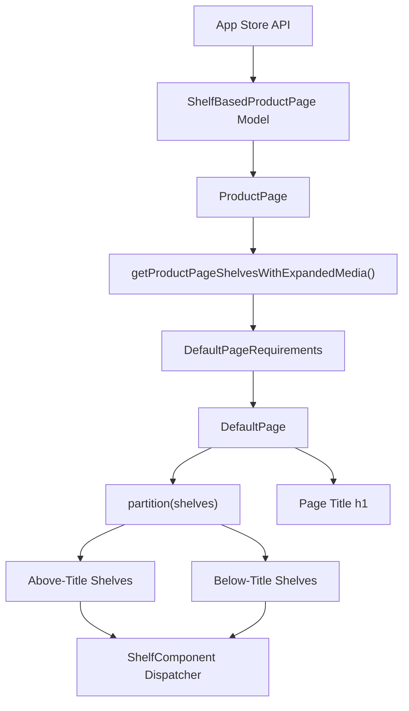

# 页面组件 (Page Components)

-   [src/components/AmbientBackgroundArtwork.svelte](https://github.com/Chesszyh/apps.apple.com/blob/279d0c4d/src/components/AmbientBackgroundArtwork.svelte)
-   [src/components/Shelf/Wrapper.svelte](https://github.com/Chesszyh/apps.apple.com/blob/279d0c4d/src/components/Shelf/Wrapper.svelte)
-   [src/components/jet/marker-shelf/ProductTopLockup.svelte](https://github.com/Chesszyh/apps.apple.com/blob/279d0c4d/src/components/jet/marker-shelf/ProductTopLockup.svelte)
-   [src/components/jet/shelf/ArcadeFooterShelf.svelte](https://github.com/Chesszyh/apps.apple.com/blob/279d0c4d/src/components/jet/shelf/ArcadeFooterShelf.svelte)
-   [src/components/jet/shelf/PageHeaderShelf.svelte](https://github.com/Chesszyh/apps.apple.com/blob/279d0c4d/src/components/jet/shelf/PageHeaderShelf.svelte)
-   [src/components/jet/shelf/PrivacyFooterShelf.svelte](https://github.com/Chesszyh/apps.apple.com/blob/279d0c4d/src/components/jet/shelf/PrivacyFooterShelf.svelte)
-   [src/components/jet/shelf/ProductDescriptionShelf.svelte](https://github.com/Chesszyh/apps.apple.com/blob/279d0c4d/src/components/jet/shelf/ProductDescriptionShelf.svelte)
-   [src/components/jet/shelf/ProductMediaShelf.svelte](https://github.com/Chesszyh/apps.apple.com/blob/279d0c4d/src/components/jet/shelf/ProductMediaShelf.svelte)
-   [src/components/pages/DefaultPage.svelte](https://github.com/Chesszyh/apps.apple.com/blob/279d0c4d/src/components/pages/DefaultPage.svelte)
-   [src/components/pages/ProductPage.svelte](https://github.com/Chesszyh/apps.apple.com/blob/279d0c4d/src/components/pages/ProductPage.svelte)

## 目的与范围 (Purpose and Scope)

本文档涵盖了编排货架 (shelf) 渲染的顶层页面组件：**DefaultPage** 和 **ProductPage**。这些组件消费来自 API 的基于货架的数据模型，并协调各个货架、标题和页面级布局关注点的渲染。

有关货架分发系统和单个货架实现的详情，请参阅 [Shelf System](#4.2)。有关模态框呈现模式，请参阅 [Modal Presentation](#4.3)。

---

## 页面组件架构 (Page Component Architecture)

页面渲染系统遵循两层模式，其中 `ProductPage` 包装了 `DefaultPage` 以提供产品特定的功能，同时将核心货架编排委托给基础组件。


来源：[src/components/pages/DefaultPage.svelte1-174](https://github.com/Chesszyh/apps.apple.com/blob/279d0c4d/src/components/pages/DefaultPage.svelte#L1-L174) [src/components/pages/ProductPage.svelte1-78](https://github.com/Chesszyh/apps.apple.com/blob/279d0c4d/src/components/pages/ProductPage.svelte#L1-L78)

---

## DefaultPage 组件 (DefaultPage Component)

### 组件接口 (Component Interface)

`DefaultPage` 接受一个最小的页面需求接口，并提供核心货架渲染逻辑。

**类型定义：**

```
interface DefaultPageRequirements extends WebRenderablePage {    shelves: Shelf[];    presentationOptions?: PagePresentationOptions;}
```
**插槽 (Slots)：**

-   `before-shelves` - 在标题之后但于 `belowTitleShelves` 之前注入的内容
-   `marker-shelf` - 用于渲染具有页面数据访问权限的 `MarkerShelf` 的作用域插槽 (scoped slot)

来源：[src/components/pages/DefaultPage.svelte8-14](https://github.com/Chesszyh/apps.apple.com/blob/279d0c4d/src/components/pages/DefaultPage.svelte#L8-L14)

### 货架分区逻辑 (Shelf Partitioning Logic)

`DefaultPage` 将货架数组分为两组：在页面标题上方渲染的货架和在页面标题下方渲染的货架。这允许某些全宽英雄 (hero) 货架出现在页面标题之前。


**实现：** 分区逻辑使用 `partition` 工具函数根据货架是否为 `style === 'above'` 的 `UberShelf` 组件进行拆分。

来源：[src/components/pages/DefaultPage.svelte45-57](https://github.com/Chesszyh/apps.apple.com/blob/279d0c4d/src/components/pages/DefaultPage.svelte#L45-L57)

### 标题渲染 (Title Rendering)

页面标题根据多个因素有条件地进行渲染：

| 条件 | 描述 | 结果 |
| --- | --- | --- |
| `!title` | 未提供标题 | 省略标题 |
| `prefersHiddenPageTitle` | 呈现选项已设置 | 省略标题 |
| `isTitleDuplicatedInHero` | 标题出现在第一个 `HeroCarouselShelf` 中 | 省略标题以避免重复 |
| `prefersLargeTitle` | 呈现选项已设置 | 使用大标题变体 |
| `prefersOverlayedPageHeader` | xsmall 视口上的呈现选项 | 标题绝对定位于内容上方 |

**标题重复检测：** 组件会检查页面标题是否已存在于第一个货架的英雄项中，以避免显示两次。

来源：[src/components/pages/DefaultPage.svelte69-85](https://github.com/Chesszyh/apps.apple.com/blob/279d0c4d/src/components/pages/DefaultPage.svelte#L69-L85) [src/components/pages/DefaultPage.svelte100-109](https://github.com/Chesszyh/apps.apple.com/blob/279d0c4d/src/components/pages/DefaultPage.svelte#L100-L109)

### 呈现选项 (Presentation Options)

`DefaultPage` 遵循页面模型中的几个呈现提示：

**prefersHiddenPageTitle**

-   即使存在标题，也会完全隐藏页面标题
-   用于标题已嵌入内容的页面

**prefersLargeTitle**

-   应用 `.large-title` CSS 类
-   使用 `var(--large-title-emphasized-tall)` 字体
-   提供更多视觉层级感

**prefersOverlayedPageHeader**

-   仅适用于 `xsmall` 视口（移动端）
-   将标题绝对定位于内容上方
-   调整容器边距：`margin-top: -13px`
-   根据轮播媒体样式（亮色/暗色）调整文本颜色

来源：[src/components/pages/DefaultPage.svelte59-67](https://github.com/Chesszyh/apps.apple.com/blob/279d0c4d/src/components/pages/DefaultPage.svelte#L59-L67) [src/components/pages/DefaultPage.svelte148-172](https://github.com/Chesszyh/apps.apple.com/blob/279d0c4d/src/components/pages/DefaultPage.svelte#L148-L172)

### 渲染流程 (Rendering Flow)

来源：[src/components/pages/DefaultPage.svelte88-125](https://github.com/Chesszyh/apps.apple.com/blob/279d0c4d/src/components/pages/DefaultPage.svelte#L88-L125)

---

## ProductPage 组件 (ProductPage Component)

### 包装器模式 (Wrapper Pattern)

`ProductPage` 是 `DefaultPage` 的一个薄包装器，提供了产品特定的功能。它消费 `ShelfBasedProductPage` 模型并将其转换为 `DefaultPageRequirements` 接口。

**组件组合：**

```
// ProductPage 构建 DefaultPageRequirementsdefaultPageRequirements = {    shelves: getProductPageShelvesWithExpandedMedia(page),    presentationOptions: page.presentationOptions,    webNavigation: page.webNavigation,}
```
来源：[src/components/pages/ProductPage.svelte24-30](https://github.com/Chesszyh/apps.apple.com/blob/279d0c4d/src/components/pages/ProductPage.svelte#L24-L30)

### MarkerShelf 集成 (MarkerShelf Integration)

`marker-shelf` 插槽机制允许 `ProductPage` 将产品特定数据注入到 `MarkerShelf` 组件中（渲染为 `ProductTopLockup`），该组件作为一种特殊的货架类型出现在货架数组中。


**MarkerShelfPageRequirements**：标记货架需要特定的页面属性来渲染产品英雄区域：

```
type MarkerShelfPageRequirements = Pick<ShelfBasedProductPage,    | 'badges'    | 'banner'    | 'developerAction'    | 'lockup'    | 'shelfMapping'    | 'titleOfferDisplayProperties'    | 'canonicalURL'    | 'appPlatforms'>;
```
来源：[src/components/pages/ProductPage.svelte69-73](https://github.com/Chesszyh/apps.apple.com/blob/279d0c4d/src/components/pages/ProductPage.svelte#L69-L73) [src/components/jet/marker-shelf/ProductTopLockup.svelte11-21](https://github.com/Chesszyh/apps.apple.com/blob/279d0c4d/src/components/jet/marker-shelf/ProductTopLockup.svelte#L11-L21)

### 深层链接支持 (Deep Linking Support)

`ProductPage` 支持通过 `?lic` 查询参数深层链接到许可协议模态框。这是通过扫描货架寻找包含 EULA 操作的 `ProductPageLinkShelf` 并以编程方式执行该操作来实现的。

**深层链接流程：**

> **[Mermaid sequence]**
> *(图表结构无法解析)*

来源：[src/components/pages/ProductPage.svelte36-61](https://github.com/Chesszyh/apps.apple.com/blob/279d0c4d/src/components/pages/ProductPage.svelte#L36-L61)

### 无障碍上下文设置 (Accessibility Context Setup)

`ProductPage` 使用货架数组初始化无障碍布局上下文，从而为无障碍特性实现邻居货架检测。

```
setAccessibilityLayoutContext({ shelves });
```
来源：[src/components/pages/ProductPage.svelte32-34](https://github.com/Chesszyh/apps.apple.com/blob/279d0c4d/src/components/pages/ProductPage.svelte#L32-L34)

### Arcade 支持 (Arcade Support)

`ProductPage` 通过检查 `page.lockup.offerDisplayProperties?.offerType === 'arcadeApp'` 来检测产品是否为 Arcade 应用，并有条件地渲染 `ProductPageArcadeFooter` 组件。

来源：[src/components/pages/ProductPage.svelte63-77](https://github.com/Chesszyh/apps.apple.com/blob/279d0c4d/src/components/pages/ProductPage.svelte#L63-L77)

---

## 页面级数据转换 (Page-Level Data Transformation)


来源：[src/components/pages/ProductPage.svelte1-78](https://github.com/Chesszyh/apps.apple.com/blob/279d0c4d/src/components/pages/ProductPage.svelte#L1-L78) [src/components/pages/DefaultPage.svelte1-174](https://github.com/Chesszyh/apps.apple.com/blob/279d0c4d/src/components/pages/DefaultPage.svelte#L1-L174)

---

## 呈现选项参考 (Presentation Options Reference)

| 选项 | 类型 | 视口 | 效果 | CSS 类 |
| --- | --- | --- | --- | --- |
| `prefersHiddenPageTitle` | boolean | 全部 | 完全隐藏页面标题 | N/A |
| `prefersLargeTitle` | boolean | 全部 | 使用更大的标题字体 | `.large-title` |
| `prefersOverlayedPageHeader` | boolean | 仅 xsmall | 将标题绝对定位于内容上方 | `.overlaid` |
| N/A (轮播样式) | 计算属性 | xsmall + 叠加 | 为暗色背景调整标题颜色 | `.on-dark-background` |

**使用的 CSS 变量：**

-   `--large-title-emphasized`: 默认标题字体
-   `--large-title-emphasized-tall`: 大标题变体字体
-   `--systemPrimary-onLight`: 亮色背景上的标题颜色
-   `--systemPrimary-onDark`: 暗色背景上的标题颜色
-   `--bodyGutter`: 水平内边距

来源：[src/components/pages/DefaultPage.svelte59-67](https://github.com/Chesszyh/apps.apple.com/blob/279d0c4d/src/components/pages/DefaultPage.svelte#L59-L67) [src/components/pages/DefaultPage.svelte148-172](https://github.com/Chesszyh/apps.apple.com/blob/279d0c4d/src/components/pages/DefaultPage.svelte#L148-L172)

---

## 组件文件结构 (Component File Structure)

| 组件 | 路径 | 职责 |
| --- | --- | --- |
| DefaultPage | [src/components/pages/DefaultPage.svelte1-174](https://github.com/Chesszyh/apps.apple.com/blob/279d0c4d/src/components/pages/DefaultPage.svelte#L1-L174) | 核心货架编排、标题渲染、呈现选项 |
| ProductPage | [src/components/pages/ProductPage.svelte1-78](https://github.com/Chesszyh/apps.apple.com/blob/279d0c4d/src/components/pages/ProductPage.svelte#L1-L78) | 产品特定包装器、标记货架集成、深层链接 |
| ProductTopLockup | [src/components/jet/marker-shelf/ProductTopLockup.svelte1-464](https://github.com/Chesszyh/apps.apple.com/blob/279d0c4d/src/components/jet/marker-shelf/ProductTopLockup.svelte#L1-L464) | 产品英雄区域，包含应用图标、元数据、环境背景 |
| ShelfWrapper | [src/components/Shelf/Wrapper.svelte1-82](https://github.com/Chesszyh/apps.apple.com/blob/279d0c4d/src/components/Shelf/Wrapper.svelte#L1-L82) | 通用货架布局和间距（参见 [Shelf Wrapper and Common Layout](#4.4)） |

来源：[src/components/pages/DefaultPage.svelte1-174](https://github.com/Chesszyh/apps.apple.com/blob/279d0c4d/src/components/pages/DefaultPage.svelte#L1-L174) [src/components/pages/ProductPage.svelte1-78](https://github.com/Chesszyh/apps.apple.com/blob/279d0c4d/src/components/pages/ProductPage.svelte#L1-L78) [src/components/jet/marker-shelf/ProductTopLockup.svelte1-464](https://github.com/Chesszyh/apps.apple.com/blob/279d0c4d/src/components/jet/marker-shelf/ProductTopLockup.svelte#L1-L464) [src/components/Shelf/Wrapper.svelte1-82](https://github.com/Chesszyh/apps.apple.com/blob/279d0c4d/src/components/Shelf/Wrapper.svelte#L1-L82)
