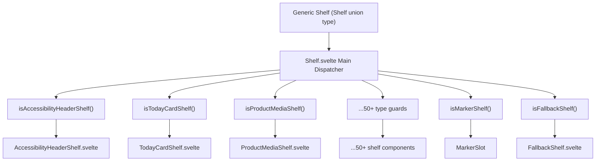
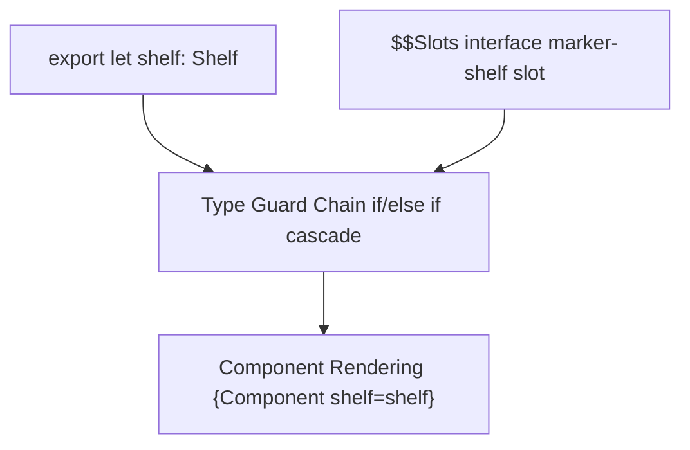
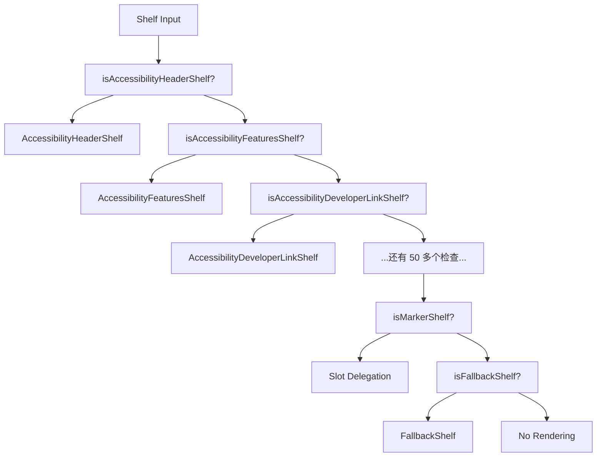

# 货架系统 (Shelf System)

-   [src/components/jet/shelf/Shelf.svelte](https://github.com/Chesszyh/apps.apple.com/blob/279d0c4d/src/components/jet/shelf/Shelf.svelte)

## 目的与范围 (Purpose and Scope)

货架系统是核心的多态渲染机制，可动态地将通用的 `Shelf` 数据模型分发到特定类型的 Svelte 组件。该系统使用类型守卫函数将通用的 `Shelf` 类型缩小为特定的货架类型，然后渲染相应的组件实现。这种分发器模式使应用程序能够通过一个统一接口渲染 50 多种不同的货架类型。

有关页面级组合以及如何在页面内编排货架的信息，请参阅 [Page Components](#4.1)。有关应用于货架的通用布局模式的详情，请参阅 [Shelf Wrapper and Common Layout](#4.4)。有关所有货架类型的完整目录，请参阅 [Shelf Type Reference](#7)。

---

## 架构概览 (Architecture Overview)

货架系统实现了一个**类型守卫分发器模式**，其中单个组件 (`Shelf.svelte`) 充当通用货架数据与特定类型渲染实现之间的路由层。

### 系统架构 (System Architecture)


**来源：** [src/components/jet/shelf/Shelf.svelte1-321](https://github.com/Chesszyh/apps.apple.com/blob/279d0c4d/src/components/jet/shelf/Shelf.svelte#L1-L321)

---

## 类型守卫模式 (Type Guard Pattern)

每个货架类型都实现了一个**类型守卫函数**，该函数执行运行时类型检查并提供 TypeScript 类型缩小。类型守卫遵循一致的命名约定：`is{ShelfType}(shelf: Shelf): shelf is {ShelfType}`。

### 类型守卫实现模式 (Type Guard Implementation Pattern)

类型守卫会检查货架对象上是否存在特定的 `kind` 属性：

```
// 类型守卫结构示例export function isTodayCardShelf(shelf: Shelf): shelf is TodayCardShelf {    return shelf.kind === 'TodayCardShelf';}
```
分发器组件在级联的 if/else 链中使用这些类型守卫：

```
{#if isAccessibilityHeaderShelf(shelf)}    <AccessibilityHeaderShelf {shelf} />{:else if isAccessibilityFeaturesShelf(shelf)}    <AccessibilityFeaturesShelf {shelf} />{:else if isActionShelf(shelf)}    <ActionShelf {shelf} /><!-- ...继续针对所有货架类型进行检查... -->{/if}
```
**来源：** [src/components/jet/shelf/Shelf.svelte205-320](https://github.com/Chesszyh/apps.apple.com/blob/279d0c4d/src/components/jet/shelf/Shelf.svelte#L205-L320)

### 类型守卫执行流程 (Type Guard Execution Flow)

> **[Mermaid sequence]**
> *(图表结构无法解析)*

**来源：** [src/components/jet/shelf/Shelf.svelte195-203](https://github.com/Chesszyh/apps.apple.com/blob/279d0c4d/src/components/jet/shelf/Shelf.svelte#L195-L203)

---

## 货架类型目录 (Shelf Type Catalog)

系统支持 50 多种货架类型，按功能分类如下：

### 编辑与推广货架 (Editorial and Promotional Shelves)

| 货架类型 | 类型守卫 | 组件 |
| --- | --- | --- |
| `TodayCardShelf` | `isTodayCardShelf` | `TodayCardShelf.svelte` |
| `EditorialCardShelf` | `isEditorialCardShelf` | `EditorialCardShelf.svelte` |
| `HeroCarouselShelf` | `isHeroCarouselShelf` | `HeroCarouselShelf.svelte` |
| `AppPromotionShelf` | `isAppPromotionShelf` | `AppPromotionShelf.svelte` |
| `AppShowcaseShelf` | `isAppShowcaseShelf` | `AppShowcaseShelf.svelte` |
| `UberShelf` | `isUberShelf` | `UberShelf.svelte` |

### 锁定货架 (Lockup Shelves)

| 货架类型 | 类型守卫 | 组件 |
| --- | --- | --- |
| `SmallLockupShelf` | `isSmallLockupShelf` | `SmallLockupShelf.svelte` |
| `MediumLockupShelf` | `isMediumLockupShelf` | `MediumLockupShelf.svelte` |
| `LargeLockupShelf` | `isLargeLockupShelf` | `LargeLockupShelf.svelte` |
| `PosterLockupShelf` | `isPosterLockupShelf` | `PosterLockupShelf.svelte` |
| `AppTrailerLockupShelf` | `isAppTrailerLockupShelf` | `AppTrailerLockupShelf.svelte` |
| `InAppPurchaseLockupShelf` | `isInAppPurchaseLockupShelf` | `InAppPurchaseLockupShelf.svelte` |

### 砖块与卡片货架 (Brick and Card Shelves)

| 货架类型 | 类型守卫 | 组件 |
| --- | --- | --- |
| `BrickShelf` | `isBrickShelf` | `BrickShelf.svelte` |
| `SmallBrickShelf` | `isSmallBrickShelf` | `SmallBrickShelf.svelte` |
| `LargeBrickShelf` | `isLargeBrickShelf` | `LargeBrickShelf.svelte` |
| `CategoryBrickShelf` | `isCategoryBrickShelf` | `CategoryBrickShelf.svelte` |
| `SmallStoryCardShelf` | `isSmallStoryCardShelf` | `SmallStoryCardShelf.svelte` |
| `MediumStoryCardShelf` | `isMediumStoryCardShelf` | `MediumStoryCardShelf.svelte` |
| `LargeStoryCardShelf` | `isLargeStoryCardShelf` | `LargeStoryCardShelf.svelte` |

### 产品特定货架 (Product-Specific Shelves)

| 货架类型 | 类型守卫 | 组件 |
| --- | --- | --- |
| `ProductMediaShelf` | `isProductMediaShelf` | `ProductMediaShelf.svelte` |
| `ProductDescriptionShelf` | `isProductDescriptionShelf` | `ProductDescriptionShelf.svelte` |
| `ProductRatingsShelf` | `isProductRatingsShelf` | `ProductRatingsShelf.svelte` |
| `ProductReviewShelf` | `isProductReviewShelf` | `ProductReviewShelf.svelte` |
| `ProductBadgeShelf` | `isProductBadgeShelf` | `ProductBadgeShelf.svelte` |
| `ProductCapabilityShelf` | `isProductCapabilityShelf` | `ProductCapabilityShelf.svelte` |
| `ProductPageLinkShelf` | `isProductPageLinkShelf` | `ProductPageLinkShelf.svelte` |

### 图像与媒体货架 (Image and Media Shelves)

| 货架类型 | 类型守卫 | 组件 |
| --- | --- | --- |
| `LargeImageLockupShelf` | `isLargeImageLockupShelf` | `LargeImageLockupShelf.svelte` |
| `MediumImageLockupShelf` | `isMediumImageLockupShelf` | `MediumImageLockupShelf.svelte` |
| `FramedArtworkShelf` | `isFramedArtworkShelf` | `FramedArtworkShelf.svelte` |
| `FramedVideoShelf` | `isFramedVideoShelf` | `FramedVideoShelf.svelte` |

### 突显货架 (Breakout Shelves)

| 货架类型 | 类型守卫 | 组件 |
| --- | --- | --- |
| `SmallBreakoutShelf` | `isSmallBreakoutShelf` | `SmallBreakoutShelf.svelte` |
| `LargeHeroBreakoutShelf` | `isLargeHeroBreakoutShelf` | `LargeHeroBreakoutShelf.svelte` |

### 信息类货架 (Informational Shelves)

| 货架类型 | 类型守卫 | 组件 |
| --- | --- | --- |
| `AccessibilityHeaderShelf` | `isAccessibilityHeaderShelf` | `AccessibilityHeaderShelf.svelte` |
| `AccessibilityFeaturesShelf` | `isAccessibilityFeaturesShelf` | `AccessibilityFeaturesShelf.svelte` |
| `AccessibilityDeveloperLinkShelf` | `isAccessibilityDeveloperLinkShelf` | `AccessibilityDeveloperLinkShelf.svelte` |
| `PrivacyHeaderShelf` | `isPrivacyHeaderShelf` | `PrivacyHeaderShelf.svelte` |
| `PrivacyFooterShelf` | `isPrivacyFooterShelf` | `PrivacyFooterShelf.svelte` |
| `PrivacyTypeShelf` | `isPrivacyTypeShelf` | `PrivacyTypeShelf.svelte` |
| `PageHeaderShelf` | `isPageHeaderShelf` | `PageHeaderShelf.svelte` |
| `ParagraphShelf` | `isParagraphShelf` | `ParagraphShelf.svelte` |
| `TitledParagraphShelf` | `isTitledParagraphShelf` | `TitledParagraphShelf.svelte` |
| `QuoteShelf` | `isQuoteShelf` | `QuoteShelf.svelte` |
| `AnnotationShelf` | `isAnnotationShelf` | `AnnotationShelf.svelte` |
| `LinkableTextShelf` | `isLinkableTextShelf` | `LinkableTextShelf.svelte` |

### 评论货架 (Review Shelves)

| 货架类型 | 类型守卫 | 组件 |
| --- | --- | --- |
| `ReviewsShelf` | `isReviewsShelf` | `ReviewsShelf.svelte` |
| `ReviewsContainerShelf` | `isReviewsContainerShelf" | `ReviewsContainerShelf.svelte` |

### 搜索与导航货架 (Search and Navigation Shelves)

| 货架类型 | 类型守卫 | 组件 |
| --- | --- | --- |
| `SearchResultShelf` | `isSearchResultShelf` | `SearchResultShelf.svelte` |
| `SearchLinkShelf` | `isSearchLinkShelf` | `SearchLinkShelf.svelte` |
| `EditorialLinkShelf` | `isEditorialLinkShelf` | `EditorialLinkShelf.svelte` |

### 工具与 UI 货架 (Utility and UI Shelves)

| 货架类型 | 类型守卫 | 组件 |
| --- | --- | --- |
| `ActionShelf` | `isActionShelf` | `ActionShelf.svelte` |
| `AppEventDetailShelf` | `isAppEventDetailShelf` | `AppEventDetailShelf.svelte` |
| `ArcadeFooterShelf` | `isArcadeFooterShelf` | `ArcadeFooterShelf.svelte` |
| `HorizontalRuleShelf` | `isHorizontalRuleShelf` | `HorizontalRuleShelf.svelte` |
| `RibbonBarShelf` | `isRibbonBarShelf` | `RibbonBarShelf.svelte` |

### 特殊货架 (Special Shelves)

| 货架类型 | 类型守卫 | 组件 | 备注 |
| --- | --- | --- | --- |
| `MarkerShelf` | `isMarkerShelf` | 插槽委托 | 使用父组件插槽 |
| `BannerShelf` | `isBannerShelf` | 无操作 (No-op) | 当前已禁用 |
| `FallbackShelf` | `isFallbackShelf` | `FallbackShelf.svelte` | 用于未知类型的全匹配 |

**来源：** [src/components/jet/shelf/Shelf.svelte5-174](https://github.com/Chesszyh/apps.apple.com/blob/279d0c4d/src/components/jet/shelf/Shelf.svelte#L5-L174) [src/components/jet/shelf/Shelf.svelte205-320](https://github.com/Chesszyh/apps.apple.com/blob/279d0c4d/src/components/jet/shelf/Shelf.svelte#L205-L320)

---

## 组件分发器实现 (Component Dispatcher Implementation)

### 主货架组件 (Main Shelf Component)

`Shelf.svelte` 组件作为一个纯条件渲染组件实现，除了类型检查外没有额外的逻辑：


该组件接受一个泛型 `Shelf` 联合类型的单个 `shelf` 属性，并为特殊的 `marker-shelf` 插槽声明了一个类型化的插槽接口。

**来源：** [src/components/jet/shelf/Shelf.svelte176-193](https://github.com/Chesszyh/apps.apple.com/blob/279d0c4d/src/components/jet/shelf/Shelf.svelte#L176-L193)

### 类型守卫级联 (Type Guard Cascade)

类型守卫级联遵循特定的顺序：


排序在功能类别内按货架类型字母顺序排列，这使得在源代码中定位特定的货架类型变得容易。

**来源：** [src/components/jet/shelf/Shelf.svelte205-320](https://github.com/Chesszyh/apps.apple.com/blob/279d0c4d/src/components/jet/shelf/Shelf.svelte#L205-L320)

---

## 特殊情况 (Special Cases)

### MarkerShelf 插槽委托 (MarkerShelf Slot Delegation)

`MarkerShelf` 是一种特殊的货架类型，它在渲染时需要访问整个页面数据模型，而不仅仅是货架本身。`Shelf` 组件不直接渲染，而是通过具名插槽将渲染工作委托回父组件：

```
{:else if isMarkerShelf(shelf)}    <slot name="marker-shelf" {shelf} />{/if}
```
父组件（通常是 `ProductPage`）提供插槽实现，并可访问完整的页面上下文：

```
<Shelf {shelf}>    <svelte:fragment slot="marker-shelf" let:shelf>        <!-- 渲染时可访问页面数据 -->    </svelte:fragment></Shelf>
```
**来源：** [src/components/jet/shelf/Shelf.svelte176-190](https://github.com/Chesszyh/apps.apple.com/blob/279d0c4d/src/components/jet/shelf/Shelf.svelte#L176-L190) [src/components/jet/shelf/Shelf.svelte316-317](https://github.com/Chesszyh/apps.apple.com/blob/279d0c4d/src/components/jet/shelf/Shelf.svelte#L316-L317)

### BannerShelf 无操作 (BannerShelf No-Op)

`BannerShelf` 类型当前被禁用，采用无操作 (no-op) 实现：

```
{:else if isBannerShelf(shelf)}    <!-- a no-op until we determine if we actually want to support these banners -->    <!-- <BannerShelf {shelf} /> -->{/if}
```
这保留了类型守卫和导入结构，同时在做出产品决策之前阻止横幅 (banner) 渲染。

**来源：** [src/components/jet/shelf/Shelf.svelte225-227](https://github.com/Chesszyh/apps.apple.com/blob/279d0c4d/src/components/jet/shelf/Shelf.svelte#L225-L227)

### FallbackShelf

`FallbackShelf` 作为不匹配任何特定类型守卫的货架类型的全匹配。它被放置在类型守卫级联的末尾，以优雅地处理未知或未来的货架类型：

```
{:else if isFallbackShelf(shelf)}    <FallbackShelf {shelf} />{/if}
```
**来源：** [src/components/jet/shelf/Shelf.svelte318-319](https://github.com/Chesszyh/apps.apple.com/blob/279d0c4d/src/components/jet/shelf/Shelf.svelte#L318-L319)

---

## 与页面组件的集成 (Integration with Page Components)

货架组件通过遍历 `shelves` 数组集成到页面组件中：

> **[Mermaid sequence]**
> *(图表结构无法解析)*

页面组件从 API 接收 `shelves` 数组并对其进行遍历，将每个货架传递给 `Shelf` 分发器组件。分发器确定适当的组件并将其渲染。

**来源：** [src/components/jet/shelf/Shelf.svelte195-203](https://github.com/Chesszyh/apps.apple.com/blob/279d0c4d/src/components/jet/shelf/Shelf.svelte#L195-L203)

---

## 添加新货架类型 (Adding New Shelf Types)

要向系统中添加新货架类型，请遵循现有货架类型建立的模式：

1.  **创建货架组件**（例如 `NewShelf.svelte`）
2.  **实现类型守卫函数**，签名为 `isNewShelf(shelf: Shelf): shelf is NewShelf`
3.  在 `Shelf.svelte` 中**导入组件和类型守卫**
4.  在类型守卫级联中**添加一个条件分支**
5.  **将检查放在 fallback 货架检查之前**

有关详细的实现指导，请参阅 [Adding a New Shelf Type](#8.1)。

**来源：** [src/components/jet/shelf/Shelf.svelte1-321](https://github.com/Chesszyh/apps.apple.com/blob/279d0c4d/src/components/jet/shelf/Shelf.svelte#L1-L321)

---

## 类型安全与运行时保证 (Type Safety and Runtime Guarantees)

类型守卫模式同时提供**编译时类型安全**和**运行时类型检查**：

-   **编译时**：TypeScript 的类型缩小确保一旦类型守卫返回 true，组件就会收到正确类型的货架数据
-   **运行时**：`kind` 属性检查确保根据实际运行时数据渲染正确的组件

这种双重保证防止了类型错误以及由于货架类型不匹配导致的渲染错误。

**来源：** [src/components/jet/shelf/Shelf.svelte205-320](https://github.com/Chesszyh/apps.apple.com/blob/279d0c4d/src/components/jet/shelf/Shelf.svelte#L205-L320)
