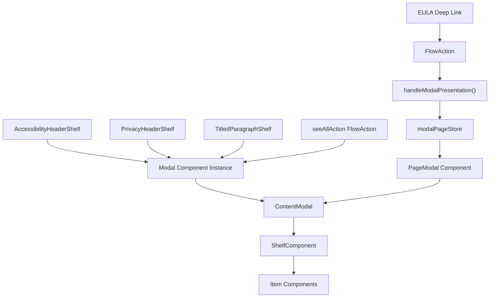
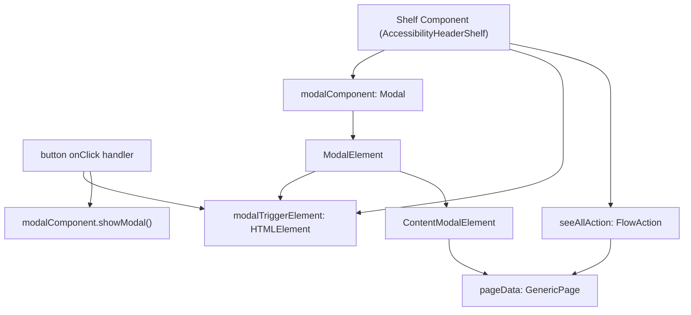
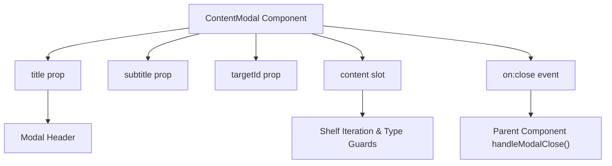
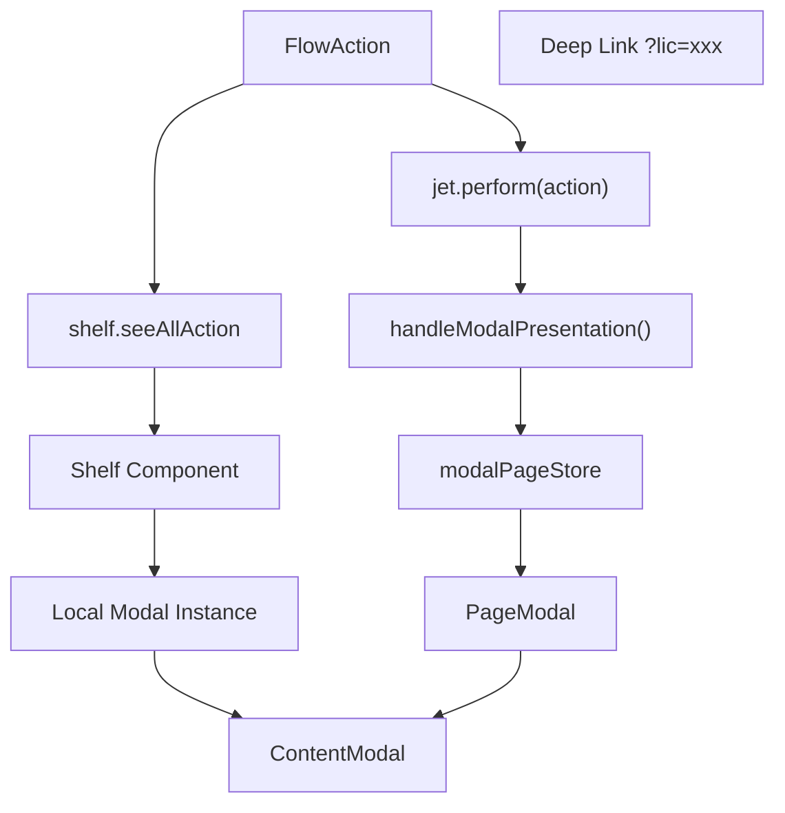

# 模态框呈现 (Modal Presentation)

-   [src/components/PageModal.svelte](https://github.com/Chesszyh/apps.apple.com/blob/279d0c4d/src/components/PageModal.svelte)
-   [src/components/jet/shelf/AccessibilityHeaderShelf.svelte](https://github.com/Chesszyh/apps.apple.com/blob/279d0c4d/src/components/jet/shelf/AccessibilityHeaderShelf.svelte)
-   [src/components/jet/shelf/PrivacyHeaderShelf.svelte](https://github.com/Chesszyh/apps.apple.com/blob/279d0c4d/src/components/jet/shelf/PrivacyHeaderShelf.svelte)
-   [src/components/jet/shelf/TitledParagraphShelf.svelte](https://github.com/Chesszyh/apps.apple.com/blob/279d0c4d/src/components/jet/shelf/TitledParagraphShelf.svelte)
-   [src/jet/utils/handle-modal-presentation.ts](https://github.com/Chesszyh/apps.apple.com/blob/279d0c4d/src/jet/utils/handle-modal-presentation.ts)
-   [src/stores/modalPage.ts](https://github.com/Chesszyh/apps.apple.com/blob/279d0c4d/src/stores/modalPage.ts)

## 目的与范围 (Purpose and Scope)

本文档描述了 App Store Web 应用程序中的模态框呈现系统。该系统实现了两种互补的模式来显示叠加内容：**直接货架模态框 (direct shelf modals)**，其中各个货架组件管理自己的模态框实例；以及使用通过 `modalPageStore` 进行集中状态管理的**全局模态框系统 (global modal system)**。这两种模式都通过共享的 `ContentModal` 组件渲染 `GenericPage` 内容。

有关页面级组件和货架编排的信息，请参阅 [Page Components](#4.1)。有关货架组件分发器系统，请参阅 [Shelf System](#4.2)。

---

## 模态框架构概览 (Modal Architecture Overview)

模态框系统提供了两种不同的架构模式，每种模式都针对不同的用例进行了优化：

**双模态框模式架构 (Dual Modal Pattern Architecture)**


来源：[src/components/jet/shelf/AccessibilityHeaderShelf.svelte](https://github.com/Chesszyh/apps.apple.com/blob/279d0c4d/src/components/jet/shelf/AccessibilityHeaderShelf.svelte) [src/components/PageModal.svelte](https://github.com/Chesszyh/apps.apple.com/blob/279d0c4d/src/components/PageModal.svelte) [src/jet/utils/handle-modal-presentation.ts](https://github.com/Chesszyh/apps.apple.com/blob/279d0c4d/src/jet/utils/handle-modal-presentation.ts)

| 模式 | 用途 | 状态管理 | 触发方法 |
| --- | --- | --- | --- |
| 直接货架模态框 | 产品页面货架简单的“查看全部”扩展 | 组件局部 `modalComponent` 变量 | 用户点击货架标题按钮 |
| 全局模态框 | 复杂的导航流程、深层链接 (EULA)、程序化触发 | 集中式 `modalPageStore` | `handleModalPresentation()` 工具 |

---

## 直接货架模态框模式 (Direct Shelf Modal Pattern)

直接货架模态框自包含在单个货架组件中。货架拥有一个局部的 `Modal` 组件实例，并通过 `showModal()` 和 `close()` 方法直接控制其生命周期。

**直接模态框组件结构 (Direct Modal Component Structure)**


来源：[src/components/jet/shelf/AccessibilityHeaderShelf.svelte74-90](https://github.com/Chesszyh/apps.apple.com/blob/279d0c4d/src/components/jet/shelf/AccessibilityHeaderShelf.svelte#L74-L90) [src/components/jet/shelf/TitledParagraphShelf.svelte51-69](https://github.com/Chesszyh/apps.apple.com/blob/279d0c4d/src/components/jet/shelf/TitledParagraphShelf.svelte#L51-L69)

### 实现组件 (Implementation Components)

**AccessibilityHeaderShelf 示例**

货架组件声明模态框管理的局部状态：

```
let modalComponent: Modal | undefined;let modalTriggerElement: HTMLElement | null = null;
```
[src/components/jet/shelf/AccessibilityHeaderShelf.svelte74-75](https://github.com/Chesszyh/apps.apple.com/blob/279d0c4d/src/components/jet/shelf/AccessibilityHeaderShelf.svelte#L74-L75)

事件处理器控制模态框生命周期：

```
const handleModalClose = () => modalComponent?.close();const handleOpenModalClick = (e: Event) => {    modalTriggerElement = e.target as HTMLElement;    modalComponent?.showModal();};
```
[src/components/jet/shelf/AccessibilityHeaderShelf.svelte80-84](https://github.com/Chesszyh/apps.apple.com/blob/279d0c4d/src/components/jet/shelf/AccessibilityHeaderShelf.svelte#L80-L84)

模态框根据 `pageData` 是否可用进行有条件渲染：

```
{#if pageData}    <Modal {modalTriggerElement} bind:this={modalComponent}>        <ContentModal            on:close={handleModalClose}            title={pageData.title || null}            subtitle={null}        >            <!-- 货架遍历 -->        </ContentModal>    </Modal>{/if}
```
[src/components/jet/shelf/AccessibilityHeaderShelf.svelte108-141](https://github.com/Chesszyh/apps.apple.com/blob/279d0c4d/src/components/jet/shelf/AccessibilityHeaderShelf.svelte#L108-L141)

来源：[src/components/jet/shelf/AccessibilityHeaderShelf.svelte74-141](https://github.com/Chesszyh/apps.apple.com/blob/279d0c4d/src/components/jet/shelf/AccessibilityHeaderShelf.svelte#L74-L141)

### FlowAction 数据提取 (FlowAction Data Extraction)

直接模态框使用类型守卫从货架的 `seeAllAction` 中提取 `pageData`：

```
interface AccessibilityDetailPageFlowAction extends FlowAction {    page: 'accessibilityDetails';    pageData: AccessibilityDetailPage;}function isAccessibilityDetailFlowAction(    action: Action,): action is AccessibilityDetailPageFlowAction {    return isFlowAction(action) && action.page === 'accessibilityDetails';}const destination =    seeAllAction && isAccessibilityDetailFlowAction(seeAllAction)        ? seeAllAction        : undefined;const pageData = destination?.pageData;
```
[src/components/jet/shelf/AccessibilityHeaderShelf.svelte28-90](https://github.com/Chesszyh/apps.apple.com/blob/279d0c4d/src/components/jet/shelf/AccessibilityHeaderShelf.svelte#L28-L90)

每种货架类型都为其特定的 `page` 字段值定义了自己的 `FlowAction` 接口和类型守卫：

| 货架类型 | FlowAction 页面值 | 类型守卫函数 |
| --- | --- | --- |
| AccessibilityHeaderShelf | `'accessibilityDetails'` | `isAccessibilityDetailFlowAction()` |
| PrivacyHeaderShelf | `'privacyDetail'` | `isPrivacyDetailFlowAction()` |
| TitledParagraphShelf | `'versionHistory'` | `isVersionHistoryFlowAction()` |

来源：[src/components/jet/shelf/AccessibilityHeaderShelf.svelte53-57](https://github.com/Chesszyh/apps.apple.com/blob/279d0c4d/src/components/jet/shelf/AccessibilityHeaderShelf.svelte#L53-L57) [src/components/jet/shelf/PrivacyHeaderShelf.svelte36-40](https://github.com/Chesszyh/apps.apple.com/blob/279d0c4d/src/components/jet/shelf/PrivacyHeaderShelf.svelte#L36-L40) [src/components/jet/shelf/TitledParagraphShelf.svelte28-32](https://github.com/Chesszyh/apps.apple.com/blob/279d0c4d/src/components/jet/shelf/TitledParagraphShelf.svelte#L28-L32)

### 模态框内容遍历 (Modal Content Iteration)

在 `ContentModal` 内部，每个直接模态框遍历其 `pageData.shelves` 数组并使用类型守卫来渲染适当的项目：

```
{#each pageData.shelves as shelf}    <div class="content-section">        {#if isAccessibilityParagraphShelf(shelf)}            {#each shelf.items as item}                <AccessibilityParagraphItem {item} />            {/each}        {/if}        {#if isAccessibilityFeaturesShelf(shelf)}            {#each shelf.items as item}                <AccessibilityFeaturesItem {item} isDetailView={true} />            {/each}        {/if}    </div>{/each}
```
[src/components/jet/shelf/AccessibilityHeaderShelf.svelte117-136](https://github.com/Chesszyh/apps.apple.com/blob/279d0c4d/src/components/jet/shelf/AccessibilityHeaderShelf.svelte#L117-L136)

来源：[src/components/jet/shelf/AccessibilityHeaderShelf.svelte115-138](https://github.com/Chesszyh/apps.apple.com/blob/279d0c4d/src/components/jet/shelf/AccessibilityHeaderShelf.svelte#L115-L138) [src/components/jet/shelf/PrivacyHeaderShelf.svelte92-109](https://github.com/Chesszyh/apps.apple.com/blob/279d0c4d/src/components/jet/shelf/PrivacyHeaderShelf.svelte#L92-L109) [src/components/jet/shelf/TitledParagraphShelf.svelte89-99](https://github.com/Chesszyh/apps.apple.com/blob/279d0c4d/src/components/jet/shelf/TitledParagraphShelf.svelte#L89-L99)

---

## 全局模态框系统 (Global Modal System)

全局模态框系统使用集中式的 Svelte store 来管理模态框状态，允许应用程序的任何部分触发模态框呈现，而无需直接组件耦合。

**全局模态框数据流 (Global Modal Data Flow)**

> **[Mermaid sequence]**
> *(图表结构无法解析)*

来源：[src/jet/utils/handle-modal-presentation.ts](https://github.com/Chesszyh/apps.apple.com/blob/279d0c4d/src/jet/utils/handle-modal-presentation.ts) [src/components/PageModal.svelte](https://github.com/Chesszyh/apps.apple.com/blob/279d0c4d/src/components/PageModal.svelte) [src/stores/modalPage.ts](https://github.com/Chesszyh/apps.apple.com/blob/279d0c4d/src/stores/modalPage.ts)

### 模态框页面 Store (Modal Page Store)

该 store 提供了一个用于管理全局模态框状态的响应式接口：

```
interface Page {    page: GenericPage;    pageDetail?: string;}interface ModalPageStore extends Readable<Page | undefined> {    setPage: (page: Page) => void;    clearPage: () => void;}
```
[src/stores/modalPage.ts4-27](https://github.com/Chesszyh/apps.apple.com/blob/279d0c4d/src/stores/modalPage.ts#L4-L27)

store 可写对象 (writable) 的创建具有 SSR 保护：

```
const modalPageStore: Writable<Page | undefined> = (() => {    // 防止服务器上的全局 store    if (typeof window === 'undefined') {        return {            subscribe: () => { return () => {}; },            set: () => {},            update: () => {},        } as unknown as Writable<Page | undefined>;    }    return writable();})();
```
[src/stores/modalPage.ts9-22](https://github.com/Chesszyh/apps.apple.com/blob/279d0c4d/src/stores/modalPage.ts#L9-L22)

来源：[src/stores/modalPage.ts](https://github.com/Chesszyh/apps.apple.com/blob/279d0c4d/src/stores/modalPage.ts)

### handleModalPresentation 工具 (handleModalPresentation Utility)

`handleModalPresentation()` 函数作为触发全局模态框的入口点：

```
export const handleModalPresentation = (    page: { promise: Promise<Page> },    log: Logger<unknown[]>,    pageDetail?: string,) => {    page.promise        .then((page) => {            if (isGenericPage(page)) {                const modalStore = getModalPageStore();                modalStore.setPage({ page, pageDetail });            } else {                throw new Error('模态框中仅能渲染 generic 页面');            }        })        .catch((e) => {            log.error('模态框呈现失败', e);        });};
```
[src/jet/utils/handle-modal-presentation.ts12-29](https://github.com/Chesszyh/apps.apple.com/blob/279d0c4d/src/jet/utils/handle-modal-presentation.ts#L12-L29)

该函数：

1.  接受一个页面 promise（来自意图控制器的解析）
2.  验证解析出的页面是 `GenericPage`
3.  使用页面数据更新 `modalPageStore`
4.  （可选）使用 `pageDetail` 标识符标记模态框，以便进行指标分析

来源：[src/jet/utils/handle-modal-presentation.ts](https://github.com/Chesszyh/apps.apple.com/blob/279d0c4d/src/jet/utils/handle-modal-presentation.ts)

### PageModal 组件 (PageModal Component)

`PageModal` 组件订阅 `modalPageStore` 并响应式地管理模态框元素：

```
let modalElement: SvelteComponent;let modalPage = getModalPageStore();let page: GenericPage | undefined;$: page = $modalPage?.page;$: shelves = page?.shelves ?? [];$: title = page?.title ?? null;$: targetId =    $modalPage?.pageDetail === 'licenseAgreement'        ? LICENSE_AGREEMENT_MODAL_ID        : undefined;
```
[src/components/PageModal.svelte11-21](https://github.com/Chesszyh/apps.apple.com/blob/279d0c4d/src/components/PageModal.svelte#L11-L21)

响应式语句控制模态框可见性：

```
$: {    if ($modalPage) {        modalElement?.showModal();    } else {        handleModalClose();    }}
```
[src/components/PageModal.svelte27-33](https://github.com/Chesszyh/apps.apple.com/blob/279d0c4d/src/components/PageModal.svelte#L27-L33)

该组件使用通用的 `ShelfComponent` 分发器渲染货架：

```
<ContentModal {title} subtitle={null} on:close={handleModalClose} {targetId}>    <svelte:fragment slot="content">        {#each shelves as shelf}            <ShelfComponent {shelf}>                <slot name="marker-shelf" slot="marker-shelf" let:shelf {shelf} />            </ShelfComponent>        {/each}    </svelte:fragment></ContentModal>
```
[src/components/PageModal.svelte48-65](https://github.com/Chesszyh/apps.apple.com/blob/279d0c4d/src/components/PageModal.svelte#L48-L65)

来源：[src/components/PageModal.svelte](https://github.com/Chesszyh/apps.apple.com/blob/279d0c4d/src/components/PageModal.svelte)

---

## ContentModal 组件 (ContentModal Component)

`ContentModal` 组件为两种模态框模式提供了共享渲染层。它包装了来自 `@amp/web-app-components` 的 `Modal` 组件，并提供了一致的页眉和关闭按钮。

**ContentModal 结构 (ContentModal Structure)**


来源：[src/components/jet/item/ContentModal.svelte](https://github.com/Chesszyh/apps.apple.com/blob/279d0c4d/src/components/jet/item/ContentModal.svelte) (未提供文件，但贯穿全文引用)

`targetId` 属性支持针对特定模态框类型的指标追踪：

| 模态框类型 | targetId 常量 | 用法 |
| --- | --- | --- |
| 版本历史 | `VERSION_HISTORY_MODAL_ID` | `TitledParagraphShelf` 模态框 |
| 许可协议 | `LICENSE_AGREEMENT_MODAL_ID` | EULA 深层链接模态框 |
| 应用隐私 | `APP_PRIVACY_MODAL_ID` | `PrivacyHeaderShelf` 模态框 |

来源：[src/components/jet/shelf/TitledParagraphShelf.svelte46-86](https://github.com/Chesszyh/apps.apple.com/blob/279d0c4d/src/components/jet/shelf/TitledParagraphShelf.svelte#L46-L86) [src/components/PageModal.svelte9-21](https://github.com/Chesszyh/apps.apple.com/blob/279d0c4d/src/components/PageModal.svelte#L9-L21) [src/components/jet/shelf/PrivacyHeaderShelf.svelte51-89](https://github.com/Chesszyh/apps.apple.com/blob/279d0c4d/src/components/jet/shelf/PrivacyHeaderShelf.svelte#L51-L89)

---

## 模态框生命周期管理 (Modal Lifecycle Management)

**模态框状态转换 (Modal State Transitions)**

> **[Mermaid stateDiagram]**
> *(图表结构无法解析)*

来源：[src/components/jet/shelf/AccessibilityHeaderShelf.svelte80-84](https://github.com/Chesszyh/apps.apple.com/blob/279d0c4d/src/components/jet/shelf/AccessibilityHeaderShelf.svelte#L80-L84) [src/components/PageModal.svelte23-38](https://github.com/Chesszyh/apps.apple.com/blob/279d0c4d/src/components/PageModal.svelte#L23-L38)

### 清理与内存管理 (Cleanup and Memory Management)

`PageModal` 组件在挂载时注册了一个清理函数，以防止内存泄漏：

```
onMount(() => {    return modalPage.clearPage;});
```
[src/components/PageModal.svelte23-25](https://github.com/Chesszyh/apps.apple.com/blob/279d0c4d/src/components/PageModal.svelte#L23-L25)

这确保了在组件销毁时清除 store，防止过时的模态框状态在页面导航之间持续存在。

来源：[src/components/PageModal.svelte23-25](https://github.com/Chesszyh/apps.apple.com/blob/279d0c4d/src/components/PageModal.svelte#L23-L25)

---

## 实现模式选择 (Implementation Pattern Selection)

**模态框模式选择决策矩阵 (Decision Matrix for Modal Pattern Selection)**

| 准则 | 直接货架模态框 | 全局模态框 |
| --- | --- | --- |
| **数据源** | 嵌入了 `pageData` 的 `shelf.seeAllAction` | 外部导航意图或深层链接 |
| **触发位置** | 单个货架组件 | 整个应用中的多个触发点 |
| **状态作用域** | 组件局部 | 应用程序全局 |
| **URL 更新** | 否 | 否（两种模式都避免历史记录更改） |
| **导航流** | 简单的扩展 | 复杂的流 (EULA, 多步骤) |
| **典型内容** | 1-2 种货架类型，在编译时已知 | 来自 API 的动态货架类型 |

### 直接模态框示例用例 (Direct Modal Example Use Cases)

1.  **版本历史** - 带有 `versionHistory` FlowAction 的 `TitledParagraphShelf`
2.  **无障碍详情** - 带有 `accessibilityDetails` FlowAction 的 `AccessibilityHeaderShelf`
3.  **应用隐私详情** - 带有 `privacyDetail` FlowAction 的 `PrivacyHeaderShelf`

来源：[src/components/jet/shelf/TitledParagraphShelf.svelte15-18](https://github.com/Chesszyh/apps.apple.com/blob/279d0c4d/src/components/jet/shelf/TitledParagraphShelf.svelte#L15-L18) [src/components/jet/shelf/AccessibilityHeaderShelf.svelte28-31](https://github.com/Chesszyh/apps.apple.com/blob/279d0c4d/src/components/jet/shelf/AccessibilityHeaderShelf.svelte#L28-L31) [src/components/jet/shelf/PrivacyHeaderShelf.svelte24-27](https://github.com/Chesszyh/apps.apple.com/blob/279d0c4d/src/components/jet/shelf/PrivacyHeaderShelf.svelte#L24-L27)

### 全局模态框示例用例 (Global Modal Example Use Cases)

1.  **EULA 深层链接** - URL 参数 `?lic` 通过 `handleModalPresentation()` 触发许可协议模态框
2.  **程序化模态框** - 任何 `FlowAction` 都可以通过 `jet.perform()` 执行以显示模态框
3.  **动态内容** - 货架编译时未知的内容结构

来源：[src/components/PageModal.svelte18-21](https://github.com/Chesszyh/apps.apple.com/blob/279d0c4d/src/components/PageModal.svelte#L18-L21) [src/jet/utils/handle-modal-presentation.ts6-11](https://github.com/Chesszyh/apps.apple.com/blob/279d0c4d/src/jet/utils/handle-modal-presentation.ts#L6-L11)

---

## 与操作系统的集成 (Integration with Action System)

两种模态框模式都与 [Intent and Action System](#2.2) 中描述的操作分发系统集成：

**从 FlowAction 到模态框渲染 (FlowAction to Modal Rendering)**


来源：[src/components/jet/shelf/TitledParagraphShelf.svelte48-62](https://github.com/Chesszyh/apps.apple.com/blob/279d0c4d/src/components/jet/shelf/TitledParagraphShelf.svelte#L48-L62) [src/jet/utils/handle-modal-presentation.ts12-29](https://github.com/Chesszyh/apps.apple.com/blob/279d0c4d/src/jet/utils/handle-modal-presentation.ts#L12-L29)

`TitledParagraphShelf` 演示了与 `jet.perform()` 的集成，以便在呈现模态框的同时发出指标：

```
const perform = getJetPerform();const handleOpenModalClick = (e: Event) => {    modalTriggerElement = e.target as HTMLElement;    modalComponent?.showModal();    perform(destination);};
```
[src/components/jet/shelf/TitledParagraphShelf.svelte48-62](https://github.com/Chesszyh/apps.apple.com/blob/279d0c4d/src/components/jet/shelf/TitledParagraphShelf.svelte#L48-L62)

这种模式允许模态框的呈现由指标系统追踪，同时保持直接模态框架构。

来源：[src/components/jet/shelf/TitledParagraphShelf.svelte45-62](https://github.com/Chesszyh/apps.apple.com/blob/279d0c4d/src/components/jet/shelf/TitledParagraphShelf.svelte#L45-L62)

---

## 总结 (Summary)

模态框呈现系统提供了两种互补的模式：

1.  **直接货架模态框** - 自包含的组件局部模态框实例，用于简单的“查看全部”扩展流，其中 `pageData` 嵌入在 `shelf.seeAllAction` 中。

2.  **全局模态框系统** - 通过 `modalPageStore` 进行集中式状态管理，并使用 `handleModalPresentation()` 工具，用于复杂的导航流、深层链接以及程序化模态框触发。


两种模式最终都汇聚于 `ContentModal` 以渲染 `GenericPage` 内容，具有货架遍历和基于类型守卫的组件分发。这种双重方法在为高级场景提供灵活性的同时，也平衡了常见情况下的简易性，同时在所有模态框呈现中维护了一致的用户体验。

来源：[src/components/jet/shelf/AccessibilityHeaderShelf.svelte](https://github.com/Chesszyh/apps.apple.com/blob/279d0c4d/src/components/jet/shelf/AccessibilityHeaderShelf.svelte) [src/components/jet/shelf/TitledParagraphShelf.svelte](https://github.com/Chesszyh/apps.apple.com/blob/279d0c4d/src/components/jet/shelf/TitledParagraphShelf.svelte) [src/components/jet/shelf/PrivacyHeaderShelf.svelte](https://github.com/Chesszyh/apps.apple.com/blob/279d0c4d/src/components/jet/shelf/PrivacyHeaderShelf.svelte) [src/components/PageModal.svelte](https://github.com/Chesszyh/apps.apple.com/blob/279d0c4d/src/components/PageModal.svelte) [src/stores/modalPage.ts](https://github.com/Chesszyh/apps.apple.com/blob/279d0c4d/src/stores/modalPage.ts) [src/jet/utils/handle-modal-presentation.ts](https://github.com/Chesszyh/apps.apple.com/blob/279d0c4d/src/jet/utils/handle-modal-presentation.ts)
