# 艺术资产与媒体系统 (Artwork and Media System)

-   [shared/components/src/components/Artwork/Artwork.svelte](https://github.com/Chesszyh/apps.apple.com/blob/279d0c4d/shared/components/src/components/Artwork/Artwork.svelte)
-   [src/components/Shelf/Title.svelte](https://github.com/Chesszyh/apps.apple.com/blob/279d0c4d/src/components/Shelf/Title.svelte)
-   [src/components/jet/item/LargeHeroBreakoutItem.svelte](https://github.com/Chesszyh/apps.apple.com/blob/279d0c4d/src/components/jet/item/LargeHeroBreakoutItem.svelte)
-   [src/components/jet/item/SmallBreakoutItem.svelte](https://github.com/Chesszyh/apps.apple.com/blob/279d0c4d/src/components/jet/item/SmallBreakoutItem.svelte)

## 目的与范围 (Purpose and Scope)

艺术资产与媒体系统为整个应用程序提供了响应式图像渲染基础设施。该系统处理视口特定的图像优化、懒加载、长宽比管理、WebP 格式生成以及背景颜色回退。`Artwork` 组件作为主要的图像显示原语，被代码库中几乎所有显示内容的组件所使用。

本页面涵盖了图像渲染机制、基于配置文件的响应式布局以及加载优化。有关视频媒体的信息，请参阅视频组件文档。有关艺术资产如何在特定的内容卡片和锁定 (lockups) 中使用的信息，请参阅 [Content Cards](#5.3) 和 [Lockup Components](#5.5)。

---

## 核心架构 (Core Architecture)

### 组件结构 (Component Structure)

艺术资产组件 (`Artwork.svelte`) 接受艺术资产数据，并渲染一个带有多个源集合 (source sets)、WebP 变体和智能加载策略的响应式 `<picture>` 元素。

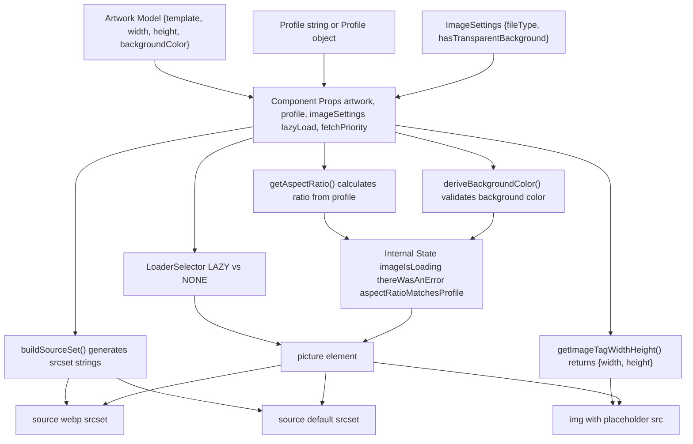
**来源：** [shared/components/src/components/Artwork/Artwork.svelte1-293](https://github.com/Chesszyh/apps.apple.com/blob/279d0c4d/shared/components/src/components/Artwork/Artwork.svelte#L1-L293)

### 数据流 (Data Flow)

> **[Mermaid sequence]**
> *(图表结构无法解析)*

**来源：** [shared/components/src/components/Artwork/Artwork.svelte112-166](https://github.com/Chesszyh/apps.apple.com/blob/279d0c4d/shared/components/src/components/Artwork/Artwork.svelte#L112-L166) [shared/components/src/components/Artwork/Artwork.svelte231-251](https://github.com/Chesszyh/apps.apple.com/blob/279d0c4d/shared/components/src/components/Artwork/Artwork.svelte#L231-L251)

---

## 配置文件系统 (Profile System)

### 配置文件解析与视口检测 (Profile Resolution and Viewport Detection)

配置文件定义了视口特定的尺寸和艺术资产的长宽比。配置文件可以是一个字符串名称（引用预定义的配置文件），也可以是一个带有视口特定配置的 `Profile` 对象。

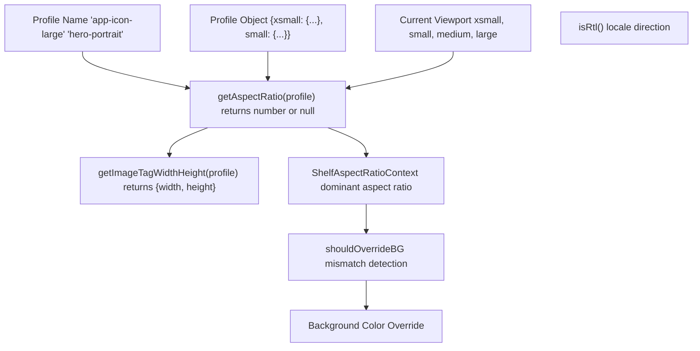
**来源：** [shared/components/src/components/Artwork/Artwork.svelte38-40](https://github.com/Chesszyh/apps.apple.com/blob/279d0c4d/shared/components/src/components/Artwork/Artwork.svelte#L38-L40) [shared/components/src/components/Artwork/Artwork.svelte138-139](https://github.com/Chesszyh/apps.apple.com/blob/279d0c4d/shared/components/src/components/Artwork/Artwork.svelte#L138-L139)

### 货架长宽比上下文 (Shelf Aspect Ratio Context)

`Artwork` 组件集成了 `ShelfAspectRatioContext`，用于检测图像的自然长宽比何时与货架的主导长宽比不符，从而实现自动背景颜色修正。

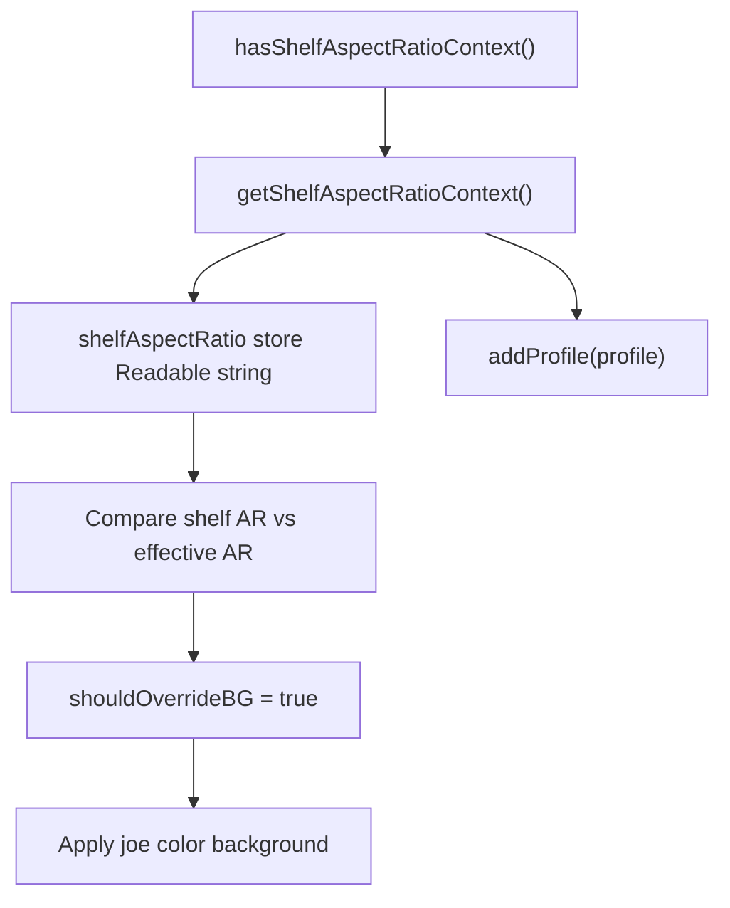
**来源：** [shared/components/src/components/Artwork/Artwork.svelte104-110](https://github.com/Chesszyh/apps.apple.com/blob/279d0c4d/shared/components/src/components/Artwork/Artwork.svelte#L104-L110) [shared/components/src/components/Artwork/Artwork.svelte207-229](https://github.com/Chesszyh/apps.apple.com/blob/279d0c4d/shared/components/src/components/Artwork/Artwork.svelte#L207-L229)

---

## 图像生成与源集合 (Image Generation and Source Sets)

### buildSourceSet 函数 (buildSourceSet Function)

`buildSourceSet` 函数生成具有多种尺寸和格式的响应式图像 URL。它根据配置文件和视口将模板占位符替换为实际尺寸。

| 参数 | 类型 | 用途 |
| --- | --- | --- |
| `artwork` | `Artwork` | 包含模板 URL、宽度、高度、背景颜色 |
| `imageSettings` | `ImageSettings` | 文件类型 (jpg, png, webp)，是否具有透明背景 |
| `profile` | `Profile | string` | 视口特定的尺寸 |
| `chinConfig` | `ChinConfig | undefined` | TV 下巴 (chin) 配置 |

**输出：** 类似于 `"url 1x, url 2x, url 3x"` 的 srcset 字符串

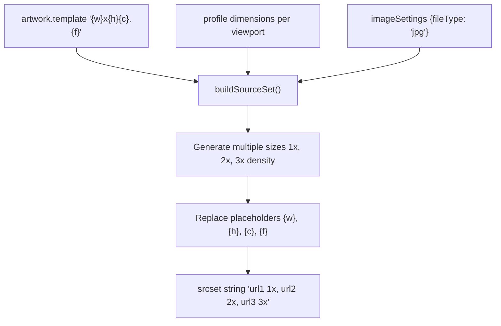
**来源：** [shared/components/src/components/Artwork/Artwork.svelte128-137](https://github.com/Chesszyh/apps.apple.com/blob/279d0c4d/shared/components/src/components/Artwork/Artwork.svelte#L128-L137)

### WebP 支持 (WebP Support)

该组件会自动生成 WebP 和回退格式的源集合，以获得最佳性能和兼容性。

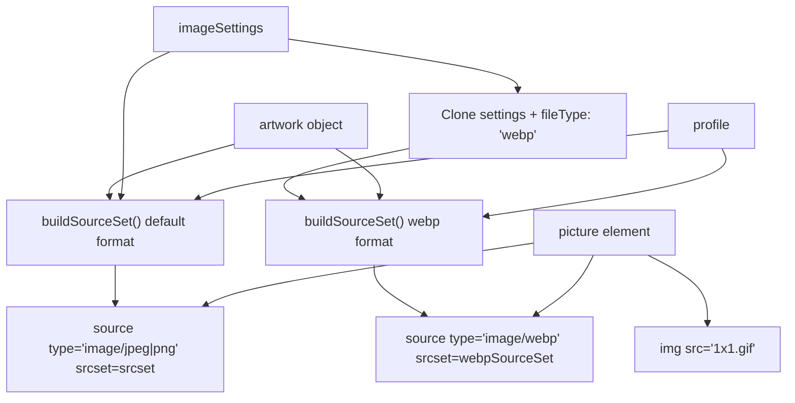
**来源：** [shared/components/src/components/Artwork/Artwork.svelte128-137](https://github.com/Chesszyh/apps.apple.com/blob/279d0c4d/shared/components/src/components/Artwork/Artwork.svelte#L128-L137) [shared/components/src/components/Artwork/Artwork.svelte334-359](https://github.com/Chesszyh/apps.apple.com/blob/279d0c4d/shared/components/src/components/Artwork/Artwork.svelte#L334-L359)

### getImageSizes 函数 (getImageSizes Function)

`sizes` 属性告诉浏览器图像在不同视口下的大小，从而能够从 srcset 中进行最佳图像选择。

**来源：** [shared/components/src/components/Artwork/Artwork.svelte166](https://github.com/Chesszyh/apps.apple.com/blob/279d0c4d/shared/components/src/components/Artwork/Artwork.svelte#L166-L166)

---

## 加载策略 (Loading Strategies)

### 使用 IntersectionObserver 进行懒加载 (Lazy Loading with IntersectionObserver)

默认情况下，图像使用集成了 `IntersectionObserver` 的 `LoaderSelector` 组件进行懒加载。图像仅在进入视口时才进行渲染。

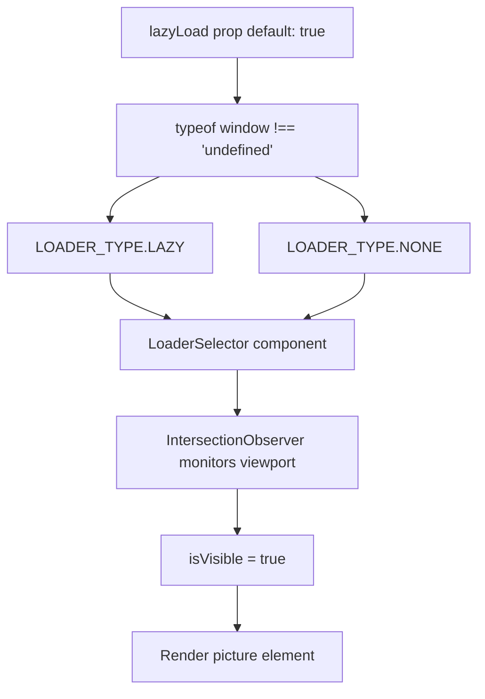
**来源：** [shared/components/src/components/Artwork/Artwork.svelte55-56](https://github.com/Chesszyh/apps.apple.com/blob/279d0c4d/shared/components/src/components/Artwork/Artwork.svelte#L55-L56) [shared/components/src/components/Artwork/Artwork.svelte161-164](https://github.com/Chesszyh/apps.apple.com/blob/279d0c4d/shared/components/src/components/Artwork/Artwork.svelte#L161-L164) [shared/components/src/components/Artwork/Artwork.svelte332-361](https://github.com/Chesszyh/apps.apple.com/blob/279d0c4d/shared/components/src/components/Artwork/Artwork.svelte#L332-L361)

### 针对 LCP 优化的预加载 (Eager Loading for LCP Optimization)

对于首屏 (above-the-fold) 图像（特别是最大内容渲染 LCP 的候选者），请设置 `lazyLoad={false}` 和 `fetchPriority="high"`。

| 属性 (Prop) | 类型 | 默认值 | 用途 |
| --- | --- | --- | --- |
| `lazyLoad` | `boolean` | `true` | 控制懒加载行为 |
| `fetchPriority` | `'high' | 'auto' | 'low'` | `'auto'` | 浏览器获取优先级提示 |

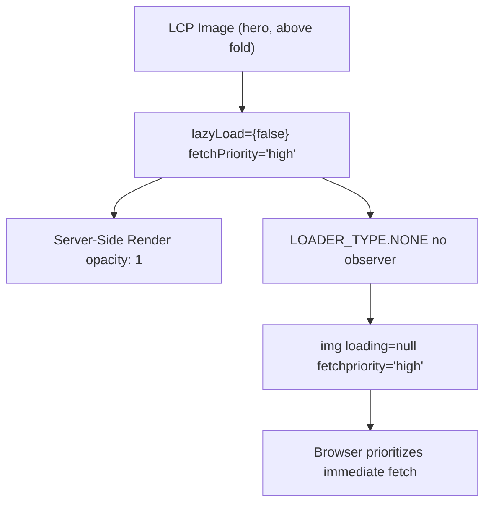
**来源：** [shared/components/src/components/Artwork/Artwork.svelte54-60](https://github.com/Chesszyh/apps.apple.com/blob/279d0c4d/shared/components/src/components/Artwork/Artwork.svelte#L54-L60) [shared/components/src/components/Artwork/Artwork.svelte159-164](https://github.com/Chesszyh/apps.apple.com/blob/279d0c4d/shared/components/src/components/Artwork/Artwork.svelte#L159-L164) [shared/components/src/components/Artwork/Artwork.svelte355](https://github.com/Chesszyh/apps.apple.com/blob/279d0c4d/shared/components/src/components/Artwork/Artwork.svelte#L355-L355)

### SSR 透明度处理 (SSR Opacity Handling)

在服务器端渲染期间，图像以 `opacity: 1` 进行渲染，以确保它们在 JavaScript 加载之前显示。

**来源：** [shared/components/src/components/Artwork/Artwork.svelte157-159](https://github.com/Chesszyh/apps.apple.com/blob/279d0c4d/shared/components/src/components/Artwork/Artwork.svelte#L157-L159)

---

## 长宽比管理 (Aspect Ratio Management)

### 长宽比计算与下巴支持 (Aspect Ratio Calculation and Chin Support)

`getAspectRatio` 函数根据配置文件计算长宽比。有效长宽比会计入 `chinConfig` 高度（如果存在）（用于 TV 应用程序下巴效果）。

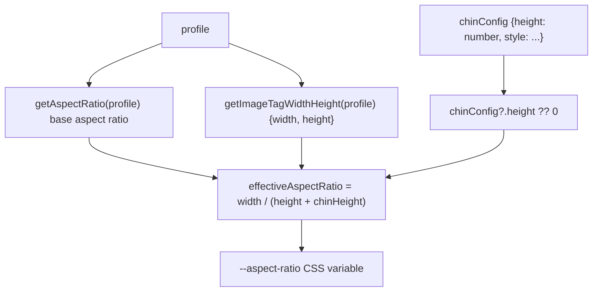
**来源：** [shared/components/src/components/Artwork/Artwork.svelte138-155](https://github.com/Chesszyh/apps.apple.com/blob/279d0c4d/shared/components/src/components/Artwork/Artwork.svelte#L138-L155) [shared/components/src/components/Artwork/Artwork.svelte74-79](https://github.com/Chesszyh/apps.apple.com/blob/279d0c4d/shared/components/src/components/Artwork/Artwork.svelte#L74-L79)

### 长宽比不匹配检测 (Aspect Ratio Mismatch Detection)

该组件会检测图像的自然长宽比何时与配置文件的预期比例不符，并应用校正样式。

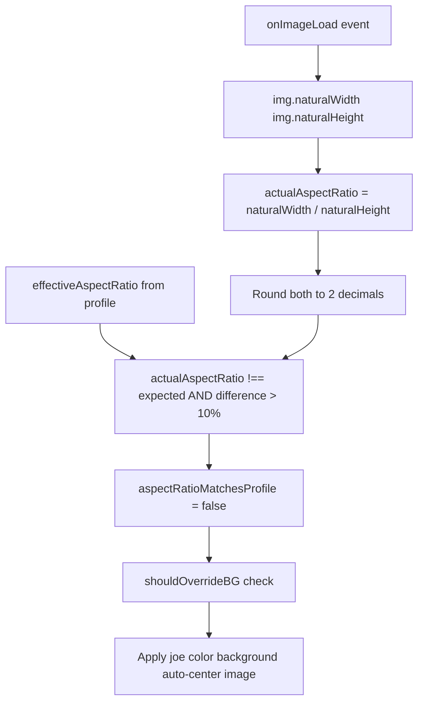
**来源：** [shared/components/src/components/Artwork/Artwork.svelte231-251](https://github.com/Chesszyh/apps.apple.com/blob/279d0c4d/shared/components/src/components/Artwork/Artwork.svelte#L231-L251) [shared/components/src/components/Artwork/Artwork.svelte205-229](https://github.com/Chesszyh/apps.apple.com/blob/279d0c4d/shared/components/src/components/Artwork/Artwork.svelte#L205-L229)

### shouldOverrideBG 逻辑 (shouldOverrideBG Logic)

确定在长宽比不匹配时是否应用 joe color 背景。

**覆盖条件：**

1.  货架长宽比上下文存在 且 货架 AR ≠ 有效 AR
2.  或者 `aspectRatioMatchesProfile === false`

**来源：** [shared/components/src/components/Artwork/Artwork.svelte212-229](https://github.com/Chesszyh/apps.apple.com/blob/279d0c4d/shared/components/src/components/Artwork/Artwork.svelte#L212-L229)

---

## 背景颜色处理 (Background Color Handling)

### 背景颜色派生 (Background Color Derivation)

`deriveBackgroundColor` 函数对来自 API 的艺术资产背景颜色进行验证和处理。

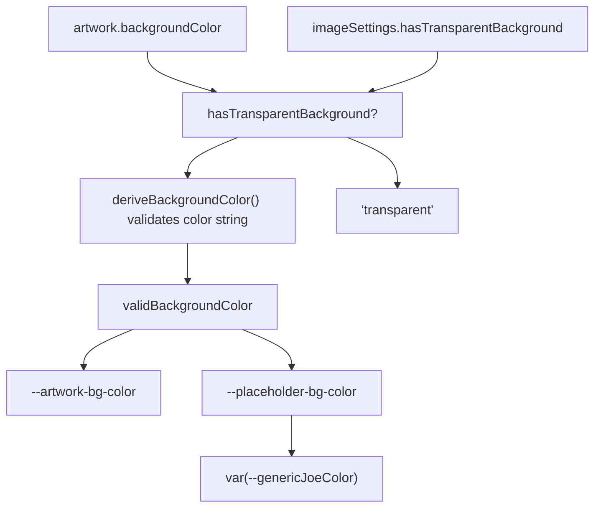
**来源：** [shared/components/src/components/Artwork/Artwork.svelte117-126](https://github.com/Chesszyh/apps.apple.com/blob/279d0c4d/shared/components/src/components/Artwork/Artwork.svelte#L117-L126) [shared/components/src/components/Artwork/Artwork.svelte168-194](https://github.com/Chesszyh/apps.apple.com/blob/279d0c4d/shared/components/src/components/Artwork/Artwork.svelte#L168-L194)

### Joe Color 回退系统 (Joe Color Fallback System)

当背景颜色数据不可用或长宽比不匹配时，组件会回退到 "joe color"（支持亮色/暗黑模式的通用背景颜色）。

**CSS 变量：**

-   `--artwork-bg-color`：来自艺术资产数据的原始背景颜色
-   `--placeholder-bg-color`：加载期间或发生错误时的背景颜色
-   `--genericJoeColor`：具有自动亮色/暗黑模式支持的系统级回退颜色

**来源：** [shared/components/src/components/Artwork/Artwork.svelte176-193](https://github.com/Chesszyh/apps.apple.com/blob/279d0c4d/shared/components/src/components/Artwork/Artwork.svelte#L176-L193) [shared/components/src/components/Artwork/Artwork.svelte398-401](https://github.com/Chesszyh/apps.apple.com/blob/279d0c4d/shared/components/src/components/Artwork/Artwork.svelte#L398-L401)

### 暗黑模式 Joe Color (Dark Mode Joe Color)

当背景颜色为 `#ebebeb`（亮色模式 joe color）时，组件会自动为暗黑模式调整 joe color。

**来源：** [shared/components/src/components/Artwork/Artwork.svelte487-492](https://github.com/Chesszyh/apps.apple.com/blob/279d0c4d/shared/components/src/components/Artwork/Artwork.svelte#L487-L492)

---

## 高级特性 (Advanced Features)

### 针对 TV 平台的 ChinConfig (ChinConfig for TV Platform)

`chinConfig` 属性支持在艺术资产下方实现 TV 风格的阴影效果，主要用于 Vision 平台的显示。

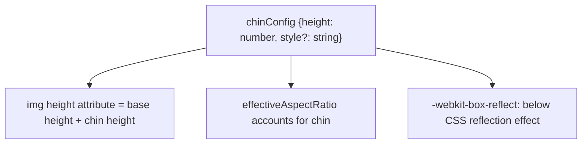
**ChinConfig 示例：**

```
{  height: 40,  style: 'shadow'}
```
**来源：** [shared/components/src/components/Artwork/Artwork.svelte74-79](https://github.com/Chesszyh/apps.apple.com/blob/279d0c4d/shared/components/src/components/Artwork/Artwork.svelte#L74-L79) [shared/components/src/components/Artwork/Artwork.svelte142-155](https://github.com/Chesszyh/apps.apple.com/blob/279d0c4d/shared/components/src/components/Artwork/Artwork.svelte#L142-L155) [shared/components/src/components/Artwork/Artwork.svelte352-354](https://github.com/Chesszyh/apps.apple.com/blob/279d0c4d/shared/components/src/components/Artwork/Artwork.svelte#L352-L354)

### 边框渲染 (Border Rendering)

边框根据背景透明度和 `withoutBorder` 属性有条件地进行渲染。

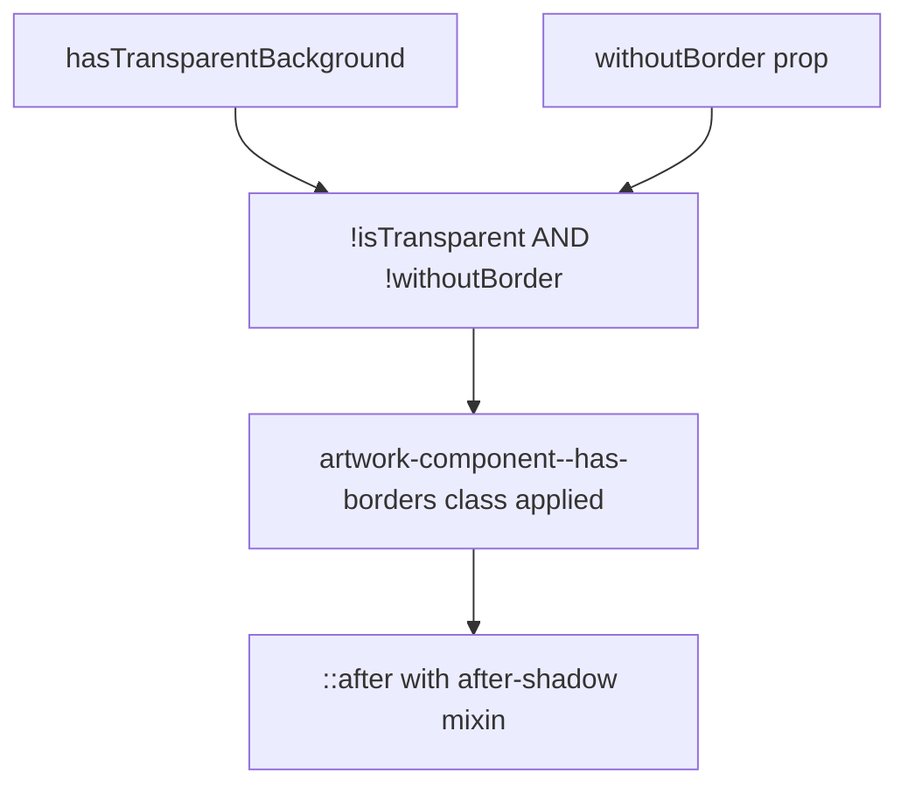
**来源：** [shared/components/src/components/Artwork/Artwork.svelte101-102](https://github.com/Chesszyh/apps.apple.com/blob/279d0c4d/shared/components/src/components/Artwork/Artwork.svelte#L101-L102) [shared/components/src/components/Artwork/Artwork.svelte310-311](https://github.com/Chesszyh/apps.apple.com/blob/279d0c4d/shared/components/src/components/Artwork/Artwork.svelte#L310-L311) [shared/components/src/components/Artwork/Artwork.svelte404-408](https://github.com/Chesszyh/apps.apple.com/blob/279d0c4d/shared/components/src/components/Artwork/Artwork.svelte#L404-L408)

### 容器样式与自动居中 (Container Styling and Auto-Centering)

`useContainerStyle` 属性应用标准的容器样式（圆角、阴影）。当长宽比不匹配时，自动居中功能会激活。

| 属性 (Prop) | 默认值 | 用途 |
| --- | --- | --- |
| `useContainerStyle` | `true` | 应用标准的容器圆角和阴影 |
| `disableAutoCenter` | `false` | 为比例不匹配的图像禁用自动居中 |
| `forceFullWidth` | `true` | 强制 100% 宽度（响应式默认值） |

**来源：** [shared/components/src/components/Artwork/Artwork.svelte65-88](https://github.com/Chesszyh/apps.apple.com/blob/279d0c4d/shared/components/src/components/Artwork/Artwork.svelte#L65-L88) [shared/components/src/components/Artwork/Artwork.svelte307-309](https://github.com/Chesszyh/apps.apple.com/blob/279d0c4d/shared/components/src/components/Artwork/Artwork.svelte#L307-L309) [shared/components/src/components/Artwork/Artwork.svelte410-416](https://github.com/Chesszyh/apps.apple.com/blob/279d0c4d/shared/components/src/components/Artwork/Artwork.svelte#L410-L416)

### RTL 支持与货架 V 形锚定 (RTL Support and Shelf Chevron Anchoring)

`noShelfChevronAnchor` 属性防止为货架导航 V 形 (chevron) 图标设置 CSS 锚点定位，这在单个锁定中存在多个图像时非常有用。

**来源：** [shared/components/src/components/Artwork/Artwork.svelte68-72](https://github.com/Chesszyh/apps.apple.com/blob/279d0c4d/shared/components/src/components/Artwork/Artwork.svelte#L68-L72) [shared/components/src/components/Artwork/Artwork.svelte312](https://github.com/Chesszyh/apps.apple.com/blob/279d0c4d/shared/components/src/components/Artwork/Artwork.svelte#L312-L312)

### 顶部圆角辅助样式 (Top Rounded Secondary Style)

`topRoundedSecondary` 属性仅对艺术资产顶部应用圆角，用于特定的锁定布局。

**来源：** [shared/components/src/components/Artwork/Artwork.svelte47-50](https://github.com/Chesszyh/apps.apple.com/blob/279d0c4d/shared/components/src/components/Artwork/Artwork.svelte#L47-L50) [shared/components/src/components/Artwork/Artwork.svelte306](https://github.com/Chesszyh/apps.apple.com/blob/279d0c4d/shared/components/src/components/Artwork/Artwork.svelte#L306-L306) [shared/components/src/components/Artwork/Artwork.svelte420-458](https://github.com/Chesszyh/apps.apple.com/blob/279d0c4d/shared/components/src/components/Artwork/Artwork.svelte#L420-L458)

---

## 组件集成示例 (Component Integration Examples)

### 在 SmallBreakoutItem 中的用法 (Usage in SmallBreakoutItem)

SmallBreakoutItem 使用 `AppIcon`（包装了 Artwork），并带有固定的配置文件，以获得一致的图标尺寸。

**来源：** [src/components/jet/item/SmallBreakoutItem.svelte28-35](https://github.com/Chesszyh/apps.apple.com/blob/279d0c4d/src/components/jet/item/SmallBreakoutItem.svelte#L28-L35)

### 在 LargeHeroBreakoutItem 中的用法 (Usage in LargeHeroBreakoutItem)

LargeHeroBreakoutItem 演示了根据视口和 RTL 艺术资产支持进行的动态配置文件选择。

**来源：** [src/components/jet/item/LargeHeroBreakoutItem.svelte24-66](https://github.com/Chesszyh/apps.apple.com/blob/279d0c4d/src/components/jet/item/LargeHeroBreakoutItem.svelte#L24-L66)

---

## 错误处理与加载状态 (Error Handling and Loading States)

### 状态管理 (State Management)

组件管理三个主要状态：

| 状态 | 初始值 | 用途 |
| --- | --- | --- |
| `imageIsLoading` | `!!template` | 下载图像时为 true |
| `thereWasAnError` | `!artwork` | 艺术资产数据缺失或加载失败时为 true |
| `aspectRatioMatchesProfile` | `true` | 自然 AR 与配置文件不同时为 false |

**来源：** [shared/components/src/components/Artwork/Artwork.svelte112-116](https://github.com/Chesszyh/apps.apple.com/blob/279d0c4d/shared/components/src/components/Artwork/Artwork.svelte#L112-L116) [shared/components/src/components/Artwork/Artwork.svelte231-268](https://github.com/Chesszyh/apps.apple.com/blob/279d0c4d/shared/components/src/components/Artwork/Artwork.svelte#L231-L268) [shared/components/src/components/Artwork/Artwork.svelte317-331](https://github.com/Chesszyh/apps.apple.com/blob/279d0c4d/shared/components/src/components/Artwork/Artwork.svelte#L317-L331)

### 插槽系统 (Slot System)

组件为自定义加载和错误状态提供了插槽：

-   `loading-component`：在 `imageIsLoading === true` 时显示
-   `placeholder-component`：在 `thereWasAnError === true` 时显示

**来源：** [shared/components/src/components/Artwork/Artwork.svelte317-331](https://github.com/Chesszyh/apps.apple.com/blob/279d0c4d/shared/components/src/components/Artwork/Artwork.svelte#L317-L331)

---

## 过渡与动画 (Transition and Animation)

### 透明度过渡 (Opacity Transition)

图像加载时会随 CSS 过渡效果淡入，由 opacity 样式控制。

**来源：** [shared/components/src/components/Artwork/Artwork.svelte159](https://github.com/Chesszyh/apps.apple.com/blob/279d0c4d/shared/components/src/components/Artwork/Artwork.svelte#L159-L159) [shared/components/src/components/Artwork/Artwork.svelte253-263](https://github.com/Chesszyh/apps.apple.com/blob/279d0c4d/shared/components/src/components/Artwork/Artwork.svelte#L253-L263) [shared/components/src/components/Artwork/Artwork.svelte347](https://github.com/Chesszyh/apps.apple.com/blob/279d0c4d/shared/components/src/components/Artwork/Artwork.svelte#L347-L347)

---

## 预连接优化 (Preconnect Optimization)

组件追踪艺术资产模板 URL，并可以触发 DNS 预连接以实现性能优化。

**来源：** [shared/components/src/components/Artwork/Artwork.svelte20](https://github.com/Chesszyh/apps.apple.com/blob/279d0c4d/shared/components/src/components/Artwork/Artwork.svelte#L20-L20) [shared/components/src/components/Artwork/Artwork.svelte196-198](https://github.com/Chesszyh/apps.apple.com/blob/279d0c4d/shared/components/src/components/Artwork/Artwork.svelte#L196-L198)

---

## CSS 架构 (CSS Architecture)

### CSS 自定义属性 (CSS Custom Properties)

该组件暴露了广泛的 CSS 变量用于自定义：

| 变量 | 默认值 | 用途 |
| --- | --- | --- |
| `--artwork-override-width` | `100%` | 覆盖图像宽度 |
| `--artwork-override-height` | `auto` | 覆盖图像高度 |
| `--artwork-override-max-width` | `none` | 最大宽度约束 |
| `--artwork-override-min-width` | `0` | 最小宽度约束 |
| `--artwork-bg-color` | \- | 艺术资产背景颜色 |
| `--placeholder-bg-color` | `var(--genericJoeColor)` | 加载/错误背景 |
| `--aspect-ratio` | 计算所得 | 占位符的长宽比 |
| `--shelf-aspect-ratio` | \- | 来自货架上下文的覆盖值 |

**来源：** [shared/components/src/components/Artwork/Artwork.svelte387-402](https://github.com/Chesszyh/apps.apple.com/blob/279d0c4d/shared/components/src/components/Artwork/Artwork.svelte#L387-L402) [shared/components/src/components/Artwork/Artwork.svelte467-476](https://github.com/Chesszyh/apps.apple.com/blob/279d0c4d/shared/components/src/components/Artwork/Artwork.svelte#L467-L476)

### 响应式 CSS 类 (Responsive CSS Classes)

根据组件状态应用的动态类：

-   `artwork-component--aspect-ratio`：基础长宽比处理
-   `artwork-component--downloaded`：图像已完全下载并完成过渡
-   `artwork-component--error`：错误状态激活
-   `artwork-component--fullwidth`：100% 宽度模式
-   `artwork-component--auto-center`：自动居中激活
-   `artwork-component--bg-override`：AR 不匹配时的背景覆盖
-   `artwork-component--has-borders`：边框渲染启用
-   `artwork-component--orientation-{square|landscape|portrait}`：图像方向

**来源：** [shared/components/src/components/Artwork/Artwork.svelte295-315](https://github.com/Chesszyh/apps.apple.com/blob/279d0c4d/shared/components/src/components/Artwork/Artwork.svelte#L295-L315)

---

## TypeScript 接口 (TypeScript Interfaces)

### Artwork 类型

```
{  template: string,      // 带有占位符的 URL 模板  width: number,         // 原始宽度  height: number,        // 原始高度  backgroundColor: string // 十六进制颜色或 RGB 对象}
```
### ImageSettings 类型

```
{  fileType?: 'jpg' | 'png' | 'webp',  hasTransparentBackground?: boolean}
```
### Profile 类型

可以是字符串（配置文件名称），也可以是带有视口特定配置的对象。

### ChinConfig 类型

```
{  height: number,        // 以下巴为单位的像素高度  style?: string         // 可选样式变体}
```
**来源：** [shared/components/src/components/Artwork/Artwork.svelte14](https://github.com/Chesszyh/apps.apple.com/blob/279d0c4d/shared/components/src/components/Artwork/Artwork.svelte#L14-L14)
