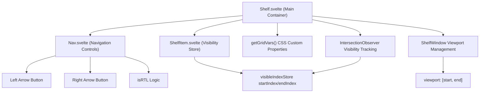
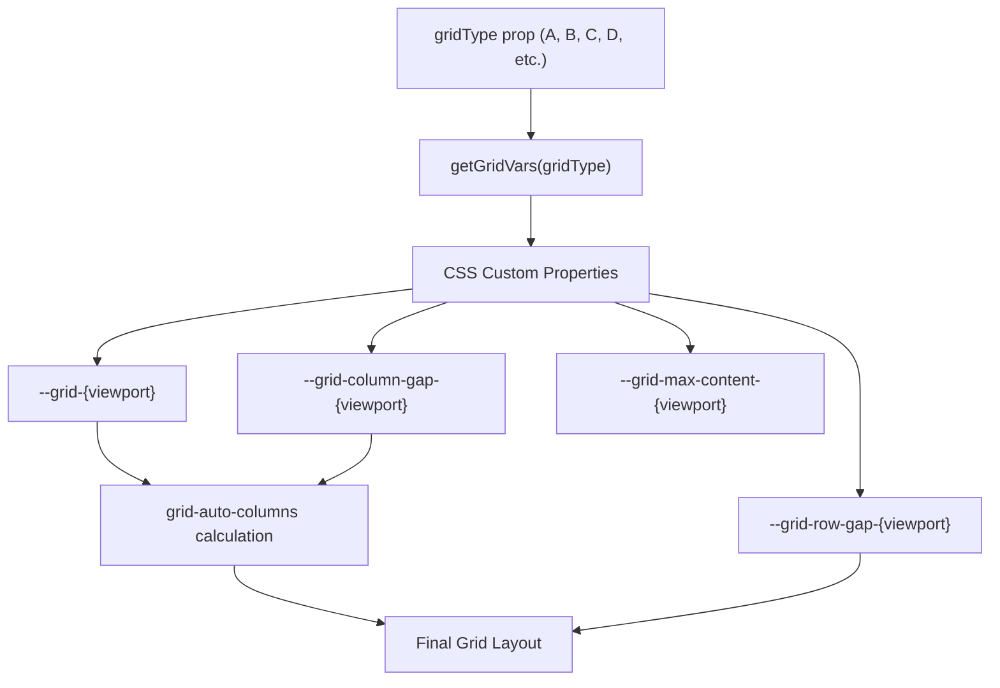
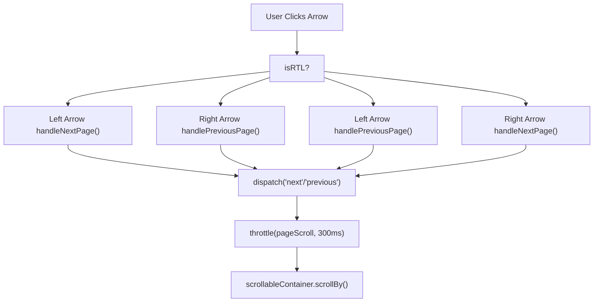
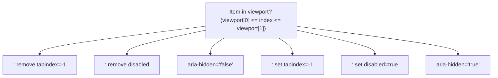
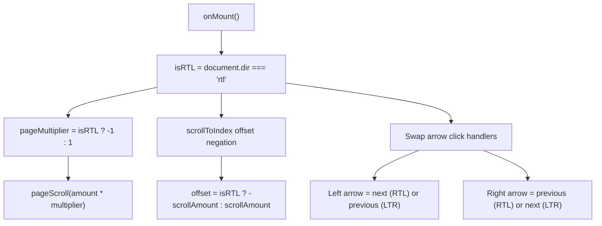
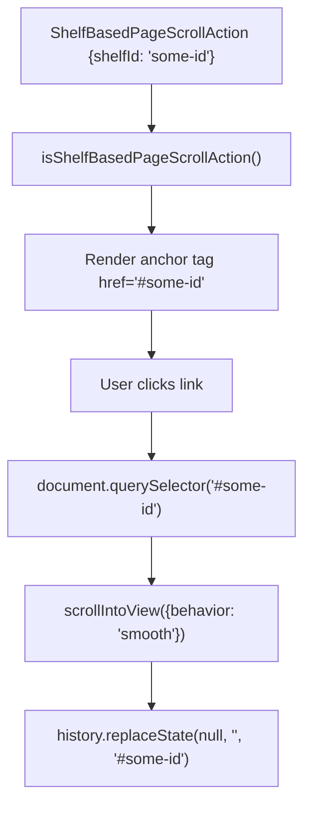

# 可滚动货架 (Scrollable Shelves)

-   [shared/components/src/components/Shelf/Nav.svelte](https://github.com/Chesszyh/apps.apple.com/blob/279d0c4d/shared/components/src/components/Shelf/Nav.svelte)
-   [shared/components/src/components/Shelf/Shelf.svelte](https://github.com/Chesszyh/apps.apple.com/blob/279d0c4d/shared/components/src/components/Shelf/Shelf.svelte)
-   [src/components/jet/action/ShelfBasedPageScrollAction.svelte](https://github.com/Chesszyh/apps.apple.com/blob/279d0c4d/src/components/jet/action/ShelfBasedPageScrollAction.svelte)

## 目的与范围 (Purpose and Scope)

本文档涵盖了通用的 `Shelf` 组件系统，该系统提供了用于显示项目集合的水平滚动功能。该货架组件实现了基于网格的布局，并具有分页控制、懒加载渲染和无障碍特性。

有关特定货架类型及其渲染逻辑的信息，请参阅 [Shelf System](#4.2)。有关提供一致间距和标题的包装器，请参阅 [Shelf Wrapper and Common Layout](#4.4)。有关通常出现在货架中的内容卡片组件，请参阅 [Content Cards](#5.3) 和 [Lockup Components](#5.5)。

---

## 组件架构 (Component Architecture)

可滚动货架系统由三个主要组件组成，它们协同工作以提供水平滚动功能：


**来源：**

-   [shared/components/src/components/Shelf/Shelf.svelte1-398](https://github.com/Chesszyh/apps.apple.com/blob/279d0c4d/shared/components/src/components/Shelf/Shelf.svelte#L1-L398)
-   [shared/components/src/components/Shelf/Nav.svelte1-200](https://github.com/Chesszyh/apps.apple.com/blob/279d0c4d/shared/components/src/components/Shelf/Nav.svelte#L1-L200)

---

## 属性 (Props) 与配置 (Configuration)

`Shelf` 组件通过属性接受广泛的配置，以控制布局、滚动行为和渲染：

| 属性 (Prop) | 类型 | 描述 |
| --- | --- | --- |
| `items` | `T[]` | 要在货架中显示的泛型项目数组 |
| `gridType` | `GridType` | 确定各视口的列数和尺寸 |
| `gridRows` | `number` | 网格中的行数（默认值：1） |
| `arrowOffset` | `ArrowOffset | null` | 导航箭头的自定义垂直定位 |
| `alignItems` | `boolean` | 是否将项目底部对齐（默认值：false） |
| `stackXSItems` | `boolean` | 在超小 (extra-small) 视口上垂直堆叠项目 |
| `overflowBleedBottom` | `string` | 底部溢出渗出 (bleed) 的自定义 CSS 值 |
| `aspectRatioOverride` | `AspectRatioOverrideConfig` | 覆盖货架上下文的长宽比 |
| `getItemIdentifier` | `function` | 用于生成唯一项目键的自定义函数 |
| `pageScrollMultiplier` | `number` | 分页滚动距离的乘数 |
| `onIntersectionUpdate` | `function` | 带有可见项目索引 `[start, end]` 的回调函数 |
| `firstItemIndex` | `number` | 初始滚动位置（默认值：0） |
| `translateFn` | `function` | 用于本地化字符串的翻译函数 |

**来源：**

-   [shared/components/src/components/Shelf/Shelf.svelte25-56](https://github.com/Chesszyh/apps.apple.com/blob/279d0c4d/shared/components/src/components/Shelf/Shelf.svelte#L25-L56)

---

## 网格系统与布局 (Grid System and Layout)

`Shelf` 组件使用基于 CSS Grid 的布局系统，其中网格配置由 `gridType` 属性决定。网格变量作为 CSS 自定义属性注入：


网格计算根据视口大小和抽屉 (drawer) 状态进行动态调整：

| 视口 | 基础行为 | 抽屉调整 |
| --- | --- | --- |
| xsmall | 使用 `--grid-xsmall` 列 | 无调整 |
| small | 使用 `--grid-small` 列 | 无调整 |
| medium | 使用 `--grid-medium` 列 | 抽屉打开时减去 1 列 |
| large | 使用 `--grid-large` 列 | 抽屉打开时减去 1 列 |
| xlarge | 使用 `--grid-xlarge` 列 | 无调整 |

网格类型 H 具有特殊处理，在 medium/large 视口下抽屉打开时减去 2 列。

**来源：**

-   [shared/components/src/components/Shelf/Shelf.svelte4](https://github.com/Chesszyh/apps.apple.com/blob/279d0c4d/shared/components/src/components/Shelf/Shelf.svelte#L4-L4)
-   [shared/components/src/components/Shelf/Shelf.svelte108-127](https://github.com/Chesszyh/apps.apple.com/blob/279d0c4d/shared/components/src/components/Shelf/Shelf.svelte#L108-L127)
-   [shared/components/src/components/Shelf/Shelf.svelte409-471](https://github.com/Chesszyh/apps.apple.com/blob/279d0c4d/shared/components/src/components/Shelf/Shelf.svelte#L409-L471)

---

## 滚动与导航系统 (Scrolling and Navigation System)

### 分页控件 (Pagination Controls)

货架提供左右箭头导航用于内容分页。`Nav` 组件管理这些具有 RTL 感知能力的控件：


分页滚动距离基于容器宽度计算：

```
scrollAmount = (containerWidth + GRID_COLUMN_GAP - SHADOW_OFFSET * 2) * pageMultiplier
```
其中：

-   `GRID_COLUMN_GAP_DEFAULT` = 项目之间的列间距
-   `STANDARD_LOCKUP_SHADOW_OFFSET` = 15px（计入锁定阴影）
-   `pageMultiplier` = 在 RTL 模式下为负值

**来源：**

-   [shared/components/src/components/Shelf/Shelf.svelte234-255](https://github.com/Chesszyh/apps.apple.com/blob/279d0c4d/shared/components/src/components/Shelf/Shelf.svelte#L234-L255)
-   [shared/components/src/components/Shelf/Shelf.svelte99](https://github.com/Chesszyh/apps.apple.com/blob/279d0c4d/shared/components/src/components/Shelf/Shelf.svelte#L99-L99)
-   [shared/components/src/components/Shelf/Nav.svelte48-72](https://github.com/Chesszyh/apps.apple.com/blob/279d0c4d/shared/components/src/components/Shelf/Nav.svelte#L48-L72)

### 箭头定位 (Arrow Positioning)

导航箭头使用 CSS 锚点定位垂直居中（针对不支持的浏览器有回退方案）：

**现代浏览器（锚点定位）：**

```
top: anchor(--shelf-first-artwork center, 50%);
```
锚点 `--shelf-first-artwork` 设置在单行货架的第一个艺术资产组件上。

**回退方案：**

```
transform: translateY(calc(-50% + var(--offset)));
```
其中 `--offset` 计入了货架页眉高度或自定义 `arrowOffset` 属性值。

**来源：**

-   [shared/components/src/components/Shelf/Nav.svelte100-145](https://github.com/Chesszyh/apps.apple.com/blob/279d0c4d/shared/components/src/components/Shelf/Nav.svelte#L100-L145)
-   [shared/components/src/components/Shelf/Shelf.svelte34](https://github.com/Chesszyh/apps.apple.com/blob/279d0c4d/shared/components/src/components/Shelf/Shelf.svelte#L34-L34)
-   [shared/components/src/components/Shelf/Shelf.svelte473-483](https://github.com/Chesszyh/apps.apple.com/blob/279d0c4d/shared/components/src/components/Shelf/Shelf.svelte#L473-L483)

---

## 动态渲染与可见性追踪 (Dynamic Rendering and Visibility Tracking)

货架实现了一套先进的懒加载渲染系统，使用 `IntersectionObserver` 仅渲染可见项目加上缓冲区：

> **[Mermaid sequence]**
> *(图表结构无法解析)*

### 可见性 Store (Visibility Store)

`visibleIndexStore` 维护要渲染的项目范围：

```
{  startIndex: number,  // 当前始终为 0  endIndex: number     // 随着用户滚动动态更新}
```
初始渲染显示：

```
initalVisibleGridItems = getMaxVisibleItems(gridType) * gridRows
```
随着项目发生交叉，`endIndex` 会扩展 `EXTRA_ITEMS` (2 \* gridRows) 以预加载屏幕外内容。

**来源：**

-   [shared/components/src/components/Shelf/Shelf.svelte139-193](https://github.com/Chesszyh/apps.apple.com/blob/279d0c4d/shared/components/src/components/Shelf/Shelf.svelte#L139-L193)
-   [shared/components/src/components/Shelf/Shelf.svelte144-193](https://github.com/Chesszyh/apps.apple.com/blob/279d0c4d/shared/components/src/components/Shelf/Shelf.svelte#L144-L193)
-   [shared/components/src/components/Shelf/Shelf.svelte18](https://github.com/Chesszyh/apps.apple.com/blob/279d0c4d/shared/components/src/components/Shelf/Shelf.svelte#L18-L18)

### 视口追踪 (Viewport Tracking)

`ShelfWindow` 工具追踪当前可见的项目范围，并通过 `onIntersectionUpdate` 回调提供视口索引：

**来源：**

-   [shared/components/src/components/Shelf/Shelf.svelte49-50](https://github.com/Chesszyh/apps.apple.com/blob/279d0c4d/shared/components/src/components/Shelf/Shelf.svelte#L49-L50)
-   [shared/components/src/components/Shelf/Shelf.svelte186-190](https://github.com/Chesszyh/apps.apple.com/blob/279d0c4d/shared/components/src/components/Shelf/Shelf.svelte#L186-L190)
-   [shared/components/src/components/Shelf/Shelf.svelte6](https://github.com/Chesszyh/apps.apple.com/blob/279d0c4d/shared/components/src/components/Shelf/Shelf.svelte#L6-L6)

---

## 无障碍实现 (Accessibility Implementation)

货架组件实现了全面的无障碍特性：

### Tab 键顺序管理 (Tab Order Management)

位于可见视口之外的项目会禁用其交互元素，以防止 Tab 键导航到屏幕外内容：


`setShelfItemInteractivity` 函数查询每个货架项目内的所有 `<a>` 和 `<button>` 元素，并切换它们的交互状态。

**来源：**

-   [shared/components/src/components/Shelf/Shelf.svelte282-305](https://github.com/Chesszyh/apps.apple.com/blob/279d0c4d/shared/components/src/components/Shelf/Shelf.svelte#L282-L305)
-   [shared/components/src/components/Shelf/Shelf.svelte367-378](https://github.com/Chesszyh/apps.apple.com/blob/279d0c4d/shared/components/src/components/Shelf/Shelf.svelte#L367-L378)

### ARIA 属性 (ARIA Attributes)

货架结构包含了语义化的 ARIA 角色：

```
<ul role="list" tabindex="-1">  <li aria-hidden="true|false">    <!-- 内容 -->  </li></ul>
```
`<ul>` 上的 `tabindex="-1"` 防止 Firefox 将可滚动容器添加到 Tab 键顺序中，这会干扰屏幕阅读器的朗读。

**来源：**

-   [shared/components/src/components/Shelf/Shelf.svelte324-340](https://github.com/Chesszyh/apps.apple.com/blob/279d0c4d/shared/components/src/components/Shelf/Shelf.svelte#L324-L340)
-   [shared/components/src/components/Shelf/Shelf.svelte351-362](https://github.com/Chesszyh/apps.apple.com/blob/279d0c4d/shared/components/src/components/Shelf/Shelf.svelte#L351-L362)

### 导航标签 (Navigation Labels)

箭头按钮通过 `translateFn` 属性接收本地化的 `aria-label` 属性：

| 方向 | 翻译键 | 典型值 |
| --- | --- | --- |
| 下一页 | `AMP.Shared.NextPage` | "下一页" |
| 上一页 | `AMP.Shared.PreviousPage` | "上一页" |

**来源：**

-   [shared/components/src/components/Shelf/Nav.svelte57-65](https://github.com/Chesszyh/apps.apple.com/blob/279d0c4d/shared/components/src/components/Shelf/Nav.svelte#L57-L65)

---

## RTL (从右到左) 支持 (RTL (Right-to-Left) Support)

组件会自动检测文档方向并调整滚动行为：


### RTL 实现细节 (RTL Implementation Details)

1.  **滚动方向反转**：`pageMultiplier` 在 RTL 下取负值，以反转分页方向
2.  **scrollToIndex**：当 `isRTL` 为 true 时，取滚动偏移量的负值
3.  **箭头映射**：`Nav` 组件根据 `isRTL` 属性交换触发下一页/上一页的箭头

**来源：**

-   [shared/components/src/components/Shelf/Shelf.svelte195-199](https://github.com/Chesszyh/apps.apple.com/blob/279d0c4d/shared/components/src/components/Shelf/Shelf.svelte#L195-L199)
-   [shared/components/src/components/Shelf/Shelf.svelte230-231](https://github.com/Chesszyh/apps.apple.com/blob/279d0c4d/shared/components/src/components/Shelf/Shelf.svelte#L230-L231)
-   [shared/components/src/components/Shelf/Shelf.svelte246-254](https://github.com/Chesszyh/apps.apple.com/blob/279d0c4d/shared/components/src/components/Shelf/Shelf.svelte#L246-L254)
-   [shared/components/src/components/Shelf/Nav.svelte67-71](https://github.com/Chesszyh/apps.apple.com/blob/279d0c4d/shared/components/src/components/Shelf/Nav.svelte#L67-L71)

---

## 高级特性 (Advanced Features)

### 项目键控 (Item Keying)

货架通过 `getItemIdentifier` 属性支持自定义项目标识。如果未提供，则回退到检查项目的 `id` 属性：

```
shelfItemIdentifier(item, index) => {  if (getItemIdentifier 类型为 function) {    return getItemIdentifier(item, index);  } else if (item 具有 'id' 属性) {    return item.id;  }  return item; // 回退到对象引用}
```
该键用于 Svelte 的 `{#each}` 循环，以在更新期间维持组件标识。

**来源：**

-   [shared/components/src/components/Shelf/Shelf.svelte68-93](https://github.com/Chesszyh/apps.apple.com/blob/279d0c4d/shared/components/src/components/Shelf/Shelf.svelte#L68-L93)
-   [shared/components/src/components/Shelf/Shelf.svelte367](https://github.com/Chesszyh/apps.apple.com/blob/279d0c4d/shared/components/src/components/Shelf/Shelf.svelte#L367-L367)

### 滚动位置恢复 (Scroll Position Restoration)

`restoreScroll` 操作在第一个项目发生更改时（例如数据刷新期间）自动重置滚动位置：

```
restoreScroll(node, items) {  firstKnownItem = items[0];  return {    update(items) {      if (items[0].id !== firstKnownItem.id &&           initialScroll === 0 &&           node.scrollLeft > 0) {        node.scrollLeft = 0;      }    }  };}
```
**来源：**

-   [shared/components/src/components/Shelf/Shelf.svelte259-276](https://github.com/Chesszyh/apps.apple.com/blob/279d0c4d/shared/components/src/components/Shelf/Shelf.svelte#L259-L276)
-   [shared/components/src/components/Shelf/Shelf.svelte361](https://github.com/Chesszyh/apps.apple.com/blob/279d0c4d/shared/components/src/components/Shelf/Shelf.svelte#L361-L361)

### 程序化滚动 (Programmatic Scrolling)

组件暴露了两个用于外部滚动控制的方法：

| 方法 | 参数 | 描述 |
| --- | --- | --- |
| `scrollToIndex(index)` | `index: number` | 滚动以显示给定索引处的项目 |
| `scrollToPage(pageNumber)` | `pageNumber: number` | 使用乘数按页面计数进行滚动 |

**使用示例：**

```
let shelfRef;shelfRef.scrollToIndex(5);  // 显示第 6 个项目shelfRef.scrollToPage(2);   // 向前滚动 2 页
```
**来源：**

-   [shared/components/src/components/Shelf/Shelf.svelte59-61](https://github.com/Chesszyh/apps.apple.com/blob/279d0c4d/shared/components/src/components/Shelf/Shelf.svelte#L59-L61)
-   [shared/components/src/components/Shelf/Shelf.svelte209-232](https://github.com/Chesszyh/apps.apple.com/blob/279d0c4d/shared/components/src/components/Shelf/Shelf.svelte#L209-L232)

### 超小视口堆叠模式 (Stack Mode for Extra Small Viewports)

当 `stackXSItems={true}` 时，货架在超小视口上从水平滚动切换为垂直堆叠：

```
@media (--range-grid-layout-xs-1-down) {  .shelf-grid__list--stack-xs-items {    display: block;    padding-inline-end: var(--bodyGutter);  }    :not(:first-child) {    margin-top: $spacerC;  }}
```
这通常用于音乐电台 (music radio) 货架，其中锁定项在移动端垂直堆叠。

**来源：**

-   [shared/components/src/components/Shelf/Shelf.svelte37](https://github.com/Chesszyh/apps.apple.com/blob/279d0c4d/shared/components/src/components/Shelf/Shelf.svelte#L37-L37)
-   [shared/components/src/components/Shelf/Shelf.svelte521-534](https://github.com/Chesszyh/apps.apple.com/blob/279d0c4d/shared/components/src/components/Shelf/Shelf.svelte#L521-L534)

---

## 与操作 (Actions) 的集成 (Integration with Actions)

货架系统通过 `ShelfBasedPageScrollAction` 与操作系统集成，该操作允许滚动到特定 ID 的货架：


该操作类型通常用于“查看全部”链接或目录导航，以滚动到同一页面上的特定货架。

**来源：**

-   [src/components/jet/action/ShelfBasedPageScrollAction.svelte1-52](https://github.com/Chesszyh/apps.apple.com/blob/279d0c4d/src/components/jet/action/ShelfBasedPageScrollAction.svelte#L1-L52)
-   [src/components/jet/action/ShelfBasedPageScrollAction.svelte6-13](https://github.com/Chesszyh/apps.apple.com/blob/279d0c4d/src/components/jet/action/ShelfBasedPageScrollAction.svelte#L6-L13)

---

## 插槽接口 (Slot Interface)

货架组件提供了两个用于自定义的插槽：

| 插槽名称 | 用途 | 接收数据 |
| --- | --- | --- |
| `header` | 可选的货架页眉/标题 | \- |
| `item` | 项目渲染模板 | `item: T`, `index: number`, `numberOfItems: number` |

**使用示例：**

```
<Shelf {items} {gridType}>  <div slot="header">    <h2>货架标题</h2>  </div>    <div slot="item" let:item let:index>    <MyItemComponent {item} {index} />  </div></Shelf>
```
**来源：**

-   [shared/components/src/components/Shelf/Shelf.svelte314-318](https://github.com/Chesszyh/apps.apple.com/blob/279d0c4d/shared/components/src/components/Shelf/Shelf.svelte#L314-L318)
-   [shared/components/src/components/Shelf/Shelf.svelte384-389](https://github.com/Chesszyh/apps.apple.com/blob/279d0c4d/shared/components/src/components/Shelf/Shelf.svelte#L384-L389)

---

## 性能考量 (Performance Considerations)

### 节流 (Throttling)

导航按钮点击被节流至 300ms，以防止过多的滚动事件：

```
const THROTTLE_LIMIT = 300;handleNextPage = throttle(pageScroll.bind(null, pageMultiplier), THROTTLE_LIMIT);
```
**来源：**

-   [shared/components/src/components/Shelf/Shelf.svelte244-255](https://github.com/Chesszyh/apps.apple.com/blob/279d0c4d/shared/components/src/components/Shelf/Shelf.svelte#L244-L255)

### CSS 过渡 (CSS Transitions)

箭头透明度过渡使用 `will-change: opacity` 进行 GPU 加速，防止悬停状态期间的布局抖动：

```
.shelf-grid-nav__arrow {  opacity: 0;  will-change: opacity;  transition: $shelf-grid-nav-transition;}
```
**来源：**

-   [shared/components/src/components/Shelf/Shelf.svelte486-505](https://github.com/Chesszyh/apps.apple.com/blob/279d0c4d/shared/components/src/components/Shelf/Shelf.svelte#L486-L505)

### 懒加载渲染缓冲区 (Lazy Rendering Buffer)

`EXTRA_ITEMS` 常量 (2 \* gridRows) 提供了一个缓冲区，用于预渲染视口外一点的项目，防止正常滚动期间出现视觉加载。

**来源：**

-   [shared/components/src/components/Shelf/Shelf.svelte160-170](https://github.com/Chesszyh/apps.apple.com/blob/279d0c4d/shared/components/src/components/Shelf/Shelf.svelte#L160-L170)
