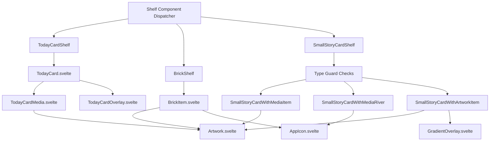
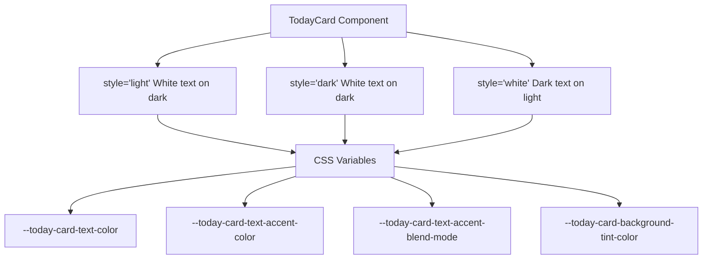
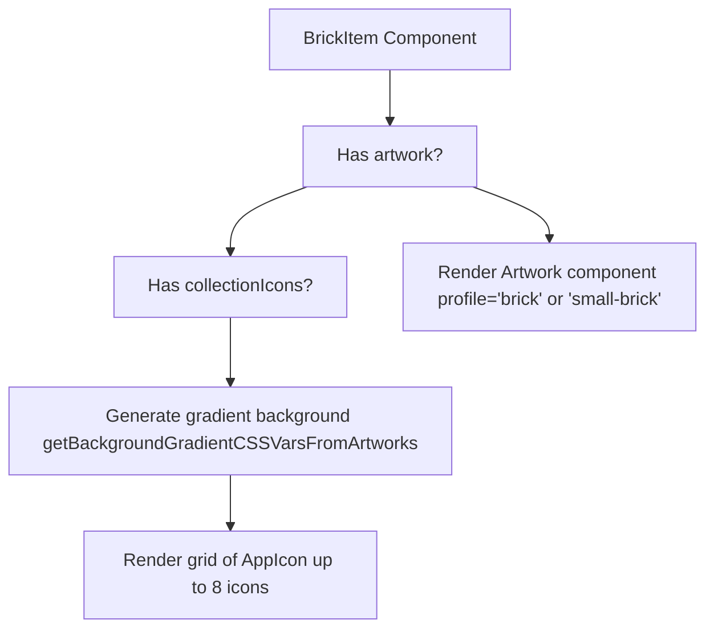
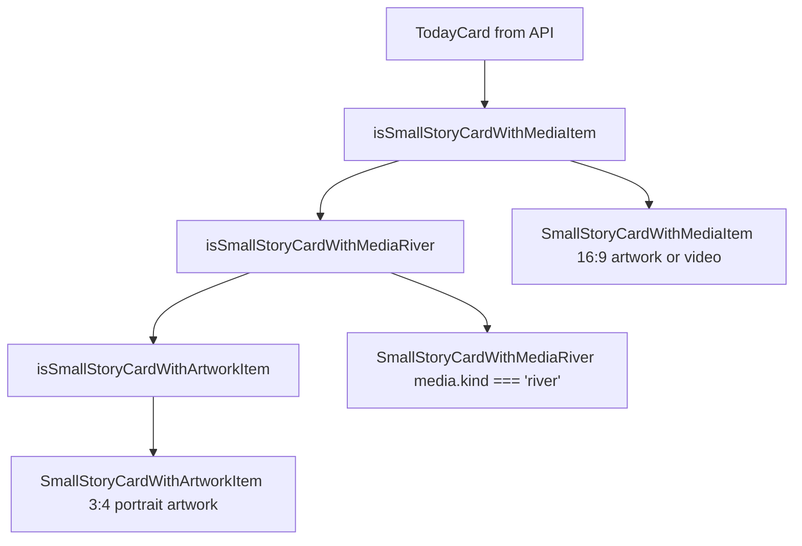
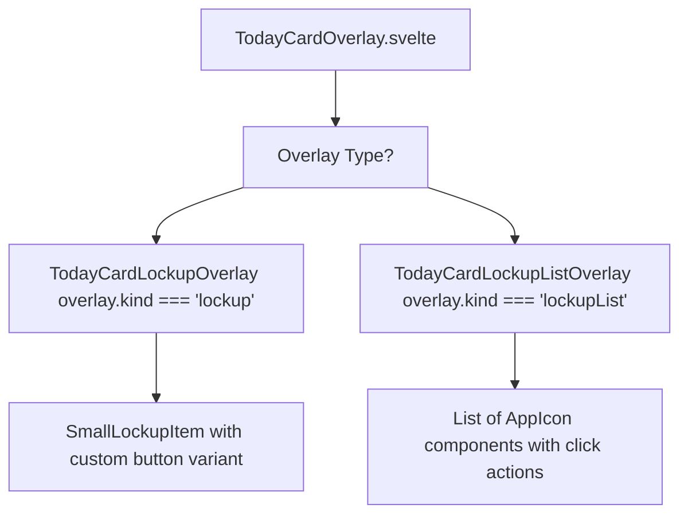

# 内容卡片 (Content Cards)

-   [src/components/jet/item/BrickItem.svelte](https://github.com/Chesszyh/apps.apple.com/blob/279d0c4d/src/components/jet/item/BrickItem.svelte)
-   [src/components/jet/item/SmallStoryCardWithArtworkItem.svelte](https://github.com/Chesszyh/apps.apple.com/blob/279d0c4d/src/components/jet/item/SmallStoryCardWithArtworkItem.svelte)
-   [src/components/jet/item/SmallStoryCardWithMediaItem.svelte](https://github.com/Chesszyh/apps.apple.com/blob/279d0c4d/src/components/jet/item/SmallStoryCardWithMediaItem.svelte)
-   [src/components/jet/item/SmallStoryCardWithMediaRiver.svelte](https://github.com/Chesszyh/apps.apple.com/blob/279d0c4d/src/components/jet/item/SmallStoryCardWithMediaRiver.svelte)
-   [src/components/jet/today-card/TodayCard.svelte](https://github.com/Chesszyh/apps.apple.com/blob/279d0c4d/src/components/jet/today-card/TodayCard.svelte)
-   [src/components/jet/today-card/TodayCardOverlay.svelte](https://github.com/Chesszyh/apps.apple.com/blob/279d0c4d/src/components/jet/today-card/TodayCardOverlay.svelte)
-   [src/components/jet/today-card/overlay/TodayCardLockupListOverlay.svelte](https://github.com/Chesszyh/apps.apple.com/blob/279d0c4d/src/components/jet/today-card/overlay/TodayCardLockupListOverlay.svelte)

## 目的与范围 (Purpose and Scope)

本文档涵盖了**内容卡片 (Content Card)** 组件系列，该系列为 App Store Web 应用程序提供了视觉丰富的编辑卡片显示。内容卡片包括：

-   **TodayCard**：具有媒体、叠加层和保护层的大型编辑卡片。
-   **BrickItem**：具有艺术资产或生成的渐变背景的项目集合卡片。
-   **SmallStoryCard 变体**：具有不同媒体类型的紧凑型故事卡片。

这些组件贯穿于整个编辑货架中，用于展示精选内容、应用集合和精选故事。有关基于轮播的英雄 (hero) 显示，请参阅 [Hero and Carousel Components](#5.4)。有关以应用为中心的显示，请参阅 [Lockup Components](#5.5)。

---

## 组件类型概览 (Component Type Overview)

内容卡片系统由三个主要的组件系列组成，每个系列都具有独特的视觉特征和数据需求：

| 组件 | 文件 | 主要用例 | 关键特性 |
| --- | --- | --- | --- |
| `TodayCard` | `src/components/jet/today-card/TodayCard.svelte` | 大型编辑专题 | 媒体背景、保护层、叠加层 |
| `BrickItem` | `src/components/jet/item/BrickItem.svelte` | 应用集合 | 渐变背景、集合图标 |
| `SmallStoryCardWithMedia` | `src/components/jet/item/SmallStoryCardWithMediaItem.svelte` | 具有媒体的故事预览 | 16:9 艺术资产、紧凑布局 |
| `SmallStoryCardWithMediaRiver` | `src/components/jet/item/SmallStoryCardWithMediaRiver.svelte` | 应用集合故事 | 带有渐变的图标流 (river) |
| `SmallStoryCardWithArtwork` | `src/components/jet/item/SmallStoryCardWithArtworkItem.svelte` | 纵向故事卡片 | 3:4 艺术资产，带有渐变叠加层 |

**来源：** [src/components/jet/today-card/TodayCard.svelte1-402](https://github.com/Chesszyh/apps.apple.com/blob/279d0c4d/src/components/jet/today-card/TodayCard.svelte#L1-L402) [src/components/jet/item/BrickItem.svelte1-301](https://github.com/Chesszyh/apps.apple.com/blob/279d0c4d/src/components/jet/item/BrickItem.svelte#L1-L301) [src/components/jet/item/SmallStoryCardWithMediaItem.svelte1-105](https://github.com/Chesszyh/apps.apple.com/blob/279d0c4d/src/components/jet/item/SmallStoryCardWithMediaItem.svelte#L1-L105)

---

## 组件层级与数据流 (Component Hierarchy and Data Flow)


**来源：** [src/components/jet/today-card/TodayCard.svelte1-17](https://github.com/Chesszyh/apps.apple.com/blob/279d0c4d/src/components/jet/today-card/TodayCard.svelte#L1-L17) [src/components/jet/item/BrickItem.svelte1-18](https://github.com/Chesszyh/apps.apple.com/blob/279d0c4d/src/components/jet/item/BrickItem.svelte#L1-L18) [src/components/jet/item/SmallStoryCardWithMediaItem.svelte15-19](https://github.com/Chesszyh/apps.apple.com/blob/279d0c4d/src/components/jet/item/SmallStoryCardWithMediaItem.svelte#L15-L19)

---

## TodayCard 组件 (TodayCard Component)

`TodayCard` 组件渲染具有丰富媒体背景、文本内容和可选交互式叠加层的大型编辑卡片。

### 数据模型与属性 (Data Model and Props)

组件接受来自 API 的 `TodayCard` 模型以及可选配置：

| 属性 (Prop) | 类型 | 默认值 | 描述 |
| --- | --- | --- | --- |
| `card` | `TodayCard` | 必填 | 卡片数据，包括标语 (heading)、标题、媒体、叠加层 |
| `suppressClickAction` | `boolean` | `false` | 禁用点击操作（用于故事页面） |
| `artworkProfile` | `Profile | undefined` | `undefined` | 覆盖默认媒体配置文件 |

`TodayCard` 模型包含：

-   `heading`：可选的徽章文本（例如 "新游戏"）
-   `title`：主卡片标题
-   `inlineDescription`：标题下方的正文文本
-   `titleArtwork`：替换文本标题的可选艺术资产
-   `media`：背景媒体（艺术资产、视频、App 事件或列表）
-   `overlay`：可选的锁定项或锁定项列表
-   `style`：配色方案 (`'light'`, `'dark'`, 或 `'white'`)
-   `editorialDisplayOptions`：保护层的配置

**来源：** [src/components/jet/today-card/TodayCard.svelte18-51](https://github.com/Chesszyh/apps.apple.com/blob/279d0c4d/src/components/jet/today-card/TodayCard.svelte#L18-L51)

### 样式系统与 CSS 变量 (Style System and CSS Variables)

TodayCard 支持三种具有不同配色方案的视觉样式：


CSS 变量值为：

| 样式 | 文本颜色 | 强调色 | 混合模式 | 背景色调 (Tint) |
| --- | --- | --- | --- | --- |
| `light`/`dark` | `rgb(255, 255, 255)` | `rgba(255, 255, 255, 0.56)` | `plus-lighter` | `rgba(0, 0, 0, 0.18)` |
| `white` | `var(--systemPrimary-onLight)` | `rgba(0, 0, 0, 0.56)` | `revert` | `rgba(255, 255, 255, 0.33)` |

**来源：** [src/components/jet/today-card/TodayCard.svelte198-211](https://github.com/Chesszyh/apps.apple.com/blob/279d0c4d/src/components/jet/today-card/TodayCard.svelte#L198-L211)

### 保护层与视觉效果 (Protection Layers and Visual Effects)

TodayCard 实现了先进的视觉保护层，以确保文本在背景媒体上具有良好的可读性：

#### 模糊保护层 (Blurry Protection Layer)

当设置了 `editorialDisplayOptions.useTextProtectionColor` 或 `editorialDisplayOptions.useMaterialBlur` 时使用，App 事件和列表样式卡片除外：

```
backdrop-filter: blur(34px) brightness(0.95) saturate(1.6) contrast(1.1)
```
该层使用渐变遮罩创建自下而上的平滑淡出效果，底部 30% 完全保护，向顶部逐渐变为透明。

**来源：** [src/components/jet/today-card/TodayCard.svelte283-303](https://github.com/Chesszyh/apps.apple.com/blob/279d0c4d/src/components/jet/today-card/TodayCard.svelte#L283-L303)

#### 渐变保护层 (Gradient Protection Layer)

专为 App 事件媒体 (`media.kind === 'appEvent'`) 应用。使用从媒体背景派生的强调色创建自下而上的渐变：

```
linear-gradient(
    0deg,
    var(--gradient-color) 22%,
    color-mix(in srgb, var(--gradient-color) 60%, transparent) 36%,
    transparent 50%
)
```
渐变在悬停时会变暗以提供交互反馈：

```
.information-layer.with-gradient.with-action:has(> a:hover) {    --gradient-color: color-mix(        in srgb,        var(--today-card-accent-color) 93%,        black    );}
```
**来源：** [src/components/jet/today-card/TodayCard.svelte247-275](https://github.com/Chesszyh/apps.apple.com/blob/279d0c4d/src/components/jet/today-card/TodayCard.svelte#L247-L275)

### 强调色确定 (Accent Color Determination)

卡片的强调色使用 `bestBackgroundColor` 工具函数计算：

```
accentColor = colorAsString(bestBackgroundColor(card.media));
```
该颜色被设置为 `--today-card-accent-color` 并用于：

-   卡片背景颜色
-   渐变保护层的基色
-   跨卡片元素的一致视觉效果

**来源：** [src/components/jet/today-card/TodayCard.svelte64](https://github.com/Chesszyh/apps.apple.com/blob/279d0c4d/src/components/jet/today-card/TodayCard.svelte#L64-L64) [src/components/jet/today-card/TodayCard.svelte16](https://github.com/Chesszyh/apps.apple.com/blob/279d0c4d/src/components/jet/today-card/TodayCard.svelte#L16-L16)

### 布局模式 (Layout Modes)

#### 标准模式 (Standard Mode)

默认布局，媒体作为背景，文本叠加层位于底部：

```
- TodayCardMedia (背景)
- wrapper (绝对定位)
  - information-layer
    - content-container (标题, 描述)
    - overlay (可选的锁定项)
```
#### 列表模式 (List Mode)

当 `media` 是 `TodayCardMediaList` 时，布局切换为水平：

```
- wrapper (相对定位)
  - information-layer (文本内容)
- TodayCardMedia (在底部渲染)
```
列表模式使用具有亮色背景且无叠加层的不同样式。

**来源：** [src/components/jet/today-card/TodayCard.svelte82-163](https://github.com/Chesszyh/apps.apple.com/blob/279d0c4d/src/components/jet/today-card/TodayCard.svelte#L82-L163) [src/components/jet/today-card/TodayCard.svelte372-401](https://github.com/Chesszyh/apps.apple.com/blob/279d0c4d/src/components/jet/today-card/TodayCard.svelte#L372-L401)

### 叠加系统 (Overlay System)

TodayCard 叠加层在卡片底部显示 App 锁定项。叠加层渲染委托给 `TodayCardOverlay`：

```
{#if overlay}    <div class="overlay">        <TodayCardOverlay            {overlay}            buttonVariant={useProtectionLayer ? 'transparent' : 'dark-gray'}        />    </div>{/if}
```
叠加层支持两种变体：

-   **单项锁定 (Single lockup)**：渲染带有 App 图标和元数据的 `SmallLockupItem`。
-   **锁定列表 (Lockup list)**：在水平行中渲染多个 App 图标。

当存在叠加层时，卡片不会将整个卡片包装在可点击链接中，以避免嵌套锚点标签 (anchor tags)。

**来源：** [src/components/jet/today-card/TodayCard.svelte139-156](https://github.com/Chesszyh/apps.apple.com/blob/279d0c4d/src/components/jet/today-card/TodayCard.svelte#L139-L156) [src/components/jet/today-card/TodayCardOverlay.svelte24-35](https://github.com/Chesszyh/apps.apple.com/blob/279d0c4d/src/components/jet/today-card/TodayCardOverlay.svelte#L24-L35)

---

## BrickItem 组件 (BrickItem Component)

`BrickItem` 渲染项目集合卡片，具有英雄艺术资产或填充了集合 App 图标的生成渐变背景。

### 艺术资产 vs 集合图标 (Artwork vs Collection Icons)

该组件根据数据可用性支持两种视觉模式：


**来源：** [src/components/jet/item/BrickItem.svelte21-42](https://github.com/Chesszyh/apps.apple.com/blob/279d0c4d/src/components/jet/item/BrickItem.svelte#L21-L42) [src/components/jet/item/BrickItem.svelte51-103](https://github.com/Chesszyh/apps.apple.com/blob/279d0c4d/src/components/jet/item/BrickItem.svelte#L51-L103)

### 渐变背景生成 (Gradient Background Generation)

当存在多个集合图标时，组件会生成一个四象限径向渐变背景：

```
backgroundGradientCssVars = getBackgroundGradientCSSVarsFromArtworks(    collectionIcons,    {        sortFn: (a, b) => getLuminanceForRGB(a) - getLuminanceForRGB(b),        shouldRemoveGreys: true,    },);
```
这会产生用于渐变定义的 CSS 变量（`--top-left`, `--bottom-left`, `--top-right`, `--bottom-right`）：

```
background:     radial-gradient(circle at 3% -50%, var(--top-left, #000) 20%, transparent 70%),    radial-gradient(circle at -50% 120%, var(--bottom-left, #000) 40%, transparent 80%),    radial-gradient(circle at 66% -175%, var(--top-right, #000) 55%, transparent 80%),    radial-gradient(circle at 62% 100%, var(--bottom-right, #000) 50%, transparent 100%);
```
渐变包含一个使用 CSS `@property` 和 `@keyframes` 的动画悬停效果：

```
@keyframes gradient-hover {    0% {        --top-left-stop: 20%;        background-size: 100% 100%;    }    50% {        --top-left-stop: 25%;        background-size: 130% 130%;    }    100% {        --top-left-stop: 15%;        background-size: 110% 110%;    }}
```
**来源：** [src/components/jet/item/BrickItem.svelte29-42](https://github.com/Chesszyh/apps.apple.com/blob/279d0c4d/src/components/jet/item/BrickItem.svelte#L29-L42) [src/components/jet/item/BrickItem.svelte201-256](https://github.com/Chesszyh/apps.apple.com/blob/279d0c4d/src/components/jet/item/BrickItem.svelte#L201-L256)

### 集合图标网格 (Collection Icon Grid)

在渐变背景上渲染集合图标时，图标排列在 2 行网格中，最多包含 8 个图标：

```
.app-icons {    display: grid;    grid-template-rows: auto auto;    grid-auto-flow: column;    gap: 8px;}
```
图标使用 `brick-app-icon` 配置文件进行渲染，并以交替偏移的方式放置以增加视觉趣味性。

**来源：** [src/components/jet/item/BrickItem.svelte90-102](https://github.com/Chesszyh/apps.apple.com/blob/279d0c4d/src/components/jet/item/BrickItem.svelte#L90-L102) [src/components/jet/item/BrickItem.svelte258-270](https://github.com/Chesszyh/apps.apple.com/blob/279d0c4d/src/components/jet/item/BrickItem.svelte#L258-L270)

### 编辑描述叠加层 (Editorial Description Overlay)

BrickItem 支持一个可选的 `shortEditorialDescription`，它可以放置在卡片下方或叠加在卡片上：

| 模式 | 条件 | 位置 |
| --- | --- | --- |
| 下方 | `shouldOverlayDescription = false` | 卡片下方，带有 `margin-top: 8px` |
| 叠加 | `shouldOverlayDescription = true` | 绝对定位在底部，使用白色文本 |

叠加时，艺术资产使用 `small-brick` 配置文件，以为描述提供更多的垂直空间。

**来源：** [src/components/jet/item/BrickItem.svelte19](https://github.com/Chesszyh/apps.apple.com/blob/279d0c4d/src/components/jet/item/BrickItem.svelte#L19-L19) [src/components/jet/item/BrickItem.svelte106-113](https://github.com/Chesszyh/apps.apple.com/blob/279d0c4d/src/components/jet/item/BrickItem.svelte#L106-L113)

---

## SmallStoryCard 变体 (SmallStoryCard Variants)

SmallStoryCard 组件有三种变体，通过货架层的类型守卫进行区分：

### 类型守卫系统 (Type Guard System)


**来源：** [src/components/jet/item/SmallStoryCardWithMediaItem.svelte15-19](https://github.com/Chesszyh/apps.apple.com/blob/279d0c4d/src/components/jet/item/SmallStoryCardWithMediaItem.svelte#L15-L19) [src/components/jet/item/SmallStoryCardWithMediaRiver.svelte11-15](https://github.com/Chesszyh/apps.apple.com/blob/279d0c4d/src/components/jet/item/SmallStoryCardWithMediaRiver.svelte#L11-L15) [src/components/jet/item/SmallStoryCardWithArtworkItem.svelte12-16](https://github.com/Chesszyh/apps.apple.com/blob/279d0c4d/src/components/jet/item/SmallStoryCardWithArtworkItem.svelte#L12-L16)

### SmallStoryCardWithMediaItem

渲染具有横向媒体的故事卡片（16:9 长宽比）：

**数据结构：**

```
export interface SmallStoryCardWithMedia extends TodayCard {    media: TodayCardMediaWithArtwork;    heroMedia: TodayCardMediaWithArtwork; // 可选，具有更高优先级}
```
**渲染逻辑：**

-   `heroMedia` 艺术资产优先于 `media` 艺术资产。
-   为 `heroMedia` 使用 `small-story-card` 配置文件，为普通媒体使用 `small-story-card-legacy`。
-   针对传统裁剪应用 `useCropCodeFromArtwork={!item.heroMedia}`。

**布局：**

```
- artwork-container (16:9 长宽比)
  - 使用适当配置文件的 Artwork
- text-container
  - h4 (标语 heading)
  - h3 (标题, 1 行截断)
  - p (内联描述 inlineDescription, 1 行截断)
```
**来源：** [src/components/jet/item/SmallStoryCardWithMediaItem.svelte10-72](https://github.com/Chesszyh/apps.apple.com/blob/279d0c4d/src/components/jet/item/SmallStoryCardWithMediaItem.svelte#L10-L72)

### SmallStoryCardWithMediaRiver

在渐变背景上显示带有 App 图标流的应用集合故事：

**数据结构：**

```
export interface TodayCardWithMediaRiver extends TodayCard {    media: TodayCardMediaRiver;}
```
**渐变背景：** 与 BrickItem 类似，根据锁定图标背景颜色生成四象限渐变：

```
backgroundGradientCssVars = getBackgroundGradientCSSVarsFromArtworks(    icons,    {        sortFn: (a, b) => getLuminanceForRGB(a) - getLuminanceForRGB(b),    },);
```
**图标流 (Icon River)：** 使用 `AppIconRiver` 组件在渐变容器内的流动行中显示 App 图标。

**标题逻辑：**

```
if (item.inlineDescription) {    eyebrow = item.title;    title = item.inlineDescription;} else {    eyebrow = item.heading;    title = item.title;}
```
**来源：** [src/components/jet/item/SmallStoryCardWithMediaRiver.svelte7-68](https://github.com/Chesszyh/apps.apple.com/blob/279d0c4d/src/components/jet/item/SmallStoryCardWithMediaRiver.svelte#L7-L68)

### SmallStoryCardWithArtworkItem

渲染具有渐变文本叠加层的纵向故事卡片：

**数据结构：**

```
export interface SmallStoryCardWithArtwork extends TodayCard {    artwork: ArtworkModel;    badge: any;}
```
**艺术资产优先级：**

```
artwork = item.heroMedia?.artworks?.[0] || item.artwork;
```
**视觉组合：**

```
- article (3:4 长宽比)
  - Artwork (profile='small-story-card-portrait')
  - GradientOverlay (源自 artwork.backgroundColor)
  - text-container (绝对定位)
    - h4 (badge.title)
    - h3 (title)
```
`GradientOverlay` 组件创建自下而上的渐变以确保文本可读性，颜色派生自艺术资产的背景颜色。

**来源：** [src/components/jet/item/SmallStoryCardWithArtworkItem.svelte7-87](https://github.com/Chesszyh/apps.apple.com/blob/279d0c4d/src/components/jet/item/SmallStoryCardWithArtworkItem.svelte#L7-L87)

---

## 叠加层组件 (Overlay Components)

TodayCard 叠加层在编辑卡片底部提供交互式应用锁定显示。

### TodayCardOverlay 组件 (TodayCardOverlay Component)

根据叠加层类型分发到具体的叠加层实现：


**按钮变体选择：** `buttonVariant` 属性由保护层状态决定：

-   当保护层激活时为 `'transparent'`。
-   当无保护层时为 `'dark-gray'`。

**来源：** [src/components/jet/today-card/TodayCardOverlay.svelte1-48](https://github.com/Chesszyh/apps.apple.com/blob/279d0c4d/src/components/jet/today-card/TodayCardOverlay.svelte#L1-L48)

### TodayCardLockupListOverlay

为多应用叠加层渲染一个水平排列的 App 图标列表：

```
<div class="lockup-list">    {#each overlay.lockups as lockup}        <LinkWrapper action={lockup.clickAction}>            <AppIcon icon={lockup.icon} />        </LinkWrapper>    {/each}</div>
```
组件使用响应式间隙 (gap) 间距：

-   侧边栏可见时，在 xsmall 视口上为 `10px`。
-   侧边栏不可见时，在 xsmall 视口上为 `12px`。
-   在 small 及更大视口上为 `16px`。

**来源：** [src/components/jet/today-card/overlay/TodayCardLockupListOverlay.svelte1-42](https://github.com/Chesszyh/apps.apple.com/blob/279d0c4d/src/components/jet/today-card/overlay/TodayCardLockupListOverlay.svelte#L1-L42)

---

## 使用模式 (Usage Patterns)

### 在货架组件中 (In Shelf Components)

内容卡片通常在遍历项目数组的货架组件内渲染：

```
{#each shelf.items as item}    {#if isTodayCard(item)}        <TodayCard card={item} />    {:else if isBrick(item)}        <BrickItem {item} />    {/if}{/each}
```
### 配置文件选择 (Profile Selection)

卡片根据上下文使用不同的 `Artwork` 配置文件：

| 卡片类型 | 配置文件 | 长宽比 |
| --- | --- | --- |
| TodayCard (标准) | 源自媒体或默认值 | 随媒体类型变化 |
| BrickItem (标准) | `brick` | 16:9 |
| BrickItem (叠加) | `small-brick` | 16:9 |
| SmallStoryCardWithMedia (英雄) | `small-story-card` | 16:9 |
| SmallStoryCardWithMedia (传统) | `small-story-card-legacy` | 16:9 |
| SmallStoryCardWithArtwork | `small-story-card-portrait` | 3:4 |

**来源：** [src/components/jet/today-card/TodayCard.svelte83](https://github.com/Chesszyh/apps.apple.com/blob/279d0c4d/src/components/jet/today-card/TodayCard.svelte#L83-L83) [src/components/jet/item/BrickItem.svelte54](https://github.com/Chesszyh/apps.apple.com/blob/279d0c4d/src/components/jet/item/BrickItem.svelte#L54-L54) [src/components/jet/item/SmallStoryCardWithMediaItem.svelte48-54](https://github.com/Chesszyh/apps.apple.com/blob/279d0c4d/src/components/jet/item/SmallStoryCardWithMediaItem.svelte#L48-L54) [src/components/jet/item/SmallStoryCardWithArtworkItem.svelte39](https://github.com/Chesszyh/apps.apple.com/blob/279d0c4d/src/components/jet/item/SmallStoryCardWithArtworkItem.svelte#L39-L39)

### 响应式行为 (Responsive Behavior)

所有内容卡片都使用 CSS 容器查询 (container queries) 实现响应式布局：

```
@container container (max-width: 298px) {    .title {        font: var(--title-2-emphasized);    }}@container today-card (orientation: landscape) {    .title-artwork-container {        width: 33%;        min-width: 200px;    }}
```
这允许卡片适应其容器大小而非视口大小，从而实现灵活的网格和货架布局。

**来源：** [src/components/jet/item/BrickItem.svelte272-293](https://github.com/Chesszyh/apps.apple.com/blob/279d0c4d/src/components/jet/item/BrickItem.svelte#L272-L293) [src/components/jet/today-card/TodayCard.svelte322-336](https://github.com/Chesszyh/apps.apple.com/blob/279d0c4d/src/components/jet/today-card/TodayCard.svelte#L322-L336)
