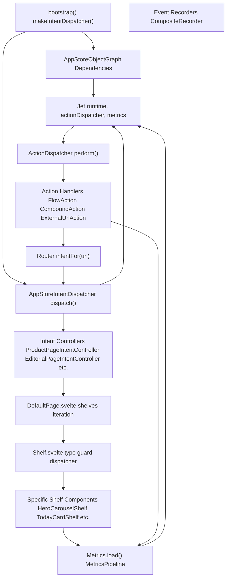
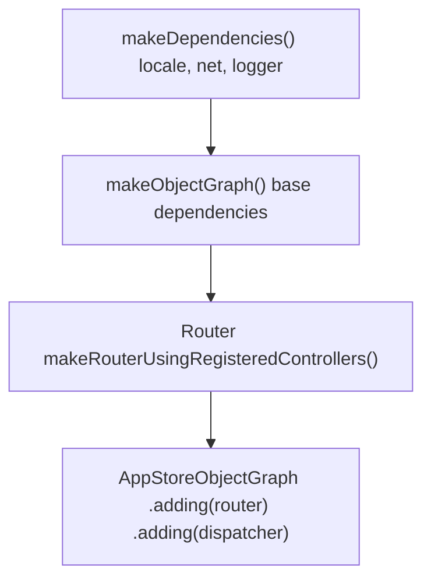
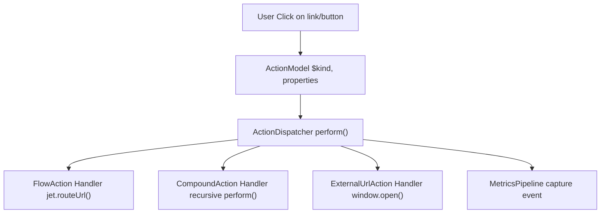
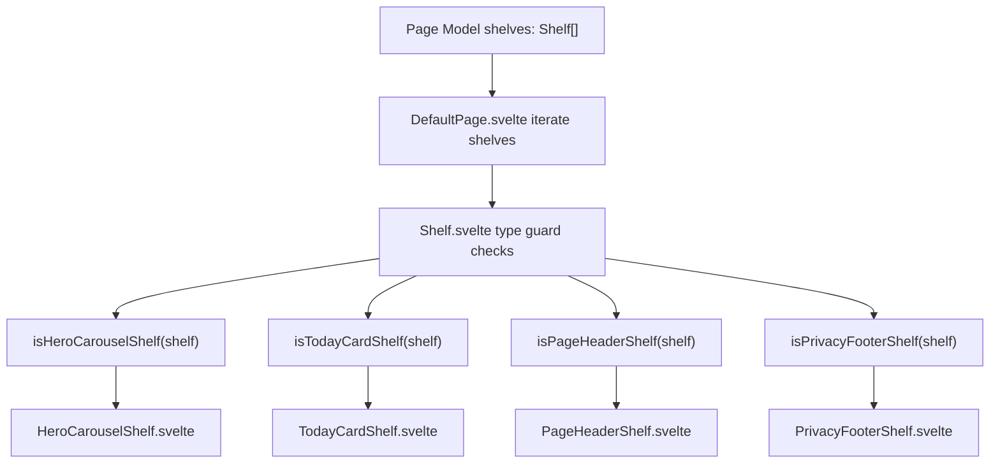
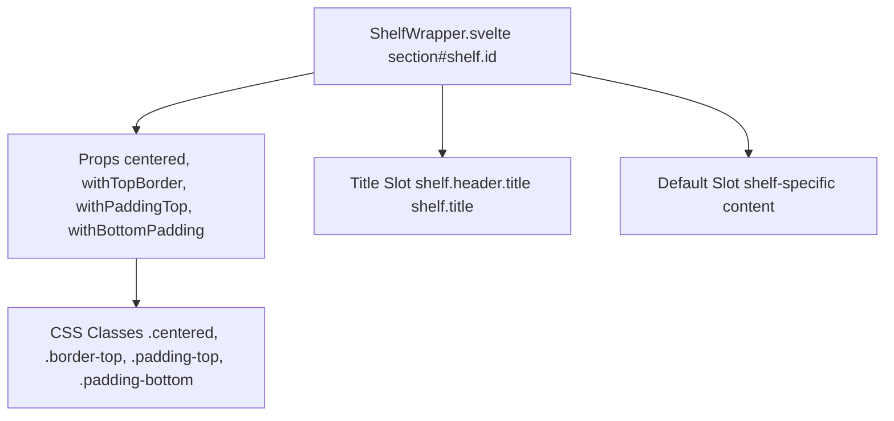
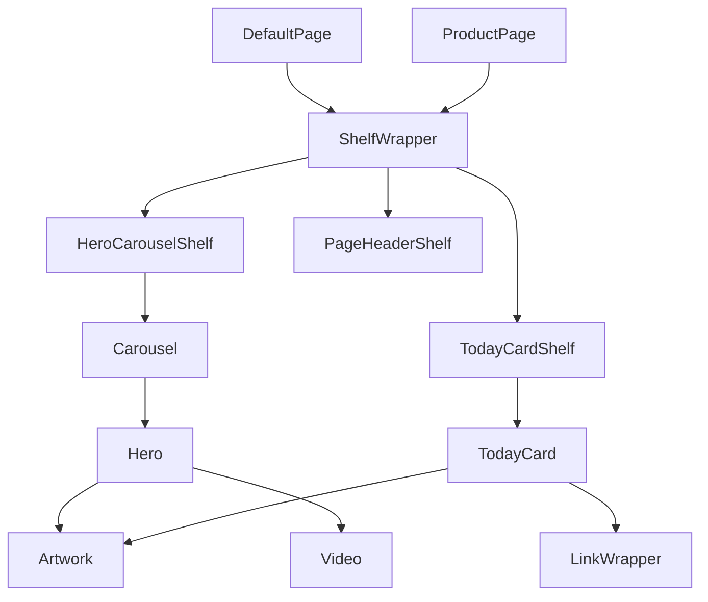

# 架构 (Architecture)

-   [src/components/Shelf/Wrapper.svelte](https://github.com/Chesszyh/apps.apple.com/blob/279d0c4d/src/components/Shelf/Wrapper.svelte)
-   [src/components/jet/shelf/ArcadeFooterShelf.svelte](https://github.com/Chesszyh/apps.apple.com/blob/279d0c4d/src/components/jet/shelf/ArcadeFooterShelf.svelte)
-   [src/components/jet/shelf/PageHeaderShelf.svelte](https://github.com/Chesszyh/apps.apple.com/blob/279d0c4d/src/components/jet/shelf/PageHeaderShelf.svelte)
-   [src/components/jet/shelf/PrivacyFooterShelf.svelte](https://github.com/Chesszyh/apps.apple.com/blob/279d0c4d/src/components/jet/shelf/PrivacyFooterShelf.svelte)
-   [src/components/pages/DefaultPage.svelte](https://github.com/Chesszyh/apps.apple.com/blob/279d0c4d/src/components/pages/DefaultPage.svelte)
-   [src/jet/action-handlers/browser.ts](https://github.com/Chesszyh/apps.apple.com/blob/279d0c4d/src/jet/action-handlers/browser.ts)
-   [src/jet/action-handlers/compound-action.ts](https://github.com/Chesszyh/apps.apple.com/blob/279d0c4d/src/jet/action-handlers/compound-action.ts)
-   [src/jet/action-handlers/external-url-action.ts](https://github.com/Chesszyh/apps.apple.com/blob/279d0c4d/src/jet/action-handlers/external-url-action.ts)
-   [src/jet/bootstrap.ts](https://github.com/Chesszyh/apps.apple.com/blob/279d0c4d/src/jet/bootstrap.ts)
-   [src/jet/intents/route-url/route-url-controller.ts](https://github.com/Chesszyh/apps.apple.com/blob/279d0c4d/src/jet/intents/route-url/route-url-controller.ts)
-   [src/jet/intents/route-url/route-url-intent.ts](https://github.com/Chesszyh/apps.apple.com/blob/279d0c4d/src/jet/intents/route-url/route-url-intent.ts)
-   [src/jet/intents/static-message-pages/carrier-page-intent-controller.ts](https://github.com/Chesszyh/apps.apple.com/blob/279d0c4d/src/jet/intents/static-message-pages/carrier-page-intent-controller.ts)
-   [src/jet/intents/static-message-pages/contingent-price-page-intent-controller.ts](https://github.com/Chesszyh/apps.apple.com/blob/279d0c4d/src/jet/intents/static-message-pages/contingent-price-page-intent-controller.ts)
-   [src/jet/intents/static-message-pages/invoice-page-intent-controller.ts](https://github.com/Chesszyh/apps.apple.com/blob/279d0c4d/src/jet/intents/static-message-pages/invoice-page-intent-controller.ts)
-   [src/jet/jet.ts](https://github.com/Chesszyh/apps.apple.com/blob/279d0c4d/src/jet/jet.ts)
-   [src/jet/models/external-action.ts](https://github.com/Chesszyh/apps.apple.com/blob/279d0c4d/src/jet/models/external-action.ts)
-   [src/jet/svelte.ts](https://github.com/Chesszyh/apps.apple.com/blob/279d0c4d/src/jet/svelte.ts)

本文档描述了管理 App Store Web 应用程序的核心架构模式和设计决策。它涵盖了实现路由、页面渲染、组件组合和用户交互处理的基础系统。

有关特定子系统的详细信息，请参阅：

-   **Jet 应用程序核心 (Jet Application Core)** [#2.1](#2.1) - 引导、对象图和依赖注入
-   **意图与操作系统 (Intent and Action System)** [#2.2](#2.2) - 路由和操作分发机制
-   **组件架构 (Component Architecture)** [#2.3](#2.3) - 组件组合和类型守卫模式

## 架构概览 (Architectural Overview)

该应用程序建立在职责分离清晰的**分层架构**之上：

1.  **应用核心层 (Application Core Layer)** - Jet 系统管理初始化、路由和依赖注入
2.  **数据层 (Data Layer)** - 意图控制器获取 API 数据并将其转换为页面模型
3.  **表示层 (Presentation Layer)** - Svelte 组件渲染基于货架的页面模型
4.  **交互层 (Interaction Layer)** - 操作处理器处理用户交互和导航
5.  **可观测性层 (Observability Layer)** - 指标流水线独立于业务逻辑追踪事件


**来源：** [src/jet/jet.ts1-320](https://github.com/Chesszyh/apps.apple.com/blob/279d0c4d/src/jet/jet.ts#L1-L320) [src/jet/bootstrap.ts1-126](https://github.com/Chesszyh/apps.apple.com/blob/279d0c4d/src/jet/bootstrap.ts#L1-L126) [src/components/pages/DefaultPage.svelte1-174](https://github.com/Chesszyh/apps.apple.com/blob/279d0c4d/src/components/pages/DefaultPage.svelte#L1-L174)

## 核心架构模式 (Core Architectural Patterns)

### 通过对象图进行依赖注入 (Dependency Injection via Object Graph)

应用程序使用 **AppStoreObjectGraph** 在整个系统中提供依赖项。对象图是不可变的，并使用构建器模式 (builder pattern) 进行组合：


对象图提供对以下内容的访问：

-   `locale` - 当前店面和语言
-   `net` - 用于 API 请求的网络客户端
-   `logger` - 日志基础设施
-   `router` - URL 路由系统
-   `dispatcher` - 意图分发器

**来源：** [src/jet/bootstrap.ts100-125](https://github.com/Chesszyh/apps.apple.com/blob/279d0c4d/src/jet/bootstrap.ts#L100-L125) [src/jet/jet.ts73-94](https://github.com/Chesszyh/apps.apple.com/blob/279d0c4d/src/jet/jet.ts#L73-L94)

### 基于意图的路由 (Intent-Based Routing)

路由系统遵循**意图控制器模式 (intent controller pattern)**，其中 URL 映射到意图对象，然后将其分发给返回页面模型的控制器：

> **[Mermaid sequence]**
> *(图表结构无法解析)*

意图控制器实现 `IntentController` 接口，并且还可以实现 `RouteProvider` 以注册 URL 模式。`RouteUrlIntentController` 作为一个元控制器，将任意 URL 解析为特定的意图。

**来源：** [src/jet/intents/route-url/route-url-controller.ts1-29](https://github.com/Chesszyh/apps.apple.com/blob/279d0c4d/src/jet/intents/route-url/route-url-controller.ts#L1-L29) [src/jet/bootstrap.ts44-98](https://github.com/Chesszyh/apps.apple.com/blob/279d0c4d/src/jet/bootstrap.ts#L44-L98)

### 操作分发器模式 (Action Dispatcher Pattern)

用户交互被建模为通过 `ActionDispatcher` 分发的**操作对象**。每种操作类型都有一个注册的处理器：

| 操作类型 | 处理器 | 用途 |
| --- | --- | --- |
| `FlowAction` | `flow-action.ts` | 导航到新的意图/页面 |
| `CompoundAction` | `compound-action.ts` | 按顺序执行多个操作 |
| `ExternalUrlAction` | `external-url-action.ts` | 打开外部 URL |


分发器支持**指标行为 (metrics behaviors)**，这些行为控制是否以及如何为每个操作捕获指标。

**来源：** [src/jet/jet.ts206-240](https://github.com/Chesszyh/apps.apple.com/blob/279d0c4d/src/jet/jet.ts#L206-L240) [src/jet/action-handlers/compound-action.ts1-34](https://github.com/Chesszyh/apps.apple.com/blob/279d0c4d/src/jet/action-handlers/compound-action.ts#L1-L34) [src/jet/action-handlers/external-url-action.ts1-20](https://github.com/Chesszyh/apps.apple.com/blob/279d0c4d/src/jet/action-handlers/external-url-action.ts#L1-L20)

## 基于货架的页面模型 (Shelf-Based Page Model)

页面由**货架 (shelves)** 组成，货架是包含要显示的项目且具有类型的模型。渲染系统使用**类型守卫 (type guards)** 动态分发到特定的货架组件：


### 货架类型守卫模式 (Shelf Type Guard Pattern)

每个货架组件都会导出一个类型守卫函数，用于检查泛型 `Shelf` 是否与其预期的结构匹配：

```
// 来自 PageHeaderShelf.svelteinterface PageHeaderShelf extends Shelf {    items: [PageHeader];}export function isPageHeaderShelf(shelf: Shelf): shelf is PageHeaderShelf {    const { contentType, items } = shelf;    return contentType === 'pageHeader' && Array.isArray(items);}
```
这种模式可以实现：

-   **类型安全** - TypeScript 在守卫检查后收窄类型
-   **多态** - 泛型货架数组渲染为特定组件
-   **可扩展性** - 无需修改现有代码即可添加新的货架类型
-   **运行时验证** - 守卫确保数据符合预期结构

**来源：** [src/components/jet/shelf/PageHeaderShelf.svelte1-35](https://github.com/Chesszyh/apps.apple.com/blob/279d0c4d/src/components/jet/shelf/PageHeaderShelf.svelte#L1-L35) [src/components/jet/shelf/PrivacyFooterShelf.svelte1-41](https://github.com/Chesszyh/apps.apple.com/blob/279d0c4d/src/components/jet/shelf/PrivacyFooterShelf.svelte#L1-L41) [src/components/jet/shelf/ArcadeFooterShelf.svelte1-33](https://github.com/Chesszyh/apps.apple.com/blob/279d0c4d/src/components/jet/shelf/ArcadeFooterShelf.svelte#L1-L33)

### 货架包装器模式 (Shelf Wrapper Pattern)

`ShelfWrapper` 组件为所有货架提供了一致的布局和间距：


包装器处理：

-   **居中** - 通过 `--bodyGutter` 进行水平约束
-   **间距** - 一致的顶部/底部内边距 (顶部 13px，底部 32px)
-   **边框** - 使用 `var(--systemGray4)` 的可选顶部边框
-   **标题** - 自动渲染具有 "查看全部" 操作的货架页眉
-   **无障碍性** - 带有货架 ID 的 section 地标

**来源：** [src/components/Shelf/Wrapper.svelte1-82](https://github.com/Chesszyh/apps.apple.com/blob/279d0c4d/src/components/Shelf/Wrapper.svelte#L1-L82)

## 组件组合层级 (Component Composition Hierarchy)

组件从页面向下到原语分层组合：


每一层都有不同的职责：

-   **页面层 (Page Layer)** - 编排货架渲染，管理页面级状态
-   **货架层 (Shelf Layer)** - 采用一致的布局包装内容，提供特定于货架的逻辑
-   **容器层 (Container Layer)** - 管理项目集合（轮播、卡片、网格）
-   **原语层 (Primitive Layer)** - 渲染单个内容元素（图像、视频、链接）

**来源：** [src/components/pages/DefaultPage.svelte1-174](https://github.com/Chesszyh/apps.apple.com/blob/279d0c4d/src/components/pages/DefaultPage.svelte#L1-L174) [src/components/Shelf/Wrapper.svelte1-82](https://github.com/Chesszyh/apps.apple.com/blob/279d0c4d/src/components/Shelf/Wrapper.svelte#L1-L82) [src/components/jet/shelf/PageHeaderShelf.svelte1-35](https://github.com/Chesszyh/apps.apple.com/blob/279d0c4d/src/components/jet/shelf/PageHeaderShelf.svelte#L1-L35)

## 应用程序生命周期 (Application Lifecycle)

Jet 系统通过一个静态工厂方法管理完整的应用程序生命周期：

> **[Mermaid sequence]**
> *(图表结构无法解析)*

初始化过程：

1.  **依赖项创建** - `makeDependencies()` 创建 locale、net、logger 实例
2.  **引导 (Bootstrap)** - `bootstrap()` 创建 IntentDispatcher、Router 和 ObjectGraph
3.  **指标设置** - `Metrics.load()` 使用提供程序初始化指标流水线
4.  **操作分发器** - 创建集成了指标的 `ActionDispatcher`
5.  **Jet 构造** - 使用所有依赖项创建主 `Jet` 实例
6.  **上下文注册** - 将 Jet 放入 Svelte 上下文中，以便通过 `getJet()` 进行全局访问

**来源：** [src/jet/jet.ts76-132](https://github.com/Chesszyh/apps.apple.com/blob/279d0c4d/src/jet/jet.ts#L76-L132) [src/jet/bootstrap.ts100-125](https://github.com/Chesszyh/apps.apple.com/blob/279d0c4d/src/jet/bootstrap.ts#L100-L125) [src/jet/svelte.ts1-46](https://github.com/Chesszyh/apps.apple.com/blob/279d0c4d/src/jet/svelte.ts#L1-L46)

## 静态页面控制器 (Static Page Controllers)

该应用程序包含几个用于非 API 支持的页面（如法律和信息内容）的**静态消息页面控制器**：

| 控制器 | 路由 | 内容类型 |
| --- | --- | --- |
| `CarrierPageIntentController` | `/carrier` | 运营商信息 |
| `InvoicePageIntentController` | `/invoice` | 发票详情 |
| `ContingentPricingIntentController` | `/contingent-price/{offerId}` | 挽回定价 (Win-back pricing) |

这些控制器遵循一致的模式：

```
// 简化自 carrier-page-intent-controller.tsexport const CarrierPageIntentController: IntentController<any> & RouteProvider = {    $intentKind: 'CarrierPageIntent',    routes,        async perform(intent, objectGraphWithoutActiveIntent: AppStoreObjectGraph) {        return await withActiveIntent(            objectGraphWithoutActiveIntent,            intent,            async (objectGraph) => {                const page = new StaticMessagePage({                    titleLocKey: 'ASE.Web.AppStore.Carrier.Title',                    contentType: 'carrier',                });                                page.canonicalURL = makeCanonicalUrl(objectGraph, intent);                injectWebNavigation(objectGraph, page, intent.platform);                return page;            },        );    },};
```
所有静态控制器：

-   使用 `generateRoutes()` 定义 URL 模式
-   返回 `StaticMessagePage` 实例
-   注入 Web 导航和规范 (canonical) URL
-   通过 `titleLocKey` 支持本地化

**来源：** [src/jet/intents/static-message-pages/carrier-page-intent-controller.ts1-42](https://github.com/Chesszyh/apps.apple.com/blob/279d0c4d/src/jet/intents/static-message-pages/carrier-page-intent-controller.ts#L1-L42) [src/jet/intents/static-message-pages/invoice-page-intent-controller.ts1-42](https://github.com/Chesszyh/apps.apple.com/blob/279d0c4d/src/jet/intents/static-message-pages/invoice-page-intent-controller.ts#L1-L42) [src/jet/intents/static-message-pages/contingent-price-page-intent-controller.ts1-50](https://github.com/Chesszyh/apps.apple.com/blob/279d0c4d/src/jet/intents/static-message-pages/contingent-price-page-intent-controller.ts#L1-L50)

## 设计原则 (Design Principles)

架构受几个关键原则指导：

### 职责分离 (Separation of Concerns)

-   **路由**与**数据获取**（意图控制器）分离
-   **数据模型**与**表示**（页面模型 vs Svelte 组件）分离
-   **指标**通过流水线架构独立运行

### 组合优于继承 (Composition Over Inheritance)

-   货架组合原语组件
-   页面组合货架
-   操作组合子操作 (`CompoundAction`)

### 通过运行时守卫实现类型安全 (Type Safety via Runtime Guards)

-   类型守卫实现了编译时和运行时类型检查
-   随着数据在系统中的流动逐步收窄类型
-   当数据与预期结构不符时优雅地失败

### 不变性 (Immutability)

-   ObjectGraph 使用构建器模式，永不改变
-   页面模型是只读数据结构
-   状态更改触发新实例，而不是突变

### 可扩展性 (Extensibility)

-   新货架类型：实现组件 + 类型守卫
-   新操作：实现处理器 + 在分发器中注册
-   新页面：实现意图控制器 + 在分发器中注册
-   所有扩展点都使用注册模式，而不是修改

**来源：** [src/jet/jet.ts1-320](https://github.com/Chesszyh/apps.apple.com/blob/279d0c4d/src/jet/jet.ts#L1-L320) [src/jet/bootstrap.ts1-126](https://github.com/Chesszyh/apps.apple.com/blob/279d0c4d/src/jet/bootstrap.ts#L1-L126)
