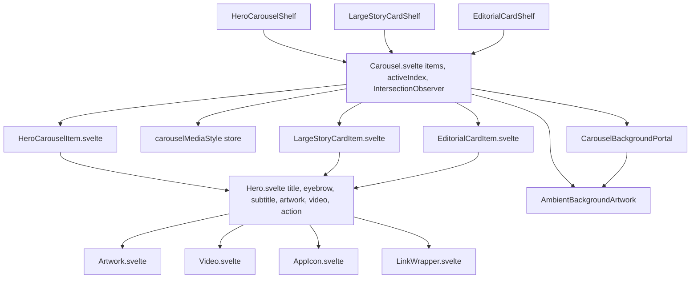
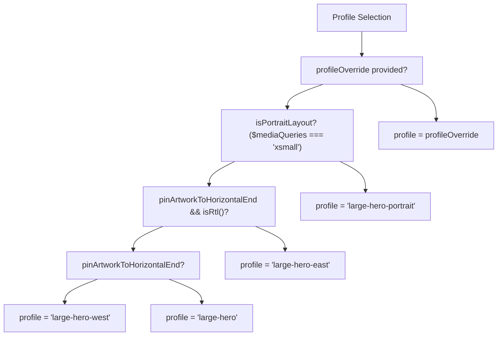
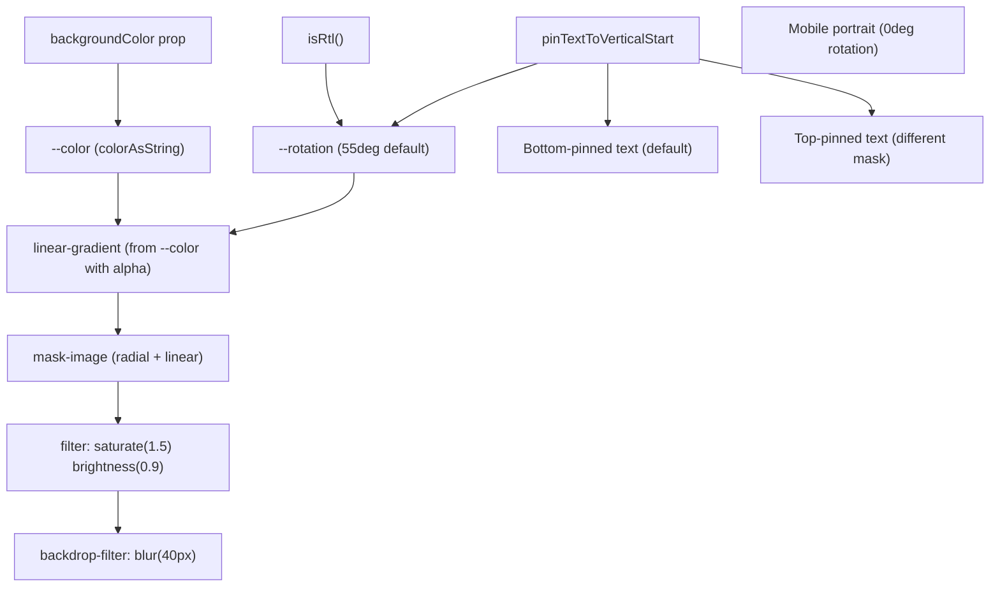
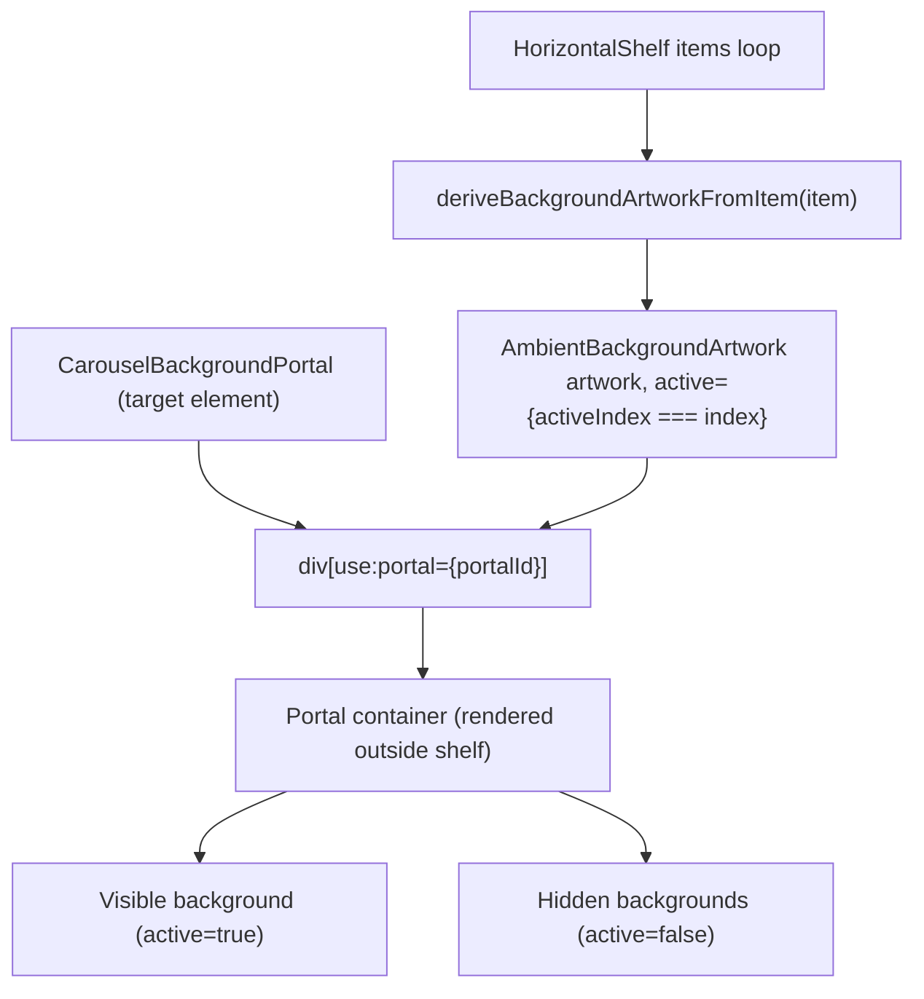

# 英雄与轮播组件 (Hero and Carousel Components)

-   [src/components/hero/Carousel.svelte](https://github.com/Chesszyh/apps.apple.com/blob/279d0c4d/src/components/hero/Carousel.svelte)
-   [src/components/hero/Hero.svelte](https://github.com/Chesszyh/apps.apple.com/blob/279d0c4d/src/components/hero/Hero.svelte)
-   [src/components/jet/item/EditorialCardItem.svelte](https://github.com/Chesszyh/apps.apple.com/blob/279d0c4d/src/components/jet/item/EditorialCardItem.svelte)
-   [src/components/jet/item/HeroCarouselItem.svelte](https://github.com/Chesszyh/apps.apple.com/blob/279d0c4d/src/components/jet/item/HeroCarouselItem.svelte)
-   [src/components/jet/item/LargeStoryCardItem.svelte](https://github.com/Chesszyh/apps.apple.com/blob/279d0c4d/src/components/jet/item/LargeStoryCardItem.svelte)

## 目的与范围 (Purpose and Scope)

英雄与轮播系统为在整个 App Store Web 应用程序中显示大型推广内容提供了一种通用的、可复用的模式。`Hero` 组件 ([src/components/hero/Hero.svelte](https://github.com/Chesszyh/apps.apple.com/blob/279d0c4d/src/components/hero/Hero.svelte)) 为包含艺术资产、视频、文本叠加层和渐变的单个项目实现了灵活的布局，而 `Carousel` ([src/components/hero/Carousel.svelte](https://github.com/Chesszyh/apps.apple.com/blob/279d0c4d/src/components/hero/Carousel.svelte)) 则编排了多个英雄项目，具有水平滚动、活动项检测和环境背景效果。

本文档涵盖了通用的英雄与轮播基础设施。有关使用这些组件的特定货架类型，请参阅 [Editorial and Promotional Shelves](#7.1)。有关底层图像系统，请参阅 [Artwork and Media System](#5.1)。有关水平滚动机制，请参阅 [Scrollable Shelves](#5.2)。

---

## 架构概览 (Architecture Overview)

英雄/轮播系统实现了一个三层架构：通用的 `Hero` 组件提供布局和样式，`Carousel` 组件管理编排和状态，而特定的项目组件（如 `HeroCarouselItem`、`LargeStoryCardItem`、`EditorialCardItem`）将数据模型绑定到 Hero 接口。


**来源：** [src/components/hero/Hero.svelte1-537](https://github.com/Chesszyh/apps.apple.com/blob/279d0c4d/src/components/hero/Hero.svelte#L1-L537) [src/components/hero/Carousel.svelte1-133](https://github.com/Chesszyh/apps.apple.com/blob/279d0c4d/src/components/hero/Carousel.svelte#L1-L133) [src/components/jet/item/HeroCarouselItem.svelte1-61](https://github.com/Chesszyh/apps.apple.com/blob/279d0c4d/src/components/jet/item/HeroCarouselItem.svelte#L1-L61) [src/components/jet/item/LargeStoryCardItem.svelte1-39](https://github.com/Chesszyh/apps.apple.com/blob/279d0c4d/src/components/jet/item/LargeStoryCardItem.svelte#L1-L39) [src/components/jet/item/EditorialCardItem.svelte1-42](https://github.com/Chesszyh/apps.apple.com/blob/279d0c4d/src/components/jet/item/EditorialCardItem.svelte#L1-L42)

---

## 英雄组件接口 (Hero Component Interface)

`Hero.svelte` 提供了一个通用的、与数据模型无关的接口来渲染大型内容。该组件接受所有视觉元素的各种可选属性 (props)，从而实现在不同货架类型之间的复用。

### 核心属性 (Core Props)

| 属性 (Prop) | 类型 | 用途 |
| --- | --- | --- |
| `title` | `Opt<string>` | 主标题文本 |
| `eyebrow` | `Opt<string>` | 标题上方的文本（可由插槽覆盖） |
| `subtitle` | `Opt<string>` | 标题下方的文本 |
| `backgroundColor` | `Opt<Color>` | 用于渐变的主要强调色 |
| `artwork` | `Opt<ArtworkModel>` | 要显示的静态图像 |
| `video` | `Opt<VideoModel>` | 视频（优先级高于艺术资产） |
| `action` | `Opt<Action>` | 整个项目的点击操作 |
| `collectionIcons` | `ArtworkModel[]` | 用于集合展示的 App 图标数组 |
| `isMediaDark` | `boolean` | 控制文本颜色方案（默认值：true） |

**来源：** [src/components/hero/Hero.svelte30-91](https://github.com/Chesszyh/apps.apple.com/blob/279d0c4d/src/components/hero/Hero.svelte#L30-L91)

### 布局控制属性 (Layout Control Props)

Hero 组件通过布尔标志支持灵活的艺术资产和文本定位：

| 属性 (Prop) | 行为 |
| --- | --- |
| `pinArtworkToHorizontalEnd` | 将艺术资产与右边缘 (LTR) 或左边缘 (RTL) 对齐 |
| `pinArtworkToVerticalMiddle` | 将艺术资产垂直居中（默认位于顶部） |
| `pinTextToVerticalStart` | 将文本置于顶部（默认位于底部） |
| `profileOverride` | 覆盖自动选用的配置文件 |

**来源：** [src/components/hero/Hero.svelte71-86](https://github.com/Chesszyh/apps.apple.com/blob/279d0c4d/src/components/hero/Hero.svelte#L71-L86)

### 配置文件解析逻辑 (Profile Resolution Logic)

组件会根据视口和布局标志自动选择艺术资产配置文件：


**来源：** [src/components/hero/Hero.svelte99-111](https://github.com/Chesszyh/apps.apple.com/blob/279d0c4d/src/components/hero/Hero.svelte#L99-L111)

---

## 渲染模式 (Rendering Modes)

Hero 组件根据可用的媒体支持三种不同的渲染模式：

### 1. 艺术资产/视频模式 (Artwork/Video Mode)

当提供了 `artwork` 或 `video` 属性时，组件在带有渐变叠加层的绝对定位容器中渲染媒体：

-   当 `!$prefersReducedMotion` 时播放视频 ([src/components/hero/Hero.svelte143-150](https://github.com/Chesszyh/apps.apple.com/blob/279d0c4d/src/components/hero/Hero.svelte#L143-L150))。
-   艺术资产使用选定的配置文件，且 `useCropCodeFromArtwork={false}` 并且 `withoutBorder={true}` ([src/components/hero/Hero.svelte152-158](https://github.com/Chesszyh/apps.apple.com/blob/279d0c4d/src/components/hero/Hero.svelte#L152-L158))。
-   来自 `backgroundColor` 属性的背景颜色填充容器 ([src/components/hero/Hero.svelte141-142](https://github.com/Chesszyh/apps.apple.com/blob/279d0c4d/src/components/hero/Hero.svelte#L141-L142))。

### 2. 集合图标模式 (Collection Icons Mode)

当提供 `collectionIcons` 数组（无艺术资产/视频）时，在具有动画渐变背景的网格中显示最多 5 个 App 图标：

-   图标排列在 2 行网格中，使用 `grid-template-rows: auto auto` ([src/components/hero/Hero.svelte428-442](https://github.com/Chesszyh/apps.apple.com/blob/279d0c4d/src/components/hero/Hero.svelte#L428-L442))。
-   渐变使用 `getBackgroundGradientCSSVarsFromArtworks()` 根据图标背景颜色构建 ([src/components/hero/Hero.svelte117-126](https://github.com/Chesszyh/apps.apple.com/blob/279d0c4d/src/components/hero/Hero.svelte#L117-L126))。
-   动画在 16 秒内移动渐变停止点 ([src/components/hero/Hero.svelte511-535](https://github.com/Chesszyh/apps.apple.com/blob/279d0c4d/src/components/hero/Hero.svelte#L511-L535))。

### 3. 仅文本模式 (Text-Only Mode)

当未提供媒体时，仅显示带有渐变背景的文本内容。

**来源：** [src/components/hero/Hero.svelte136-178](https://github.com/Chesszyh/apps.apple.com/blob/279d0c4d/src/components/hero/Hero.svelte#L136-L178)

---

## 渐变系统 (Gradient System)

Hero 组件实现了复杂的渐变叠加层以保证文本的可读性。渐变被绝对定位在 `z-index: -1` 处，并使用了多种遮罩技术：


渐变使用 `rgb(from var(--color) r g b / 0.25)` 语法从背景颜色派生出一个半透明版本 ([src/components/hero/Hero.svelte389-393](https://github.com/Chesszyh/apps.apple.com/blob/279d0c4d/src/components/hero/Hero.svelte#L389-L393))。根据文本位置应用不同的 `mask-image` 模式 ([src/components/hero/Hero.svelte397-426](https://github.com/Chesszyh/apps.apple.com/blob/279d0c4d/src/components/hero/Hero.svelte#L397-L426))。

**来源：** [src/components/hero/Hero.svelte366-426](https://github.com/Chesszyh/apps.apple.com/blob/279d0c4d/src/components/hero/Hero.svelte#L366-L426)

---

## 文本颜色模式 (Text Color Modes)

组件根据媒体亮度调整文本颜色：

| 条件 | 主要颜色 | 次要颜色 | 混合模式 |
| --- | --- | --- | --- |
| `with-dark-media` | `--systemPrimary-onDark` | `--systemSecondary-onDark` | `plus-lighter` |
| `with-collection-icons` | `--systemPrimary-onDark` | `--systemSecondary-onDark` | `plus-lighter` |
| 默认 | `--systemPrimary-onLight` | `--systemSecondary-onLight` | `normal` |

`plus-lighter` 混合模式增强了暗色背景上的文本可见性 ([src/components/hero/Hero.svelte231-237](https://github.com/Chesszyh/apps.apple.com/blob/279d0c4d/src/components/hero/Hero.svelte#L231-L237))。

**来源：** [src/components/hero/Hero.svelte207-237](https://github.com/Chesszyh/apps.apple.com/blob/279d0c4d/src/components/hero/Hero.svelte#L207-L237)

---

## 轮播编排 (Carousel Orchestration)

`Carousel.svelte` 是一个通用组件，用于管理多个英雄项目，通过交叉观察 (intersection observation) 追踪活动项，并协调环境背景效果。

### 组件接口 (Component Interface)

```
interface CarouselProps<Item> {    shelf: Shelf;                    // 货架配置    items: Item[];                   // 要渲染的泛型项目数组    deriveBackgroundArtworkFromItem: (item: Item) => Opt<Artwork>;}interface CarouselSlots<Item> {    default: {        item: Item;                  // 要渲染的当前项目    };}
```
该组件使用 Svelte 泛型 (`<script lang="ts" generics="Item">`) 以支持任何项目类型 ([src/components/hero/Carousel.svelte6](https://github.com/Chesszyh/apps.apple.com/blob/279d0c4d/src/components/hero/Carousel.svelte#L6-L6))。

**来源：** [src/components/hero/Carousel.svelte22-45](https://github.com/Chesszyh/apps.apple.com/blob/279d0c4d/src/components/hero/Carousel.svelte#L22-L45)

---

## 活动项检测 (Active Item Detection)

轮播使用 `IntersectionObserver` 来检测当前可见的英雄项目，更新 `activeIndex` 以及全局 `carouselMediaStyle` store：

> **[Mermaid sequence]**
> *(图表结构无法解析)*

回调函数使用动态属性访问从项目中提取样式信息：

```
const { style, mediaOverlayStyle, isMediaDark } = items[index] as any;const fallbackStyle = 'dark';let derivedStyle;if (typeof isMediaDark !== 'undefined') {    derivedStyle = isMediaDark ? 'dark' : 'light';}carouselMediaStyle.set(    style || mediaOverlayStyle || derivedStyle || fallbackStyle,);
```
**来源：** [src/components/hero/Carousel.svelte58-81](https://github.com/Chesszyh/apps.apple.com/blob/279d0c4d/src/components/hero/Carousel.svelte#L58-L81)

### 视口特定的阈值 (Viewport-Specific Thresholds)

根据视口大小使用不同的交叉阈值：

-   **xsmall 视口**：`threshold: 0.5`（50% 可见） ([src/components/hero/Carousel.svelte98-106](https://github.com/Chesszyh/apps.apple.com/blob/279d0c4d/src/components/hero/Carousel.svelte#L98-L106))。
-   **small 及以上视口**：`threshold: 0`（任何可见部分） ([src/components/hero/Carousel.svelte108-130](https://github.com/Chesszyh/apps.apple.com/blob/279d0c4d/src/components/hero/Carousel.svelte#L108-L130))。

移动端较高的阈值确保了完全滚动到的项目被标记为活动项，而桌面端较低的阈值则提供了更早的环境背景更新。

**来源：** [src/components/hero/Carousel.svelte98-130](https://github.com/Chesszyh/apps.apple.com/blob/279d0c4d/src/components/hero/Carousel.svelte#L98-L130)

---

## 环境背景系统 (Ambient Background System)

在非移动视口上，轮播通过传送门 (portal) 系统渲染 `AmbientBackgroundArtwork` 组件。每个英雄项目都有一个对应的背景艺术资产，当该项目变为活动项时显示：


传送门系统 (`use:portal={portalId}`) 将背景艺术资产元素远程传送到可滚动货架之外的共享容器，防止它们随关联项目一起滚动 ([src/components/hero/Carousel.svelte119](https://github.com/Chesszyh/apps.apple.com/blob/279d0c4d/src/components/hero/Carousel.svelte#L119-L119))。

在 SSR 期间跳过背景渲染 (`!import.meta.env.SSR`)，以避免激活 (hydration) 不匹配 ([src/components/hero/Carousel.svelte114](https://github.com/Chesszyh/apps.apple.com/blob/279d0c4d/src/components/hero/Carousel.svelte#L114-L114))。

**来源：** [src/components/hero/Carousel.svelte15-126](https://github.com/Chesszyh/apps.apple.com/blob/279d0c4d/src/components/hero/Carousel.svelte#L15-L126)

---

## 与项目类型的集成 (Integration with Item Types)

特定于项目的组件将数据模型适配到 Hero 接口。这种模式将英雄组件与具体的 API 模型解耦。

### HeroCarouselItem 适配器 (HeroCarouselItem Adapter)

将 `HeroCarouselItem` 模型映射到英雄组件属性：

| 模型属性 | 英雄组件属性 | 转换 |
| --- | --- | --- |
| `item.overlay.titleText` | `title` | 直接映射 |
| `item.overlay.badgeText` | `eyebrow` | 直接映射 |
| `item.overlay.descriptionText` | `subtitle` | 直接映射 |
| `item.artwork || item.video?.preview` | `artwork` | 回退链 |
| `isXSmallViewport ? item.portraitVideo : item.video` | `video` | 基于视口的选择 |
| `item.overlay.clickAction` | `action` | 直接映射 |

该组件还渲染有条件的插槽：

-   `overlayType === 'singleModule'`：渲染 `HeroAppLockup` ([src/components/jet/item/HeroCarouselItem.svelte41-42](https://github.com/Chesszyh/apps.apple.com/blob/279d0c4d/src/components/jet/item/HeroCarouselItem.svelte#L41-L42))。
-   `callToActionText && !isPortraitLayout`：渲染 CTA 按钮 ([src/components/jet/item/HeroCarouselItem.svelte43-48](https://github.com/Chesszyh/apps.apple.com/blob/279d0c4d/src/components/jet/item/HeroCarouselItem.svelte#L43-L48))。

**来源：** [src/components/jet/item/HeroCarouselItem.svelte1-61](https://github.com/Chesszyh/apps.apple.com/blob/279d0c4d/src/components/jet/item/HeroCarouselItem.svelte#L1-L61)

### LargeStoryCardItem 适配器 (LargeStoryCardItem Adapter)

映射 `TodayCard` 模型，并根据视口和 RTL 进行配置文件选择：

```
$: profile = isXSmallViewport    ? 'large-hero-story-card-portrait'    : isRtl()    ? 'large-hero-story-card-rtl'    : 'large-hero-story-card';
```
设置特定于故事卡片设计的布局标志：

-   `pinArtworkToVerticalMiddle={true}`
-   `pinArtworkToHorizontalEnd={true}`
-   `pinTextToVerticalStart={isRtl()}`

**来源：** [src/components/jet/item/LargeStoryCardItem.svelte1-39](https://github.com/Chesszyh/apps.apple.com/blob/279d0c4d/src/components/jet/item/LargeStoryCardItem.svelte#L1-L39)

### EditorialCardItem 适配器 (EditorialCardItem Adapter)

映射 `EditorialCard` 模型，并为应用事件日期提供自定义的 eyebrow 插槽：

```
<svelte:fragment slot="eyebrow">    {#if item.appEventFormattedDates}        <AppEventDate formattedDates={item.appEventFormattedDates} />    {:else}        {item.caption}    {/if}</svelte:fragment>
```
当 `item.lockup` 存在时，在 details 插槽中渲染 `AppLockupDetail` ([src/components/jet/item/EditorialCardItem.svelte33-40](https://github.com/Chesszyh/apps.apple.com/blob/279d0c4d/src/components/jet/item/EditorialCardItem.svelte#L33-L40))。

**来源：** [src/components/jet/item/EditorialCardItem.svelte1-42](https://github.com/Chesszyh/apps.apple.com/blob/279d0c4d/src/components/jet/item/EditorialCardItem.svelte#L1-L42)

---

## 响应式行为 (Responsive Behavior)

英雄组件在各个视口断点上调整其布局：

| 视口 | 长宽比 | 文本宽度 | 文本位置 | 圆角 |
| --- | --- | --- | --- | --- |
| xsmall | 3:4 (纵向) | 100% | 居中对齐 | 无 |
| small | 16:9 | 50% | 左对齐 | `--global-border-radius-large` |
| medium 及以上 | 16:9 | 40% | 左对齐 | `--global-border-radius-large` |

额外的响应式约束：

-   **最小高度 (small 及以上)**：`360px` ([src/components/hero/Hero.svelte224](https://github.com/Chesszyh/apps.apple.com/blob/279d0c4d/src/components/hero/Hero.svelte#L224-L224))。
-   **最大高度 (small 及以上)**：`min(60vh, 770px)` ([src/components/hero/Hero.svelte225](https://github.com/Chesszyh/apps.apple.com/blob/279d0c4d/src/components/hero/Hero.svelte#L225-L225))。
-   **容器查询**：当 `height < 420px` 时调整标题字体大小 ([src/components/hero/Hero.svelte335-339](https://github.com/Chesszyh/apps.apple.com/blob/279d0c4d/src/components/hero/Hero.svelte#L335-L339))。

**来源：** [src/components/hero/Hero.svelte207-365](https://github.com/Chesszyh/apps.apple.com/blob/279d0c4d/src/components/hero/Hero.svelte#L207-L365)

---

## 水平钉定与长宽比处理 (Horizontal Pinning and Aspect Ratio Handling)

当 `pinArtworkToHorizontalEnd={true}` 时，英雄组件实现了特殊逻辑来处理与容器不匹配的艺术资产长宽比：

```
.image-container.pinned-to-horizontal-end :global(.artwork-component img) {    height: 100%;    width: auto;    position: absolute;    inset-inline-end: 0;    @container hero-container (aspect-ratio >= 279/100) {        width: 100%;        height: auto;    }}
```
针对具有 2.25:1 长宽比的故事卡片配置文件，当容器超过该比例时切换为全宽 ([src/components/hero/Hero.svelte280-292](https://github.com/Chesszyh/apps.apple.com/blob/279d0c4d/src/components/hero/Hero.svelte#L280-L292))。

**来源：** [src/components/hero/Hero.svelte258-292](https://github.com/Chesszyh/apps.apple.com/blob/279d0c4d/src/components/hero/Hero.svelte#L258-L292)

---

## 使用模式 (Usage Pattern)

在货架组件中的典型用法：

```
<Carousel    {shelf}    items={shelf.items}    deriveBackgroundArtworkFromItem={(item) => item.backgroundArtwork}    let:item>    <HeroCarouselItem {item} /></Carousel>
```
插槽模式允许每个货架提供自己的项目适配器组件，同时由 Carousel 处理编排。

**来源：** [src/components/hero/Carousel.svelte86-132](https://github.com/Chesszyh/apps.apple.com/blob/279d0c4d/src/components/hero/Carousel.svelte#L86-L132)
