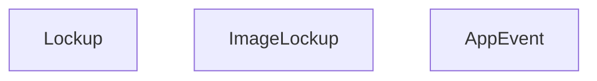
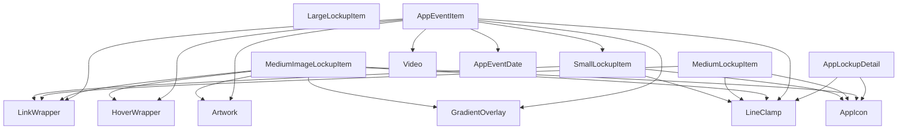
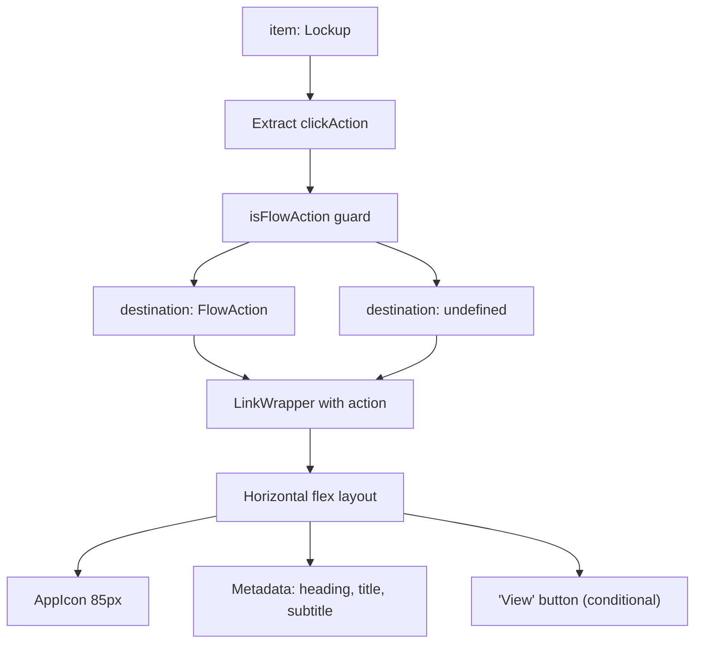
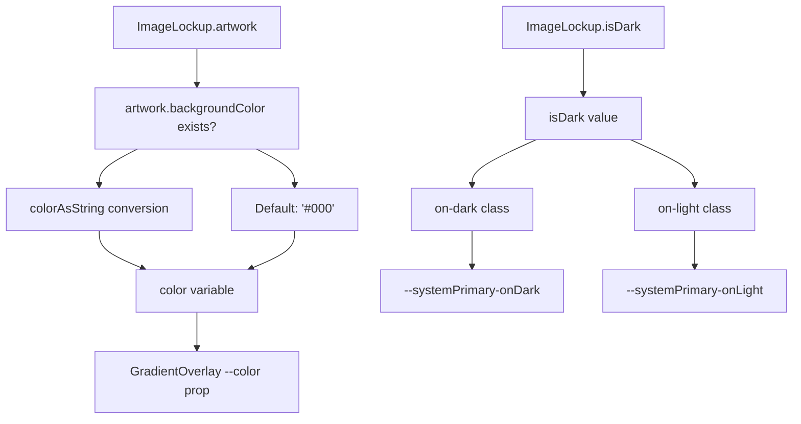
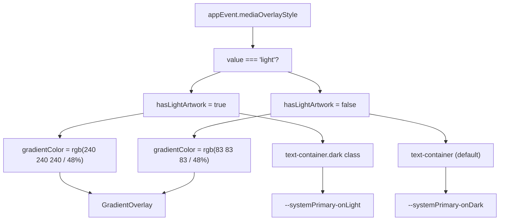
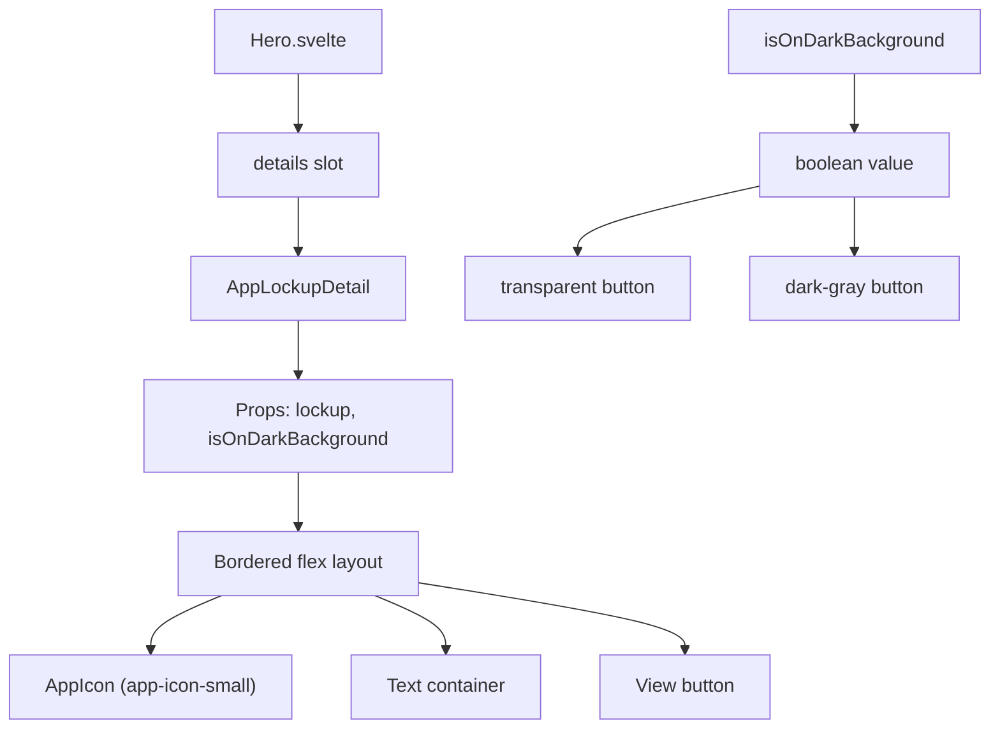
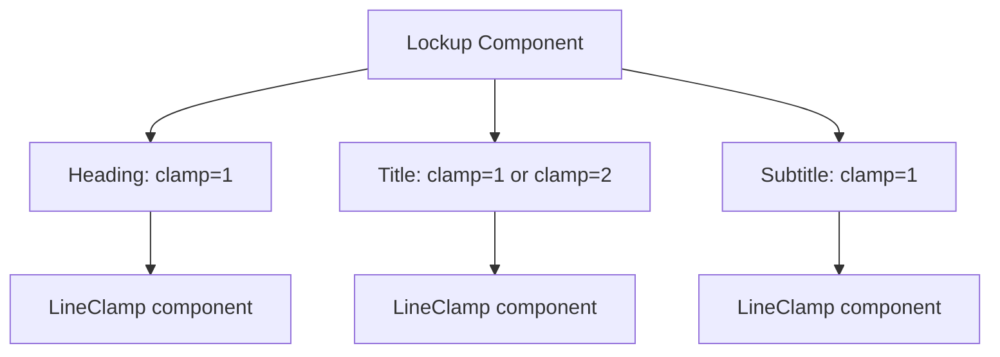
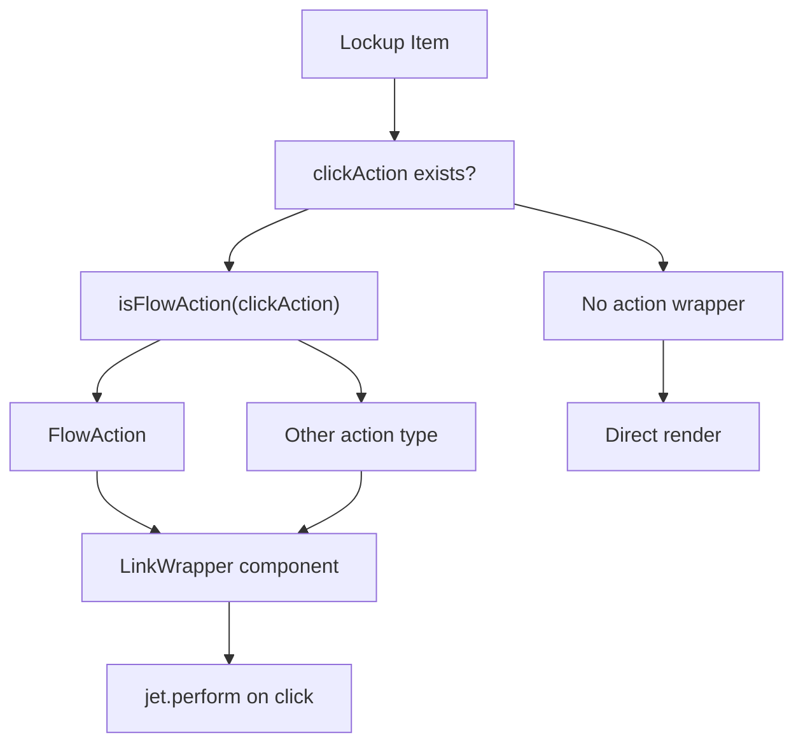
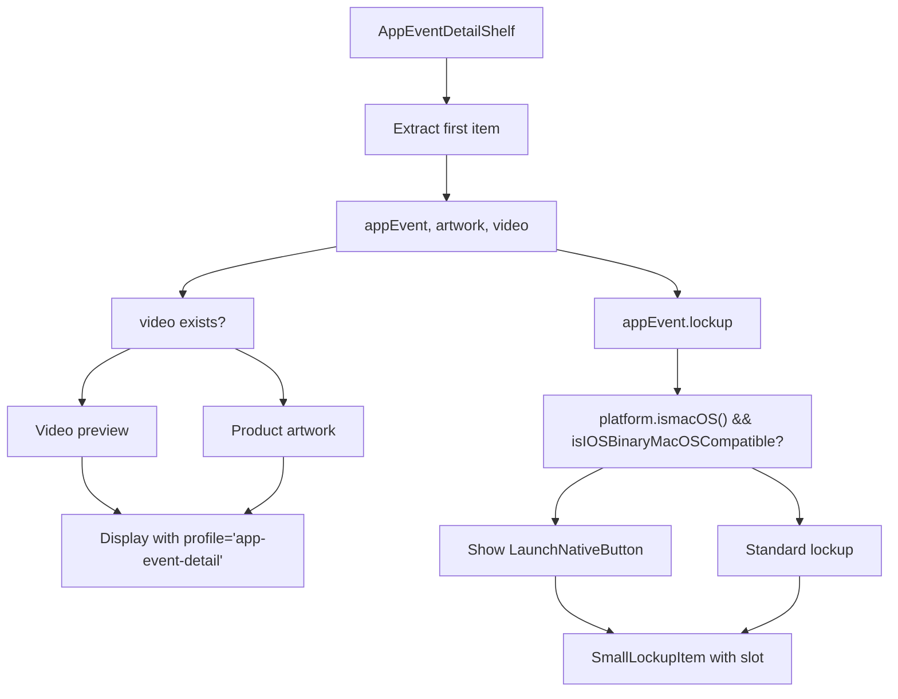
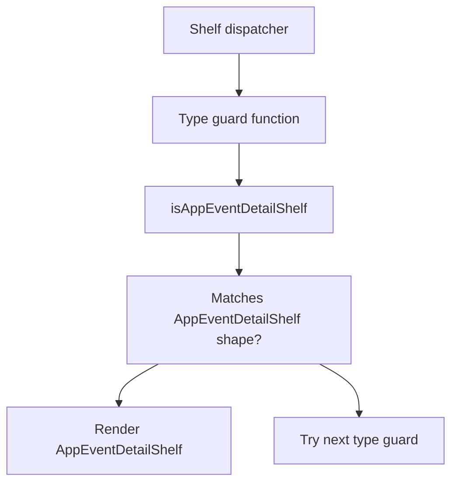

# 锁定组件 (Lockup Components)

-   [src/components/hero/AppLockupDetail.svelte](https://github.com/Chesszyh/apps.apple.com/blob/279d0c4d/src/components/hero/AppLockupDetail.svelte)
-   [src/components/jet/item/AppEventItem.svelte](https://github.com/Chesszyh/apps.apple.com/blob/279d0c4d/src/components/jet/item/AppEventItem.svelte)
-   [src/components/jet/item/MediumImageLockupItem.svelte](https://github.com/Chesszyh/apps.apple.com/blob/279d0c4d/src/components/jet/item/MediumImageLockupItem.svelte)
-   [src/components/jet/item/MediumLockupItem.svelte](https://github.com/Chesszyh/apps.apple.com/blob/279d0c4d/src/components/jet/item/MediumLockupItem.svelte)
-   [src/components/jet/shelf/AppEventDetailShelf.svelte](https://github.com/Chesszyh/apps.apple.com/blob/279d0c4d/src/components/jet/shelf/AppEventDetailShelf.svelte)

## 目的与范围 (Purpose and Scope)

锁定 (Lockup) 组件是一系列标准化的项目级组件，用于显示 App 信息，包括图标、标题、元数据和操作按钮。它们是 App Store Web 应用程序中 App 和内容的主要呈现模式。

本页面记录了完整的锁定组件系列：`SmallLockupItem`、`MediumLockupItem`、`LargeLockupItem`、图像锁定变体、App 事件项以及 `AppLockupDetail`。有关编排这些组件的基于锁定的货架的信息，请参阅 [Lockup and Grid Shelves](#7.2)。有关使用 `AppLockupDetail` 的通用英雄 (Hero) 组件的信息，请参阅 [Hero and Carousel Components](#5.4)。

---

## 组件系列概览 (Component Family Overview)

锁定组件系列由针对不同显示上下文和内容类型进行优化的多个变体组成：

| 组件 | 数据模型 | 主要用例 | 关键特性 |
| --- | --- | --- | --- |
| `SmallLockupItem` | `Lockup` | 紧凑的 App 列表、行内显示 | 水平布局、64px 图标、单行文本 |
| `MediumLockupItem` | `Lockup` | 标准 App 列表 | 水平布局、85px 图标、多行文本 |
| `LargeLockupItem` | `Lockup` | 突出的 App 显示 | 更大的图标、扩展的元数据 |
| `MediumImageLockupItem` | `ImageLockup` | 编辑内容 | 带有叠加锁定的艺术资产背景 |
| `AppEventItem` | `AppEvent` | App 内事件 | 带有事件详情的视频/艺术资产，可选锁定项 |
| `AppLockupDetail` | `Lockup` | 英雄轮播详情 | 专为暗色背景设计，Hero 插槽集成 |

---

## 数据模型结构 (Data Model Structure)


**来源：** [src/components/jet/item/MediumLockupItem.svelte1-22](https://github.com/Chesszyh/apps.apple.com/blob/279d0c4d/src/components/jet/item/MediumLockupItem.svelte#L1-L22) [src/components/jet/item/MediumImageLockupItem.svelte1-17](https://github.com/Chesszyh/apps.apple.com/blob/279d0c4d/src/components/jet/item/MediumImageLockupItem.svelte#L1-L17) [src/components/jet/item/AppEventItem.svelte1-23](https://github.com/Chesszyh/apps.apple.com/blob/279d0c4d/src/components/jet/item/AppEventItem.svelte#L1-L23)

---

## 组件层级与原语用法 (Component Hierarchy and Primitive Usage)

所有锁定组件都通过组合原语组件来构建其界面。下图展示了组件之间的关系：


**来源：** [src/components/jet/item/MediumLockupItem.svelte8-11](https://github.com/Chesszyh/apps.apple.com/blob/279d0c4d/src/components/jet/item/MediumLockupItem.svelte#L8-L11) [src/components/jet/item/MediumImageLockupItem.svelte4-10](https://github.com/Chesszyh/apps.apple.com/blob/279d0c4d/src/components/jet/item/MediumImageLockupItem.svelte#L4-L10) [src/components/jet/item/AppEventItem.svelte4-12](https://github.com/Chesszyh/apps.apple.com/blob/279d0c4d/src/components/jet/item/AppEventItem.svelte#L4-L12) [src/components/hero/AppLockupDetail.svelte9-13](https://github.com/Chesszyh/apps.apple.com/blob/279d0c4d/src/components/hero/AppLockupDetail.svelte#L9-L13)

---

## MediumLockupItem

`MediumLockupItem` 是标准的水平锁定组件，以水平排列方式显示 App 图标和元数据。

### 结构 (Structure)

该组件渲染：

1.  **App 图标容器**：85px 宽，使用 `app-icon-medium` 配置文件
2.  **元数据容器**：具有标题、副标题和标语 (heading) 的自适应宽度
3.  **按钮容器**：当存在 `clickAction` 时显示的“查看”按钮

### 实现详情 (Implementation Details)


**文件：** [src/components/jet/item/MediumLockupItem.svelte](https://github.com/Chesszyh/apps.apple.com/blob/279d0c4d/src/components/jet/item/MediumLockupItem.svelte)

**关键代码实体：**

-   组件接受 `item: Lockup` 属性 [src/components/jet/item/MediumLockupItem.svelte14](https://github.com/Chesszyh/apps.apple.com/blob/279d0c4d/src/components/jet/item/MediumLockupItem.svelte#L14-L14)
-   使用 `isFlowAction` 类型守卫 [src/components/jet/item/MediumLockupItem.svelte19-21](https://github.com/Chesszyh/apps.apple.com/blob/279d0c4d/src/components/jet/item/MediumLockupItem.svelte#L19-L21)
-   使用 `LinkWrapper` 包装内容 [src/components/jet/item/MediumLockupItem.svelte24](https://github.com/Chesszyh/apps.apple.com/blob/279d0c4d/src/components/jet/item/MediumLockupItem.svelte#L24-L24)
-   图标使用配置文件 `"app-icon-medium"` [src/components/jet/item/MediumLockupItem.svelte29](https://github.com/Chesszyh/apps.apple.com/blob/279d0c4d/src/components/jet/item/MediumLockupItem.svelte#L29-L29)
-   文本使用 `LineClamp` 并设置 `clamp={1}` 以实现单行截断 [src/components/jet/item/MediumLockupItem.svelte40-42](https://github.com/Chesszyh/apps.apple.com/blob/279d0c4d/src/components/jet/item/MediumLockupItem.svelte#L40-L42)

### 样式系统 (Styling System)

| 元素 | CSS 类 | 字体变量 | 用途 |
| --- | --- | --- | --- |
| 标语 (Heading) | `.heading` | `--callout-emphasized` | 眉标文本 |
| 标题 | `h3` | `--title-3` | 主要 App 名称 |
| 副标题 | `p` | `--callout` | 次要元数据 |
| 按钮 | `.get-button.gray` | 继承 | 操作引导 |

**来源：** [src/components/jet/item/MediumLockupItem.svelte62-96](https://github.com/Chesszyh/apps.apple.com/blob/279d0c4d/src/components/jet/item/MediumLockupItem.svelte#L62-L96)

---

## MediumImageLockupItem

`MediumImageLockupItem` 呈现一个叠加在艺术资产上的锁定项，通常用于编辑内容和精选合集。

### 视觉构成 (Visual Composition)

该组件创建了一个具有三个 z-index 层级的分层显示：

1.  **基础层 (Base Layer)** (z-index: 0)：使用 `"brick"` 配置文件渲染的艺术资产
2.  **叠加层 (Overlay Layer)** (z-index: 1)：使用艺术资产背景颜色的 `GradientOverlay`
3.  **内容层 (Content Layer)** (z-index: 2)：在底部绝对定位的锁定元数据

### 颜色处理 (Color Handling)


**文件：** [src/components/jet/item/MediumImageLockupItem.svelte](https://github.com/Chesszyh/apps.apple.com/blob/279d0c4d/src/components/jet/item/MediumImageLockupItem.svelte)

**关键代码实体：**

-   组件接受 `item: ImageLockup` [src/components/jet/item/MediumImageLockupItem.svelte12](https://github.com/Chesszyh/apps.apple.com/blob/279d0c4d/src/components/jet/item/MediumImageLockupItem.svelte#L12-L12)
-   提取背景颜色 [src/components/jet/item/MediumImageLockupItem.svelte14-16](https://github.com/Chesszyh/apps.apple.com/blob/279d0c4d/src/components/jet/item/MediumImageLockupItem.svelte#L14-L16)
-   艺术资产使用 `profile="brick"` [src/components/jet/item/MediumImageLockupItem.svelte23](https://github.com/Chesszyh/apps.apple.com/blob/279d0c4d/src/components/jet/item/MediumImageLockupItem.svelte#L23-L23)
-   渐变具有 `--height="90%"` [src/components/jet/item/MediumImageLockupItem.svelte60](https://github.com/Chesszyh/apps.apple.com/blob/279d0c4d/src/components/jet/item/MediumImageLockupItem.svelte#L60-L60)

### 响应式行为 (Responsive Behavior)

该组件使用容器查询来在不同宽度下调整内边距：

| 容器宽度 | 锁定内边距 | 用例 |
| --- | --- | --- |
| \> 260px | `0 20px 20px` | 标准布局 |
| ≤ 260px | `0 10px 10px` | 紧凑布局 |

**来源：** [src/components/jet/item/MediumImageLockupItem.svelte65-118](https://github.com/Chesszyh/apps.apple.com/blob/279d0c4d/src/components/jet/item/MediumImageLockupItem.svelte#L65-L118)

---

## AppEventItem

`AppEventItem` 显示 App 内事件，包含视频或艺术资产、事件元数据以及一个可选的 App 锁定项。

### 渲染模式 (Rendering Modes)

该组件支持三种渲染配置：

| 模式 | 条件 | 视觉输出 |
| --- | --- | --- |
| 带有锁定的视频 | 存在 `video` 和 `lockup`，且 `hideLockupWhenNotInstalled` 为 false | 视频 + 事件文本 + `SmallLockupItem` 下托 (chin) |
| 带有锁定的艺术资产 | 存在 `moduleArtwork` 和 `lockup`，且 `hideLockupWhenNotInstalled` 为 false | 艺术资产 + 事件文本 + `SmallLockupItem` 下托 |
| 仅视频/艺术资产 | `hideLockupWhenNotInstalled` 为 true | 媒体 + 事件文本，无锁定项 |

### 媒体叠加系统 (Media Overlay System)


**文件：** [src/components/jet/item/AppEventItem.svelte](https://github.com/Chesszyh/apps.apple.com/blob/279d0c4d/src/components/jet/item/AppEventItem.svelte)

**关键代码实体：**

-   组件接受 `item: AppEvent` [src/components/jet/item/AppEventItem.svelte13](https://github.com/Chesszyh/apps.apple.com/blob/279d0c4d/src/components/jet/item/AppEventItem.svelte#L13-L13)
-   确定媒体叠加样式 [src/components/jet/item/AppEventItem.svelte18-21](https://github.com/Chesszyh/apps.apple.com/blob/279d0c4d/src/components/jet/item/AppEventItem.svelte#L18-L21)
-   锁定项可见性逻辑 [src/components/jet/item/AppEventItem.svelte22](https://github.com/Chesszyh/apps.apple.com/blob/279d0c4d/src/components/jet/item/AppEventItem.svelte#L22-L22)
-   使用 `profile="app-promotion"` 进行视频渲染 [src/components/jet/item/AppEventItem.svelte44](https://github.com/Chesszyh/apps.apple.com/blob/279d0c4d/src/components/jet/item/AppEventItem.svelte#L44-L44)
-   嵌套的 `SmallLockupItem` [src/components/jet/item/AppEventItem.svelte82](https://github.com/Chesszyh/apps.apple.com/blob/279d0c4d/src/components/jet/item/AppEventItem.svelte#L82-L82)

### 网格布局结构 (Grid Layout Structure)

该组件使用具有命名区域的 CSS Grid：

```
grid-template-areas:    'time-indicator'    'lockup';grid-template-rows: 1rem 1fr;
```
`text-over-artwork` 容器使用重叠网格模式，其中艺术资产、渐变和文本都指向 `grid-area: content`，从而使它们自然地堆叠。

**来源：** [src/components/jet/item/AppEventItem.svelte1-176](https://github.com/Chesszyh/apps.apple.com/blob/279d0c4d/src/components/jet/item/AppEventItem.svelte#L1-L176)

---

## AppLockupDetail

`AppLockupDetail` 是一种专门的锁定组件，设计用于 Hero 组件的 `details` 插槽。它能适应暗色/亮色背景，并提供带边框的呈现效果。

### 英雄集成模式 (Hero Integration Pattern)


**文件：** [src/components/hero/AppLockupDetail.svelte](https://github.com/Chesszyh/apps.apple.com/blob/279d0c4d/src/components/hero/AppLockupDetail.svelte)

**关键代码实体：**

-   组件接受 `lockup: Lockup` 和 `isOnDarkBackground: boolean` [src/components/hero/AppLockupDetail.svelte16-17](https://github.com/Chesszyh/apps.apple.com/blob/279d0c4d/src/components/hero/AppLockupDetail.svelte#L16-L17)
-   图标使用 `profile="app-icon-small"` (64px) [src/components/hero/AppLockupDetail.svelte23](https://github.com/Chesszyh/apps.apple.com/blob/279d0c4d/src/components/hero/AppLockupDetail.svelte#L23-L23)
-   按钮变体由 `isOnDarkBackground` 控制 [src/components/hero/AppLockupDetail.svelte49-51](https://github.com/Chesszyh/apps.apple.com/blob/279d0c4d/src/components/hero/AppLockupDetail.svelte#L49-L51)

### CSS 自定义属性 (CSS Custom Properties)

该组件使用作用域自定义属性进行主题设置：

| 属性 | 默认值 | 用途 |
| --- | --- | --- |
| `--hero-primary-color` | `--systemPrimary-onDark` | 文本颜色 |
| `--hero-divider-color` | `--systemQuaternary-onDark` | 边框颜色 |
| `--hero-secondary-color` | `--systemSecondary-onDark` | 标语颜色 |
| `--hero-text-blend-mode` | `plus-lighter` | 文本混合模式 |

这些变量允许 Hero 组件针对不同的背景上下文覆盖默认值。

**来源：** [src/components/hero/AppLockupDetail.svelte58-109](https://github.com/Chesszyh/apps.apple.com/blob/279d0c4d/src/components/hero/AppLockupDetail.svelte#L58-L109)

---

## 通用模式与原语用法 (Common Patterns and Primitive Usage)

### LineClamp 集成 (LineClamp Integration)

所有锁定组件都使用 `LineClamp` 来防止文本溢出：


**典型的截断值 (Typical Clamp Values)：**

-   **标语 (Heading)**：`clamp={1}` - 眉标文本采用单行
-   **标题 (Title)**：`clamp={1}` 或 `clamp={2}` - 随锁定尺寸而变化
-   **副标题 (Subtitle)**：`clamp={1}` - 元数据采用单行

**来源：** [src/components/jet/item/MediumLockupItem.svelte40-48](https://github.com/Chesszyh/apps.apple.com/blob/279d0c4d/src/components/jet/item/MediumLockupItem.svelte#L40-L48) [src/components/jet/item/MediumImageLockupItem.svelte40-55](https://github.com/Chesszyh/apps.apple.com/blob/279d0c4d/src/components/jet/item/MediumImageLockupItem.svelte#L40-L55) [src/components/hero/AppLockupDetail.svelte29-43](https://github.com/Chesszyh/apps.apple.com/blob/279d0c4d/src/components/hero/AppLockupDetail.svelte#L29-L43)

### 操作处理 (Action Handling)

锁定组件将点击处理委托给 `LinkWrapper`：


该模式使用类型守卫（通常是 `isFlowAction`）在传递给 `LinkWrapper` 之前安全地提取操作对象。

**来源：** [src/components/jet/item/MediumLockupItem.svelte18-24](https://github.com/Chesszyh/apps.apple.com/blob/279d0c4d/src/components/jet/item/MediumLockupItem.svelte#L18-L24) [src/components/jet/item/MediumImageLockupItem.svelte19](https://github.com/Chesszyh/apps.apple.com/blob/279d0c4d/src/components/jet/item/MediumImageLockupItem.svelte#L19-L19)

### AppIcon 配置文件用法 (AppIcon Profile Usage)

不同的锁定尺寸使用不同的 AppIcon 配置文件：

| 锁定变体 | 配置文件 | 渲染尺寸 | 上下文 |
| --- | --- | --- | --- |
| `SmallLockupItem` | `"app-icon"` 或 `"app-icon-small"` | 64px | 紧凑显示 |
| `MediumLockupItem` | `"app-icon-medium"` | 85px | 标准列表 |
| `LargeLockupItem` | `"app-icon-large"` | 120px+ | 突出的显示 |
| `AppLockupDetail` | `"app-icon-small"` | 64px | 英雄详情插槽 |
| `MediumImageLockupItem` | 默认配置文件 | 48px | 叠加上下文 |

**来源：** [src/components/jet/item/MediumLockupItem.svelte29](https://github.com/Chesszyh/apps.apple.com/blob/279d0c4d/src/components/jet/item/MediumLockupItem.svelte#L29-L29) [src/components/hero/AppLockupDetail.svelte23](https://github.com/Chesszyh/apps.apple.com/blob/279d0c4d/src/components/hero/AppLockupDetail.svelte#L23-L23) [src/components/jet/item/MediumImageLockupItem.svelte34](https://github.com/Chesszyh/apps.apple.com/blob/279d0c4d/src/components/jet/item/MediumImageLockupItem.svelte#L34-L34)

---

## AppEventDetailShelf 集成 (AppEventDetailShelf Integration)

`AppEventDetailShelf` 组件在事件详情上下文中使用 `SmallLockupItem` 来显示 App 信息。

### 货架级特性 (Shelf-Level Features)


**文件：** [src/components/jet/shelf/AppEventDetailShelf.svelte](https://github.com/Chesszyh/apps.apple.com/blob/279d0c4d/src/components/jet/shelf/AppEventDetailShelf.svelte)

**关键代码实体：**

-   导出类型守卫 `isAppEventDetailShelf` [src/components/jet/shelf/AppEventDetailShelf.svelte8](https://github.com/Chesszyh/apps.apple.com/blob/279d0c4d/src/components/jet/shelf/AppEventDetailShelf.svelte#L8-L8)
-   提取项目 [src/components/jet/shelf/AppEventDetailShelf.svelte27-30](https://github.com/Chesszyh/apps.apple.com/blob/279d0c4d/src/components/jet/shelf/AppEventDetailShelf.svelte#L27-L30)
-   macOS 兼容性检查 [src/components/jet/shelf/AppEventDetailShelf.svelte51-56](https://github.com/Chesszyh/apps.apple.com/blob/279d0c4d/src/components/jet/shelf/AppEventDetailShelf.svelte#L51-L56)
-   带有插槽用法的 `SmallLockupItem` [src/components/jet/shelf/AppEventDetailShelf.svelte118-129](https://github.com/Chesszyh/apps.apple.com/blob/279d0c4d/src/components/jet/shelf/AppEventDetailShelf.svelte#L118-L129)
-   集成“启动原生应用 (Launch Native)”按钮 [src/components/jet/shelf/AppEventDetailShelf.svelte124-127](https://github.com/Chesszyh/apps.apple.com/blob/279d0c4d/src/components/jet/shelf/AppEventDetailShelf.svelte#L124-L127)

### 响应式布局 (Responsive Layout)

货架根据视口调整其布局：

| 视口 | 长宽比 | 布局 | 媒体位置 |
| --- | --- | --- | --- |
| xsmall | 9:16 (纵向) | 堆叠 | 位于文本之后 |
| small+ | 16:9 (横向) | 并排 | 左侧列 (31.64% 宽度) |

**来源：** [src/components/jet/shelf/AppEventDetailShelf.svelte136-291](https://github.com/Chesszyh/apps.apple.com/blob/279d0c4d/src/components/jet/shelf/AppEventDetailShelf.svelte#L136-L291)

---

## 类型守卫与模型检测 (Type Guards and Model Detection)

锁定项相关的类型守卫实现了类型安全的货架渲染：


**导出的类型守卫：**

-   `isAppEventDetailShelf` 来自 [src/components/jet/shelf/AppEventDetailShelf.svelte8](https://github.com/Chesszyh/apps.apple.com/blob/279d0c4d/src/components/jet/shelf/AppEventDetailShelf.svelte#L8-L8)

货架组件分发器（参见 [Shelf System](#4.2)）使用这些类型守卫来确定页面货架数组中每个货架应渲染的组件。

**来源：** [src/components/jet/shelf/AppEventDetailShelf.svelte1-9](https://github.com/Chesszyh/apps.apple.com/blob/279d0c4d/src/components/jet/shelf/AppEventDetailShelf.svelte#L1-L9)
