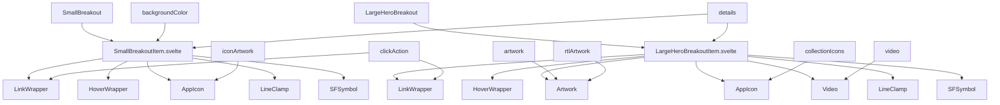
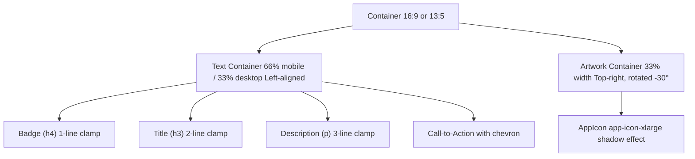
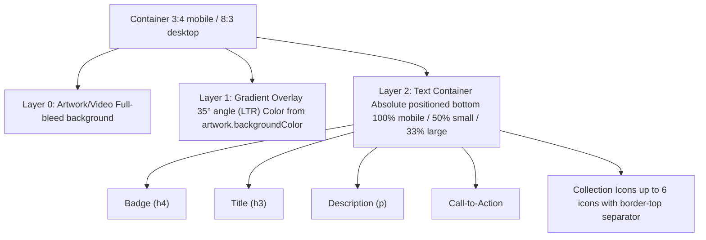
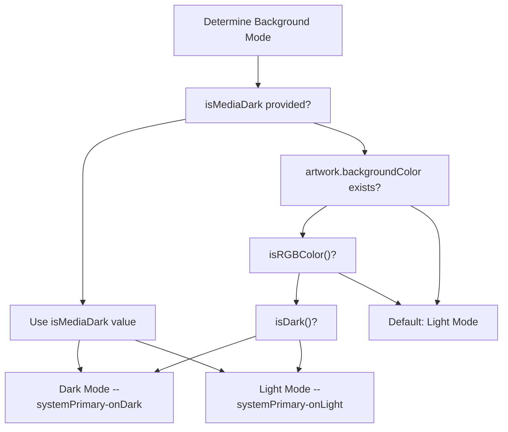

# 突显项目 (Breakout Items)

-   [shared/components/src/components/Artwork/Artwork.svelte](https://github.com/Chesszyh/apps.apple.com/blob/279d0c4d/shared/components/src/components/Artwork/Artwork.svelte)
-   [src/components/Shelf/Title.svelte](https://github.com/Chesszyh/apps.apple.com/blob/279d0c4d/src/components/Shelf/Title.svelte)
-   [src/components/jet/item/LargeHeroBreakoutItem.svelte](https://github.com/Chesszyh/apps.apple.com/blob/279d0c4d/src/components/jet/item/LargeHeroBreakoutItem.svelte)
-   [src/components/jet/item/SmallBreakoutItem.svelte](https://github.com/Chesszyh/apps.apple.com/blob/279d0c4d/src/components/jet/item/SmallBreakoutItem.svelte)

## 目的与范围 (Purpose and Scope)

突显项目 (Breakout Items) 是专门的推广组件，旨在通过独特的视觉处理来展示精选内容。这些组件提供了引人注目的、编辑风格的布局，通过独特的长宽比、旋转的艺术资产、渐变叠加层和突出的呼吁操作 (call-to-action) 元素，从标准网格模式中“突显”出来。

本页面记录了两种突显项目变体及其渲染模式。有关 Today 卡片和编辑卡片等其他推广组件，请参阅 [Content Cards](#5.3)。有关英雄和轮播组件，请参阅 [Hero and Carousel Components](#5.4)。

**来源：** [src/components/jet/item/SmallBreakoutItem.svelte1-188](https://github.com/Chesszyh/apps.apple.com/blob/279d0c4d/src/components/jet/item/SmallBreakoutItem.svelte#L1-L188) [src/components/jet/item/LargeHeroBreakoutItem.svelte1-269](https://github.com/Chesszyh/apps.apple.com/blob/279d0c4d/src/components/jet/item/LargeHeroBreakoutItem.svelte#L1-L269)

---

## 组件类型概览 (Component Types Overview)

突显系统提供了两种截然不同的组件类型，每种都针对不同的编辑上下文进行了优化：

| 组件 | 数据模型 | 主要用例 | 长宽比 | 视觉签名 |
| --- | --- | --- | --- | --- |
| `SmallBreakoutItem` | `SmallBreakout` | 紧凑型推广卡片 | 16:9 (移动端), 13:5 (桌面端) | 旋转的 App 图标、纯色背景 |
| `LargeHeroBreakoutItem` | `LargeHeroBreakout` | 英雄级别的推广横幅 | 3:4 (移动端), 8:3 (桌面端) | 渐变叠加层、底部对齐的文本 |

**来源：** [src/components/jet/item/SmallBreakoutItem.svelte16](https://github.com/Chesszyh/apps.apple.com/blob/279d0c4d/src/components/jet/item/SmallBreakoutItem.svelte#L16-L16) [src/components/jet/item/LargeHeroBreakoutItem.svelte22](https://github.com/Chesszyh/apps.apple.com/blob/279d0c4d/src/components/jet/item/LargeHeroBreakoutItem.svelte#L22-L22)

---

## 组件层级与依赖 (Component Hierarchy and Dependencies)


**来源：** [src/components/jet/item/SmallBreakoutItem.svelte10-13](https://github.com/Chesszyh/apps.apple.com/blob/279d0c4d/src/components/jet/item/SmallBreakoutItem.svelte#L10-L13) [src/components/jet/item/LargeHeroBreakoutItem.svelte9-20](https://github.com/Chesszyh/apps.apple.com/blob/279d0c4d/src/components/jet/item/LargeHeroBreakoutItem.svelte#L9-L20)

---

## SmallBreakoutItem

### 数据模型 (Data Model)

`SmallBreakout` 接口提供了以下属性：

```
{    backgroundColor: Color,    iconArtwork: Artwork,    clickAction: Action,    details: {        badge?: string,        title?: string,        description?: string,        backgroundStyle: 'dark' | 'light'    }}
```
**来源：** [src/components/jet/item/SmallBreakoutItem.svelte16-22](https://github.com/Chesszyh/apps.apple.com/blob/279d0c4d/src/components/jet/item/SmallBreakoutItem.svelte#L16-L22)

### 布局模式 (Layout Pattern)

SmallBreakoutItem 实现了一种独特的水平布局，具有三个关键视觉元素：

1.  **旋转的 App 图标**：定位于右上角，旋转 -30°（RTL 下为 30°），营造视觉动感
2.  **文本容器**：左对齐（RTL 下为右对齐），在移动端占据 66% 宽度，在桌面端占据 33%
3.  **纯色背景**：源自 `backgroundColor` 属性的全屏铺满自定义颜色


**来源：** [src/components/jet/item/SmallBreakoutItem.svelte79-136](https://github.com/Chesszyh/apps.apple.com/blob/279d0c4d/src/components/jet/item/SmallBreakoutItem.svelte#L79-L136)

### 旋转艺术资产的实现 (Rotated Artwork Implementation)

图标使用 CSS 转换 (transforms) 进行定位和旋转：

-   **定位**：`position: absolute` 且 `inset-inline-end: -10%`
-   **转换**：`translateY(-8%) rotate(-30deg)` (LTR) 或 `rotate(30deg)` (RTL)
-   **阴影**：具有根据文本方向确定方向偏移的自定义 box-shadow
-   **容器查询**：在宽度 ≥1150px 时，垂直平移增加到 `-11%`

**来源：** [src/components/jet/item/SmallBreakoutItem.svelte92-118](https://github.com/Chesszyh/apps.apple.com/blob/279d0c4d/src/components/jet/item/SmallBreakoutItem.svelte#L92-L118)

### 文本内容渲染 (Text Content Rendering)

文本内容使用 flexbox 纵向布局，层级结构如下：

| 元素 | 字体 | 行数截断 | 间距 |
| --- | --- | --- | --- |
| 眉标 (h4) | `subhead-emphasized` / `headline` | 1 | 无 |
| 标题 (h3) | `title-1-emphasized` / `large-title-emphasized` | 2 | 无 |
| 描述 (p) | `body` / `title-3` | 3 | `margin-top: 8px` |
| 呼吁操作 (CTA) | `title-3-emphasized` / `title-2-emphasized` | 无 | `margin-top: 16px` |

文本颜色根据 `backgroundStyle` 自动调整：

-   **深色背景**：`--systemPrimary-onDark`
-   **浅色背景**：默认系统颜色

**来源：** [src/components/jet/item/SmallBreakoutItem.svelte39-69](https://github.com/Chesszyh/apps.apple.com/blob/279d0c4d/src/components/jet/item/SmallBreakoutItem.svelte#L39-L69) [src/components/jet/item/SmallBreakoutItem.svelte138-186](https://github.com/Chesszyh/apps.apple.com/blob/279d0c4d/src/components/jet/item/SmallBreakoutItem.svelte#L138-L186)

---

## LargeHeroBreakoutItem

### 数据模型 (Data Model)

`LargeHeroBreakout` 接口通过更丰富的媒体支持扩展了突显模式：

```
{    artwork?: Artwork,    rtlArtwork?: Artwork,    video?: VideoModel,    isMediaDark?: boolean,    collectionIcons?: Artwork[],    editorialDisplayOptions: {        suppressLockup: boolean    },    details: {        badge?: string,        title?: string,        description?: string,        callToActionButtonAction?: Action    }}
```
**来源：** [src/components/jet/item/LargeHeroBreakoutItem.svelte22-34](https://github.com/Chesszyh/apps.apple.com/blob/279d0c4d/src/components/jet/item/LargeHeroBreakoutItem.svelte#L22-L34)

### 布局模式 (Layout Pattern)

LargeHeroBreakoutItem 使用具有三个组合层级的叠加模式：


**来源：** [src/components/jet/item/LargeHeroBreakoutItem.svelte61-113](https://github.com/Chesszyh/apps.apple.com/blob/279d0c4d/src/components/jet/item/LargeHeroBreakoutItem.svelte#L61-L113)

### 艺术资产与视频选择 (Artwork and Video Selection)

该组件实现了智能媒体源选择：

1.  **RTL 艺术资产优先级**：如果 `isRtl()` 返回 true 且存在 `rtlArtwork`，则使用 `rtlArtwork`
2.  **视频渲染**：仅在非 xsmall 视口且不使用 RTL 艺术资产时渲染
3.  **回退方案**：根据需要使用标准的 `artwork` 或 `video.preview`

**配置文件选择 (Profile Selection)**：

-   **xsmall 视口**：`large-hero-portrait-iphone`
-   **RTL 艺术资产**：`large-hero-breakout-rtl`
-   **默认**：`large-hero-breakout`

**来源：** [src/components/jet/item/LargeHeroBreakoutItem.svelte39-52](https://github.com/Chesszyh/apps.apple.com/blob/279d0c4d/src/components/jet/item/LargeHeroBreakoutItem.svelte#L39-L52) [src/components/jet/item/LargeHeroBreakoutItem.svelte62-66](https://github.com/Chesszyh/apps.apple.com/blob/279d0c4d/src/components/jet/item/LargeHeroBreakoutItem.svelte#L62-L66)

### 渐变叠加系统 (Gradient Overlay System)

渐变叠加层为背景媒体上的文本提供了可读性：

**渐变属性**：

-   **颜色**：通过 `colorAsString()` 辅助函数从 `artwork.backgroundColor` 提取
-   **旋转**：
    -   `35deg` (小及以上视口的 LTR)
    -   `-35deg` (小及以上视口的 RTL)
    -   `0deg` (xsmall 视口，垂直渐变)
-   **停止点**：`color 20%, transparent 50%`
-   **滤镜**：`saturate(1.5) brightness(0.9)` 以增强视觉效果

渐变方向适应视口和文本方向，以确保文本在任何布局下都保持可读。

**来源：** [src/components/jet/item/LargeHeroBreakoutItem.svelte69](https://github.com/Chesszyh/apps.apple.com/blob/279d0c4d/src/components/jet/item/LargeHeroBreakoutItem.svelte#L69-L69) [src/components/jet/item/LargeHeroBreakoutItem.svelte241-267](https://github.com/Chesszyh/apps.apple.com/blob/279d0c4d/src/components/jet/item/LargeHeroBreakoutItem.svelte#L241-L267)

### 深色/浅色模式检测 (Dark/Light Mode Detection)

文本颜色通过分析背景来确定：


**来源：** [src/components/jet/item/LargeHeroBreakoutItem.svelte41-45](https://github.com/Chesszyh/apps.apple.com/blob/279d0c4d/src/components/jet/item/LargeHeroBreakoutItem.svelte#L41-L45) [src/components/jet/item/LargeHeroBreakoutItem.svelte152-174](https://github.com/Chesszyh/apps.apple.com/blob/279d0c4d/src/components/jet/item/LargeHeroBreakoutItem.svelte#L152-L174)

### 集合图标显示 (Collection Icons Display)

当 `collectionIcons.length > 1` 且 `!editorialDisplayOptions.suppressLockup` 时，组件最多显示 6 个 App 图标：

-   **布局**：具有 `gap: 8px` 的水平 flex 行
-   **分隔符**：`border-top: 2px solid --systemTertiary-onDark`
-   **间距**：`margin-top: 16px` 和 `padding-top: 16px`
-   **图标**：使用具有默认配置文件的 `AppIcon` 组件进行渲染

**来源：** [src/components/jet/item/LargeHeroBreakoutItem.svelte103-111](https://github.com/Chesszyh/apps.apple.com/blob/279d0c4d/src/components/jet/item/LargeHeroBreakoutItem.svelte#L103-L111) [src/components/jet/item/LargeHeroBreakoutItem.svelte229-239](https://github.com/Chesszyh/apps.apple.com/blob/279d0c4d/src/components/jet/item/LargeHeroBreakoutItem.svelte#L229-L239)

---

## 响应式排版 (Responsive Typography)

两个突显组件都实现了响应式类型缩放：

### SmallBreakoutItem 排版

| 元素 | 移动端字体 | 桌面端字体 (小及以上) |
| --- | --- | --- |
| 眉标 (Badge) | `subhead-emphasized` | `headline` |
| 标题 | `title-1-emphasized` | `large-title-emphasized` |
| 描述 | `body` | `title-3` |
| CTA 链接 | `title-3-emphasized` | `title-2-emphasized` |

### LargeHeroBreakoutItem 排版

| 元素 | 移动端字体 | 桌面端字体 (小及以上) |
| --- | --- | --- |
| 眉标 (Badge) | `subhead-emphasized` | `callout-emphasized` |
| 标题 | `title-1-emphasized` | `large-title-emphasized` |
| 描述 | `body` | `title-3` |
| CTA 链接 | `body-emphasized` | `title-2-emphasized` |

所有文本都使用 `text-wrap: pretty` 进行平衡换行，标题还使用了 `text-wrap: balance`。

**来源：** [src/components/jet/item/SmallBreakoutItem.svelte163-186](https://github.com/Chesszyh/apps.apple.com/blob/279d0c4d/src/components/jet/item/SmallBreakoutItem.svelte#L163-L186) [src/components/jet/item/LargeHeroBreakoutItem.svelte202-227](https://github.com/Chesszyh/apps.apple.com/blob/279d0c4d/src/components/jet/item/LargeHeroBreakoutItem.svelte#L202-L227)

---

## 通用交互模式 (Common Interaction Patterns)

两个突显组件共享一致的交互架构：

### 点击操作处理 (Click Action Handling)

1.  **LinkWrapper 集成**：整个组件被包装在 `<LinkWrapper action={action}>` 中以处理导航
2.  **HoverWrapper 效果**：提供标准的悬停状态样式
3.  **操作守卫 (Action Guard)**：仅在 `isSome(action) && isFlowAction(action)` 时渲染 V 形 (chevron) 图标
4.  **无障碍性**：`LinkWrapper` 提供了适当的标签和 ARIA 属性

**来源：** [src/components/jet/item/SmallBreakoutItem.svelte25-26](https://github.com/Chesszyh/apps.apple.com/blob/279d0c4d/src/components/jet/item/SmallBreakoutItem.svelte#L25-L26) [src/components/jet/item/LargeHeroBreakoutItem.svelte59-60](https://github.com/Chesszyh/apps.apple.com/blob/279d0c4d/src/components/jet/item/LargeHeroBreakoutItem.svelte#L59-L60)

### V 形图标渲染 (Chevron Rendering)

当存在 `FlowAction` 时，两个组件都会渲染一个前向 V 形图标（RTL 下旋转 180°）：

-   **图标**：名称为 `chevron.forward` 的 `SFSymbol`
-   **RTL 处理**：在 RTL 区域设置中应用 `transform: rotate(180deg)`
-   **尺寸**：
    -   SmallBreakout: 10px × 10px
    -   LargeHeroBreakout: 8px × 8px (移动端), 10px × 10px (桌面端)

**来源：** [src/components/jet/item/SmallBreakoutItem.svelte61-67](https://github.com/Chesszyh/apps.apple.com/blob/279d0c4d/src/components/jet/item/SmallBreakoutItem.svelte#L61-L67) [src/components/jet/item/LargeHeroBreakoutItem.svelte94-100](https://github.com/Chesszyh/apps.apple.com/blob/279d0c4d/src/components/jet/item/LargeHeroBreakoutItem.svelte#L94-L100)

---

## 长宽比策略 (Aspect Ratio Strategies)

### SmallBreakoutItem 长宽比

该组件使用具有视口特定值的 CSS `aspect-ratio`：

-   **移动端 (默认)**：`16/9`
-   **小及以上**：`13/5`（针对桌面显示器的更宽格式）
-   **容器查询**：使用 `container-type: inline-size` 进行响应式调整

**来源：** [src/components/jet/item/SmallBreakoutItem.svelte82-89](https://github.com/Chesszyh/apps.apple.com/blob/279d0c4d/src/components/jet/item/SmallBreakoutItem.svelte#L82-L89)

### LargeHeroBreakoutItem 长宽比

艺术资产容器根据视口进行调整：

-   **移动端 (xsmall)**：纵向方向（通过配置文件实现 3:4）
-   **小及以上**：通过 CSS `aspect-ratio` 实现宽横向 `8/3`

配置文件系统处理实际的图像尺寸，而容器提供布局约束。

**来源：** [src/components/jet/item/LargeHeroBreakoutItem.svelte47-52](https://github.com/Chesszyh/apps.apple.com/blob/279d0c4d/src/components/jet/item/LargeHeroBreakoutItem.svelte#L47-L52) [src/components/jet/item/LargeHeroBreakoutItem.svelte121-127](https://github.com/Chesszyh/apps.apple.com/blob/279d0c4d/src/components/jet/item/LargeHeroBreakoutItem.svelte#L121-L127)

---

## 与艺术资产系统的集成 (Integration with Artwork System)

两个组件都利用了共享的 Artwork 组件系统（参见 [Artwork and Media System](#5.1)）：

### SmallBreakoutItem 艺术资产集成

-   **组件**：`AppIcon`（专门的 Artwork 包装器）
-   **配置文件**：`app-icon-xlarge`
-   **设置**：`fixedWidth={false}` 以实现响应式缩放
-   **增强**：对 `.artwork-component` 应用自定义 box-shadow

**来源：** [src/components/jet/item/SmallBreakoutItem.svelte28-35](https://github.com/Chesszyh/apps.apple.com/blob/279d0c4d/src/components/jet/item/SmallBreakoutItem.svelte#L28-L35)

### LargeHeroBreakoutItem 艺术资产集成

-   **组件**：图像内容使用 `Artwork`，视频内容使用 `Video`
-   **懒加载**：应用默认设置（对屏幕外内容为 true）
-   **获取优先级 (Fetch Priority)**：未显式设置（使用默认值 'auto'）
-   **背景颜色**：提取用于渐变叠加层

该组件还使用 `sanitizeHtml()` 对标题和描述字段中的 HTML 进行消毒以防止 XSS。

**来源：** [src/components/jet/item/LargeHeroBreakoutItem.svelte64-65](https://github.com/Chesszyh/apps.apple.com/blob/279d0c4d/src/components/jet/item/LargeHeroBreakoutItem.svelte#L64-L65) [src/components/jet/item/LargeHeroBreakoutItem.svelte84](https://github.com/Chesszyh/apps.apple.com/blob/279d0c4d/src/components/jet/item/LargeHeroBreakoutItem.svelte#L84-L84) [src/components/jet/item/LargeHeroBreakoutItem.svelte90](https://github.com/Chesszyh/apps.apple.com/blob/279d0c4d/src/components/jet/item/LargeHeroBreakoutItem.svelte#L90-L90)

---

## 在货架系统中的用法 (Usage in Shelf System)

突显项目通常作为基于货架的页面的一部分进行渲染。货架分发器（参见 [Shelf System](#4.2)）使用类型守卫来标识突显货架数据并将其路由到这些组件。

可能包含突显项目的常见货架类型：

-   编辑推广货架
-   精选内容轮播
-   英雄内容部分

组件从货架系统接收完全填充的数据模型，仅负责呈现和用户交互处理。

**来源：** [src/components/jet/item/SmallBreakoutItem.svelte1-188](https://github.com/Chesszyh/apps.apple.com/blob/279d0c4d/src/components/jet/item/SmallBreakoutItem.svelte#L1-L188) [src/components/jet/item/LargeHeroBreakoutItem.svelte1-269](https://github.com/Chesszyh/apps.apple.com/blob/279d0c4d/src/components/jet/item/LargeHeroBreakoutItem.svelte#L1-L269)
