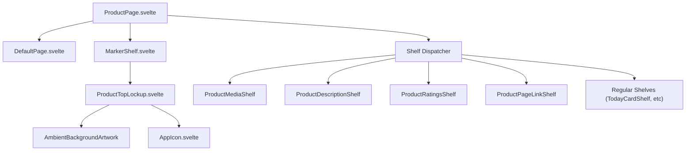
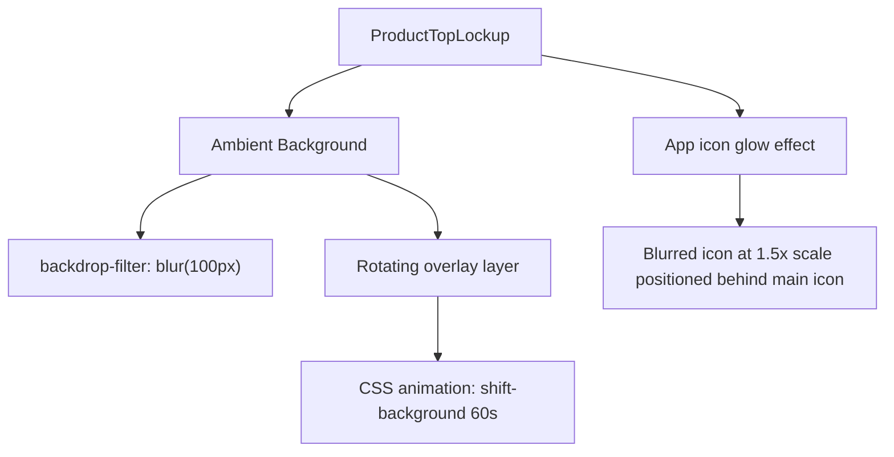
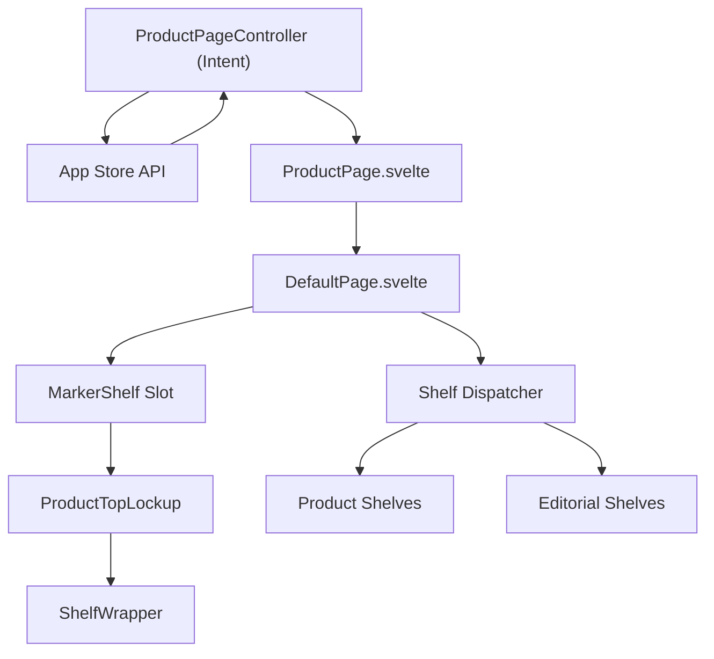

# 产品页面 (Product Pages)

-   [src/components/AmbientBackgroundArtwork.svelte](https://github.com/Chesszyh/apps.apple.com/blob/279d0c4d/src/components/AmbientBackgroundArtwork.svelte)
-   [src/components/jet/marker-shelf/ProductTopLockup.svelte](https://github.com/Chesszyh/apps.apple.com/blob/279d0c4d/src/components/jet/marker-shelf/ProductTopLockup.svelte)
-   [src/components/jet/shelf/ProductDescriptionShelf.svelte](https://github.com/Chesszyh/apps.apple.com/blob/279d0c4d/src/components/jet/shelf/ProductDescriptionShelf.svelte)
-   [src/components/jet/shelf/ProductMediaShelf.svelte](https://github.com/Chesszyh/apps.apple.com/blob/279d0c4d/src/components/jet/shelf/ProductMediaShelf.svelte)
-   [src/components/pages/ProductPage.svelte](https://github.com/Chesszyh/apps.apple.com/blob/279d0c4d/src/components/pages/ProductPage.svelte)

## 目的与范围 (Purpose and Scope)

产品页面是针对 App、游戏和其他 App Store 产品的专门详情页。它们显示产品信息，包括 App 图标、屏幕截图、描述、评分和平台特定的媒体。产品页面与编辑页面的不同之处在于具有一个突出的英雄锁定 (hero lockup) 部分（即 "MarkerShelf"）和产品特定的货架类型。

本文档提供了产品页面架构、数据模型和关键组件的概览。有关详细信息，请参阅：

-   产品页面布局和 MarkerShelf 集成：参见 [Product Page Layout](#6.1)
-   产品特定货架的实现：参见 [Product-Specific Shelves](#6.2)
-   平台自适应媒体渲染逻辑：参见 [Platform-Specific Media Rendering](#6.3)

有关通用页面渲染概念，请参阅 [Page Components](#4.1)。有关货架系统架构，请参阅 [Shelf System](#4.2)。

---

## 产品页面架构 (Product Page Architecture)

产品页面使用专门的组件结构，通过产品特定的特性扩展了标准的基于货架的页面模型。

### 组件层级 (Component Hierarchy)


**来源：**

-   [src/components/pages/ProductPage.svelte1-78](https://github.com/Chesszyh/apps.apple.com/blob/279d0c4d/src/components/pages/ProductPage.svelte#L1-L78)
-   [src/components/jet/marker-shelf/ProductTopLockup.svelte1-464](https://github.com/Chesszyh/apps.apple.com/blob/279d0c4d/src/components/jet/marker-shelf/ProductTopLockup.svelte#L1-L464)

### 数据流 (Data Flow)

> **[Mermaid sequence]**
> *(图表结构无法解析)*

**来源：**

-   [src/components/pages/ProductPage.svelte16-61](https://github.com/Chesszyh/apps.apple.com/blob/279d0c4d/src/components/pages/ProductPage.svelte#L16-L61)
-   [src/components/jet/marker-shelf/ProductTopLockup.svelte48-116](https://github.com/Chesszyh/apps.apple.com/blob/279d0c4d/src/components/jet/marker-shelf/ProductTopLockup.svelte#L48-L116)

---

## 数据模型 (Data Model)

产品页面根据 `ShelfBasedProductPage` 模型进行渲染，该模型通过产品特定的属性扩展了基础页面模型。

### 关键数据结构 (Key Data Structures)

| 属性 | 类型 | 用途 |
| --- | --- | --- |
| `lockup` | `ProductLockup` | App 图标、标题、副标题、定价、优惠信息 |
| `badges` | `Badge[]` | 编辑精选、年龄分级等 |
| `banner` | `BannerItem` | 编辑横幅 (例如 "今日 App") |
| `developerAction` | `Action` | 开发者页面链接 |
| `titleOfferDisplayProperties` | `OfferDisplayProperties` | 定价和优惠元数据 |
| `canonicalURL` | `string` | 深层链接和分享 URL |
| `appPlatforms` | `AppPlatform[]` | 支持的平台 (mac, phone, pad 等) |
| `shelves` | `Shelf[]` | 产品内容货架 |

**来源：**

-   [src/components/jet/marker-shelf/ProductTopLockup.svelte11-21](https://github.com/Chesszyh/apps.apple.com/blob/279d0c4d/src/components/jet/marker-shelf/ProductTopLockup.svelte#L11-L21)

### MarkerShelfPageRequirements

`ProductTopLockup` 组件需要完整页面模型的一个子集：

```
type MarkerShelfPageRequirements = Pick<    ShelfBasedProductPage,    | 'badges'    | 'banner'    | 'developerAction'    | 'lockup'    | 'shelfMapping'    | 'titleOfferDisplayProperties'    | 'canonicalURL'    | 'appPlatforms'>;
```
**来源：**

-   [src/components/jet/marker-shelf/ProductTopLockup.svelte11-21](https://github.com/Chesszyh/apps.apple.com/blob/279d0c4d/src/components/jet/marker-shelf/ProductTopLockup.svelte#L11-L21)

---

## 关键组件 (Key Components)

### ProductPage 组件 (ProductPage Component)

`ProductPage.svelte` 是产品详情页面的顶层组件。它通过以下方式扩展了 `DefaultPage`：

1.  **渲染 MarkerShelf**：使用 `marker-shelf` 插槽注入 `ProductTopLockup`
2.  **处理货架**：调用 `getProductPageShelvesWithExpandedMedia()` 以展开平台特定的媒体
3.  **EULA 深层链接**：检测 `?lic` 查询参数并打开许可协议 (License Agreement) 模态框
4.  **Arcade 页脚**：有条件地为 Arcade App 渲染 `ProductPageArcadeFooter`

**来源：**

-   [src/components/pages/ProductPage.svelte1-78](https://github.com/Chesszyh/apps.apple.com/blob/279d0c4d/src/components/pages/ProductPage.svelte#L1-L78)

### MarkerShelf / ProductTopLockup

`MarkerShelf` 渲染产品页面顶部的英雄部分。它包括：

-   带有发光效果和边框（需要时）的 **App 图标**
-   带有平台独占性文本的**标题、副标题和标语**
-   **定价和属性**（免费、价格、App 内购买、即将推出日期）
-   针对 Apple Arcade 游戏的 **Arcade 徽标**
-   **启动原生 App 按钮**（仅限 macOS，且当 App 可用时）
-   支持原生分享 API 的**分享按钮**
-   使用模糊动画 App 图标的**环境背景**
-   **横幅**（编辑横幅，如 "今日 App"）

#### 视觉特性 (Visual Features)


**平台独占性检测：**

组件通过检查是否仅支持一个平台来检测平台独占性（例如 "专为 iPad 设计"）：

```
// 来自 ProductTopLockup 的简化逻辑exclusivePlatform = platforms.find(platform =>    isPlatformExclusivelySupported(platform, appPlatforms));
```
**来源：**

-   [src/components/jet/marker-shelf/ProductTopLockup.svelte1-464](https://github.com/Chesszyh/apps.apple.com/blob/279d0c4d/src/components/jet/marker-shelf/ProductTopLockup.svelte#L1-L464)
-   [src/components/jet/marker-shelf/ProductTopLockup.svelte97-104](https://github.com/Chesszyh/apps.apple.com/blob/279d0c4d/src/components/jet/marker-shelf/ProductTopLockup.svelte#L97-L104)
-   [src/components/jet/marker-shelf/ProductTopLockup.svelte226-259](https://github.com/Chesszyh/apps.apple.com/blob/279d0c4d/src/components/jet/marker-shelf/ProductTopLockup.svelte#L226-L259)

### 环境背景系统 (Ambient Background System)

产品页面英雄部分使用 `AmbientBackgroundArtwork.svelte` 来创建动画模糊背景效果：

1.  以较低的分辨率（400px，WebP）**加载 App 图标艺术资产**
2.  **应用模糊和饱和度滤镜** (`blur(20px) saturate(1.3)`)
3.  以 60 秒循环**为背景位置执行动画**
4.  **响应视口交叉 (viewport intersection)**（超出视口时暂停）
5.  **在调整大小时暂停**以减少 CPU 抖动

该组件使用分层背景方法：

-   底层：Joe color 回退
-   中层：半透明面纱 (`rgba(240, 240, 240, 0.65)`)
-   顶层：渐变遮罩（透明 → 页面背景）

**来源：**

-   [src/components/AmbientBackgroundArtwork.svelte1-203](https://github.com/Chesszyh/apps.apple.com/blob/279d0c4d/src/components/AmbientBackgroundArtwork.svelte#L1-L203)
-   [src/components/AmbientBackgroundArtwork.svelte76-114](https://github.com/Chesszyh/apps.apple.com/blob/279d0c4d/src/components/AmbientBackgroundArtwork.svelte#L76-L114)
-   [src/components/AmbientBackgroundArtwork.svelte176-201](https://github.com/Chesszyh/apps.apple.com/blob/279d0c4d/src/components/AmbientBackgroundArtwork.svelte#L176-L201)

---

## 特殊特性 (Special Features)

### EULA 深层链接 (EULA Deep Linking)

产品页面支持通过 `?lic` 查询参数直接深层链接到许可协议模态框。当检测到该参数时：

1.  在 `canonicalURL` 中解析 `lic` 参数
2.  查找包含 EULA 项目的 `ProductPageLinkShelf`
3.  定位具有指向 `EulaPageIntent` 的 `FlowAction` 的项目
4.  执行 `jet.perform(clickAction)` 以打开模态框

**实现：**

```
if (page.canonicalURL) {    const canonicalUrl = new URL(page.canonicalURL);    const hasLic = canonicalUrl.searchParams.has('lic');        if (hasLic && shelves) {        const eulaItem = shelves            .find(isProductPageLinkShelf)            ?.items.find(                ({ clickAction }) =>                    isFlowAction(clickAction) &&                    clickAction.destination &&                    isEulaPageIntent(clickAction.destination),            );                if (eulaItem) {            jet.perform(eulaItem.clickAction);        }    }}
```
**来源：**

-   [src/components/pages/ProductPage.svelte37-60](https://github.com/Chesszyh/apps.apple.com/blob/279d0c4d/src/components/pages/ProductPage.svelte#L37-L60)

### Apple Arcade 支持 (Apple Arcade Support)

产品页面会检测 Apple Arcade App 并渲染专门的内容：

1.  **检测**：检查 `offerDisplayProperties.offerType === 'arcadeApp'`
2.  **英雄部分**：显示 Apple Arcade 徽标而非编辑标语
3.  **定价**：隐藏价格/App 内购买属性（与 Arcade 无关）
4.  **页脚**：渲染带有 Arcade 品牌的 `ProductPageArcadeFooter`

**来源：**

-   [src/components/jet/marker-shelf/ProductTopLockup.svelte59-60](https://github.com/Chesszyh/apps.apple.com/blob/279d0c4d/src/components/jet/marker-shelf/ProductTopLockup.svelte#L59-L60)
-   [src/components/jet/marker-shelf/ProductTopLockup.svelte84-92](https://github.com/Chesszyh/apps.apple.com/blob/279d0c4d/src/components/jet/marker-shelf/ProductTopLockup.svelte#L84-L92)
-   [src/components/pages/ProductPage.svelte65-77](https://github.com/Chesszyh/apps.apple.com/blob/279d0c4d/src/components/pages/ProductPage.svelte#L65-L77)

### 平台特定特性 (Platform-Specific Features)

#### macOS 启动按钮 (macOS Launch Button)

在 macOS 上，产品页面会在以下情况下显示 "启动" 按钮：

-   用户处于 macOS 环境 (`platform.ismacOS()`)
-   且 App 满足以下任一条件：
    -   是与 macOS 兼容的 iOS App (`lockup.isIOSBinaryMacOSCompatible`)
    -   是原生的 Mac App (`isPlatformSupported('mac', appPlatforms)`)

**来源：**

-   [src/components/jet/marker-shelf/ProductTopLockup.svelte106-109](https://github.com/Chesszyh/apps.apple.com/blob/279d0c4d/src/components/jet/marker-shelf/ProductTopLockup.svelte#L106-L109)

#### 分享按钮 (Share Button)

在可用时使用原生 Web Share API (`navigator.share`)。挂载时，检查 `isShareSupported()` 以确定可见性。

**来源：**

-   [src/components/jet/marker-shelf/ProductTopLockup.svelte111-115](https://github.com/Chesszyh/apps.apple.com/blob/279d0c4d/src/components/jet/marker-shelf/ProductTopLockup.svelte#L111-L115)

---

## 产品特定货架 (Product-Specific Shelves)

产品页面使用了一些在编辑页面上不可用的专门货架类型：

### ProductMediaShelf

以平台特定的布局渲染屏幕截图和视频。支持：

-   平台检测（Vision, Mac, iPad, iPhone, TV, Watch, Messages）
-   方向检测（纵向 vs 横向）
-   多平台可扩展视图
-   平台图标和标签

**平台渲染映射：**

| 平台 | 网格类型 | 组件 |
| --- | --- | --- |
| `vision` | `ScreenshotVision` | `ProductMediaVisionItem` |
| `phone` | `ScreenshotPhone` (纵向) 或 `ScreenshotLarge` | `ProductMediaPhoneItem` |
| `pad` | `ScreenshotPad` (纵向) 或 `ScreenshotLarge` | `ProductMediaPadItem` |
| `mac` | `ScreenshotLarge` | `ProductMediaMacItem` |
| `tv` | `ScreenshotLarge` | `ProductMediaTVItem` |
| `watch` | `ScreenshotPhone` | `ProductMediaWatchItem` |
| `messages` | 与 `phone` 相同 | `ProductMediaPhoneItem` |

**来源：**

-   [src/components/jet/shelf/ProductMediaShelf.svelte1-270](https://github.com/Chesszyh/apps.apple.com/blob/279d0c4d/src/components/jet/shelf/ProductMediaShelf.svelte#L1-L270)
-   [src/components/jet/shelf/ProductMediaShelf.svelte100-136](https://github.com/Chesszyh/apps.apple.com/blob/279d0c4d/src/components/jet/shelf/ProductMediaShelf.svelte#L100-L136)

### ProductDescriptionShelf

显示具有以下特性的 App 描述：

-   带有 "更多" 按钮的 5 行截断
-   HTML 消毒以支持格式化
-   内容较短时自动展开
-   在 medium+ 视口上宽度为 66%

**来源：**

-   [src/components/jet/shelf/ProductDescriptionShelf.svelte1-96](https://github.com/Chesszyh/apps.apple.com/blob/279d0c4d/src/components/jet/shelf/ProductDescriptionShelf.svelte#L1-L96)

### 其他产品货架 (Additional Product Shelves)

其他产品特定货架包括：

-   `ProductRatingsShelf` - 用户评分和评论摘要
-   `ProductPageLinkShelf` - 隐私政策、EULA、支持链接
-   `ProductInformationShelf` - 元数据（销售商、大小、语言等）

**来源：**

-   [src/components/pages/ProductPage.svelte14](https://github.com/Chesszyh/apps.apple.com/blob/279d0c4d/src/components/pages/ProductPage.svelte#L14-L14)

---

## 货架处理 (Shelf Processing)

### 扩展媒体处理 (Expanded Media Handling)

`getProductPageShelvesWithExpandedMedia()` 工具函数处理货架以展开平台特定媒体：

1.  定位第一个 `ProductMediaShelf`
2.  如果该货架具有多个平台 (`allPlatforms.length > 1`)：
    -   为每个平台创建额外的 `ProductMediaShelf` 实例
    -   将它们分配给 `expandedMedia` 数组
3.  返回修改后的货架数组

这实现了 `ProductMediaShelf` 中可扩展的平台选择器 UI。

**来源：**

-   [src/components/pages/ProductPage.svelte22](https://github.com/Chesszyh/apps.apple.com/blob/279d0c4d/src/components/pages/ProductPage.svelte#L22-L22)

---

## 与页面系统的集成 (Integration with Page System)

产品页面集成到更广泛的页面渲染系统中：


**来源：**

-   [src/components/pages/ProductPage.svelte1-78](https://github.com/Chesszyh/apps.apple.com/blob/279d0c4d/src/components/pages/ProductPage.svelte#L1-L78)

---

## 无障碍 (Accessibility)

产品页面设置了无障碍布局上下文，用于邻居货架检测，从而实现正确的键盘导航和屏幕阅读器支持：

```
setAccessibilityLayoutContext({ shelves });
```
货架组件使用该上下文来确定它们相对于其他货架的位置（首个、末个、相邻类型）。

**来源：**

-   [src/components/pages/ProductPage.svelte33-34](https://github.com/Chesszyh/apps.apple.com/blob/279d0c4d/src/components/pages/ProductPage.svelte#L33-L34)
