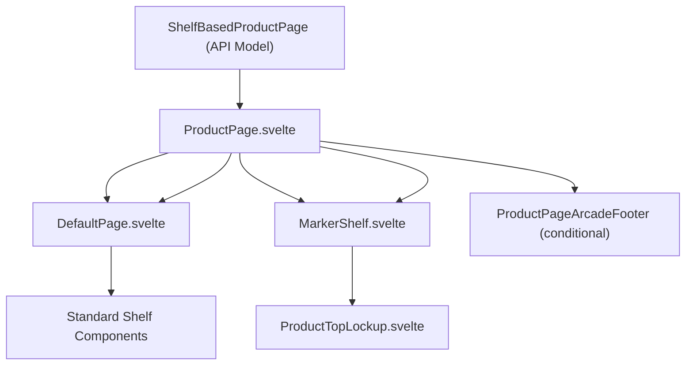
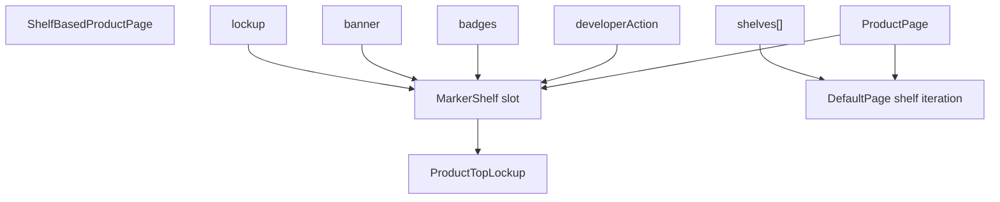
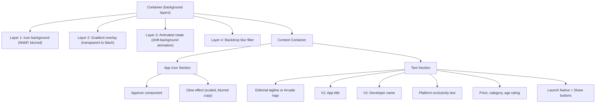
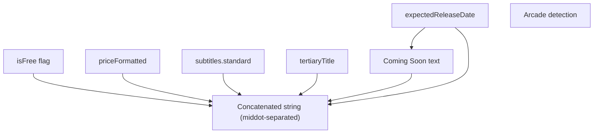
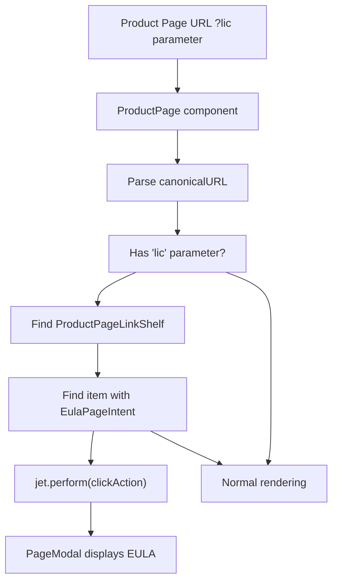
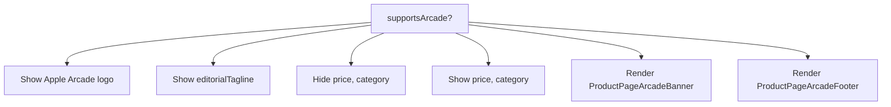

# 产品页面布局 (Product Page Layout)

-   [src/components/AmbientBackgroundArtwork.svelte](https://github.com/Chesszyh/apps.apple.com/blob/279d0c4d/src/components/AmbientBackgroundArtwork.svelte)
-   [src/components/jet/marker-shelf/ProductTopLockup.svelte](https://github.com/Chesszyh/apps.apple.com/blob/279d0c4d/src/components/jet/marker-shelf/ProductTopLockup.svelte)
-   [src/components/jet/shelf/ProductDescriptionShelf.svelte](https://github.com/Chesszyh/apps.apple.com/blob/279d0c4d/src/components/jet/shelf/ProductDescriptionShelf.svelte)
-   [src/components/jet/shelf/ProductMediaShelf.svelte](https://github.com/Chesszyh/apps.apple.com/blob/279d0c4d/src/components/jet/shelf/ProductMediaShelf.svelte)
-   [src/components/pages/ProductPage.svelte](https://github.com/Chesszyh/apps.apple.com/blob/279d0c4d/src/components/pages/ProductPage.svelte)

## 目的与范围 (Purpose and Scope)

本文档描述了 App Store Web 应用程序中产品详情页面的结构和渲染架构。产品页面显示关于特定 App 或游戏的全面信息，包括其图标、标题、描述、屏幕截图、评分和其他元数据。

本页面涵盖：

-   **ProductPage 组件**结构及其与 `DefaultPage` 的集成
-   用于渲染产品英雄 (hero) 部分的 **MarkerShelf 模式**
-   显示 App 图标、标题和元数据的 **ProductTopLockup** 组件
-   针对许可协议模态框的 **EULA 深层链接**功能
-   **Arcade 特有的**渲染变体

有关产品特定货架类型（媒体、描述、评分）的详细信息，请参阅 [Product-Specific Shelves](#6.2)。有关平台特定媒体渲染策略的信息，请参阅 [Platform-Specific Media Rendering](#6.3)。

---

## 产品页面架构 (Product Page Architecture)

产品页面扩展了标准的基于货架的页面模型，具有对英雄部分和产品特定内容的特殊处理。`ProductPage` 组件将大多数渲染工作委托给 `DefaultPage`，同时插入产品特定的元素。


**产品页面组件层级 (Product Page Component Hierarchy)**

来源：[src/components/pages/ProductPage.svelte1-78](https://github.com/Chesszyh/apps.apple.com/blob/279d0c4d/src/components/pages/ProductPage.svelte#L1-L78)

---

## MarkerShelf 模式 (MarkerShelf Pattern)

**MarkerShelf** 是一种特殊的虚拟货架，它并不存在于 API 的 `shelves` 数组中。相反，它是根据顶级产品页面属性（`lockup`、`banner`、`badges` 等）构建的，并在 `DefaultPage` 内的专用插槽中进行渲染。

### MarkerShelf 存在的原因 (Why MarkerShelf Exists)

产品页面需要一个与标准货架显示方式不同的突出英雄部分。MarkerShelf 模式不强制将其放入 `shelves` 数组中，而是：

1.  **将英雄内容**从标准的货架遍历逻辑中**分离出来**
2.  通过定义 `MarkerShelfPageRequirements` **提供类型安全**
3.  在不修改货架分发器的情况下**实现专门的渲染**
4.  **维护 API 向后兼容性**，因为锁定项 (lockup) 属性仍保持在顶层


**MarkerShelf 数据提取模式 (MarkerShelf Data Extraction Pattern)**

来源：[src/components/jet/marker-shelf/ProductTopLockup.svelte1-22](https://github.com/Chesszyh/apps.apple.com/blob/279d0c4d/src/components/jet/marker-shelf/ProductTopLockup.svelte#L1-L22) [src/components/pages/ProductPage.svelte69-73](https://github.com/Chesszyh/apps.apple.com/blob/279d0c4d/src/components/pages/ProductPage.svelte#L69-L73)

### MarkerShelfPageRequirements 类型 (MarkerShelfPageRequirements Type)

`MarkerShelfPageRequirements` 类型精确定义了从 `ShelfBasedProductPage` 中提取哪些属性来渲染 MarkerShelf：

| 属性 | 类型 | 用途 |
| --- | --- | --- |
| `badges` | Badge\[\] | 显示在标题附近的奖项徽章 |
| `banner` | BannerItem | 可选的推广横幅 |
| `developerAction` | Action | 开发者相关的操作（例如网站链接） |
| `lockup` | Lockup | 核心 App 元数据（图标、标题、副标题） |
| `shelfMapping` | Object | 将货架类型映射到渲染配置 |
| `titleOfferDisplayProperties` | Object | 优惠特定的显示属性 |
| `canonicalURL` | string | 产品页面 URL（用于分享） |
| `appPlatforms` | AppPlatform\[\] | 支持的平台（iPhone, iPad, Mac 等） |

来源：[src/components/jet/marker-shelf/ProductTopLockup.svelte11-21](https://github.com/Chesszyh/apps.apple.com/blob/279d0c4d/src/components/jet/marker-shelf/ProductTopLockup.svelte#L11-L21)

---

## ProductTopLockup 英雄部分 (ProductTopLockup Hero Section)

`ProductTopLockup` 是每个产品页面顶部视觉上最突出的组件。它具有源自 App 图标的模糊动画背景，上方叠加了图标本身和关键元数据。

### 视觉结构 (Visual Structure)


**ProductTopLockup 视觉层级 (ProductTopLockup Visual Hierarchy)**

来源：[src/components/jet/marker-shelf/ProductTopLockup.svelte118-207](https://github.com/Chesszyh/apps.apple.com/blob/279d0c4d/src/components/jet/marker-shelf/ProductTopLockup.svelte#L118-L207)

### 背景动画系统 (Background Animation System)

英雄部分具有复杂的垂直多层动画：

1.  **静态背景**：以 400×400px 渲染为 WebP 的 App 图标
2.  **渐变叠加层**：从透明到 80% 黑色的线性渐变
3.  **旋转模式**：使用 `shift-background` 关键帧的动画背景
4.  **背景模糊**：通过 `backdrop-filter: blur(100px) saturate(1.5)` 应用

`shift-background` 动画运行 60 秒，不断旋转并缩放背景图像的去饱和版本：

```
动画时间轴：
0s   → 不透明度: 0, 旋转: 0deg, 缩放: 100%
10s  → 不透明度: 0.5
20s  → 旋转: 45deg, 缩放: 160%
45s  → 旋转: 160deg, 缩放: 250%
70s  → 旋转: 250deg, 缩放: 200%
100s → 不透明度: 0, 旋转: 360deg, 缩放: 100%
```
来源：[src/components/jet/marker-shelf/ProductTopLockup.svelte226-294](https://github.com/Chesszyh/apps.apple.com/blob/279d0c4d/src/components/jet/marker-shelf/ProductTopLockup.svelte#L226-L294) [src/components/jet/marker-shelf/ProductTopLockup.svelte424-462](https://github.com/Chesszyh/apps.apple.com/blob/279d0c4d/src/components/jet/marker-shelf/ProductTopLockup.svelte#L424-L462)

### 动态属性显示 (Dynamic Attributes Display)

组件通过使用间隔号 (middot) 分隔符连接各种属性来计算显示属性：


**属性组装逻辑 (Attributes Assembly Logic)**

Arcade App 排除定价和类别信息，仅在适用时显示平台独占性文本。

来源：[src/components/jet/marker-shelf/ProductTopLockup.svelte79-105](https://github.com/Chesszyh/apps.apple.com/blob/279d0c4d/src/components/jet/marker-shelf/ProductTopLockup.svelte#L79-L105)

### 平台独占性检测 (Platform Exclusivity Detection)

组件检测 App 是否仅支持单一平台：

```
exclusivePlatform = ['vision', 'mac', 'phone', 'pad', 'tv', 'watch']    .find(platform => isPlatformExclusivelySupported(platform, appPlatforms))
```
如果是独占的，它会显示诸如 "仅在 iPhone 上提供" 或 "仅在 Apple Vision Pro 上提供" 等本地化文本。

来源：[src/components/jet/marker-shelf/ProductTopLockup.svelte97-104](https://github.com/Chesszyh/apps.apple.com/blob/279d0c4d/src/components/jet/marker-shelf/ProductTopLockup.svelte#L97-L104)

---

## 页面组装过程 (Page Assembly Process)

产品页面通过一个多阶段过程进行组装，该过程准备货架数据、处理扩展媒体并注入 MarkerShelf。

> **[Mermaid sequence]**
> *(图表结构无法解析)*

**产品页面组装序列 (Product Page Assembly Sequence)**

来源：[src/components/pages/ProductPage.svelte1-78](https://github.com/Chesszyh/apps.apple.com/blob/279d0c4d/src/components/pages/ProductPage.svelte#L1-L78)

### 扩展媒体处理 (Expanded Media Handling)

`getProductPageShelvesWithExpandedMedia` 工具函数修改货架数组以支持针对多平台 App 的平台切换 UI：

1.  在货架数组中**定位所有 ProductMediaShelf 实例**
2.  **提取第一个**作为主要媒体货架
3.  将剩余的媒体货架**作为 `expandedMedia` 属性附加**
4.  **返回修改后的数组**，其中只有第一个媒体货架可见

这实现了由 `ProductMediaShelf` 渲染的可扩展平台选择器。

来源：[src/components/pages/ProductPage.svelte22](https://github.com/Chesszyh/apps.apple.com/blob/279d0c4d/src/components/pages/ProductPage.svelte#L22-L22)

---

## EULA 深层链接 (EULA Deep Linking)

产品页面支持通过 `?lic` 查询参数直接深层链接到许可协议模态框。这允许外部链接打开产品页面并直接显示 EULA。

### 实现流程 (Implementation Flow)


**EULA 深层链接处理流程 (EULA Deep Link Processing Flow)**

### 代码实现 (Code Implementation)

深层链接逻辑在设置无障碍上下文的响应式语句期间执行：

```
1. 从页面提取 canonicalURL
2. 解析为 URL 对象
3. 检查 'lic' 查询参数
4. 如果存在：
   a. 在货架数组中查找 ProductPageLinkShelf
   b. 定位其 clickAction 包含 EulaPageIntent 的项目
   c. 调用 jet.perform(eulaItem.clickAction)
   d. 这将触发 Jet 核心中的 handleModalPresentation
```
模态框作为执行操作的副作用自动打开，发生在页面完成初始渲染之前。

来源：[src/components/pages/ProductPage.svelte37-60](https://github.com/Chesszyh/apps.apple.com/blob/279d0c4d/src/components/pages/ProductPage.svelte#L37-L60)

### 为什么存在该模式 (Why This Pattern Exists)

与其他模态框不同，EULA 深层链接直接在 `ProductPage` 中实现，而不是作为通用的 URL 参数处理器，因为：

1.  **产品页面是唯一**涉及 EULA 链接的上下文
2.  **简单性**：逻辑少于 20 行，不需要进行抽象
3.  **单一用例**：没有其他模态框支持深层链接（根据代码中的注释）

---

## Arcade 产品页面 (Arcade Product Pages)

Apple Arcade App 在整个产品页面中都会受到特殊处理：

### 检测 (Detection)

```
supportsArcade = page.lockup.offerDisplayProperties?.offerType === 'arcadeApp'
```
### Arcade 特定元素 (Arcade-Specific Elements)

| 组件 | 位置 | 用途 |
| --- | --- | --- |
| Apple Arcade 徽标 | ProductTopLockup | 替换编辑标语 |
| ProductPageArcadeBanner | 在 ProductTopLockup 之后 | 说明 Arcade 服务 |
| ProductPageArcadeFooter | 页面底部 | 额外的 Arcade 品牌展示 |

### 有条件渲染逻辑 (Conditional Rendering Logic)


**Arcade 有条件渲染 (Arcade Conditional Rendering)**

来源：[src/components/pages/ProductPage.svelte65-77](https://github.com/Chesszyh/apps.apple.com/blob/279d0c4d/src/components/pages/ProductPage.svelte#L65-L77) [src/components/jet/marker-shelf/ProductTopLockup.svelte59-60](https://github.com/Chesszyh/apps.apple.com/blob/279d0c4d/src/components/jet/marker-shelf/ProductTopLockup.svelte#L59-L60) [src/components/jet/marker-shelf/ProductTopLockup.svelte151-162](https://github.com/Chesszyh/apps.apple.com/blob/279d0c4d/src/components/jet/marker-shelf/ProductTopLockup.svelte#L151-L162)

---

## 启动原生 App 按钮集成 (Launch Native Button Integration)

在 macOS 上，产品页面会在以下情况下显示**启动原生 App 按钮 (Launch Native Button)**：

1.  平台为 macOS（通过 `platform.ismacOS()` 检测）
2.  App 满足以下任一条件：
    -   是在 macOS 上运行的 iOS App（通过 `lockup.isIOSBinaryMacOSCompatible`）
    -   原生 Mac App（通过 `isPlatformSupported('mac', appPlatforms)`）

该按钮会触发原生的 App Store 应用来打开产品页面。

来源：[src/components/jet/marker-shelf/ProductTopLockup.svelte106-109](https://github.com/Chesszyh/apps.apple.com/blob/279d0c4d/src/components/jet/marker-shelf/ProductTopLockup.svelte#L106-L109) [src/components/jet/marker-shelf/ProductTopLockup.svelte186-190](https://github.com/Chesszyh/apps.apple.com/blob/279d0c4d/src/components/jet/marker-shelf/ProductTopLockup.svelte#L186-L190)

---

## 无障碍上下文设置 (Accessibility Context Setup)

产品页面建立了无障碍布局上下文，允许子货架检测其邻居。这使得诸如 `aria-label` 之类的 ARIA 属性能够引用相邻内容。

```
setAccessibilityLayoutContext({ shelves })
```
该上下文由诸如 `AccessibilityHeaderShelf` 之类的货架使用，根据周围内容确定它们是否应显示扩展描述。

来源：[src/components/pages/ProductPage.svelte33-35](https://github.com/Chesszyh/apps.apple.com/blob/279d0c4d/src/components/pages/ProductPage.svelte#L33-L35)

---

## 关键文件参考 (Key Files Reference)

| 文件 | 用途 |
| --- | --- |
| [ProductPage.svelte](https://github.com/Chesszyh/apps.apple.com/blob/279d0c4d/ProductPage.svelte) | 主产品页面编排器 |
| [ProductTopLockup.svelte](https://github.com/Chesszyh/apps.apple.com/blob/279d0c4d/ProductTopLockup.svelte) | 英雄部分组件 (MarkerShelf) |
| [DefaultPage.svelte](https://github.com/Chesszyh/apps.apple.com/blob/279d0c4d/DefaultPage.svelte) | 具有插槽支持的基础页面布局 |
| [MarkerShelf.svelte](https://github.com/Chesszyh/apps.apple.com/blob/279d0c4d/MarkerShelf.svelte) | 渲染 ProductTopLockup 的包装器 |
| [ProductMediaShelf.svelte](https://github.com/Chesszyh/apps.apple.com/blob/279d0c4d/ProductMediaShelf.svelte) | 平台特定的媒体渲染 |
| [ProductDescriptionShelf.svelte](https://github.com/Chesszyh/apps.apple.com/blob/279d0c4d/ProductDescriptionShelf.svelte) | 具有展开/折叠功能的 App 描述 |

来源：[src/components/pages/ProductPage.svelte1-78](https://github.com/Chesszyh/apps.apple.com/blob/279d0c4d/src/components/pages/ProductPage.svelte#L1-L78) [src/components/jet/marker-shelf/ProductTopLockup.svelte1-464](https://github.com/Chesszyh/apps.apple.com/blob/279d0c4d/src/components/jet/marker-shelf/ProductTopLockup.svelte#L1-L464) [src/components/jet/shelf/ProductMediaShelf.svelte1-270](https://github.com/Chesszyh/apps.apple.com/blob/279d0c4d/src/components/jet/shelf/ProductMediaShelf.svelte#L1-L270) [src/components/jet/shelf/ProductDescriptionShelf.svelte1-96](https://github.com/Chesszyh/apps.apple.com/blob/279d0c4d/src/components/jet/shelf/ProductDescriptionShelf.svelte#L1-L96)
