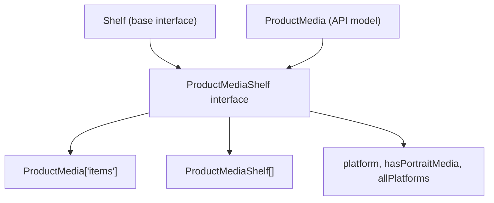
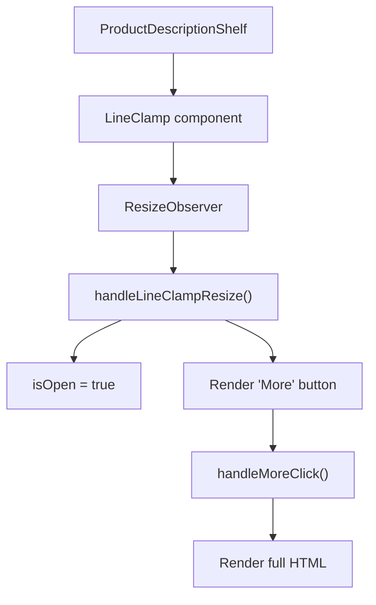
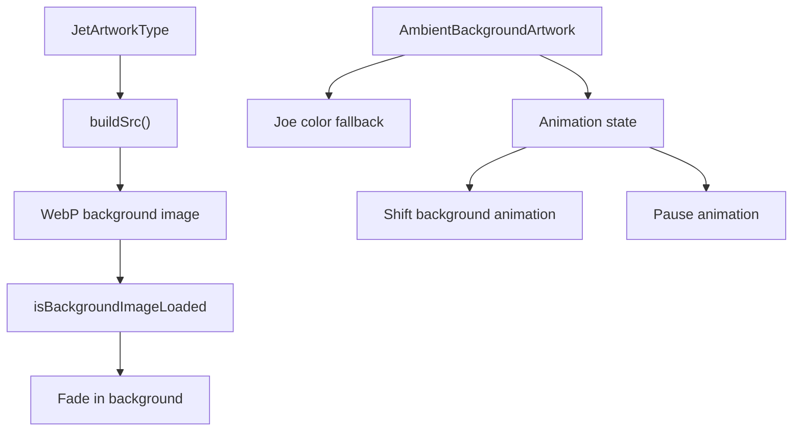
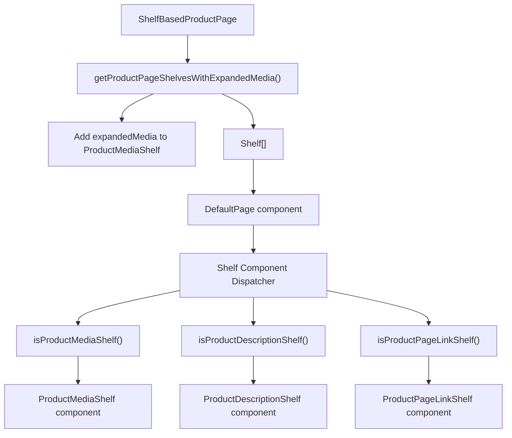

# 产品特定货架 (Product-Specific Shelves)

-   [src/components/AmbientBackgroundArtwork.svelte](https://github.com/Chesszyh/apps.apple.com/blob/279d0c4d/src/components/AmbientBackgroundArtwork.svelte)
-   [src/components/jet/marker-shelf/ProductTopLockup.svelte](https://github.com/Chesszyh/apps.apple.com/blob/279d0c4d/src/components/jet/marker-shelf/ProductTopLockup.svelte)
-   [src/components/jet/shelf/ProductDescriptionShelf.svelte](https://github.com/Chesszyh/apps.apple.com/blob/279d0c4d/src/components/jet/shelf/ProductDescriptionShelf.svelte)
-   [src/components/jet/shelf/ProductMediaShelf.svelte](https://github.com/Chesszyh/apps.apple.com/blob/279d0c4d/src/components/jet/shelf/ProductMediaShelf.svelte)
-   [src/components/pages/ProductPage.svelte](https://github.com/Chesszyh/apps.apple.com/blob/279d0c4d/src/components/pages/ProductPage.svelte)

## 目的与范围 (Purpose and Scope)

本文档详细介绍了专为 App Store Web 应用程序中的产品详情页面设计的专用货架组件。这些货架扩展了通用货架系统，以处理产品特定的内容，如平台特定的屏幕截图、产品描述、评分以及其他产品元数据。

有关整体 `ProductPage` 结构和 MarkerShelf（英雄部分）的信息，请参阅 [Product Page Layout](#6.1)。有关详细的平台特定媒体渲染策略，请参阅 [Platform-Specific Media Rendering](#6.3)。有关通用货架系统架构的信息，请参阅 [Shelf System](#4.2)。

---

## 产品特定货架概览 (Overview of Product-Specific Shelves)

产品页面结合使用了通用货架和专门的产品货架。主要的产品特定货架类型包括：

| 货架类型 | 类型守卫函数 | 主要用途 |
| --- | --- | --- |
| `ProductMediaShelf` | `isProductMediaShelf()` | 平台特定的屏幕截图和视频 |
| `ProductDescriptionShelf` | `isProductDescriptionShelf()` | 具有展开/折叠功能的产品描述 |
| `ProductPageLinkShelf` | `isProductPageLinkShelf()` | 法律链接、EULA、隐私政策 |
| `MarkerShelf` | N/A（通过插槽渲染） | 英雄部分（参见 [Product Page Layout](#6.1)） |

**来源：** [src/components/jet/shelf/ProductMediaShelf.svelte1-270](https://github.com/Chesszyh/apps.apple.com/blob/279d0c4d/src/components/jet/shelf/ProductMediaShelf.svelte#L1-L270) [src/components/jet/shelf/ProductDescriptionShelf.svelte1-96](https://github.com/Chesszyh/apps.apple.com/blob/279d0c4d/src/components/jet/shelf/ProductDescriptionShelf.svelte#L1-L96) [src/components/pages/ProductPage.svelte1-78](https://github.com/Chesszyh/apps.apple.com/blob/279d0c4d/src/components/pages/ProductPage.svelte#L1-L78)

---

## ProductMediaShelf 架构 (ProductMediaShelf Architecture)

### 类型定义与守卫 (Type Definition and Guard)

`ProductMediaShelf` 扩展了基础 `Shelf` 接口，增加了产品媒体特定的属性：

类型守卫会检查 `productMediaItem` 内容类型：

[src/components/jet/shelf/ProductMediaShelf.svelte15-20](https://github.com/Chesszyh/apps.apple.com/blob/279d0c4d/src/components/jet/shelf/ProductMediaShelf.svelte#L15-L20)

**来源：** [src/components/jet/shelf/ProductMediaShelf.svelte1-21](https://github.com/Chesszyh/apps.apple.com/blob/279d0c4d/src/components/jet/shelf/ProductMediaShelf.svelte#L1-L21)

---

### 平台检测与渲染流程 (Platform Detection and Rendering Flow)

> **[Mermaid sequence]**
> *(图表结构无法解析)*

平台信息从 `shelf.contentsMetadata.platform.appPlatform` 中提取 [src/components/jet/shelf/ProductMediaShelf.svelte70-75](https://github.com/Chesszyh/apps.apple.com/blob/279d0c4d/src/components/jet/shelf/ProductMediaShelf.svelte#L70-L75)。每个平台都使用特定的渲染组件和网格布局：

-   **Vision**：使用 `ScreenshotVision` 网格的 `ProductMediaVisionItem`
-   **Phone/Messages**：使用纵向或大型网格的 `ProductMediaPhoneItem`
-   **iPad**：使用纵向或大型网格的 `ProductMediaPadItem`
-   **Mac**：使用大型网格的 `ProductMediaMacItem`
-   **TV**：使用大型网格的 `ProductMediaTVItem`
-   **Watch**：使用手机尺寸网格的 `ProductMediaWatchItem`

**来源：** [src/components/jet/shelf/ProductMediaShelf.svelte70-136](https://github.com/Chesszyh/apps.apple.com/blob/279d0c4d/src/components/jet/shelf/ProductMediaShelf.svelte#L70-L136)

---

### 平台图标映射 (Platform Icon Mapping)

货架使用映射到每个平台的 SF Symbols 来显示平台指示器：

[src/components/jet/shelf/ProductMediaShelf.svelte22-40](https://github.com/Chesszyh/apps.apple.com/blob/279d0c4d/src/components/jet/shelf/ProductMediaShelf.svelte#L22-L40)

```mermaid
flowchart TD
    phone["'phone'"]
    pad["'pad'"]
    tv["'tv'"]
    watch["'watch'"]
    mac["'mac'"]
    messages["'messages'"]
    vision["'vision'"]
    ip["iphone.gen2"]
    ipad["ipad.gen2"]
    tvicon["tv"]
    aw["applewatch"]
    mb["macbook.gen2"]
    msg["message"]
    vp["visionpro"]
    pk["AppStore.AppPlatform.Phone"]
    padk["AppStore.AppPlatform.Pad"]
    tvk["AppStore.AppPlatform.TV"]
    wk["AppStore.AppPlatform.Watch"]
    mk["AppStore.AppPlatform.Mac"]
    msgk["AppStore.AppPlatform.Messages"]
    vk["AppStore.AppPlatform.Vision"]

    phone --> ip
    pad --> ipad
    tv --> tvicon
    watch --> aw
    mac --> mb
    messages --> msg
    vision --> vp
    phone --> pk
    pad --> padk
    tv --> tvk
    watch --> wk
    mac --> mk
    messages --> msgk
    vision --> vk
```

**来源：** [src/components/jet/shelf/ProductMediaShelf.svelte22-40](https://github.com/Chesszyh/apps.apple.com/blob/279d0c4d/src/components/jet/shelf/ProductMediaShelf.svelte#L22-L40)

---

### 扩展媒体系统 (Expanded Media System)

当产品支持多个平台时，`ProductMediaShelf` 可以包含一个 `expandedMedia` 属性，其中包含每个平台的附加 `ProductMediaShelf` 实例：

展开由 `shouldDisplayExpandedMedia` 状态变量控制 [src/components/jet/shelf/ProductMediaShelf.svelte68](https://github.com/Chesszyh/apps.apple.com/blob/279d0c4d/src/components/jet/shelf/ProductMediaShelf.svelte#L68-L68)，当用户点击展开按钮时，该变量从 `false` 变为 `true` [src/components/jet/shelf/ProductMediaShelf.svelte88-96](https://github.com/Chesszyh/apps.apple.com/blob/279d0c4d/src/components/jet/shelf/ProductMediaShelf.svelte#L88-L96)。

展开后，组件会递归地为每个平台渲染自身：

[src/components/jet/shelf/ProductMediaShelf.svelte178-186](https://github.com/Chesszyh/apps.apple.com/blob/279d0c4d/src/components/jet/shelf/ProductMediaShelf.svelte#L178-L186)

展开时会记录指标事件 `platformSelect` [src/components/jet/shelf/ProductMediaShelf.svelte90-95](https://github.com/Chesszyh/apps.apple.com/blob/279d0c4d/src/components/jet/shelf/ProductMediaShelf.svelte#L90-L95)。

**来源：** [src/components/jet/shelf/ProductMediaShelf.svelte68-189](https://github.com/Chesszyh/apps.apple.com/blob/279d0c4d/src/components/jet/shelf/ProductMediaShelf.svelte#L68-L189)

---

### 网格类型选择逻辑 (Grid Type Selection Logic)

传递给 `ShelfItemLayout` 的 `gridType` 属性决定了 CSS 网格配置：

| 平台 | 纵向媒体 | 网格类型 |
| --- | --- | --- |
| Vision | N/A | `ScreenshotVision` |
| Phone/Messages | 是 | `ScreenshotPhone` |
| Phone/Messages | 否 | `ScreenshotLarge` |
| iPad | 是 | `ScreenshotPad` |
| iPad | 否 | `ScreenshotLarge` |
| Mac | N/A | `ScreenshotLarge` |
| TV | N/A | `ScreenshotLarge` |
| Watch | N/A | `ScreenshotPhone` |

`hasPortraitMedia` 标志 [src/components/jet/shelf/ProductMediaShelf.svelte67](https://github.com/Chesszyh/apps.apple.com/blob/279d0c4d/src/components/jet/shelf/ProductMediaShelf.svelte#L67-L67) 从 `shelf.contentsMetadata` 中提取，并驱动针对 Phone 和 iPad 平台的有条件网格选择。

**来源：** [src/components/jet/shelf/ProductMediaShelf.svelte100-136](https://github.com/Chesszyh/apps.apple.com/blob/279d0c4d/src/components/jet/shelf/ProductMediaShelf.svelte#L100-L136)

---

## ProductDescriptionShelf

### 类型定义与接口 (Type Definition and Interface)

类型守卫会同时验证内容类型和项目数组：

[src/components/jet/shelf/ProductDescriptionShelf.svelte11-17](https://github.com/Chesszyh/apps.apple.com/blob/279d0c4d/src/components/jet/shelf/ProductDescriptionShelf.svelte#L11-L17)

**来源：** [src/components/jet/shelf/ProductDescriptionShelf.svelte1-18](https://github.com/Chesszyh/apps.apple.com/blob/279d0c4d/src/components/jet/shelf/ProductDescriptionShelf.svelte#L1-L18)

---

### 展开/折叠行为 (Expand/Collapse Behavior)

该组件实现了一个具有展开功能的行内截断描述：

> **[Mermaid stateDiagram]**
> *(图表结构无法解析)*

状态转换由以下因素控制：

1.  **初始状态**：`isOpen = false` [src/components/jet/shelf/ProductDescriptionShelf.svelte31](https://github.com/Chesszyh/apps.apple.com/blob/279d0c4d/src/components/jet/shelf/ProductDescriptionShelf.svelte#L31-L31)
2.  **自动展开**：如果 `LineClamp` 检测到没有截断 [src/components/jet/shelf/ProductDescriptionShelf.svelte33-37](https://github.com/Chesszyh/apps.apple.com/blob/279d0c4d/src/components/jet/shelf/ProductDescriptionShelf.svelte#L33-L37)
3.  **手动展开**：用户点击 "更多" 按钮 [src/components/jet/shelf/ProductDescriptionShelf.svelte30](https://github.com/Chesszyh/apps.apple.com/blob/279d0c4d/src/components/jet/shelf/ProductDescriptionShelf.svelte#L30-L30)

**来源：** [src/components/jet/shelf/ProductDescriptionShelf.svelte29-57](https://github.com/Chesszyh/apps.apple.com/blob/279d0c4d/src/components/jet/shelf/ProductDescriptionShelf.svelte#L29-L57)

---

### HTML 消毒 (HTML Sanitization)

产品描述以 HTML 形式渲染，必须进行消毒以防止 XSS 攻击：

[src/components/jet/shelf/ProductDescriptionShelf.svelte44](https://github.com/Chesszyh/apps.apple.com/blob/279d0c4d/src/components/jet/shelf/ProductDescriptionShelf.svelte#L44-L44)

`sanitizeHtml()` 工具函数（[从 @amp/web-app-components 导入](https://github.com/Chesszyh/apps.apple.com/blob/279d0c4d/src/components/jet/shelf/ProductDescriptionShelf.svelte#L21-L48)）会去除危险的 HTML 元素和属性，同时保留 `<b>`、`<i>` 和 ` ` 等格式化元素。

**来源：** [src/components/jet/shelf/ProductDescriptionShelf.svelte21-48](https://github.com/Chesszyh/apps.apple.com/blob/279d0c4d/src/components/jet/shelf/ProductDescriptionShelf.svelte#L21-L48)

---

### 行数截断实现 (Line Clamping Implementation)

`LineClamp` 组件 [src/components/jet/shelf/ProductDescriptionShelf.svelte46](https://github.com/Chesszyh/apps.apple.com/blob/279d0c4d/src/components/jet/shelf/ProductDescriptionShelf.svelte#L46-L46) 配置如下：

-   `clamp={5}`：截断前最多显示 5 行
-   `observe`：启用 `ResizeObserver` 以检测布局变化
-   `on:resize`：如果内容刚好容纳则自动展开的处理器

**来源：** [src/components/jet/shelf/ProductDescriptionShelf.svelte33-54](https://github.com/Chesszyh/apps.apple.com/blob/279d0c4d/src/components/jet/shelf/ProductDescriptionShelf.svelte#L33-L54)

---

### 样式与布局 (Styling and Layout)

该描述组件使用渐变叠加技术在截断文本上方遮罩 "更多" 按钮：

[src/components/jet/shelf/ProductDescriptionShelf.svelte76-94](https://github.com/Chesszyh/apps.apple.com/blob/279d0c4d/src/components/jet/shelf/ProductDescriptionShelf.svelte#L76-L94)

该按钮绝对定位在右下角（RTL 下为左下角），其渐变背景从页面背景过渡到透明，在截断文本的最后一行创建无缝淡出效果。

在 medium+ 屏幕上，描述宽度被限制为 66% 以获得更好的可读性 [src/components/jet/shelf/ProductDescriptionShelf.svelte71-73](https://github.com/Chesszyh/apps.apple.com/blob/279d0c4d/src/components/jet/shelf/ProductDescriptionShelf.svelte#L71-L73)。

**来源：** [src/components/jet/shelf/ProductDescriptionShelf.svelte60-95](https://github.com/Chesszyh/apps.apple.com/blob/279d0c4d/src/components/jet/shelf/ProductDescriptionShelf.svelte#L60-L95)

---

## 其他产品特定货架 (Other Product-Specific Shelves)

### ProductPageLinkShelf

渲染产品页面上的法律和信息链接，包括：

-   许可协议 (EULA)
-   隐私政策
-   报告问题

该货架用于 EULA 深层链接功能 [src/components/pages/ProductPage.svelte42-59](https://github.com/Chesszyh/apps.apple.com/blob/279d0c4d/src/components/pages/ProductPage.svelte#L42-L59)，其中 `?lic` 查询参数的存在会自动在页面加载时打开 EULA 模态框。

**来源：** [src/components/pages/ProductPage.svelte14-59](https://github.com/Chesszyh/apps.apple.com/blob/279d0c4d/src/components/pages/ProductPage.svelte#L14-L59)

---

### 环境背景效果 (Ambient Background Effects)

产品页面可以显示源自 App 图标的环境背景艺术资产：

该组件 [src/components/AmbientBackgroundArtwork.svelte1-203](https://github.com/Chesszyh/apps.apple.com/blob/279d0c4d/src/components/AmbientBackgroundArtwork.svelte#L1-L203) 提供了：

-   **懒加载**：背景图像异步加载 [src/components/AmbientBackgroundArtwork.svelte25-29](https://github.com/Chesszyh/apps.apple.com/blob/279d0c4d/src/components/AmbientBackgroundArtwork.svelte#L25-L29)
-   **性能优化**：当不可见或在调整大小时暂停动画 [src/components/AmbientBackgroundArtwork.svelte170-174](https://github.com/Chesszyh/apps.apple.com/blob/279d0c4d/src/components/AmbientBackgroundArtwork.svelte#L170-L174)
-   **模糊与饱和度效果**：营造环境氛围 [src/components/AmbientBackgroundArtwork.svelte106](https://github.com/Chesszyh/apps.apple.com/blob/279d0c4d/src/components/AmbientBackgroundArtwork.svelte#L106-L106)
-   **动画叠加层**：缓慢移动的去饱和背景图案 [src/components/AmbientBackgroundArtwork.svelte143-161](https://github.com/Chesszyh/apps.apple.com/blob/279d0c4d/src/components/AmbientBackgroundArtwork.svelte#L143-L161)

**来源：** [src/components/AmbientBackgroundArtwork.svelte1-203](https://github.com/Chesszyh/apps.apple.com/blob/279d0c4d/src/components/AmbientBackgroundArtwork.svelte#L1-L203)

---

## 与 ProductPage 的集成 (Integration with ProductPage)

产品特定货架通过货架数组处理集成到产品页面中：

`getProductPageShelvesWithExpandedMedia()` 工具函数 [src/components/pages/ProductPage.svelte22](https://github.com/Chesszyh/apps.apple.com/blob/279d0c4d/src/components/pages/ProductPage.svelte#L22-L22) 预处理货架数组，根据产品的多平台支持情况填充 `ProductMediaShelf` 实例的 `expandedMedia` 属性。

**来源：** [src/components/pages/ProductPage.svelte1-78](https://github.com/Chesszyh/apps.apple.com/blob/279d0c4d/src/components/pages/ProductPage.svelte#L1-L78)
