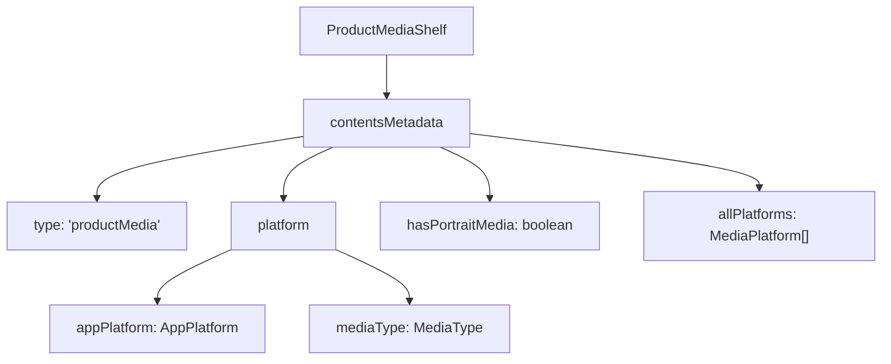
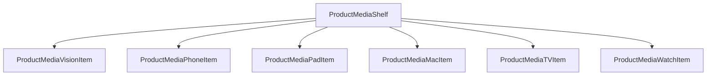
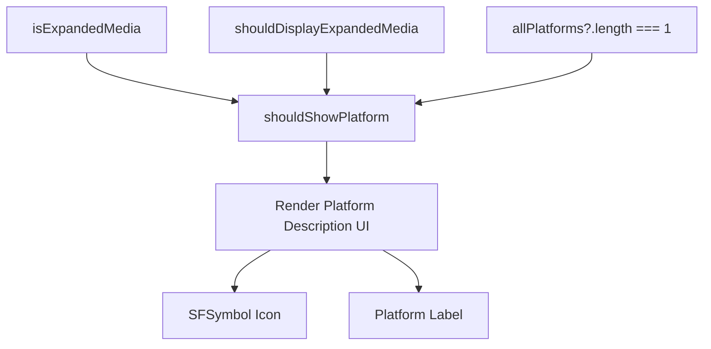
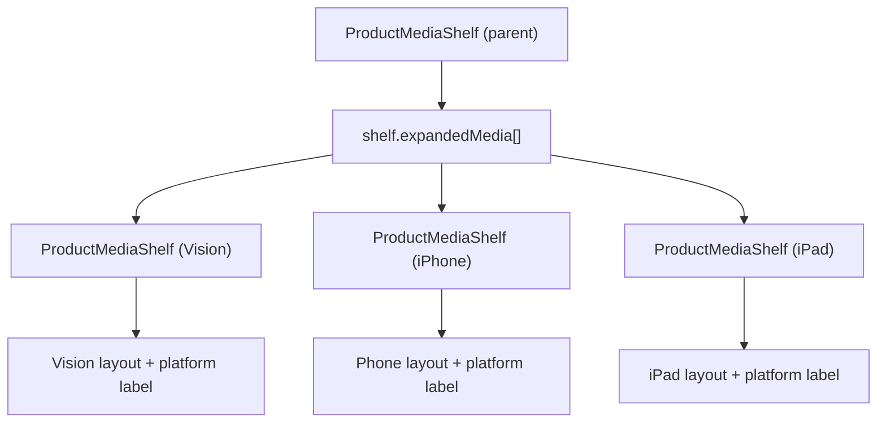
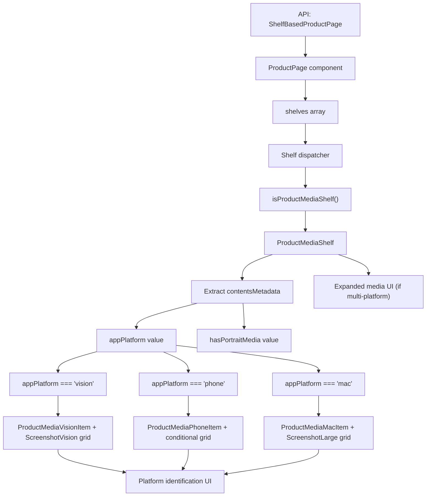

# 平台特定媒体渲染 (Platform-Specific Media Rendering)

-   [src/components/AmbientBackgroundArtwork.svelte](https://github.com/Chesszyh/apps.apple.com/blob/279d0c4d/src/components/AmbientBackgroundArtwork.svelte)
-   [src/components/jet/marker-shelf/ProductTopLockup.svelte](https://github.com/Chesszyh/apps.apple.com/blob/279d0c4d/src/components/jet/marker-shelf/ProductTopLockup.svelte)
-   [src/components/jet/shelf/ProductDescriptionShelf.svelte](https://github.com/Chesszyh/apps.apple.com/blob/279d0c4d/src/components/jet/shelf/ProductDescriptionShelf.svelte)
-   [src/components/jet/shelf/ProductMediaShelf.svelte](https://github.com/Chesszyh/apps.apple.com/blob/279d0c4d/src/components/jet/shelf/ProductMediaShelf.svelte)
-   [src/components/pages/ProductPage.svelte](https://github.com/Chesszyh/apps.apple.com/blob/279d0c4d/src/components/pages/ProductPage.svelte)

## 目的与范围 (Purpose and Scope)

本文档解释了 `ProductMediaShelf` 如何针对不同的 Apple 平台（Vision、Mac、iPad、iPhone、Apple TV、Apple Watch）调整产品屏幕截图和预览视频。每个平台都有独特的长宽比、布局要求和呈现模式，这些都通过平台检测和组件分发系统进行处理。

有关更广泛的产品页面结构的信息，请参阅 [Product Page Layout](#6.1)。有关评分和描述等其他产品特定货架的信息，请参阅 [Product-Specific Shelves](#6.2)。

---

## 平台检测与内容元数据 (Platform Detection and Content Metadata)

`ProductMediaShelf` 通过 `contentsMetadata` 字段接收平台信息，其中包含必要的渲染参数。

**来源：** [src/components/jet/shelf/ProductMediaShelf.svelte70-75](https://github.com/Chesszyh/apps.apple.com/blob/279d0c4d/src/components/jet/shelf/ProductMediaShelf.svelte#L70-L75)

### 内容元数据结构 (Content Metadata Structure)


| 字段 | 类型 | 描述 |
| --- | --- | --- |
| `contentsMetadata.platform.appPlatform` | `AppPlatform` | 主要平台（vision, phone, pad, mac, tv, watch, messages） |
| `contentsMetadata.platform.mediaType` | `MediaType` | 媒体类型（屏幕截图、视频等） |
| `contentsMetadata.hasPortraitMedia` | `boolean` | 媒体项目是否采用纵向方向 |
| `contentsMetadata.allPlatforms` | `MediaPlatform[]` | 针对多平台 App 的所有支持平台 |

货架在初始化时提取这些值：

```
if (shelf.contentsMetadata.type === 'productMedia') {    ({ hasPortraitMedia, allPlatforms } = shelf.contentsMetadata);    ({ appPlatform, mediaType } = shelf.contentsMetadata.platform);}
```
**来源：** [src/components/jet/shelf/ProductMediaShelf.svelte70-75](https://github.com/Chesszyh/apps.apple.com/blob/279d0c4d/src/components/jet/shelf/ProductMediaShelf.svelte#L70-L75)

---

## 平台到组件的分发系统 (Platform-to-Component Dispatch System)

货架使用有条件渲染策略将工作分发给平台特定的项目组件，每个平台都会接收适当的布局配置。


**来源：** [src/components/jet/shelf/ProductMediaShelf.svelte100-136](https://github.com/Chesszyh/apps.apple.com/blob/279d0c4d/src/components/jet/shelf/ProductMediaShelf.svelte#L100-L136)

### 平台组件映射 (Platform Component Mapping)

每个平台根据其显示特性使用特定的组件和网格类型：

| 平台 | 组件 | 网格类型 | 有条件网格 |
| --- | --- | --- | --- |
| `vision` | `ProductMediaVisionItem` | `ScreenshotVision` | \- |
| `phone` / `messages` | `ProductMediaPhoneItem` | `ScreenshotPhone` 或 `ScreenshotLarge` | 基于 `hasPortraitMedia` |
| `pad` | `ProductMediaPadItem` | `ScreenshotPad` 或 `ScreenshotLarge` | 基于 `hasPortraitMedia` |
| `mac` | `ProductMediaMacItem` | `ScreenshotLarge` | \- |
| `tv` | `ProductMediaTVItem` | `ScreenshotLarge` | \- |
| `watch` | `ProductMediaWatchItem` | `ScreenshotPhone` | \- |

网格类型通过 `ShelfItemLayout` 确定列布局、间距和响应式断点。

**来源：** [src/components/jet/shelf/ProductMediaShelf.svelte100-136](https://github.com/Chesszyh/apps.apple.com/blob/279d0c4d/src/components/jet/shelf/ProductMediaShelf.svelte#L100-L136)

### 纵向与横向布局逻辑 (Portrait vs Landscape Layout Logic)

Phone 和 iPad 平台根据媒体方向调整其网格类型：

```
{#if appPlatform === 'phone' || appPlatform === 'messages'}    <ShelfItemLayout        {shelf}        gridType={hasPortraitMedia ? 'ScreenshotPhone' : 'ScreenshotLarge'}        let:item    >        <ProductMediaPhoneItem {item} {hasPortraitMedia} {mediaType} />    </ShelfItemLayout>{:else if appPlatform === 'pad'}    <ShelfItemLayout        {shelf}        gridType={hasPortraitMedia ? 'ScreenshotPad' : 'ScreenshotLarge'}        let:item    >        <ProductMediaPadItem {item} {hasPortraitMedia} {mediaType} />    </ShelfItemLayout>{/if}
```
-   **纵向媒体**：使用 `ScreenshotPhone` 或 `ScreenshotPad` 以支持更高的长宽比
-   **横向媒体**：使用 `ScreenshotLarge` 以支持更宽、更具电影感的布局

**来源：** [src/components/jet/shelf/ProductMediaShelf.svelte104-119](https://github.com/Chesszyh/apps.apple.com/blob/279d0c4d/src/components/jet/shelf/ProductMediaShelf.svelte#L104-L119)

---

## 平台标识 UI (Platform Identification UI)

显示媒体时，用户会通过位于媒体网格下方的图标和标签看到平台标识。


**来源：** [src/components/jet/shelf/ProductMediaShelf.svelte83-147](https://github.com/Chesszyh/apps.apple.com/blob/279d0c4d/src/components/jet/shelf/ProductMediaShelf.svelte#L83-L147)

### 平台图标与标签映射 (Platform Icon and Label Mappings)

货架使用预定义的映射将平台标识符转换为 UI 元素：

```
const platformToIconNameMap: Record<AppPlatform, string> = {    phone: 'iphone.gen2',    pad: 'ipad.gen2',    tv: 'tv',    watch: 'applewatch',    mac: 'macbook.gen2',    messages: 'message',    vision: 'visionpro',};const platformToDescriptionMap: Record<AppPlatform, string> = {    phone: 'AppStore.AppPlatform.Phone',    pad: 'AppStore.AppPlatform.Pad',    tv: 'AppStore.AppPlatform.TV',    watch: 'AppStore.AppPlatform.Watch',    mac: 'AppStore.AppPlatform.Mac',    messages: 'AppStore.AppPlatform.Messages',    vision: 'AppStore.AppPlatform.Vision',};
```
图标名称引用 SF Symbols，通过 `SFSymbol` 组件渲染。描述键是用于本地化平台名称的 i18n 标识符。

**来源：** [src/components/jet/shelf/ProductMediaShelf.svelte22-40](https://github.com/Chesszyh/apps.apple.com/blob/279d0c4d/src/components/jet/shelf/ProductMediaShelf.svelte#L22-L40)

---

## 针对多平台 App 的扩展媒体 (Expanded Media for Multi-Platform Apps)

当一个 App 支持多个平台时，货架提供了一个可扩展的界面，以便分别显示每个平台的媒体。

> **[Mermaid sequence]**
> *(图表结构无法解析)*

**来源：** [src/components/jet/shelf/ProductMediaShelf.svelte88-189](https://github.com/Chesszyh/apps.apple.com/blob/279d0c4d/src/components/jet/shelf/ProductMediaShelf.svelte#L88-L189)

### 扩展媒体状态流 (Expanded Media State Flow)

扩展由三个关键条件控制：

1.  **`shelf.expandedMedia`**：`ProductMediaShelf` 对象数组，每个平台一个
2.  **`allPlatforms.length > 1`**：仅对多平台 App 显示
3.  **`shouldDisplayExpandedMedia`**：由用户交互切换的局部状态

```
{#if shelf.expandedMedia && allPlatforms && allPlatforms.length > 1}    <div class="expanded-media">        {#if !shouldDisplayExpandedMedia}            <button class="expanded-media-header" on:click={displayExpandedMedia}>                <!-- 平台图标和名称 -->            </button>        {/if}        {#if shouldDisplayExpandedMedia}            <div class="expanded-media-content" transition:slide>                {#each shelf.expandedMedia as expandedMediaShelf}                    <svelte:self                        shelf={expandedMediaShelf}                        isExpandedMedia={true}                    />                {/each}            </div>        {/if}    </div>{/if}
```
**来源：** [src/components/jet/shelf/ProductMediaShelf.svelte150-189](https://github.com/Chesszyh/apps.apple.com/blob/279d0c4d/src/components/jet/shelf/ProductMediaShelf.svelte#L150-L189)

### 平台选择器 UI (Platform Selector UI)

展开前，用户会看到包含所有平台图标和名称的紧凑视图：

```
<div class="all-platforms">    <div class="all-platforms-icons">        {#each allPlatforms as platform}            <div class="icon" aria-hidden="true">                <SFSymbol name={platformToIconNameMap[platform.appPlatform]} />            </div>        {/each}    </div>    <div class="all-platforms-names">        {allPlatformsDescription}    </div></div>
```
`allPlatformsDescription` 是一个本地化的、由分隔符连接的字符串：

```
$: allPlatformsDescription = allPlatforms    ?.map(({ appPlatform }) =>        $i18n.t(platformToDescriptionMap[appPlatform]),    )    ?.join($i18n.t('AppStore.AppPlatform.Component.Separator'));
```
**来源：** [src/components/jet/shelf/ProductMediaShelf.svelte77-81](https://github.com/Chesszyh/apps.apple.com/blob/279d0c4d/src/components/jet/shelf/ProductMediaShelf.svelte#L77-L81) [src/components/jet/shelf/ProductMediaShelf.svelte159-171](https://github.com/Chesszyh/apps.apple.com/blob/279d0c4d/src/components/jet/shelf/ProductMediaShelf.svelte#L159-L171)

### 指标追踪 (Metrics Tracking)

当用户展开平台选择器时，会记录一条自定义指标事件：

```
const displayExpandedMedia = () => {    shouldDisplayExpandedMedia = true;    jet.recordCustomMetricsEvent({        eventType: 'click',        actionDetails: { type: 'platformSelect' },        targetType: 'button',        targetId: 'productMediaShelf',    });};
```
这使得能够对用户与多平台内容的互动进行分析追踪。

**来源：** [src/components/jet/shelf/ProductMediaShelf.svelte88-96](https://github.com/Chesszyh/apps.apple.com/blob/279d0c4d/src/components/jet/shelf/ProductMediaShelf.svelte#L88-L96)

---

## 递归渲染模式 (Recursive Rendering Pattern)

`ProductMediaShelf` 使用 Svelte 的 `<svelte:self>` 为每个平台递归地渲染嵌套货架：


每个子货架都会接收到 `isExpandedMedia={true}`，其作用是：

-   防止进一步扩展（无嵌套的展开按钮）
-   显示平台标识标签
-   在最后一个子项上省略底部底部分隔符

**来源：** [src/components/jet/shelf/ProductMediaShelf.svelte179-185](https://github.com/Chesszyh/apps.apple.com/blob/279d0c4d/src/components/jet/shelf/ProductMediaShelf.svelte#L179-L185)

### 扩展媒体样式级联 (Expanded Media Styling Cascade)

父货架控制布局和过渡，而子货架继承适当的间距：

```
.expanded-media-content :global(.shelf:last-of-type) {    padding-bottom: 0;}
```
展开时，`slide` 过渡提供了平滑的揭示动画：

```
<div class="expanded-media-content" transition:slide>
```
**来源：** [src/components/jet/shelf/ProductMediaShelf.svelte179](https://github.com/Chesszyh/apps.apple.com/blob/279d0c4d/src/components/jet/shelf/ProductMediaShelf.svelte#L179-L179) [src/components/jet/shelf/ProductMediaShelf.svelte253-255](https://github.com/Chesszyh/apps.apple.com/blob/279d0c4d/src/components/jet/shelf/ProductMediaShelf.svelte#L253-L255)

---

## 类型守卫与集成 (Type Guard and Integration)

货架通过类型守卫注册到主货架分发器：

```
export function isProductMediaShelf(shelf: Shelf): shelf is ProductMediaShelf {    const { contentType, items } = shelf;    return contentType === 'productMediaItem' && Array.isArray(items);}
```
该守卫在货架分发器中用于将 `productMediaItem` 内容路由到 `ProductMediaShelf` 组件。

**来源：** [src/components/jet/shelf/ProductMediaShelf.svelte15-20](https://github.com/Chesszyh/apps.apple.com/blob/279d0c4d/src/components/jet/shelf/ProductMediaShelf.svelte#L15-L20)

### ProductMediaShelf 接口 (ProductMediaShelf Interface)

该货架扩展了包含产品媒体字段的基础 `Shelf` 接口：

```
interface ProductMediaShelf extends Shelf, ProductMedia {    items: ProductMedia['items'];    expandedMedia?: ProductMediaShelf[];}
```
-   **`items`**：要显示的媒体项目（屏幕截图/视频）数组
-   **`expandedMedia`**：可选的、用于多平台渲染的附加货架数组

**来源：** [src/components/jet/shelf/ProductMediaShelf.svelte10-13](https://github.com/Chesszyh/apps.apple.com/blob/279d0c4d/src/components/jet/shelf/ProductMediaShelf.svelte#L10-L13)

---

## 完整渲染流程 (Complete Rendering Flow)


**来源：** [src/components/jet/shelf/ProductMediaShelf.svelte1-270](https://github.com/Chesszyh/apps.apple.com/blob/279d0c4d/src/components/jet/shelf/ProductMediaShelf.svelte#L1-L270) [src/components/pages/ProductPage.svelte1-78](https://github.com/Chesszyh/apps.apple.com/blob/279d0c4d/src/components/pages/ProductPage.svelte#L1-L78)
