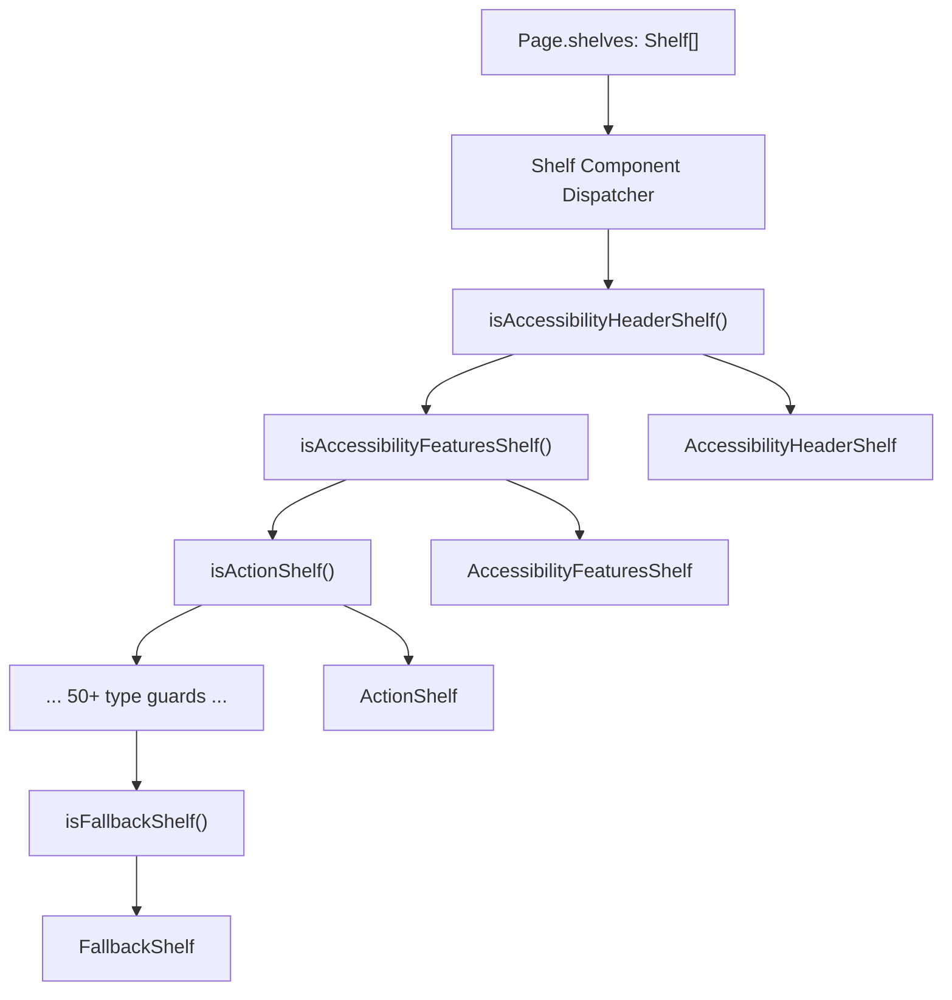
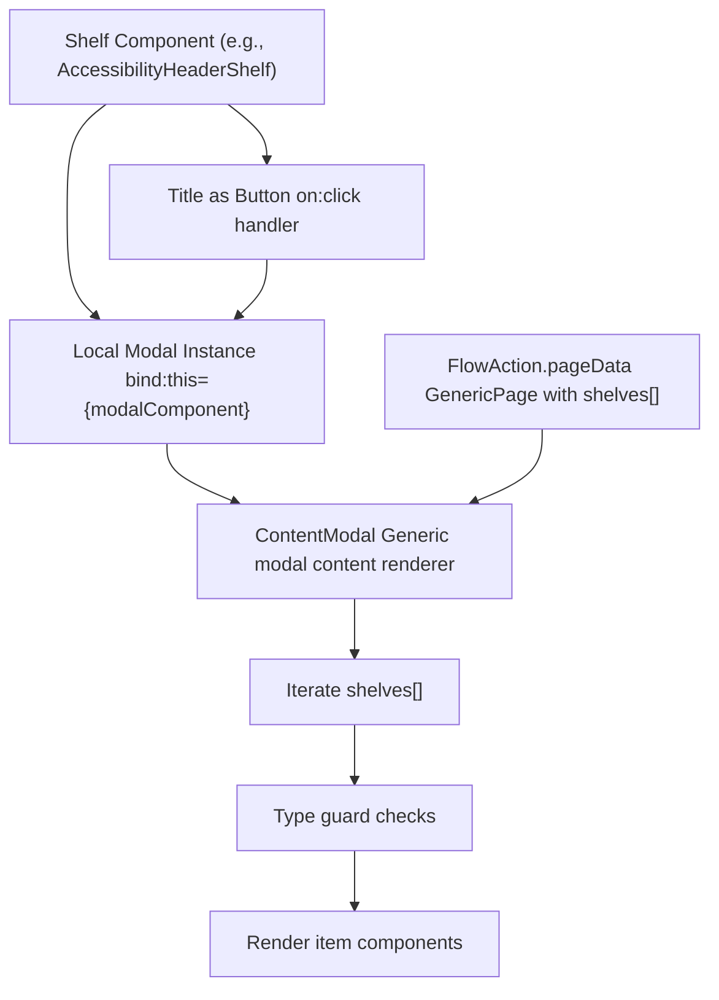
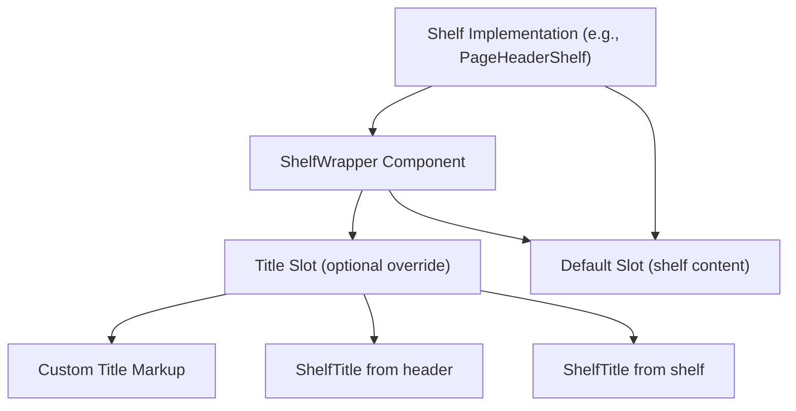

# 货架类型参考 (Shelf Type Reference)

-   [src/components/PageModal.svelte](https://github.com/Chesszyh/apps.apple.com/blob/279d0c4d/src/components/PageModal.svelte)
-   [src/components/Shelf/Wrapper.svelte](https://github.com/Chesszyh/apps.apple.com/blob/279d0c4d/src/components/Shelf/Wrapper.svelte)
-   [src/components/jet/shelf/AccessibilityHeaderShelf.svelte](https://github.com/Chesszyh/apps.apple.com/blob/279d0c4d/src/components/jet/shelf/AccessibilityHeaderShelf.svelte)
-   [src/components/jet/shelf/ArcadeFooterShelf.svelte](https://github.com/Chesszyh/apps.apple.com/blob/279d0c4d/src/components/jet/shelf/ArcadeFooterShelf.svelte)
-   [src/components/jet/shelf/PageHeaderShelf.svelte](https://github.com/Chesszyh/apps.apple.com/blob/279d0c4d/src/components/jet/shelf/PageHeaderShelf.svelte)
-   [src/components/jet/shelf/PrivacyFooterShelf.svelte](https://github.com/Chesszyh/apps.apple.com/blob/279d0c4d/src/components/jet/shelf/PrivacyFooterShelf.svelte)
-   [src/components/jet/shelf/PrivacyHeaderShelf.svelte](https://github.com/Chesszyh/apps.apple.com/blob/279d0c4d/src/components/jet/shelf/PrivacyHeaderShelf.svelte)
-   [src/components/jet/shelf/Shelf.svelte](https://github.com/Chesszyh/apps.apple.com/blob/279d0c4d/src/components/jet/shelf/Shelf.svelte)
-   [src/components/jet/shelf/TitledParagraphShelf.svelte](https://github.com/Chesszyh/apps.apple.com/blob/279d0c4d/src/components/jet/shelf/TitledParagraphShelf.svelte)
-   [src/components/pages/DefaultPage.svelte](https://github.com/Chesszyh/apps.apple.com/blob/279d0c4d/src/components/pages/DefaultPage.svelte)
-   [src/jet/utils/handle-modal-presentation.ts](https://github.com/Chesszyh/apps.apple.com/blob/279d0c4d/src/jet/utils/handle-modal-presentation.ts)
-   [src/stores/modalPage.ts](https://github.com/Chesszyh/apps.apple.com/blob/279d0c4d/src/stores/modalPage.ts)

本页面提供了 App Store Web 应用程序支持的所有货架 (shelf) 类型的完整目录。**货架**是页面构成的基本单位——页面是由货架组成的数组，这些货架根据其 `contentType` 鉴别器字段进行动态渲染。

有关货架如何在页面上编排和渲染的实现细节，请参阅 [Shelf System](#4.2)。有关添加新货架类型的信息，请参阅 [Adding a New Shelf Type](#8.1)。有关货架包装器布局模式的详情，请参阅 [Shelf Wrapper and Common Layout](#4.4)。

## 货架类型系统概览 (Shelf Type System Overview)

货架类型系统使用 TypeScript 类型守卫将通用的 `Shelf` 接口缩小为特定的货架实现。每种货架类型都有三个关键组件：

1.  **TypeScript 接口** - 使用特定于类型的字段（通常是 `contentType` 和 `items`）扩展 `Shelf`
2.  **类型守卫函数** - 缩小类型的运行时检查（命名为 `is[ShelfType]`）
3.  **Svelte 组件** - 渲染货架 UI

[src/components/jet/shelf/Shelf.svelte1-321](https://github.com/Chesszyh/apps.apple.com/blob/279d0c4d/src/components/jet/shelf/Shelf.svelte#L1-L321) 中的中央分发器导入了所有货架组件，并使用级联的 if-else 链将货架与其渲染器进行匹配。

### 类型守卫模式 (Type Guard Pattern)

**来源：** [src/components/jet/shelf/Shelf.svelte1-321](https://github.com/Chesszyh/apps.apple.com/blob/279d0c4d/src/components/jet/shelf/Shelf.svelte#L1-L321) [src/components/jet/shelf/AccessibilityHeaderShelf.svelte33-43](https://github.com/Chesszyh/apps.apple.com/blob/279d0c4d/src/components/jet/shelf/AccessibilityHeaderShelf.svelte#L33-L43) [src/components/jet/shelf/PageHeaderShelf.svelte8-11](https://github.com/Chesszyh/apps.apple.com/blob/279d0c4d/src/components/jet/shelf/PageHeaderShelf.svelte#L8-L11)

### 分发器流程 (Dispatcher Flow)


**来源：** [src/components/jet/shelf/Shelf.svelte205-320](https://github.com/Chesszyh/apps.apple.com/blob/279d0c4d/src/components/jet/shelf/Shelf.svelte#L205-L320)

### 通用货架接口字段 (Common Shelf Interface Fields)

所有货架类型都扩展了 API 模型中的基础 `Shelf` 接口，并且通常包含：

| 字段 | 类型 | 用途 |
| --- | --- | --- |
| `contentType` | `string` | 类型缩小的鉴别器字段 |
| `items` | `Array<T>` | 要渲染的内容项目数组 |
| `title` | `string?` | 可选的货架标题 |
| `subtitle` | `string?` | 可选的货架副标题 |
| `seeAllAction` | `Action?` | “查看全部”导航的可选操作 |
| `header` | `ShelfHeader?` | 包含标题和操作的替代页眉 |
| `id` | `string?` | 锚点链接的 DOM 元素 ID |
| `isHidden` | `boolean?` | 是否跳过渲染此货架 |
| `rowsPerColumn` | `number?` | 网格布局配置 |
| `presentationHints` | `string[]?` | 呈现提示（例如布局偏好） |

**来源：** [src/components/Shelf/Wrapper.svelte1-82](https://github.com/Chesszyh/apps.apple.com/blob/279d0c4d/src/components/Shelf/Wrapper.svelte#L1-L82) [src/components/jet/shelf/ArcadeFooterShelf.svelte24](https://github.com/Chesszyh/apps.apple.com/blob/279d0c4d/src/components/jet/shelf/ArcadeFooterShelf.svelte#L24-L24)

## 完整货架类型目录 (Complete Shelf Type Catalog)

### 类型守卫注册顺序 (Type Guard Registration Order)

分发器中类型守卫检查的顺序决定了优先级。下表列出了所有货架类型，按检查顺序排列：

| # | 货架类型 | 内容类型 | 主要用例 |
| --- | --- | --- | --- |
| 1 | `AccessibilityHeaderShelf` | `accessibilityParagraph` | 带有模态框的无障碍部分页眉 |
| 2 | `AccessibilityFeaturesShelf` | `accessibilityFeatures` | 无障碍特性列表 |
| 3 | `AccessibilityDeveloperLinkShelf` | `accessibilityDeveloperLink` | 开发者无障碍信息链接 |
| 4 | `ActionShelf` | `action` | 包含操作按钮的货架 |
| 5 | `AnnotationShelf` | `annotation` | 编辑注释和笔记 |
| 6 | `AppEventDetailShelf` | `appEventDetail` | App 内事件详情显示 |
| 7 | `AppPromotionShelf` | `appPromotion` | 精选 App 推广 |
| 8 | `AppShowcaseShelf` | `appShowcase` | 展示 App 集合 |
| 9 | `AppTrailerLockupShelf` | `appTrailerLockup` | 带有锁定详情的 App 预告片 |
| 10 | `ArcadeFooterShelf` | `arcadeFooter` | Apple Arcade 页脚链接 |
| 11 | `BannerShelf` | `banner` | 横幅消息（当前为无操作） |
| 12 | `BrickShelf` | `brick` | App/内容砖块网格 |
| 13 | `CategoryBrickShelf` | `categoryBrick` | 类别浏览砖块 |
| 14 | `EditorialCardShelf` | `editorialCard` | 编辑故事卡片 |
| 15 | `EditorialLinkShelf` | `editorialLink` | 编辑导航链接 |
| 16 | `FramedArtworkShelf` | `framedArtwork` | 装饰框中的艺术资产 |
| 17 | `FramedVideoShelf` | `framedVideo` | 装饰框中的视频 |
| 18 | `HeroCarouselShelf` | `heroCarousel` | 带有大型媒体的英雄轮播 |
| 19 | `HorizontalRuleShelf` | `horizontalRule` | 视觉分隔线 |
| 20 | `InAppPurchaseLockupShelf` | `inAppPurchaseLockup` | App 内购买项目 |
| 21 | `LargeHeroBreakoutShelf` | `largeHeroBreakout` | 大型突显英雄项目 |
| 22 | `LargeBrickShelf` | `largeBrick` | 大尺寸砖块网格 |
| 23 | `LargeImageLockupShelf` | `largeImageLockup` | 大型图像锁定项目 |
| 24 | `LargeLockupShelf` | `largeLockup` | 大型 App/内容锁定项 |
| 25 | `LargeStoryCardShelf` | `largeStoryCard` | 大型编辑故事卡片 |
| 26 | `LinkableTextShelf` | `linkableText` | 带有嵌入式链接的文本 |
| 27 | `ProductDescriptionShelf` | `productDescription` | 产品描述文本 |
| 28 | `MediumImageLockupShelf` | `mediumImageLockup` | 中型图像锁定项目 |
| 29 | `MediumLockupShelf` | `mediumLockup` | 中型 App/内容锁定项 |
| 30 | `MediumStoryCardShelf` | `mediumStoryCard` | 中型编辑故事卡片 |
| 31 | `PosterLockupShelf` | `posterLockup` | 海报风格锁定显示 |
| 32 | `ProductBadgeShelf` | `productBadge` | 产品奖项/徽章 |
| 33 | `PageHeaderShelf` | `pageHeader` | 页面级页眉 |
| 34 | `ParagraphShelf` | `paragraph` | 段落文本内容 |
| 35 | `PrivacyHeaderShelf` | `privacyHeader` | 带有模态框的隐私部分页眉 |
| 36 | `PrivacyFooterShelf` | `privacyFooter` | 隐私免责声明页脚 |
| 37 | `PrivacyTypeShelf` | `privacyType` | 隐私数据类型列表 |
| 38 | `ProductMediaShelf` | `productMedia` | 产品屏幕截图/视频 |
| 39 | `ProductRatingsShelf` | `productRatings` | 产品评分摘要 |
| 40 | `ProductReviewShelf` | `productReview` | 个人产品评论 |
| 41 | `RibbonBarShelf` | `ribbonBar` | 丝带 (Ribbon) 导航栏 |
| 42 | `SearchLinkShelf` | `searchLink` | 搜索结果链接 |
| 43 | `SearchResultShelf` | `searchResult` | 搜索结果项目 |
| 44 | `SmallBreakoutShelf` | `smallBreakout` | 小型突显项目 |
| 45 | `SmallBrickShelf` | `smallBrick` | 小尺寸砖块网格 |
| 46 | `SmallStoryCardShelf` | `smallStoryCard` | 小型编辑故事卡片 |
| 47 | `SmallLockupShelf` | `smallLockup` | 小型 App/内容锁定项 |
| 48 | `ProductCapabilityShelf` | `productCapability` | 产品功能列表 |
| 49 | `ProductPageLinkShelf` | `productPageLink` | 产品页面链接 |
| 50 | `QuoteShelf` | `quote` | 引用语和证言 |
| 51 | `ReviewsContainerShelf` | `reviewsContainer` | 评论容器 |
| 52 | `ReviewsShelf` | `reviews` | 评论集合 |
| 53 | `TodayCardShelf` | `todayCard` | Today 标签页编辑卡片 |
| 54 | `TitledParagraphShelf` | `titledParagraph` | 带有模态框的有标题段落 |
| 55 | `UberShelf` | `uber` | 用于特殊定位的元货架 (Meta-shelf) |
| 56 | `MarkerShelf` | N/A | 需要页面上下文的特殊货架 |
| 57 | `FallbackShelf` | N/A | 默认回退渲染器 |

**来源：** [src/components/jet/shelf/Shelf.svelte5-174](https://github.com/Chesszyh/apps.apple.com/blob/279d0c4d/src/components/jet/shelf/Shelf.svelte#L5-L174) [src/components/jet/shelf/Shelf.svelte205-320](https://github.com/Chesszyh/apps.apple.com/blob/279d0c4d/src/components/jet/shelf/Shelf.svelte#L205-L320)

## 货架类别 (Shelf Categories)

### 编辑与推广货架 (Editorial and Promotional Shelves)

这些货架显示精选的编辑内容、促销活动和特色项目。有关详细文档，请参阅 [Editorial and Promotional Shelves](#7.1)。

| 货架类型 | 视觉风格 | 典型用法 |
| --- | --- | --- |
| `TodayCardShelf` | 带有艺术资产的大型卡片 | Today 标签页特色内容 |
| `EditorialCardShelf` | 带有叠加层的故事卡片 | 编辑集合 |
| `HeroCarouselShelf` | 全宽轮播 | 页面英雄区域 |
| `AppPromotionShelf` | 推广锁定项 | 特色 App 推广 |
| `AppShowcaseShelf` | 集合展示 | 精选 App 集合 |
| `LargeStoryCardShelf` | 大型故事格式 | 高级编辑内容 |
| `MediumStoryCardShelf` | 中型故事格式 | 标准编辑内容 |
| `SmallStoryCardShelf` | 紧凑型故事格式 | 密集编辑布局 |
| `FramedArtworkShelf` | 带有边框的艺术资产 | 装饰性图像 |
| `FramedVideoShelf` | 带有边框的视频 | 装饰性视频 |
| `QuoteShelf` | 引用语样式 | 证言 (Testimonials) |

**来源：** [src/components/jet/shelf/TodayCardShelf.svelte](https://github.com/Chesszyh/apps.apple.com/blob/279d0c4d/src/components/jet/shelf/TodayCardShelf.svelte) [src/components/jet/shelf/EditorialCardShelf.svelte](https://github.com/Chesszyh/apps.apple.com/blob/279d0c4d/src/components/jet/shelf/EditorialCardShelf.svelte) [src/components/jet/shelf/HeroCarouselShelf.svelte](https://github.com/Chesszyh/apps.apple.com/blob/279d0c4d/src/components/jet/shelf/HeroCarouselShelf.svelte)

### 锁定与网格货架 (Lockup and Grid Shelves)

这些货架在水平滚动布局或网格中显示 App 和内容。有关详细文档，请参阅 [Lockup and Grid Shelves](#7.2)。

| 货架类型 | 项目大小 | 滚动行为 |
| --- | --- | --- |
| `SmallLockupShelf` | 小型 | 水平滚动 |
| `MediumLockupShelf` | 中型 | 水平滚动 |
| `LargeLockupShelf` | 大型 | 水平滚动 |
| `SmallBrickShelf` | 小型 | 网格布局 |
| `BrickShelf` | 中型 | 网格布局 |
| `LargeBrickShelf` | 大型 | 网格布局 |
| `CategoryBrickShelf` | 类别卡片 | 网格布局 |
| `SmallImageLockupShelf` | 以图像为中心的小型 | 水平滚动 |
| `MediumImageLockupShelf` | 以图像为中心的中型 | 水平滚动 |
| `LargeImageLockupShelf` | 以图像为中心的大型 | 水平滚动 |
| `PosterLockupShelf` | 海报格式 | 水平滚动 |
| `InAppPurchaseLockupShelf` | IAP 项目 | 水平滚动 |
| `AppTrailerLockupShelf` | 以预告片为中心 | 水平滚动 |

**来源：** [src/components/jet/shelf/SmallLockupShelf.svelte](https://github.com/Chesszyh/apps.apple.com/blob/279d0c4d/src/components/jet/shelf/SmallLockupShelf.svelte) [src/components/jet/shelf/BrickShelf.svelte](https://github.com/Chesszyh/apps.apple.com/blob/279d0c4d/src/components/jet/shelf/BrickShelf.svelte) [src/components/jet/shelf/CategoryBrickShelf.svelte](https://github.com/Chesszyh/apps.apple.com/blob/279d0c4d/src/components/jet/shelf/CategoryBrickShelf.svelte)

### 产品特定货架 (Product-Specific Shelves)

这些货架出现在产品详情页面上，并显示产品特定的信息。详情请参阅 [Product-Specific Shelves](#6.2)。

| 货架类型 | 用途 |
| --- | --- |
| `ProductMediaShelf` | 具有平台特定布局的屏幕截图和视频 |
| `ProductDescriptionShelf` | 带有可展开内容的产品描述文本 |
| `ProductRatingsShelf` | 综合评分摘要 |
| `ProductReviewShelf` | 个人用户评论 |
| `ReviewsContainerShelf` | 评论集合容器 |
| `ReviewsShelf` | 评论集合 |
| `ProductBadgeShelf` | 奖项与徽章 |
| `ProductCapabilityShelf` | 产品功能列表 |
| `ProductPageLinkShelf` | 相关产品页面链接 |

**来源：** [src/components/jet/shelf/ProductMediaShelf.svelte](https://github.com/Chesszyh/apps.apple.com/blob/279d0c4d/src/components/jet/shelf/ProductMediaShelf.svelte) [src/components/jet/shelf/ProductDescriptionShelf.svelte](https://github.com/Chesszyh/apps.apple.com/blob/279d0c4d/src/components/jet/shelf/ProductDescriptionShelf.svelte) [src/components/jet/shelf/ProductRatingsShelf.svelte](https://github.com/Chesszyh/apps.apple.com/blob/279d0c4d/src/components/jet/shelf/ProductRatingsShelf.svelte)

### 信息与合规货架 (Informational and Compliance Shelves)

这些货架显示法律、隐私、无障碍和信息性内容。有关详细文档，请参阅 [Informational and Compliance Shelves](#7.3)。

```mermaid
flowchart TD
    F1["ArcadeFooterShelf contentType: arcadeFooter"]
    F2["PrivacyFooterShelf contentType: privacyFooter"]
    T1["PageHeaderShelf contentType: pageHeader"]
    T3["TitledParagraphShelf contentType: titledParagraph"]
    Modal3["Local Modal VersionHistoryPage"]
    T2["ParagraphShelf contentType: paragraph"]
    T4["LinkableTextShelf contentType: linkableText"]
    T5["AnnotationShelf contentType: annotation"]
    P1["PrivacyHeaderShelf contentType: privacyHeader with seeAllAction"]
    Modal2["Local Modal PrivacyDetailPage"]
    P2["PrivacyTypeShelf contentType: privacyType"]
    P3["PrivacyFooterShelf contentType: privacyFooter"]
    A1["AccessibilityHeaderShelf contentType: accessibilityParagraph with seeAllAction"]
    Modal1["Local Modal AccessibilityDetailPage"]
    A2["AccessibilityFeaturesShelf contentType: accessibilityFeatures"]
    A3["AccessibilityDeveloperLinkShelf contentType: accessibilityDeveloperLink"]

    T3 --> Modal3
    P1 --> Modal2
    A1 --> Modal1
```


**来源：** [src/components/jet/shelf/AccessibilityHeaderShelf.svelte1-183](https://github.com/Chesszyh/apps.apple.com/blob/279d0c4d/src/components/jet/shelf/AccessibilityHeaderShelf.svelte#L1-L183) [src/components/jet/shelf/PrivacyHeaderShelf.svelte1-146](https://github.com/Chesszyh/apps.apple.com/blob/279d0c4d/src/components/jet/shelf/PrivacyHeaderShelf.svelte#L1-L146) [src/components/jet/shelf/TitledParagraphShelf.svelte1-119](https://github.com/Chesszyh/apps.apple.com/blob/279d0c4d/src/components/jet/shelf/TitledParagraphShelf.svelte#L1-L119) [src/components/jet/shelf/ArcadeFooterShelf.svelte1-33](https://github.com/Chesszyh/apps.apple.com/blob/279d0c4d/src/components/jet/shelf/ArcadeFooterShelf.svelte#L1-L33)

### 特殊货架 (Special Shelves)

| 货架类型 | 用途 |
| --- | --- |
| `MarkerShelf` | 需要页面级上下文的特殊货架；使用插槽委托模式 |
| `UberShelf` | 元货架，用于位置控制（例如 `style: 'above'` 用于在标题上方放置） |
| `HorizontalRuleShelf` | 视觉分隔符（水平线） |
| `ActionShelf` | 包含操作按钮的货架 |
| `SearchLinkShelf` | 搜索导航链接 |
| `SearchResultShelf` | 搜索结果项目 |
| `RibbonBarShelf` | 导航丝带栏 (Ribbon bar) |
| `BannerShelf` | 横幅消息（当前在 UI 中已禁用） |
| `FallbackShelf` | 未知货架类型的默认渲染器 |

**来源：** [src/components/jet/shelf/MarkerShelf.svelte](https://github.com/Chesszyh/apps.apple.com/blob/279d0c4d/src/components/jet/shelf/MarkerShelf.svelte) [src/components/jet/shelf/UberShelf.svelte](https://github.com/Chesszyh/apps.apple.com/blob/279d0c4d/src/components/jet/shelf/UberShelf.svelte) [src/components/pages/DefaultPage.svelte45-56](https://github.com/Chesszyh/apps.apple.com/blob/279d0c4d/src/components/pages/DefaultPage.svelte#L45-L56)

## 启用模态框的货架 (Modal-Enabled Shelves)

几种货架类型实现了局部模态框功能，用于在不导航的情况下显示附加内容。这些货架使用在货架中直接嵌入 Modal 组件的模式。

### 模态框模式 (Modal Pattern)


**来源：** [src/components/jet/shelf/AccessibilityHeaderShelf.svelte74-149](https://github.com/Chesszyh/apps.apple.com/blob/279d0c4d/src/components/jet/shelf/AccessibilityHeaderShelf.svelte#L74-L149) [src/components/jet/shelf/PrivacyHeaderShelf.svelte55-121](https://github.com/Chesszyh/apps.apple.com/blob/279d0c4d/src/components/jet/shelf/PrivacyHeaderShelf.svelte#L55-L121) [src/components/jet/shelf/TitledParagraphShelf.svelte51-109](https://github.com/Chesszyh/apps.apple.com/blob/279d0c4d/src/components/jet/shelf/TitledParagraphShelf.svelte#L51-L109)

### 带有局部模态框的货架 (Shelves with Local Modals)

| 货架类型 | 模态框触发器 | 模态框内容 | 页面类型 |
| --- | --- | --- | --- |
| `AccessibilityHeaderShelf` | 标题按钮 | 无障碍特性与段落 | `accessibilityDetails` |
| `PrivacyHeaderShelf` | 标题按钮 | 隐私类型与页眉 | `privacyDetail` |
| `TitledParagraphShelf` | 标题按钮 | 版本历史项目 | `versionHistory` |

这些货架使用的模态框模式与全局模态框系统不同（参见 [Modal Presentation](#4.3)）。这些货架：

1.  维护其自己的 `Modal` 组件实例
2.  检查 `seeAllAction` 是否为预期的 `FlowAction` 页面类型
3.  从操作中提取 `pageData: GenericPage`
4.  通过遍历 `pageData.shelves` 并使用类型守卫来渲染模态框内容

**示例实现模式：**

```
// 特定 FlowAction 的类型守卫function isAccessibilityDetailFlowAction(    action: Action,): action is AccessibilityDetailPageFlowAction {    return isFlowAction(action) && action.page === 'accessibilityDetails';}// 若有效则提取目的地const destination =    seeAllAction && isAccessibilityDetailFlowAction(seeAllAction)        ? seeAllAction        : undefined;const pageData = destination?.pageData;
```
**来源：** [src/components/jet/shelf/AccessibilityHeaderShelf.svelte53-90](https://github.com/Chesszyh/apps.apple.com/blob/279d0c4d/src/components/jet/shelf/AccessibilityHeaderShelf.svelte#L53-L90) [src/components/jet/shelf/PrivacyHeaderShelf.svelte36-71](https://github.com/Chesszyh/apps.apple.com/blob/279d0c4d/src/components/jet/shelf/PrivacyHeaderShelf.svelte#L36-L71)

## 数据模型模式 (Data Model Pattern)

所有货架组件都遵循一致的数据模型模式：

**通用模式示例：**

```
// 1. 接口定义 (context="module")interface PageHeaderShelf extends Shelf {    items: [PageHeader];  // 单项目数组}// 2. 类型守卫导出export function isPageHeaderShelf(shelf: Shelf): shelf is PageHeaderShelf {    const { contentType, items } = shelf;    return contentType === 'pageHeader' && Array.isArray(items);}// 3. 组件属性export let shelf: PageHeaderShelf;// 4. 提取项目$: [item] = shelf.items;
```
**来源：** [src/components/jet/shelf/PageHeaderShelf.svelte1-35](https://github.com/Chesszyh/apps.apple.com/blob/279d0c4d/src/components/jet/shelf/PageHeaderShelf.svelte#L1-L35) [src/components/jet/shelf/ArcadeFooterShelf.svelte1-33](https://github.com/Chesszyh/apps.apple.com/blob/279d0c4d/src/components/jet/shelf/ArcadeFooterShelf.svelte#L1-L33) [src/components/jet/shelf/PrivacyFooterShelf.svelte1-41](https://github.com/Chesszyh/apps.apple.com/blob/279d0c4d/src/components/jet/shelf/PrivacyFooterShelf.svelte#L1-L41)

## 货架包装器集成 (Shelf Wrapper Integration)

大多数货架将其内容包装在 `ShelfWrapper` 中，以提供一致的布局、间距和标题渲染。该包装器处理：

-   来自 `shelf.title`、`shelf.subtitle` 或 `shelf.header` 的标题和副标题显示
-   查看全部 (See All) 操作渲染
-   居中和间距
-   边框和外边距配置


**通用使用模式：**

```
<ShelfWrapper {shelf} withBottomPadding={false}>    <!-- 可选的自定义标题 -->    <div slot="title" class="custom-title">        <ShelfTitle title={item.title} subtitle={item.subtitle} />    </div>        <!-- 货架内容 -->    <div class="shelf-content">        {#each shelf.items as item}            <ItemComponent {item} />        {/each}    </div></ShelfWrapper>
```
**来源：** [src/components/Shelf/Wrapper.svelte1-82](https://github.com/Chesszyh/apps.apple.com/blob/279d0c4d/src/components/Shelf/Wrapper.svelte#L1-L82) [src/components/jet/shelf/PageHeaderShelf.svelte23-27](https://github.com/Chesszyh/apps.apple.com/blob/279d0c4d/src/components/jet/shelf/PageHeaderShelf.svelte#L23-L27) [src/components/jet/shelf/ArcadeFooterShelf.svelte28-32](https://github.com/Chesszyh/apps.apple.com/blob/279d0c4d/src/components/jet/shelf/ArcadeFooterShelf.svelte#L28-L32)

## 页面级货架渲染 (Page-Level Shelf Rendering)

货架在页面级别通过遍历 `shelves` 数组并委托给 `Shelf` 分发器组件进行渲染：

> **[Mermaid sequence]**
> *(图表结构无法解析)*

**来源：** [src/components/pages/DefaultPage.svelte94-124](https://github.com/Chesszyh/apps.apple.com/blob/279d0c4d/src/components/pages/DefaultPage.svelte#L94-L124) [src/components/jet/shelf/Shelf.svelte195-320](https://github.com/Chesszyh/apps.apple.com/blob/279d0c4d/src/components/jet/shelf/Shelf.svelte#L195-L320)

## 全局 vs. 局部模态框渲染 (Global vs. Local Modal Rendering)

应用程序支持两种模态框渲染模式：

### 全局模态框 (PageModal)

用于可从应用程序任何位置触发的通用流操作 (flow actions)。由 `modalPageStore` 管理。

**流程：**

1.  执行操作 → `handleModalPresentation()` 工具
2.  设置带有页面数据的 `modalPageStore`
3.  `PageModal` 组件（全局）对 store 更改做出反应
4.  通过 `Shelf` 分发器渲染 `GenericPage.shelves[]`

**来源：** [src/components/PageModal.svelte1-83](https://github.com/Chesszyh/apps.apple.com/blob/279d0c4d/src/components/PageModal.svelte#L1-L83) [src/jet/utils/handle-modal-presentation.ts1-30](https://github.com/Chesszyh/apps.apple.com/blob/279d0c4d/src/jet/utils/handle-modal-presentation.ts#L1-L30) [src/stores/modalPage.ts1-36](https://github.com/Chesszyh/apps.apple.com/blob/279d0c4d/src/stores/modalPage.ts#L1-L36)

### 局部模态框 (直接货架所有权)

由特定货架用于专用模态框内容（无障碍、隐私、版本历史）。

**流程：**

1.  货架组件拥有 `Modal` 实例
2.  标题按钮触发 `showModal()`
3.  模态框从 `FlowAction.pageData.shelves[]` 渲染内容
4.  使用货架特定的类型守卫来渲染项目

**来源：** [src/components/jet/shelf/AccessibilityHeaderShelf.svelte74-149](https://github.com/Chesszyh/apps.apple.com/blob/279d0c4d/src/components/jet/shelf/AccessibilityHeaderShelf.svelte#L74-L149) [src/components/jet/shelf/PrivacyHeaderShelf.svelte55-121](https://github.com/Chesszyh/apps.apple.com/blob/279d0c4d/src/components/jet/shelf/PrivacyHeaderShelf.svelte#L55-L121)

## 实现说明 (Implementation Notes)

### 分发器中的货架顺序 (Shelf Ordering in Dispatcher)

[src/components/jet/shelf/Shelf.svelte205-320](https://github.com/Chesszyh/apps.apple.com/blob/279d0c4d/src/components/jet/shelf/Shelf.svelte#L205-L320) 中类型守卫检查的顺序对于具有重叠特征的货架很重要。较具体的检查应先于较通用的检查。

### BannerShelf 无操作 (BannerShelf No-Op)

`BannerShelf` 已导入并具有类型守卫，但有意不进行渲染（见第 226 行注释）。这保留了基础设施，同时禁用了该功能。

### MarkerShelf 委托 (MarkerShelf Delegation)

`MarkerShelf` 使用特殊的插槽委托模式，因为它需要货架级别无法提供的页面级数据。父页面组件必须提供 `marker-shelf` 插槽实现。

**来源：** [src/components/jet/shelf/Shelf.svelte176-190](https://github.com/Chesszyh/apps.apple.com/blob/279d0c4d/src/components/jet/shelf/Shelf.svelte#L176-L190) [src/components/pages/DefaultPage.svelte27-37](https://github.com/Chesszyh/apps.apple.com/blob/279d0c4d/src/components/pages/DefaultPage.svelte#L27-L37)

### 隐藏货架 (Hidden Shelves)

页面可以包含 `isHidden: true` 的货架，这些货架在渲染期间会被跳过 [src/components/pages/DefaultPage.svelte114](https://github.com/Chesszyh/apps.apple.com/blob/279d0c4d/src/components/pages/DefaultPage.svelte#L114-L114)。

### 项目数组 (Item Arrays)

大多数货架具有 `items: T[]`，但有些货架使用 TypeScript 元组类型（如 `items: [PageHeader]`）来强制执行单项目数组，以确保恰好有一个项目。

**来源：** [src/components/jet/shelf/PageHeaderShelf.svelte4-6](https://github.com/Chesszyh/apps.apple.com/blob/279d0c4d/src/components/jet/shelf/PageHeaderShelf.svelte#L4-L6) [src/components/jet/shelf/PrivacyHeaderShelf.svelte16-18](https://github.com/Chesszyh/apps.apple.com/blob/279d0c4d/src/components/jet/shelf/PrivacyHeaderShelf.svelte#L16-L18)
