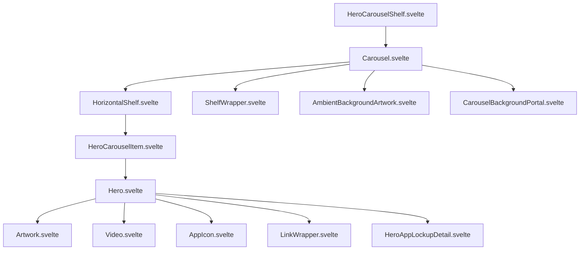
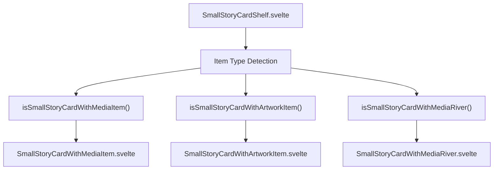

# 编辑与推广货架 (Editorial and Promotional Shelves)

-   [src/components/hero/Carousel.svelte](https://github.com/Chesszyh/apps.apple.com/blob/279d0c4d/src/components/hero/Carousel.svelte)
-   [src/components/hero/Hero.svelte](https://github.com/Chesszyh/apps.apple.com/blob/279d0c4d/src/components/hero/Hero.svelte)
-   [src/components/jet/item/BrickItem.svelte](https://github.com/Chesszyh/apps.apple.com/blob/279d0c4d/src/components/jet/item/BrickItem.svelte)
-   [src/components/jet/item/EditorialCardItem.svelte](https://github.com/Chesszyh/apps.apple.com/blob/279d0c4d/src/components/jet/item/EditorialCardItem.svelte)
-   [src/components/jet/item/HeroCarouselItem.svelte](https://github.com/Chesszyh/apps.apple.com/blob/279d0c4d/src/components/jet/item/HeroCarouselItem.svelte)
-   [src/components/jet/item/LargeStoryCardItem.svelte](https://github.com/Chesszyh/apps.apple.com/blob/279d0c4d/src/components/jet/item/LargeStoryCardItem.svelte)
-   [src/components/jet/item/SmallStoryCardWithArtworkItem.svelte](https://github.com/Chesszyh/apps.apple.com/blob/279d0c4d/src/components/jet/item/SmallStoryCardWithArtworkItem.svelte)
-   [src/components/jet/item/SmallStoryCardWithMediaItem.svelte](https://github.com/Chesszyh/apps.apple.com/blob/279d0c4d/src/components/jet/item/SmallStoryCardWithMediaItem.svelte)
-   [src/components/jet/item/SmallStoryCardWithMediaRiver.svelte](https://github.com/Chesszyh/apps.apple.com/blob/279d0c4d/src/components/jet/item/SmallStoryCardWithMediaRiver.svelte)
-   [src/components/jet/shelf/Shelf.svelte](https://github.com/Chesszyh/apps.apple.com/blob/279d0c4d/src/components/jet/shelf/Shelf.svelte)
-   [src/components/jet/today-card/TodayCard.svelte](https://github.com/Chesszyh/apps.apple.com/blob/279d0c4d/src/components/jet/today-card/TodayCard.svelte)
-   [src/components/jet/today-card/TodayCardOverlay.svelte](https://github.com/Chesszyh/apps.apple.com/blob/279d0c4d/src/components/jet/today-card/TodayCardOverlay.svelte)
-   [src/components/jet/today-card/overlay/TodayCardLockupListOverlay.svelte](https://github.com/Chesszyh/apps.apple.com/blob/279d0c4d/src/components/jet/today-card/overlay/TodayCardLockupListOverlay.svelte)

## 目的与范围 (Purpose and Scope)

本文档列出了在整个 App Store Web 应用程序中使用的编辑与推广货架类型。这些货架专为精选的、视觉丰富的内容呈现而设计，包括英雄轮播、故事卡片、Today 卡片和砖块项目。编辑货架优先考虑视觉叙事和推广内容，而非功用性展示。

有关锁定式 (lockup-based) 和网格货架类型，请参阅 [Lockup and Grid Shelves](#7.2)。有关信息与合规货架，请参阅 [Informational and Compliance Shelves](#7.3)。有关通用货架渲染架构，请参阅 [Shelf System](#4.2)。

---

## 概览 (Overview)

编辑与推广货架的特征包括：

-   **丰富媒体**：显著使用大型图像、视频和艺术资产
-   **侧重叙事**：旨在传达叙事并突出精选内容
-   **视觉层级**：强调强大的排版和布局，而非密集的信息展示
-   **推广意图**：用于展示 App、事件、集合和编辑内容

[src/components/jet/shelf/Shelf.svelte1-321](https://github.com/Chesszyh/apps.apple.com/blob/279d0c4d/src/components/jet/shelf/Shelf.svelte#L1-L321) 中的货架分发器使用类型守卫函数将通用的 `Shelf` 模型路由到专门的组件。编辑货架由组合了 `Hero`、`TodayCard`、`BrickItem` 以及相关呈现组件的组件进行渲染。

来源：[src/components/jet/shelf/Shelf.svelte1-321](https://github.com/Chesszyh/apps.apple.com/blob/279d0c4d/src/components/jet/shelf/Shelf.svelte#L1-L321)

---

## 货架类型分发器架构 (Shelf Type Dispatcher Architecture)

```mermaid
flowchart TD
    GenericShelf["Shelf (Generic Model)"]
    Dispatcher["Shelf.svelte Dispatcher"]
    TodayGuard["isTodayCardShelf()"]
    EditorialGuard["isEditorialCardShelf()"]
    HeroGuard["isHeroCarouselShelf()"]
    BrickGuard["isBrickShelf()"]
    StoryGuard["isSmallStoryCardShelf()"]
    LargeStoryGuard["isLargeStoryCardShelf()"]
    AppPromotionGuard["isAppPromotionShelf()"]
    AppShowcaseGuard["isAppShowcaseShelf()"]
    BreakoutGuard["isSmallBreakoutShelf()"]
    FramedArtGuard["isFramedArtworkShelf()"]
    TodayShelf["TodayCardShelf.svelte"]
    EditorialShelf["EditorialCardShelf.svelte"]
    HeroShelf["HeroCarouselShelf.svelte"]
    BrickShelf["BrickShelf.svelte"]
    StoryShelf["SmallStoryCardShelf.svelte"]
    LargeStoryShelf["LargeStoryCardShelf.svelte"]
    AppPromotionShelf["AppPromotionShelf.svelte"]
    AppShowcaseShelf["AppShowcaseShelf.svelte"]
    BreakoutShelf["SmallBreakoutShelf.svelte"]
    FramedArtShelf["FramedArtworkShelf.svelte"]

    GenericShelf --> Dispatcher
    Dispatcher --> TodayGuard
    Dispatcher --> EditorialGuard
    Dispatcher --> HeroGuard
    Dispatcher --> BrickGuard
    Dispatcher --> StoryGuard
    Dispatcher --> LargeStoryGuard
    Dispatcher --> AppPromotionGuard
    Dispatcher --> AppShowcaseGuard
    Dispatcher --> BreakoutGuard
    Dispatcher --> FramedArtGuard
    TodayGuard --> TodayShelf
    EditorialGuard --> EditorialShelf
    HeroGuard --> HeroShelf
    BrickGuard --> BrickShelf
    StoryGuard --> StoryShelf
    LargeStoryGuard --> LargeStoryShelf
    AppPromotionGuard --> AppPromotionShelf
    AppShowcaseGuard --> AppShowcaseShelf
    BreakoutGuard --> BreakoutShelf
    FramedArtGuard --> FramedArtShelf
```


来源：[src/components/jet/shelf/Shelf.svelte1-321](https://github.com/Chesszyh/apps.apple.com/blob/279d0c4d/src/components/jet/shelf/Shelf.svelte#L1-L321)

---

## 编辑货架类型目录 (Editorial Shelf Type Catalog)

| 货架类型 | 类型守卫函数 | 组件 | 主要用例 |
| --- | --- | --- | --- |
| `TodayCardShelf` | `isTodayCardShelf` | `TodayCardShelf.svelte` | Today 标签页上精选的 App 故事和集合 |
| `EditorialCardShelf` | `isEditorialCardShelf` | `EditorialCardShelf.svelte` | 带有 App 锁定项的大型编辑专题 |
| `HeroCarouselShelf` | `isHeroCarouselShelf` | `HeroCarouselShelf.svelte` | 具有环境背景的多项目轮播 |
| `LargeStoryCardShelf` | `isLargeStoryCardShelf` | `LargeStoryCardShelf.svelte` | 带有媒体的全宽故事卡片 |
| `MediumStoryCardShelf` | `isMediumStoryCardShelf` | `MediumStoryCardShelf.svelte` | 中型故事卡片 |
| `SmallStoryCardShelf` | `isSmallStoryCardShelf` | `SmallStoryCardShelf.svelte` | 网格中的紧凑型故事卡片 |
| `BrickShelf` | `isBrickShelf` | `BrickShelf.svelte` | 带有叠加文本的 16:9 推广卡片 |
| `SmallBrickShelf` | `isSmallBrickShelf` | `SmallBrickShelf.svelte` | 用于紧凑布局的小型砖块项目 |
| `LargeBrickShelf` | `isLargeBrickShelf` | `LargeBrickShelf.svelte` | 用于显著位置的大型砖块项目 |
| `CategoryBrickShelf` | `isCategoryBrickShelf` | `CategoryBrickShelf.svelte` | 带有砖块样式的类别导航 |
| `AppPromotionShelf` | `isAppPromotionShelf` | `AppPromotionShelf.svelte` | App 推广内容 |
| `AppShowcaseShelf` | `isAppShowcaseShelf` | `AppShowcaseShelf.svelte` | 展示 App 集合 |
| `AppTrailerLockupShelf` | `isAppTrailerLockupShelf` | `AppTrailerLockupShelf.svelte` | 带有锁定详情的 App 预告片 |
| `SmallBreakoutShelf` | `isSmallBreakoutShelf` | `SmallBreakoutShelf.svelte` | 小型推广突显项目 |
| `LargeHeroBreakoutShelf` | `isLargeHeroBreakoutShelf` | `LargeHeroBreakoutShelf.svelte` | 大型英雄风格突显项目 |
| `FramedArtworkShelf` | `isFramedArtworkShelf` | `FramedArtworkShelf.svelte` | 带有装饰框的艺术资产 |
| `FramedVideoShelf` | `isFramedVideoShelf` | `FramedVideoShelf.svelte` | 带有装饰框的视频内容 |

来源：[src/components/jet/shelf/Shelf.svelte1-321](https://github.com/Chesszyh/apps.apple.com/blob/279d0c4d/src/components/jet/shelf/Shelf.svelte#L1-L321)

---

## 英雄轮播货架 (Hero Carousel Shelves)

### HeroCarouselShelf

**用途**：显示大型英雄项目的水平滚动轮播，每个项目都具有全屏图像或视频，并带有叠加文本和可选的 App 锁定详情。在较大的视口上支持环境背景效果。

**类型守卫**：[src/components/jet/shelf/Shelf.svelte54-56](https://github.com/Chesszyh/apps.apple.com/blob/279d0c4d/src/components/jet/shelf/Shelf.svelte#L54-L56) 中的 `isHeroCarouselShelf(shelf)`

**渲染组件**：`HeroCarouselShelf.svelte`

**关键特征**：

-   使用 `Carousel.svelte` 组件进行编排
-   每个轮播项目通过 `HeroCarouselItem.svelte` 渲染
-   为每个项目渲染 `Hero.svelte` 组件
-   在非移动视口上支持环境背景艺术资产传送门 (portal)
-   实现交叉观察器 (intersection observer) 用于活动项检测
-   长宽比自适应：移动端 3:4，大屏幕 16:9

**组件层级**：


**数据模型字段**（来自 `HeroCarouselItem` 接口）：

-   `artwork`：英雄项目的主要视觉艺术资产
-   `video`：可选视频内容（带有 `portraitVideo` 变体）
-   `backgroundColor`：渐变叠加层的强调色
-   `isMediaDark`：决定文本颜色方案
-   `collectionIcons`：用于集合展示的 App 图标数组
-   `overlay`：包含以下内容的对象：
    -   `titleText`：主标题
    -   `badgeText`：标语文本 (Eyebrow text)
    -   `descriptionText`：副标题
    -   `callToActionText`：按钮文本
    -   `lockup`：App 锁定详情
    -   `clickAction`：导航操作

来源：[src/components/hero/Carousel.svelte1-133](https://github.com/Chesszyh/apps.apple.com/blob/279d0c4d/src/components/hero/Carousel.svelte#L1-L133) [src/components/jet/item/HeroCarouselItem.svelte1-61](https://github.com/Chesszyh/apps.apple.com/blob/279d0c4d/src/components/jet/item/HeroCarouselItem.svelte#L1-L61) [src/components/hero/Hero.svelte1-537](https://github.com/Chesszyh/apps.apple.com/blob/279d0c4d/src/components/hero/Hero.svelte#L1-L537)

---

## 英雄组件架构 (Hero Component Architecture)

[src/components/hero/Hero.svelte1-537](https://github.com/Chesszyh/apps.apple.com/blob/279d0c4d/src/components/hero/Hero.svelte#L1-L537) 中的 `Hero` 组件为跨多个货架类型的英雄风格项目提供了基础显示逻辑。它实现了呈现与特定数据模型的解耦。

### 英雄组件输入 (Hero Component Inputs)

| 属性 (Prop) | 类型 | 用途 |
| --- | --- | --- |
| `title` | `string` | 主标题文本 |
| `eyebrow` | `string` | 标题上方的文本（或使用 eyebrow 插槽） |
| `subtitle` | `string` | 标题下方的文本 |
| `backgroundColor` | `Color` | 用于渐变的强调色 |
| `artwork` | `Artwork` | 静态图像 |
| `video` | `Video` | 视频内容（优先级高于艺术资产） |
| `action` | `Action` | 点击操作 |
| `pinArtworkToHorizontalEnd` | `boolean` | 将艺术资产对齐到结束边缘 (end edge) |
| `pinArtworkToVerticalMiddle` | `boolean` | 将艺术资产垂直居中 |
| `pinTextToVerticalStart` | `boolean` | 将文本置于顶部 |
| `profileOverride` | `NamedProfile` | 强制使用特定的艺术资产配置文件 |
| `isMediaDark` | `boolean` | 控制文本颜色方案 |
| `collectionIcons` | `Artwork[]` | 用于集合展示的 App 图标 |

### 英雄组件视觉特性 (Hero Visual Features)

**渐变叠加层 (Gradient Overlay)**：[src/components/hero/Hero.svelte366-414](https://github.com/Chesszyh/apps.apple.com/blob/279d0c4d/src/components/hero/Hero.svelte#L366-L414)

-   根据艺术资产放置位置而变化的动态渐变遮罩
-   使用来自 `backgroundColor` 的 `--color` CSS 变量
-   针对文本在底部与文本在顶部的布局使用不同的渐变遮罩
-   RTL 感知的渐变方向

**集合图标显示 (Collection Icons Display)**：[src/components/hero/Hero.svelte161-178](https://github.com/Chesszyh/apps.apple.com/blob/279d0c4d/src/components/hero/Hero.svelte#L161-L178)

-   最多显示 5 个 App 图标的网格布局
-   使用图标颜色生成的动画渐变背景
-   背景渐变通过 `getBackgroundGradientCSSVarsFromArtworks` 使用亮度排序

**响应式配置文件 (Responsive Profiles)**：[src/components/hero/Hero.svelte99-111](https://github.com/Chesszyh/apps.apple.com/blob/279d0c4d/src/components/hero/Hero.svelte#L99-L111)

-   `large-hero-portrait`：移动端纵向布局
-   `large-hero`：默认横向布局
-   `large-hero-east` / `large-hero-west`：用于钉定艺术资产的方向性布局
-   根据属性和视口自动确定配置文件

来源：[src/components/hero/Hero.svelte1-537](https://github.com/Chesszyh/apps.apple.com/blob/279d0c4d/src/components/hero/Hero.svelte#L1-L537)

---

## Today 卡片货架 (Today Card Shelves)

### TodayCardShelf

**用途**：显示精选的 "Today" 卡片，展示 App 故事、集合和编辑专题。这些卡片支持丰富的媒体（图像、视频、App 事件项和 App 图标流）、带有 App 锁定项的叠加层以及多种样式变体。

**类型守卫**：[src/components/jet/shelf/Shelf.svelte166-168](https://github.com/Chesszyh/apps.apple.com/blob/279d0c4d/src/components/jet/shelf/Shelf.svelte#L166-L168) 中的 `isTodayCardShelf(shelf)`

**渲染组件**：`TodayCardShelf.svelte`

**核心组件**：[src/components/jet/today-card/TodayCard.svelte1-402](https://github.com/Chesszyh/apps.apple.com/blob/279d0c4d/src/components/jet/today-card/TodayCard.svelte#L1-L402) 中的 `TodayCard.svelte`

### TodayCard 数据模型 (TodayCard Data Model)

### TodayCard 变体 (TodayCard Variants)

**样式变体**（由 `style` 字段控制）：

| 样式 | 文本颜色 | 背景行为 | 用途 |
| --- | --- | --- | --- |
| `light` | 白色 | 暗色调叠加 | 具有暗色叠加层的亮色媒体 |
| `dark` | 白色 | 暗色调叠加 | 暗色媒体 |
| `white` | 暗色 | 亮色调叠加 | 亮色背景上的编辑卡片 |

来源：[src/components/jet/today-card/TodayCard.svelte198-211](https://github.com/Chesszyh/apps.apple.com/blob/279d0c4d/src/components/jet/today-card/TodayCard.svelte#L198-L211)

**媒体类型**：

1.  **艺术资产媒体 (Artwork Media)**：[src/components/jet/today-card/TodayCard.svelte82-84](https://github.com/Chesszyh/apps.apple.com/blob/279d0c4d/src/components/jet/today-card/TodayCard.svelte#L82-L84) 中的静态图像
2.  **App 事件媒体 (App Event Media)**：具有渐变保护的事件特定内容
3.  **列表媒体 (List Media)**：列表格式的多个 App 锁定项
4.  **流媒体 (River Media)**：带有渐变背景的流动 App 图标展示

**保护层 (Protection Layers)**：[src/components/jet/today-card/TodayCard.svelte56-65](https://github.com/Chesszyh/apps.apple.com/blob/279d0c4d/src/components/jet/today-card/TodayCard.svelte#L56-L65)

-   `useProtectionLayer`：启用模糊/色调以保证文本可读性
-   `useBlurryProtectionLayer`：针对标准卡片的带有遮罩渐变的背景模糊
-   `useGradientProtectionLayer`：针对 App 事件卡片的自下而上的渐变

### TodayCard 叠加系统 (TodayCard Overlay System)

叠加层渲染在卡片底部，支持两种类型：

**锁定叠加层 (Lockup Overlay)** (`TodayCardLockupOverlay`)：

-   渲染单个 `SmallLockupItem` 组件
-   用于突出单个 App
-   类型守卫：[src/components/jet/today-card/TodayCardOverlay.svelte7-11](https://github.com/Chesszyh/apps.apple.com/blob/279d0c4d/src/components/jet/today-card/TodayCardOverlay.svelte#L7-L11) 中的 `isLockupOverlay(overlay)`

**锁定列表叠加层 (Lockup List Overlay)** (`TodayCardLockupListOverlay`)：

-   渲染 App 图标的水平列表
-   用于 App 集合
-   组件：[src/components/jet/today-card/overlay/TodayCardLockupListOverlay.svelte1-43](https://github.com/Chesszyh/apps.apple.com/blob/279d0c4d/src/components/jet/today-card/overlay/TodayCardLockupListOverlay.svelte#L1-L43)
-   类型守卫：[src/components/jet/today-card/overlay/TodayCardLockupListOverlay.svelte7-11](https://github.com/Chesszyh/apps.apple.com/blob/279d0c4d/src/components/jet/today-card/overlay/TodayCardLockupListOverlay.svelte#L7-L11) 中的 `isLockupListOverlay(overlay)`

来源：[src/components/jet/today-card/TodayCard.svelte1-402](https://github.com/Chesszyh/apps.apple.com/blob/279d0c4d/src/components/jet/today-card/TodayCard.svelte#L1-L402) [src/components/jet/today-card/TodayCardOverlay.svelte1-49](https://github.com/Chesszyh/apps.apple.com/blob/279d0c4d/src/components/jet/today-card/TodayCardOverlay.svelte#L1-L49) [src/components/jet/today-card/overlay/TodayCardLockupListOverlay.svelte1-43](https://github.com/Chesszyh/apps.apple.com/blob/279d0c4d/src/components/jet/today-card/overlay/TodayCardLockupListOverlay.svelte#L1-L43)

---

## 故事卡片货架 (Story Card Shelves)

故事卡片是紧凑的、侧重编辑的项目，专为网格和水平货架布局设计。它们有三种尺寸变体。

### SmallStoryCardShelf

**用途**：在网格或水平货架布局中显示小型故事卡片。支持三种项目变体：媒体项目、艺术资产项目和媒体流 (river) 项目。

**类型守卫**：[src/components/jet/shelf/Shelf.svelte136-138](https://github.com/Chesszyh/apps.apple.com/blob/279d0c4d/src/components/jet/shelf/Shelf.svelte#L136-L138) 中的 `isSmallStoryCardShelf(shelf)`

**项目渲染流程**：


#### SmallStoryCardWithMediaItem

**组件**：[src/components/jet/item/SmallStoryCardWithMediaItem.svelte1-105](https://github.com/Chesszyh/apps.apple.com/blob/279d0c4d/src/components/jet/item/SmallStoryCardWithMediaItem.svelte#L1-L105)

**视觉特征**：

-   16:9 长宽比艺术资产容器
-   艺术资产下方的元数据（标语、标题、描述）
-   支持 `heroMedia` 和回退 `media.artworks[0]`
-   配置文件：`small-story-card`（首选）或 `small-story-card-legacy`

**类型守卫**：[src/components/jet/item/SmallStoryCardWithMediaItem.svelte15-19](https://github.com/Chesszyh/apps.apple.com/blob/279d0c4d/src/components/jet/item/SmallStoryCardWithMediaItem.svelte#L15-L19) 中的 `isSmallStoryCardWithMediaItem(item)` 检查 `item.media` 是否存在

来源：[src/components/jet/item/SmallStoryCardWithMediaItem.svelte1-105](https://github.com/Chesszyh/apps.apple.com/blob/279d0c4d/src/components/jet/item/SmallStoryCardWithMediaItem.svelte#L1-L105)

#### SmallStoryCardWithArtworkItem

**组件**：[src/components/jet/item/SmallStoryCardWithArtworkItem.svelte1-88](https://github.com/Chesszyh/apps.apple.com/blob/279d0c4d/src/components/jet/item/SmallStoryCardWithArtworkItem.svelte#L1-L88)

**视觉特征**：

-   3:4 纵向长宽比
-   渐变叠加层保证文本可读性
-   文本叠加在艺术资产底部
-   配置文件：`small-story-card-portrait`

**类型守卫**：[src/components/jet/item/SmallStoryCardWithArtworkItem.svelte12-16](https://github.com/Chesszyh/apps.apple.com/blob/279d0c4d/src/components/jet/item/SmallStoryCardWithArtworkItem.svelte#L12-L16) 中的 `isSmallStoryCardWithArtworkItem(item)` 检查是否存在 `artwork` 且没有 `media`

**渐变实现**：在 [src/components/jet/item/SmallStoryCardWithArtworkItem.svelte31-33](https://github.com/Chesszyh/apps.apple.com/blob/279d0c4d/src/components/jet/item/SmallStoryCardWithArtworkItem.svelte#L31-L33) 中使用 `GradientOverlay` 组件，颜色派生自 `artwork.backgroundColor`

来源：[src/components/jet/item/SmallStoryCardWithArtworkItem.svelte1-88](https://github.com/Chesszyh/apps.apple.com/blob/279d0c4d/src/components/jet/item/SmallStoryCardWithArtworkItem.svelte#L1-L88)

#### SmallStoryCardWithMediaRiver

**组件**：[src/components/jet/item/SmallStoryCardWithMediaRiver.svelte1-119](https://github.com/Chesszyh/apps.apple.com/blob/279d0c4d/src/components/jet/item/SmallStoryCardWithMediaRiver.svelte#L1-L119)

**视觉特征**：

-   16:9 长宽比容器
-   显示流动的 `AppIconRiver` 组件
-   派生自图标颜色的多色渐变背景
-   流式显示下方的元数据

**类型守卫**：[src/components/jet/item/SmallStoryCardWithMediaRiver.svelte11-15](https://github.com/Chesszyh/apps.apple.com/blob/279d0c4d/src/components/jet/item/SmallStoryCardWithMediaRiver.svelte#L11-L15) 中的 `isSmallStoryCardWithMediaRiver(item)` 检查 `media.kind === 'river'`

**渐变生成**：在 [src/components/jet/item/SmallStoryCardWithMediaRiver.svelte31-37](https://github.com/Chesszyh/apps.apple.com/blob/279d0c4d/src/components/jet/item/SmallStoryCardWithMediaRiver.svelte#L31-L37) 中使用 `getBackgroundGradientCSSVarsFromArtworks` 并进行亮度排序

**背景渐变 CSS**：[src/components/jet/item/SmallStoryCardWithMediaRiver.svelte71-99](https://github.com/Chesszyh/apps.apple.com/blob/279d0c4d/src/components/jet/item/SmallStoryCardWithMediaRiver.svelte#L71-L99) 中的四象限径向渐变

来源：[src/components/jet/item/SmallStoryCardWithMediaRiver.svelte1-119](https://github.com/Chesszyh/apps.apple.com/blob/279d0c4d/src/components/jet/item/SmallStoryCardWithMediaRiver.svelte#L1-L119)

### MediumStoryCardShelf

**用途**：用于平衡网格布局的中型故事卡片。

**类型守卫**：[src/components/jet/shelf/Shelf.svelte91-93](https://github.com/Chesszyh/apps.apple.com/blob/279d0c4d/src/components/jet/shelf/Shelf.svelte#L91-L93) 中的 `isMediumStoryCardShelf(shelf)`

**渲染组件**：`MediumStoryCardShelf.svelte`

### LargeStoryCardShelf

**用途**：使用 `Hero` 组件呈现的全宽大型故事卡片。

**类型守卫**：[src/components/jet/shelf/Shelf.svelte75-77](https://github.com/Chesszyh/apps.apple.com/blob/279d0c4d/src/components/jet/shelf/Shelf.svelte#L75-L77) 中的 `isLargeStoryCardShelf(shelf)`

**渲染组件**：`LargeStoryCardShelf.svelte`

**项目组件**：[src/components/jet/item/LargeStoryCardItem.svelte1-39](https://github.com/Chesszyh/apps.apple.com/blob/279d0c4d/src/components/jet/item/LargeStoryCardItem.svelte#L1-L39) 中的 `LargeStoryCardItem.svelte`

**关键特性**：

-   使用 `Hero` 组件进行渲染
-   在非移动视口上支持视频
-   艺术资产钉定在水平结束端和垂直中间
-   RTL 感知的文本定位
-   配置文件：`large-hero-story-card` (LTR), `large-hero-story-card-rtl` (RTL), `large-hero-story-card-portrait` (移动端)

来源：[src/components/jet/item/LargeStoryCardItem.svelte1-39](https://github.com/Chesszyh/apps.apple.com/blob/279d0c4d/src/components/jet/item/LargeStoryCardItem.svelte#L1-L39)

---

## 编辑卡片货架 (Editorial Card Shelves)

### EditorialCardShelf

**用途**：将英雄图像与 App 锁定详情相结合的大型编辑专题。用于深度 App 故事和编辑专题。

**类型守卫**：[src/components/jet/shelf/Shelf.svelte42-44](https://github.com/Chesszyh/apps.apple.com/blob/279d0c4d/src/components/jet/shelf/Shelf.svelte#L42-L44) 中的 `isEditorialCardShelf(shelf)`

**渲染组件**：`EditorialCardShelf.svelte`

**项目组件**：[src/components/jet/item/EditorialCardItem.svelte1-42](https://github.com/Chesszyh/apps.apple.com/blob/279d0c4d/src/components/jet/item/EditorialCardItem.svelte#L1-L42) 中的 `EditorialCardItem.svelte`

### EditorialCardItem 架构 (EditorialCardItem Architecture)

**关键特征**：

-   使用 `Hero` 组件，艺术资产钉定在水平结束端
-   Eyebrow 插槽：App 事件日期（针对事件）或说明 (caption) 文本
-   Details 插槽：当锁定项存在时使用 `AppLockupDetail` 组件
-   遵循 `mediaOverlayStyle` 决定文本颜色方案（`dark` 或 `light`）
-   纵向布局使用 `large-hero-portrait-iphone` 配置文件

来源：[src/components/jet/item/EditorialCardItem.svelte1-42](https://github.com/Chesszyh/apps.apple.com/blob/279d0c4d/src/components/jet/item/EditorialCardItem.svelte#L1-L42)

---

## 砖块货架 (Brick Shelves)

砖块项目是带有叠加文本和渐变背景的 16:9 推广卡片。它们支持静态艺术资产和集合图标展示。

### BrickShelf 变体 (BrickShelf Variants)

| 货架类型 | 类型守卫 | 尺寸变体 |
| --- | --- | --- |
| `SmallBrickShelf` | `isSmallBrickShelf` | 紧凑型砖块项目 |
| `BrickShelf` | `isBrickShelf` | 标准型砖块项目 |
| `LargeBrickShelf` | `isLargeBrickShelf` | 大型砖块项目 |
| `CategoryBrickShelf` | `isCategoryBrickShelf` | 类别导航砖块 |

### BrickItem 组件 (BrickItem Component)

**组件**：[src/components/jet/item/BrickItem.svelte1-301](https://github.com/Chesszyh/apps.apple.com/blob/279d0c4d/src/components/jet/item/BrickItem.svelte#L1-L301)

**视觉结构**：

1.  **背景层**：来自艺术资产或集合图标生成的动画渐变
2.  **渐变叠加层**：用于保证文本可读性的半透明渐变（如果存在标题）
3.  **文本容器**：说明、标题、副标题，位于底部
4.  **集合图标网格**（若无艺术资产）：最多 8 个 App 图标的网格
5.  **编辑描述**（可选）：可以叠加在砖块上或位于砖块下方

### BrickItem 数据模型字段 (BrickItem Data Model Fields)

-   `artworks`：艺术资产数组（索引 0 为主图，索引 1 为 RTL 变体）
-   `rtlArtwork`：明确的 RTL 艺术资产变体
-   `collectionIcons`：App 图标数组（若无艺术资产则使用）
-   `caption`：标语文本
-   `title`：主标题
-   `subtitle`：支持文本
-   `shortEditorialDescription`：附加描述文本
-   `clickAction`：导航操作
-   `accessibilityLabel`：屏幕阅读器标签

### 集合图标背景 (Collection Icon Background)

在显示不带艺术资产的集合图标时，`BrickItem` 会生成一个动画多色渐变：

**颜色提取**：[src/components/jet/item/BrickItem.svelte31-42](https://github.com/Chesszyh/apps.apple.com/blob/279d0c4d/src/components/jet/item/BrickItem.svelte#L31-L42)

-   使用 `getBackgroundGradientCSSVarsFromArtworks` 工具
-   通过 `getLuminanceForRGB` 将颜色从暗到亮排序
-   通过 `shouldRemoveGreys: true` 移除灰色调

**渐变动画**：[src/components/jet/item/BrickItem.svelte201-256](https://github.com/Chesszyh/apps.apple.com/blob/279d0c4d/src/components/jet/item/BrickItem.svelte#L201-L256)

-   使用 CSS 自定义属性的四象限径向渐变
-   动画化渐变停止点位置和背景尺寸
-   8 秒无限交替动画
-   默认暂停，在悬停时激活

**渐变 CSS 变量**：

-   `--top-left`：左上象限颜色
-   `--bottom-left`：左下象限颜色
-   `--top-right`：右上象限颜色
-   `--bottom-right`：右下象限颜色
-   停止点位置变量：`--top-left-stop`、`--bottom-left-stop` 等

来源：[src/components/jet/item/BrickItem.svelte1-301](https://github.com/Chesszyh/apps.apple.com/blob/279d0c4d/src/components/jet/item/BrickItem.svelte#L1-L301)

---

## 突显货架 (Breakout Shelves)

突显货架显示具有独特视觉样式的推广项目，这些项目在标准网格布局中脱颖而出。

### SmallBreakoutShelf

**用途**：小型推广突显项目。

**类型守卫**：[src/components/jet/shelf/Shelf.svelte127-129](https://github.com/Chesszyh/apps.apple.com/blob/279d0c4d/src/components/jet/shelf/Shelf.svelte#L127-L129) 中的 `isSmallBreakoutShelf(shelf)`

**渲染组件**：`SmallBreakoutShelf.svelte`

### LargeHeroBreakoutShelf

**用途**：具有显著视觉处理的大型英雄风格突显项目。

**类型守卫**：[src/components/jet/shelf/Shelf.svelte63-65](https://github.com/Chesszyh/apps.apple.com/blob/279d0c4d/src/components/jet/shelf/Shelf.svelte#L63-L65) 中的 `isLargeHeroBreakoutShelf(shelf)`

**渲染组件**：`LargeHeroBreakoutShelf.svelte`

来源：[src/components/jet/shelf/Shelf.svelte63-65](https://github.com/Chesszyh/apps.apple.com/blob/279d0c4d/src/components/jet/shelf/Shelf.svelte#L63-L65) [src/components/jet/shelf/Shelf.svelte127-129](https://github.com/Chesszyh/apps.apple.com/blob/279d0c4d/src/components/jet/shelf/Shelf.svelte#L127-L129)

---

## 其他推广货架 (Other Promotional Shelves)

### AppPromotionShelf

**用途**：专门用于 App 推广内容和营销活动的货架。

**类型守卫**：[src/components/jet/shelf/Shelf.svelte23-25](https://github.com/Chesszyh/apps.apple.com/blob/279d0c4d/src/components/jet/shelf/Shelf.svelte#L23-L25) 中的 `isAppPromotionShelf(shelf)`

**渲染组件**：`AppPromotionShelf.svelte`

### AppShowcaseShelf

**用途**：展示精选 App 的集合。

**类型守卫**：[src/components/jet/shelf/Shelf.svelte26-28](https://github.com/Chesszyh/apps.apple.com/blob/279d0c4d/src/components/jet/shelf/Shelf.svelte#L26-L28) 中的 `isAppShowcaseShelf(shelf)`

**渲染组件**：`AppShowcaseShelf.svelte`

### AppTrailerLockupShelf

**用途**：显示带有配套锁定信息的 App 预告片。

**类型守卫**：[src/components/jet/shelf/Shelf.svelte29-31](https://github.com/Chesszyh/apps.apple.com/blob/279d0c4d/src/components/jet/shelf/Shelf.svelte#L29-L31) 中的 `isAppTrailerLockupShelf(shelf)`

**渲染组件**：`AppTrailerLockupShelf.svelte`

### FramedArtworkShelf

**用途**：显示具有装饰性边框效果的艺术资产。

**类型守卫**：[src/components/jet/shelf/Shelf.svelte48-50](https://github.com/Chesszyh/apps.apple.com/blob/279d0c4d/src/components/jet/shelf/Shelf.svelte#L48-L50) 中的 `isFramedArtworkShelf(shelf)`

**渲染组件**：`FramedArtworkShelf.svelte`

### FramedVideoShelf

**用途**：显示具有装饰性边框效果的视频内容。

**类型守卫**：[src/components/jet/shelf/Shelf.svelte51-53](https://github.com/Chesszyh/apps.apple.com/blob/279d0c4d/src/components/jet/shelf/Shelf.svelte#L51-L53) 中的 `isFramedVideoShelf(shelf)`

**渲染组件**：`FramedVideoShelf.svelte`

来源：[src/components/jet/shelf/Shelf.svelte1-321](https://github.com/Chesszyh/apps.apple.com/blob/279d0c4d/src/components/jet/shelf/Shelf.svelte#L1-L321)

---

## 共享工具与模式 (Shared Utilities and Patterns)

### 渐变叠加工具 (Gradient Overlay Utilities)

多个编辑组件使用渐变叠加层来保证文本的可读性。颜色通常派生自艺术资产的背景颜色。

**颜色转换**：`colorAsString(color)` 工具将 `Color` 模型转换为 CSS 字符串

**多图标渐变**：`getBackgroundGradientCSSVarsFromArtworks()` 工具：

-   接受艺术资产数组和配置选项
-   从艺术资产中提取背景颜色
-   可选地根据亮度排序
-   可选地移除灰色调
-   返回用于渐变渲染的 CSS 自定义属性字符串

### 响应式艺术资产配置文件 (Responsive Artwork Profiles)

编辑货架使用视口感知的艺术资产配置文件：

**英雄配置文件**：

-   `large-hero`：默认横向
-   `large-hero-portrait`：移动端纵向
-   `large-hero-east` / `large-hero-west`：方向性布局
-   `large-hero-story-card`：故事卡片横向
-   `large-hero-story-card-rtl`：RTL 故事卡片
-   `large-hero-story-card-portrait`：故事卡片移动端

**故事卡片配置文件**：

-   `small-story-card`：16:9 横向
-   `small-story-card-legacy`：传统的 16:9 变体
-   `small-story-card-portrait`：3:4 纵向

**砖块配置文件**：

-   `brick`：标准 16:9
-   `small-brick`：紧凑型变体

有关艺术资产配置文件的全面文档，请参阅 [Artwork and Media System](#5.1)。

---

## 类型守卫模式 (Type Guard Pattern)

所有编辑货架类型都遵循一致的类型守卫模式进行类型缩小：

```
// 来自 Shelf.svelte 的示例import TodayCardShelf, {    isTodayCardShelf,} from '~/components/jet/shelf/TodayCardShelf.svelte';// 在模板中{#if isTodayCardShelf(shelf)}    <TodayCardShelf {shelf} />{/if}
```
类型守卫与其组件一起导出，并执行运行时检查，以将通用的 `Shelf` 类型缩小为特定的货架接口。

有关类型守卫模式和货架分发架构的更多信息，请参阅 [Shelf System](#4.2)。

来源：[src/components/jet/shelf/Shelf.svelte1-321](https://github.com/Chesszyh/apps.apple.com/blob/279d0c4d/src/components/jet/shelf/Shelf.svelte#L1-L321)
