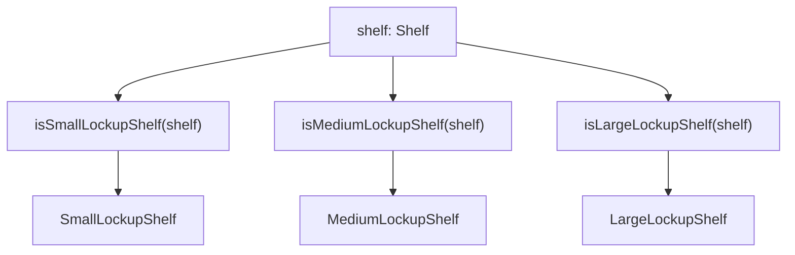
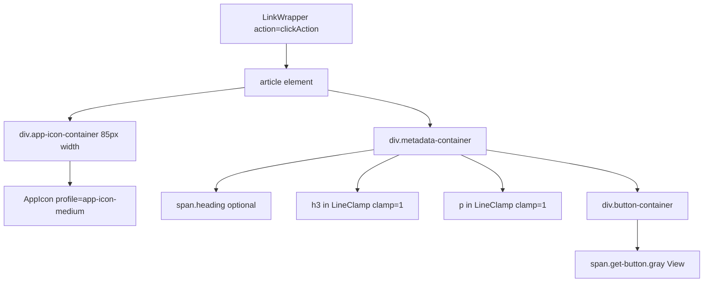
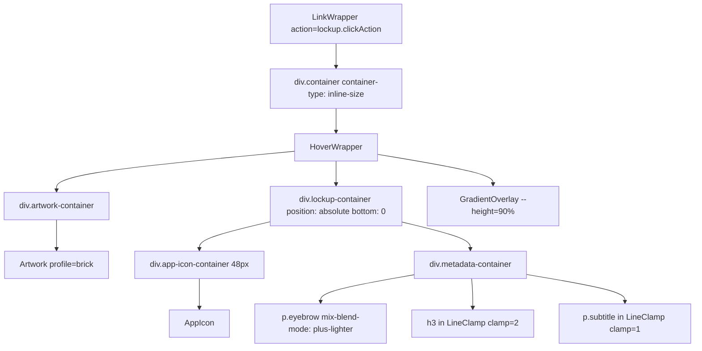
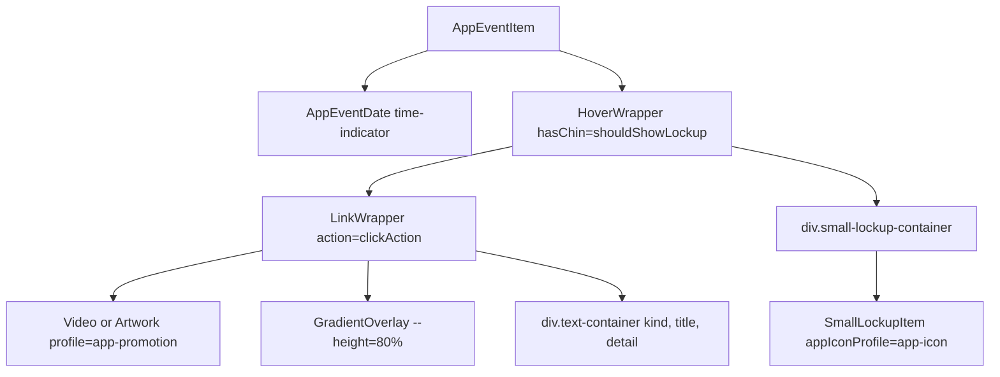
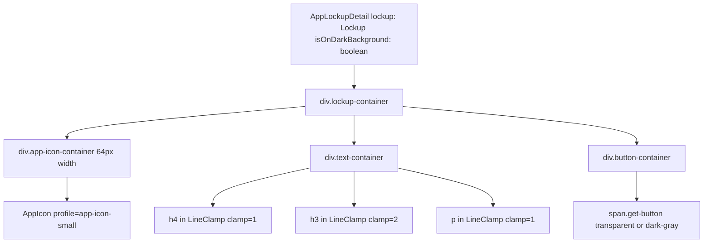

# 锁定与网格货架 (Lockup and Grid Shelves)

-   [src/components/hero/AppLockupDetail.svelte](https://github.com/Chesszyh/apps.apple.com/blob/279d0c4d/src/components/hero/AppLockupDetail.svelte)
-   [src/components/jet/item/AppEventItem.svelte](https://github.com/Chesszyh/apps.apple.com/blob/279d0c4d/src/components/jet/item/AppEventItem.svelte)
-   [src/components/jet/item/MediumImageLockupItem.svelte](https://github.com/Chesszyh/apps.apple.com/blob/279d0c4d/src/components/jet/item/MediumImageLockupItem.svelte)
-   [src/components/jet/item/MediumLockupItem.svelte](https://github.com/Chesszyh/apps.apple.com/blob/279d0c4d/src/components/jet/item/MediumLockupItem.svelte)
-   [src/components/jet/shelf/AppEventDetailShelf.svelte](https://github.com/Chesszyh/apps.apple.com/blob/279d0c4d/src/components/jet/shelf/AppEventDetailShelf.svelte)
-   [src/components/jet/shelf/Shelf.svelte](https://github.com/Chesszyh/apps.apple.com/blob/279d0c4d/src/components/jet/shelf/Shelf.svelte)

本文档涵盖了锁定 (lockup) 和网格货架系列，这些是 App Store 中用于显示 App 和内容列表的主要货架类型。这些货架以各种尺寸和布局配置渲染水平可滚动的 App、游戏和其他内容集合。

**范围**：本页面记录了锁定货架（小、中、大变体）、砖块货架（网格布局）、图像锁定货架（以艺术资产为背景的锁定项）以及专门的锁定类型。有关编辑和推广内容，请参阅 [Editorial and Promotional Shelves](#7.1)。有关水平滚动机制，请参阅 [Scrollable Shelves](#5.2)。

---

## 概览 (Overview)

锁定与网格货架构成了 App Store 内容呈现的支柱。它们遵循一致的模式：

1.  **货架组件 (Shelf Component)** - 在 `ShelfWrapper` 中包装项目，并使用通用的 `Shelf` 滚动组件。
2.  **类型守卫 (Type Guard)** - 将泛型 `Shelf` 类型缩小为特定的货架接口。
3.  **项目组件 (Item Component)** - 渲染货架内的单个项目。
4.  **数据模型 (Data Model)** - 定义货架和项目数据的结构。

```mermaid
flowchart TD
    GenericShelf["Shelf.svelte Generic Dispatcher"]
    SmallLS["SmallLockupShelf"]
    MediumLS["MediumLockupShelf"]
    LargeLS["LargeLockupShelf"]
    SmallLI["SmallLockupItem"]
    MediumLI["MediumLockupItem"]
    LargeLI["LargeLockupItem"]
    BrickS["BrickShelf"]
    SmallBS["SmallBrickShelf"]
    LargeBS["LargeBrickShelf"]
    CategoryBS["CategoryBrickShelf"]
    BrickItem["BrickItem"]
    MediumILS["MediumImageLockupShelf"]
    LargeILS["LargeImageLockupShelf"]
    MediumILI["MediumImageLockupItem"]
    LargeILI["LargeImageLockupItem"]
    PosterLS["PosterLockupShelf"]
    InAppLS["InAppPurchaseLockupShelf"]
    TrailerLS["AppTrailerLockupShelf"]

    GenericShelf --> SmallLS
    GenericShelf --> MediumLS
    GenericShelf --> LargeLS
    GenericShelf --> BrickS
    GenericShelf --> SmallBS
    GenericShelf --> LargeBS
    GenericShelf --> CategoryBS
    GenericShelf --> MediumILS
    GenericShelf --> LargeILS
    GenericShelf --> PosterLS
    GenericShelf --> InAppLS
    GenericShelf --> TrailerLS
    SmallLS --> SmallLI
    MediumLS --> MediumLI
    LargeLS --> LargeLI
    BrickS --> BrickItem
    SmallBS --> BrickItem
    LargeBS --> BrickItem
    CategoryBS --> BrickItem
    MediumILS --> MediumILI
    LargeILS --> LargeILI
```


**来源**：[src/components/jet/shelf/Shelf.svelte1-321](https://github.com/Chesszyh/apps.apple.com/blob/279d0c4d/src/components/jet/shelf/Shelf.svelte#L1-L321)

---

## 锁定货架 (Lockup Shelves)

锁定货架以标准化格式显示 App 信息，包括 App 图标、标题、副标题和可选的操作按钮。它们有三种尺寸变体，在图标大小和元数据密度上有所不同。

### 组件注册 (Component Registration)

货架分发器使用类型守卫将泛型 `Shelf` 对象路由到其特定的实现：


**来源**：[src/components/jet/shelf/Shelf.svelte133-135](https://github.com/Chesszyh/apps.apple.com/blob/279d0c4d/src/components/jet/shelf/Shelf.svelte#L133-L135) [src/components/jet/shelf/Shelf.svelte88-90](https://github.com/Chesszyh/apps.apple.com/blob/279d0c4d/src/components/jet/shelf/Shelf.svelte#L88-L90) [src/components/jet/shelf/Shelf.svelte72-74](https://github.com/Chesszyh/apps.apple.com/blob/279d0c4d/src/components/jet/shelf/Shelf.svelte#L72-L74) [src/components/jet/shelf/Shelf.svelte298-299](https://github.com/Chesszyh/apps.apple.com/blob/279d0c4d/src/components/jet/shelf/Shelf.svelte#L298-L299) [src/components/jet/shelf/Shelf.svelte262-263](https://github.com/Chesszyh/apps.apple.com/blob/279d0c4d/src/components/jet/shelf/Shelf.svelte#L262-L263) [src/components/jet/shelf/Shelf.svelte252-253](https://github.com/Chesszyh/apps.apple.com/blob/279d0c4d/src/components/jet/shelf/Shelf.svelte#L252-L253)

### SmallLockupShelf

渲染小型锁定项目的水平可滚动列表。这是最紧凑的锁定格式，通常用于密集的 App 列表。

**关键特征**：

-   最小的图标尺寸（通过 `app-icon` 配置文件设置为 64px）
-   单行标题和副标题
-   紧凑的 "获取" 或 "查看" 按钮
-   常用于搜索结果和 "开发者更多作品" 部分

**数据模型**：包含一个 `Lockup` 项目数组，其中包含：

-   `icon` - App 图标艺术资产
-   `heading` - 可选的标语 (Eyebrow) 文本
-   `title` - App 名称
-   `subtitle` - 开发者或类别
-   `clickAction` - 导航操作（通常是 `FlowAction`）

**来源**：[src/components/jet/shelf/Shelf.svelte133-135](https://github.com/Chesszyh/apps.apple.com/blob/279d0c4d/src/components/jet/shelf/Shelf.svelte#L133-L135) [src/components/jet/shelf/Shelf.svelte298-299](https://github.com/Chesszyh/apps.apple.com/blob/279d0c4d/src/components/jet/shelf/Shelf.svelte#L298-L299)

### MediumLockupShelf

中型锁定格式，平衡了信息密度与视觉突出度。

**项目组件结构** (`MediumLockupItem.svelte`)：


**布局**：

-   图标尺寸：85px
-   标题：使用 `LineClamp` 组件进行单行截断
-   副标题：单行截断，使用次要颜色
-   按钮：灰色“查看”按钮，仅当 `clickAction` 为 `FlowAction` 类型时显示

**来源**：[src/components/jet/item/MediumLockupItem.svelte1-97](https://github.com/Chesszyh/apps.apple.com/blob/279d0c4d/src/components/jet/item/MediumLockupItem.svelte#L1-L97) [src/components/jet/shelf/Shelf.svelte88-90](https://github.com/Chesszyh/apps.apple.com/blob/279d0c4d/src/components/jet/shelf/Shelf.svelte#L88-L90) [src/components/jet/shelf/Shelf.svelte262-263](https://github.com/Chesszyh/apps.apple.com/blob/279d0c4d/src/components/jet/shelf/Shelf.svelte#L262-L263)

### LargeLockupShelf

最大的锁定格式，提供最大的视觉突出度和元数据空间。

**关键特征**：

-   最大的图标尺寸
-   支持多行标题（2 行）
-   额外的元数据字段
-   显著的操作按钮
-   常用于特色 App 和排行榜

**来源**：[src/components/jet/shelf/Shelf.svelte72-74](https://github.com/Chesszyh/apps.apple.com/blob/279d0c4d/src/components/jet/shelf/Shelf.svelte#L72-L74) [src/components/jet/shelf/Shelf.svelte252-253](https://github.com/Chesszyh/apps.apple.com/blob/279d0c4d/src/components/jet/shelf/Shelf.svelte#L252-L253)

### 通用锁定模式 (Common Lockup Patterns)

所有锁定变体都遵循这些模式：

| 特性 | 实现 |
| --- | --- |
| **图标渲染** | 具有特定尺寸配置文件的 `AppIcon` 组件 |
| **文本截断** | 用于处理溢出的 `LineClamp` 组件 |
| **导航** | 包装整个项目的 `LinkWrapper` |
| **操作提取** | 检查 `clickAction` 是否为 `FlowAction` 类型 |
| **响应式字体** | CSS 自定义属性 (`--title-3`, `--callout`) |
| **无障碍性** | 语义化 HTML (`<article>`, `<h3>`, `<p>`) |

**操作处理示例** (来自 `MediumLockupItem.svelte`)：

```
const { clickAction } = item;const destination: Opt<FlowAction> = isFlowAction(clickAction)    ? clickAction    : undefined;
```
这种模式确保按钮仅为可导航项目渲染。

**来源**：[src/components/jet/item/MediumLockupItem.svelte18-21](https://github.com/Chesszyh/apps.apple.com/blob/279d0c4d/src/components/jet/item/MediumLockupItem.svelte#L18-L21) [src/components/jet/item/MediumLockupItem.svelte51-57](https://github.com/Chesszyh/apps.apple.com/blob/279d0c4d/src/components/jet/item/MediumLockupItem.svelte#L51-L57)

---

## 砖块货架 (Brick Shelves)

砖块货架以网格状布局显示带有艺术资产瓷砖的内容。它们针对游戏、集合和编辑内容的视觉浏览进行了优化。

### BrickShelf

具有方形或矩形瓷砖的标准砖块布局。

**类型守卫注册**：

```
{:else if isBrickShelf(shelf)}
    <BrickShelf {shelf} />
```
**常用场景**：

-   游戏集合
-   Today 标签页编辑内容
-   类别浏览
-   主题集合

**来源**：[src/components/jet/shelf/Shelf.svelte36-38](https://github.com/Chesszyh/apps.apple.com/blob/279d0c4d/src/components/jet/shelf/Shelf.svelte#L36-L38) [src/components/jet/shelf/Shelf.svelte228-229](https://github.com/Chesszyh/apps.apple.com/blob/279d0c4d/src/components/jet/shelf/Shelf.svelte#L228-L229)

### SmallBrickShelf

用于更密集内容展示的紧凑型砖块布局。

**类型守卫注册**：

```
{:else if isSmallBrickShelf(shelf)}
    <SmallBrickShelf {shelf} />
```
**特征**：

-   更小的瓷砖尺寸
-   更高的内容密度
-   常用于子集合或次要内容

**来源**：[src/components/jet/shelf/Shelf.svelte130-132](https://github.com/Chesszyh/apps.apple.com/blob/279d0c4d/src/components/jet/shelf/Shelf.svelte#L130-L132) [src/components/jet/shelf/Shelf.svelte294-295](https://github.com/Chesszyh/apps.apple.com/blob/279d0c4d/src/components/jet/shelf/Shelf.svelte#L294-L295)

### LargeBrickShelf

用于显著内容展示的大型砖块布局。

**类型守卫注册**：

```
{:else if isLargeBrickShelf(shelf)}
    <LargeBrickShelf {shelf} />
```
**特征**：

-   更大的瓷砖尺寸
-   增强的视觉显著性
-   精选集合和英雄内容

**来源**：[src/components/jet/shelf/Shelf.svelte66-68](https://github.com/Chesszyh/apps.apple.com/blob/279d0c4d/src/components/jet/shelf/Shelf.svelte#L66-L68) [src/components/jet/shelf/Shelf.svelte248-249](https://github.com/Chesszyh/apps.apple.com/blob/279d0c4d/src/components/jet/shelf/Shelf.svelte#L248-L249)

### CategoryBrickShelf

专用于类别浏览的特定砖块货架。

**类型守卫注册**：

```
{:else if isCategoryBrickShelf(shelf)}
    <CategoryBrickShelf {shelf} />
```
**用途**：浏览页面上的顶级类别导航。

**来源**：[src/components/jet/shelf/Shelf.svelte39-41](https://github.com/Chesszyh/apps.apple.com/blob/279d0c4d/src/components/jet/shelf/Shelf.svelte#L39-L41) [src/components/jet/shelf/Shelf.svelte230-231](https://github.com/Chesszyh/apps.apple.com/blob/279d0c4d/src/components/jet/shelf/Shelf.svelte#L230-L231)

### 砖块项目组件 (Brick Item Component)

所有砖块货架均渲染 `BrickItem` 组件。有关砖块项目的详细文档，请参阅 [Content Cards](#5.3)。

---

## 图像锁定货架 (Image Lockup Shelves)

图像锁定货架将艺术资产背景与锁定项元数据相结合，通过渐变叠加层创造出视觉丰富的 App 展示效果。

### MediumImageLockupShelf

中型图像锁定格式。

**类型守卫注册**：

```
{:else if isMediumImageLockupShelf(shelf)}
    <MediumImageLockupShelf {shelf} />
```
**来源**：[src/components/jet/shelf/Shelf.svelte85-87](https://github.com/Chesszyh/apps.apple.com/blob/279d0c4d/src/components/jet/shelf/Shelf.svelte#L85-L87) [src/components/jet/shelf/Shelf.svelte260-261](https://github.com/Chesszyh/apps.apple.com/blob/279d0c4d/src/components/jet/shelf/Shelf.svelte#L260-L261)

### MediumImageLockupItem 组件 (MediumImageLockupItem Component)

该项目组件演示了图像锁定模式：


**关键特性**：

| 特性 | 实现 |
| --- | --- |
| **背景艺术资产** | 使用 `brick` 配置文件的全屏 `Artwork` 组件 |
| **渐变叠加层** | 位于 90% 高度处的 `GradientOverlay`，确保文本可读性 |
| **颜色适配** | `isDark` 属性控制文本颜色（暗色背景 vs 亮色背景） |
| **容器查询** | 根据容器宽度调整内边距（260px 断点） |
| **绝对定位** | 锁定项叠加在艺术资产底部 |
| **悬停效果** | `HoverWrapper` 提供交互反馈 |

**颜色提取与应用**：

```
const color: string = item.artwork.backgroundColor    ? colorAsString(item.artwork.backgroundColor)    : '#000';
```
从艺术资产中提取背景颜色并传递给 `GradientOverlay` 组件。

**响应式内边距**（容器查询）：

```
@container container (max-width: 260px) {    .lockup-container {        padding: 0 10px 10px;    }}
```
**来源**：[src/components/jet/item/MediumImageLockupItem.svelte1-119](https://github.com/Chesszyh/apps.apple.com/blob/279d0c4d/src/components/jet/item/MediumImageLockupItem.svelte#L1-L119)

### LargeImageLockupShelf

用于显著位置的大型图像锁定格式。

**类型守卫注册**：

```
{:else if isLargeImageLockupShelf(shelf)}
    <LargeImageLockupShelf {shelf} />
```
**特征**：

-   更大的尺寸
-   更显著的艺术资产展示
-   增强的视觉层级

**来源**：[src/components/jet/shelf/Shelf.svelte69-71](https://github.com/Chesszyh/apps.apple.com/blob/279d0c4d/src/components/jet/shelf/Shelf.svelte#L69-L71) [src/components/jet/shelf/Shelf.svelte250-251](https://github.com/Chesszyh/apps.apple.com/blob/279d0c4d/src/components/jet/shelf/Shelf.svelte#L250-L251)

---

## 专门的锁定货架 (Specialized Lockup Shelves)

### PosterLockupShelf

专用于海报风格内容展示的特定锁定货架。

**类型守卫注册**：

```
{:else if isPosterLockupShelf(shelf)}
    <PosterLockupShelf {shelf} />
```
**用途**：电影/电视内容，纵向艺术资产展示。

**来源**：[src/components/jet/shelf/Shelf.svelte103-105](https://github.com/Chesszyh/apps.apple.com/blob/279d0c4d/src/components/jet/shelf/Shelf.svelte#L103-L105) [src/components/jet/shelf/Shelf.svelte266-267](https://github.com/Chesszyh/apps.apple.com/blob/279d0c4d/src/components/jet/shelf/Shelf.svelte#L266-L267)

### InAppPurchaseLockupShelf

在产品页面内显示 App 内购买项目。

**类型守卫注册**：

```
{:else if isInAppPurchaseLockupShelf(shelf)}
    <InAppPurchaseLockupShelf {shelf} />
```
**上下文**：显示可用 IAP 的产品详情页面。

**来源**：[src/components/jet/shelf/Shelf.svelte60-62](https://github.com/Chesszyh/apps.apple.com/blob/279d0c4d/src/components/jet/shelf/Shelf.svelte#L60-L62) [src/components/jet/shelf/Shelf.svelte244-245](https://github.com/Chesszyh/apps.apple.com/blob/279d0c4d/src/components/jet/shelf/Shelf.svelte#L244-L245)

### AppTrailerLockupShelf

显示 App 预告片视频及其锁定信息。

**类型守卫注册**：

```
{:else if isAppTrailerLockupShelf(shelf)}
    <AppTrailerLockupShelf {shelf} />
```
**特性**：

-   集成视频预览
-   App 元数据叠加
-   产品页面上下文

**来源**：[src/components/jet/shelf/Shelf.svelte29-31](https://github.com/Chesszyh/apps.apple.com/blob/279d0c4d/src/components/jet/shelf/Shelf.svelte#L29-L31) [src/components/jet/shelf/Shelf.svelte221-222](https://github.com/Chesszyh/apps.apple.com/blob/279d0c4d/src/components/jet/shelf/Shelf.svelte#L221-L222)

---

## 锁定项在特定上下文中的应用：AppEventItem

`AppEventItem` 组件演示了锁定组件如何在专门的上下文中被复用：


**锁定的有条件渲染**：

```
$: shouldShowLockup = !!item.lockup && !item.hideLockupWhenNotInstalled;
```
锁定项显示在主事件艺术资产下方的“下巴 (chin)”区域中，亮色模式下具有白色背景，暗色模式下使用 `systemQuinary-onDark`。

**来源**：[src/components/jet/item/AppEventItem.svelte1-177](https://github.com/Chesszyh/apps.apple.com/blob/279d0c4d/src/components/jet/item/AppEventItem.svelte#L1-L177) [src/components/jet/item/AppEventItem.svelte22](https://github.com/Chesszyh/apps.apple.com/blob/279d0c4d/src/components/jet/item/AppEventItem.svelte#L22-L22) [src/components/jet/item/AppEventItem.svelte80-84](https://github.com/Chesszyh/apps.apple.com/blob/279d0c4d/src/components/jet/item/AppEventItem.svelte#L80-L84) [src/components/jet/item/AppEventItem.svelte153-163](https://github.com/Chesszyh/apps.apple.com/blob/279d0c4d/src/components/jet/item/AppEventItem.svelte#L153-L163)

---

## 英雄上下文中的锁定：AppLockupDetail

`AppLockupDetail` 组件展示了锁定项如何在英雄轮播中进行渲染：

**组件结构**：


**颜色适配**：

-   使用 CSS 自定义属性：`--hero-primary-color`、`--hero-secondary-color`、`--hero-divider-color`。
-   默认使用暗黑模式颜色（`onDark` 变体）。
-   `isOnDarkBackground` 属性控制按钮样式（透明 vs 深灰色）。

**文本样式**：

-   页眉使用 `mix-blend-mode: var(--hero-text-blend-mode, plus-lighter)`。
-   副标题也使用了混合模式，以便在各种背景上获得更好的可见性。

**响应式行为**：

```
@media (--range-xsmall-down) {    .lockup-container {        text-align: left;        padding: 20px 0 10px;        max-width: unset;    }}
```
**来源**：[src/components/hero/AppLockupDetail.svelte1-110](https://github.com/Chesszyh/apps.apple.com/blob/279d0c4d/src/components/hero/AppLockupDetail.svelte#L1-L110)

---

## 与水平滚动的集成 (Integration with Horizontal Scrolling)

所有锁定与砖块货架都与通用的 `Shelf` 组件集成，以实现水平滚动。典型模式如下：

1.  **货架组件**：在通用滚动组件中包装项目。
2.  **项目数组**：传递给滚动器。
3.  **导航**：自动处理。
4.  **曝光追踪**：通过 IntersectionObserver 进行。

有关详细的滚动机制，请参阅 [Scrollable Shelves](#5.2)。

**典型货架实现模式**：

```
<ShelfWrapper {shelf}>    <Shelf items={shelf.items}>        <svelte:fragment slot="item" let:item>            <MediumLockupItem {item} />        </svelte:fragment>    </Shelf></ShelfWrapper>
```
---

## 数据模型总结 (Data Model Summary)

### Lockup 接口

所有锁定项共享一个通用的 `Lockup` 接口：

| 字段 | 类型 | 用途 |
| --- | --- | --- |
| `icon` | `Artwork` | App 图标图像 |
| `heading` | `string`（可选） | 标语文本（例如类别、开发者） |
| `title` | `string` | 主要文本（App 名称） |
| `subtitle` | `string`（可选） | 次要文本（开发者、描述） |
| `clickAction` | `Action` | 导航操作（通常是 `FlowAction`） |

### ImageLockup 接口

使用艺术资产扩展了锁定模式：

| 字段 | 类型 | 用途 |
| --- | --- | --- |
| `artwork` | `Artwork` | 背景图像 |
| `lockup` | `Lockup` | 叠加的 App 信息 |
| `isDark` | `boolean` | 控制文本颜色（暗色背景 vs 亮色背景） |

**来源**：[src/components/jet/item/MediumLockupItem.svelte14](https://github.com/Chesszyh/apps.apple.com/blob/279d0c4d/src/components/jet/item/MediumLockupItem.svelte#L14-L14) [src/components/jet/item/MediumImageLockupItem.svelte12](https://github.com/Chesszyh/apps.apple.com/blob/279d0c4d/src/components/jet/item/MediumImageLockupItem.svelte#L12-L12)

---

## 类型守卫模式 (Type Guard Pattern)

所有货架类型都遵循类型守卫模式进行类型缩小：

1.  **导出类型守卫函数**：每个货架组件导出对应的 `is*Shelf()` 函数。
2.  **在分发器中导入**：`Shelf.svelte` 同时导入组件和类型守卫。
3.  **有条件渲染**：在 `{#if}` 链中使用类型守卫进行类型缩小。
4.  **组件渲染**：将缩小后的货架传递给特定的组件。

**分发器示例**：

```
import MediumLockupShelf, {    isMediumLockupShelf,} from '~/components/jet/shelf/MediumLockupShelf.svelte';...{:else if isMediumLockupShelf(shelf)}    <MediumLockupShelf {shelf} />
```
这种模式支持使用 TypeScript 推断进行类型安全渲染。

**来源**：[src/components/jet/shelf/Shelf.svelte88-90](https://github.com/Chesszyh/apps.apple.com/blob/279d0c4d/src/components/jet/shelf/Shelf.svelte#L88-L90) [src/components/jet/shelf/Shelf.svelte262-263](https://github.com/Chesszyh/apps.apple.com/blob/279d0c4d/src/components/jet/shelf/Shelf.svelte#L262-L263)
