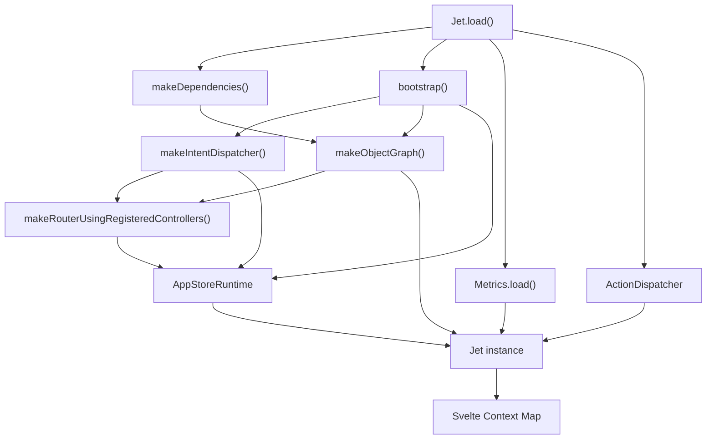
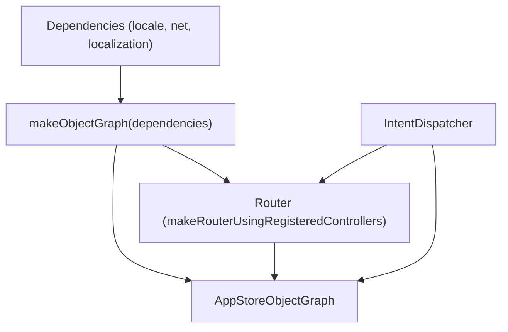

# Jet 应用程序核心 (Jet Application Core)

-   [src/jet/action-handlers/browser.ts](https://github.com/Chesszyh/apps.apple.com/blob/279d0c4d/src/jet/action-handlers/browser.ts)
-   [src/jet/action-handlers/compound-action.ts](https://github.com/Chesszyh/apps.apple.com/blob/279d0c4d/src/jet/action-handlers/compound-action.ts)
-   [src/jet/action-handlers/external-url-action.ts](https://github.com/Chesszyh/apps.apple.com/blob/279d0c4d/src/jet/action-handlers/external-url-action.ts)
-   [src/jet/bootstrap.ts](https://github.com/Chesszyh/apps.apple.com/blob/279d0c4d/src/jet/bootstrap.ts)
-   [src/jet/intents/route-url/route-url-controller.ts](https://github.com/Chesszyh/apps.apple.com/blob/279d0c4d/src/jet/intents/route-url/route-url-controller.ts)
-   [src/jet/intents/route-url/route-url-intent.ts](https://github.com/Chesszyh/apps.apple.com/blob/279d0c4d/src/jet/intents/route-url/route-url-intent.ts)
-   [src/jet/intents/static-message-pages/carrier-page-intent-controller.ts](https://github.com/Chesszyh/apps.apple.com/blob/279d0c4d/src/jet/intents/static-message-pages/carrier-page-intent-controller.ts)
-   [src/jet/intents/static-message-pages/contingent-price-page-intent-controller.ts](https://github.com/Chesszyh/apps.apple.com/blob/279d0c4d/src/jet/intents/static-message-pages/contingent-price-page-intent-controller.ts)
-   [src/jet/intents/static-message-pages/invoice-page-intent-controller.ts](https://github.com/Chesszyh/apps.apple.com/blob/279d0c4d/src/jet/intents/static-message-pages/invoice-page-intent-controller.ts)
-   [src/jet/jet.ts](https://github.com/Chesszyh/apps.apple.com/blob/279d0c4d/src/jet/jet.ts)
-   [src/jet/models/external-action.ts](https://github.com/Chesszyh/apps.apple.com/blob/279d0c4d/src/jet/models/external-action.ts)
-   [src/jet/svelte.ts](https://github.com/Chesszyh/apps.apple.com/blob/279d0c4d/src/jet/svelte.ts)

## 目的与范围 (Purpose and Scope)

Jet 应用程序核心是 App Store Web 应用程序的基础，提供引导 (bootstrapping)、依赖注入、意图分发 (intent dispatching)、操作处理 (action handling) 和指标集成。本页面记录了初始化生命周期、用于依赖管理的“对象图 (object graph)”模式，以及支持导航和用户交互的分发机制。

有关特定意图类型和 URL 路由模式的信息，请参阅 [Intent and Action System](#2.2)。有关组件级架构模式的信息，请参阅 [Component Architecture](#2.3)。

---

## 系统概览 (System Overview)

Jet 系统作为中央运行时协调器，管理从初始化到用户交互的应用程序生命周期。`Jet` 类暴露了主要的 API 表面，而引导过程建立了运行时环境和依赖图。


**来源：** [src/jet/jet.ts76-132](https://github.com/Chesszyh/apps.apple.com/blob/279d0c4d/src/jet/jet.ts#L76-L132) [src/jet/bootstrap.ts105-125](https://github.com/Chesszyh/apps.apple.com/blob/279d0c4d/src/jet/bootstrap.ts#L105-L125)

---

## Jet 类：核心 API (Jet Class: Core API)

`Jet` 类提供了与应用程序运行时交互的主要接口。它封装了意图分发器、操作分发器、指标流水线和区域设置 (locale) 管理器。

### 关键组件 (Key Components)

| 组件 | 类型 | 用途 |
| --- | --- | --- |
| `runtime` | `AppStoreRuntime` | 通过注册的控制器分发意图 |
| `objectGraph` | `AppStoreObjectGraph` | 依赖注入容器 |
| `actionDispatcher` | `ActionDispatcher` | 处理操作执行和指标 |
| `metrics` | `Metrics` | 指标收集和处理流水线 |
| `locale` | `Locale` | 当前店面和语言配置 |
| `prefetchedIntents` | `PrefetchedIntents` | 来自 SSR 的缓存意图结果 |
| `localization` | `WebLocalization` | I18N 字符串提供程序 |

### 静态工厂：Jet.load() (Static Factory: Jet.load())

`Jet.load()` 静态方法初始化整个系统，创建所有依赖项并将它们连接在一起。

> **[Mermaid sequence]**
> *(图表结构无法解析)*

**初始化参数：**

-   `loggerFactory`: 为子系统创建日志记录器实例
-   `context`: Svelte 上下文 `Map<string, unknown>`，用于组件访问
-   `fetch`: 全局 fetch 函数（支持 SSR 模拟注入）
-   `prefetchedIntents`: 可选的预解析意图缓存，用于激活 (hydration)
-   `featuresCallbacks`: 可选的功能标志回调

**来源：** [src/jet/jet.ts76-132](https://github.com/Chesszyh/apps.apple.com/blob/279d0c4d/src/jet/jet.ts#L76-L132)

---

## 引导过程 (Bootstrap Process)

引导函数通过创建意图分发器、注册所有控制器、构建路由以及组装对象图来建立运行时环境。

### 意图控制器注册 (Intent Controller Registration)

控制器按特定顺序注册到 `AppStoreIntentDispatcher` 中，以处理 URL 模式匹配的优先级：

```mermaid
flowchart TD
    IntentDispatcher["AppStoreIntentDispatcher"]
    RouteUrl["RouteUrlIntentController"]
    LintMetrics["LintMetricsEventIntentController"]
    LandingPages["landingPageNavigationControllers.*"]
    StaticPages["staticMessagePageControllers.*"]
    Arcade["ArcadeGroupingPageIntentController"]
    Bundle["BundlePageIntentController"]
    Editorial["EditorialPageIntentController"]
    Search["SearchResultsPageIntentController"]
    Developer["DeveloperPageIntentController"]
    Charts["ChartsPageIntentController"]
    AppEvent["AppEventPageIntentController"]
    SeeAll["SeeAllPageIntentController"]
    Product["ProductPageIntentController"]
    RootRedirect["RootRedirectController"]
    Note1["First Registered"]
    Note2["Last Registered Matches /{sf}"]

    IntentDispatcher --> RouteUrl
    IntentDispatcher --> LintMetrics
    IntentDispatcher --> LandingPages
    IntentDispatcher --> StaticPages
    IntentDispatcher --> Arcade
    IntentDispatcher --> Bundle
    IntentDispatcher --> Editorial
    IntentDispatcher --> Search
    IntentDispatcher --> Developer
    IntentDispatcher --> Charts
    IntentDispatcher --> AppEvent
    IntentDispatcher --> SeeAll
    IntentDispatcher --> Product
    IntentDispatcher --> RootRedirect
    RouteUrl --> Note1
    RootRedirect --> Note2
```


**注册顺序的重要性：**

1.  **RouteUrlIntentController** 和 **LintMetricsEventIntentController** 作为元控制器首先注册
2.  **落地页控制器** 在 RootRedirectController 之前注册，以匹配特定平台
3.  **产品页面层级** 按以下顺序注册：`AppEventPageIntentController` → `SeeAllPageIntentController` → `ProductPageIntentController`，因为它们的 URL 模式存在重叠
4.  **RootRedirectController** 最后注册，使用通配模式 `/{sf}`

**来源：** [src/jet/bootstrap.ts44-98](https://github.com/Chesszyh/apps.apple.com/blob/279d0c4d/src/jet/bootstrap.ts#L44-L98)

### 对象图组装 (Object Graph Assembly)

对象图分层构建：


最终的对象图包含：

-   基础依赖项（locale、网络客户端、本地化）
-   路由（根据注册的意图控制器构建）
-   意图分发器

**来源：** [src/jet/bootstrap.ts105-125](https://github.com/Chesszyh/apps.apple.com/blob/279d0c4d/src/jet/bootstrap.ts#L105-L125)

---

## 意图分发 (Intent Dispatching)

`dispatch()` 方法将意图路由到其注册的控制器，并支持预取意图优化 (prefetched intent optimization)。

### 分发流程 (Dispatch Flow)

> **[Mermaid sequence]**
> *(图表结构无法解析)*

**预取意图优化：**

在服务器端渲染期间，分发的意图及其结果被序列化。在客户端激活时，这些意图被加载到 `prefetchedIntents` 中，以避免冗余的分发。这消除了重复的 API 调用并加速了初始页面加载。

**来源：** [src/jet/jet.ts182-198](https://github.com/Chesszyh/apps.apple.com/blob/279d0c4d/src/jet/jet.ts#L182-L198) [src/jet/jet.ts55-65](https://github.com/Chesszyh/apps.apple.com/blob/279d0c4d/src/jet/jet.ts#L55-L65)

### 示例：RouteUrlIntent (Example: RouteUrlIntent)

`RouteUrlIntent` 是一个将 URL 解析为页面意图的元意图：

**来源：** [src/jet/intents/route-url/route-url-controller.ts9-28](https://github.com/Chesszyh/apps.apple.com/blob/279d0c4d/src/jet/intents/route-url/route-url-controller.ts#L9-L28) [src/jet/intents/route-url/route-url-intent.ts13-27](https://github.com/Chesszyh/apps.apple.com/blob/279d0c4d/src/jet/intents/route-url/route-url-intent.ts#L13-L27)

---

## 操作分发 (Action Dispatching)

`perform()` 方法使用注册的处理器执行操作，并与指标流水线集成。

### 操作分发机制 (Action Dispatch Mechanism)

**操作注册：**

操作使用 `onAction()` 进行注册，该方法可以防止重复注册：

**来源：** [src/jet/jet.ts207-240](https://github.com/Chesszyh/apps.apple.com/blob/279d0c4d/src/jet/jet.ts#L207-L240) [src/jet/jet.ts248-260](https://github.com/Chesszyh/apps.apple.com/blob/279d0c4d/src/jet/jet.ts#L248-L260)

### 注册的操作处理器 (Registered Action Handlers)

| 操作种类 | 处理器 | 用途 |
| --- | --- | --- |
| `FlowAction` | `flow-action.ts` | 导航到新页面 |
| `ExternalUrlAction` | `external-url-action.ts` | 打开外部 URL |
| `compoundAction` | `compound-action.ts` | 按顺序执行多个操作 |

**CompoundAction 执行：**

CompoundAction 按顺序执行子操作，遇到第一个错误时停止：

**来源：** [src/jet/action-handlers/browser.ts1-16](https://github.com/Chesszyh/apps.apple.com/blob/279d0c4d/src/jet/action-handlers/browser.ts#L1-L16) [src/jet/action-handlers/compound-action.ts10-33](https://github.com/Chesszyh/apps.apple.com/blob/279d0c4d/src/jet/action-handlers/compound-action.ts#L10-L33) [src/jet/action-handlers/external-url-action.ts10-19](https://github.com/Chesszyh/apps.apple.com/blob/279d0c4d/src/jet/action-handlers/external-url-action.ts#L10-L19)

---

## 通过对象图进行依赖注入 (Dependency Injection via Object Graph)

`AppStoreObjectGraph` 通过构建器模式提供类型安全的依赖访问。依赖项使用 `.adding(key, value)` 添加，并使用 `.get(key)` 检索。

### 对象图结构 (Object Graph Structure)

**意图控制器访问模式：**

控制器接收对象图并使用类型化的访问器提取依赖项。来自静态消息页面控制器的示例：

```
// 来自 CarrierPageIntentControllerasync perform(intent, objectGraphWithoutActiveIntent: AppStoreObjectGraph) {    return await withActiveIntent(        objectGraphWithoutActiveIntent,        intent,        async (objectGraph) => {            // 对象图现在已经注入了活动的意图            // 可以访问：objectGraph.locale, objectGraph.net, 等等。            const page = new StaticMessagePage({...});            page.canonicalURL = makeCanonicalUrl(objectGraph, intent);            injectWebNavigation(objectGraph, page, intent.platform);            return page;        },    );}
```
**来源：** [src/jet/bootstrap.ts111-119](https://github.com/Chesszyh/apps.apple.com/blob/279d0c4d/src/jet/bootstrap.ts#L111-L119) [src/jet/intents/static-message-pages/carrier-page-intent-controller.ts24-40](https://github.com/Chesszyh/apps.apple.com/blob/279d0c4d/src/jet/intents/static-message-pages/carrier-page-intent-controller.ts#L24-L40)

---

## 区域设置管理 (Locale Management)

`setLocale()` 方法在整个应用程序中传播区域设置信息，更新所有 Jet 组件引用的共享 `Locale` 依赖项。

### 区域设置传播 (Locale Propagation)

`Locale` 对象是可变的，并在所有依赖项之间共享。当 `setLocale()` 被调用时：

1.  使用 I18N 本地化器实例更新 `locale.i18n`
2.  使用店面和语言调用 `locale.setActiveLocale()`
3.  所有引用 `objectGraph.locale` 的依赖项都能看到更新后的值

**来源：** [src/jet/jet.ts298-305](https://github.com/Chesszyh/apps.apple.com/blob/279d0c4d/src/jet/jet.ts#L298-L305)

---

## Svelte 上下文集成 (Svelte Context Integration)

Jet 实例存储在 Svelte 的上下文系统中，允许组件在不进行属性钻取 (prop drilling) 的情况下访问它。

### 上下文访问模式 (Context Access Pattern)

**辅助函数：**

| 函数 | 用途 | 返回 |
| --- | --- | --- |
| `getJet()` | 从 Svelte 上下文中检索 Jet | `Jet` |
| `getJetPerform()` | 返回绑定的 `jet.perform()` 函数 | `(action) => Promise<ActionOutcome>` |

**使用示例：**

```
// 在任何 Svelte 组件中import { getJet } from '~/jet/svelte';const jet = getJet();await jet.dispatch(someIntent);await jet.perform(someAction);
```
**来源：** [src/jet/svelte.ts8-45](https://github.com/Chesszyh/apps.apple.com/blob/279d0c4d/src/jet/svelte.ts#L8-L45) [src/jet/jet.ts129](https://github.com/Chesszyh/apps.apple.com/blob/279d0c4d/src/jet/jet.ts#L129-L129)

---

## 指标集成 (Metrics Integration)

Jet 系统通过以下方式与指标流水线紧密集成：

1.  使用自定义 `processEvent` 回调进行 **Metrics.load()** 初始化
2.  使用 `MetricsPipeline` 构建 **ActionDispatcher**
3.  用于页面转换的 **didEnterPage()** 生命周期方法
4.  操作分发期间的 **MetricsBehavior** 配置

### 指标事件处理 (Metrics Event Processing)

`processEvent` 回调创建了一个循环依赖，其中指标处理分发一个 Jet 意图 (`LintMetricsEventIntent`)，以便在记录之前对事件进行归一化和验证。

**来源：** [src/jet/jet.ts97-110](https://github.com/Chesszyh/apps.apple.com/blob/279d0c4d/src/jet/jet.ts#L97-L110)

---

## API 参考 (API Reference)

### Jet 类方法 (Jet Class Methods)

| 方法 | 签名 | 描述 |
| --- | --- | --- |
| `Jet.load()` | `(config) => Jet` | 静态工厂，初始化整个系统 |
| `dispatch()` | `<I extends Intent>(intent: I) => Promise<IntentReturnType<I>>` | 将意图分发给控制器 |
| `perform()` | `(action: ActionModel, metricsBehavior?) => Promise<ActionOutcome>` | 通过分发器执行操作 |
| `onAction()` | `(kind: string, implementation: ActionImplementation) => void` | 注册操作处理器 |
| `routeUrl()` | `(url: string) => Promise<RouterResponse | null>` | 将 URL 路由到意图和操作 |
| `setLocale()` | `(localizer, storefront, language) => void` | 更新区域设置配置 |
| `didEnterPage()` | `(page: Page) => Promise<void>` | 通知指标发生了页面转换 |
| `recordCustomMetricsEvent()` | `(fields?) => void` | 发出自定义指标事件 |
| `enableFunnelKit()` | `() => void` | 启用 FunnelKit 记录器 |
| `disableFunnelKit()` | `() => void` | 禁用 FunnelKit 记录器 |

**来源：** [src/jet/jet.ts48-320](https://github.com/Chesszyh/apps.apple.com/blob/279d0c4d/src/jet/jet.ts#L48-L320)

---

## 总结 (Summary)

Jet 应用程序核心提供了：

-   通过 `Jet.load()` 进行的**集中初始化**，将运行时、指标、操作和依赖项连接在一起
-   通过注册控制器模式实现的**意图分发**，并支持 URL 路由
-   具有指标集成和可扩展处理器注册功能的**操作分发**
-   通过不可变对象图构建器模式实现的**依赖注入**
-   通过共享的可变 Locale 依赖项实现的**区域设置管理**
-   使用预取意图缓存实现的 **SSR 优化**
-   通过上下文 API 实现的 **Svelte 集成**，以便组件访问

系统遵循明确的职责分离：引导过程创建基础设施，Jet 类提供公共 API，对象图在整个应用程序生命周期中管理依赖项。
